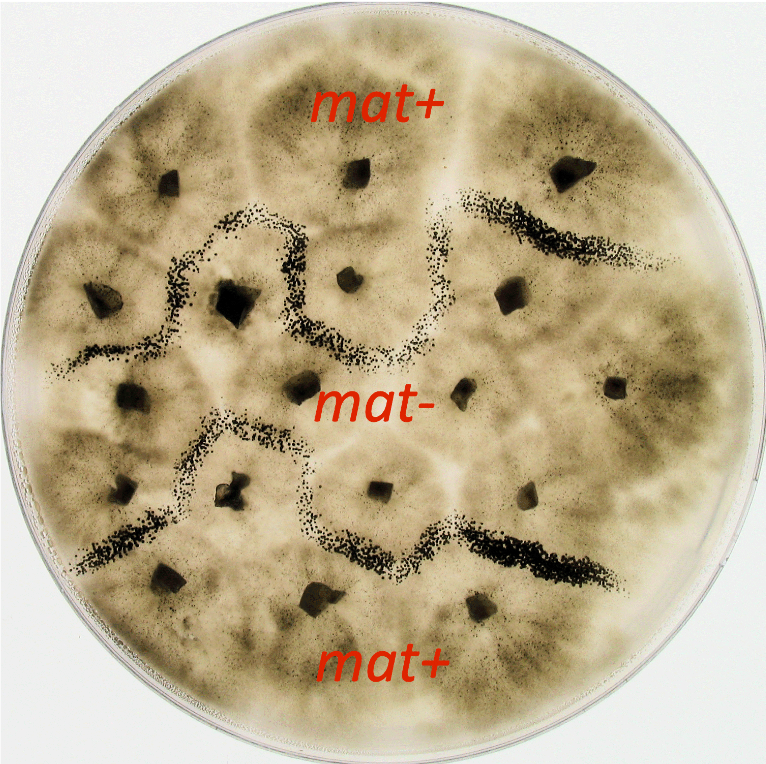

# Génétique : Concepts de base et notions approfondies

## Philippe Silar

Cet ebook visualisable au format HTML ici et téléchargeable au format PDF [ici](https://hal.archives-ouvertes.fr/hal-02921475) reprend et met à jour le contenu du site web précédemment disponible des cours de M. Silar et Mme Gonzy-Treboul de l'Université de Paris 7 Denis Diderot (maintenant Université de Paris). Le contenu pédagogique est celui d'un programme typique de génétique fondamentale et approfondie d'une licence de biologie/biochimie. Le cours rédigé par Mme Gonzy-Treboul a été incorporé et modifié afin d'homogénéiser le livre. Un grand merci à Geneviève pour m'avoir laissé l'utilisation libre de son cours.

