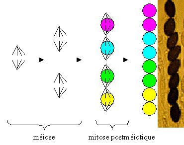
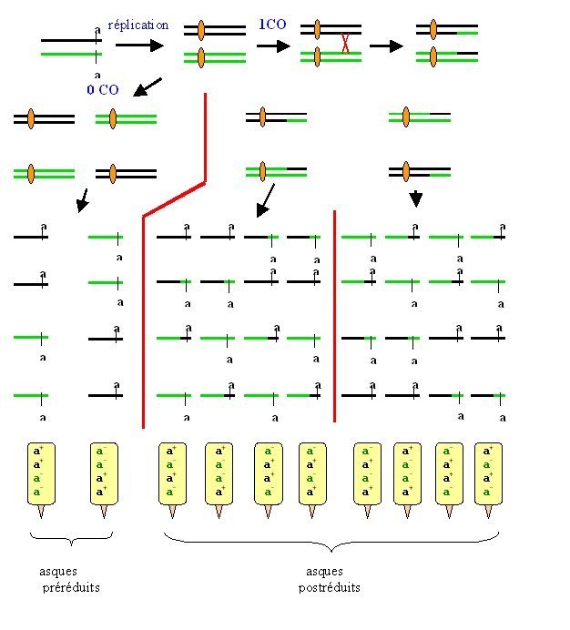
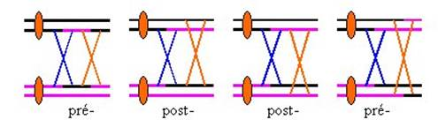
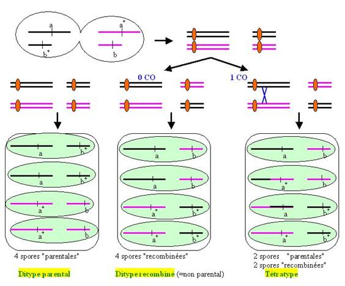
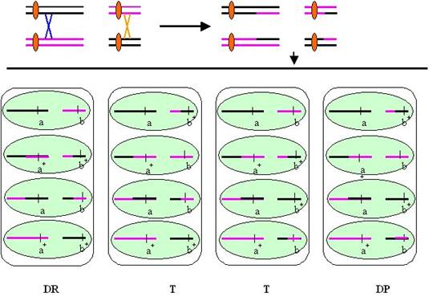
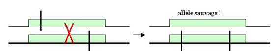
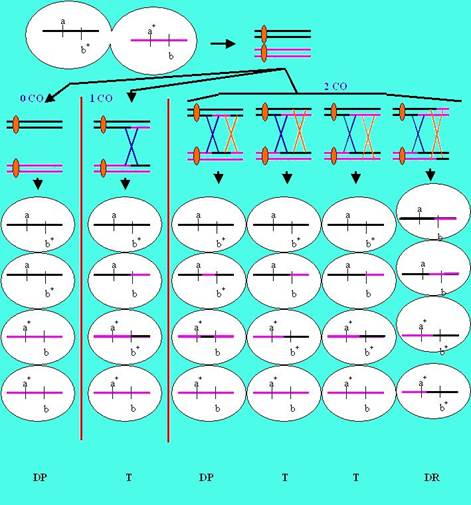

# La ségrégation des gènes au cours des générations dans les champignons

## Neurospora crassa (et les champignons filamenteux ascomycètes)

Nous avons vu dans le chapitre 1, que chez les champignons du type de Neurospora, la structure de l'asque donne directement accès aux phénomènes de ségrégation qui se sont produits au cours de la méiose car ces asques ont une mémoire de l'orientation des fuseaux aux cours de la méiose : on parle d'asques ordonnés. Chez ce champignon, il est donc possible de faire trois types d'analyse, l'analyse de spores en vrac, l'analyse d'asques non ordonnés et l'analyse d'asques ordonnés. Après la méiose chez ce champignon, il se produit une mitose qui conduit à des asques contenant huit spores. Cela n'est pas gênant car les 2 spores issues d'une mitose sont a priori identiques et cote à cote :

Nous allons détailler uniquement ce qu'il se passe dans le cas de l'analyse des asques ordonnés car nous verrons l'analyse de tétrades désordonnées et les spores en vrac dans le cas de la levure. Pour simplifier l'explication et les dessins, nous ne considérerons donc que les produits avant la mitose postméiotique. Schématisons avec 1 gène sur un chromosome ce qui se passe au cours de méiose :

Les asques préréduits sont faciles à repérer car chaque demi-asque est homogène avec soit une spore a+ soit une spore a-, alors que pour les asques postréduits les demi-asques contient une spore avec un allèle et une spore avec l'autre.

- Le premier renseignement que l'on tire est que s'il y a un seul gène alors, il ségrège 2:2 dans chacun des asques (c'est à dire que quatre spores sont a- et quatre spores sont a+)!

Donc, si un caractère ne ségrège pas 2:2 dans chacun des asques c'est qu'il n'est pas codé par un seul gène.

- Deuxièmement, les proportions d'asques préréduits et postréduits dépendent de la fréquence des COs qui se produisent entre le centromère et le gène. On peut calculer la distance entre le gène et le centromère :

d= nb d'asques postréduits/ 2 x le nb total d'asques x 100 cM (car pour chaque asque postréduit, seulement la moitié des chromatides est recombinée).

Que se passe-t-il si le gène est très proche du centromère ?

Dans ce cas, on n'obtient que des asques préréduits, et la distance est nulle.
Que se passe-t-il si le gène est très éloigné de son centromère ?

Dans ce cas, on obtient un mélange d'asques préréduits et postréduits dans une proportion respectivement de 1/3 et 2/3.

En effet,

si 0 CO: 100% d'asques préréduits 
si 1 CO: 100% d'asques postréduits 
si 2 CO: 50 % d'asques préréduits et 50 % d'asques postréduits :

On voit que si on part d'un asque préréduit et que l'on fait 1 CO, on obtient un asque postréduit. Si on part d'un asque postréduit et que l'on fait 1 CO, on obtient dans un cas sur deux un asque postréduit et dans un cas sur deux un asque préréduit. On peut donc construire ainsi la suite suivante:

(% d'asques postréduits )n = (% d'asques préréduits)n-1 + 1/2 (% d'asques postréduits)n-1

et comme (% d'asques préréduits)n-1 = 1- (% d'asques postréduits)n-1, on en déduit que (% d'asques postréduits)n = 1 -1/2 (% d'asques postréduits)n-1

et donc lorsque n est très grand la proportion d'asques postréduits converge vers 2/3 qui est la limite à l'infinie de cette suite.

Donc si le % d'asques postréduits est de 66%, cela veut dire que le gène est éloigné de son centromère est qu'il ségrège indépendamment du centromère ! Attention dans ces conditions, on ne peut pas calculer une distance !!!

En résumé : pour analyser ces asques, on recherche les asques pré- et post-réduits. Puis on calcule le pourcentage de post-réduction qui représente le double de la distance (après la correction par 100 pour avoir des cM !). Sauf, si le pourcentage d'asques postréduits est égal à 66%, car le gène est indépendant de son centromère et on ne peut calculer de distance.

Lorsque plusieurs gènes sont en jeu (ce qui se voit par l'obtention d'asques de type 3:1 ou 4:0), je vous conseille de traiter les données pour chaque gène par rapport à son centromère indépendamment des autres. Ensuite, il faut traiter les gènes deux à deux sous forme d'asques non-ordonnés comme dans le cas de la levure.
 
## Saccharomyces cerevisiae
 
Nous avons vu dans l'introduction que chez les levures du type de S. cerevisiae, il est possible d'observer les résultats de la méiose dans des asques non ordonnés. Ceux-ci contiennent 4 spores d'où leur nom de tétrades. Comme, elles ne sont pas ordonnées, l'information de position par rapport au centromère est perdue. Cette analyse fournit donc moins de renseignements que l'analyse des asques ordonnés.

Comme pour Neurospora si un gène est en jeu dans le croisement, toutes les tétrades ségrègent 2:2 pour les deux allèles du gène. La présence de tétrades 3:1 ou 4:0 est indicatif de la présence de plus d'un gène. 

Si deux gènes sont mis en jeu (comme dans le cas d'un croisement mutant par mutant) alors, l'analyse de tétrades fournit des informations sur la position de ces deux gènes l'un par rapport à l'autre.

exemple :

croisons un mutant a b+ par a+ b. On pet définir les associations parentales qui sont a b+ et a+ b, et les associations recombinées qui sont a b et a+ b+

Si les gènes sont sur des chromosomes différents, ils ségrègent indépendamment au cours du brassage chromosomique et de plus il peut se produire des COs entre les gènes et leur centromère :

Avec 0 CO, comme chaque association de chromosomes est équiprobable au cours de la première division de la méiose, on obtient autant de tétrades avec uniquement des associations parentales dites ditypes parentaux (DP) que de tétrades contenant uniquement des associations recombinées dites ditypes recombinés (DR).

Avec 1 CO entre l'un des gène et son centromère, on obtient uniquement des asques contenant les 4 associations dits tétratypes (T).

Nous allons voir ce qu'il se produit si 2 COs interviennent entre chacun des gènes et leurs centromères respectifs :

Dans le résumé ci dessus, seuls ont été représentés les asques obtenus si les deux chromosomes "du haut" ségrègent ensembles. On obtient les mêmes résultats si ce ne sont pas ces chromosomes qui ségrègent ensembles. Comme chaque association de chromosomes est équiprobable au cours de la première ou de la deuxième division de la méiose, on obtient au total des DRs et des DPs en proportions de 1/4 et des T en proportions de 1/2

Donc, si l'on réunit les résultats obtenus avec 0, 1 ou 2 COS, on obtient au total autant de ditypes parentaux que de ditypes recombinés :

DP = DR

Par contre, la fréquence des tétratypes dépends des COs qui se produisent entre les gènes et leur centromère. Cette fréquence n'est pas informative car elle provient de la combinaison des COs entre (a/a+) et son centromère, (b/b+) et son centromère et une partie des doubles CO entre les deux gènes et leurs centromères respectifs (voir table ci-dessous).

Que se passe-t-il si les gènes sont très éloignés de leurs centromères et que de nombreux crossing-over se produisent ?

Dans ces conditions, le pourcentage maximum de tétratypes plafonne à 2/3. En effet, le tableau suivant donne les types et les fréquences des tétrades désordonnées que l'on observe en fonction des pré- et post-réduction des deux gènes situés sur deux chromosomes différents (faites les schémas !) :

|            | préréduit           | postréduits                    |
|------------|---------------------|--------------------------------|
| préréduit  | 50 % DP  50 % DR | 100 % T                        |
| postréduit | 100 % T             | 25 % DP  50 % T  25 % DR |

et donc si X est la fréquence de postréduction du premier gène et Y la fréquence de postréduction du deuxième gène, la fréquence de tetratype est :

T = Y(1-X) + X (1-Y) + 1/2 XY= X + Y - 3/2 XY

Considérons le cas de deux gènes très éloignés de leurs centromères. C'est la configuration où il se produit le maximum de COs et où X et Y sont les plus élevés. Dans ces conditions, nous avons vu précédemment au cours de l'analyse des asques chez Neurospora qu'ils sont postréduits avec une fréquence de 2/3.

d'où T = 2/3 + 2/3 - 3/2 (2/3 x 2/3) = 2/3

Analysons maintenant ce qui se passe pour la même combinaison génique a+ b x a b+ dans le cas où les deux gènes se trouveraient sur le même chromosome

Un premier cas à considérer, est celui où les "deux gènes" sont en fait un seul et même gène (ce qui peut arriver à l'issue de la mutagenèse et que l'on croise les mutants entre eux) ! Dans ce cas, la descendance est en théorie uniformément mutante ! Mais attention, si les différences entre les deux allèles et l'allèle sauvage ne sont pas localisées au même endroit, il est possible d'obtenir de rares recombinants sauvages après un crossing-over en méiose. On parle alors de recombinaison intragénique :

Si les deux gènes sont sur le même chromosome et sont bien différents, ils ne ségrègent pas indépendamment et il peut se produire des COs. Seuls les CO entre les deux gènes qui se produisent entre les 2 locus sont représentés dans le schéma suivant car ce sont les seuls qui sont informatifs:

On voit que dans ce cas les DP sont beaucoup plus fréquents que les DR car ils sont obtenus soit en absence de CO ou lorsque deux COs qui engagent les mêmes chromatides se produisent. Les DRs ne sont obtenus que dans le cas où les 2 COs engagent les 4 chromatides.

DP > DR

Il est possible de calculer la distance en tenant compte des doubles COs, car les DR provenant uniquement des méioses où se sont produit des doubles COs, ils peuvent servir à estimer le nombre de ces doubles COs.

Après dénombrement et simplification on trouve:

d = (T + 6 DR)/2 x Ntot x 100 cM, où Ntot est le nombre total de tétrades analysées
Que se passe-t-il si la distance entre les deux gènes augmente ?

Comme pour le cas où les deux gènes sont sur des chromosomes différents nous allons voir que DP = DR et que T = 2/3. 
En effet:

si 0 CO: 100% de DP 
si 1 CO: 100% de T 
si 2 CO: 50% de T, 25 % de DP et 25% de DR

On voit donc que si on part d'un DP ou d'un DR et que l'on fait un CO supplémentaire on obtient un T. Et que si on part d'un T, on obtient 1/2 de T et 1/4 de DP et de DR.

On peut alors construire la suite: Tn = DPn-1 + DRn-1 + 1/2 Tn-1 = DPn-1 + 1 - (DPn-1 + Tn-1) + 1/2 Tn-1= 1 -  1/2 Tn-1

D'où la convergence du nombre de T vers 2/3. De même, on voit que DP = DR = 1/6

Donc, pour l'analyse de tétrades, il faut caractériser les DP, DR et T, ensuite deux cas:

- 1°) DP = DR alors les deux gènes sont indépendants

- si la fréquence de tétratypes est inférieure à 66%, les gènes sont sur des chromosomes différents
- si la fréquence de tétratypes est égale à 66%, on ne peut pas conclure

- 2°) DP > DR alors les deux gènes sont liés
on peut calculer la distance d = (T + 6 DR)/2 x Ntot x 100 cM
 
### L'analyse de spores en vrac

Dans certains cas, il n'est pas possible d'effectuer des analyses en asques (par exemple chez certains champignons comme Aspergillus nidulans, les asques sont trop petits pour être récoltés individuellement). Il est évident que l'on peut faire de même pour Neurospora et la levure. Mais, Le fait de ne pas considérer les asques fait que de l'information est perdue (en particulier, on ne peut pas apprécier les douches COs entre deux gènes). Ce type d'analyse fourni moins d'information que l'analyse de tétrades non-ordonnées.

- Si un gène est en jeu au cours du croisement (a x a+), on récupère en théorie 1/2 spores a et 1/2 de spores a+

- Si deux gènes sont en jeu au cours du croisement (a b+ x a+ b) et s'ils sont indépendants, on récupère un quart de chacune des catégories. Par contre un excès de catégories parentales sera indicatif d'une liaison entre les gènes. On pourra alors calculer une distance :

d = nombre de spores recombinante / nombre total de spores x 100 cM

Dans ce cas, l'extrapolation de la distance que nous avons eue plus haut pour tenir compte des COs multiples est souhaitable.
