# Préambule

La génétique occupe une place importante dans notre société. De fait, les médias relaient souvent des découvertes "génétiques" et débattent sur leurs conséquences potentiellement néfastes pour notre vie quotidienne (clonage, OGM, résistance aux antibiotiques ou prions pour citer les plus célèbres). Au contraire, la détermination de la séquence complète du génome humain et celles d'autres organismes a encouragé certains à un optimisme sans borne et à clamer la compréhension complète du vivant via la connaissance de la séquence  de leur génome (et donc la possibilité de soigner rapidement toutes nos  maladies...). L'arrivée des nouvelles technologie de séquençage à haut débit n'a fait que renforcer cette idée: il serait maintenant possible de savoir qui nous sommes et quel sera notre santé future pour environ 500 €, le coût actuel (toujours en décroissance) du séquençage d'un génome humain. Même si les optimistes ont partiellement raison (la génétique a effectivement permis d'identifier un grand nombre de déterminants génétique de maladies), la séquence du génome ne permet de tout expliquer, comme l'a montré l'épigénétique. De plus, ces débats masquent la réalité de la recherche en biologie et le rôle qu'a eu et a toujours la génétique. En effet, il ne faut pas oublier que la génétique est, avec la biochimie, la discipline biologique qui a permis de comprendre comment fonctionne le vivant et son efficacité fait qu'elle est encore largement utilisée dans les laboratoires de recherche.
Si la biochimie s'intéresse principalement à la structure et aux propriétés des molécules biologiques, la génétique s'intéresse à replacer ces même molécules dans le contexte de la cellule, de l'organisme ou des populations. Il va sans dire que seule la jonction des deux disciplines permet une description complète des mécanismes du vivant. C'est vers cette synthèse que la biologie se dirige actuellement, synthèse réalisée par le biais de disciplines qui portent des noms différents (biologie moléculaire, génétique moléculaire ou génomique) mais qui sur le fond utilisent les mêmes méthodes. Il est donc impératif que tout étudiant de biologie/biochimie du niveau de la licence possède des solides notions de cette biologie intégrée afin de comprendre clairement les résultats, les enjeux et les limites de la biologie moderne. 
Par le biais de ce cours, j’ai donc voulu donner aux étudiants de licence des bases solides sur l'historique, la "philosophie" et la méthodologie génétique. Ce cours a été conçu dans l'optique que des étudiants venant d'horizons différents, ayant ou n’ayant pas eu au préalable des notions de génétique, puissent le suivre facilement. Néanmoins, ce cours ne pourra être bien compris que si certaines notions scientifiques de bases ont été acquises.

## Liste des notions prérequises de ce cours

Notions de Biologie Générale
- Connaître les grandes lignes de la structure et du développement des plantes supérieures 
- Connaître les grandes lignes de la structure et du développement des animaux 
- Connaître les mécanismes de la fécondation chez les animaux et les plantes 
- Savoir décrire une courbe de croissance d'une population de micro-organismes 
- Définir la notion de virus en tant que parasite 

Notions de Mathématiques
- Savoir calculer une moyenne, une variance et une fréquence 
- Savoir calculer une probabilité simple et une probabilité conditionnelle 
- Connaître la loi Binomiale, la loi de Poisson et la loi Normale 
- Comprendre ce qu'est un test statistique 
- Appliquer le test du chi2 pour tester la conformité des résultats expérimentaux à une hypothèse 
- Appliquer le test du chi2 pour tester l'homogénéité de deux populations

Notion de Chimie/Biochimie élémentaire
- Définir les termes de liaisons covalentes, fortes, faibles, d'hydrolyse et de dénaturation 
- Donner la structure générale d'un acide aminé et les principales familles chimiques 
- Connaître la liaison peptidique 
- Connaître les structures primaire, secondaire, tertiaire et quaternaire d'une protéine 
- Savoir l'importance de la structure d'une macromolécule pour sa fonction 
- Savoir ce qu’est un site antigénique 
- Définir les moyens de production et de transfert d'énergie dans la cellule 
- Savoir ce qu’est une catalyse enzymatique et un site actif 

Notions Biologie Moléculaire élémentaire
- Décrire la composition et la structure de l'ADN et des différents ARN 
- Donner la structure générale des nucléotides, des bases puriques et pyrimidiques 
- Connaître la réplication (réplicon, origine de réplication, ADN polymérase) 
- Connaître la transcription (promoteur, transcrit, ARN polymérase) 
- Connaître la réaction catalysée par une ADN (ARN) polymérase 
- Connaître la maturation des transcrits (intron, exon) 
- Connaître la traduction (ARNt, ARNr, ARNm, ribosome) 
- Connaître le code génétique (codon) 
- Donner l'ordre de grandeur du nombre de nucléotides constitutifs d'un gène 
- Connaître les enzymes de restriction 
- Connaître le principe et le but d'une centrifugation, d'une électrophorèse 

## A l’issue du cours, les étudiants devraient en théorie pouvoir répondre la liste des objectifs suivants :

**Introduction générale**  

- Connaître les différences entre cellules procaryotes et eucaryotes
- connaître les différentes étapes du cycle cellulaire chez les eucaryotes
- Savoir schématiser une division bactérienne
- Savoir schématiser une mitose et une méiose
- Connaître les cycles des principaux organismes utilisés pour les études génétiques

Chapitre 1  
- Connaître les principales définitions : caractère, gène, allèle, génotype, phénotype, dominance, récessivité, expressivité, pénétrance, allèles conditionnels, thermosensibilité, cryosensibilité, auxotrophie et prototrophie 
- Savoir ce qu'est la transformation génétique

Chapitre 2  
- Savoir ce qu'est le polymorphisme
- Savoir calculer un taux d'hétérozygotie
- Donner deux méthodes moléculaires d'analyse du polymorphisme
- Savoir ce qu'est un transposon et connaître les deux modes de leur propagation 
- Savoir ce qu'est un plasmide
- Savoir ce qu'est un microsatellite et un minisatellite
- Savoir ce qu'est un haplotype
- Savoir ce qu'est la ploïdie, l'aneuploïdie, la polyploïdie
- Savoir ce qu'est une délétion, une insertion, une inversion, une duplication et une translocation 
- Pouvoir donner un exemple de transmission non-conventionnelle d'information génétique
- Savoir démontrer la loi de Hardy-Weinberg
- Connaître les modalités d'apparition des mutations
- Savoir ce qu'est une mutation germinale et une mutation somatique
- Connaître le principe du calcul d'un taux de mutation
- Savoir ce qu'est un mutagène
- Décrire les différents types de mutations ponctuelles
- Expliquer les différentes conséquences possibles des mutations ponctuelles sur les produits des gènes
- Enoncer les critères génétiques qui permettent de distinguer les délétions des mutations ponctuelles
- Expliquer l'origine de l'aneuploïdie
- Définir des mutations conditionnelles, expliquer leur intérêt pour l'analyse génétique
- Expliquer les conséquences du crossing-over
- Définir les tailles et les caractéristiques des principaux génomes

Chapitre 3  
- Expliquer la signification des techniques de crible, d'enrichissement, de sélection
- Donner un exemple de stratégie d'isolement de mutations appliquée à un organisme haploïde, un organisme diploïde
- Connaître une méthode pour inactiver un gène, pour surexprimer une protéine 

Chapitre 4  
- Définir le principe du test de complémentation 
- Préciser les conditions pratiques d'application du test de complémentation aux différents types d'organismes (eucaryotes haplobiontiques et diplobiontiques) 
- Etre capable, à partir de n'importe quelle situation simple, de définir des groupes de complémentation 
- Donner un exemple de deux cas particuliers suivants: complémentation entre deux génomes portant des mutations récessives dans un même gène; non-complémentation entre deux génomes portant des mutations récessives dans des gènes différents 

Chapitre 5  
- Savoir comment cartographier un gène par conjugaison et par transduction
- Savoir comment ségrège(nt) un gène, deux gènes indépendants et deux gènes liés au cours des mitoses et méioses 
- Prévoir les génotypes et les phénotypes des individus (haploïdes et diploïdes), ainsi que leurs proportions dans les divers croisements impliquant deux couples d'allèles pour des gènes gouvernant le même caractère
- Calculer la distance génétique entre deux gènes chez des organismes haplobiontiques et diplobiontiques à reproduction sexuée
- Ordonner trois gènes sur le même chromosome; appliquer notamment le test trois points chez des organismes à reproduction sexuée
- Savoir utiliser les délétions ou les pertes de chromosomes pour cartographier
- Calculer la distance d'un gène à son centromère à partir de l'observation d'asques ordonnés issus d'un croisement mutant x sauvage
- Expliquer la formation des trois types de tétrades non-ordonnées issues d'un croisement mutant x mutant dans le cas de gènes physiquement indépendants et dans le cas de gènes physiquement liés
- Expliquer l'indépendance génétique dans le cas de gènes physiquement liés
- Etablir une carte génétique à partir de l'analyse de tétrades
- Décrire les tests génétiques qui permettent de distinguer une mutation nucléaire d'une mutation mitochondriale ou chloroplastique

# Rappels

## Introduction générale

De nos jours, tout le monde sait qu'il est impossible de faire se reproduire ensemble un chien et un chat (notez que dans l'antiquité de tels croisements monstrueux étaient fréquemment évoqués !). Chiens et chats font partie de deux espèces différentes. Cette notion est en fait plutôt récente et la définition d'une espèce, en tant que groupe d'organismes inter fertiles produisant des descendants fertiles, a été défendue par le naturaliste français Buffon (1707-1788). Même de nos jours, cette notion de l'espèce n'est pas encore complètement établie et il existe des cas où elle est matière à débat (par exemple : qu'est-ce qu'une espèce de bactérie?).

De même nous savons qu'un couple de chats engendre uniquement des chats et un couple de chiens uniquement des chiens. A chaque espèce sont associés des "caractères particuliers" qui se conservent au cours de la reproduction engagée par deux individus de la même espèce. Mais, nous savons qu'à l'intérieur d'une espèce, il existe différents caractères. Cependant, on observe aussi dans certains cas la transmission d'une génération à l'autre de ces caractères plus subtils. Citons :

- coloration du pelage des chats siamois
- teneur en amidon du pois lui donnant un aspect lisse ou rugueux
- chez l'homme, la morphologie jusque dans ses plus fins détails comme l'existence de vrais jumeaux, difficilement distinguables même par leurs proches, le montrent

**Conclusion :** Au cours de la reproduction, les parents transmettent à leur descendance une information qui permet la "construction de l'individu". Il y a une transmission quasi à l'identique de cette information : la transmission est donc en très grande partie INVARIANTE. Pour une espèce donnée, l'information est quasi constante, elle présente néanmoins des petites VARIATIONS d'un individu à l'autre.
On définit la génétique comme la science qui a pour but d'étudier cette information.

**Il existe deux aspects distincts à la génétique :**

- l'étude du mode de transmission de cette information (aspect formel)
- l'étude de la nature de cette information et de la façon dont elle s'exprime (aspect moléculaire)

C'est le premier aspect qui se base sur l'analyse de croisements dirigés qui sont la caractéristique la plus connue de la génétique (rappelez-vous vos cours de lycée !). Outre cet aspect fondamental, la génétique a aussi offert à la Biologie une méthodologie très puissante pour résoudre certains problèmes, en particulier ceux qui traitent de la fonction des macromolécules biologiques.

## Rappels Biologiques

Avant de rentrer plus avant dans l'analyse génétique, nous allons avoir besoin d'un certain nombre de rappels biologiques. En effet, comment discuter la transmission de l'information au cours de générations, si l'on ne connaît les mécanismes biologiques qui opèrent au cours de la reproduction ! Rappelons d'abord que :

**Tout organisme est constitué de cellules :**
Les premières cellules ont été décrites par Robert Hooke en 1665 (figure 1). La théorie actuelle a été formulée par Mathias-Jacob Schleiden et Théodore Schwann en 1837-1839 (figure 2).

| 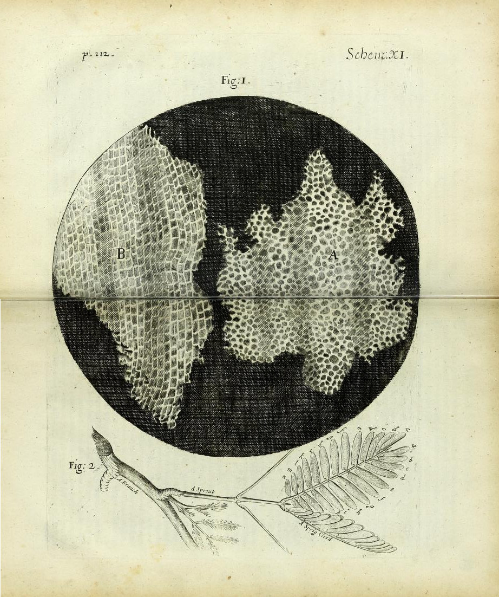                                | 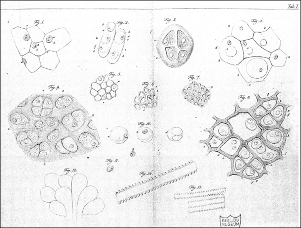                                |
| ------------------------------------------------------------ | ------------------------------------------------------------ |
| <small><strong>Figure 1: première représentation de cellules par Robert Hooke dans son "Micrographia" publié en 1665.</strong></small> | <small><strong>Figure  2: représentation de cellules végétales et animales pour étayer la théorie cellulaire dans le livre de Theodor Schwann "Mikroskopische Untersuchungen " publié en 1839.</strong></small> |

**Toute cellule naît d'une cellule :**
La génération spontanée des "gros organismes" a été abandonnée grâce à Francesco Redi (1626-1694), même si Buffon la défend encore un siècle plus tard. En effet, avant cette époque, on faisait naître des souris de tas de grains et des "vers" de la putréfaction. L'expérience de Redi montre que si on met de la viande dans une fiole bouchée par de la gaze fine, il n'apparaît jamais de vers. Le problème est plus complexe pour les organismes microscopiques et il faut attendre Louis Pasteur (1860) pour que la question soit définitivement tranchée (figure 3)

<figure>
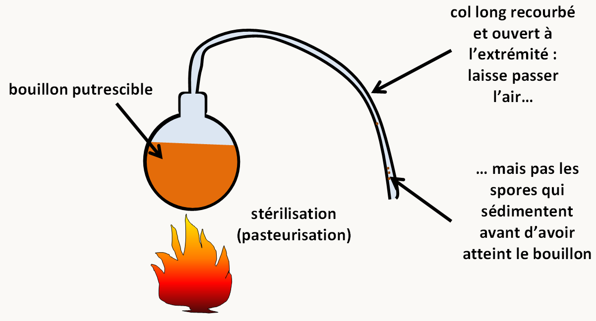
<figcaption>
<small><strong>Figure  3: En l'absence de stérilisation (pas de chauffage), Pasteur observe une putréfaction (ou fermentation) avec une apparition de microorganismes. Après une stérilisation par chauffage, Pasteur n'observe pas de putréfaction. Par contre après cassure du tube de verre et exposition de la matière à l'air, les microorganismes apparaissent entraînant la putréfaction. L'explication qu'il donne est la suivante: les particules présentes dans l'air se déposent dans le tube avant d'avoir atteint la matière. Si celle-ci est stérile, il n'y a pas de putréfaction. La cassure du tube permet à ces germes d'atteindre la matière et de démarrer le processus. Notez que dans cette expérience de l'air "non altéré" passe sans problème dans la fiole à tout moment, il n'y a donc pas altération de "principe de l'air"qui empêcherait l'apparition spontanée de cellules. Cette expérience prouve qu'il y a besoin de germes pour initier la putréfaction et donc que la génération spontanée n'existe pas.</strong></small>
</figcaption>
</figure>  

**Conclusion:** si toute cellule naît d'une cellule, d'un point de vue génétique, cela veut dire que l'information présente dans un organisme n'apparaît pas spontanément ! Elle est produite à partir d'une information préexistante. Celle-ci doit donc être dupliquée avant d'être transmise.

Si toute cellule naît d'une cellule, comment est faite une cellule ? et comment se reproduit-elle ?

Les analyses biologiques du début du siècle ont conduit à distinguer deux grands types de cellules, suivant leur constitution et leur mode de reproduction : les cellules procaryotes et les cellules eucaryotes.

## Les cellules procaryotes

On les regroupe souvent sous le terme générique de "bactéries". Il en existe en fait deux grands groupes, les vraies bactéries (appelées parfois eubactéries, maintenant le plus souvent simplement bactéries ) et les archées, qui ont des fonctionnements différents au niveau moléculaire. Cependant, les cellules des deux groupes possèdent une organisation similaire (figure 4).

**Structure:**

<figure>

<figcaption>
<small><strong>Figure  4: structure d'une cellule procaryote typique.</strong></small>
</figcaption>
</figure>  
- Ces cellules sont généralement de petite taille (attention, il existe des exceptions !)

- Leur structure est très simple, le plus souvent sans cytosquelette ni réseau de membrane interne: la production d'énergie n'est pas compartimentée, elle se produit au niveau de la membrane plasmique. Autour de la cellule, on note la présence d'une paroi complexe. Dans le cytoplasme, il y a présence des ribosomes et d'une masse "plus claire", le nucléoïde qui contient l'ADN. Attention le nucléoïde n'est pas un noyau car il n'est pas entouré par une membrane. Il existe de ce fait un couplage entre transcription et traduction. L'ADN est présent sous forme d'un ou quelques chromosomes, le plus souvent circulaire(s), mais pas toujours.

- Ces bactéries n'ont pas de processus d'endocytose et "n'ingèrent" donc que des molécules solubles qui pénètrent à l'intérieur de la cellule via les transporteurs membranaires.

- Elles ne forment jamais d'organismes pluricellulaires complexes, mais néanmoins les cellules sont capables de se différencier pour former des spores ou des colonies contenant des cellules de morphologies différentes.

- Leur unité de structure cache une grande complexité de métabolisme et de fonctionnement au niveau moléculaire. Ceci entraîne une diversité biologique très importante. Les procaryotes ont ainsi pu coloniser quasiment tous les milieux : des plus froids (mers polaires à la limite de la congélation) aux plus chauds (sources thermales à plus de 120°C), sous la croûte terrestre ou à l'intérieur du corps humain. 

  **Division**

- Elles se divisent simplement par **fission binaire**, en général pour donner deux cellules identiques. Il n'y a pas d'individualisation de chromosomes visibles en cytologie à aucun moment de leur cycle de vie. Attention, le processus de division est cependant hautement contrôlé par des structures particulières; la petitesse des cellules empêche leur visualisation facile avec un microscope optique.

- Il n'existe pas de reproduction sexuée au sens usuel du terme. Il est cependant possible pour des cellules procaryotes d'échanger de l'ADN grâce aux phénomènes de conjugaison, de transduction et de transformation.

## Les cellules eucaryotes

Cet ensemble regroupe une variété de cellules présentant des organisations plus ou moins complexes. Cependant, elles ont toute la caractéristique d'avoir un noyau, composé d'une double membrane entourant l'ADN. Celui-ci présente une organisation complexe (figure 5).

<figure>
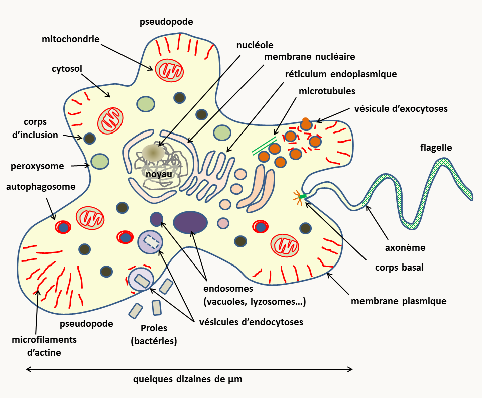
<figcaption>
<small><strong>Figure 5: structure d'une cellule eucaryote typique.</strong></small>
</figcaption>
</figure>  

**Structure:**  

- Le plus souvent, outre le noyau, elles présentent une structure interne complexe avec un cytosquelette vrai (microtubules, filaments d'actine etc.) et un système de membranes délimitant de nombreuses organelles (réticulum associé au noyau, appareil de Golgi, mitochondrie, lysosome / vacuole, peroxisome, etc.). De plus, chez de nombreux protistes et chez les plantes, des plastes assurent la photosynthèse. Il y a donc une compartimentation de la production d'énergie dans les mitochondrie et les plastes, et des réactions enzymatiques (faites le cytosol, les peroxisomes, les lysosomes, etc.). La présence du noyau, caractéristique des eucaryotes, entraîne un découplage entre transcription et traduction. Ceci permet des niveaux de régulation supplémentaires par rapport aux procaryotes.

- Elles ont la possibilité de faire des endocytoses, ce qui permet des échanges additionnels avec le milieu extérieur, mais aussi des régulations supplémentaires.

- Ces cellules peuvent se différencier et donner naissance à des organismes pluricellulaires. Ils ont une grande diversité au niveau du métabolisme (mais moindre que chez les bactéries) et de leur fonctionnement au niveau moléculaire. Je vous renvoie aux cours de biologie moléculaire, biochimie et microbiologie de maîtrise pour approfondir vos connaissances sur le sujet. Vous pouvez aussi consulter le [livre de microbiologie eucaryote](https://hal.archives-ouvertes.fr/hal-01263138) qui donne un aperçu de la diversité des eucaryotes "simples".

- Leur matériel génétique est présent dans plusieurs compartiments. La plus grosse partie se trouve dans le noyau sous forme de plusieurs molécules d'ADN linéaires double brins ou chromosomes et dont le nombre est défini. Si un seul lot de chromosomes est présent, la cellule est dite haploïde, si deux lots identiques sont présents la cellule est dite diploïde, avec trois lots, elle est triploïde et avec quatre elle est tétraploïdes. L'autre compartiment qui contient de l'ADN et la mitochondrie. L'ADN y est présent sous formes de plusieurs molécules de structures très variables en fonction des lignées d'eucaryotes (voir le [livre de microbiologie eucaryote](https://hal.archives-ouvertes.fr/hal-01263138)) et dont le nombre varie en fonction des étapes du cycle de vie et/ou des conditions de l'environnement. Chez les plantes et certains protozoaires, de l'ADN est aussi présents dans les plastes ou d'autres organelles (voir le [livre de microbiologie eucaryote](https://hal.archives-ouvertes.fr/hal-01263138)).

**Division:**

Leur processus de division est complexe ce qui résulte en une transmission plus complexe de l'information génétique au cours des générations. Il en existe deux types : les **mitoses** et les **méioses**.

## La mitose

C'est la division la plus courante pour les cellules eucaryotes, aussi bien chez les unicellulaires que chez les pluricellulaires.  Sa découverte ainsi que la généralisation de sa présence chez tous les eucaryotes se sont faites progressivement au XVIIeme et XIXeme siècles, le terme de mitose ayant été utilisé pour la première fois en 1882 par Walther Fleming .

Je rappelle que toutes les cellules d'un organisme pluricellulaire sont issues par mitose d'une cellule unique (l'œuf chez les animaux, l'ovule fécondée à l'origine de la graine chez les plantes et la spore chez les champignons). Elles constituent un clone (note : ce terme s'applique aussi aux cellules procaryotes issues d'une même cellule initiale: une colonie bactérienne est un clone). La mitose est une étape du cycle cellulaire : celui-ci se décompose comme indiqué dans la figure 6.

<figure>
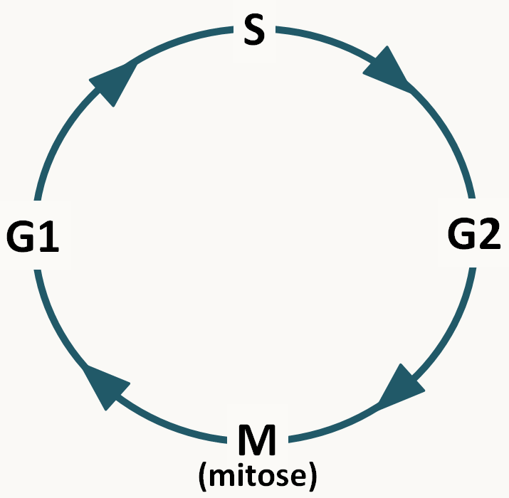
<figcaption>
<small><strong>Figure 6: Le cycle cellulaire d'une cellule eucaryote.</strong></small>
</figcaption>
</figure>  

Classiquement, quatre phases sont définies:  

S: phase de synthèse. C'est à ce moment que l'information est dupliquée (= réplication de l'ADN !)

G1 et G2 sont des phases d'attente ou GAP. Pendant ces phases, un certain nombre de décisions sont prises (Y-a-t-il assez d'énergie pour se diviser ?...) et des contrôles sont faits (l'ADN est-il bien répliqué ? ...)

M: Mitose qui intervient entre les phase G2 et G1 et qui est le moment exact où le matériel génétique est réparti dans les deux cellules filles. C'est un processus dynamique dont la durée est variable d'un organisme à un autre mais qui prend en général moins d'une heure. Elle a été découverte chez les plantes par Edouard Stasburger (1875). Flemming (1880) montre qu'elle existe aussi chez les animaux et appelle chromatine la substance dont sont faites les particules "colorantes" du noyau. Waldeyer (1888) donne le nom de chromosome à ces particules. La figure 7 en donne les principales étapes.

<figure>
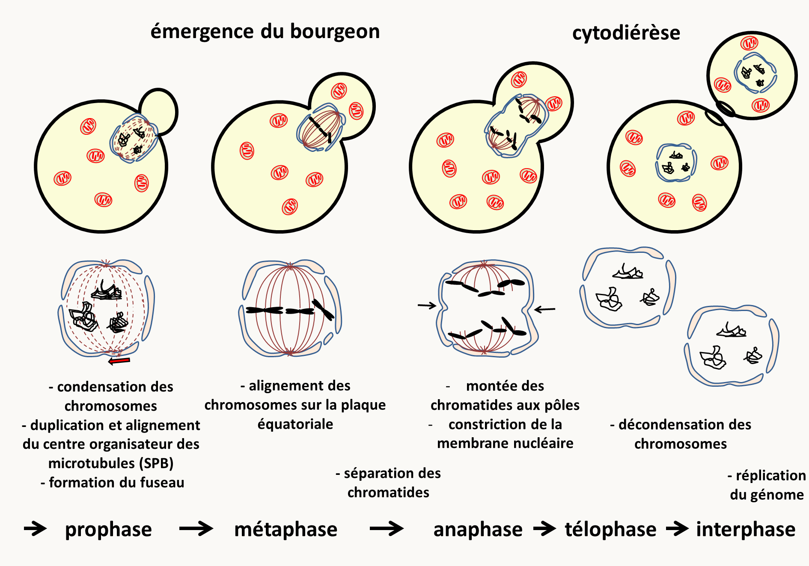
<figcaption>
<small><strong>Figure 7: La mitose chez Saccharomyces cerevisiae. Au cours de la prophase, les chromosomes se condensent et les deux chromatides qui les composent et qui sont chacune des molécules filles issues de la réplication sont bien visibles. les chromosomes s'alignent via leur centromère sur la plaque équatoriale. Lorsqu'ils sont bien alignés, l'étape dite métaphase est atteinte. Les centromères se clivent et chacune des chromatides pour chaque chromosome se dirigent vers un pôle opposé du noyau. C'est l'étape dite d'anaphase. Notez qu'à ce moment, chaque chromatide devient un chromosome. Au cours de la télophase les noyau se divisent et les chromosomes se décondensent.  Puis la cellule se divise, c'est l'étape de cytodiérese. Pour les mitochondrie, qui chez la levure porte un génome circulaire, l'entrée dans le bourgeon est contrôlé par un système qui assure une partition correcte des mitochondries entre la cellule mère et le bourgeon.</strong></small>
</figcaption>
</figure>  

Il existe de nombreuses variations sur ce schéma. Par exemple, chez les animaux et les plantes, la membrane nucléaire disparaît pendant le processus. Il y a des "asters" plutôt qu'un "Spindle Pole Body" ou SPB.  La cytologie a aussi permis de décrire différents types de chromosomes (figure 8) en fonction de la position de leur centromère. Tailles et types des chromosomes permettent  donc de les différencier et d'en établir un catalogue ou **caryotype**.

<figure>
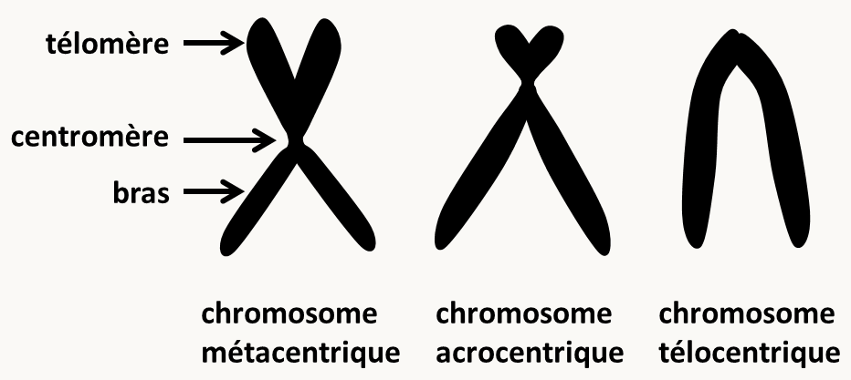
<figcaption>
<small><strong>Figure 8: les principaux types de chromosomes définis par les analyses cytologiques.</strong></small>
</figcaption>
</figure>  
Ce qu'il faut retenir c'est qu'**à l'issue de la mitose il y a répartition à l'identique des chromosomes nucléaires: une cellule à n chromosomes donne naissance à deux cellules à n chromosomes, une cellule à 2n chromosomes donne naissance à 2 cellules à 2n chromosomes.** Il y a aussi partition plus ou moins équitable du cytoplasme et donc une transmission souvent peu biaisée du matériel génétique présent dans les organelles du cytoplasme (mitochondries, plastes...).

## La méiose

Cette division est très importante car elle est impliquée dans la reproduction sexuée des organismes (attention, la reproduction sexuée n'est pas une étape obligatoire chez les eucaryotes car de nombreux organismes ont une reproduction uniquement asexuée).

Oscar Hertwig (1875) montre que pendant la fécondation de l'œuf d'oursin, le noyau du spermatozoïde pénètre dans l'ovule et fusionne avec le noyau déjà présent. Edouard van Beneden (1883-1888) montre que les spermatozoïdes et les ovules ont le même nombre de chromosomes et que ceux-ci sont en quantité deux fois moins importante que dans les cellules germinales qui leur ont donné naissance. Ces études cytologiques montrent qu'il existe chez les eucaryotes une alternance de phases haploïdes où les cellules ont n chromosomes et de phases diploïdes, où elles ont 2n chromosomes (figure 9). C'est la reproduction sexuée grâce à laquelle les eucaryotes échangent de l'information génétique. A partir de ces observations cytologiques, August Weismann (1887) formule la première théorie chromosomique de l'hérédité : l'information génétique est portée par les chromosomes. **L'analyse génétique se base donc principalement sur des analyses des croisements se produisant au cours de la reproduction sexuée.**

La figure 9 décrit la terminologie utilisée de manière générale concernant le cycle de vie des eucaryotes. En fait à pour chaque groupe d'eucaryote, il existe une terminologie particulière pour les gamètes et le zygote. Notez que la fécondation s'appelle conjugaison lorsque les deux gamètes ont la même taille. La fécondation/conjugaison permet de réunir deux génomes haploïdes dits parentaux pour redonner un diploïde. Elle se décompose en deux étapes:  la fusion des gamètes ou plasmogamie puis la fusion des noyaux ou caryogamie.  Chez certains eucaryotes, la fusion cellulaire n'est pas toujours immédiatement suivie de la fusion des noyaux. Il se produit alors une dicaryophase avec des cellules binucléées.

<figure>
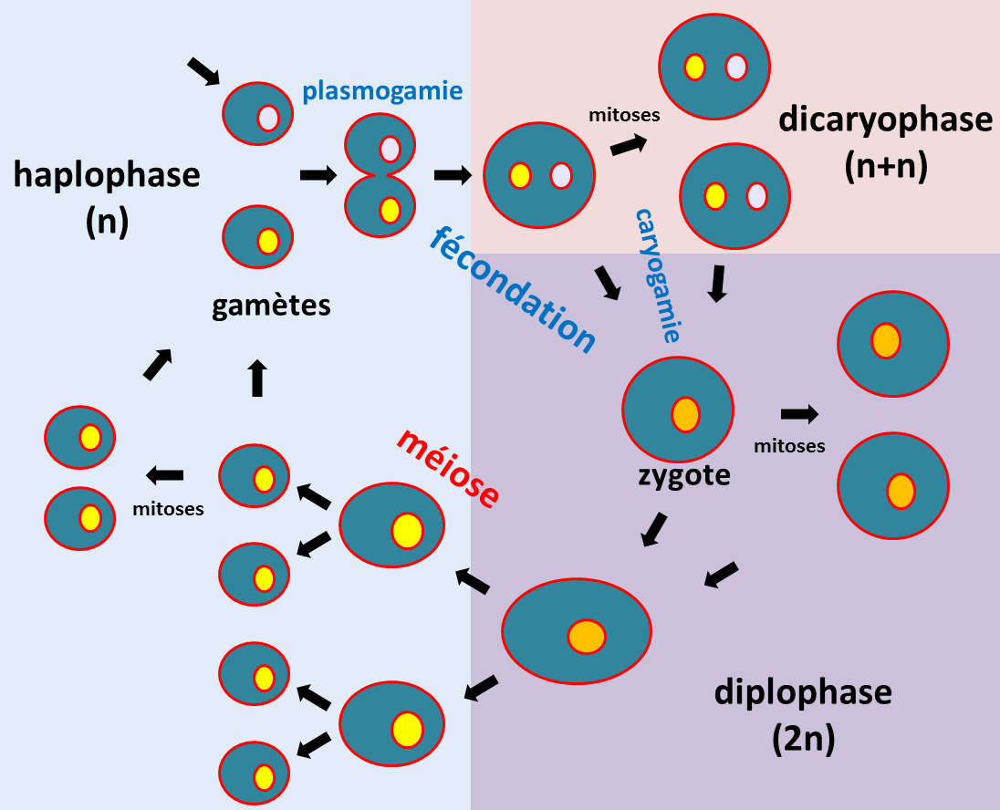
<figcaption>
<small><strong>Figure 9: Cycle de vie d'un eucaryote.</strong></small>
</figcaption>
</figure>  
La méiose est la division particulière qui permet le passage de la phase diploïde à la phase haploïde (figure 10). Pour effectuer la méiose, il faut donc partir d'une cellule diploide à 2n chomosomes. Cette division est précédée comme pour la mitose de la duplication du matériel génétique (réplication de l'ADN). Au cours de la méiose, il y a deux divisions successives qui aboutissent à la production de 4 cellules haploïdes à n chromosomes suivant le schéma général décrit dans la figure 10.

<figure>
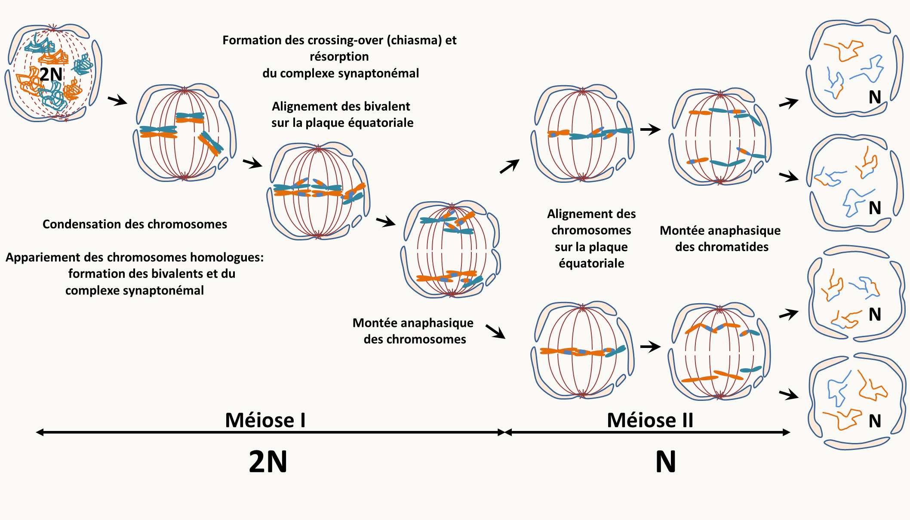
<figcaption>
<small><strong>Figure 10: une méiose typique commence par une première division (Méiose I) qui voit lors de la prophase I la condensation des chromosomes (étape du leptotène), suivie de leur association en bivalents: c'est à dire que les chromosomes "homologues" vont s'associer dans un premier temps grace à un complexe protéique: le complexe synaptonémal (étape du zygotène). L'association est suivie de recombinaison entre les chromatides des deux chromosomes des bivalents (étape du pachytène). Ceux-ci sont visibles cytologiquement: il'agit des chiasma. Ces chiasma maintiennent entre eux les deux chromosomes lorsque le complexe synaptonémal se résorbe en fin de prophase I (étape du diplotène). Les bivalents vont ensuite se positionner sur la plaque équatoriale. Une fois en position, l'étape de métaphase I est atteinte. Lors de l'étape suivante (anaphase I), la résolution des chiasmas permets aux deux chromosomes (chacun ayant deux chromatides) de se séparer et de s'éloigner à chacun des pôles du noyau. La télophase I voit la décondensation partielle des chromosomes. Elle est immédiatement suivie de leur recondensation nécessaire pour la deuxième division de méiose (Méiose II) qui est une mitose classique. Notez que chez de nombreux eucaryotes, la méiose peut être suivie de mitoses dites postméiotiques comme chez les champignons ascomycètes filamenteux. Pour les organelles situées dans le cytoplasme et contenant leur propre génome (mitochondrie, plastes, etc.), il n'existe pas en général de mécanismes particuliers qui vont permettre leur transmission préférentielle (attention, il existe des exceptions), mais si l'organisme différentie des gamètes morphologiquement différents (mâles notés ♂ et femelles notés ♀) il va y a voir un biais de transmission aux gamètes. le cas le plus commun est que seul le gamète femelle transmet l'ADN des organelles. </strong></small></figcaption>
</figure>  
Le brassage aléatoire des chromosomes et les crossing-overs sont les deux mécanismes qui vont participer à la recombinaison entre les deux génomes parentaux. La recombinaison au sens génétique du terme est le fait que des informations provenant des deux parents d'un individu se retrouve associés dans ses gamètes. Les descendants que va générer cet individu vont donc être formés d'une mosaïque des chromosomes provenant de chacun de leurs parents.

Ce qu'il faut donc retenir c'est que **la méiose permet de restaurer l'état haploïde chez les eucaryotes et que cela s'accompagne de la recombinaison des informations génétiques  due au brassage chromosomique et aux crossing-overs**. Elle n'est qu'une des étapes du cycle de vie des eucaryotes dont **la diploïdie va être restaurer par la fécondation/conjugaison**.

## Quelques organismes modèles en génétique

**La durée des phases haploïdes et diploïdes est variable en fonction des organismes. Cela veut donc dire que pour chaque organisme, l'analyse génétique des croisements suivra des modalités différentes en fonction de la phase qui peut être observée facilement.** Les cycles décrits ci-dessous présentent les trois grands groupes de cycles qui sont distingués, en prenant les exemples des organismes les plus étudiés en génétique. Ensuite, vous sont données quelques caractéristiques génétiques de ces organismes.

### *Saccharomyces cerevisiae*

Si la phase haploïde est aussi longue que la phase diploïde, le cycle est dit **haplodiplobiontique**. Ce type de cycle est présent chez quelques levures dont la levure de boulanger *Saccharomyces cerevisiae* (figure 11). Cette levure se divise par bourgeonnement d'une cellule fille à partir de la cellule mère, ce qui veut dire que le cytoplasme n'est pas réparti équitablement entre les deux cellules issues de la mitose. Par contre, la conjugaison entre gamètes se fait entre deux cellules indistinguables morphologiquement mais génétiquement différentes: on dit que *Saccharomyces cerevisiae* est hétérothallique. De même, la méiose produit quatres ascospores identiques morphologiquement dont deux sont d'un type (mata) est les deux autres de l'autre type (matα). On dit que le type sexuel de *Saccharomyces cerevisiae* est bipolaire. Le cycle est rapide et dure environ une semaine pour aller d'une souche diploïde à ses descendants diploïdes obtenus par fécondations d'haploïdes.

<figure>
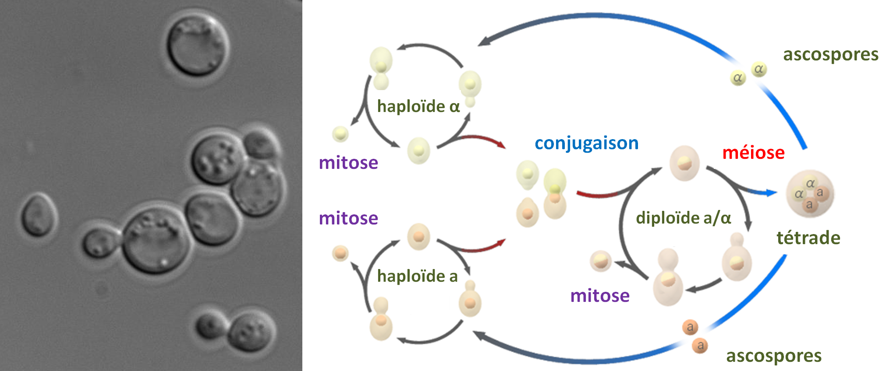
<figcaption>
<small><strong>Figure 11: La levure de boulanger Saccharomyces cerevisiae. Pour cette levure, il existe 2 types sexuels appelé mata et matα. Les cellules haploïdes mata ou matα, peuvent se diviser par mitose et générer des clones. La division s'effectue par bourgeonnement donnant deux cellules de tailles différéntes : la cellule mère et la cellule fille (à gauche). La conjugaison (équivalent à la fécondation) ne peut avoir lieu qu'entre une cellule haploïde mata et une cellule haploïde matα. La cellule diploïde résultant de la fusion peut aussi se diviser par mitose. Lorsque se produit une carence en nutriments, la cellule effectue une méiose. Celle-ci ne peut se produire que dans une cellule diploïde mata/matα. Elle produit 4 spores haploïdes empaquetées dans un asque que l'on appelle une tétrade; les spores sont alors appelées des ascospores. Deux ascospores seront mata et les deux autres matα.</strong></small>
</figcaption>
</figure>  

Le génome haploïde de *Saccharomyces cerevisiae* est constitué de16 chromosomes nucléaire et d'un chromosome mitochondrial circulaire. Il mesure environ 12 Mb et code pour environ 6000 gènes. Il est très facile de transformer génétiquement cette levure et il existe de nombreux mutants, y compris une collection des délétions de tous les gènes. Pour en savoir plus sur la génétique de *Saccharomyces cerevisiae* le site [SGD](https://www.yeastgenome.org/) (pour *Saccharomyces* Genome Database) est incontournable. D'un point de vue génétique, il faut retenir que dans ce type d'organisme il est possible d'observer les résultats des fécondations et des méioses.

###  *Neurospora crassa* et *Aspergillus nidulans*

Lorsque la phase haploïde est très longue alors que la phase diploïde est réduite au minimum, on parle alors de cycle **haplobiontique**. Ce type de cycle est présent chez les champignons filamenteux comme *Neurospora crassa*, *Aspergillus nidulans* ou *Podospora anserina*. Pour tout savoir sur la génétique de *Podospora anserina* qui est le champignon modèle étudié par les français vous pouvez consulter le livre gratuit ["*Podospora anserina*"](https://hal.archives-ouvertes.fr/hal-02475488). nous allons plutôt développer *Neurospora crassa* et *Aspergillus nidulans* car ce sont des modèles plus répandus dans les laboratoires (sauf en France!).

*Neurospora crassa* est un hétérothalique bipolaire avec deux types sexuels appelés mata et matA et qui différencie des gamètes mâles et femelles (figure 12).  La fécondation ne peut se produire qu'entre deux gamètes de types sexuels opposés: ♂ mata x ♀ matA et ♂ matA x ♀ mata. Comme chez les autres champignons ascomycètes *Pezizomycotina*,  la plasmogamie est suivie d'une étape de dicaryose aboutissant à l'amplification des cellules binucléées avant la caryogamie: à partir d'une fécondation, plusieurs centaines d'asques vont être produits. Le cycle dure deux à trois semaines.

<figure>
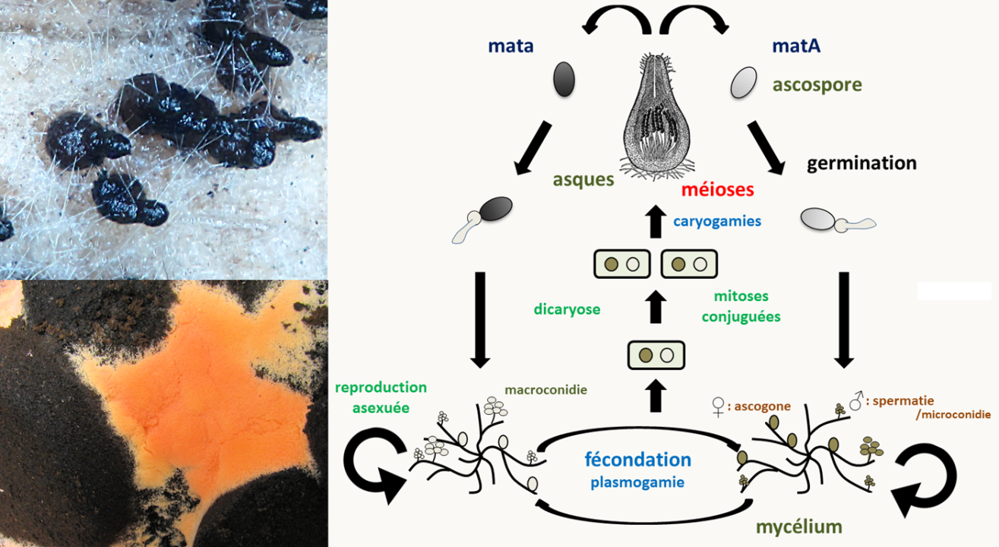
<figcaption>
<small><strong>Figure 12: Neurospora crassa possède deux types sexuels appelés mata et matA. Le mycélium du champignon est haploïde et différencie des organes mâles ou spermaties et femelles ou ascogones. La fécondation se produit entre un organe mâle d'un type sexuel et un organe femelle du type sexuel opposé. La fécondation est suivie d'une étape dicaryotique qui permet de multiplier le nombre de cellules issues de la fécondation et dans lesquelles auront lieu les caryogamies qui sont immédiatement suivies des méioses et d'une mitose post-méiotique supplémentaire donnant naissance à des asques contenant 8 ascospores ordonnées. Toutes ces étapes de développement sexuel se produisent dans une fructification appelée périthèce (en haut à gauche). Le champignon est aussi capable de différencier des spores de dispersion asexuelle. Il en existe de deux types: certaines sont uninucléées, les microconidies, qui peuvent aussi servir de gamètes mâles, les autres sont plurinucléées et sont appelées les macroconides. Elles accumulent des carotènes oranges (en bas à gauche). </strong></small>
</figcaption>
</figure>  

Le génome de *Neurospora crassa* est constitué de sept chromosomes nucléaires et d'un chromosome mitochondrial circulaire. Il mesure 43 Mb et code pour environ 11 000 gènes. La transformation génétique de *Neurospora crassa* est facile et une banque de mutants de délétion de chaque gène est disponible. De nombreux mutants affectant ce champignon ont été sélectionnés. Plus d'informations sur la génétique de ce champignon sont disponibles sur le site du [FGSC](http://www.fgsc.net/) (pour Fungal Genetics Stock Center). 

Le site du [FGSC](http://www.fgsc.net/)  donne aussi des informations précieuses sur un second champignon ascomycète possédant un cycle similaire et qui est très utilisé en génétique: *Aspergillus nidulans* (figure 13).  *Aspergillus nidulans* est homothallique, ce qui veut dire qu'il n'a pas besoin d'un partenaire sexuel pour initier la reproduction sexuée. De fait, il ne différencie aucun gamète mâle, l'ascogone se fécondant lui-même. Le cycle sexuel est assez peu utilisé pour faire des analyses génétique avec ce champignon. En effet, il possède un cycle parasexuel efficace qui est le mode préféré par les généticiens (encadré bleu de la figure 13). La durée du cycle parasexuel est de deux à trois semaines.

<figure>
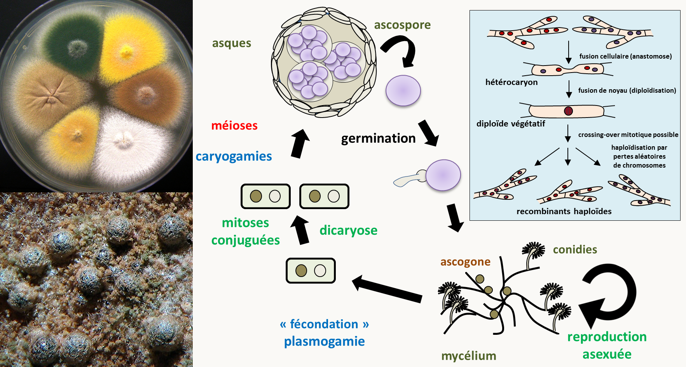
<figcaption>
<small><strong>Figure 13: Aspergillus nidulans n'a pas de type sexuel et les ascogones engagent seuls le processus sexuel en s'autofécondant. Comme pour Neurospora crassa, la plasmogamie est suivie d'une phase dicaryotique qui permet d'amplifier le nombre d'asques obtenus après un seul évènement de fécondation. La fructification est fermée et s'appelle un cléistothèce (en bas à gauche). Comme Neurospora crassa, Aspergillus nidulans différencie des conidies uninucléées qui assurent une reproduction asexuelle (en haut à gauche, différents mutants de coloration des conidies d'Aspergillus nidulans).Le cycle parasexuel, très efficace chez Aspergillus nidulans, permet une alternance de générations haploïdes et diploïdes sans sexualité (encadré bleu). Il débute par une anastomose, c’est à dire la plasmogamie de deux cellules haploïdes sans formation de gamète. L’hétérocaryon résultant peut subir une caryogamie (fusion de noyaux) pour donner des noyaux diploïdes. Ceux-ci sont très instables et redonnent rapidement après pertes aléatoires de chromosomes des noyaux haploïdes. Les recombinants ainsi obtenu vont présenter une mosaïque aléatoire des chromosomes des deux « parents ». Il arrive aussi que des évènements de réparation des dommages à l’ADN conduisent dans le noyau diploïde à des crossing-over mitotiques, ce qui va ajouter à la diversité génétique des recombinants. </strong></small>
</figcaption>
</figure>  

Le génome d'*Aspergillus nidulans* est constitué de huit chromosomes nucléaires et d'un chromosome mitochondrial circulaire. Il code pour environ 10500 gènes. La transformation génétique et l'obtention de mutants est aussi très simple chez ce champignon. Il n'y a pas par contre de programme de délétions systématiques de tous les gènes nucléaires.

D'un point de vue génétique, il faut retenir que dans ce type d'organismes, on ne peut regarder facilement que le résultat de la méiose.

### Les animaux et les plantes

Chez les animaux et les plantes supérieures, la phase diploïde dure très longtemps alors que la phase haploïde est réduite au minimum. On parle de cycle **diplobiontique**. Il en existe beaucoup de variations.

#### *Caenorhabditis elegans*

Chez le nématode *Caenorhabditis elegans*, il existe des individus hermaphrodites avec deux chromosomes X qui peuvent s'autoféconder pour donner naissance principalement à des hermaphrodites. Rarement, un accident de méiose aboutit à la perte du chromosome X dans un gamète. L'œuf résultant de la fécondation d'un gamète normal avec ce gamète donne naissance à un mâle incapable de s'autoféconder mais qui peut produire des spermatozoïdes fécondant les hermaphrodites. Le cycle dure trois jours.

<figure>
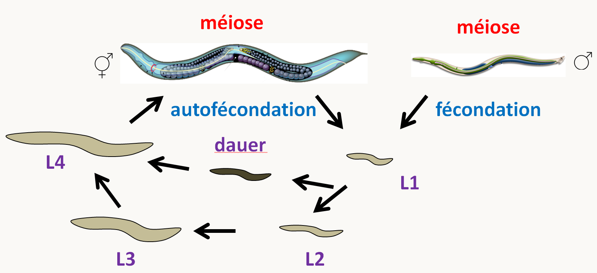
<figcaption>
<small><strong>Figure 14: Les individus hermaphrodites de Caenorhabditis elegans produisent oeufs par autofécondation. Ceux-ci éclosent pour donner naissance à une larve qui subit 4 métamorphoses pour redonner un adulte hermaphrodite. En cas de carence nutritionnelle, les larves L1 peuvent se différencier en forme de résistance dite dauer. Au retour de la présence de nutriments, les larves dauer redonnent des larves L4. Les rares individus mâles sont obtenus spontanément par perte d'un chromosome X. Lorsqu'un hermaphordite est fécondé par un mâle, la majorité de sa descendance sera issue de fécondation croisée et donc hermaphrodite pour environ 50% et mâle pour 50%. </strong></small>
</figcaption>
</figure>  
*Caenorhabditis elegans* possède un génome 97 Mb répartis sur cinq paires d'autosomes, un chromosome sexuel X (les hermaphrodites sont noté X X et les mâles X 0), et une génome mitochondrial circulaire. La transformation génétique de ce ver est possible, mais la méthode privilégiée pour inactiver les gènes est l'interférence à ARN, qui est facile car il suffit d'exprimer l'ARN interférent double brin dans les bactéries qui servent de source de nutriments pour inactiver les gène cognate dans le ver! La stratégie CRISPR/CAS0 a aussi été dévelopée pour *Caenorhabditis elegans*.

#### *Homo sapiens*

Il n'est pas, je pense nécessaire de revenir sur la biologie humaine car vous devez être familier avec cette espèce! Il possède le cycle générique avec des sexes séparés comme la plupart des animaux dont la drosophile, le poisson zèbre ou la souris qui sont les autres grands modèles d'étude génétique. la durée de son cycle est très longs (2 ou 3 décades) en comparaison de la souris (environ 2-3 mois), du poisson zèbre (3-4 mois) et de la drosophile (10 jours).

<figure>
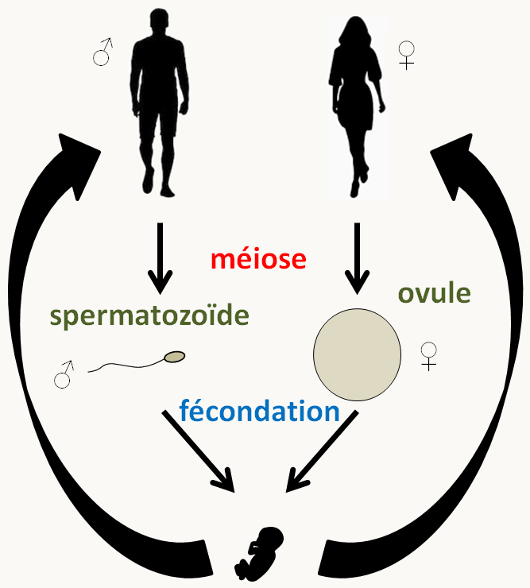
<figcaption>
<small><strong>Figure 15: Le cycle de l'homme est un cycle avec sexes séparés mâles et femelles qui produisent spécifiquement des gamètes mâles (spermatozoïdes) ou bien femelles (ovules). </strong></small>
</figcaption>
</figure>  

Le génome  humain est constitué d'environ 3.2 milliards de paires de base et code pour environ 20-30 000 gènes. Il est réparti sur 22 paires d'autosomes,1 paire de chromosomes sexuels (X et Y: XX détermine le sexe femelle et XY le sexe mâle) et un chromosome mitochondrial circulaire (voir https://www.ncbi.nlm.nih.gov/genome/guide/human/?). Il est strictement interdit (au moins en France) de modifier les génome de la lignée germinale, et les thérapies géniques modifiant la lignée somatique sont encadrées. De même, les croisements forcés sont interdits! L'analyse génétique passe donc principalement par l'analyse de pédigrees dont la signalétique est codifiée (figure 16).

<figure>
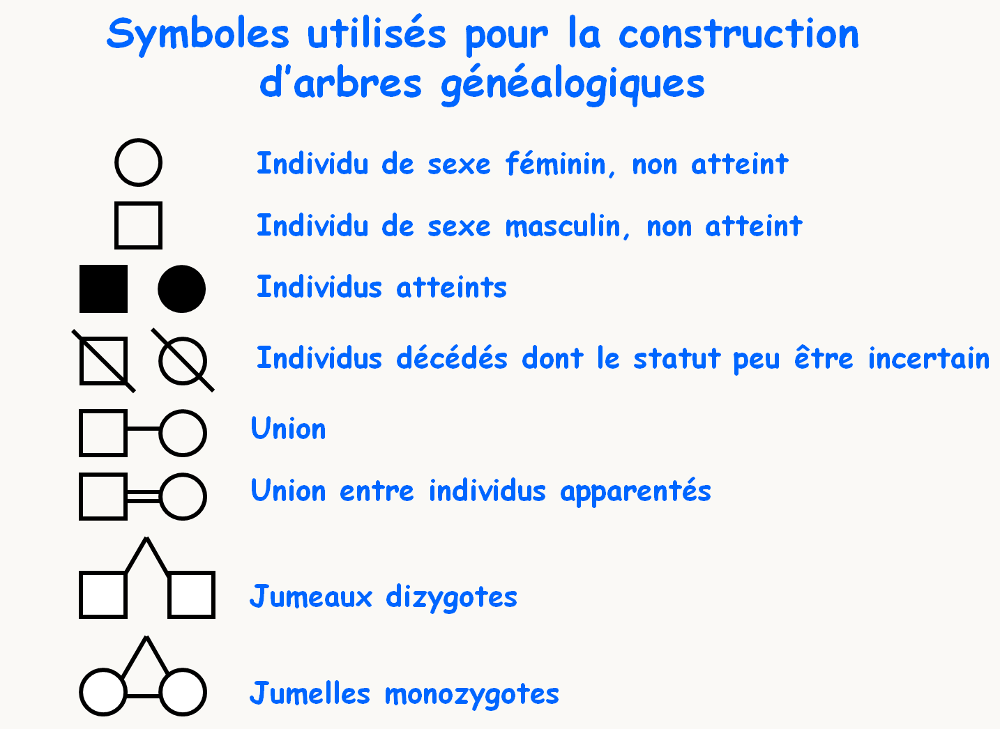
<figcaption>
<small><strong>Figure 16: codes pour l'établissement des pédigrees. </strong></small>
</figcaption>
</figure>  
La souris, le poisson zèbre et la drosophie sont quant à eux transformables génétiquement et de nombreux mutants sont disponibles pour les trois espèces. Leurs génomes haploïdes font 2.5 milliard de paires de base  pour environ 20-30 000 gènes chez la souris (voir http://www.informatics.jax.org/), 1.4 milliard de paires de base et 26 000 gènes chez le poisson zèbre (voir https://zfin.org/) et 175 Mb pour environ 15 000 gènes chez la drosophile (voir https://flybase.org/).

#### *Arabidopsis thaliana*

Les plantes à fleur sont diploïdes et produisent des gamètes mâles et femelles sur/dans des organes reproducteurs spéciaux : étamines pour les gamètes mâles et ovaires pour les gamètes femelles. Les sexes sont soit séparés dans les plantes dites dioïques (voire sur des plants différents dans les dioïques stricts) ou dans les mêmes fleurs chez les plantes monoïques. L'espèce modèle la plus utilisée est *Arabidospsis thaliana* ou l'arabette des dames (figure 17). Cette espèce est dite gynodioïque, c'est a dire qu'elle a des plants femelles et des plants hermaphrodites mais aucun plant qui est strictement mâle.  La durée du cycle est de six semaines chez *Arabidopsis thaliana*.

<figure>
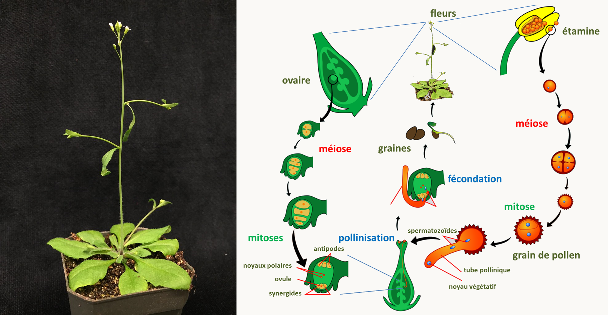
<figcaption>
<small><strong>Figure 17: Les fleurs sont le lieu où se tiennent les méioses. Celles-ci sont suivies de mitoses. le gamète femelle ou ovule est donc entouré de ses cellules soeurs (6 au total), en particulier la cellule centrale diploïde issue des deux noyaux polaires. Le grain de pollen mâle germe et le noyau haploïde se divise. Un des noyaux obtenus va féconder le noyau de l'ovule femelle, un autre féconde une cellule centrale diploïde qui se retrouve donc triploïde. Dans la graine finale, l'ovule donne naissance à l'embryon et la cellule triploïde donne naissance à l'albumen nourricier. </strong></small>
</figcaption>
</figure>  
le génome nucléaire d'*Arabidopsis thalian*a ne mesure que 175 Mb, ce qui est petit pour un génome de plante qui sont le plus souvent de l'ordre du milliard de paires de bases. Il code pour environ 25 000 gènes. Le chromosome mitochondrial est circulaire, mesure environ 370 000 paires de base et code pour 33 protéines, les ARNr et 21 ARNts;  le chromosome plastidial est circulaire, il mesure envrion 155 000 paire de base et code pour 85 protéines, les deux ARNr et 30 ARNts.

D'un point de vue génétique, il faut retenir que chez ces organismes diplobiontiques, on ne regarde facilement que les zygotes qui sont issus de la fécondation.

### Les virus

Finalement, il existe un groupe "d'organismes" avec lequel il est possible d'effectuer des analyses génétiques : les bactériophages (= phages = virus de bactéries) et les virus. Il existe de nombreux cycles d'infection pour ces virus et je vous renvoie aux cours de virologie pour approfondir vos connaissances. La figure 18 résume deux cycles classiques d'un virus infectant une cellule eucaryote et d'un phage attaquant une bactérie.  

<figure>
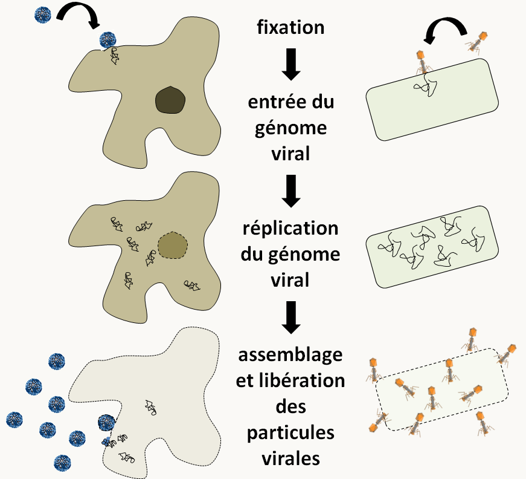
<figcaption>
<small><strong>Figure 18: cycles d'un virus attaquant une cellule eucaryote à gauche et d'un phage attaquant une bactérie à droire. Les deux suivent les mêmes étapes.</strong></small>
</figcaption>
</figure>  

Les génomes viraux présentent une grande variétés de tailles et de structures. Le plus petit, celui du circovirus porcin, ne fait que 1759 nucléotides et code pour trois protéines. Il se présente sous forme d'une molécule d'ADN circulaire simple brin dans les particules virales infectieuses. A l'opposé, le génome du virus géant "Megavirus chilensis" infectant des amibes mesure 1.26 Mb et code pour 1120 protéines. Dans les particules virales, il est sous forme d'ADN linéaire double brin. Les génomes peuvent aussi être linéaires et/ou composés de plusieurs molécules. Enfin, certains ne sont pas fait d'ADN mais d'ARN simple ou double brin, linéaires ou circulaires. Pour faire des analyses génétiques, il est possible de faire des infections virales multiples. Plusieurs génomes viraux sont alors présents dans la même cellule. C'est l'équivalent de croisements. On peut ensuite observer le processus d'infection ou analyser la descendance produite.

# Un peu d'histoire

## Les Caractères, les Gènes et les génomes : Une présentation historique

Initialement, la génétique formelle traitait quantitativement de la manière dont les caractères sont transmis d'une génération à l'autre. Elle a été initiée par Gregor Mendel vers 1860 avec des études sur les pois. Elle a été redécouverte au début du siècle par Hugo de Vries, Carl Correns et Erich Tschermark. Elle a été ensuite étendue aux animaux par Lucien Cuénot et William Bateson. Voyons comment elle a débuté avec Mendel.

Pour ses expériences, Mendel a choisi des plantes possédant des propriétés particulières qui lui ont facilité l'analyse.

- Il fallait qu'elles arborent des caractères constants et facilement différentiables.

- Il fallait qu'il puisse contrôler les croisements et en particulier qu'il puisse éviter les contaminations de pollen venant de l'extérieur.

- Les hybrides fabriqués devaient être aussi fertiles que les parents.

Ceci a conduit aux définitions suivantes (en gras) que nous utilisons encore actuellement :

**Définition d'un caractère : C'est une caractéristique morphologique ou biologique pour laquelle on dispose de spécimens qui montrent une différence plus ou moins héritable, c'est à dire se transmettant d'une génération à une autre**

Exemples :

- le système des groupes sanguins ABO ou rh+/rh-

  pour ce caractère, l'hérédité est stricte

  

- la taille

- le poids

- la couleur des yeux et des cheveux

- les nuances de la peau (peau blanche ou mate)

  pour ces caractères l'hérédité est moins stricte ou plus complexe

Contre exemples :

- le bronzage !

- la langue parlée. Même si son environnement culturel influence grandement la langue qu'il parle voire celle qu'il peut apprendre, chaque être humain a la possibilité d'apprendre toutes les langues.  La langue n'est donc pas un carcatère héritable au sens génétique du terme

  

Certains caractères montrent des variations discontinues alors que d'autres montrent des variations continues. Ces derniers sont plus difficiles à étudier et nécessitent une analyse statistique poussée. Nous n'en parlerons pas dans ce livre à moins que nous puissions définir des classes bien différenciées et les considérer comme des caractères discontinus.

Certains caractères se transmettent à l'identique au cours des générations. On parle de caractères simples (groupes sanguins par exemple). D'autres ne se conservent pas aussi simplement: il s'agit des caractères complexes (la forme ou la couleur des yeux). En général, ceux-ci peuvent se décomposer en caractères simples. Pratiquement, on étudie d'abord les caractères simples et on complexifie par la suite: **la génétique est donc une science réductrice**.

**Définition du phénotype : c'est l'ensemble des caractères d'un individu.** Le plus souvent on ne décrit que les phénotypes intéressants pour l'étude que l'on veut mener !

**Définition d'une lignée pure : une lignée pure est une lignée pour laquelle les caractères se retrouvent inchangés d'une génération à l'autre.** Pratiquement, cela n'est souvent réalisable que sur des organismes modèles et souvent uniquement sur certains caractères

Exemples:

- On dispose de lignée de Drosophile avec des yeux de différentes couleurs. Le type le plus répandu dans la nature a des yeux rouge brique, Dans les laboratoires des lignées pures de mouches ayant des phénotypes différents, avec des yeux blancs, oranges, marrons ou rouge vif sont fréquemment utilisées.

- Mendel pour ses expériences a choisi des pois du genre *Pisum* dont nous savons maintenant qu'ils ont un cycle diplobiontique. Les autofécondations sont possibles et très facilement réalisées, les fécondations "parasites" sont très rares. Mendel disposait pour ces pois de lignées pures ayant différents caractères qui se conservaient à l'identique au cours des générations par autofécondation. Les caractères qu'il a choisis d'analyser sont décrits dans la figure 19 

<figure>
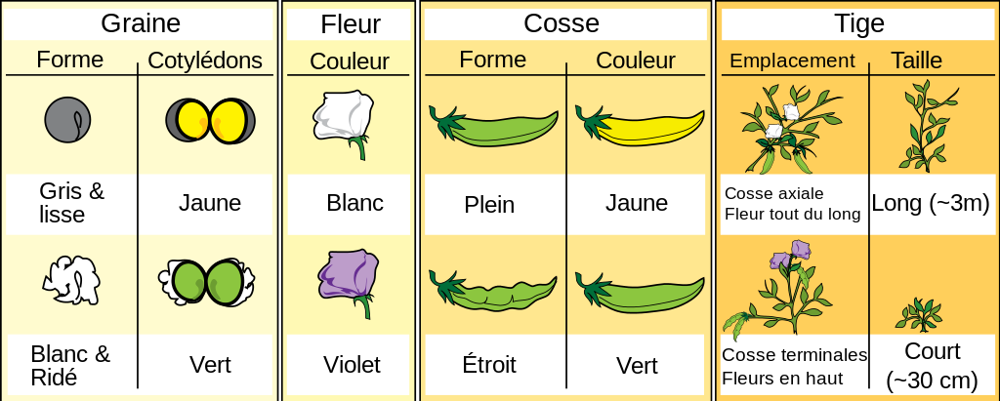
<figcaption>
<small><strong>Figure 19: Les sept caractères analysés par Mendel.</strong></small>
</figcaption>
</figure>  

Attachons-nous avec Mendel à un de ces caractères, la couleur du pois. Il a en effet observé les mêmes résultats pour tous les caractères. Il a effectué trois générations de croisements impliquant ce caractère. 

- Lorsqu'il croise des plantes donnant des pois verts avec d'autres donnant des pois jaunes, 100% de la descendance (qu'il appelle génération F1) donne des pois jaunes. Il ne constate pas de forme intermédiaire. Il définit alors le terme de **caractère dominant** (celui qui domine dans la génération F1: ici pois jaune) et de **caractère récessif** (celui qui disparaît dans la F1: ici pois vert). D'un point de vue des notations, les caractères dominants sont écrits le plus souvent en majuscules romaines et les caractères récessifs en minuscules romaines.

  Nous savons depuis que dans certains croisements:

  - le phénotype de la F1 peut être intermédiaire entre celui des deux parents. Par exemple chez certains pétunias: pétunia blanc x pétunia rouge à F1 de pétunias roses. On dit que le caractère est **semi-dominant.**
  - le phénotype de la F1 peut être l'expression simultanée de celui des deux parents. Par exemple chez l'homme, un homme de groupe sanguin AA x femme de sanguin groupe BB à enfants de groupe sanguin AB. On dit que le caractère est **co-dominant**.

  

- Lorsqu'il croise les descendant F1 par autofécondation: F1 x F1 (pour obtenir la génération qu'il appelle F2), il obtient 75% de pois jaunes et 25 % de pois verts.

- Lorsqu'il croise cette F2 par autofécondation: F2 x F2 (pour obtenir la génération qu'il appelle F3), il constate que les individus "pois verts" donnent naissance uniquement à des individus "pois verts". Par contre 1/3 des individus pois jaunes donnent naissance uniquement à des individus pois jaunes alors que 2/3 des individus se comportent comme ceux de la génération F1 (c.a.d., donnant 25% d'individus "pois verts" et 75% d'individus "pois jaunes").

L'interprétation qu'il donne est la suivante: le pois possède 2 copies de l'information ( noous savons maintenant qu'il est diploïde!!) et reçoit une copie de chacun de ses parents avec la même probabilité. Ceci peut se formaliser de la manière résumée sur la figure 20.

<figure>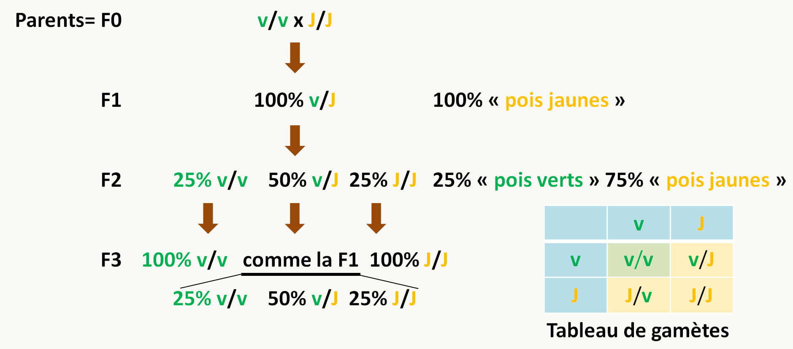<figcaption><small><strong>Figure 20: Formalisation des résultats de mendel lorsqu'il croise des souches qui diffèrent par un seul caractère. les parents portent deux copies identiques de l'information codant la couleur des pois, soit vert (v) soit jaune (J). En F1, les descendants portent aussi deux copies, une verte provenant du parent vert et une jaune provenant du parent jaune. Le caractère jaune est dominant et donc tous les descendants F1 sont jaunes. L'autofécondation des F1 donne en F2 25% de pois vert et 75% de pois jaunes, ce qui est prédit par le tableau de gamète où chaque information de caractère au une équiprobabilité d'être transmise; dans ce tableau la couleur des cases donne la couleur prédite pour le descendant. Le même tableau permet de prédire qu'un tiers des descendants F2 à pois jaunes, ceux qui sont J/J, donneront par autofécondation une descendance F3 100% à pois jaune et les deux autres tiers, ceux qui sont v/J, donneront une descendance identiique à la F1.  </strong></small></figcaption></figure>  

Il semble donc exister une information spécifique pour la couleur du pois qui diffère entre les souches. Cette information est présente en deux copies dans les pois et pour obtenir les proportions ci-dessus, il faut que chacune des copies soit transmise avec la même probabilité: **ce sont la première loi de Mendel qui stipule que chaque gamète ne contient qu'un seul facteur héréditaire et la deuxième loi qui stipule que les différentes versions d'un caractère se séparent et se réassortissent indépendamment.**

**Mendel a ensuite regardé les caractères deux à deux et noté qu'ils sont transmis indépendamment. C'est la troisième loi de Mendel.** Cette loi n'est vraie que dans certains cas. Nous reviendrons ultérieurement plus en détail sur les ségrégations lorsque plusieurs caractères sont en jeu.

Cette unité d'information qui diffère entre les deux souches, c'est ce que l'on appelle maintenant **un gène** (terme inventé par Johanssen). Le gène se trouve sous plusieurs formes: ce que l'on appelle **les allèles ou formes alléliques**. Dans notre exemple, le gène contrôle la couleur du pois et il a deux formes alléliques : "pois verts" ou "pois jaune". Notez que dans de nombreux cas, le gène possède plus de 2 allèles, comme par exemple le système ABO avec 3 allèles. Chez un diploïde, lorsque les deux allèles sont identiques, on dit que l'individu est **homozygote** (pois v/v ou J/J), et **hétérozygotes** lorsqu'il sont différents (pois v/J).

On étend naturellement aux allèles les notions de dominance et récessivité. Ceux-ci sont écrits en général en italique (majuscule pour les allèles dominants et minuscules pour les allèles récessifs).

Pour chaque souche il est possible de donner son contenu en formes alléliques, c'est ce que l'on appelle le **génotype**. Ici le génotype des parents est soit *v/v* soit *J/J*, celui de la F1 est *v/J*, *etc.*

Comme pour le phénotype, on ne donne en général qu'un génotype partiel correspondant à ce que l'on veut étudier. On étend aux allèles les notions de dominance et récessivité.

**L'ensemble de tous les gènes d'un organisme est ce que l'on appelle son génome.**

Maintenant que nous disposons d'un vocabulaire, nous allons répondre à quelques questions.

### 1°) est-ce qu'un même phénotype observé pour deux individus indépendants est forcément causé par un même génotype ?

La réponse est NON !

exemple: au phénotype "pois jaune" correspondent deux génotypes *v/J* et *J/J* . Nous verrons par la suite que des allèles de gènes différents peuvent aussi être responsables de phénotypes identiques.

### 2°) est-ce qu'un même génotype assure toujours un même phénotype ?

La réponse est NON !

Le phénotype résulte de l'interaction entre le génotype et l'environnement. Pour certains caractères, la part prise par l'environnement est négligeable, alors que pour d'autre elle peut être prépondérante:

exemples:

- dans le système des groupes sanguins ABO ou rh+/rh-, la part de l'environnement est inexistante.

- le nombre des facettes des yeux de la drosophile fluctue en fonction de la température (figure 21).

<figure>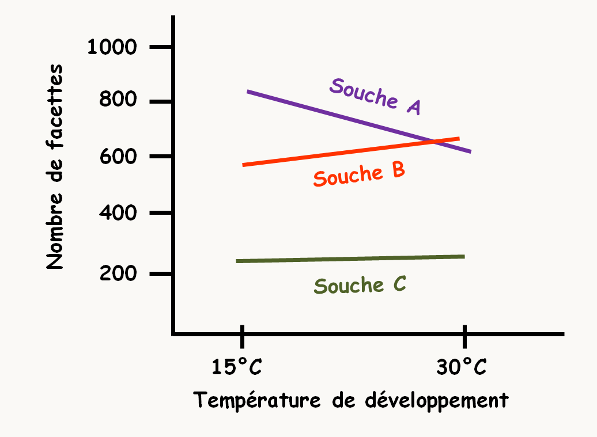<figcaption><small><strong>Figure 21: nombre de facette de yeux de drosophiles pour trois souches (A, B & C) en fonction de la températue d'élevage.  </strong></small></figcaption></figure>  

Dans cet exemple, on constate un effet non négligeable de l'environnement (la température de croissance). Il est alors possible de définir la **norme de réaction qui est l'ensemble des valeurs que peut prendre le phénotype en fonction des conditions de milieu**. Ici de 650 à 850 facettes pour la souche A, de 550 à 700 pour la souche B et de 250 à 300 pour la soucheC. 

L'existence de normes de réaction montre qu'il existe des allèles qui ne s'expriment que dans certaines conditions. On parle alors d**'allèles conditionnels**. Certains allèles entraînent par exemple une létalité dans certaines conditions alors qu'ils n'ont pas d'effet dans d'autres conditions. Ce genre d'allèles est très important car il permet d'étudier des processus vitaux pour la cellule ou l'organisme. La température est la condition qui a souvent le plus d'importance. On définit classiquement 2 types d'allèles :

- Si les allèles sont létaux à haute température on dit qu'ils sont **thermosensibles**. 
- Si les allèles sont létaux à basse température on dit qu'ils sont **cryosensibles**.

La figure 22 montre les effets d'un allèle conditionnel thermosensible de *Podospora anserina* à deux température: 18°C  qui est la température permissive à laquelle le mutant produit des ascospores et 22°C qui est la température non-permissive à laquelle il n'en produit pas.

<figure>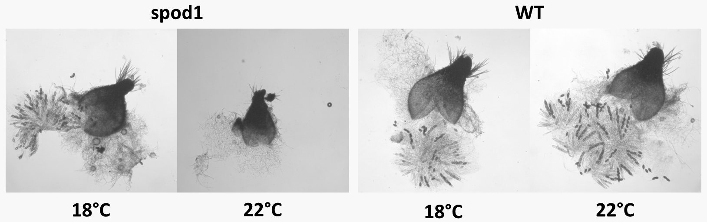<figcaption><small><strong>Figure 22: chez le champignon Podospora anserina, le mutant spod1 est thermosensible pour la production d'ascospores. </strong></small></figcaption></figure>  

Pour certains allèles, on constate que différents individus ayant les mêmes allèles peuvent exprimer une gamme de phénotype. Cela peut être dû par exemple à des facteurs environnementaux qui étaient présents pendant le développement de l'organisme ou à la présence d'autres allèles dans le génome et qui interfèrent avec l'allèle étudié pour en varier les effets. On définit alors l'expressivité d'un génotype pour chaque individu qui est le degré d'expression de son génotype. Si l'expressivité est forte cela veut dire que le phénotype est bien exprimé. Cette définition n'a d'intérêt que si l'expressivité est variable !

exemples:

- on connaît chez l'homme des allèles qui entraîne une prédisposition à certains cancers. Certains individus porteurs de ces allèles développeront rapidement plusieurs cancers (expressivité forte) alors que d'autres individus ne développeront un cancer que tardivement (expressivité faible).

- la couleur du pelage chez beaucoup d'animaux dont le beagle (figure 23)

  <figure>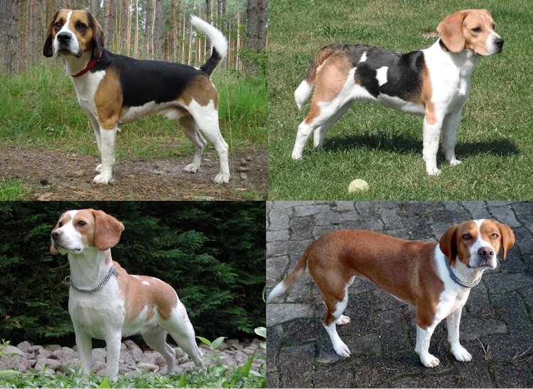<figcaption><small><strong>Figure 23: chez le chien beagle, l'allèle Sp a une expressivité variable, entrainant de grandes fluctuations dans les tâches pie du pelage. </strong></small></figcaption></figure>  

Il est aussi possible de définir **la pénétrance qui est le pourcentage d'individus présentant le phénotype pour un génotype donné dans des conditions données**.

exemple: 

- il existe chez l'homme un allèle dominant provoquant la déformation de la main qui ressemble alors à une pince (ectrodactylie) qui a une pénétrance de 70%. Ceci veut dire que 30% des individus ne présentent pas le défaut mais possède l'allèle, ce qui complique le conseil génétique.

Pour conclure, il faut impérativement comprendre que l'expression des gènes est soumise à de nombreuses fluctuations aboutissant à des caractères très souvent présentant des phénotypes variables.  c'est le cas par exemple des gènes de susceptibilité: ce n'est pas parce que vous possédez l'allèle responsable d'une condition, que vous déclencherez cette condition et que celle-ci répondra aux critères canoniques de définition de son phénotype ! La figure 24 résume les différences entre expressivité et pénétrance et la figure 25 donne un exemple de caractère à expressivité variable ET pénétrance incomplète chez le champignon *Podospora anserina*.

<figure>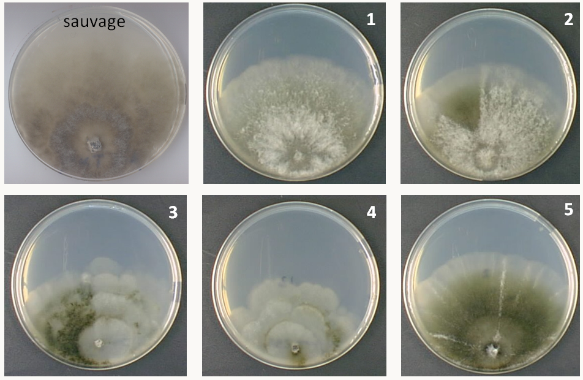<figcaption><small><strong>Figure 24: résumé des effets d'une expressivité variable et/ou d'une pénétrance incomplète d'allèle sur le phénotype. Plus le rectangle est foncé, plus le phénotype est prononcé. </strong></small></figcaption></figure>  

<figure><figcaption><small><strong>Figure 25: chez le champignon Podospora anserina, la délétion du gène codant le transporteur de potassium PaTrk1 crée une dégénérescence cellulaire uniquement dans une partie des descendants (= pénétrance incomplète) et présente différentes sévérités (= expréssivité variable). la souche 1 n'est pas atteinte alors que les souches de 2 à 5 ont des atteintes variables. La souche sauvage présente au contraire toujours le même phénotype. </strong></small></figcaption></figure>  

### Nous avons parlé génotype (gène) et phénotype (caractère). Quelle est la relation entre les deux ?

Nous avons vu que Weismann a proposé la première théorie chromosomique de l'hérédité. Celle-ci a été énoncée plus précisément par Th. Boveri et W. Sutton en 1903. Ils ont en effet remarqué la très forte ressemblance entre la transmission des chromosomes et celle des gènes. Thomas Morgan et son école (Muller, Sturtevant, Bridges) ainsi que Creighton et Barbara Mc Clintock ont définitivement établi cette théorie par une série d'études sur la drosophile et le maïs.

L'étape suivante a été la démonstration qu'un gène code pour un enzyme par G. W. Beadle et E. L. Tatum en 1941. Voici comment ils ont procédé.

Des études précédentes avaient suggéré que "les gènes et la spécificité enzymatique étaient du même ordre". Pour établir qu'un gène code pour une enzyme comme nous le formulons maintenant, ils ont étudié le champignon *Neurospora crassa*. Leur hypothèse de travail était que si les gènes codent pour des enzymes alors il devrait être possible d'obtenir des souches déficientes dans des gènes qui contrôlent des réactions enzymatiques spécifiques. Ils ont obtenu de telles souches. Celles-ci poussent sur du milieu qu'ils ont appelé complet (c.a.d. qui contient les métabolites finaux qui sont nécessaires pour que le champignon croisse, comme les acides aminés, vitamines, bases etc.) mais ne poussent pas sur du milieu dit minimum (qui ne contient pas les métabolites). Ces souches sont dite **auxotrophes**, alors que la souche sauvage qui pousse sur le milieu minimum est dite **prototrophe**. La supplémentation du milieu minimum par une substance précise qui restaure la croissance permet de savoir quel enzyme est déficient. 

Au cours de leurs études, ils ont par exemple obtenu trois souches qui ne pouvaient pas pousser sur du milieu dépourvu d'arginine.

| souches | phénotype                                                         | gène muté|
|---------|-------------------------------------------------------------------|----------|
| A       | pousse sur milieu minimum +arginine                               | 1        |
| B       | pousse sur milieu minimum +arginine ou +citruline                 | 2        |
| C       | pousse sur milieu minimum+ arginine ou + citruline ou + ornithine | 3        |

Or dans la cellule, des analyses biochimiques ont permis d'élucider la chaîne de biosynthèse de l'arginine qui est résumé dans la figure 26.

<figure>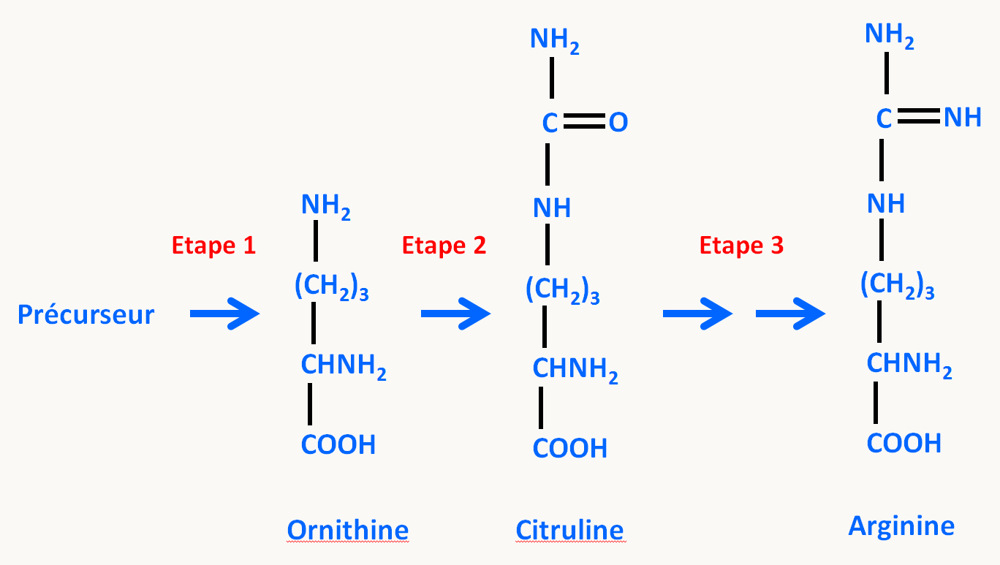<figcaption><small><strong>Figure 26: voie de biosynthèse de l'arginine. </strong></small></figcaption></figure>  

Ici pour expliquer les résultats, il suffit de supposer que :

- le gène 1 contrôle l'étape 3 
- le gène 2 contrôle l'étape 2 
- le gène 3 contrôle l'étape 1 

Maintenant nous savons que ce principe un gène/ un enzyme est très général.

Mais attention, la situation est souvent plus complexe. Un gène peut coder pour une protéine possédant plusieurs activités enzymatiques ou à l'inverse coder pour une seule sous-unité d'un enzyme en comprenant plusieurs. Il peut coder pour une protéine de structure, de régulation ou pour un ARN (tRNA, rRNA, snRNA etc.). D'autres "gènes" sont des éléments nécessaires au fonctionnement des réplicons : origines de réplication ou centromères par exemple. Enfin, des données récentes, sur lesquels nous reviendrons dans la section sur l'épigénétisme, indiquent que certains "gènes" n'ont pas les caractéristiques usuelles.

Notez que les biologistes moléculaires ont réduit la définition du gène à un segment d'ADN codant pour un produit (pour un biologiste moléculaire, une origine de réplication n'est pas un gène). Cette définition est beaucoup trop restrictive pour les généticiens car il est possible de détecter des caractères qui ne sont pas directement reliés à un segment d'ADN (en fait, on en découvre actuellement de plus en plus !!).

### Quelles est la nature chimique de l'information génétique ?

Après la jonction effectuée entre phénotype et génotype se pose la question de la nature chimique de l'information génétique. Deux étapes essentielles ont mené à la découverte de l'ADN en tant que support principal de l'information génétique. Néanmoins, d'autres arguments ont été apportés par différents chercheurs afin de convaincre la communauté scientifique.

#### 1°) Frederick Griffith en 1928 découvre la transformation génétique

F. Griffith travaille sur le streptocoque et fait une observation étrange sur la virulence de cette bactérie (figure 27). Il possède deux types de souches de *Streptococcus pneumoniae*:

- des souches virulentes létales pour les souris qu'il appelle "S" car elle ont un aspect lisse lorsqu'elles forment des colonies sur boite de Pétri (s = smooth).

- des souches non virulentes "R" donnant des colonies rugueuses sur boite de Pétri (r = rough).

La différence de morphologie est due à la présence de polysaccharides protecteurs autour de la cellule chez les souches S. Ces polysaccharides ont différentes compositions qui spécifient le type des pneumocoques (I, II, III etc.). Ils sont facilement visualisables par l'utilisation d'anticorps spécifiques.

Lorsque Griffith chauffe les cellules S de type III et qu'il les injecte à des souris, celles ci ne meurent pas, le chauffage ayant tué les pneumocoques (on peut le vérifier après étalement sur milieu gélosé). De même, l'injection de cellules R de type II vivantes ne provoque pas la mort des souris. Par contre s'il injecte des cellules S III chauffées avec des cellules R II, il constate la mort rapide des souris. Il extrait les bactéries des cadavres et les étales sur boîte de Pétri: certaines des bactéries qui poussent ont un aspect lisse, elles sont S de type III (figure 27).

<figure><figcaption><small><strong>Figure 27: L'expérience de Griffiths. voir texte pour les détails de l'expérience.</strong></small></figcaption></figure>  

Quelque chose qui porte l'information "S III" dans les cellules S tuées se transmet aux cellules "R" vivantes et les transforme en S ! Il a donc découvert le principe de la transformation génétique. Celle-ci consiste en l'introduction à l'intérieur de la cellule d'une information exogène provenant d'une autre cellule. On exclut évidemment dans cette définition, l'introduction d'information virale pour laquelle on utilise plutôt le terme de transfection. 

#### 2°) Avery, Mc Leod et Mc Carthy en 1943 purifient le principe transformant

Partant des expériences de Griffith et en utilisant le système *in vitro*, ces chercheurs purifient par des techniques de biochimie le principe transformant mis en évidence par Griffith. Leurs résultats montrent clairement et de manière surprenante pour l'époque que l'ADN est le principe transformant. En effet, l'hypothèse la plus en vogue était que les protéines étaient le support de l'information génétique: elles représentent la plus grande fraction des chromosomes et elles sont beaucoup plus diverses et complexes que l'ADN. Les expériences d'Avery et ses collaborateurs montrent clairement que les gènes sont faits d'ADN. Il faut en particulier noter que le polysaccharide constituant la capside protectrice des cellules S n'est pas capable de transformer les cellules R en S.

Maintenant, nous savons transformer pratiquement tous les types de cellules procaryotes et eucaryotes. Pour les organismes bien étudiés, il existe même plusieurs méthodes. Par exemple, pour transformer *Escherichia coli*, il existe au moins une dizaine de protocoles efficaces ! Ces expériences ont donc conduit au développement ultérieurs des technologies de transgenèse et donc de création d'organismes génétiquement modifiés ou OGM. Nous reviendons sur ce point lors de la partie sur la "génétique réverse".

L'étape suivante de la compréhension de ce qu'est l'information génétique est passé par la détermination de la structure de l'ADN par Watson et Crick en 1953. D'un point de vue génétique, elle  a permis de proposer des mécanismes pour expliquer comment l'information génétique est codée dans l'ADN et comment elle est transmise au cours des générations. Je vous renvoie à des cours de Biologie Moléculaire pour approfondir vos connaissances sur les structures de l'ADN, de l'ARN, comment ils sont répliqués et transcrits et comment est exprimé l'information, en particulier comment les messagers sont décodés par le ribosomes et les ARNts en utilisant le code génétique.

### Quelles sont les quantités d'information nécessaires pour fabriquer les différents organismes ?

Récemment, une grande publicité a été donnée à l'ADN en tant que seul support de l'information génétique. En effet, on parle du gène de l'alcoolisme, de l'homosexualité, de la schizophrénie etc. Nous avons déjà vu plus haut que la relation gène/phénotype n'est pas absolue et que le milieu (soit au cours du développement, soit plus tard) peut influer fortement sur l'expression des différents allèles. De même, nous savons que certaines structures cellulaires ne peuvent se former qu'à partir de structures preéxistantes (c'est le cas par exemple des mitochondries) et nous verrons avec l'épigénétique d'autres exemples où l'information génétique n'est pas directement codée par les acides nucléiques. Pour l'instant, la proportion réciproque de l'information contenue dans l'ADN et celle qui doit se transmettre par continuité cellulaire n'est pas connue. Les deux informations sont essentielles: une cellule ne peut survivre très longtemps sans son ADN, mais la présence de l'ADN et des constituants cellulaires sous une forme désorganisée ne produit pas spontanément une cellule !

Il est donc pour l'instant très difficile de répondre à la question de la quantité d'information nécessaire à l'élaboration d'une cellule (nous devrions d'ailleurs plutôt parler de la quantité d'information nécessaire à son intégrité).

Cependant, la connaissance du génome complet d'un organisme peut permettre d'évaluer le nombre de gène (et donc grosso modo de protéines) nécessaire à sa propagation. Pour l'instant, le génome contenant le plus petit nombre de gène est celui de *Mycosplasma genitalium*, une bactérie parasite intracellulaire appartenant au groupe des Mollicutes. Il contient environ 520 gènes dont 480 codent pour des protéines. En comparant ce génome avec ceux d'autres bactéries, il est possible de définir le lot minimum de gènes présent dans toutes ces bactéries (l'analyse a été faite initialement avec le génome de *Haemophilus influenza*). Ce lot de gènes doit en théorie être le lot de gène minimum qui permet d'assurer la vie d'une cellule procaryote (il va manquer les gènes responsables des fonctions assurées par des protéines différentes entre organismes, on connaît de tels exemples pour la charge des tRNA par exemple). Cette comparaison aboutit pour l'instant à environ 250 gènes. Des analyses fonctionnelles du génome de *Bacillus subtilis* aboutissent au même ordre de grandeur (un peu moins de 300 gènes sont essentiels).

A l'inverse des chercheurs américains ont créé des bactéries "synthetiques" qui présentent un lot minimal de gènes, en remplaçant dans des cellules de *Mycoplasma capricolum* le génome par des chromosomes fabriqués *in vitro*. La souche JCVI-syn3A ainsi obtenu contient un génome de 543 kilobases codant pour 493 gènes, dont 452 codant pour des protéines. les cellules JCV-syn3A ont un temps de doublement de 2 heures en milieu complet, indiquant qu'elles sont toujours une divison efficace.

Nous reviendrons dans la suite de ce livre sur quelques notions de génomique qui est la partie de la génétique qui traite de l'organisation des génomes et du fonctionnement cellulaire global.

# La variation

## Le polymorphisme

Nous avons vu dans l'introduction que la reproduction est invariante. Cependant, lorsque l'on regarde des individus pris dans la nature, on constate que ceux-ci montrent une certaine variabilité phénotypique. Cette variabilité peut être due à des facteurs environnementaux ou historiques mais elle peut aussi provenir de la présence d'allèles différents de certains gènes.

exemple:

- Chez l'homme il existe dans les populations de nombreuses différences héréditaires liées à la présence d'allèles différents de gènes contrôlant des caractères visibles (couleur de la peau, des cheuveux ou des yeux, taille, poids, *etc.*) ou invisibles (groupes sanguins *etc.*).

On dit que les populations présentent un **polymorphisme** pour les gènes en question. Les gènes sont dits polymorphes (= qui possèdent plusieurs formes).

On peut alors définir les **fréquences allèliques** des différents allèles du gène qui sont les proportions des différents allèles dans la population. Pour les calculer, il faut estimer les fréquences des différents génotypes et ensuite en déduire la fréquence de chacun des allèles.

exemple:

Dans une population d'esquimaux, le groupe sanguin M/N a été étudié. Ce groupe sanguin possède deux allèles M et N. Les résultats obtenus sont les suivants :

| génotype            | MM    | MN    | NN    |
|---------------------|-------|-------|-------|
| proportion observée | 0,835 | 0,156 | 0,009 |

la fréquence de M = 0,835 + 0,156/2 = 0,913, celle de N = 0,009 + 0,156/2

Ces fréquences sont une mesure du polymorphisme existant pour un gène dans la population. Elles fluctuent en fonction du gène étudiée. Une autre mesure, plus utilisée car elle reflète mieux le polymorphisme, est le pourcentage d'hétérozygotes présent dans la population, c'est ce que l'on appelle le **taux d'hétérozygotie**.

## les moyens d'étude du polymorphisme

Il est possible d'explorer le polymorphisme à différents niveaux. Le premier niveau est l'exploration de l'aspect phénotypique que l'on peut apprécier par diverses techniques (observation directe, détection immunologique, etc.). Ce que l'on constate c'est que le polymorphisme est extrêmement variable en fonction du type d'organisme étudié, de la population et du caractère.

exemple:

- Si nous reprenons l'analyse des groupes sanguins M/N étendue à plusieurs populations, nous arrivons aux résultats consignés dans le tableau suivants qui donne les proportions observées des individus MM, MN et NN dans plusieurs populations et les fréquences alléliques calculées à partir de ces proportions:

|            | MM  | MN  | NN  | M   | N                 |
|------------|-----|-----|-----|-----|-------------------|
| esquimaux  |0,835|0,156|0,009|0,913|0,087              |
| aborigènes |0,024|0,304|0,672|0,176|0,824              |
| égyptiens  |0,278|0,489|0,233|0,523|0,477              |
| allemands  |0,297|0,507|0,196|0,550|0,450              |
| chinois    |0,332|0,486|0,182|0,575|0,425              |
| nigérians  |0,301|0,495|0,204|0,548|0,452              |

Vous voyez que les populations sont très variables quant à la présence des deux allèles M et N.

Il est possible de détecter des différences de structure pour de nombreux enzymes en les faisant migrer sur des gels d'acrylamide non-dénaturants (figure 28). Les enzymes sont ensuite révélés *in situ* dans le gel grâce à un test coloré: on obtient ce que l'on appelle un **zymogramme**. Ceci permet de détecter de nombreux polymorphismes qui ne sont pas directement apparents au moment de l'observation macroscopique des individus. Ceci a suggéré que de nombreux polymorphismes sont en fait invisibles et n'entraînent pas de phénotype : Ils seraient donc **"neutres" ou "silencieux"** d'un point de vue évolutif. Nous allons voir dans les paragraphes suivants qu'effectivement de nombreux polymorphismes sont neutres.

<figure><figcaption><small><strong>Figure 28: zymogramme révélant des polymorphismes cachés chez un organisme diploïde. les individus 4 et 7 sont hétérozygotes alors que les autres sont homozygotes.</strong></small></figcaption></figure>  

Un autre niveau d'observation se situe directement au niveau du matériel génétique. Il est possible de le subdiviser en 3 sous-niveaux d'observations: les chromosomes, des caractéristiques moléculaires de la séquence (sites de restriction, etc.) et enfin la séquence elle-même.

- Dans un premier temps, les chercheurs ont observé les caryotypes des individus d'une même espèce. Ils ont vu que certaines populations naturelles (surtout de plantes) contiennent des modifications de caryotype très importantes: présence de chromosomes surnuméraires, fusion de chromosomes (et réciproquement !), altérations de la structure de certains chromosomes, éventuellement polyploïdie. Nous n'entrerons pas le détail des techniques d'observation car celles-ci relèvent de la cytogénétique.

- Le deuxième niveau d'accès se fait via l'utilisation de techniques moléculaires qui permettent de détecter de nombreux polymorphismes silencieux ou non. De nombreuses techniques sont disponibles et nous en verrons seulement quelques-unes parmi la panoplie qui est disponible actuellement.
  - Le **RFLP (Restriction Fragment Length Polymorphism)**. Il est possible par exemple pour détecter des polymorphismes de faire des Southern Blots à partir d'ADN provenant de souches différentes et d'hybrider les filtres obtenus avec des sondes appropriées. Des polymorphismes de présence / absence de sites de restriction sont alors détectables. Cette technique maintenant ancienne n'est plus couramment utilisée du fait de sa lourdeur
    
  - Les **PCR et RAPD (Random Amplified Polymorphic DNA)**.  L'utilisation de la PCR du fait de sa rapidité permet de détecter facilement des polymorphismes de taille. En effet, des couples d'amorces permettent d'amplifier des régions données du génome. Celles-ci peuvent contenir des polymorphismes de taille avec des insertions ou délétion de séquences; ce que l'on appelle maintenant des **indels**. Les produits résultant de l'amplification auront alors des tailles différentes. Nous reviendrons sur ce genre de polymorphisme un peu plus loin car ce sont eux qui sont utilisés pour faire les **empreintes génétiques**. La PCR permet aussi de détecter d'autres polymorphismes plus subtils. Il existe de nombreuses méthodes utilisant la PCR; une fréquemment utilisée est la RAPD (Random Amplification Polymorphism DNA, figure 29). 

<figure>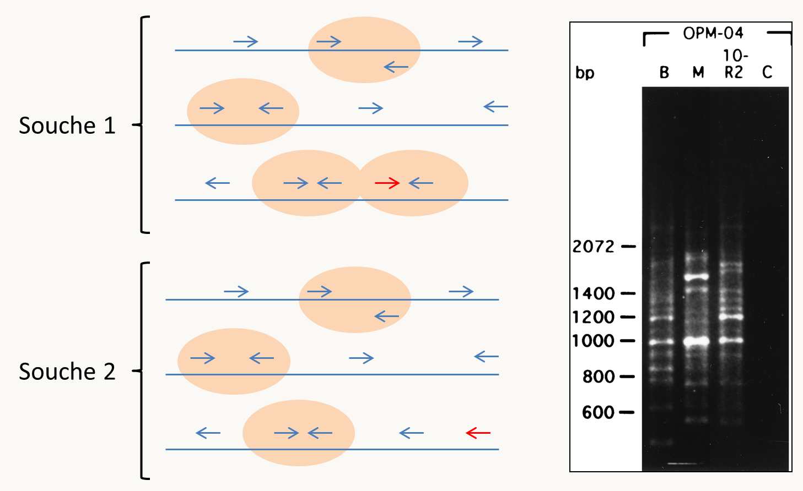<figcaption><small><strong>Figure 29: principe de la RAPD (Random Amplification Polymorphism DNA). La RAPD utilise la méthode de la PCR mais en utilisant un seul oligonucléotide d'une dizaine de nucléotides de long. Mis en présence d'un ADN génomique dans des conditions de faible stringence, cet oligonucléotide va s'hybrider avec de nombreuses séquences. L'hybridation est imparfaite mais suffisante pour que les amorces puissent être utilisées par la Taq DNA polymérase. Pour les souches 1 et 2 dont les génomes sont schématisés à gauche, l'amplification par PCR va permettre de faire apparaître un certain nombre de bandes (ici celles générées par les amorces surlignées en orange, pratiquement on utilise des conditions qui permettent d'amplifier une dizaine de bandes). L'utilisation de plusieurs oligonucléotides de séquences différentes et des modifications de la stringence permet d'obtenir des profils en "RAPD" des souches. Si des polymorphismes sont présents entre des souches, il permettront des hybridations différentielles des amorces (ici en rouge) et conduiront à des modifications des profils RAPD. Ce type de technique est très utilisé pour "génotyper" des souches. Dans certains cas, les polymorphismes sont associés à des caractéristiques des souches (comme la virulence pour des souches de bactéries ou de champignons pathogènes ou encore la productivité de certaines plantes d'intérêt agronomique, etc.). La photo à droite montre un exemple de RAPD produite à partir d'ADN de souches de la nature de l'escargot, Biomphalaria glabrata, qui sont résistantes (B et 10-R2) ou sensible (M) au ver parasite Schistosoma mansoni. Cet escargot est un hôte intermédiaire de ce ver trématode qui infecte aussi l'homme; 600 millions de personnes vivent dans les zones à risque où réside ce pathogène.</strong></small></figcaption></figure>  

- Enfin, la détermination directe des séquences d'ADN provenant d'individus ou de souches différentes permet de détecter de nombreux polymorphismes.

  - exemples:

    - La protéine P53 est une protéine impliquée dans le contrôle de la prolifération cellulaire et qui empêche la formation de tumeurs cancéreuses. Du fait de son implication dans la formation de cancers, les séquences du gène codant cette protéine ont été obtenues chez de nombreux individus. Dans la séquence codante du gène, il a pu être trouvé un certain nombre de polymorphismes (qui n'ont pas d'effet sur le fonctionnement de la protéine bien que certains changent un acide aminé dans la séquence de la protéine). La table ci-dessous donne les variations rencontrées les plus fréquemment.

    | N°du codon | nucléotide | acide aminé |
    | ---------- | ---------- | ----------- |
    | 213        | CAG ou CGG | Arg         |
    | 72         | CGC ou CCC | Arg ou Pro  |
    | 47         | CCG ou TCG | Pro ou Ser  |

    - Le project ENCODE (https://www.encodeproject.org/)  a permis de détecter 1,5 million de polymorphismes n'affectant qu'une seule base ou **SNP (pour Single Nucleotide Polymorphism)** dans le génome humain, ce qui veut dire que deux génomes humains pris au hasard diffèrent par environ une base sur deux milles! Ce chiffre ne prend pas en compte les différences de nombres de copies de séquence répétées et des indels! Ces valeurs de l'ordre du ‰ sont couramment retrouvées lorsque des souches différentes pour une espèce données sont comparées. Au contraire, lorsque des souches provenant d'espèces proches (comme les espèces jumelles appartenant au même complexe), les valeurs de polymorphismes sont souvent 10 fois supérieures et donc de l'ordre du %. Par exemple, les différences entre les génomes de l'homme moderne et de l'homme de Néanderthal sont quatre à six fois supérieures à celles trouvées entre humains modernes, soit un pourcentage d'identité de 99.5%. Avec le chimpanzé, ce pourcentage descend à environ 98%.

      

## Localisation des polymorphismes

Les polymorphismes peuvent être localisés dans les gènes. Dans ce cas, ils peuvent avoir des effets sur le fonctionnement des gènes et entraîneront des variations détectables au niveau de l'organisme. Dans beaucoup de cas, ils n'entraînent cependant aucune modification de fonctionnement et n'auront pas d'effet. 

- exemples: 

  - nous avons vu que le gène codant la protéine P53 possède des polymorphismes nucléotidiques qui ne se retrouvent pas au niveau de la protéine. Il est donc raisonnable de penser que ces polymorphismes n'ont aucun effet phénotypique au niveau de l'organisme. Dans le même gène, il existe d'autres polymorphismes qui modifient le fonctionnement de la protéine. Les porteurs de certains allèles présentent des prédispositions à développer des cancers.

  - les polymorphismes présent dans les introns sont en général silencieux, sauf s'il perturbent l'épissage de l'intron.

Les polymorphismes localisés entre les gènes n'auront en général pas d'effet au niveau de l'organisme, sauf s'ils touchent des régions qui régulent l'expression des gènes.

On admet maintenant que la plupart des polymorphismes présents dans les génomes sont neutres d'un point de vue évolutif, c'est à dire qu'ils n'entraînent ni avantages ni désavantages sélectifs. De fait, ils sont dans la plupart des cas localisés dans des régions qui "ne s'expriment pas" (région intergénique ou intron). Nous reviendrons sur ces problèmes d'effets des polymorphismes dans la section qui traite de la mutation.

## Les différents types de polymorphismes

Il existe de très nombreux types polymorphismes. Ce qui suit concerne principalement les polymorphismes qui sont retrouvés de manière abondante dans la nature.

### les modifications ponctuelles ou SNP (Single Nucleotide Polymorphism)

On appelle ponctuelles des modifications qui n'affectent que un ou quelques nucléotides. Ces modifications ne sont en général détectables au niveau de la molécule d'ADN que par séquençage. Ce sont soit des variations de nucléotides (sans changement du nombre de nucléotides) soit des insertions/délétions de 1 ou quelques nucléotides. Elles sont très fréquentes.

### les Indels: duplication segmentales et transposons

Très souvent des séquences diffèrent par la présence d'insertions / délétions de longues séquences d'ADN ou **indel**. Ceux-ci sont facilement détectables par PCR ou si la taille de la modification est importante, directement sur le caryotype (cf. variations chromosomiques). Certains de ces indels sont des duplications, voire des amplifications plus importantes de séquences du génome contenant éventuellement des gènes. On appelle ces séquences des **duplication segmentales**. Lorsque les séquences dupliquées sont les unes à la suite des autres, c'est à dire en tandem, le nombre de répétition est souvent très variable. Nous reverrons ceci plus en détail dans le paragraphe sur les mini/microsatellites.

Cependant, dans la très grande majorité des cas, les indels sont dû à la présence absence de séquences d'**ADN mobiles que l'on appelle ""éléments transposables" ou transposons**. Ces morceaux d'ADN ont la propriété de pouvoir se répliquer indépendamment du chromosome et de s'insérer à différents endroits du génome. Ils peuvent donc "sauter" d'une région à une autre, ce qui explique le polymorphisme de leur présence ou absence à certains locus. Ils ont été découverts par Barbara Mc Clintock en étudiant chez le maïs des phénomènes d’instabilité génétique qu’elle a attribué à un élément mobile Ds (pour dissociation ) et à son compagnon l’élément Ac (pour activateur). Après plusieurs décennies d’études génétiques et moléculaires (travail commencé en 1940 jusqu’à sa mort en 1992), elle a pu montrer en détail comment les éléments Ds et Ac transposaient et comment ils altéraient l’expression des gènes voisins. Son travail a révolutionné les idées précédemment admises sur la stabilité du génome et ouvert la voie aux conceptions modernes sur la fluidité, la variabilité, la constante réorganisation des génomes (voir plus loin). Actuellement, suivant les modalités de leur déplacement, on distingue deux grands groupes principaux de transposons

- les **transposons de type I ou rétrotransposons** (= rétroposons) où la séquence du transposon se trouve amplifiée par des étapes de transcription et reverse transcription (figure 30). Certains sont apparentés aux rétrovirus, qui se différencient des rétrotransposons par le fait que les rétrovirus ont une phase extracellulaire, alors que les rétrotransposons ne sortent pas de leur cellule hôte. Actuellement, il n'est pas clair de savoir si les rétrotransposons ont généré les rétrovirus ou l’inverse! Quoi qu'il en soit, ces transposons ont donc de grandes capacités d'envahissement des génomes car leur mécanisme de transposition est de type copier/coller.

	<figure>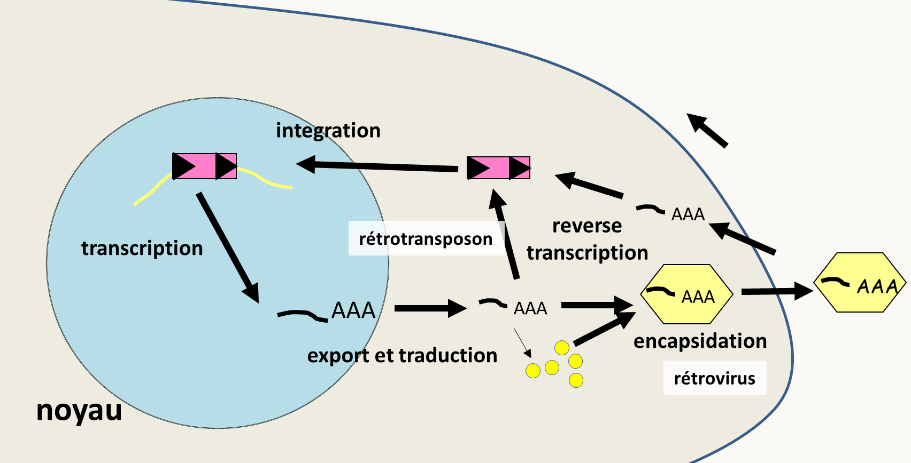<figcaption><small><strong>Figure 30: Cycle des retrotransposons et de rétrovirus. L'élément initial est present dans le génome de l'hôte où il s'est intégré par recombinaison. Cet élément possède son propre promoteur ce qui permet sa transcription. L'ARN messager maturé est exporté dans le cytoplasme où il est traduit, ce qui permet la production d'une transcriptase inverse et/ou de protéines de capside. Dans le cas des rétrotransposons, la transcriptase inverse se sert immédiatement de l'ARN pour refaire un ADN double brin qui une fois importé dans le noyau peut se réinsérer. Dans le cas des rétrovirus, l'ARN est encapsidé et la particule virale exportée. Elle pourra alors infecter une nouvelle cellule hôte. Notez que l'on connaît des exemples où l'ARN du rétrotransposons est encapsidé mais la particule pseudovirale obtenue ne quitte pas la cellule.</strong></small></figcaption></figure>  

	Il existe deux grands groupe de ces transposons de type I: les rétrotransposons à LTR qui sont proches des rétrovirus et les rétrotransposons sans LTR (figure 31). La transposition des rétrotransposons à LTR est bien comprise; celle de ceux sans LTR l'est moins.

	<figure>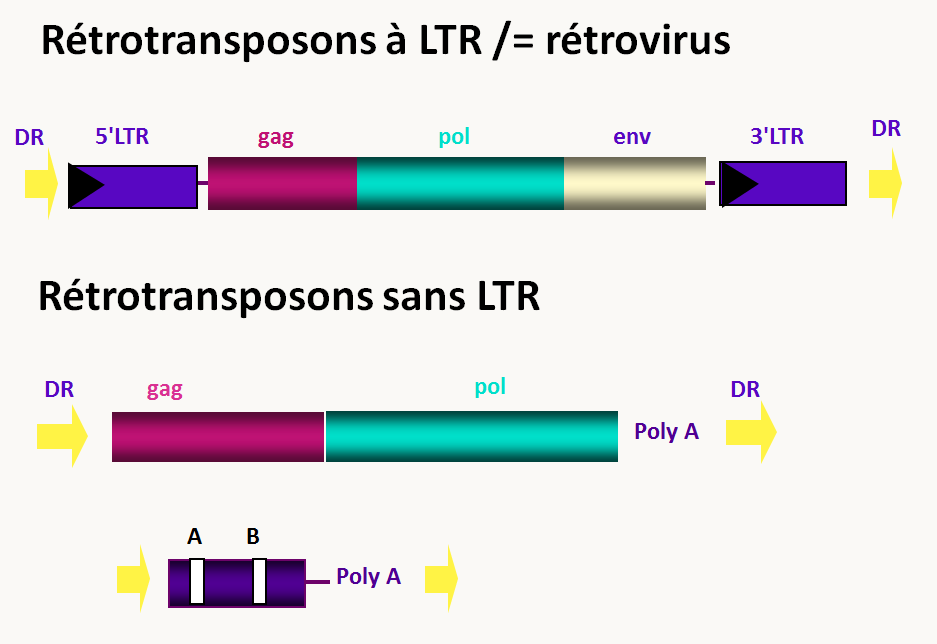<figcaption><small><strong>Figure 31: Les deux grands types de rétrotransposons avec ou sans LTR. Les LTR pour Long Terminal Repeat sont de  séquences d'ADN de quelques dizaines/centaines de paires de base, identiques et situées aux extrémités du transposons dans le même sens. Elles contiennent des séquences impliquées dans la transcription et la transcription inverse de l'éléments. En général, ces rétrotransposons codent pour une protéine de capside (gag) et la transcriptase inverse pol. Les deux phase codante sont généralement séparées par un codon stop ou un décalage de cadre d'une paire de base. La proteine pol est donc souvent traduite grace à une erreur de traduction ce qui permet d'assurer un rapport correct de protéines de capside versus polymérase pour assurer un empaquetage correct d'une particule virale. D'autres retrotransposons on la même structure que les rétrotransposons à LTR la mais n'ont pas de LTR. D'autres ont des structures plus simples et ne codent pas pour des protéines. Dans ce cas, il existe des élements ailleurs dans le génome qui fournissent les enzymes nécessaires à la transposition. Lors de leur insertion, les rétrotransposons provoquent des petites répétitions de l'ADN du site cible (DR) de quelques paires de bases.</strong></small></figcaption></figure>  

	Notez que les deux copies de LTR bordant les rétrotransposons du premier type peuvent être le siège d'un évènement de recombinaison, ce qui va aboutir à l'excision du transposon et au maintien dans le génome d'une seule copie de LTR (voir plus bas le mécanisme d'excision). Il ne reste donc que ce que l'on appelle alors un "solo LTR". Ces solo LTR peuvent être très fréquents dans les génomes.

- Les **transposons à ADN ou transposons de type II** qui ne passent pas par un intermédiaire ARN (figure 32).  La transposition peut être conservative (de type couper/coller): le transposon s'excise du fragment d'ADN et se réintègre à un autre endroit. Ces transposons n'ont donc pas a priori des grandes potentialités d'envahissement du génome. Ce qui est important d'un point de vue génétique, c'est que lorsque les transposons de ce type s'excise, suivant le mécanisme mis en jeu, ils peuvent ou non laisser une "cicatrice". La cicatrice est variable en fonction de l'élément et peut être composée de quelques nucléotides provenant de l'élément ou d'une duplication de la région où l'élément est inséré. La transposition peut aussi être réplicative et ces transposons ont des potentialité plus importantes d'envahissement des génomes. Au moment de l'intégration ces transposons créent comme les rétrotransposons souvent au point d'insertion des petites duplications qui vont laisser certaines des cicatrices observées lors de leur excision.

  <figure>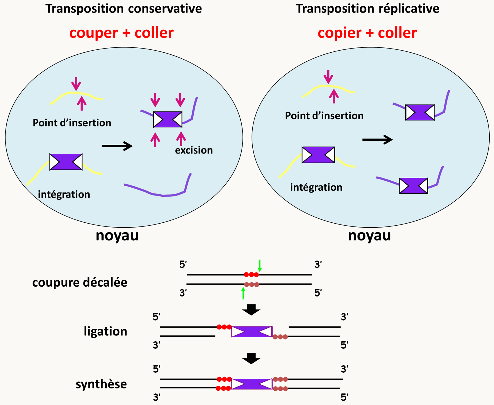<figcaption><small><strong>Figure 32: les deux types de mode de transposition des transposons à ADN et le mécanisme d'intégration des transposons. </strong></small></figcaption></figure>  

  la structure de ces éléments est simple car ils sont composés d'un gène codant une 'transposase' qui possède des activités endonuncléase/recombinase, entouré de deux séquences répétées inversées ou ITR pour Inverted terminal Repeat. Ces transposons sont sujet à de nombreuses mutations et dans les génomes, il en existe souvent de copies tronquées.  Elles sont incapables de bouger seules et ont besoin de transposases codées par les transposons pleine longueur. Les plus petits sont appelé MITE pour Miniature Inverted–Repeat Transposable Elements.

	<figure><figcaption><small><strong>Figure 33: structure des transposons de groupe II. </strong></small></figcaption></figure>  

Outre ces deux grands types, il existe plusieurs autres éléments mobiles plus exotiques. C'est le cas par exemple d'introns situés dans le génome mitochondrial chez les champignons qui ont des capacités de transposition, comme le premier intron du gène codant la sous-unité I de la cytochrome oxydase chez *Podospora anserina* qui contient un intron original. Celui-ci code pour une transcriptase inverse qui lui permet de se comporter comme un transposon. Nous reviendrons sur cet exemple dans la section suivante sur les éléments extrachromosomiques (voir figure 40).

Notez que les transposons sont très répandus car il virtuellement présents dans tous les génomes!  dans la plupart des espèces, il existe même plusieurs transposons dont certains ont pu s'amplifier de manière extraordinaires (figure 33).

<figure>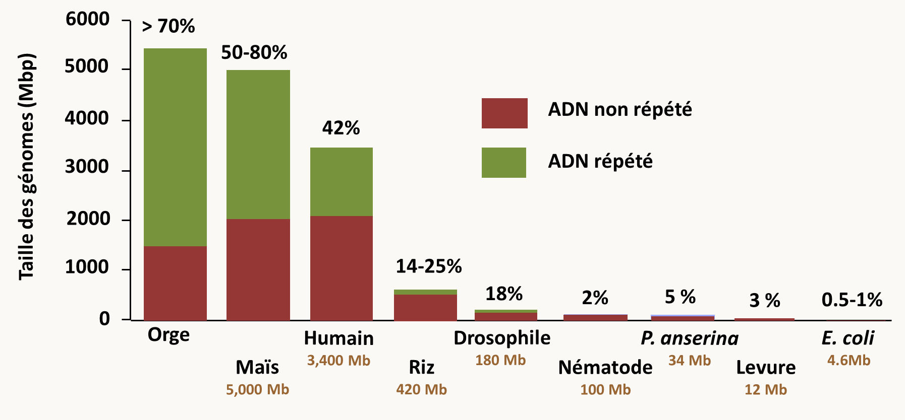<figcaption><small><strong>Figure 34:tailles des génomes versus taille des séquences répétées constituées principalement de transposons.</strong></small></figcaption></figure>  

- chez les mammifères, plus d'un million de transposons se sont accumulés dans le génome. Ils représentent au moins 35% du génome humain. Les "rétroéléments" L1 (pour line 1) et Alu sont les plus fréquents.
- chez les plantes, l'accumulation de transposons est extrême puisqu'ils peuvent représenter la fraction majoritaire du génome (60-80%); dans certains cas, comme chez le pin, ils représenteraient 100 000 MB d'ADN soit 50 fois le génome humain !!!
- chez la drosophile, ils représentent 18% du génome.
- chez le champignon *Podospora anserina*, on estime qu'il représente 5-10% du génome
- chez *Saccharomyces cerevisiae* qui est pauvre en transposon, il n'existe que 5 rétrotransposons (appelés Ty1 à Ty5 pour Transposons of yeast) dont le nombre de copie varie en fonction des souches de quelques copies à plusieurs centaines, en particulier de solo LTR.
- chez les bactéries, les transposons semblent plus rares, comme chez *Escherichia coli*, où ils représentent moins de 1% du génome. Chez les procaryotes, les transposons sont souvent modulaires. L'unité de base est appelée sequence IS pour séquence d'insertion. Formellement, elles sont l'équivalent des transposons eucaryote de type II. Des séquences IS peuvent encadrer des régions d'ADN contenant des gènes responsables de résistances à des produits toxiques (comme les antibiotiques) ou de métabolismes particuliers. L'ensemble se comporte alors comme un transposon géant et se transfère éventuellement horizontalement entre bactéries.

Dans la plupart des génomes les transposons ne sont pas répartis au hasard (figure 35). En effet, ils sont concentrés au centromère dont ils constituent souvent la majeure partie. Ils sont aussi présents aux télomères et chez certains eucaryotes qui n'ont pas de télomérase, leur transposition permet le maintien de l'intégrité des extrémités des chromosomes. Ils sont enfin présents sous forme de "nids à transposons"  dans des régions situées au sein des bras chromosomiques. La plupart de ces nids à transposons sont empaquetés dans de hétérochromatine qui va inhiber leur expression. Néanmoins, les transposons peuvent s'insérer virtuellement partout dans le génome et leur insertion peut causer des inactivations de gènes ou des modifications de leur expression.

<figure>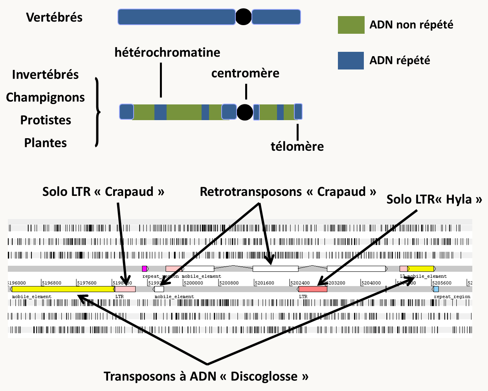<figcaption><small><strong>Figure 35:en haut, répartition des transposons dans différents génomes. En bas, un nid à transposon dans le génome de Podospora anserina. </strong></small></figcaption></figure>  

### Les éléments génétiques extrachromosomiques

Il s'agit principalement de plasmides et autres épisomes. Néanmoins, dans certains cas il peut s'agit d'ARN doubles brin apparentés à certains virus, voire des bactéries endosymbiotiques. Par exemple, chez *Saccharomyces cerevisiae* le caractère "killer" est conféré par des ARNs double brin alors que chez la paramécie, il est conféré par des bactéries endosymbiotiques. Le caractère "killer" permet aux souches qui le portent de tuer les souches sensibles en secrétant une toxine à laquelle elles résistent. Les facteurs de résistance ou antitoxine sont souvent portées par le même élément que celui qui porte les toxines.

Les plasmides sont surtout présents chez les bactéries où ils confèrent des résistances à divers antibiotiques, mais ils sont aussi détectés chez les eucaryotes. Chez les eucaryotes avec quelques exceptions, ils sont localisés dans la mitochondrie ou le chloroplaste où ils ne semblent pas promouvoir des avantages mais plutôt des inconvénients. Je vous rappelle que les plasmides ont permis le développement de systèmes de manipulation de l'ADN in vitro et de la technologie de l'ADN recombinant en permettant le clonage et l'analyse des gènes. Pour plus de détail, je vous renvoie à vos cours de Biologie Moléculaire. Cette technologie sera considérée comme acquise dans ce livre dans le cas des bactéries. Voici quelques exemples de plasmides et autres éléments génétiques facultatifs.

Chez *Escherichia coli*

- ColE1 : Ce plasmide est circulaire double brin, mesure 9 kb et est présent à 10-30 copies par cellules. Il est connu pour avoir donné son origine de réplication qui est à la base de la majorité des vecteurs que nous utilisons (pBR322, Puc18, pBluescript, etc.; figure 36). Il porte un gène de production de bactériocine (ici la colicine E1) qui est une protéine bactéricide et qui assure donc un avantage aux bactéries qui le portent. Il existe de nombreux autres types de gènes pouvant être portés par des plasmides: gènes de résistance à des antibiotiques, gènes de virulence, gènes d'enzymes de dégradation de substrats divers...).

  <figure>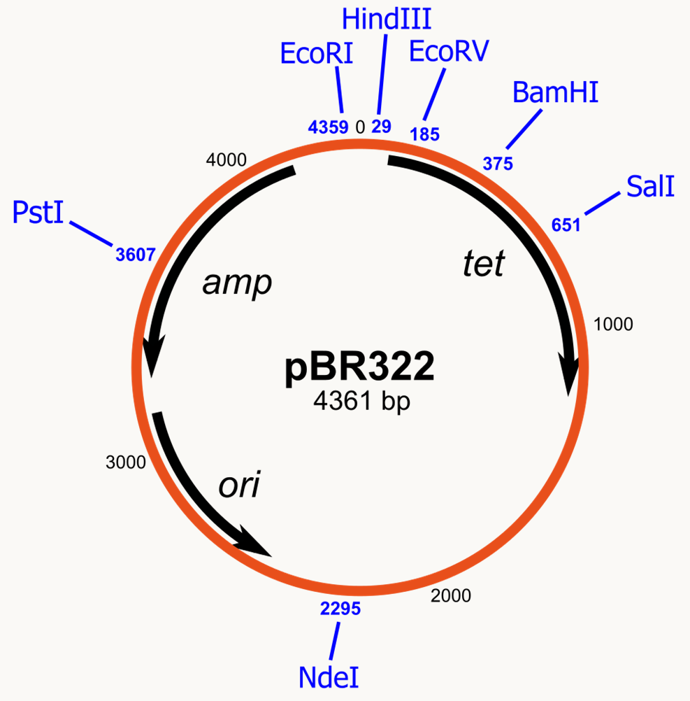<figcaption><small><strong>Figure 36: Le plasmide pBR322, un des premier plasmide de clonage chez Escherichia coli.</strong></small></figcaption></figure>  

- L'épisome F: Le plasmide F est circulaire double brin, fait 94,5 kb et se trouve à 1 copie par cellule (figure 37). Il ne porte pas de gène de résistance ou autre mais il code pour de nombreux gènes impliqués dans la formation de contacts entre cellules et du transfert du plasmide pendant la "conjugaison". En effet, on appelle F+ les couches qui portent le plasmide F et F- celles qui ne le portent pas. Les souches F+ ont de long "poils" sexuels qui permettent d'établir des ponts cytoplasmiques avec des souches F-. Après établissement du contact entre une cellule F+ et une cellule F-, le plasmide F est transféré unidirectionnellement de la souche F+ vers la souche F- aboutissant à sa transformation en souche F+. On appelle ce processus conjugaison ou abusivement cycle parasexuel et les F+ sont alors appelées mâles et les F- femelles (figure 37).

  <figure>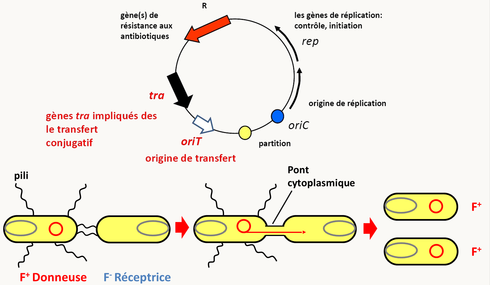<figcaption><small><strong>Figure 37:l'épisome F et le mécanisme de conjugaison bactérienne.</strong></small></figcaption></figure>  

  F possède aussi plusieurs régions qui permettent son insertion dans le chromosome: il s'agit donc d'un épisome. Nous verrons comment l'utiliser pour la cartographie de gènes dans les bactéries.

- le plasmide Ti: ce plasmide présent chez la bactérie *Agrobacterium tumefaciens* porte la région T-DNA qui est injectée dans les cellules de plantes par la bactérie lorsque celle-ci infecte les plantes.

  <figure><figcaption><small><strong>Figure 38:le plasmide Ti d'Agrobacterium tumefasciens et le transfert d'ADN aux cellules de plantes.</strong></small></figcaption></figure>  

  Ce plasmide a permis de mettre au point des méthodes pour transformer les cellules végétales ou fongiques. 

Chez *Saccharomyces cerevisiae*

- 2µ : Le plasmide 2µ est circulaire double brin et fait 6,3 kb (figure 39). Il se trouve dans le noyau de levure à 20/30 copies par cellule. On ne comprend pas bien pourquoi il est maintenu dans les populations, car il ne semble pas conférer d'avantage (résistance ou autres) aux souches qui le portent et ne semble pas avoir de système de propagation efficace comme F. Pourtant,  il est présent dans environ 70% des souches et se perd avec une fréquence inférieure à 0.001 %. Outre une origine de réplication (ORI) et une région cis qui confère la stabilité du plasmide (STB), il possède quatre gènes codant pour des protéines dont deux (REP1 et REP2) sont impliquées avec STB dans l'équipartition du plasmide entre cellules mères et cellules filles et une (FLP1) dans un mécanisme de recombinaison spécifique qui permet l'interconversion du plasmide entre deux formes en catalysant la recombinaison entre les deux séquences FRT, ce qui permet de changer de mode de réplication et donc participe au contrôle du nombre de copies du plasmide. La dernière RAF1 contrôle aussi la stabilité et le nombre de copies du plasmide. Le plasmide 2µ a servi de base pour générer de nombreux vecteurs pour introduire de l'ADN chez la levure et le systeme FLP/FRT a permis la construction de systèmes de mutations conditionnelles. 

  <figure>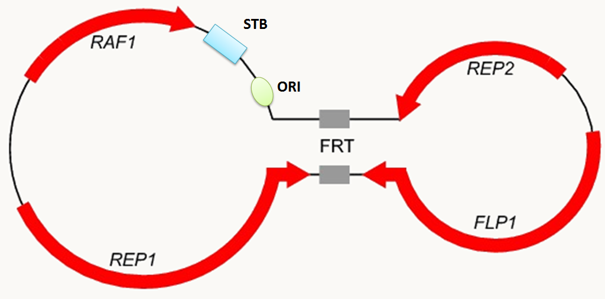<figcaption><small><strong>Figure 39:le plasmide 2µ.</strong></small></figcaption></figure>  

Chez *Podospora anserina*

- pAL2-1: ce plasmide de 9.3 kb est localisé dans la mitochondrie de quelques souches de *Podospora anserina* (figure 40). Contrairement au plasmides précédents, il est linéaire. Il code pour deux protéines: une ADN polymérase et une ARN polymérase probablement impliquées dans l'expression et la réplication du plasmide. pAL2-1 confère un allongement de la longévité des souches qui le porte, ce qui est en opposition à des plasmides similaires présents chez *Neurospora crassa* qui eux cause au contraire des syndromes dégénératifs.

- senDNAα: nous avons vu dans la section précédente que le gène codant la sous-unité I de la cytochrome oxydase chez *Podospora anserina* contient un intron original qui a la capacité de transposer (figure 40). Les copies transposées sont présentes dans une minorité des molécules de génomes et ne sont détectables que par PCR. Il a aussi la capacité de se retrouver sous forme de molécules circulaires extra-chromosomiques qui s'amplifie au fur et à mesure que les souches sénescent. En particulier, il est indétectables dans les souches jeunes, alors qu'il peut remplacer l'ADN mitochondrial dans la plupart des souches sénescentes. Le modèle pour expliquer la genèse de la première molécule extrachromosomiques est basée sur la transposition de l'intron en amont de sa position, créant ainsi un doublet d'intron en tandem direct. Une recombinaison entre les deux copies permet de libérer une molécule circulaire (voir plus loin dans le livre, ce qu'il se passe lorsque deux séquences répétées en tandem recombinent) et qui ensuite peut s'amplifier via la présence d'une origine de réplication. La vitesse de l'amplification de cet élément dépend des souches, mais son amplification semble une constante de toutes les souches sauvages étudiées. Cet élément permet de montrer les limites de la notion de polymorphisme des éléments génétiques extrachromosomiques. En bon franglais, on parle donc plutôt d'un élément "plasmid-like".

  <figure>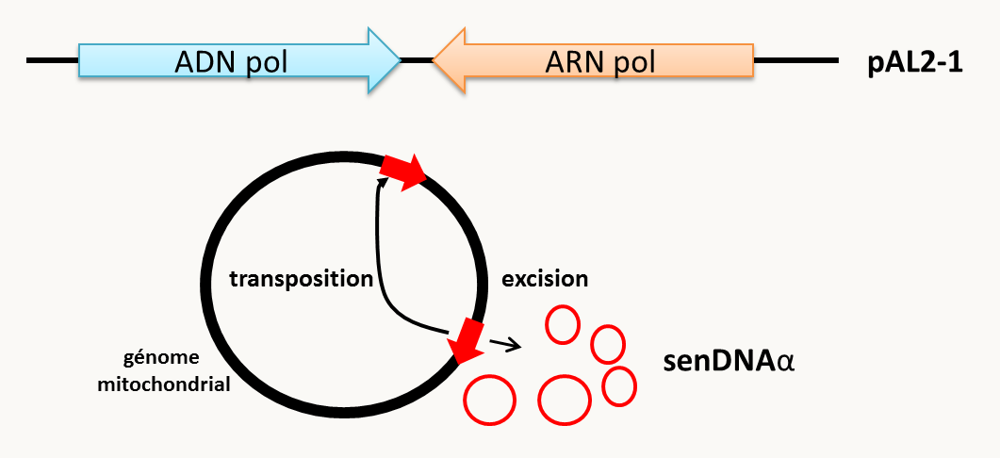<figcaption><small><strong>Figure 40:les plasmides mitochondriaux de Podospora anserina.</strong></small></figcaption></figure>  

### les mini et les microsatellites

Chez de nombreuses espèces (et en particulier chez les vertébrés), on note la présence de séquences répétées en tandem que l'on appelle satellites car généralement elles ne migrent pas à la même position que l'ADN génomique classique dans les centrifugations en gradients de césium, utilisée pour purifier l'ADN. Ces séquences en général ne codent pour rien (les gènes d'ARN ribosomaux en sont contre exemple). Ce qui est intéressant est que ces séquences présentent le plus souvent une variation du nombre de motifs. Chez l'homme, on distingue particulièrement deux types de séquences en fonction de la taille de l'unité répétée:

Les microsatellites qui ont quelques nucléotides de long (par exemple le dinucléotide CA)
Les minisatellites qui ont de 10 à 30 nucléotides de long.
On observe que le nombre de répétition de ces séquences est très variable en fonction des individus (de 10 à 60 répétitions pour les micro et de 10 à 300 pour le mini). Micro et minisatellites sont le plus souvent présents en plusieurs copies dans le génome, où ils sont insérés entre des séquences uniques. Ils sont simples à révéler (par PCR pour les microsatellites et par PCR ou Southern Blot pour les minisatellites). Leur extraordinaire variabilité en fait d'excellents outils pour la cartographie, les recherches judiciaires ou de paternité. Dans certains cas cependant, ils sont trop variables et changent entre les parents et les descendants ou même entre les cellules d'un même individu. L'amplification du nombre de ces motifs est à l'origine de certaines maladies chez l'homme.

Voyons pratiquement comment cela marche.

1°) la recherche de paternité
Dans ce cas, les échantillons d'ADN à tester proviennent d'un enfant, de la mère et de un ou plusieurs pères possibles. Les échantillons prélevés sont généralement des volumes sanguins suffisant pour obtenir une bonne quantité d'ADN de bonne qualité qui peut alors être utilisé pour plusieurs analyses de mini et microsatellite. En effet, la taille totale d'un minisatellite est de l'ordre de quelques dizaines de paires de bases à quelques kilobases et l'ADN extrait doit donc être de bonne qualité pour pouvoir les détecter.
- la recherche par PCR s'effectue à l'aide de deux amorces situées de part et d'autre du micro ou minisatellite dans les régions uniques. La taille identique des bandes permet alors de rapprocher le père et l'enfant.
- la recherche par Southern Blot s'effectue après digestion avec un enzyme qui ne coupe pas dans le minisatellite et hybridation avec une sonde qui est dans une des séquences uniques voisines.
Il est évident que pour affirmer la paternité plusieurs mini ou micro satellites très polymorphes doivent être regardés.
2°) la recherche judiciaire
Il s'agit le plus souvent de retrouver un individu à partir d'un petit échantillon (cheveux, tache de sang ou de sperme). L'échantillon est en général de mauvaise qualité et âgé. L'ADN récupéré est donc en petite quantité et dégradé si bien que des petits fragments (de quelques centaines de paires de bases au plus) sont obtenus. Il faut donc se contenter d'analyser des microsatellites par PCR et confronter les résultats avec ceux de plusieurs coupables possibles.

### les haplotypes et idiomorphes

Certains polymorphismes affectent plusieurs gènes d'un seul coup. D'autres sont retrouvés regroupés dans différents individus d'une population et se séparent rarement. On ne parle alors pas d'allèles pour ces polymorphismes complexes mais d'haplotypes.

exemples:

- chez Neurospora, la différence entre les souches mata et matA est due à plusieurs gènes: il y a 1 gène pour l'haplotype mata et 3 gènes pour l'haplotype matA. Ces haplotypes contrôlent les types sexuels pour assurer la reproduction mais aussi un phénomène d'incompatibilité des hétérocaryons. Chez les champignons, il est naturellement possible de fusionner deux cellules différentes pour obtenir une cellule avec un cytoplasme résultant de la fusion des deux cytoplasmes et contenant les noyaux des deux cellules (les cellules sont naturellement plurinucléées chez ce champignon et peuvent fusionner naturellement selon un processus appelé anastomose) et donc d'obtenir ce que l'on appelle un hétérocaryon si les noyaux ont des génotypes différents. Chez Neurospora, la présence dans le même cytoplasme de noyau mata et matA est impossible car dans ce cas il se produit une réaction qui aboutit à la mort de la cellule.

<img src="img/03/image021.jpg)

- Chez l'homme, l'ADN mitochondrial contient de nombreux polymorphismes. Ceux-ci ne sont pas distribués aléatoirement dans les individus car les mêmes polymorphismes sont toujours retrouvés associés chez différents individus. Cela reflète l'histoire évolutive de l'ADN mitochondrial car chez l'homme celui-ci se transmettant uniquement par la mère, il ne subit pas de recombinaison (nous verrons plus en détail dans les chapitres suivants, les modalités de la transmission des ces polymorphismes mitochondriaux au cours des mitoses et des méioses):

<img src="img/03/image023.jpg)

La connaissance de ces haplotypes, permet donc de retracer, l'histoire des populations humaines et de proposer des hypothèses sur les mouvements des populations au cours du temps. Notez que des études similaires sont faites avec le chromosome Y qui trace l'homme.

### les variations chromosomiques

Celles-ci sont variées. Citons entre autre des modifications de la structure des chromosomes telle que les délétions, les duplications de certaines régions, les inversions ou les translocations. A ceci, il faut ajouter les variations du nombre de chromosomes telles que :

- des modifications du taux de ploïdie: c'est dire des individus qui comportent 3 génomes haploïdes (triploïde) ou 4 génomes haploïdes (tétraploïde) au lieu de deux génomes. Ces phénomènes sont fréquents chez les plantes.

- des différences dans le nombre de chromosomes liées à des chromosomes optionnels (chez certaines plantes) ou qui ont été perdus ou gagnés par rapport au génome normal (triploïde partiel ou haploïde partiel: dans ce cas on parle d'aneuploïde) ou à des fusions de chromosomes.

Citons un cas de fusion qui est très utilisé en génétique de la drosophile. On dispose de souches dites avec des X attachés (X^X). Il s'agit en fait de fusion de chromosomes X. Chez la drosophile le contrôle du sexe se fait par une balance entre le nombre de chromosomes X et le nombre de jeux d'autosomes (A).

si X=A alors l'individu est femelle
si X= 1/2 de A alors l'individu est mâle

Dans le cas des X attachés les individus X^X Y sont donc femelle. Que se passe-t-il si nous les croisons avec des mâles classiques ?

<img src="img/03/image025.jpg)

Nous voyons par exemple que dans ce type de croisements le mâle hérite son chromosome Y de sa mère et non de son père comme dans les croisements normaux. Nous reviendrons sur l'utilisation de ces chromosomes en génétique de drosophile.

## L'épigénétique

ou

Quelques exemples de polymorphismes étranges !

ou encore

L'ADN n'est pas le seul support de l'information génétique !

Récemment, des nouvelles recherches ont visé à comprendre l'hérédité de polymorphismes qui ont des modalités qui n'obéissent pas aux lois de Mendel.

Nous prendrons deux exemples qui vous montrent la diversité de ces mécanismes de mémoire cellulaire (donc héritables) dit mécanismes épigénétiques car ils ne font pas intervenir de modification de la séquence de l'ADN.

- Chez le champignon filamenteux Podospora anserina (proche de Neurospora), il existe deux types de souches dans la nature qui diffèrent par la présence de deux allèles du gène het-s appelés, het-s et het-S. Comme pour le type sexuel de Neurospora, le gène het-s contrôle l'incompatibilité végétative. Ce mécanisme est très répandu chez les champignons. En effet, les cellules de champignons ont la propriété de fusionner lorsqu'elles se rencontrent. Dans la plupart des cas, les produits de la fusion ne sont pas viables. C'est le cas chez P. anserina quand des cellules het-s et het-S fusionnent; le dicaryon het-s/het-S formé meurt rapidement.

En fait, les souches portant l'allèle het-s présentent des propriétés particulières. Elles se présentent sous deux formes : sous la forme het-s, elles sont incompatibles avec les souches het-S, mais elles peuvent se présenter sous la forme het-s* qui n'est pas incompatible avec les souches het-S. Ce qui est très surprenant, c'est que lorsque l'on prend ses souches het-s* et qu'on les met en contact avec une souche het-s alors elles deviennent het-s ! Pour cette expérience, on procède la manière suivante:

On inocule sur une boite de Petri du mycélium het-s avec un noyau qui porte un marqueur "vert" dans le noyau (on dispose chez ce champignon de nombreux marqueurs polymorphes de ce type qui affectent par exemple la couleur du mycélium) et du mycélium het-s* qui porte un autre allèle pour le marqueur qui donne une couleur "rose". On laisse pousser :

<img src="img/03/image026.jpg)

La conclusion de cette expérience est qu'il existe dans le cytoplasme de la souche het- s quelque chose d'infectieux qui transforme le mycélium het-s* en het-s. Ceci est confirmé par les résultats des croisements entre des souches het-s et hets*, qui montrent que s et s* ségrègent avec le cytoplasme:

<img src="img/03/image028.jpg)

En fait, le passage d'une souche het-s* vers une souche het-s, peut se faire spontanément avec une fréquence faible. Maintenant nous savons que la différence entre les souches het-s est het-s* est due à deux conformations différentes de la protéine codée par het-s: la conformation het-s étant infectieuse vis à vis de la conformation het-s*. C'est à dire que par un mécanisme encore inconnu lorsque la forme het-s* est mise en présence de la forme het-s, elle change de conformation et adopte celle de het-s.

<img src="img/03/image030.jpg)

Ce genre de phénomène d'hérédité de structure n'est pour l'instant prouvé que dans 3 autres cas chez la levure (si vous êtes intéressés regardez le cours sur le phénomène similaire PSI), mais il est très probable qu'il existe beaucoup de phénomènes de ce type qui restent à découvrir. Citons en particulier, le cas du prion chez l'homme qui très probablement (tout le monde n'est pas encore convaincu) fonctionne de cette façon et celui du centrosome au cours de la division cellulaire pour lequel on ne sait pas la manière dont il se duplique mais pour lequel on suspecte fortement un mécanisme analogue.

- Le plus vieux polymorphisme a été découvert chez la plante Linaria vulgaris par Linnée (celui qui a commencé la systématique), il y a maintenant environ 250 ans. Il affecte la forme des fleurs.

<img src="img/03/image032.jpg)

En F1 d'un croisement normal x peloric, la descendance est normale.

En F2, le caractère ségrège de manière quasi mendélienne comme étant dû à un couple d'allèle d'un gène appelé lcyc.

Les 2 allèles ont été clonés et aucune différence de la séquence primaire en acide nucléique pouvant expliquer le phénotype n'a été détectée. Des analyses de l'ADN de lcyc avec des enzymes de restriction sensibles à la méthylation ont permis de montrer que dans Peloric l'ADN est méthylé alors qu'il ne l'est pas dans le normal (pour voir l'état de méthylation, on utilise des enzymes de restriction isoschizomères (qui reconnaissent le même site de coupure) mais qui sont sensibles différentiellement à la méthylation. Par exemple, MboI coupe l'ADN non méthylé et méthylé alors que Sau3A1 coupe uniquement l'ADN non méthylé, les deux enzymes reconnaissent la séquence GATC). Ceci cause une absence de transcription du gène lcyc spécifiquement dans la forme peloric. Cet état de méthylation est transmissible de manière très stable à travers la mitose et la méiose car il fonctionne de la manière suivante:

<img src="img/03/image033.jpg)

Comme on le voit l'état de méthylation est héritable. On note cependant une certaine instabilité des états de méthylation qui sont donc réversibles. Il existe d'autres types de phénomènes qui ressemblent à celui-ci, dans le sens qu'il s'agit de modifications structurales de l'ADN (le plus souvent de la chromatine chez les eucaryotes) sans changement de sa séquence

Notez qu'il existe une troisième classe de phénomènes épigénétiques : les états métaboliques ou régulatoires alternatifs.

Ces phénomènes sont très fréquents dans la nature où ils interviennent dans des phénomènes variés surtout dans les cellules eucaryotes. Pratiquement, ils sont importants pour la transgenèse. Il est en effet fréquent qu'après introduction de séquences d'ADN dans une cellule, l'expression de celles-ci soit rapidement inhibée. Il existe deux grands types de mécanismes épigénétiques qui entraînent cette inhibition.

- Les mécanismes dit TGS (pour transciptional gene silencing) qui sont liés soit à de la méthylation soit à des modifications de structure de la chromatine
- Les mécanismes dit PTGS ( pour post transciptional gene silencing) qui sont liés à des états régulatoires alternatifs (présence ou absence d'une nucléase spécifique) liés à des ARNs double brin. Voyez la page comment inactiver un gène pour en savoir plus.

# Les mutations

Nous avons vu au début de ce chapitre qu'il existe des polymorphismes dans les populations et avons pu pour un gène donné en calculer les fréquences. Quelle est l'évolution des fréquences des différents allèles polymorphes dans une population ?
Nous ne répondrons pas en détail à cette question car elle nécessite des analyses qui sont du ressort de la Génétique des Populations. Cependant nous allons quand même montrer que dans une grande population, si les gamètes se rencontrent au hasard et qu'aucune sélection ne s'effectue sur ces gamètes ou sur leurs descendants alors les fréquences des différents allèles restent constantes au cours des générations. C'est la loi de Hardy-Weinberg.

Soit un gène polymorphe avec deux allèles a et b. Ces allèles sont présents avec les fréquences allèliques respectives, Fa et Fb. Evidemment Fa + Fb = 1. Selon nos hypothèses, cela veut dire que les parents vont produire Fa de gamètes a et Fb de gamètes b. Voyons maintenant quelles seront les fréquences de production de gamètes a et b par les descendants issus la rencontre de ces gamètes, Fan+1 et Fbn+1.

<img src="img/03/2019-11-18-16-17-55.png)

Donc les fréquences alléliques restent constantes d'une génération à l'autre.

Il n'y a donc pas de disparition du polymorphisme sous les hypothèses de répartition aléatoires des gamètes. On dit que la population est en équilibre de Hardy-Weinberg. Si des variations de ces fréquences sont observées au cours des générations dans une population cela veut dire que des mécanismes supplémentaires à la répartition simple au hasard des gamètes sont en action. Il peut s'agir de mécanismes de sélection, de migration ou autres évènement tels que l'apparition de nouveaux allèles. En effet, si du polymorphisme existe au sein des populations c'est qu'il a été créé. Il existe donc des mécanismes qui permettent l'apparition de polymorphisme. Il s'agit de mutations.

On peut expérimentalement mettre en évidence l'existence des mutations. Lorsque l'on prend un grand effectif d'individus d'une souche pure, on constate que certains individus (en général en proportion infime) présentent spontanément des variations. On appelle alors la population de départ la souche "sauvage" et les individus des variants. Si les descendants de ceux-ci présentent encore le caractère nouveau et que celui-ci peut donc se transmettre, on les appelle des mutants et on dit qu'ils portent une mutation. Tout caractère peut être affecté. On peut ainsi définir un certain nombre de type de mutations en se référant aux polymorphismes qu'elles entraînent.

## Les différents types de mutations

Les mutations sont souvent qualifiées par le polymorphisme qu'elles créent (inversion, insertion etc. Voici quelques types de mutations classées en fonction de leurs effets physiologiques :

- les mutations létales qui entraînent la létalité des souches qui les portent. Il est évident que de telles mutations ne peuvent apparaître dans une population que si elles sont récessives ou conditionnelles.

- les mutations d'auxotrophie

- les mutations thermosensibles ou cryosensibles

etc.

Ici nous devons faire la distinction entre deux types de mutations différentes. Dans la nature, il existe grosso modo deux types d'organismes: ceux pour lesquels toute cellule peut assurer sa descendance (exemple: les bactéries, les champignons, les protistes, etc.) et ceux pour lesquels il existe deux types de cellules : les cellules somatiques qui n'assure pas la descendance et les cellules germinales qui assurent la descendance (exemple: les animaux). Dans le premier groupe d'organismes, toute mutation est susceptible de se transmettre à la génération suivante par contre dans le deuxième groupe seule celles affectant la lignée germinale se transmettront à la descendance, ce sont les mutations germinales. Il existe d'autres mutations qui affectent spécifiquement les cellules somatiques dites mutations somatiques.

Attention une mutation qui apparaît dans une cellule somatique se transmet à tous les descendants de cette cellule, elle ne sera par contre pas transmise aux descendants de la génération suivante. Ces mutations ne sont pas négligeables biologiquement car une catégorie importante regroupe les mutations somatiques qui conduisent à la formation de tumeurs !

## Les modalités d'apparition des mutations

Les mutations résultent de deux grands types de phénomènes.

(1) la fidélité de la transmission du matériel génétique n'est pas de 100%. Ceci dérive de plusieurs processus dont la tautomérisation de certaines bases qui peuvent entraîner des appariements illégitimes qui ne seront pas détectés et qui pourront donc donner naissance à des mutations au tour de réplication suivant.

(2) l'ADN subit des lésions qui sont réparées plus ou moins efficacement (cliquez ici pour en savoir plus). Par exemple, la dépurination des bases GC, la désamination des cytosines ou l'oxydation de bases entraîne la formation de lésions qui au moment de la réplication peuvent poser des problèmes. Cliquez ici pour en savoir plus. Ceci peut être très fréquent: on estime qu'une cellule animale perd environ 500 purines à l'heure. Il existe donc des mécanismes de réparation de ces lésions qui malheureusement n'ont pas une efficacité de 100%. Je vous renvoie au chapitre ad hoc pour approfondir les mécanismes en jeu chez Escherichia coli.

Voyons plus en détail l'aspect génétique du phénomène.

Le problème de l'apparition des mutations n'est pas trivial et il est encore débattu aujourd'hui. En effet, si la majorité des généticiens s'accordent pour dire que les mutations se produisent au hasard, il en existe quelques-uns qui pensent que celles-ci pourraient être induites par le milieu. Il faut comprendre induite non pas comme "ayant une fréquence augmentée par le milieu" car nous verrons qu'effectivement des conditions de milieu peuvent augmenter de manière considérable le taux de mutation, mais plutôt dirigées par le milieu. Des expériences récentes ont fait resurgir ce débat qui malheureusement sort du cadre de ce cours. Quoi qu'il en soit, des expériences ont clairement montré que les mutations apparaissent spontanément. La première démonstration convaincante de ceci a été faite grâce à ce que l'on appelle aujourd'hui le test de fluctuation.

## Le test de fluctuation

Prenons l'exemple qu'étudiait Salvator Luria et Max Delbrück (1943) et qui a permis d'apporter la première démonstration que les mutations apparaissent spontanément avant le traitement qui permet de les révéler. Ces chercheurs étudiaient la résistance d'Escherichia coli B au phage a. Pour révéler les bactéries résistantes, ils mettaient en cultures des bactéries sensibles, les laissaient pousser, puis ajoutaient des phages et étalaient la culture sur des boites de Petri. Seules les bactéries résistantes donnaient naissance à des colonies (facilement comptables !). Ils essayaient de mesurer la fréquence d'apparition de bactéries résistantes au phage et observaient de grandes fluctuations dans leurs résultats. Ils ont raisonné justement que cette fluctuation était en fait due à l'apparition stochastique des mutations et pourrait donc permettre de trancher entre les deux hypothèses du moment:

Hypothèse I: les mutations de résistance apparaissent dans la bactérie spontanément avec une probabilité fixe avant leur exposition au phage.

Hypothèse II: les mutations sont induites avec une certaine probabilité dans la bactérie par le contact avec le phage. En d'autre terme, il existe une petite probabilité qu'une bactérie résiste à l'attaque d'un phage et si elle résiste, elle et ses descendants acquièrent alors une immunité contre le phage.

Pour faire la différence, observons ce qui se passe dans le cas des deux hypothèses si plusieurs cultures sont faites en parallèle.

<img src="img/03/image034.jpg)

<img src="img/03/image035.jpg)

Donc Luria a fait l'expérience (Delbrück ayant fait le développement théorique de l'idée de Luria) et a obtenu les résultats suivants:

exemple (parmi 3 expériences témoin) de résultats obtenus si une culture est divisée en 10 et étalée sur 10 boîtes :

14, 15, 13, 21, 15, 14, 26, 16, 20, 13

moyenne= 16,7
variance= 15

L'analyse statistique montre que ces deux chiffres ne sont pas différents. Donc la procédure d'étalement n'introduit pas de variation significative autre que l'échantillonnage au hasard.
exemple (parmi 10 expériences) de résultats obtenus si plusieurs cultures sont faites en parallèle et étalées sur des boites séparées dans les conditions de l'expérience témoin:

1, 0, 3, 0, 0, 5, 0, 6, 107, 0, 0, 0, 1, 0, 0, 64, 0, 35, 0, 5

moyenne= 11,35
variance= 694 (corrigée pour la variation de l'étalement).

CQFD: il est clair que c'est l'hypothèse n°1 (les mutations préexistent à leur révélation) qui est la bonne !

De plus cette expérience nous permet de bien saisir la différence entre taux de mutant et taux de mutation. En effet, le nombre de mutants observés dans une culture résulte du nombre de mutations apparues et du nombre de divisions que la bactérie mutante a pu faire avant la révélation. Le taux de mutant est donc variable d'une expérience à une autre en fonction du hasard de l'apparition des mutations. Au contraire, le taux de mutation est constant (si les conditions expérimentales sont constantes) et les mutations apparaissent au hasard (c'est dire suivant une loi de Poisson !).

S'il est facile de calculer le taux de mutants, quid du taux de mutation ?

Le test de fluctuation fait ci-dessus permet de le calculer: pour ceci, il faut s'intéresser aux cultures qui ne donne pas de mutants résistants. On admet que chacune des cultures a été initiée avec le même nombre n0 de bactérie au début et contient le même nombre de bactéries n à la fin. Il s'est donc passé n-n0 divisions dans chacune des cultures. Si P est la probabilité de muter en souche résistante à chaque division (taux de mutation par unité de génération), la proportion de cultures sans mutant (f que l'on mesure dans l'expérience) est égale à la probabilité d'observer 0 mutation après toutes ces n-1 divisions, soit (1-p)n-n0. De là, on tire que

p= 1- e ln f / n-n0.

Par exemple dans une de leurs expériences, Luria et Delbrück ont effectué 87 cultures, parmi celles-ci, 29 ne présentaient pas de colonies résistantes. Ces cultures ont été ensemencées avec 50-500 bactéries et contenaient à la fin environ 2.4 108 bactéries, d'où l'on tire que le taux de mutation est de:

p= 1- e ln f / n-n0 = 4,5 10-9 mutations / division cellulaire

Une autre expérience a permis de montrer plus simplement le même résultat. C'est la réplique sur velours de mutants de prototrophie à partir d'une souche auxotrophe chez la levure par Joshua et Esther Lederberg (1952). Des levures sont étalées sur du milieu complet, et ensuite repiquées grâce à du velours sur du milieu minimum. Sur ce milieu, les mutants prototrophes poussent et sont facilement repérables. Il suffit ensuite de retourner vers la boîte de milieu complet pour constater que les levures de la colonie initiale de les repiquer sur du milieu minimum et de constater que la toutes les cellules de la colonie sont aussi prototrophes, et que donc, ce n'est pas le milieu qui a provoqué la mutation d'auxotrophie vers la prototrophie. Le schéma suivant résumé cette expérience en utilisant la résistance à la streptomycine des bactéries:

<img src="img/03/Img036.png)

Ce résultat est l'un des plus fondamental de la biologie car, combiné avec le processus de sélection naturelle énoncé par Darwin, il a permis de proposer une hypothèse non finaliste de l'évolution de la vie que l'on désigne sous le terme de néodarwinisme. En effet, "un oeil n'a pas été créé dans le but de voir" même s'il sert à ça, mais les organismes possèdes des yeux car (1) aléatoirement par le biais de mutations, certains ont acquis la capacité de détecter la lumière et (2) par ce fait, ils ont été avantagés par rapport à ceux qui en étaient dépourvus au niveau de leur reproduction, probablement parce que les yeux leur permettaient une meilleure connaissance du milieu alentour. Notez que le débat fait toujours rage pour savoir si cette évolution est obligatoirement progressive (c.a.d. que l'établissement de l'œil résulte de la succession de plusieurs mutations) ou s'il est possible de faire des sauts (c.a.d. qu 'un "proto-œil" efficace est apparu à la suite d'une seule mutation).

## Fréquence d'apparition des mutations

L'exemple du test de fluctuation semble indiquer que le taux des mutations spontanées est très faible, d'autant plus que la résistance au bactériophage pourrait être causée par des mutations localisées dans de nombreux gènes différents et que donc le taux de mutation pour chaque gène est encore plus faible. En fait les taux de mutation peuvent varier grandement en fonction de nombreux paramètres. Par exemple, voyons quelques taux de mutations pour certains caractères chez différents organismes:

| organisme                 | changement de phénotype                              | taux de mutation                             |
|---------------------------|------------------------------------------------------|----------------------------------------------|
| bactériophage T2          | inhibition de la lyse                                | 10-8 gènes mutants/réplication               |
|                           | changement spécificité d'hôte                        | 3.10-9 gènes mutants/réplication             |
| Escherichia coli          | capacité à fermenter lactose à incapacité            | 2.10-7 cellules mutantes/division cellulaire |
| Chlamydomonas reinhardtii | sensible à la streptomycine à résistant              | 10-8 cellules mutantes/division cellulaire   |
| Neurospora crassa         | prototrophe pour l'inositol à auxotrophe             | 8.10-8 spores mutantes/spores totales        |
| Drosophila melanogaster   | oeil rouge brique  oeil blanc                        | 4.10-5 gamètes mutants/gamètes totaux        |
| Homo sapiens              | Chorée de Hungtington (maladie autosomale dominante) | 10-8 gamètes mutants/gamètes totaux          |
|                           | dystrophie musculaire de Duchenne (maladie récessive)| 4-10.10-5 gamètes mutants/gamètes totaux     |
|                           | hémophilie A (maladie génétique récessive)           | 2,4. gamètes mutants/gamètes totaux          |

On constate une variabilité entre organismes mais aussi pour différents caractères à l'intérieur d'une même espèce. En fait ces données sont globales et ne tiennent pas en compte un certain nombre de données, dont

- le nombre de gènes différents qu'il est possible de muter pour obtenir le caractère en question.

exemple:

Si on part d'une souche de levure prototrophe, il est possible de trouver avec une fréquence assez élevée des souches auxotrophes car on estime à environ 200 le nombre de gènes impliqués dans les biosynthèses de métabolites. Une mutation, qui inactive l'un de ces gènes, est suffisante pour entraîner l'auxotrophie. Par contre, si on recherche une auxotrophie pour un métabolite particulier (acide aminé ou base), ce taux sera beaucoup plus faible.

- la redondance des gènes

S'il existe deux copies (ou plus) du même gène dans le génome il sera très difficile de trouver des mutations qui abolissent le fonctionnement des deux gènes en même temps (celles-ci sont en général récessives). Souvent les mutations obtenues dans ce cas altèrent la régulation des gènes en abolissant simultanément l'expression de toutes les copies. Elles ne sont donc pas localisées dans les gènes en question mais dans leur régulateur ! Par contre, pour chacun des gènes, il est possible d'obtenir des mutations dominantes.

Si on considère le taux de mutation par gène, il existe aussi une variabilité entre gènes liée à la taille du gène, à la sensibilité du produit codé aux changements d'acides aminés (ou des bases !), etc.

En résumé, il n'existe pas de règle fixe. Cependant, à l'intérieur d'une lignée pure, le taux de mutation se maintient dans une certaine fourchette et il est possible de caractériser certains types d'organismes comme mutant facilement et d'autres difficilement. Néanmoins, il est possible de détecter à l'intérieur d'une même espèce des individus qui présentent des taux de mutations différents. En particulier, chez certains individus, il existe des mutations qui augmentent dramatiquement le taux de mutations pour tous les caractères. Ces mutations sont appelées mutateurs (ou hypermutateurs). Elles ont été bien décrites chez les bactéries. Il semble que ces mutations permettent aux bactéries qui les portent une adaptation rapide aux environnements qui changent fréquemment.

- les facteurs environnementaux

La présence de certains éléments dans l'environnement permettent de modifier le taux de mutations soit en le diminuant soit en l'augmentant.

Il est possible de baisser le taux de mutations spontanées grâce à certains composés. On sait par exemple, que l'adjonction de produits ayant des activités antioxydant permet de limiter le taux de mutations en particulier au niveau de l'ADN mitochondrial.

Pour augmenter le taux de mutations, il existe 2 grands types de facteurs: des radiations ou des produits chimiques. Ces facteurs sont appelés mutagènes et sont à manipuler avec la plus grande prudence car en général ils entraînent des mutations chez tous les organismes, y compris l'expérimentateur ! Généralement ils endommagent l'ADN qui est alors réparé par plusieurs systèmes de réparation. Lorsque la lésion est mal réparée cela aboutit à un changement du matériel génétique qui devient irréversible et donc à une mutation.

- Les radiations. Celles-ci génèrent différents types de mutations en fonction de la longueur d'onde.

- Les rayons X provoquent des cassures double brin de l'ADN. Ce genre de lésions est réparée par le système de recombinaison (voir vos cours de biologie moléculaire). Elles vont donc générer toute une série d'altérations chromosomiques dont des translocations, des inversions et des délétions de larges régions.
- Les ultraviolets provoquent par contre une dimérisation des thymines pour donner des cyclobutane-pyrimidines. Ceux-ci sont réparés par deux grands types de mécanismes. (1) La photoréactivation qui s'effectue en présence de lumière visible par une enzyme de photoréactivation (EPR) qui reconnaît directement les cyclobutane-pyrimidines et les régénère. (2) L'excision de nucléotide qui permet de réparer plusieurs types de lésions dont le principe général est conservé au cours de l'évolution.

Les UV vont donc entraîner l'apparition d'une gamme de mutations provenant de la mauvaise réparation de la lésion, le plus souvent au niveau du dimère de thymines.

- Les produits chimiques. Ils sont très nombreux et ont des spécificités d'action particulières qui vont provoquer différents types de mutations.
exemples:
* l'EMS réagit avec les guanines et les modifient : il entraîne donc des changements de bases, principalement des guanines
* la proflavine s'intercale entre les bases de l'ADN. Au cours de la réplication, elle entraîne l'insertion de bases supplémentaires.
* le 5-bromouracile remplace la thymine au cours de la réplication. Le brome entraîne la déstabilisation des électrons et cette base peut faire un appariement avec la guanine. Il entraîne donc des changements de base, principalement des transitions de thymine vers cytosine.
* la colchicine empêche la formation des fuseaux et cause ainsi des pertes de chromosomes ou alors des polyploïdisations.
Notez que ces produits mutagènes sont très toxiques car ils ont des activités cancérigènes ou tératogènes.

## Les différents types moléculaires de mutations et leurs effets phénotypiques

Nous allons rapidement mentionner les mutations les plus importantes car cette partie est redondante avec votre cours de biologie moléculaire.

### Les mutations ponctuelles

Ces mutations modifient 1 ou quelques nucléotides (changement de la nature de nucléotides ou insertion/délétion de nucléotides).

- On appelle transitions les changements de purines en purines (ou pyrimidines en pyridmidines) et transversions les changements de purines en pyridmidines (ou pyrimidines en purines). Ces mutations sont générées par de nombreux mécanismes différents. En fonction de leurs localisations, elles vont avoir des effets différents sur l'expression des gènes. Prenons des exemples dans le cas du gène de la béta-globine humaine. Ce gène code une sous-unité de l'hémoglobine et de nombreux polymorphismes sont connus dans ce gène (pour un catalogue exhaustif, je vous invite à aller visiter le site http://globin.cse.psu.edu/). Chez l'homme, il est très rare d'observer l'apparition de novo de mutations. Cependant comme environ 200 allèles différents allèles de ce gène provoquent des béta-thalassemies, maladies qui sont clairement délétères pour les individus qui sont affectés, on considère que ces allèles dérivent par mutations d'un allèle sauvage. La structure du gène de béta-globine est la suivante:

<img src="img/03/image037.jpg)

Voici quelques-unes des mutations recensées et leurs effets :

<img src="img/03/image039.jpg)

- Les délétions ou insertions de nucléotides peuvent décaler le cadre de lecture et sont, dans ce cas, appelées frameshifts. Ils sont soit +1 soit -1 en fonction du décalage qu'ils engendrent. Généralement, cela aboutit à un produit tronqué plus ou moins stable. On connaît aussi de nombreuses mutations de ce type dans le gène de béta-globine qui sont récessives ou dominantes en fonction de leur position (cf. les lignes des mutations créant des codons stop dans la table ci-dessus, qui ont les mêmes phénotypes).

Une propriété génétique importante des mutations ponctuelles est qu'elles peuvent réverser. En effet, Il est possible d'abolir par une seconde mutation, le changement qu'a provoqué la première mutation. On dit que cette deuxième mutation est une réversion. Celle-ci peut être vraie et rétablir le nucléotide initial ou bien restaurer le même acide aminé mais codé par un autre codon (ou rétablir la phase un peu plus en amont ou en aval du lieu du premier changement de phase).

exemple:

AAG à AAC à AAG

lysine asparagine lysine

réversion vraie

AAG à AAC à AAA

lysine asparagine lysine

réversion

### Les aneuploïdes et les polyploïdes

A l'autre extrême du spectre en taille se trouvent les accidents chromosomiques qui ont des origines variées. Au cours de la mitose (ou de la méiose) un accident fréquent est l'absence de clivage d'un centromère. Il ne se produit pas alors de disjonction des deux chromatides et le résultat est un noyau où il manque un chromosome et un noyau avec un chromosome surnuméraire. On aboutit alors à la formation d'un aneuploïde.

<img src="img/03/image041.jpg)

n = nombre de chromosomes

Il n'existe pas de règle générale pour les effets des aneuploïdies. Chez l'homme, elles sont particulièrement néfastes et le plus souvent létales et seuls quelques chromosomes dont les chromosomes sexuels peuvent être en un seul ou trois exemplaires. Nous avons vu avec les X attachés que chez la drosophile le chromosome X peut se trouver en trois copies (dont deux attachés). Chez la levure par contre les aneuploïdies sont viables (à conditions d'avoir au moins un jeu complet de chromosomes !) et très fréquentes dans les populations naturelles, en particulier dans certaines souches que l'on utilise pour faire du vin. Souvent ces aneuploïdies créent des difficultés d'appariement au niveau de la prophase de la première division de la méiose et entraînent ainsi des diminutions de la fertilité.

Un autre phénomène assez fréquent est la polyploïdisation. Celle-ci se produit lorsqu'il y a duplication du jeu de chromosome sans division du noyau. Je vous rappelle que la colchicine entraîne ce genre d'anomalies.

On a ainsi cherché à créer de nouvelles plantes d'intérêt agricole. Par exemple, le triticale a été obtenu en croisant le blé (qui est en fait un hexaploïde: 2n = 6x = 42) et le seigle (qui est un diploïde: 2n = 2x = 14). La F1 de ce croisement comporte 21 + 7 chromosomes qui malheureusement ne peuvent faire une méiose car chaque chromosome est unique. L'ajout de colchicine a permis de doubler le nombre de chromosomes car sans fuseau, il n'y a pas d'anaphase et donc les chromosomes ne se séparent pas à la mitose. On obtient ainsi des amphiploïdes (2n = 2x 28) qui sont fertiles et qui ont la résistance du seigle et le rendement du blé. La même technique avec choux + radis a malheureusement donné des plantes avec des racines de choux et des feuilles de radis !!!

### Les délétions

Celles-ci peuvent englober une partie d'un gène, un gène entier ou plusieurs gènes. Leurs effets sont souvent drastiques. Si la délétion est de grande taille, elle englobe plusieurs gènes dont certains peuvent être essentiels. Les grandes délétions sont donc, en général, létales chez les haploïdes. Leur intérêt réside dans le fait que si un gène est délété (et uniquement ce gène), on peut connaître grâce au phénotype que cela entraîne le rôle de ce gène. On dit qu'on est en présence de l'allèle nul (notez que la présence d'un codon stop au début de la phase codante ou une mutation dans l'ATG initiateur sont aussi en théorie des allèles nuls ce type de mutations peut réserver des surprises). On sait maintenant les créer à volonté comme indiqué dans le chapitre 3. De manière surprenante la plupart des gènes pris individuellement ne sont pas essentiels. C'est à dire que la cellule survie très bien s'ils sont délétés. Cela provient le plus souvent de la redondance des gènes et des systèmes dans la cellule.

Les délétions peuvent aussi servir pour la cartographie. Je vous conseille de résoudre le problème de TD pour comprendre comment cela fonctionne.

### les transpositions

Ces évènements sont très fréquents et une bonne partie des mutations dans les populations naturelles est en fait liée à des évènements de transposition. Les effets sont de deux types. Le transposon peut s'insérer dans un gène et l'inactiver ou il peut s'insérer dans ses régions régulatrices et en déréguler l'expression.

## La recombinaison comme générateur de variation

Si la mutation est le créateur primaire de la variation, la recombinaison peut associer différents polymorphismes et par-là augmenter la variation en générant de nouvelle combinaison.

Vous savez qu'il existe dans la cellule des mécanismes qui permettent l'échange des brins d'ADN. Ceci est clairement visualisé au cours de la méiose par les chiasmas qui sont la manifestation physique des crossing-over qui sont le reflet de ces échanges de brins. Nous verrons en détail les implications de ces crossing-over sur la ségrégation des allèles. Ils se produisent avec une fréquence plus ou moins grande dans toutes les cellules ou ils génèrent de la diversité génétique. Nous nous contenterons de mentionner les phénomènes associés à la recombinaison homologue qui permet de :

- associer (ou de dissocier) des allèles selon le schéma suivant

<img src="img/03/image042.jpg)

- créer des délétions entre deux régions homologues (ou d'intégrer des fragments d'ADN circulaires)

<img src="img/03/image043.jpg)

Si les séquences sont répétées en tandem, ce mécanisme aboutit à une augmentation (ou diminution du nombre des copies présentes).

- générer des inversions

<img src="img/03/image045.jpg)

- Notons que si les deux séquences sont sur des chromosomes différents, il est possible de générer ainsi des translocations.

- Des inversions successives empêchent la recombinaison en méiose en limitant les possibilités d'appariements. De même si une recombinaison se produit les chromosomes résultants sont déficients :

<img src="img/03/image047.jpg)

En haut, il manque D; en bas, il manque B. Les deux chromosomes ne peuvent vraisemblablement pas assurer la viabilité. Chez la drosophile, il existe de nombreux chromosomes portant des complexes d'inversion: les chromosomes balanceurs. La recombinaison est donc abolie dans une mouche hétérozygote portant un chromosome balanceur et un chromosome normal pour le chromosome en question.

# Quelques notions de génomique

## Qu'est-ce que la génomique ?

Nous disposons maintenant de méthodes de séquençage performantes qui permettent d'étudier finement des génomes entiers. Ceci nous permet maintenant par exemple d'analyser et de comparer les génomes des différents organismes (au sein d'une même espèce ou entre espèces différentes) et donc de mieux comprendre leur fonctionnement, (aussi bien dans leur ressemblance que leur dissemblance) et leur évolution. La génomique est la sous-discipline de la génétique qui regroupe les connaissances sur un organisme et tente de les synthétiser. Elle traite en particulier de l'organisation globale des génomes. En fait, vous possédez maintenant les notions qui vous permettent de comprendre une grande partie de la génomique, surtout en ce qui concerne l'organisation et l'évolution des génomes.

En effet, nous avons vu au cours de l'introduction que la transmission du matériel génétique est invariante dans le sens que les deux informations obtenues à partir de la duplication de l'information initiale sont identiques à celle-ci. Nous avons aussi vu qu'il se produit à faible fréquence des mutations, des recombinaisons, et autres accidents chromosomiques. Cela provoque sur le long terme une extraordinaire "fluidité" des génomes permettant leur évolution et par contre coup celle des organismes. Dans ce chapitre nous allons voir un résumé de ce que nous savons pour sur les génomes d'organismes divers.

Commençons par voir les stratégies qui permettent d'obtenir la séquence de génomes entiers :

## Méthodes pour séquencer des génomes complets

L'amélioration des techniques a permis d'accroître rapidement la quantité de séquence. On peut appréhender ceci par la taille totale des séquence présente dans GenBank, une base de donnée qui regroupe la plupart (mais malheureusement pas la totalité) des séquences connues . Vous pouvez accéder à cette banque à l'adresse suivante : http://www.ncbi.nlm.nih.gov/

On peut aussi l'illustrer par l'évolution de la taille des plus grands chromosomes ou génomes séquencés. Notez que dans un premier temps, les séquences sont souvent discontinues, la séquence du génome comporte encore des trous qui séparent les contigs.

| Genome                                  | Sequence Release Date | trous              | Total length  |
|-----------------------------------------|-----------------------|--------------------|---------------|
| Human genome                            | 2/15/2001             | plusieurs milliers | 3 200 000 000 |
| Human chromosome 21q                    | 4/10/2000             | 4                  | 33,827,477    |
| Human chromosome 22q                    | 12/2/1999             | 11                 | 33,573,820    |
| Arabidopsis thaliana chromosome 2       | 5/15/1999             | 1                  | 19,647,091    |
| Caenorhabditis elegans - chromosome 5   | 12/11/1998            | 26                 | 20,818,150    |
| Escherichia coli                        | 9/5/1997              | 0                  | 4,639,221     |
| Synechocystis sp.                       | 6/30/1996             | 0                  | 3,573,471     |
| Haemophilus influenzae                  | 7/28/1995             | 0                  | 1,830,138     |
| Saccharomyces cerevisiae - chromosome 8 | 9/30/1994             | 0                  | 562,638       |
| E. coli K-12 contig                     | 8/22/1994             | 0                  | 338,534       |
| S. cerevisiae chromosome 3              | 3/16/1992             | 0                  | 315,339       |
| Human cytomegalovirus AD169             | 12/6/1989             | 0                  | 229,354       |
| Epstein-Barr Virus                      | 7/19/1984             | 0                  | 172,281       |
| Bacteriophage Lambda                    | 12/25/1982            | 0                  | 48,502        |
| Human Mitochondrion                     | 4/9/1981              | 0                  | 16,569        |
| Bacteriophage phi X174                  | 2/24/1977             | 0                  | 5,375         |

Les stratégies pour séquencer les génomes complets sont de deux types:

### Première stratégie

Cette stratégie a été utilisé par la compagnie privée Celera pour séquencer le génome de drosophile ou le génome humain, ou bien le Whitehead Institute pour séquencer le génome de Neurospora. Cependant, elle s'applique plutôt mieux aux petits génomes bactériens peu complexes :

1°) fragmenter aléatoirement le génome par des méthodes physiques (qui sont plus aléatoires que l'utilisation de méthodes enzymatiques), tel que les ultrasons ou la nébulisation (utilisation d'un gaz sous pression) pour générer des fragment d'environ 1kb (je vous rappelle que c'est la taille maximum de séquence fiable obtenue en une seule réaction avec les technologies disponibles). Cela évite aussi l'apparition de "gènes" qui serait toxique pour la bactérie qui est utilisée à la deuxième étape (c'est à dire Escherichia coli !).

2°) cloner les fragments dans un vecteur plasmidique et obtenir une banque totale du génome (on estime qu'il faut une couverture d'au moins 10 X le génome, c'est à dire que la taille combinée des inserts présents dans la banque doit être 10 fois plus importante que la taille du génome, un peu de statistique montre que dans ces conditions, environ 99,9% du génome devrait être séquencé une fois).

3°) séquencer automatiquement les inserts et rapatrier les séquences dans des fichiers.

4°) utiliser des programmes qui permettent à partir des fragments de séquence de faire des contigs.

5°) combler les trous soit en clonant de manière dirigée les régions manquantes, soit par PCR en amplifiant à l'aide d'amorces localisées au bord des contigs. Il faut bien sùr ensuite séquencer ces régions.

Cette méthode est rapide mais nécessite des outils informatiques très puissants. Par exemple pour le génome humain, il faut comparer 32 000 000 séquences entre elles ! Elle suppose aussi qu'il n'y a pas trop de séquences répétées car dans ce cas, l'analyse informatique ne permettra pas facilement de donner la séquence dans le bon ordre ! (on dit que Celera s'est aidé du génome "publique" pour établir sa séquence !)
De toute manière, il faut vérifier qu'il n'y a pas eu d'erreurs à l'assemblage en comparant cette séquence avec soit une carte de restriction, soit une carte génétique.

### Deuxième stratégie

Cette stratégie est plus longue mais plus sûre ! c'est celle adoptée par le consortium publique de séquence du génome humain.

1°) cloner dans des BAC (bacterial artificial chromosome) des longs fragments du génome. Ces BAC sont des plasmides simple-copie dérivés du plasmide F qui peuvent accepter jusqu'à 250 kb de séquence. Leur faible nombre de copie assure leur stabilité (pas de réarrangements dans la bactéries) et la représentativité du génome (peu de chance d'avoir un gène trop exprimé et délétère pour la bactérie).

2°) cartographier ces BAC soit moléculairement avec des enzymes de restrictions ou des amplifications PCR (il existe de nombreuses méthodes !), soit en s'ancrant sur une carte génétique.

3°) séquencer les BACs adjacents en utilisant la première méthode.

Cela revient à obtenir les séquences pour chaque BAC. L'arrangement final des séquences se faisant grâce à la carte des BAC.

### Troisième stratégie

Il existe maintenant des machines capables de générer plusieurs dizaines de millions de séquences de cours fragments d’ADN à partir d’ADN génomique fragmenté. Des programmes informatiques permettent ensuite de reconstituer le génome, mais celui-ci est souvent très fragmenté (plusieurs milliers de morceaux…)

Il faut ensuite déposer la séquence dans les banques de données comme GenBank ou EMBL.

Il existe maintenant de nombreux programmes qui permettent la visualisation de ces séquences. Un programme de visualisation (artemis) et un programme de recherche d'un gène dans un génome (blast) seront montrés en amphithéâtre.

L'analyse des génomes d'organismes modèles a abouti aux données suivantes.

## Les génomes des principaux organismes modèles

En fait, il existe une assez bonne corrélation entre la taille des génomes dans les différents groupes d'organisme et leur position phylogénétique. Cependant, il existe des exceptions qui sont regroupées sous la terminologie du paradoxe C. Par exemple, chez les vertébrés , les salamandres ont 50 fois plus d'ADN que l'Homme.  

Voici d'autres exemples  de discordances:

plantes :

- Arabidosis : 115 Mb
- Tabac : 3 800 Mb
- Pin :  68 000 Mb

Animaux :

- Lamproie :  1 900 Mb
- Homme :  3 200 Mb
- Protoptère :  140 000 Mb

Amoeba dubia: 670 000 Mb

Voici un rappel de la phylogénie globale (les triangles représentent l'effectif approximatif en espèces de chaque groupe) :

<img src="img/04/image004.jpg)

La figure et la table suivante vous donnent un ordre de grandeur des génomes, en paire de bases et en gènes, ainsi que la taille moyenne des gènes chez différents organismes appartenant aux différents groupes biologiques (les protistes divers sont inclus dans les eumycètes).

<img src="img/04/image006.jpg)

|                        |                         |                         |  taille (kb) | nb de gènes | taille des gènes |
|------------------------|-------------------------|-------------------------|--------------|-------------|------------------|
| Eubactéries            |                         | Escherichia coli        | 4636         | 4400        | 1 kb             |
|                        |                         | Mycoplasma genitalium   | 580          | 483         | 1 kb             |
| Archaebactéries        |                         | Pyrococcus abyssi       | 1700         | 1765        | 1 kb             |
|                        |                         | Archeoglobus fulgidus   | 2178         | 2437        | 0,8 kb           |
| Eucaryotes             | metamonades             | Giardia lamblia         | 12 000       | ?           | ?                |
|                        | sporozoaire             | Plasmodium falciparum   | 25 000       | ?           | ?                |
|                        | embryophytes            | Pinus sp.               | 68 000 000   | ?           | ?                |
|                        |                         | Arabidopsis thaliana    | 115 000      | 25500       | 3-4 kb           |
|                        | eumycètes               | Saccharomyces cerevisiae| 12155        | 6400        | 2 kb             |
|                        |                         | Podospora anserina S    | 34 000       | 11000       | 3 kb             |
|                        | métazoaires             | Caenorhabditis elegans  | 97 565       | 18000       | 3 kb             |
|                        |                         | Drosophila melanogaster | 140 000      | 13500       | 3 kb             |
|                        |                         | Fugu rubriceps          | 400 000      | 30000       | 3 kb             |
|                        |                         | Homo sapiens            | 3 286 000    | 30000       | 5 kb à 100 Mb    |

La séquence complète des génomes de nombreux organismes permet maintenant de mieux comprendre comment les génomes évoluent. De ces études qui dépassent le cadre de ce cours, nous retiendrons quelques tendances marquantes :

- Chez les procaryotes, les génomes sont compacts et leur capacité codante est utilisée au mieux. Le génome est généralement un chromosome circulaire mais dans certains cas plusieurs chromosomes peuvent être présents et certains chromosomes bactériens sont linéaires. Les gènes sont regroupés en opérons. L'évolution des génomes procaryotes se fait principalement par des évènements de recombinaisons, générateurs d'inversions et de délétion. Les analyses phylogénétiques de comparaison de séquence montrent aussi que les génomes procaryotes ne sont pas complètement imperméables: il existe des transferts latéraux de gènes.

exemple:

Chez les archaebactéries on peut retrouver des gènes dont la séquence est plus proche de celles de gènes d'eubactéries que d'autres archaebactéries. On suppose alors qu'il y a eu transfert latéral de gènes (via des plasmides conjugatifs ? via la transformation naturelle ?). Il existe un débat en ce moment pour évaluer l'importance de ces transferts au cours de l'évolution. Certains extrémistes pensent que ces transferts sont tellement massifs qu'ils empêchent d'obtenir des phylogénies satisfaisantes pour les bactéries.

- Chez les eucaryotes, il existe une nette augmentation de la taille des génomes en fonction du degré de complexité des organismes (cf. le tableau). Attention, je rappelle que cette règle n'est pas absolue et qu' il existe de nombreuses exceptions (paradoxe C).

Cette augmentation est due à

(1) en faible partie à l'augmentation du nombre de gènes (un peu plus de 6000 chez la levure à environ 30 000 chez l'homme). La génération de ces gènes se fait souvent par duplication suivi de spécialisation des 2 copies qui sont alors appelées des paralogues. Un comparatif des génomes de différents eucaryotes montre que ceci représente une part négligeable de l'augmentation en taille et que la fraction codante diminue dramatiquement :

<img src="img/04/image008.jpg)

 Il est à noter que l'homme ne semble pas posséder plus de gènes qu'une plante et deux fois plus qu'un ver ou une mouche ! en fait ces chiffres sont trompeurs. En effet, ils ne tiennent compte ni des duplications massives (arabidopsis a probablement été polyploïdisé et la plupart des gènes sont présents en plusieurs exemplaires très proches; cf plus bas l'exemple de la levure), ni surtout des évènements post transcriptionnels qui permettent une augmentation de la diversité en protéine. Par exemple, il existe des phénomènes d'épissage alternatifs qui aboutissent à la fabrication de plusieurs protéines à partir d'un même transcrit primaire. Ce phénomène est très fréquent chez l'homme, moins fréquent chez arabidopsis et probablement absent chez la levure.

(2) L'augmentation du nombre et de la taille des introns (de 0 ou 1 intron de quelques dizaines de paires de bases à plusieurs introns de plusieurs dizaines de kilobases).

(3) L'augmentation du nombre des transposons et autres séquences répétées (les satellites en particulier). C'est l'augmentation de cette fraction du génome qui permet d'expliquer en grande partie le paradoxe C. Certaines espèces ont plus de transposons que d'autres. Les raisons en sont obscures.

(4) La présence de pseudogènes.

(5) Une caractéristique importante de ces génomes est leur redondance. Par exemple, l'analyse du génome de levure montre qu'environ la moitié du génome est dupliquée. Sur la carte, les différentes régions dupliquées sont codées par la même couleur.

<img src="img/04/image010.jpg)

Il est postulé que le génome de levure aurait subi une diploïdisation vers - 100 millions d'année. Ceci aurait permis pour certains gènes la mise en place de régulations et/ou de fonctions différentes pour les deux copies via l'accumulation de mutations ponctuelles. Des remaniements chromosomiques (translocation, délétions, inversions...) auraient, de manière concomitante, modifié l'arrangement des gènes sur les chromosomes aboutissant à la physionomie actuelle du génome. Des phénomènes similaires pourraient s'être produits pour notre génome. Notez que contrairement à notre génome, le génome de levure est encore peu envahi par des éléments transposables et que le nombre d'introns dans les gènes est réduit (souvent 0 ou 1 intron).

# La mutagenèse

## Le principe de la mutagenèse

La méthodologie génétique est une approche très performante pour étudier le fonctionnement des systèmes biologiques (gènes et protéines, réseaux de gènes et mécanismes pluri-moléculaires, cellulaires ou agissant au niveau de l'organisme).

La démarche suivie consiste dans un premier temps à obtenir des mutants qui ont des défauts dans l'objet ou le processus que l'on étudie. Il faut ensuite caractériser les mutations par les méthodes de la génétique classique. Ensuite, les gènes ainsi identifiés et qui interviennent dans le processus sont clonés par des démarches de génétique moléculaire (clonage positionnel ou par expression fonctionnelle). Leur caractérisation fait appel aux méthodes de la biochimie et biologie moléculaire, de la génétique des interactions et de la génétique inverse. La génétique inverse consiste dans l'obtention in vitro de mutations spécifiques dans un gène et la réintroduction de celui-ci par transformation ou transfection dans un organisme, les effets obtenus sont ensuite analysés:

<img src="img/05/mutagenese.png)

## La mutagenèse classique

La mutagenèse classique permet produire toute une palette de mutations ayant des effets divers sur les gènes allant de leur inactivation jusqu'à leur dérégulation en passant par des modifications du fonctionnement des protéines qu'ils codent. Elle se passe en deux étapes:

- l'application du traitement mutagène
- la sélection des mutants

### L'application du traitement mutagène

Même si celui-ci n'est pas obligatoire, le faible taux des mutations spontanées entraîne dans la grande majorité des cas, l'utilisation obligée d'un traitement mutagène. Ce traitement va dicter en fonction de sa spécificité le type de mutations qui vont être obtenues, je vous renvoie au chapitre 3. De même, le traitement mutagène va moduler le type de clonage qui pourra être effectué par la suite. Actuellement, deux grands types de mutagènes sont utilisés:

- la mutagenèse classique aux UV ou avec des produits chimiques mutagènes.

D'un point de vue de la sécurité, les UV sont préférables en particulier depuis que du matériel facile d'utilisation et parfaitement sécurisé est disponible. Cependant, le spectre des mutations obtenues avec les UV ne permet pas toujours d'obtenir ce que l'on désire. De même, certains organismes sont très résistants aux traitements avec des UV. Les mutagènes chimiques sont alors utilisés. Il existe alors des conditions draconiennes d'utilisation de ces produits qui se fait dans des pièces sécurisées.

Pour que ce traitement soit efficace, il faut que de nombreuses mutations soit produites. Les mutations apparaissant au hasard dans le génome, beaucoup d'entre elles vont toucher des gènes essentiels et donc après le traitement le taux de survie va être fortement diminué. En pratique, il faut donc partir d'un effectif suffisamment grand pour tenir compte de cette létalité. Réciproquement, le taux de survie est une indication de l'efficacité du traitement mutagène. Classiquement, un taux de survie de 1 à 5% est indicatif que le traitement a bien fonctionné et que de nombreuses mutations ont été produites.

Les mutations obtenues avec ce type de traitement sont le plus souvent ponctuelles (il est aussi possible d'obtenir avec certains produits des délétions). Elles peuvent inactiver le gène, modifier son fonctionnement voir augmenter son fonctionnement. Ce type de mutagenèse permet donc d'obtenir des mutations qui ont un large éventail d'effets.

- la mutagenèse insertionnelle par transposition ou par transformation (le REMI).
Vous verrez avec Madame Gonzy-Treboul, l'utilisation des transposons pour la mutagenèse. Le REMI se base sur les propriétés de l'intégration de l'ADN exogène introduit dans des cellules après transformation. Il est bien évident que ces évènements d'intégration sont sélectionnés grâce à la présence sur l'ADN introduit d'un marqueur de sélection (gène de résistance à un antibiotique, marqueur d'auxotrophie ...).

Chez la majorité des organismes, l'ADN transformé recombine par un processus de recombinaison non homologue, c'est à dire ne faisant pas appel à la présence de séquence homologues :

<img src="img/05/image004.jpg)

Ces morceaux d'ADN en s'insérant vont inactiver ou modifier l'expression de gènes. Le plus souvent le processus d'intégration est complexe et modifie profondément la structure de l'ADN qui s'insère (insertion de plusieurs copies du fragment d'ADN) et celle de l'ADN situé au point de jonction (délétion ou duplication de la séquence d'insertion). Des chercheurs ont constaté chez certains organismes que si l'ADN est préalablement linéarisé par un enzyme de restriction et que l'enzyme de restriction est aussi ajouté dans le mélange de transformation, alors l'intégration se produit proprement (une seule copie de l'ADN est intégrée et l'insertion se fait sans délétion ou duplication à une séquence qui correspond à un site de restriction de l'enzyme utilisé.

Exemple en utilisant BamHI

<img src="img/05/image005.jpg)

Ce type de mutagenèse génère donc des mutants d'insertion qui, le plus souvent, sont des allèles nuls ou ayant une expression modifiée. Le spectre est donc plus réduit que la mutagenèse classique. Mais elle permet de cloner rapidement les gènes ainsi identifiés, car grâce à la PCR, il existe maintenant de techniques efficaces (que vous verrez en Biologie Moléculaire) pour isoler les fragments d'ADN bordant le point d'insertion si on connaît la séquence du plasmide utilisé.

### la sélection des mutants

Le but des expériences de mutagenèse est d'obtenir des mutants qui ont un phénotype voulu afin d'étudier certains processus. Comme ces expériences sont souvent lourdes et dangereuses, il est important de minimiser au maximum l'expérimentation. Ceci passe donc par la mise au point de systèmes astucieux permettant de récupérer les mutants d'intérêt. Il faut donc mettre au point ce que l'on appelle un crible de sélection.

Ce crible de sélection peut permettre de récupérer directement les mutants d'intérêt. Ce sont des cribles de sélection dit positifs.

Exemple

Afin de connaître la cible moléculaire d'un antibiotique, il est possible de rechercher deux types de mutants : des mutants résistants à l'antibiotique ou des mutants encore plus sensibles que les cellules sauvages (mutants hypersensibles).

Pour rechercher les mutants résistants, il existe un crible positif très simple. Il suffit d'étaler les cellules à la sortie du traitement mutagène sur du milieu contenant l'antibiotique. "Tout ce qui pousse" est bon !

<img src="img/05/image006.jpg)

Par contre, dans le cas réciproque où l'on recherche des mutants qui sont plus sensibles que la souche de départ il faut impérativement à la sortie du traitement mutagène étaler les cellules sur du milieu sans antibiotique et ensuite repiquer sur du milieu avec antibiotique. Les cellules qui poussent sur le premier milieu mais pas sur le suivant sont les bonnes (on a affaire à un crible de sélection négatif).

<img src="img/05/image008.jpg)

Il est évident que ce type de crible est beaucoup plus lourd et consommateur en matériel !

Une fois que les mutants sont obtenus, il faut les analyser génétiquement afin de:

- s'assurer que le phénotype est bien la résultante d'une seule mutation. Pour ceci, il faut analyser la ségrégation des mutations. Pour ceci voir le chapitre 5.

- répartir les mutations dans les différents gènes identifiés. Pour ceci, le généticien dispose de deux outils principaux, la complémentation et la cartographie.

## 3 exemples de sélection de mutants

Pour vous familiariser avec les techniques de mutagenèse, voici 3 exemples;

1- La sélection de mutations de la chaîne respiratoire chez la levure Saccharomyces cerevisiae

La levure Saccharomyces cerevisiae est un aréobe facultatif, c'est à dire qu'elle peut fermenter en absence de source de carbone respirable. Sa croissance peut donc se faire par fermentation en absence d'oxygène ou par la fermentation suivie de la respiration en présence d'oxygène. Il est possible de lui fournir des sources d'énergie non fermentable et donc uniquement utilisable par la respiration (glycérol ou lactate). Ce système est donc idéal pour sélectionner des mutants affectant la respiration et ainsi de décortiquer le système respiratoire. La recherche de mutants incapables de respirer se fait en recherchant après traitement mutagène des souches qui pousse sur un milieu fermentable (milieu contenant du glucose) mais qui ne pousse pas sur milieu uniquement respirable (milieu contenant du glycérol ou du lactate). Ce crible est donc un crible négatif. Il conduit à l'isolement de mutants ayant acquis une mutation soit de l'ADN mitochondrial (mutant rho- ou mit-) ou de l'ADN nucléaire (mutant pet-). D'autres cribles permettent d'obtenir des mutants plus spécifiques :

C'est en utilisant le crible ci-dessus en utilisant du lactate qu'ont été récupérés des mutants dans le gène codant le cytochrome C (qui est un intermédiaire du transport des électrons dans la chaîne respiratoire). En fait, la levure possède 2 gènes qui codent pour le cytochrome C. L'un assure 95% de la production de cytochrome C (iso1) l'autre 5% (iso2). On s'est aperçu par hasard qu'un mutant déficient dans la production iso1 peut respirer en utilisant du glycérol comme source de carbone mais pas du lactate (il est probable que la respiration du glycérol nécessite moins de cytochrome C que celle du lactate et que les 5% iso2 suffisent pour permettre la respiration). Ceci n'est pas le cas de la majorité des mutants affectés dans la chaîne respiratoire. Il est donc possible de récupérer assez spécifiquement des mutants de l'iso1 en sélectionnant par réplique des souches qui respirent sur glycérol mais pas sur lactate. C'est toujours un crible négatif.
Un autre crible disponible est l'utilisation de benzidine qui colore en bleu foncé les hémoprotéines. La coloration est plus sensible aux variations de la quantité de cytochrome C qu'à celles des autres cytochromes. Pour chercher des mutants déficients en cytochrome C, il suffit donc de rechercher des colonies bleu clair parmi les sauvages qui sont bleu foncé. Il s'agit donc là d'un crible positif.

2- La sélection de drosophiles femelle-stériles

L'obtention de mutants de drosophile femelle-stériles permet d'identifier des gènes qui interviennent dans la fabrication des ovocytes. Plusieurs gènes sont probablement impliqués. Certains localisés sur le chromosome X et d'autres sur les autosomes. Nous allons voir un crible qui permet d'identifier des gènes sur le chromosome X. L'utilisation de drosophiles pendant la mutagenèse est délicate. En effet, le traitement mutagène affecte la lignée germinale des mouches traitées et la révélation de l'effet mutagène se fait sur les générations suivantes. Les mouches doivent être traitées individuellement afin de les différencier et d'obtenir des allèles mutants indépendants. De même, la biologie des mouches (où des fécondations multiples se produisent) fait que l'on doit s'assurer dès le départ de l'expérience que les mouches femelles utilisées sont vierges, afin d'obtenir des résultats interprétables ! Dans le cas de mouches stériles, il faut aussi faire des stocks d'entretien facile afin de conserver les mutations (en particulier des mutations de stérilité femelle dominante ne pourront être conservées à l'aide de mouches femelle !). Les généticiens de drosophile ont donc mis au point une armada d'outils pratiques pour effectuer des mutagenèses dans de bonnes conditions.

Le traitement mutagène a été effectué sur des mâles à l'aide de l'EMS (éthyle méthyle sulfonate). Ils portaient un allèle vermillon qui donne une couleur rouge vive aux yeux et qui est facilement détectable. Ces mâles ont ensuite initié la série de croisements suivants :

<img src="img/05/image010.jpg)

3- la sélection de mutations qui affectent la régulation par la lumière bleue chez Neurospora crassa

Parfois, le criblage de mutations passe par la construction d'outils appropriés. Examinons plus en détail un exemple très élégant chez Neurospora crassa.

Ce champignon filamenteux présente un rythme circadien de la production de conidies (voir film Rythme circadien de Neurospora). Ce rythme est contrôlé par la lumière dans la zone du spectre qui est bleu. Des gènes régulés par la lumière bleue ont été isolés et deux gènes de régulation ont été identifiés (wc-1 et wc-2). Il semblait aux expérimentateurs que plusieurs gènes de régulation devaient encore être identifiés. Pour ceci le système suivant a été mis au point :

- Le promoteur du gène al-3 qui est régulé par la lumière a été fusionné à la séquence codante du gène mtr. Ce gène code une perméase qui permet l'entrée de certains acides aminés dont le tryptophane et la phénylalanine.

<img src="img/05/image012.jpg)

- Une souche mtr- et trp- est transformée avec cette construction. Les transformants obtenus peuvent pousser sur du milieu + tryptophane que si le champignon est éclairé !

Ce système fourni deux cribles de sélection :

- il est possible de cribler des mutants qui poussent sur milieu + tryptophane dans le noir. Ces mutants ont une expression constitutive à partir du promoteur al-3. Avec ce système, il est donc facile d'obtenir des mutations dans des répresseurs de al-3. C'est ainsi qu'a été obtenu le gène ccb-1 qui semble être un répresseur de certains gènes régulés par la lumière.

- Il existe un analogue toxique de la phénylalanine, la p-fluorophenylalanine qui entre dans la cellule via mtr. La croissance des transformants est donc inhibée à la lumière si l'on met de la p-fluorophenylalanine dans le milieu. Ceci donne un deuxième moyen de sélection. Il suffit de sélectionner des mutants qui poussent dans ces conditions. Ceux-ci n'expriment plus mtr à partir du promoteur al-3. Il est de plus possible de faire varier la quantité de p-fluorophenylalanine, ce qui permet d'obtenir des mutants ayant des effets plus ou moins importants. Les cibles des mutations dans ce cas sont donc des activateurs d'al-3. Comme prévu, les gènes wc-1 et wc-2 ont été retrouvés en utilisant ce crible et c'est ainsi qu'ont été identifiés deux nouveaux gènes blr-1 et blr-2. Ces deux gènes ont des effets moins importants que wc-1 et wc-2 qui semblent être les seuls gènes dont les mutations rendent les souches complètement aveugles à la lumière bleue.

Ce système a donc permis de sélectionner des nouveaux gènes qui ont une influence plus subtile sur la régulation par la lumière bleue.

## La technologie de l'ADN recombinant et la mutagenèse dirigée

Maintenant, il est possible de créer artificiellement in vitro des mutations dans une séquence d'ADN et donc de choisir éventuellement leurs effets. Plusieurs techniques sont disponibles. Nous verrons seulement quelques-unes d'entre elles. La démarche est la suivante:

création de la mutation in vitro

introduction du fragment d'ADN mutant dans la cellule par transformation

criblage des transformants et vérification de la fonctionnalité de l'ADN mutant introduit

La première étape relève de votre cours de biologie moléculaire.

La deuxième étape dépend de l'organisme. A l'heure actuelle, des techniques de transformation sont développées pour la grande majorité des organismes. Plusieurs procédures sont disponibles :

(1) traitement de la paroi qui permet soit de révéler des transporteurs qui assurent l'entrée de l'ADN à l'intérieur de la cellule soit de perturber la membrane cellulaire et de faciliter ainsi l'entrée de l'ADN. Ce sont les techniques utilisées pour les bactéries (traitement au CaCl2 ou DMSO), les levures (Traitement au LiCl ou enzymes lysant la paroi), les champignons (enzymes lysant la paroi) ou les cellules en cultures (phosphate de calcium).

(2) traitement plus direct tel que l'injection à l'aide d'une aiguille (œuf de vertébrés, drosophile, C. elegans) ou par tir de billes recouvertes de l'ADN à l'aide d'un canon à ADN (plantes, mitochondries de levure).

(3) utilisation de systèmes d'introduction spécifiques tels que l'emploi d'Agrobacterium chez les plantes (cette bactérie contient un plasmide, le plasmide T-DNA qui est injecté dans les cellules de plantes où il s'intègre au génome. Evidemment, tout fragment d'ADN cloné dans ce plasmide sera co-intégré).
La troisième étape peut se faire de multiples manières en fonction de la modification voulue, utilisation de la PCR ou du Southern blot pour vérifier la structure de l'ADN introduit, Northern Blot et Western blot pour mesurer l'expression, etc.

## Comment sur-exprimer un gène

On connaît deux méthodes pour sur-exprimer un gène.

(1) il est possible d'introduire par transformation plusieurs copies du gène. La méthode la plus sure est de le mettre sur un plasmide multicopie mais ceci n'est possible que chez le nombre limité d'organismes où l'on dispose d'un tel outil (bactérie, levure). La seconde méthode consiste à transformer les cellules avec des quantités importantes d'ADN. Chez certains organismes comme C. elegans, cela aboutit à l'intégration en tandem de plusieurs copies de cet ADN permettant ainsi en théorie la sur-expression. Je vous rappelle cependant qu'il n'y a pas toujours de relation entre le nombre de copie et l'expression à cause de processus de régulation et qu'en particulier chez certains organismes, on constate une inactivation des gènes en plusieurs exemplaires par méthylation ou PTGS.

(2) s'il s'agit d'un gène codant pour une protéine, il est possible de cloner la séquence codante du gène dans une cassette d'expression forte.

<img src="img/05/image014.jpg)

Cette cassette est constituée d'un fragment d'ADN comprenant un promoteur fort (provenant d'un gène dont le produit intervient dans la glycolyse, gène d'actine ou du facteur d'élongation de la traduction eEF1A) et d'un fragment d'ADN provenant d'une région terminateur de gène.

Pour ce genre d'expérience, il n'est pas nécessaire d'inactiver le(s) gène(s) déjà présents. Pour s'assurer de la sur-expression du produit, il faut regarder le niveau d'expression de la protéine dans des extraits de protéines totales (il est par exemple possible de révéler dans certains cas par un traitement immunologique). Ce type d'expérience permet d'apporter des éléments sur la fonctionnalité de la protéine.

exemple:
Chez C. elegans, il existe deux types de vers qui ont un comportement soit solitaire soit grégaire. La différence est liée à la présence dans les populations d'un gène polymorphe présentant deux allèles. Ce gène npr-1 code pour un produit qui ressemble à un récepteur de neuropeptides. L'allèle solitaire est dominant sur l'allèle grégaire. L'analyse moléculaire des deux allèles montre qu'ils sont tous les deux fonctionnels. L'hypothèse faite est donc que le produit de l'allèle grégaire fonctionne moins bien que celui de l'allèle solitaire. Pour tester ceci, des œufs de la souche grégaire ont été injectés par différentes quantités d'ADN contenant les allèles grégaires ou solitaires. Alors qu'avec l'allèle solitaire toutes les quantités testées donnent des souches transformées avec un comportement solitaire, dans le cas de l'allèle grégaire les seules les souches issues du traitement avec la quantité la plus importante ont un comportement solitaire. Cela montre qu'effectivement l'allèle grégaire code probablement pour une protéine moins fonctionnelle que celle codée par l'allèle solitaire.

## Comment inactiver un gène

Actuellement, il existe de nombreuses techniques pour inactiver des gènes et ainsi obtenir des allèles nuls. La technologie utilisée dépend de l'organisme et de ses propriétés biologiques.

Nous prendrons deux exemples, la levure car c'est l'organisme pour lequel cette inactivation de gène est la plus simple et Caenorhabditis elegans pour lequel il existe un phénomène d'extinction épigénétique, le RNAi.

- La levure

La première étape consiste dans le remplacement in vitro de tout ou partie du gène porté par un plasmide bactérien par un marqueur de sélection (prenons par exemple URA3+). Ceci se fait par les méthodes de l'ADN recombinant.

<img src="img/05/image016.jpg)

Notez que pour plus de clarté, le dessin est schématisé en utilisant une souche haploïde. Cependant, l'inactivation d'un gène peut être létale ou inhiber sévèrement la croissance des souches. Dans ces conditions, il est impossible de récupérer la souche ayant le gène inactivé. Il faut donc en fait partir d'une souche diploïde homozygote pour ura3-. Après transformation avec l'ADN linéarisé, une seule des deux copies est inactivée. On récupère une souche qui a le génotype suivant :

mata
D/ URA3+
ura3-
mata
+
ura3-
D/ URA3+ indique l'allèle inactivé et + l'allèle sauvage du gène.

Il faut ensuite faire sporuler le diploïde. On obtient ainsi en théorie: deux spores {D/ URA3+, ura3-}qui sont prototrophes pour l'uracile et deux spores {+, ura3-} qui sont auxotrophes pour l'uracile. La présence de spore ura+ dans la descendance montre que le gène est non-essentiel !

- Caenorhabditis elegans

Chez cet organisme, comme chez une vaste majorité des eucaryotes (des phénomènes identiques ont été observés chez les vertébrés, les plantes, certains champignons, et des protistes divers !), il a été récemment observé que l'injection d'ARN doubles brins correspondant à un gène aboutit à l'extinction de l'expression de ce gène ! Ce phénomène est systémique, c'est à dire que l'injection dans quelques cellules permet l'extinction du gène dans l'ensemble des cellules ! (il est possible pour procéder de nourrir les vers avec des bactéries produisant les ARN doubles brins, cela entraîne l'extinction !). Cette extinction peut même se transmettre sur une ou deux générations (il devient alors un phénomène épigénétique) ! On parle pour ce mécanisme de RNAi pour RNA interferences.

<img src="img/05/image020.jpg)

Des études sont menées actuellement pour élucider les mécanismes mis en jeu. Ce que l'on sait, c'est qu'à la suite de l'injection les ARN doubles brins sont retrouvés sous forme de petits morceaux d'une vingtaine de paires de bases qui semblent activer une RNAse. Celle-ci gagne sa spécificité probablement grâce aux ARN. Il existe certainement un mécanisme d'amplification du nombre de ces petits ARN. En particulier, une RNA polymérase RNA-dépendante est essentielle pour que ce processus agisse. Voici le modèle actuel :

<img src="img/05/image022.jpg)

Notez que certains transgènes introduits peuvent produire des ARN aberrants qui vont provoquer le RNAi. Ceci est étudié principalement chez les plantes. On parle alors de PTGS.

# La complémentation

## Principe du test de complémentation

A l'issue d'une mutagenèse, on dispose d'une collection d'allèles mutants. En général, ces allèles confèrent le même phénotype. La question se pose alors de savoir combien de gènes sont mis en jeu pour obtenir cette collection d'allèles. La génétique a développé des méthodes qui permettent de répondre à cette question. Il existe deux méthodes: la complémentation et la cartographie. Nous allons commencer dans ce chapitre par le test de complémentation. C'est en effet le plus rapide à mettre en oeuvre et son application permet d'avoir une bonne idée du nombre de gènes.

Le test consiste dans la fabrication d'une souche pour laquelle les allèles mutants sont associés deux à deux en configuration trans et en l'observation du phénotype.

Soit pour un couple d'allèles mutants a et b.

Si les deux allèles sont allèles d'un même gène, cela aboutit au schéma suivant :

<img src="img/06/image004.jpg)

Dans ces conditions, aucun allèle sauvage est présent dans la souche et l'on peut raisonnablement suspecter que le phénotype de la souche sera mutant.
Si les deux allèles sont des allèles de gènes différents, cela aboutit au schéma suivant :

<img src="img/06/image006.jpg)

Dans ces conditions, on voit qu'il y a présence d'allèles sauvages pour chacun des gènes. Donc, si les allèles mutants a et b sont récessifs vis à vis de leurs allèles sauvages respectifs, on peut cette fois raisonnablement suspecter que la souche sera de phénotype sauvage. Notez que ce test ne s'applique donc pas si les mutations sont dominantes.
Le principe du test est donc le suivant. On fabrique les souches avec toutes les combinaisons d'allèles mutants obtenus après mutagenèse, associés deux à deux. Si pour une combinaison le phénotype de la souche obtenue est mutant, on dit que les deux allèles ne complémentent pas et qu'ils sont probablement allèles d'un même gène. Si le phénotype de la souche obtenue est sauvage, on dit alors que les deux allèles complémentent et qu'ils sont probablement allèles de deux gènes différents. A l'aide de ceci, on construit un tableau. Il reste ensuite à déterminer le nombre de gènes.

exemple : pris dans mon laboratoire !

Nous avons obtenu après mutagenèse 6 souches du champignon Podospora anserina portant chacune un allèle mutant indépendant. Ces 6 souches ne différencient pas d'organes femelles (périthèces). Nous avons associé dans des hétérocaryons les six allèles deux à deux et avons obtenu les résultats suivants :

|    | m1 | m2 | m3 | m4 | m5 | m6 |
|----|----|----|----|----|----|----|
| m1 | -  | +  | +  | +  | -  | -  |
| m2 |    | -  | -  | +  | +  | +  |
| m3 |    |    | -  | +  | +  | +  |
| m4 |    |    |    | -  | +  | +  |
| m5 |    |    |    |    | -  | -  |
| m6 |    |    |    |    |    | -  |

Le signe - indique que l'hétérocaryon avec mi dans un noyau et mj dans l'autre ne différencie pas de périthèce (phénotype mutant). Le signe + indique qu'il en différencie (phénotype sauvage).

De ce tableau nous pouvons tirer que :

- l'allèle m4 complémente avec tous les autres et donc qu'il caractérise un gène.
- les allèles m1, m5 et m6 ne complémentent pas entre eux mais complémentent avec tous les autres et donc qu'ils caractérisent un deuxième gène
- les allèles m2 et m3 ne complémentent pas entre eux mais complémentent avec tous les autres et donc qu'ils caractérisent un troisième gène.
Au total, trois groupes de complémentation. Il semble donc y avoir trois gènes qui ont pu être identifiés par cette méthode.

## Conditions d'application

L'application du test se fait différemment en fonction du type d'organisme. En effet, la construction des souches est simple si on est chez un organisme diplobiontique ou haplodiplobiontique. Il suffit dans ce cas de croiser des parents purs pour chacun des allèles mutants et d'observer la F1 ou les diploïdes produits.

Chez les organismes haplobiontique (comme P. anserina) ou dans les cellules en culture, il est souvent impossible de fabriquer des noyaux diploïdes. On a donc recourt à la fabrication d'hétérocaryons. Mais ceci est plus aléatoire. En effet, dans un noyau diploïde, les allèles sont certainement présents à l'état "hétérozygotes" avec un nombre fixe de copies. Chez les hétérocaryons, le rapport des noyaux peut varier, voire à l'extrême un des deux types de noyau peut se perdre. La construction d'hétérocaryons dit balancés peut compenser ceci. Un des noyaux possède un marqueur d'auxotrophie ou de résistance à un antibiotique. L'autre possède un autre marqueur d'auxotrophie ou une autre résistance.

exemple:

Chez P. anserina, on dispose d'une souche leu1-1 qui est auxotrophe pour la leucine et d'une souche lys2-1 qui est auxotrophe pour la lysine. On sait que si l'on forme un hétérocaryon leu1-1/lys2-1, celui pousse sur milieu minimum (cela veut donc dire que les 2 mutations complémentent et qu'elles affectent des gènes différents, ce que l'on pouvait présager !).

<img src="img/06/image008.jpg)

Ceci permet donc de conserver les deux types de noyaux. Si l'on veut tester la complémentation de deux mutations m1 et m2, il suffit de construire l'hétérocaryon (leu1-1, m1)/(lys2-1, m2) et de le faire pousser sur milieu minimum. Celui-ci conservera les noyaux avec m1 et ceux avec m2.

Dans certains systèmes génétiques et il est difficile de maintenir les mutations en position trans à cause des recombinaisons. Cela aboutit à la formation de configurations de ce type où les mutations sont en positions cis:

<img src="img/06/image010.jpg)

On réobtient donc dans ce cas un allèle sauvage qui a toutes les chances de conférer un phénotype sauvage et ceci bien que les 2 mutations soient dans le même gène.

exemple:

Dans le génome mitochondrial de levure, la recombinaison est très rapide. Si l'on veut tester la complémentation de mutations mitochondriales affectant la respiration, il faut donc procéder de la manière suivante :

<img src="img/06/mata.png)

En effet, le protocole suivant va entraîner la sélection des recombinants sauvages et non pas celle des diploïdes où se produit la complémentation:

<img src="img/06/mata2.png)

Des problèmes similaires peuvent se rencontrer dans le cas de l'étude des mutations dans des phages ou des virus.

En résumé, il faut pour appliquer le test de complémentation, s'assurer que les mutations sont récessives et qu'elles sont bien présentes et associées en trans.

## Les limites du test

Si le test de complémentation est un test très puissant, il arrive de rencontrer un certain nombre d'exception. Notez que si des mutations n'ont pas les propriétés attendues dans le test de complémentation, cela apporte des indications sur le fonctionnement des gènes mutants.

Des mutations localisées dans le même gène mais qui complémentent !

Il arrive que des mutations localisées dans un même gène complémentent. On parle alors de complémentation intragénique ou interallélique. Deux explications au moins sont possibles pour l'expliquer.

La complémentation est un test qui analyse la fonction. Si un gène produit un polypeptide qui a plusieurs fonctions, alors des mutations affectant chacune des fonctions peuvent complémenter.

exemple:

Chez Neurospora, la synthèse du tryptophane nécessite les étapes suivantes:

<img src="img/06/image012.jpg)

Ces deux étapes sont catalysées par le même polypeptide qui porte les deux activités et qui est codé par le gène trp-3. On connaît deux groupes de mutations qui abolissent chacune des fonctions, et un groupe qui abolit les deux activités. Les premières mutations complémentent entre elles, alors qu'elles ne complémentent avec celles du dernier groupe. Notez que les mutations dans un même groupe ne complémentent pas entre elles !

Dans le cas de protéines homo-multimériques, des mutations qui altèrent la fonctionnalité des multimères peuvent se compenser.

exemple:

Des mutations qui changent la charge peuvent empêcher la formation de multimères et inactiver la protéine:

<img src="img/06/image014.jpg)

La mise en présence des deux types de monomères permet de reconstituer un complexe actif:

<img src="img/06/image015.jpg)

Des mutations récessives localisées dans des gènes différents mais qui ne complémentent pas !

Pour pouvoir appliquer le test de complémentation, il faut que les produits des gènes testés diffusent et agissent au même endroit. Ceci est surtout valable pour les hétérocaryons. Malheureusement, il n'existe pas pour l'instant à ma connaissance d'exemple de ce type qui soit décortiqué jusqu'au niveau moléculaire.

Dans le cas de protéines hétéro-multimériques, des mutations qui altèrent la fonctionnalité des multimères peuvent avoir des effets coopératifs et ainsi aboutir à un effet supérieur à ceux créés par chacune des mutations.

exemple:

L'actine est codée par le gène ACT1 chez Saccharomyces cerevisiae. Les mutations act1-1 et act1-4 provoquent une thermosensibilité récessive à 27°C (la température permissive est de 25°C). Les protéines codées par les gènes TPM1 et SAC6 interagissent avec le cytosquelette d'actine. Les mutations tmp1- et sac6- causent aussi un phénotype de thermosensibilité récessif. Par contre si on construit les souches diploïdes suivantes on obtient dans un cas un résultat bizarre.

| souche                     | phénotype       |
|----------------------------|-----------------|
| act1-1 TPM1+ / ACT1+ tpm1- | thermorésistant |
| act1-4 TPM1+ / ACT1+ tpm1- | thermorésistant |
| act1-1 SAC6+ / ACT1+ sac6- | thermorésistant |
| act1-4 SAC6+ / ACT1+ sac6- | THERMOSENSIBLE  |

Il existe donc un effet spécifique non attendu entre act1-4 et sac6-. Cet effet est retrouvé fréquemment avec des mutations dans act1 et des mutations dans les gènes codant pour les protéines qui interagissent avec le cytosquelette. Deux modèles ont été proposés pour expliquer ce phénomène :

- Le dosage

<img src="img/06/image017.jpg)

- Le poison

<img src="img/06/image019.jpg)

En fait, les 2 cas peuvent se produire dans le cas du système actine, c.a.d. qu'en fonction des couples de mutations l'un ou l'autre s'applique.

## Le terme de complémentation a été adapté à deux autres situations

Par les biochimistes, pour identifier une protéine responsable d'une fonction particulière.

exemple:

Le groupe de Kornberg qui travaillait sur l'initiation de la réplication chez E. coli, disposait de mutants d'initiation de la réplication (dnaB etc.). Il avait aussi un test d'initiation in vitro à partir d'un extrait acellulaire de la souche sauvage. Pour identifier les protéines affectées dans les différents mutants, par exemple dnaB. Ils ont fait un extrait acellulaire de la souche mutante dnaB et ont montré qu'il ne permettait pas la réplication in vitro. Ils ont ensuite fractionné l'extrait acellulaire issue de la souche sauvage et ont ajouté séparément les différentes fractions à leur extrait de dnaB. Ils ont ainsi pu caractériser la fraction qui contenait la protéine dnaBp sur le critère de restauration de l'initiation de la réplication. Des fractionnements successifs de ce type ont ainsi permis de purifier différentes protéines impliquées dans l'initiation de la réplication chez E. coli.

Par les généticiens moléculaires, pour le clonage des gènes par expression (qui est un terme plus correct que le terme de clonage par complémentation). Lorsque l'on dispose d'une souche qui n'exprime pas un caractère (parce qu'elle contient un allèle mutant d'un gène ou parce que l'organisme ne possède pas le gène), il est possible de trouver des gènes qui restaurent le caractère. Il faut pour cela fabriquer une banque à partir d'une souche qui présente le caractère et transformer la souche qui ne le possède pas. L'isolement de transformants qui ont le caractère recherché permet de conclure que ceux-ci contiennent un fragment d'ADN qui confère le caractère et donc le gène responsable (attention, il peut aussi s'agir de réversions).

exemple:

Nous avons déjà vu chez la levure ce principe pour les plasmides navette. Voici un autre exemple tiré de mon laboratoire. Nous possédons des souches qui ne différencient plus de périthèces (organes femelles) à cause de la présence d'un allèle mutant d'un gène que pour l'instant nous appelons YPH1. Nous voulions cloner l'allèle sauvage du gène. Pour ceci nous disposions d'une banque de cosmides fabriquée à partir de la souche sauvage. Nous avons transformé la souche mutante YPH1 par les cosmides de cette banque. Nous avons testé la fertilité des transformants et avons trouvé un transformant qui était fertile. Celui-ci avait intégré l'ADN qui contenait l'allèle sauvage du gène. Nous disons que nous avons cloné par expression le gène "YPH1+".

Notez que pour que ce type de clonage marche, il faut que la souche réceptrice porte l'allèle récessif et la banque contiennent l'allèle dominant.

# La recombinaison et l'établissement de cartes génétiques

## Utilité des cartes génétiques

La cartographie permet de positionner des gènes sur les chromosomes. A l'issue de mutagenèse, cette méthode permet d'analyser le contenu en mutation(s) des souches obtenues (en effet, à l'issue de la mutagenèse, il n'est pas rare qu'un mutant contiennent plusieurs mutations). Elle permet aussi de ranger les différentes mutations dans des locus (ou loci) sur les chromosomes et donc d'estimer le nombre de ces locus. Cette méthode fonctionne avec les allèles récessifs ou dominants.

Pour la mettre en œuvre, il faut croiser les mutants par la souche sauvage puis croiser les mutants entre eux et analyser la descendance. Ceci se réalise très bien chez les eucaryotes au moment de la reproduction sexuée, mais il existe d'autres méthodes (en particulier chez les procaryotes) qui ne mettent pas en jeu la reproduction sexuée.

## Les procaryotes

Nous avons vu dans les rappels biologiques qu'il n'existe pas chez les bactéries de mécanismes similaires à la reproduction sexuée des eucaryotes. Cependant, il est possible d'établir des cartes en utilisant trois phénomènes, la conjugaison, la transformation et la transduction. De ces trois techniques, la transduction est la plus utilisée.

### la conjugaison

Les bactéries peuvent contenir des plasmides conjugatifs (tels que le plasmide F chez E.coli). Ces plasmides conjugatifs ont permis le développement de systèmes de cartographie. En effet, ces plasmides ont la capacité de s'intégrer dans le chromosome bactérien par recombinaison :

<img src="img/07/image003.jpg)

Les souches ayant un plasmide intégré sont appelées Hfr (pour haute fréquence de recombinaison). Elles ont toutes les caractéristiques de bactéries F+ si ce n'est que lors du transfert de F vers une bactérie F-, ce transfert s'accompagne de celui de l'ADN du chromosome :

<img src="img/07/image005.jpg)

Après cette conjugaison, il se produit une recombinaison dans la bactérie F- entre l'ADN du chromosome et l'ADN nouvellement introduit :

<img src="img/07/image007.jpg)

Notez que le plus souvent après cette conjugaison la bactérie F- reste F-. Ce système a permis le développement d'un système de cartographie. En effet, si la bactérie donneuse Hfr diffère de la bactérie réceptrice par un certain nombre de marqueurs, il est possible de suivre l'apparition au cours du temps de ces marqueurs dans la bactérie réceptrice. Pour ceci il faut "croiser" une bactérie mâle avec une bactérie femelle et interrompre la conjugaison à différents moments (en agitant la culture !). 

exemple:

Chez E. coli, une souche mâle Hfr azir tonr lac+ gal+ Strs est utilisée comme donneuse sur une souche réceptrice F- azis tons lac- gal- Strr. Str code pour une protéine ribosomale, les autres mutations sont localisées dans des gènes dont les produits codent des enzymes du métabolisme.

A différents temps après le mélange, les bactéries sont agitées et les bactéries Strr sont analysées pour la présence des marqueurs azir tonr lac+, et gal+ (la sélection des bactéries Strr, appelées exconjugants, permet de se débarrasser des cellules Hfr).

Les résultats suivants sont obtenus :

<img src="img/07/image009.jpg)

A partir de ceci, il est possible de déterminer l'ordre des marqueurs sur le chromosome:

 + <m2, y+, w> (y est un marqueur de coloration qui donne des conidies jaunes et qui n'est pas situé sur le chromosome II). L'hétérocaryon produit des conidies qui sont soit blanches soit jaunes (les conidies possèdent un seul noyau). Ensuite, on sélectionne facilement un diploïde qui a des conidies vertes (si les conidies sont vertes c'est que le noyau est diploïde et qu'il se produit de la complémentation entre les couples y/y+ et w/w+). Puis, on attend l'haploïdisation et on regarde le phénotype des souches qui ont des conidies blanches:

- Si toutes ces souches ont le phénotype apporté par m2, c'est que m1/m2 se trouve aussi sur le chromosome II. 

- Si la moitié des souches ont le phénotype m1 et l'autre moitié le phénotype m2, alors m1/m2 ne se trouve pas sur le chromosome II. 

On dispose chez Aspergillus de souches "plurimarquées" sur tous les chromosomes qui permettent en un seul croisement de cartographier les gènes sur un des 8 chromosomes.

Finalement, il se produit au cours de la mitose de rares crossing-over dit CO mitotiques (que l'on peut induire par des traitements appropriés !). On obtient dans ce cas, aussi des colonies sectorisées ou des mosaïques.

exemple :

Chez la drosophile, y (couleur jaune du corps) et Sn (soies courtes et courbes) sont situés sur le même chromosome. Que se passe-t-il si des COs mitotiques se produisent dans une mouche hétérozygote avec les allèles y et Sn associés en trans ?
Si le CO se produit entre le centromère et les deux gènes:

<img src="img/07/image018.jpg)

Dans le cas de droite, chaque cellule va donner naissance à un clone ce qui va aboutir à ce que l'on appelle des spots jumeaux :

<img src="img/07/image020.jpg)

Je vous invite à voir ce qui se passe avec un CO entre Sn et y
Je vous rappelle que de nombreux cancers sont provoqués à la suite de COs mitotiques (ou des non-disjonctions), en particulier chez certains sujets prédisposés. Par exemple, certains individus portent un allèle défectif du gène Rb à l'état hétérozygote. Ces individus montrent des prédispositions aux tumeurs oculaires (rétinoblastomes) car après des COs mitotiques, certaines de leurs cellules se retrouvent homozygotes pour l'allèle défectif qui intervient dans la prévention de la prolifération cellulaire des cellules de la rétine. Ces cellules s'engagent alors dans la voie qui après d'autres mutations (au moins deux chez l'homme) permettent de former une tumeur cancéreuse. Il en va de même pour le gène célèbre codant la protéine p53. On appelle ces gènes des gènes suppresseurs de tumeurs. Pour ces gènes, l'allèle sauvage est dominant et il faut inactiver les 2 copies du gène pour engager la tumeur. Je vous rappelle qu'un oncogène est la forme mutante d'un gène cellulaire (appelé proto-oncogène) qui entraîne la cancérisation. Dans ce cas, l'oncogène est dominant par rapport à la forme sauvage proto-oncogène.

### ségrégation extrachromosomique

Nous n'avons pas encore parlé en détail de la transmission du matériel génétique extra chromosomique. Celui-ci ne possède probablement pas de système de répartition aussi efficace que les chromosomes nucléaires au moment de la mitose (on connaît très mal les modalités de répartitions des mitochondries et des chloroplastes). En fait dans une cellule, il existe plusieurs copies du génome mitochondrial (ou chloroplastique) qui le plus souvent est une molécule d'ADN circulaire. Ceux-ci se répartissent au hasard au moment de la division. En fait les mitochondries sont capables de fusionner et les recombinaisons entre molécules d'ADN mitochondrial sont très fréquentes et sont détectables aussi bien après la méiose que la mitose. Voyons ce qui se passe au moment de mitoses en prenant comme exemple la levure Saccharomyces cerevisiae.

Si on effectue un croisement entre une cellule haploïde sauvage et une cellule haploïde mutante qui porte un allèle mutant pour un gène mitochondrial, on obtient un diploïde qui contient les deux types d'ADN mitochondriaux, on dit que le diploïde est hétéroplasmique. Au cours des mitoses que va faire le diploïde, les ADN mitochondriaux vont entrer aléatoirement dans le bourgeon qui deviendra la cellule fille:

<img src="img/07/image022.jpg)

Certaines cellules retrouveront un état homoplasmique avec un seul type de mitochondrie. Chez la levure, ce processus est très efficace (sans que l'on sache pourquoi) et les cellules hétéroplasmiques disparaissent très rapidement de la culture. On constate donc une ségrégation des deux caractères au cours des mitoses. Ceci permet de différencier facilement des mutations affectant l'ADN mitochondrial (mutation rho- et mit-) de mutations affectant l'ADN nucléaire (mutation pet-). En effet, ces dernières ne ségrègent pas au cours de la mitose (aux rares COs et non-disjonction près).

Dans certains cas, un seul des deux types de molécules d'ADN mitochondrial est transmis. Chez l'homme la transmission préférentielle dans la lignée somatique de certaines molécules défectives d'ADN mitochondrial aboutit à des pathologies incluant des myopathies et des cécités.

Lorsqu'on possède des hétéroplasmons avec deux génomes mutants (dans des croisements mutant x mutant par exemple), alors ceux-ci peuvent recombiner (attention, n'oubliez pas que les mitochondries ne sont pas des structures statiques, elles fusionnent, se scindent etc., permettant ainsi la mise en présence des deux génomes). Nous voyons au chapitre 6 que cela empêche la réalisation des tests de complémentation basés sur la croissance des diploïdes.

## Les eucaryotes: la méiose

Nous avons vu dans le chapitre 1 les aspects cytologiques de la méiose. Les différents cycles de reproduction permettent d'avoir accès à différents niveaux d'analyse (soit les résultats de la méiose, chez les haplobiontiques, soit le résultat des réassortiments des gamètes chez les diplobiontiques, soit les deux chez les haplodiplobiontiques).

### ségrégation des chromosomes

Chez tous les organismes, on définit deux grands phénomènes de recombinaison génétique qui permettent de réassortir différents allèles.

Le premier phénomène provient de la ségrégation indépendante des chromosomes homologues et des chromatides au moment des deux divisions de la méiose, il s'agit du brassage chromosomique. Dans ses expériences Mendel n'a utilisé que des gènes localisés sur des chromosomes différents; ce qui l'a conduit à énoncer sa deuxième loi d'indépendance de ségrégations des caractères. Cependant, rapidement, on s'est aperçu que certains gènes ne ségrégeaient pas indépendamment les uns des autres (et donc que la deuxième loi de Mendel était fausse dans certains cas). Rapidement, il a été établi qu'ils se trouvaient sur les mêmes chromosomes et qu'ils pouvaient être dissociés par des évènement de recombinaison au sein d'un chromosome aux quels le nom de crossing-over (ou CO) a été donné.

La fréquence de ces COs peut servir à mesurer la distance entre deux régions de l'ADN située sur un même chromosome. En effet, plus ces régions sont éloignées, plus la fréquence des COs entre ces régions sera élevée.

Par convention, on définit 1 unité de distance génétique (que l'on mesure en centimorgan, cM) comme la distance entre deux régions pour lesquelles en moyenne 1 produit de la méiose sur 100 est recombiné. En d'autre terme, pour deux régions d'un même chromosome (chromatide) séparées de 1cM, il y a une chance sur cent que les deux régions se retrouvent sur 2 chromatides différentes après la méiose. Pour calculer les distances entre deux régions, il faut donc calculer le pourcentage de chromatides recombinées parmi la totalité des chromatides.

Mais, s'il se produit un deuxième CO entre les régions cela va entraîner un retour à une chromatide d'aspect parental.

<img src="img/07/image024.jpg)

Dans ces conditions, on voit que la distance sera sous-estimée car il faudrait compter deux fois les doubles COs alors que ceci ne seront seront comptés. Ce biais est de plus en plus important quand la distance entre les deux régions augmente. Deux approches sont possibles pour contourner ce problème. On peut essayer de cartographier à l'aide de marqueurs intermédiaires de façon à ne prendre en compte que des petites distances. On peut aussi extrapoler la distance en supposant que l'apparition des COs est aléatoire. Voyons comment procéder.

Lorsqu'il se produit plus d'un CO, la fréquence des produits de méiose recombinés que l'on peut détecter (RF) est de 50% du nombre réel quel que soit le nombre de CO :

<img src="img/07/image026.jpg)

D'après ce dessin, on voit donc que la fréquence des méioses qui n'ont pas subi de CO, c.a.d. F(X = 0), est reliée à la fréquence des recombinants car elle est égale à 1 - 2 x RF.

Or nous pouvons relier le nombre moyen de CO à la fréquence des produits de méiose sans CO car la loi d'apparition des CO suit une loi de Poisson si les crossing-over sont rares et indépendants les uns des autres (loi de probabilité des évènements rares). Les fréquences du nombre des COs sont donc données par la formule F(X = i)  = e-m mi/i!, où m est le nombre moyen de COs entre les deux régions et i le nombre de COs.

Cela veut dire que la proportion des méioses où il ne se produit pas de CO est F(X = 0) = e-m = 1 - 2 x RF

d'où l'on tire que m = - ln (1 - 2 x RF)

Nous voyons sur le schéma ci-dessus que pour 1 CO par méiose, il y a seulement la moitié des chromatides qui sont recombinées et donc la distance génétique est 1/2 m soit pour avoir la distance en cM :

d = - 1/2 ln (1- 2 x RF) X 100

exemple:

Si on trouve 38 % de chromatides recombinées à l'issue du croisement que l'on analyse, la vraie distance est probablement proche de - 0.5 x ln (1- 2x 0.38) = 0.71 soit 71 cM. Vous voyez donc que si on ne corrige pas la distance, on la sous-estime grandement.

Mais attention, ce calcul n'est valide que si les COs se produisent indépendamment les uns des autres. Ceci n'est pas le cas pour de nombreux organismes. De plus, nous allons voir que chez certains organismes, où l'analyse des produits de la méiose est possible, nous pouvons avoir accès aux doubles COs. Cette formule ne s'applique pas pour l'estimation à partir de la distance qui prend en compte déjà les doubles COs.

## Le test 3-points

Dans le cas où plus de deux mutations sont en jeu dans les croisements, je vous conseille de les traiter deux à deux. Il est cependant un cas, celui dit du test trois points, où l'analyse des trois mutations ensembles permet de les ordonner sur les chromosomes.

exemple: dans un croisement d'une F1 hérérozygote par elle-même

<img src="img/07/image028.jpg)

La fréquence d'un double CO entre a et b et entre b et c est le produit de la fréquence d'un CO entre a et b avec celle d'un CO entre b et c. Elle est donc très inférieure à ces deux dernières fréquences. Dans les descendants les chromatides portant (a1 b2 c1) et (a2 b1 c2) sera la plus faible. En résumé, le gène qui recombine avec les deux autres avec la plus faible fréquence se trouve au milieu.

## La ségrégation extrachromosomique

Chez la plupart des organismes, il existe une différence entre le gamète apporté par le mâle et celui apporté par la femelle. Le plus souvent, le cytoplasme est apporté uniquement par la femelle. Il s'ensuit dans ces organismes une ségrégation des mitochondries (et des chloroplastes) qui suit le plus souvent une hérédité strictement maternelle. Attention, il existe des exceptions. En particulier chez les moules les mitochondries peuvent être héritées du partenaire mâle ! Dans tous les cas, l'hérédité est dite non-mendélienne. Je vous rappelle que nous avons déjà vu une hérédité non-mendélienne dans le chapitre des polymorphismes avec le système het-s / het-s* de Podospora anserina.

Chez l'homme, il existe un certain nombre de maladies pour laquelle l'hérédité est strictement maternelle comme des myopathies et des surdités (nous avons déjà vu ceci pour la ségrégation préférentielle au cours des mitoses, de molécules anormales d'ADN mitochondrial chez des individus malades ; le plus souvent ces individus héritent ces molécules de leur mère). Nous avons aussi vu que cette hérédité strictement maternelle permet de retracer l'histoire de l'ADN mitochondrial (voir les haplotypes dans le paragraphe du polymorphisme) et par-là de retracer l'histoire des populations humaines. Voic d'autres exemples.

Chez certains champignons, nous avons vu qu'il existe une différenciation de gamètes mâles et femelles. Il est donc possible d'orienter des croisements. Chez Podospora anserina, il existe une souche résistante au chloramphénicol. Cette souche porte un allèle particulier (capR) du gène du grand ARN ribosomique mitochondrial codé par le génome mitochondrial. Il a été obtenu après une mutagenèse. L'allèle sauvage étant appelé capS. Il est possible (et techniquement facile) de croiser les souches de 2 façons, femelle capR x mâle capS ou femelle capS x mâle capR. Dans le premier cas, la descendance obtenue est entièrement capR dans le deuxième cas, elle est entièrement capS.

Chez la levure, les deux cellules contribuent équitablement au cytoplasme au cours de la reproduction sexuée. Après méiose, le cytoplasme est divisé en quatre, ce qui aboutit le plus souvent à une absence de ségrégation des caractères pendant la méiose. L'exemple le plus extrême et le cas d'un croisement d'une souche sauvage avec une souche dépourvue d'ADN mitochondrial incapable de respirer (dite souche rho°) :

<img src="img/07/image030.jpg)

Le diploïde peut respirer ainsi que les quatre spores issues de la méiose. La ségrégation est de type 4:0.

## Le rapport carte génétique / carte physique

Nous avons vu que nous pouvons mesurer des distances génétiques entre les gènes. Ceci permet donc d'établir des cartes génétiques. La biologie moléculaire permet maintenant d'avoir accès à une distance physique qui peut se mesurer en nucléotide (ou paire de base) et donc d'établir des cartes physiques des chromosomes. Quelle est la relation entre distance génétique et distance physique ? Nous allons voir qu'en fonction des organismes la relation peut être très contrastée !

### Chez la levure

L'estimation de la distance entre deux gènes contigus est de 1cM. Les gènes se répartissent grosso modo tous les 2 kb et donc chez la levure 1 cM ~ 2 kb. Ce rapport est relativement constant même si localement il existe des régions avec peu de COs (où 1 cM représente plus de 2 kb) et des "points chauds" (où 1 cM représente moins de 2 kb).

### Chez la drosophile

Je vous rappelle que chez les mâles, les COs sont très rares ! Chez la femelle, on estime le rapport à environ 1 cM ~ 500 kb. Chacun des gros chromosomes subit donc environ 1CO par méiose.

### Chez l'homme

L'estimation actuelle est de 1cM pour 1 Mb (= 106 pb). Ceci a pour conséquence que chaque chromosome subit entre 1 et 3 COs par méiose. Donc, chacun des chromosomes, que vous avez hérité de vos parents, est une mosaïque des chromosomes de vos grands-parents ! Vous êtes donc réellement génétiquement uniques, sauf si vous avez un vrai jumeau (et encore nous avons vu qu'il existe des événements génétiques somatiques par exemple !).

### Chez Podospora anserina

Chez ce champignon la carte génétique ne reflète pas la carte physique ! En effet, les crossing-over ne sont pas indépendants et il existe ce que l'on appelle des interférences, c'est à dire que la probabilité qui se passe un crossing-over supplémentaire sur un chromosome dépend de la préexistence d'autres COs. En l'occurrence chez Podospora, la présence d'un premier CO inhibe fortement d'un CO supplémentaire (interférence négative).

En particulier sur le chromosome I, il ne se produit qu'un seul CO entre le centromère et le gène du type sexuel mat. Sur ce chromosome, il existe d'autres gènes (AS4) qui co-ségrègent avec mat et qui présentent aussi des ségrégations distordues.

<img src="img/07/image032.jpg)

En effet, le pourcentage de post-réduction de mat et AS4 est de 98 % !!

# LES MECANISMES DE RECOMBINAISON

## INTRODUCTION

Dans son sens le plus large le recombinaison c’est la réorganisation du génome :
soit par réassortiment au hasard des chromosomes à la méiose,
soit plus spécifiquement par cassure et recollage des brins d’ADN.

La stabilité (constance ) du génome au cours des générations est assurée par différents mécanismes :

- Fidélité de la réplication de l’ADN
- Précision de la ségrégation des chromosomes en mitose et en méiose
- Réparation des altérations de l’ADN au cours de la vie cellulaire.

La variation du génome est assurée par d’autres mécanismes :

- Réassortiment d’allèles à la méiose et crossing-overs,
- Mutations, réarrangements, transpositions, conversion génique.

La recombinaison génétique intervient dans de multiples évènements cellulaires et participe aussi bien à la constance qu’à la variabilité du génome.

Exemples :

1. La recombinaison homologue est impliquée dans la réparation des dommages subis par l’ADN ; chez la levure c’est la principale stratégie de réparation des cassures double-brin.

2. la recombinaison est liée au déroulement de la méiose ; chez la levure l’appariement et la ségrégation des chromosomes au cours de la méiose dépendent de fonctions de recombinaison homologue.

3. elle participe au contrôle de l’expression de certains gènes qui dépend de réarrangements (donc de recombinaison) à un moment donné ; c’est le cas par exemple :

- des gènes de type sexuel MATa et MATa chez la levure,
- de la variation des antigènes de surface des trypanosomes africains,
- de l’expression du répertoire des gènes d’immunoglobulines.

4. Chez certains organismes certaines étapes du développement sont associées à des réarrangements génomiques ; c’est le cas :

- chez les Ciliés, où le processus de polyploïdisation lors de la formation du macronucleus (noyau végétatif par opposition au micronucleus ou noyau germinal) s’accompagne d’une fragmentation des chromosomes avec élimination de certains morceaux et réassociation des morceaux restants ;
- chez l’ascaris, où on observe une diminution de la taille des chromosomes due à l’élimination de régions d’hétérochromatine.

5. chez la drosophile, l’amplification des gènes codant pour les ARN ribosomaux et les protéines du chorion s’accompagne de recombinaison ;

6. Des recombinaisons anormales peuvent conduire à des pathologies : c’est le cas du daltonisme ou de certaines déficiences du système immunitaire venant d’une incapacité des lymphocytes à réarranger correctement les gènes d’immunoglobulines.

### Le daltonisme

Environ 1% des hommes sont aveugles pour le rouge et le vert, 2% sont aveugles au vert et 8% ont une mauvaise discrimination entre le rouge et le vert.
Trois gènes codent pour trois pigments photosensibles des cellules cônes, respectivement sensibles au bleu, au rouge et au vert. Le premier est codé sur un autosome mais les gènes des deux derniers sont codés sur le X, installés en tandem et homologues à 96%. Ils résultent de la duplication d’un gène ancestral, il y a 30 millions d’années. La portion de génome qui suit le gène a également été dupliquée.
Enfin il existe un polymorphisme sur le nombre de gènes de vision du vert : on en trouve un ou deux (voir ci-dessous).
Des crossing-overs inégaux peuvent se produire de deux façons :

Entre deux régions intragéniques (crossing-over en position 1), donnant naissance à une chromatide portant un gène composite : le spectre de sensibilité à la lumière de la protéine sera altéré.
Entre deux régions intergéniques (crossing-over en position 2), donnant naissance à une chromatide dépourvue de gène de sensibilité au vert qui entraine chez les garçons la cécité au vert et une autre chromatide munie de deux gènes de sensibilité au vert.

<img src="img/08/image004.jpg)

### Variabilité des antigènes de surface des trypanosomes africains.

Ces parasites vivent dans le sang des humains et des bovins et causent la maladie du sommeil . Une partie de leur cycle vital a lieu dans la mouche tse-tse. Ils exposent à leur surface environ 1,5.107 molécules d’une glycoprotéine (appelée VSG pour variable surface glycoprotein) qui est la cible du système immunitaire. Environ 5 à 7 jours après l’infection par morsure de mouche, il y a remplacement de la totalité d’une VSG par une autre, prenant ainsi de cours le système immunitaire et rendant caduc l’immunoglobuline-anticorps dirigée contre la première VSG. Un pic de parasites nouveaux survient ainsi tous les 7 à 14 jours en moyenne. Au laboratoire, chez un lapin infecté on a pu ainsi obtenir plus de 100 changements différents de l’antigène de surface. On estime la variation de l’antigène à 10-4 par génération. A chaque changement, le nouveau variant résiste à la réponse immunitaire, donc se multiplie … etc.

Il existe dans le génome du trypanosome un réservoir d’environ un millier de gènes légèrement différents codant pour des VSG (soit 9% du génome) et répartis dans tout le génome. Un seul est exprimé à la fois. On a montré qu’un gène de VSG n’était exprimé que lorsqu’il se trouvait en position télomérique d’un chromosome. Au moment du changement il y a duplication d’un gène intérieur (donc le réservoir reste intact) et transposition de la copie qui s'insère dans un chromosome, en position télomérique dans un site d’expression. La précédente copie est détruite.

### Les différentes sortes de recombinaison

Nous nous intéresserons à la recombinaison au sens étroit, celle qui implique des réarrangements moléculaires de séquence d’ADN avec cassure de brins et re-ligature.
On distinguera essentiellement :

1- La recombinaison homologue

Elle implique le transfert d’information génétique entre séquences homologues. Elle est à l’œuvre dans le crossing-over et dans ce cas on a un transfert réciproque entre deux chaines d’ADN (chromatides). Dans la conversion génique le transfert est unidirectionnel. On étudiera le mécanisme du crossing-over méiotique et on donnera quelques exemples de crossing-over mitotique.

2- La recombinaison site-spécifique

Elle se fait entre deux séquences reconnues par des enzymes spécifiques qui catalysent la coupure et la religature. Ces recombinases sont regroupées en deux familles : l’une comprend l’intégrase du phage l et la protéine FLP du plasmide 2m et l’autre regroupe les résolvases des procaryotes. On étudiera l’exemple de la recombinase FLP de levure.

## LA RECOMBINAISON HOMOLOGUE

En méiose, les chromosomes paternels et maternels qui viennent de se répliquer sont appariés sur la plaque métaphasique : au polymorphisme près leurs séquences sont identiques. A ce stade chaque chromosome a donné naissance à deux chromatides mais la région centromérique n'est pas encore répliquée. On peut avoir à ce moment des échanges de brins d’ADN entre une chromatide paternelle et une chromatide maternelle. La fréquence des crossing-overs (CO) est mesurée par le pourcentage de recombinants obtenus.
Chez l’humain on peut obtenir une trentaine de CO par méiose ; comme il y a 23 paires de chromosomes on peut donc observer des doubles CO.

Chez la sauterelle et grâce au microscope électronique on a pu voir les points de cassure et les échanges de brin. On marque les chromosomes à la bromo-déoxyuridine (BrDU) qui s’incorpore à la place de la déoxythimidine dans le brin nouvellement synthétisé. On observe les plaques métaphasiques dans la lignée germinale en révélant le BrDU par un colorant fluorescent; on observe alors des “ chromosomes arlequins ” qui présentent au niveau des chiasmas des structures en croix avec échange entre un brin sombre et un brin fluorescent.

### Modèle de Holliday (1964)

Il permet d’expliquer le crossing-over et la conversion génique. Divers raffinements de ce modèle ont été proposés pour rendre compte de phénomènes de recombinaison très rares.
Etapes :

- coupure par une endonucléase de deux brins de même polarité, appartenant à des chromatides différentes et à des positions homologues;
- migration des extrémités 5’ libres à la recherche d’homologie sur le brin intact de l’autre chromatide et ligature ; il y a donc rupture de liaisons H et réassociation par hybridation avec migration du point de branchement ; rotation de l’un des chromosomes à 180°, les centromères s’écartent en donnant une structure en croix visible au microscope électronique ;
- la résolution de la jonction se fait par deux nouvelles coupures de simples brins ; suivant la position de ces coupures on aura ou non échange de marqueurs flanquants. S’il y a coupure et raboutage des deux brins qui ont subi l’échange il n’y aura pas de CO visible, seul un très petit fragment est échangé, sur un seul brin. En revanche si les deux coupures ont lieu sur les deux brins qui n’ont pas subi l’échange, le CO se verra par échange des marqueurs flanquants.

<img src="img/08/image005.jpg)

### La conversion génique

Chez les champignons qui forment des tétrades ordonnées on peut observer, rarement, la ségrégation aberrante d’un couple d’allèle m/+. La répartition normale est de 2m/2+ s’il n’y a pas de CO entre le centromère et le gène, et de m/+/m/+ s’il y en a un. Mais on peut obtenir aussi, en très petit nombre, des tétrades ayant une répartition 3m/+ ou 3+/m : c’est ce qu’on appelle la conversion génique puisque dans ces asques un allèle sauvage s’est converti en allèle mutant ou inversement.
Le modèle de Holliday permet d’expliquer cette anomalie : si la mutation ponctuelle m se trouve entre le point de cassure initial et le point de résolution de la jonction, on a un misappariement au niveau de la mutation qui pourra être réparé en recopiant soit l’un, soit l’autre des deux brins.

<img src="img/08/image007.jpg)

### MISE EN EVIDENCE DES GENES IMPLIQUES DANS LA RECOMBINAISON : LE SYSTEME RecA,B,C,D CHEZ E. coli

Dès 1965 on a supposé une corrélation entre les processus de recombinaison chez bactéries et virus et de réparation après irradiation. Ils semblent donner les mêmes produits intermédiaires et finals en particulier on a :
(1) dégradation des portions de simple brin des 2 parents non impliquées dans la réhybridation homologue ; 
(2) polymérisation pour combler les portions de simple brin manquantes ; 
(3) fermeture des liens phosphodiester à la frontière. 
Des enzymes communs aux deux processus devaient donc être impliqués. Il semblait donc légitime de chercher des mutants affectés dans les 2 processus pour identifier les gènes nécessaires. 
Phénotypes attendus pour ces mutants, isolés à partir d’une souche F-:

Incapacité (plus ou moins prononcée) de former des recombinants par conjugaison avec une souche Hfr, et
Incapacité de réparer l’ADN après irradiation aux UV donc grande sensibilité aux effets létaux de l’irradiation.

Protocole de récolte des mutants: 

On mutagénise une souche : E. coli F- leu- ade+ lac- SmR (streptomycine résistante),
à la nitrosoguanidine (agent méthylant principalement la guanine en O6 qui s’apparie alors à la thymine donc provoque des transitions de G-C en A-T à la réplication suivante). 
Les colonies survivantes sont étalées sur boite en milieu minimum (MM) supplémentée par la leucine. Cette boite est répliquée sur boite MM avec streptomycine, sans leucine ni adénine mais sur laquelle a été étalée en couche uniforme une souche Hfr leu+ ade- SmS (qui ne pousse donc pas).

 après 30 sec UV | % recombinants | Nb de colonies lac+  (test de Konrad) |
|----------------|------------------------------|----------------|------------------------------------------|
| sauvage        | 4,1                          | 100            | 100                                      |
| recA13         | 4.10-5                       | 0,025          | 0                                        |
| recB21         | 0,02                         | 3              | 20                                       |
| recC22         | 0,04                         | 2              | 20                                       |
| recL152        |                              |                | 203                                      |
| lig7ts         |                              |                | 17                                       |
| polA107        |                              |                | 396                                      |

Les protéines impliquées

La protéine RecA

In vitro elle a plusieurs activités :

- ATPase ADN dépendante
- Echange de brin d’ADN, ATP dépendante
- Formation de double brin
- Répresseur d’hydrolyse du lien phosphodiester

La protéine fait 38kD. Elle est douée de la propriété remarquable de trouver la séquence homologue à une séquence de 10 nucléotides parmi les 4,2.106 bp du génome de E. coli. De plus elle réunit les 2 séquences homologues de telle sorte que la séquence altérée (ou coupée) puisse être réparée en utilisant la séquence intacte comme matrice modèle. Comment ? En fait de nombreux monomères de la protéine RecA se fixent tout le long du simple brin dans le sens 5’ vers 3’avec l’aide de la protéine Ssb.

In vitro on peut mesurer l’activité de la protéine RecA en présence de l’ADN du phage M13 brin + marqué et de l’ADN double brin circulaire. La protéine se fixe tout le long du simple brin d’ADN en formant un filament, envahit le double brin correspondant, donc reconnaît l’homologie avec le simple brin qu’elle recouvre, au cœur du double brin et catalyse l’échange, en présence d’ATP. On obtient une “boucle-D ” et à la fin un double brin circulaire dont l’un des brins est marqué.

<img src="img/08/image013.jpg)

Le complexe protéique RecBCD est multifonctionnel :

- Exonucléase ATP dépendante sur ADN simple et double brin
- Endonucléase simple brin ATP dépendante
- ATPase ADN dépendante (RecB)
- ADN hélicase

Le complexe a une forte affinité pour les extrémités d’ADN double brin libres. Il se déplace le long de la molécule en le déroulant (formation d’une bulle). RecBCD coupe le simple brin en présence d’ATP et Mg++, particulièrement au voisinage des sites “ chi ” (5’GCTGGTGG3’) qui sont des points chauds de recombinaison homologue s’ils sont approchés par le côté 3’ (sinon pas de coupure). La coupure a lieu le plus fréquemment 4 à 6 nucléotides avant le 3’ du site chi mais ceci dépend beaucoup de la concentration relative de Mg2+ et d’ATP.

<img src="img/08/image015.jpg)

Mécanisme

RecBCD agit en premier pour dérouler la double hélice et la protéine Ssb couvre le simple brin dégagé. Puis RecBCD coupe un des brins près d’un site chi. RecA se fixe sur le simple brin, conduit l’extrémité 5’ vers la chromatide homologue et déplace le brin de même polarité. Au même endroit il y a un site chi qui est coupé aussi, et le simple brin s’apparie avec la première chromatide. L’ADN ligase intervient pour sceller les brins : cela donne la structure de Holliday . Des protéines interviennent alors pour assurer la migration des branches : RuvAB (activité hélicase/ATPase) et donner la structure en croix. RuvA lie l’ADN sous forme de tétramère et RuvB de dimère. L’ensemble a une forte affinité pour les jonctions de Holliday, dissocie RecA de l’ADN et sert de moteur à la migration de la jonction. Pour résoudre la jonction une endonucléase, RuvC, coupe deux simple brins de même polarité au niveau d'un site de reconnaissance (A/T TT* G/C). Puis à nouveau, la ligase referme deux liens phospho-diester.

<img src="img/08/image017.jpg)

## LA RECOMBINAISON MITOTIQUE

Elle se produit dans les cellules somatiques qui se divisent par mitose. Elle est beaucoup plus rare que la recombinaison méiotique : en effet à la mitose les chromosomes paternels et maternels ne sont pas appariés sur la plaque métaphasique; deux jeux complets de chromosomes paternels et maternels vont être répartis entre les deux cellules filles et non pas ségrégés comme à la méiose. Il est probable que les enzymes de recombinaison sont peu induits dans les cellules somatiques. Cependant, accidentellement, deux chromosomes homologues et déjà répliqués peuvent se trouver proches et s’apparier, au moins sur une petite longueur. Il peut alors se produire un crossing-over (CO) entre deux chromatides homologues.

### Exemple du CO mitotique chez des souris hétérozygote cch/ca.

Elles sont de couleur gris clair alors que les homozygotes ca/ca sont blanches et les homozygotes cch/cch sont gris foncé : il y a codominance entre les deux allèles. En croisant des souris hétérozygotes entre elles on a obtenu parmi la progéniture gris clair (la moitié du total) une souris portant dans le pelage gris clair deux taches accolées de pelage blanc et gris foncé. Ces clones jumeaux sont la preuve qu’il y a eu recombinaison mitotique dans un mélanocyte (qui synthétise les pigments du poil) donnant naissance à deux cellules-filles de génotype différent. Chaque cellule-fille, par divisions successives, donne ensuite naissance à un clone de cellules qui lui sont identiques.

<img src="img/08/image018.jpg)

On estime la fréquence spontanée de la recombinaison mitotique à 10-5 par division. On voit donc que plus le nombre de cellules est grand et plus elles se divisent activement et plus des CO mitotiques ont des chances de se produire. Pour que le CO apparaisse phénotypiquement il faut :

qu’il ait eu lieu suffisamment tôt dans le développement pour que les clones soient suffisamment étendus pour être visibles ;
qu’il se produise dans une cellule du tissu où le gène s’exprime (dans un mélanocyte dans l’exemple ci-dessus).

### Incidence de la recombinaison mitotique chez les mammifères

Certaines tumeurs semblent associées à un CO mitotique, cela a été démontré pour le rétinoblastome, ou tumeur de la rétine. Sur 33 rétinoblastomes observés au cours d’une étude, 24 présentaient une perte de l’hétérozygotie pour le chromosome 13. Sur ce chromosome est situé le gène Rb qui intervient dans la différentiation cellulaire des cellules rétiniennes. Le génotype des malades était Rb+/Rb-. Une mutation récessive dans le gène Rb à l’état hétérozygote n’entraine aucun trouble. Cependant si dans une cellule de la rétine il se trouve que seul l’allèle Rb- est présent par perte de l’allèle sauvage, alors cette cellule va se diviser anarchiquement et donner naissance à une tumeur. Cette perte de l’allèle sauvage s’est produite par CO mitotique dans 4 cas sur les 24 susdits. Dans les autres cas elle est survenue par d’autres évènements : délétion d’une portion du chromosome 13 contenant l’allèle Rb+, perte du chromosome entier par non disjonction à la mitose précédente, cassure du chromosome 13, nouvelle mutation apparue de novo dans le gène Rb+.
D’autres tumeurs (rhabdomyosarcome, astrocytome) semblent dues également à un CO mitotique intervenant dans une cellule hétérozygote pour une mutation récessive dans un gène impliqué dans la prolifération et la différentiation cellulaire.

### Utilisation de la recombinaison mitotique chez la drosophile

Depuis longtemps les drosophilistes ont essayé d’augmenter la fréquence des CO mitotiques pour faire de l’analyse clonale. Cela peut se faire en irradiant les larves de mouches aux rayons X, mais plus récemment ont été mises au point des techniques génétiques qui permettent non seulement d’obtenir des clones mitotiques dans 90% des mouches mais aussi de cibler les CO mitotiques dans des tissus particuliers. Cette technique utilise les propriétés de la FLP recombinase spécifique de levure, qui reconnait un motif sur l’ADN appelé séquence FRT. Ces séquences FRT ont été introduites sur les 3 grands chromosomes de la drosophile : on peut donc avoir des échanges de portions de chromosomes à la demande, quand et où on induit l’expression de la recombinase FLP. 
Notons que toute cette technique d’introduction de séquences étrangères sur les chromosomes de drosophile repose sur la transgénèse donc sur l’élément P.

Quelles informations peut donner l’analyse de clones mitotiques ? 
Entre autres on peut:

- Savoir si un gène a une expression autonome cellulaire ou non ;
- Déterminer le lignage d’une cellule, c’est-à-dire la portion de territoire qui descend d’elle par divisions successives ;
- Etudier l’expression d’un gène après son stade de létalité : en effet si une mutation dans un gène est létale pour l’organisme à un stade très précoce on ne pourra pas savoir, autrement que par analyse clonale, quel est son rôle ensuite c’est-à-dire quel sera le phénotype cellulaire chez le mutant à un stade plus tardif.
- Savoir si un gène est requis au cours de l’ovogénèse.

## LA RECOMBINAISON SITE-SPECIFIQUE

Elle se fait grâce à un couple comprenant une recombinase et son site de reconnaissance sur l’ADN au niveau duquel elle coupe. Il en existe plusieurs exemples dont certains sont mis à profit en génétique moléculaire pour faire de la recombinaison dirigée :

Recombinase Cre et site loxP du phage P1 : utilisés pour faire de la recombinaison dirigée chez la souris;
Intégrase Int et site xis pour l’insertion du prophage l dans le chromosome de coli ;
Recombinase FLP du plasmide 2m de levure et site FRT : recombinaison dirigée chez la drosophile.

### Le système FLP/FRT

La recombinase FLP (pour Flip-flop) est codée par le plasmide 2m de la levure S. cerevisiae, plasmide nucléaire à haut nombre de copies (50-100). Le plasmide code également pour trois autres gènes nécessaires à sa réplication, mais non nécessaires à la recombinaison FLP-dépendante. Sur le plasmide on trouve deux séquences-cibles reconnues par la recombinase, longues de 34bp, situées en orientation inverse, qu’on appelle séquences FRT (pour FLP recognition target). La recombinaison entre ces deux sites provoque l’inversion d’une portion du plasmide par rapport à l’autre : on a donc deux isomères plasmidiques. L’intérêt biologique de cette inversion est de produire de multiples copies de plasmide à partir d’un seul site d’initiation de la réplication, en inversant le sens de migration de la fourche de réplication.

Mécanisme de recombinaison.
Chaque séquence cible se compose de deux régions inversées répétées (IR) de 13bp séparées par 8bp. Une molécule de FLP se fixe sur chaque IR, de telle sorte que 4 monomères sont fixés sur les deux séquences cibles au moment de l’échange : chaque molécule de FLP s’occupe d’un brin. Il y a coupure des deux brins de même polarité sur chacun des deux sites, fixation covalente transitoire de la FLP sur le site opposé, par un résidu tyrosine, sur l’extrémité 5’ libre de chaque brin, puis ligation en échangeant les brins. La structure de Holliday est résolue par coupure et réunion des deux autres brins grâce aux deux autres molécules de FLP, de la même manière.

<img src="img/08/image020.jpg)

Application : recombinaison mitotique chez la drosophile.

L’intérêt de la recombinaison mitotique est de produire des clones de cellules homozygotes pour une mutation dans un gène donné. Cette technique a permis des avancées considérables dans l’étude du développement de la drosophile. On peut ainsi:

- déterminer le lignage cellulaire, c’est-à-dire le nombre et la destinée des cellules issues d’une cellule d’origine par divisions mitotiques successives ;
- étudier le phénotype cellulaire donné par une mutation qui entraine la létalité au niveau de l’organisme, après le stade de létalité (donc permet de savoir si un gène est requis plusieurs fois au cours du développement et quelle est sa fonction) ;
- savoir si un gène a une expression autonome cellulaire ou non ;
- déterminer le moment ou un gène cesse d’être actif ;
- savoir si un gène est requis au cours de l’ovogénèse.

Par transgénèse (voir cours du second semestre sur l'élément P) des sites FRT ont été introduits sur les trois grands chromosomes le plus près possible des centromères. Dans les constructions les plus récentes le chromosome qui porte le site FRT contient aussi un marqueur qui va permettre de repérer facilement les frontières du clone mitotique : par exemple grâce à un site antigénique reconnaissable par un anticorps commercial. 
Il faut ensuite introduire par simple recombinaison méiotique la mutation d’intérêt sur un des chromosomes FRT homologue (plus la distance est grande entre la position du gène et le site FRT et plus c’est facile). 
Il faut enfin apporter par croisement un chromosome portant le gène de la FLP recombinase gouverné par un promoteur inductible adéquat (par exemple inductible par un choc thermique), éventuellement spécifique d’un tissu déterminé.
Après recombinaison mitotique induite, on repère les clones jumeaux grâce à l’intensité du marquage par l’anticorps : 0 ou 2 doses d’antigène dans les clones jumeaux et 1 dose dans le reste de l’animal qui est hétérozygote. Un des clones jumeaux est en même temps homozygote mutant pour la mutation d’intérêt et on peut repérer dans ce clone le phénotype produit par la mutation.
La figure ci-dessous décrit le mécanisme d’une telle expérience.

<img src="img/08/image022.jpg)

# REPARATION DES DOMMAGES A L’ADN

## INTRODUCTION

Le génome remplit 2 fonctions majeures :

- Stockage et reproduction de l’information
- Expression régulée de l’information

L’ARN, par ses propriétés catalytiques est approprié pour le transfert de l’information mais il est instable. Le stockage est assuré par la double chaîne d’ADN. 
Cependant même l’ADN est l’objet de constantes modifications chimiques et de cassures. L’effet d’une lésion est immédiate sur la transcription et la réplication : blocage le plus souvent ou sinon erreur car la fourche de réplication passe en incorporant n’importe quelle base à la place de la lésion. La présence d’une lésion peut donc entraîner l’apparition d’une mutation ou d’aberrations chromosomiques et conduire à la mort cellulaire ou à la tumorisation. L’accumulation de lésions est un des processus du vieillissement. La réparation des lésions est donc essentielle pour la pérennité de l’information. Une machinerie enzymatique complexe a été mise en place au cours de l’évolution pour remplir cette fonction. On distingue plusieurs mécanismes de réparation :

Réparation par simple réversion de la lésion ;

- Si la lésion n’affecte qu’un brin : réparation par excision de la lésion et remplacement en utilisant l’autre brin comme matrice. C’est le moyen de réparation le plus important.
- Si la lésion affecte les 2 brins (par exemple cassure) : recherche d’une matrice contenant une séquence homologue (chromosome homologue ou chromatide sœur ou mérodiploïde pour les procaryotes). De cette manière une lésion double brin est transformée en deux lésions simple brin qui peuvent être facilement réparées.

<img src="img/09/image004.jpg)

La conséquence de ce processus c’est qu’il s’accompagne de recombinaison et fréquemment de crossing-over. On peut même penser que le crossing-over est en fait une des conséquences de ce genre de réparation. La conséquence du CO sera d'augmenter la diversité et aussi de produire de "bonnes" copies des gènes rassemblées sur le même chromosome. Ces bonnes copies apportent ensuite un avantage sélectif à l’organisme qui les porte.

<img src="img/09/image006.jpg)

### Différences entre procaryotes et eucaryotes

Chez les eucaryotes multicellulaires l'immense majorité des cellules sont pleinement différenciées. Seule une faible partie de l’information est activée à un moment donné dans une cellule différenciée. De plus du fait de l'ADN répétitif et des introns, les séquences codantes ne représentent que 1 à 30% du génome suivant les espèces, enfin l’ADN est relativement protégé des agressions par les histones et le repliement de la chromatine. Il s’ensuit qu’une cassure dans l’ADN d’une cellule peut être réparée simplement par ligation sans effet notable. Si cela provoque une mutation létale la cellule meurt mais cela ne se verra pas au niveau de l’organisme.

Cependant une mutation peut induire des effets secondaires délétères comme la transformation de la cellule en cellule cancéreuse.

Au contraire une cellule procaryote ou eucaryote unicellulaire est un organisme indépendant qui doit assurer toutes les fonctions et en particulier propager son ADN de manière fidèle et sure. Une très grande partie de l’information est utilisée par la cellule au cours d’un cycle (chez E. coli on compte 3000 gènes environ, pas d’intron, 95% de séquence codante). Chez les procaryotes l’ADN est quasi nu. Il en découle que chez les procaryotes et eucaryotes inférieurs, la réparation de l'ADN est cruciale sinon la cellule peut mourir ou propager de l'ADN altéré ce qui met en danger l’espèce.

Le système de réparation par réversion et par réparation de lésion simple brin est très efficace chez les pro comme chez les eucaryotes. Le problème est plus difficile à résoudre pour les cassures ou lésions double-brin. Chez les eucaryotes l’endommagement de l’ADN s’accompagne d’une inhibition de la réplication, au travers des points de contrôle du cycle cellulaire, pour donner le temps aux enzymes de réparer les lésions simple brin, ce qui diminue le risque de générer des lésions double brin par réplication d’un brin endommagé. Le système de réparation des cassures et lésions double brin est surtout actif et continuellement induit chez les cellules précurseurs de gamètes et les cellules du système immunitaire. Les autres, c’est-à-dire les cellules différenciées, pouvent se contenter d’une réparation minimum et sommaire par raboutage et ligation voire même d’une tolérance à la lésion.

Au contraire chez les procaryotes une telle inhibition de la réplication n’existe pas : la réparation des lésions est donc un réel problème nécessitant l’induction continue des enzymes de la réparation par recombinaison. Les cellules procaryotes qui se divisent très rapidement choisissent de continuer la réplication de l’ADN mais induisent une réponse globale dite “ système SOS ” pour réparer ou outrepasser la lésion. Plus de 20 gènes ont une régulation coordonnée dans ce système en présence de lésions de l’ADN, sous la dépendance de lexA/recA.

## LES DOMMAGES A L’ADN

### Altération spontanées

- Misappariements au cours de la réplication
- Tautomérisation des bases : amino/imino et aldo/ceto
- Désamination des bases : cytosine en uracile, adénine en hypoxanthine, guanine en xanthine et 5Me-cytosine en thymine ;
- Perte de bases par dépurination et dépyrimidination : a lieu surtout à pH acide. Par ex chez l’Humain on considère qu’il y a 10 000 événements de ce genre par cellule et par génération (taille du génome humain 3,3.109bp) ;
- Oxidation par des radicaux libres : les radicaux hydroxyl OH° et peroxyde H2O2 sont libérés normalement au cours du métabolisme et attaquent les bases de l’ADN. Ceci est un important facteur d’altération de l’ADN avec l’âge, par accumulation de bases non réparées. Il existe un mécanisme de protection par les super oxyde dismutases et la catalase. On a montré que la surexpression de la super oxyde dismutase et de la catalase chez la drosophile provoquait un allongement de la durée de vie.

### Dommages environnementaux

1. Radiations ionisantes

- Rayons X ou gamma provoquent des altérations des bases et des riboses qui conduisent à des cassures de brin.
- UV, aux longueurs d’onde proches du max d’absorption de l’ADN (260-280nm), provoque la formation de dimère de cyclobutane-pyrimidine (effet germicide). Ceci provoque une torsion anormale de l’ADN et empêche l’appariement correct au moment de la réplication, qui s’arrête ou est considérablement freinée. Ces dimères sont extrêmement stables. En pratique cependant, le rayonnement solaire d’UV à ces longueurs d’onde est presque totalement absorbé par la couche d’ozone (quand elle existe...).

Réparation des O6-alkyl-guanine et O4 alkyl thymine Ligation des coupures de simple brin |
| Excision de l’altération et remplacement | Excision de base Excision de nucléotide Réparation d’un misappariemment                                                |
| Tolérance à l’altération                 | Dépassement de l’altération par formation  d'une brèche et recombinaison, au moment  de la réplication                 |

### Gènes de E. coli impliqués dans les mécanismes de réparation

Plus de vingt gènes ont été identifiés chez E. coli dont les produits interviennent dans divers processus de réparation.

| Gène     | Fonction de la protéine                       |  Mécanisme                                                                  |
|----------|-----------------------------------------------|-----------------------------------------------------------------------------|
| ada      | ADN méthyl transférase                        | Réponse adaptative aux agents alkylants                                     |
| tagI     | 3MA ADN glycosylase I                         | Excision de base (3 méthyl adénine)                                         |
| alkA     | 3MA ADN glycosylase II                        | (3 méthyl adénine)                                                          |
| ung      | Uracile ADN glycosylase                       | (uracile)                                                                   |
| fpy      | FaPy ADN glycosylase                          | (formamidopyrimidine)                                                       |
| mutY     | Adénine ADN glycosylase                       | (misappariemments G-A)                                                      |
| nth      | Endonuclease III (AP endonucléase)            | Réparation après excision de base                                           |
| xthA     | Exonucléase III (AP endonucléase)             | --                                                                          |
| nfo      | Exonucléase IV (AP endonucléase)              | --                                                                          |
| recJ     | Exonucléase                                   | --                                                                          |
| uvrA     | Reconnaissance d’une lésion                   | Réparation par excision de nucléotide                                       |
| uvrB     | Reconnaissance d’une lésion,  endonucléase | --                                                                          |
| uvrC     | Endonucléase                                  | --                                                                          |
| uvrD     | ADN hélicase II                               | --                                                                          |
| mfd      | Facteur de couplage transcription/réparation  | Réparation au cours de la transcription                                     |
| dam      | ADN méthylase                                 | Réparation des misappariements                                              |
| mutH     | endonucléase                                  | --                                                                          |
| mutL     | endonucléase                                  | --                                                                          |
| mutS     | fixation sur le misappariemment               | --                                                                          |
| polA     | ADN polymerase I                              | Tous types de réparation                                                    |
| polB     | ADN polymerase II                             | --                                                                          |
| polC     | ADN polymerase III                            | --                                                                          |
| lig      | ligase                                        | --                                                                          |
| recA     | Recombinase                                   | Système SOS. Régulation de la réparation  après excision de nucléotide   |
| lexA     | Represseur des gènes de recombinaison         | --                                                                          |

### EXCISION DE NUCLEOTIDES

C’est un des processus les plus importants de réparation, on le retrouve aussi bien chez les procaryotes que les eucaryotes. Ce système enzymatique complexe, d'abord mis en évidence chez E. coli, sert entre autres à exciser des nucléotides après formation de dimère de pyrimidine par irradiation aux UV. Cette forme de réparation se distingue de la photoréactivation car elle ne nécessite pas de lumière pour avoir lieu. Le système a été bien étudié chez coli mais il est présent chez les eucaryotes inférieurs (levure) et supérieurs (mammifères). Il fait intervenir plusieurs enzymes car l’excision d’un ou plusieurs nucléotides implique la création d’une brèche dans le simple brin qui doit être réparé, comme les sites abasiques, par polymérisation puis ligation.
Les protéines impliquées chez les eucaryotes (levure et humain) sont remarquablement homologues et ont probablement le même ancêtre commun. Cependant elles n’ont pas de ressemblances de séquence avec les protéines de coli qui remplissent les mêmes fonctions. Il est probable que la structure complexe de la chromatine chez les eucaryotes implique des contraintes différentes que celles qu’on rencontre chez les procaryotes. 

Les étapes du processus.

On distingue cinq étapes :

- Repérage de la lésion,
- Coupure du brin d’ADN lésé de part et d’autre de la lésion à quelque distance de celle-ci,
- Excision du fragment erroné,
- Synthèse d’ADN correct en utilisant le brin complémentaire comme matrice,
- Ligation

<img src="img/09/image010.jpg)

Les protéines impliquées chez E.coli : le système uvrABC 

Trois gènes ont d’abord été identifiés : uvrA, uvrB et uvrC puis plus tard deux autres uvrD et polA. Des mutants défectifs dans un des 3 premiers gènes sont, non seulement sensibles aux UV, mais aussi a de nombreux autres agents chimiques comme la mitomycine, la nitrosoguanidine, le psoralène activé etc. Le phénotype des mutants est apprécié en mesurant, en fonction de la dose d’UV, le nombre de cellules capables de survivre c’est-à-dire de former des colonies sur boite.
Les protéines UvrA, B et C sont produites constitutivement à un niveau très faible (25 molécules vraies d’UvrA par cellule de coli) mais inductibles en cas de lésion (250 molécules d’UvrA par cellule dans ce cas).

Méthode d’isolement des mutants

Expérience : 
Si on irradie le phage T1 aux UV cela crée des lésions dans son ADN qui font chuter sa capacité d’infection d’une souche de coli. Cependant si la souche de coli est uvr+, le système de réparation de la cellule peut prendre en charge la réparation de l’ADN du phage et permettre d’obtenir quand même des plages de lyse. On parle de réactivation du phage, et ceci a lieu à l’obscurité. Une souche uvr- en est incapable et donnera beaucoup moins de plages comparativement.

| Souche | Nombre de plages de lyse |
|--------|--------------------------|
| uvr+   | 158                      |
| uvrA   | 23                       |
| uvrB   | 29                       |
| uvrC   | 37                       |

Propriétés des enzymes

- uvrA : gène situé sur le chromosome à 92mn, un seul cadre de lecture, présence d’un motif “ SOS ” reconnu par le répresseur lexA. Code un polypeptide, UvrA, de 109kD qui possède une fonction d’ATPase, dimérise en présence d’ATP et est affin de l’ADN (présence de deux domaines à “ doigt à zinc ”) . ll a une forte affinité pour les sites endommagés.
- uvrB : situé à 17mn, monocistronique, possède un promoteur SOS dépendant mais aussi un autre promoteur, SOS indépendant. Polypeptide de 76kD, affin de l’ADN. Le gène est constitutivement exprimé à 250 molécules par cellule et à 1000 après induction. La protéine UvrB forme avec le dimère UvrA un complexe en présence d’ATP qui se stabilise sur la lésion.
La fixation du complexe UvrAB déroule la double hélice et provoque une courbure de l’ADN visible au microscope électronique. Ensuite les deux molécules d’UvrA sont dissociées du complexe et remplacées par UvrC.
- uvrC : gène situé à 42mn. Gène exprimé à 10-20 molécules de protéine par cellule constitutivement, non inductible par la réponse SOS. Protéine de 68kD, ayant une forte affinité pour le complexe UvrB/ADN.
Le complexe UvrBC coupe le simple brin de part et d’autre de la lésion à environ une douzaine de nucléotides de distance.
L’ATP est nécessaire à plusieurs étapes mais n’est pas hydrolysé : peut-être induit-il des changements conformationnels nécessaires au processus.
- uvrD : situé à 84mn. Polypeptide de 75kD avec activité ATPase ADN dépendante et hélicase (hélicaseII). Gène inductible par la réponse SOS (6 fois).

<img src="img/09/image012.jpg)

Interaction UvrA-UvrB et reconnaissance des sites endommagés.

Le système de reconnaissance des lésions doit être spécifique. Or le système reconnaît et excise une variété de défauts différents : quel est leur point commun ?

Quelques substrats du complexe UvrABC

| Agent de lésion                   | Nature du défaut                                |
|-----------------------------------|-------------------------------------------------|
| acétylaminofluorène               | Addition sur C8 et N2 de la guanine             |
| DNA glycosylase                   | Perte de base (site abasique)                   |
| époxyde de benzopyrène            | Addition sur N2 guanine et intercalation        |
| cis platine                       | Addition sur N7 guanine et pontages entre brins |
| nitroso urée et nitroso guanidine | Méthylation des bases sur divers O et N         |
| mitomycine                        | Addition sur N7 guanine et pontages entre brins |
| Psoralène (activé)                | Intercalation et pontages entre thymines (C5-C6)|
| UV                                | Dimère de pyrimidine                            |

Il semble que la plupart de ces défauts introduisent une gêne stérique qui provoque une distorsion dans la double hélice : c’est ce défaut que reconnaîtrait la protéine UvrA. Par exemple un dimère de pyrimidine déroule l’hélice de 19° et crée une courbure de 27° au niveau d’un sillon majeur. Les pontages entre brins sont particulièrement perturbants : par ex le psoralène déroule de 87° et courbe de 46°.

 Complexe ARNpolII | XPD          | XP-D (CS-XPD, TTD-XPD)           |
| RAD4                  |                                                        | XPC          | XP-C                             |
| RAD7                  | Accessibilité de la chromatine                         |              |                                  |
| RAD10                 | Endonucléase (RAD1/RAD10)                              |              |                                  |
| RAD14                 | Affine ADN lésé                                        | XPA          | XP-A                             |
| SSL1                  | Complexe ARNpolII                                      | p44          |                                  |
| SSL2/RAD25            | Hélicase, complexe ARNpolII                            | XPB          | XP-B (CS-XPB, TTD-XPB)           |
| TFB1                  | complexe ARNpolII                                      | p62          |                                  |
| TFB2                  | complexe ARNpolII                                      |              |                                  |
| TFB3                  | complexe ARNpolII                                      |              |                                  |
| RAD16                 | Accessibilité de la chromatine                         |              |                                  |
| RAD23                 | Accessibilité de la chromatine                         |              |                                  |
| RAD26                 |                                                        | CSB          | CS-B                             |
| CDC8                  | thymidilate kinase                                     |              |                                  |
| CDC9                  | ligase                                                 |              |                                  |
|                       |                                                        |              | XP-E                             |
|                       |                                                        |              | XP-V                             |
|                       |                                                        |              | CS-A                             |
|                       |                                                        |              | TTD-A                            |

En gras: les gènes indispensables à la réparation.
XP : Xeroderma pigmentosum ; CS : Syndrome de Cockayne ; TTD : Trichothiodystrophie
Fonction des protéines :
Rad3 : hélicase, se promène sur l’ADN double brin et le déroule. Elle fait partie avec Ssl1 de la machinerie de transcription normale de l’ARNpolII.
Rad14 : très affine de l’ADN lésé. Pourrait avec Rad3 repérer les lésions qui déforment l’ADN. Rôle équivalent à UvrA .
Rad1-Rad10 : forment un complexe stable ayant une activité endonucléase sur un brin. Joueraient le rôle d’UvrC ; cependant aucune homologie de séquence n’est repérable.
Rad2 : activité endonucléasique sur un simple brin.
Là aussi deux coupures se feraient de part et d’autre de la lésion. Cependant chez les eucaryotes les deux coupures sont plus distantes que chez les procaryotes.
En résumé on remarque une forte ressemblance dans le mécanisme d’excision de nucléotide entre coli et la levure bien que les séquences des protéines impliquées ne se ressemblent pas du tout.

Les maladies héréditaires causées par un défaut dans le processus d’excision de nucleotides chez l’humain.

Xeroderma pigmentosum

<img src="img/09/image018.jpg)

Phénotype : Peau sèche et très sensible aux UV ainsi que les yeux et la langue. Prédisposition au cancer de la peau. Défauts neurologiques fréquents. Les symptômes apparaissent tôt (2 à 12 ans). L’âge moyen d’apparition de tumeurs de la peau est de 8 ans.

Phénotype des cultures de cellules de peau de malades XP: Taux de survie plus faible que la normale après exposition aux UV et à d’autres agents altérants l’ADN. Augmentation supérieure à la normale des aberrations chromosomiques suite à l’exposition aux UV. Forte augmentation des mutations après exposition aux UV.

La capacité des cellules à réparer est mesurée en transfectant dans les cellules un plasmide endommagé dans la région ori ou amp. Puis on récupére le plasmide et on s'en sert pour transformer coli: s’il a été réparé il est capable de se répliquer et de conférer la résistance à l'ampicilline à la cellule qui le porte, on mesurera donc le nombre de transformants ampicilline résistants qu’il est capable de former.

- Fréquence de la maladie: 1/250 000 en Europe, 1/40 000 au Japon
- Fréquence de l’hétérozygotie en Europe : 1/300.
- Transmission : autosomale et récessive.

Groupes de complémentation:
On mesure chez les cellules provenant de différents malades la sensibilité aux UV par une courbe de réponse :
Nb de sites non réparés= f(temps après l’irradiation)
Cette courbe est caractéristique d’un individu. En fusionnant des cellules de peau (hybrides somatiques) venant de deux individus A et B qui ont une courbe de réponse différente on peut obtenir un retour au phénotype sauvage : on dit alors qu’on a une complémentation fonctionnelle, signe que le gène muté chez A est différent de celui qui est muté chez B. On définit ainsi 7 groupes de complémentation, de A à G.

<img src="img/09/image020.jpg)

Répartition des patients atteints de XP dans les 7 groupes de complémentation suivant l’origine géographique (étude de 1987) :

| Pays   | A  | B  | C  | D  | E  | F  | G  |
|--------|----|----|----|----|----|----|----|
| USA    | 9  | 1  | 11 | 8  | 0  | 0  | 0  |
| Europe | 12 | 0  | 28 | 17 | 2  | 0  | 2  |
| Japon  | 30 | 0  | 5  | 4  | 3  | 11 | 1  |
| Egypte | 7  | 0  | 12 | 0  | 0  | 0  | 0  |
| Total  | 58 | 1  | 56 | 29 | 5  | 11 | 3  |

Les gènes correspondants à ces 7 groupes de complémentation ont été clonés. Ils correspondent bien à des loci et des fonctions différentes (cf tableau de comparaison avec la levure).
L’analyse génétique est compliquée par le fait que pour un gène donné présentant plusieurs allèles mutés différents, le tableau phénotypique n’est pas toujours le même : en effet les allèles peuvent correspondre à des pertes de fonction totale ou seulement partielles (voir cours du second semestre), conduisant à des phénotypes différents.`

Exemple : trois allèles de XPA ont été identifiés chez des malades japonais :
une mutation dans un intron qui détruit un site d’épissage et diminue la quantité de transcrit utile,
une mutation non sens au codon 228 qui supprime 45 acides aminés ,
mutation non sens au codon 116 qui supprime 157 ac.am. sur 273 totaux.
La sévérité du phénotype va croissant pour ces trois allèles.

Autres maladies génétiques

D’autres maladies sont causées par des défauts dans le système de réparation. C’est par exemple le cas de la trichothiodystrophie, maladie autosomale et récessive très rare qui se caractérise entre autres, en culture de cellules, par une diminution de la capacité à réparer les photoproduits et dans certains cas par une absence de complémentation avec XPD.
Le syndrome de Cockayne et l’anémie de Fanconi de même, se caractérisent par une hypersensibilité à certains agents chimiques. L’ataxie télangiectasie se caractérise en culture de cellules par une hypersensibilité aux radiations ionisantes et le syndrome de Bloom par une diminution de l’activité hélicase, de l'activité ligase et une augmentation des aberrations chromosomiques. Il faut remarquer que dans toutes ces maladies, le défaut dans la réparation de l'ADN ne constitue qu’un sous-ensemble des symptômes, ce qui rend compliqué l’identification du gène responsable: il s’agit de maladies très probablement multifactorielles.
Clonage de gènes humain impliqués dans la réparation.

La méthode consiste à tenter de complémenter des mutations connues dans des gènes de souris impliqués dans la réparation par excision, en introduisant dans les cellules des allèles homologues sauvages humains . Pour cela on transfecte des cellules de souris, mutées pour un gène donné, avec des fragments linéaires de 50kb environ d’ADN humain, réunis par ligation au gène gpt de coli qui confère la résistance à l’acide mycophénolique. Parmi les transfectants résistants, gpt+, qui ont donc intégré de l’ADN humain, on sélectionne les clones qui ont une survie augmentée après une irradiation aux UV. Huit gènes humains ont ainsi été clonés par effet de dominance: 7 tombent dans des groupes de complémentation connus (XP ou CS), le 8ème est un homologue de RAD10 de levure. On nomme ces gènes ERCC (pour excision repair cross-complementing). On retrouve chez l’humain le même type de fonctionnement des enzymes que chez la levure. Ainsi ERCC1 (RAD10) forme un complexe stable et spécifique avec ERCC4 (=XPF) qui REPgenecoli.htmlest homologue à RAD1.
Comme chez la levure également on trouve un couplage réparation/transcription en ce sens que certaines protéines de réparation font partie de la machinerie de transcription basale : ainsi ERCC3 = XPD est un des composants du facteur de transcription TFIIH (voir cours sur la transcription chez les eucaryotes).

# LA REALISATION DU PHENOTYPE

## INTRODUCTION

Le phénotype est l'ensemble des caractéristiques, morphologiques, physiologiques, métaboliques, dévelopementales, comportementales etc... d'un individu. Si le génotype est muté on observera une différence entre le phénotype sauvage et mutant. 
Un gène code une protéine ou un ARN qui effectue à son tour une action physiologique:

- si c’est une protéine de structure elle participe à la mise en place de structures nucléaires (histones) ou cellulaires (actine, mysosine, tubuline, protéines de membranes) ou organiques (collagènes);
- si c’est un enzyme: elle catalyse une réaction par elle-même,
- si c’est une protéine régulatrice (activateur ou répresseur, facteur de transcription) elle influe sur le niveau d’expression d’autres gènes,
elle peut agir seule ou faire partie d'un complexe qui a une action physiologique (transcriptome, protéasome, ribosome).
- si c'est un ARN il peut jouer un rôle structural et ou catalytique (par ex dans le ribosome) ou regulateur (RNAi, ARN7SK).

Donc le produit du gène participe à l'élaboration du phénotype, qui est le résultat visible de l'action de toutes les protéines et de tous les ARN actifs, présents à un moment donné de la vie de l'organisme ou de la cellule.
Quand on possède une collection d’allèles mutants différents pour un gène donné, on observe souvent des différences dans les phénotypes donnés par chacun de ces allèles. Autrement dit, suivant la nature moléculaire de la mutation présente dans un gène donné, le phénotype pourra être différent. Il s’agit donc d’étudier la nature moléculaire des mutations et à partir de là de comprendre leur effet global sur le phénotype. 

Or il n'est pas si aisé de connaître la nature moléculaire du défaut c'est-à-dire de caractériser moléculairement chaque allèle mutant d'un gène donné. Pourtant cela est souvent essentiel pour interprêter le phénotype mutant et en déduire la fonction du produit du gène sauvage.

## DESCRIPTION DU PHENOTYPE

### Niveaux d’analyse d’un phénotype

On observe chez un individu un phénotype mutant : il faut d’abord décrire ce phénotype le plus finement possible. Il y a plusieurs niveaux d’analyse du phénotype, lequel dépend donc de l’observateur et des instruments et moyens d’analyse dont il dispose.

1. Niveau macroscopique primaire: forme, couleur, état de la croissance ; on change les conditions de milieu, la température, on fait agir des colorants, des drogues.
2. Niveau microscopique : on observe au microscope ou à la loupe; pour les organismes pluricellulaires on dissèque, on fixe, on colore.
3. Puis on passe à l’analyse biochimique et moléculaire. Pour cela on clone le gène sauvage pour pouvoir fabriquer des sondes. On analyse le mutant à différents niveaux:

- Structure de l'ADN génomique: Southern pour mettre en évidence des remaniements importants: délétions ou additions de matériel, duplications (de gène ou de chromosome)
- Clonage des mutations et séquençage de l'ADN pour mettre en évidence des mutations ponctuelles.
- Transcription du gène: Northern, RT-PCR ou hybridation in situ pour mettre en évidence des différences dans le taux de transcription ou dans les territoires d'expression ou dans le moment de l'expression,
- Expression de la protéine : détection de la protéine à l’aide d’anticorps spécifiques, afin de vérifier si elle est présente chez le mutant comme chez le sauvage, au bon moment et au bon endroit (organe, type de cellules, compartiment subcellulaire).
- Dosage de l’activité s’il s’agit d’un enzyme ou étude des propriétés physico-chimiques comme la mobilité électrophorétique.

### Pléiotropie

Une fois le phénotype décrit avec les moyens dont on dispose il faut se poser des questions :
Le phénotype est-il unique et bien circonscrit ou bien plusieurs fonctions sont-elles affectées?

Dans le second cas il faut d'abord être sur que le phénotype complexe obtenu n'est pas du en fait à plusieurs mutations affectant des gènes différents. Ce serait par exemple le cas si la mutation était une délétion qui englobe plusieurs gènes voisins. Si la mutation n’affecte qu’un seul gène il faut se demander si celui-ci donne naissance à une seule protéine ayant plusieurs fonctions ou à plusieurs protéines ayant des fonctions différentes (par exemple par épissage alternatif).

S'il n'y a qu'une seule protéine affectée et que le phénotype soit néanmoins complexe on dit qu'il est pléiotrope, c’est-à-dire qu’une mutation dans un seul gène donne plusieurs phénotypes mutants. On en conclut que le produit du gène fait partie d’une voie métabolique commune à plusieurs processus.

On connaît de nombreux cas de pléiotropie ; un exemple très classique est celui du métabolisme des sucres chez les bactéries. Chez E. coli une mutation nulle dans ptsI ou ptsH aboutit à l’impossibilité pour la bactérie de croître sur plusieurs sucres comme le glucose, le fructose, le saccharose, le mannitol, tout en laissant la possibilité de croître sur lactose. Ce n’est donc pas la dégradation de ces sucres par la glycolyse qui est affectée mais une autre voie commune, où ptsH et ptsI sont impliqués. On a montré qu’il s’agissait du système de transport de ces sucres à l’intérieur de la bactérie par l’intermédiaire du système des phosphotransférases. L’enzymeI codé par ptsI phosphoryle une protéine transporteur appelée Hpr et codée par ptsH, au dépens du phosphénol-pyruvate. Ensuite Hpr peut phosphoryler les diverses perméases, spécifiques de chacun des sucres. Ainsi activée chaque perméase importe le sucre en le phosphorylant.

<img src="img/11/image004.jpg)

## BASE PHYSIOLOGIQUE DE LA DOMINANCE ET DE LA RECESSIVITE

Chez les diploïdes deux allèles du même gène codent la même protéine. Si on a une combinaison hétéroallélique quel sera le phénotype? On a déjà vu que lorsque la combinaison est : un allèle muté et un allèle sauvage, deux cas se présentait. 

Si le phénotype donné par l’allèle sauvage l’emporte chez l’hétérozygote on dit que la mutation est récessive, si le phénotype donné par l’allèle mutant l’emporte on dit qu’il est dit dominant. Le phénotype donné par un allèle récessif est masqué et n’apparaîtra qu’à l’état homozygote.

Sur deux exemples on va faire le lien entre la quantité effective de produit protéique actif et le résultat sur le phénotype.

La couleur du pelage des souris est sous la dépendance de plusieurs gènes. Les souris sauvages ont un pelage brun lustré. Deux mélanines, l’eumélanine noire, la phaéomélanine jaune sont synthétisées dans les mélanocytes et colorent les poils : on trouve une bande noire à la base, une bande jaune intermédiaire et la pointe noire. Ce qui veut dire que la synthèse et le dépot des deux pigments sont temporellement régulés en fonction de la croissance du poil.

- Le gène c code la tyrosinase, premier enzyme de la synthèse des 2 mélanines.
- Le gène Agouti code une protéine qui règle le dépôt de la mélanine jaune dans le poil : elle intervient spécifiquement à un moment donné du développement du poil pour déposer la bande de pigment jaune, le pigment noir lui se déposant "par défaut".

### Locus c

On connaît les allèles suivants du gène c tous récessifs devant le sauvage:
ca/ ca pelage albinos
cch/ cch pelage chinchilla (gris)
ch/ ch himalayen (corps blanc extrémités noires) : la protéine est thermosensible et inactivée dans les portions du corps les plus chaudes
cch/ ca gris clair intermédiaire entre chinchilla et blanc
c+/ ca sauvage, 

Interprétation

On a une échelle de phénotypes qui suit la concentration des pigments produits par la voie métabolique qui commence par l'action de la tyrosinase.
c+/c+ brun lustré : deux allèles sauvages donc deux doses d’enzyme soit 100% d'enzyme et 100% de pigments,
ca/ ca blanc : il s'agit d'une mutation nulle, pas d'enzyme du tout, pas de pigments.

c+/ ca brun lustré : une seule dose d’enzyme soit 50% mais 100% de pigments. Donc une seule dose de tyrosinase suffit pour synthétiser 100% des pigments et assurer un phénotype sauvage.
cch/ cch gris : l’allèle est une perte de fonction partielle, on a seulement deux fractions de doses d'enzyme (ou deux doses d’enzyme partiellement actif) qui synthétisent moins de 100% de pigment (par ex 60% pour fixer les idées) donc le pelage est plus clair. La dose d'enzyme actif synthétisée à partir des deux allèles mutants est inférieure à une dose sauvage (puisqu'une dose restitue 100% de pigment).
cch/ ca gris clair : il ya co-dominance entre les deux allèles ; avec la convention ci-dessus on a seulement une dose d'enzyme partiellement actif et 30% de pigment .

Dans le cas ou une dose de protéine ne suffit pas pour assurer un phénotype sauvage, l’hétérozygote a un phénotype mutant, la mutation est dominante et on dit que l’allèle est haplo-insuffisant ( c'est le cas des mutations Minute par exemple).

On peut obtenir une dominance de l'allèle mutant par l'effet inverse, le plus classique, c'est-à-dire par surexpression du produit protéique par l'allèle mutant, comme dans le cas de l'allèle Ay développé ci-après.

### Locus Agouti (A)

On connaît plusieurs allèles récessifs de ce gène, ici l’allèle a, et d'autres qui sont dominants, comme ici Ay.
a/a pelage noir , 
a/A+ pelage sauvage,
Ay/A+ ou Ay/a pelage jaune.

Interprétation

- a/a : la mutation est nulle d’où pas de protéine Agouti, seul le pigment noir est déposé dans les poils.
- a/A+ : une dose de protéine sauvage, cela est suffisant pour assurer le dépôt correct du pigment jaune,
- A+/A+: deux doses de protéine sauvage, pigment jaune déposé correctement,
- Ay/a : Il y a surproduction permanente de protéine Agouti car dans l’allèle Ay le gène est mis sous contrôle d'un promoteur fort par suite d'une délétion. Seul le pigment jaune est déposé. Donc un seul allèle Ay produit à lui seul plus de deux doses de protéine Agouti. 
- Ay/A+ : les deux allèles font à eux deux plus de 3 doses de protéine Agouti, seul le pigment jaune est déposé.

## CARACTERISTIQUES GENETIQUES DES ALLELES

### Définitions

Allèles perte-de-fonction

- Allèle amorphe ou nul : correspond à une mutation qui abolit complètement la fonction du produit du gène ; celui-ci est totalement inactif ou absent.
- Allèle hypomorphe : le produit du gène est synthétisé et il a la même fonction que le produit sauvage, mais la mutation fait que, soit il est en quantité plus faible, soit il est moins actif.

De façon générale les allèles perte-de-fonction sont récessifs par rapport à l'allèle sauvage. Cependant il existe des allèles perte-de-fonction dominants qu'on appelle alors allèles haplo-insuffisants, ce qui signifie qu'une dose de produit sauvage n'est pas suffisante pour assurer la fonction physiologique normale: c'est par exemple le cas des protéines requises en quantité stœchiométrique et non catalytique (cf ci-dessous l’exemple des allèles Minute).

Allèles gain-de-fonction

- Allèle hypermorphe : le produit est fonctionnellement équivalent au produit sauvage mais il est fait en plus grande quantité.
- Allèle néomorphe : le produit est fonctionnellement différent du sauvage ou bien il est équivalent au produit sauvage mais délivré au mauvais moment au cours du développement ou au mauvais endroit.
- Allèle antimorphe ou dominant négatif: le produit fabriqué à partir de l'allèle mutant possède une activité antagoniste de celle du produit sauvage.

Les allèles gain-de-fonction sont dominants par rapport à l'allèle sauvage.
Cette notion de perte ou de gain-de-fonction est importante à saisir pour caractériser les allèles. En effet, cette classification permet de faire des hypothèses sur la fonction du produit du gène sauvage.

### Exemples

#### Allèles amorphes et allèles hypomorphes

Le prototype de l’allèle nul est la délétion du gène. Mais des mutations ponctuelles peuvent également être amorphes si elles abolissent la fonction du produit. Par exemple :

- celles qui détruisent un site actif par changement d’un acide aminé crucial (site catalytique, ou de fixation d'un cofacteur indispensable, ou site de reconnaissance d'un motif ADN, s'il s'agit d'une protéine affine de l'ADN) ,
- celles qui introduisent un codon stop et tronquent la protéine,
- celles qui correspondent à l’insertion d'un transposon dans un exon codant,
- celles qui introduisent un décalage du cadre de lecture très précocement dans la séquence,
- celles qui détruisent un site d’épissage, 
- ou bien celles qui affectent drastiquement l'expression par exemple en détruisant une région promotrice: plus d'ARNmessager.

Chez E. coli 

Le gène trpA code pour la sous-unité a de la tryptophane synthétase. L'enzyme est un tétramère a2b2 la sous-unité b étant codée par trpB. Les deux gènes sont organisés en opéron trpBA.

L'enzyme catalyse la conversion de l'indole glycérolphosphate (IGP) en tryptophane. Une souche ayant une mutation nulle dans trpA est incapable de pousser sans trp mais pourra le faire en présence d'indole (car la sous-unité a catalyses la transformation de IGP en indole et b celle de l'indole en trp). La sous-unité a est longue de 268 acides aminés. 

Les mutations suivantes sont nulles :

| position | ac. am. sauvage | ac.am. mutant                       |
|----------|-----------------|-------------------------------------|
| 15       | Lys             | Trp                                 |
| 49       | Glu             | Ser, Tyr ou Leu                     |
| 211      | Gly             | UAA ou Arg, Asp, Glu, Lys, Trp, Tyr |

Chez la drosophile

La protéine codée par le gène white est impliquée dans le transport ou le dépôt des pigments rouge et brun dans l'œil. L'allèle sauvage donne des yeux rouge brique.

L'allèle nul w67c2 , qui correspond a une délétion, donne à l'état homozygote des yeux blancs.

L'allèle hypomorphe white-apricot wa, qui correspond a une insertion d'un transposon copia dans le 2ème intron, donne des yeux orange clair à l'état homozygote. La présence du transposon perturbe la transcription en diminuant la quantité de transcrit utile (cf exercice de TD).

On connaît environ 300 allèles différents de ce gène, plus de la moitié sont des hypomorphes donnant des yeux diversement colorés entre le blanc pur et le rouge brique. Les autres sont des allèles nuls qui donnent des yeux blancs.

Mutants thermosensibles 

Ces allèles hypomorphes à basse température tendent à devenir des nuls quand on monte la t°. Moléculairement cela se comprend bien : la mutation change un acide aminé impliqué dans la stabilité de la structure spatiale de la protéine. A basse température la conformation de la protéine est peu affectée et on a un phénotype sauvage ou quasi sauvage, quand la température s’élève la protéine mutante se dénature et le phénotype mutant apparaît.

Allèles haplo-insuffisants

Chez la drosophile les gènes Minute correspondent a une classe de gènes, répartis sur tous les chromosomes. A l’état hétérozygote une mutation nulle dans un gène de type Minute donne un développement ralenti (petites cellules). A l’état homozygote le phénotype est létal. L'un d'entre eux, M(3)99D, a été cloné et code la protéine ribosomale RP49 qui fait partie de la grande sous-unité du ribosome. Une mutation nulle dans ce gène est donc dominante. C'est donc que une seule dose de la protéine sauvage est insuffisante pour assurer une traduction normale et donc la croissance normale des cellules. En effet il s'agit d'une protéine de structure, elle est nécessaire en quantité stœchiométrique et non catalytique: en contexte hétérozygote pour la mutation, seulement la moitié des ribosomes pourront être assemblés et la capacité globale de traduction sera diminuée, d'où retard de croissance.

#### Allèles hypermorphes

Chez la levure: 

La mutation adh2 causée par l'insertion d'un transposon Ty dans la zone régulatrice du gène provoque la dérégulation du gène ADH2, codant pour l'alcool déshydrogénase. Celle-ci est alors exprimée tout le temps, même en présence de glucose, qui normalement la réprime. On a ici un phénotype constitutif classique.

Chez E. coli:

L'opéron gal (galETK) code pour plusieurs enzymes permettant le catabolisme du galactose.
Chez la souche sauvage l'opéron est induit seulement en présence de galactose comme source de carbone. On a isolé un mutant chez lequel l'induction a lieu même en absence d'inducteur (phénotype constitutif). Cette mutation nommée Ocest cis dominante . En effet les mérodiploïdes Oc gal-/O+ gal+ ont un phénotype sauvage alors que les mérodiploïdes Oc gal+/O+ gal- ont un phénotype constitutif, ce qui montre que la mutation Oc n'entraine la constitutivité que si elle jouxte, sur le même chromosome (ou double brin d'ADN) l'opéron gal+. La séquence a montré que la mutation était située dans une région proche du promoteur appelée opérateur. Cette région a pour séquence:

    TGTAAACGATTCCAC

Le changement de l'avant dernier C en T provoque la constitutivité.

On a montré, par empreinte à l’ADNase, que cette région était le site de fixation du répresseur codé par galR. On peut en déduire que ce dernier contacte la base C.

Il s'agit d'une mutation hypermorphe classique: le produit est synthétisé en abondance alors qu'il devrait être réprimé.

Remarque: On peut naturellement supposer que réciproquement, si l'acide aminé du répresseur GalR qui contacte la base C est muté on observera aussi un phénotype constitutif. Notons que dans ce cas cet allèle mutant galR- correspond à une perte de fonction car le mérodiploïde galR- /galR+ a un phénotype sauvage (la mutation galR- est récessive).

Chez la Drosophile: 

A l'état hétérozygote la mutation Bar donne un œil en forme de haricot par défaut de développement des ommatidies situées antérieurement. Le locus Bar contient deux gènes BarH1 et BarH2 codant pour des facteurs de transcription très homologues, impliqués dans le développement de l'œil. La mutation Bar conduit a une surexpression du gène BarH1 (vérifiée par Northern), en mettant ce gène sous contrôle d'un autre promoteur. Le mauvais réglage de l'expression de ce gène provoque une inhibition du développement de certaines ommatidies.

Surexpression d’un gène sauvage: 

De manière générale lorsqu'on surexprime un gène sauvage, on reproduit l'effet d'un allèle hypermorphe. Cela peut se faire artificiellement:

- soit en insérant le gène sauvage sur un plasmide multicopie, avec lequel on transforme bactéries ou levure, ou on transfecte des cellules eucaryotes en culture.

Exemple : 
La levure sauvage se divise régulièrement en milieu riche et arrête de se diviser en milieu carencé. Une souche sauvage, transformée avec un plasmide multicopie portant le gène CYR1 sauvage, codant l'adénylate cyclase, continue de se diviser en milieu carencé. On en conclut que la surproduction stable d'adénylate cyclase, qui catalyse la synthèse de l'AMP cyclique, conduit à l'activation permanente du cycle cellulaire. On observe ici un phénotype constitutif.

- soit par transgénèse en le mettant le gène sauvage sous le contrôle d'un promoteur fort, comme un promoteur de choc thermique par exemple.

Si le gène code un enzyme ou une protéine de structure sa surexpression peut n'avoir aucune conséquence. En revanche si le gène code pour une protéine régulatrice on observera un phénotype mutant. Ce type de dérégulation est classiquement observé au niveau somatique dans l'apparition des tumeurs causées par des oncogènes.

#### Allèles dominants négatifs ou antimorphes

Chez l’Humain certaines mutations affectant les gènes codant pour les collagènes sont dominantes. Environ 150 maladies appelées ostéochondrodysplasies ont été répertoriées, la plupart dominantes, de gravité variable (ostéogénèse imparfaite, fragilité des os, surdité) pouvant aller jusqu’à la létalité au stade périnatal. 

Les collagènes, constituant des tissus connectifs (tissu conjonctif), sont formés de plusieurs protéines apparentées, enroulées en triple hélice soit homo soit hétérotrimériques, selon une combinatoire variée. Chez l’humain une trentaine de gènes codent pour ces protéines constitutives des collagènes. Dans la plupart des collagènes, les triples hélices sont réunies en paquets et forment des fibres.

<img src="img/11/image005.jpg)

Par exemple le collagène de type I sauvage est formé de 2 chaînes codées par col1A1 (2n chaines de col1A1) et une chaîne codée par col1A2 (n chaines de col1A2) formant n triple hélices. 
En présence d’une délétion du gène col1A1 à l'état hétérozygote on a seulement synthèse de la moitié de la dose de protéines col1A1, soit n chaînes de col1A1 et n de col1A2 donc finalement n/2 triple hélices. Ce génotype donne une ostéogénèse imparfaite (Oi) légère par simple haplo-insuffisance. 

Une mutation donnant un polypeptide mutant col1A1 encore capable de s'assembler avec col1A2 sauvage, mais de façon erronée, va causer plus de dommage à l'ensemble de la structure que le simple manque d'un type de protéine. En effet on aura n chaînes normales et n chaînes anormales de col1A1 mais susceptibles de s'associer avec n chaînes de col1A2 pour donner des triple hélices malformées. Selon la combinatoire, à la fin, 3/4 des triples hélices seront malformées, entrainant un phénotype plus grave que celui causé par la simple délétion. Ce genre d’allèle est appelé antimorphe parce que le produit muté antagonise le produit sauvage en le séquestrant dans des complexes inactifs. On le nomme aussi, de façon équivalente dominant négatif, ce qui reflète le fait que la fonction du produit est perdue mais que l’effet phénotypique est dominant car le produit muté a gagné une autre fonction qui est de perturber le fonctionnement normal du produit sauvage.

Des mutations de ce type dans col1A1 et col1A2 ont été caractérisées moléculairement. La séquence en acides aminés des collagènes présente des répétitions du motif (Gly-X-Y)6. Chaque motif est codé par un exon. La délétion d'un exon donc d'un motif a peu d'effet sur la structure de la triple hélice qui est néanmoins légèrement anormale et entraine une Oi légère. Par contre le remplacement de la glycine par un acide aminé plus volumineux perturbe gravement l'assemblage des fibres et entraîne une Oi grave à l’état hétérozygote.

De manière générale chaque fois qu’une molécule protéique agit sous forme di- ou polymérique, on peut voir apparaître des effets antimorphes.

Autre exemple: certains allèles de lacI , qui code le répresseur de l'opéron lactose, sont dominants et sont des allèles antimorphes (cf travaux pratiques).

#### Allèles néomorphes

Chez E. coli:

Un changement de spécificité d'une protéine constitue un bon exemple d'une mutation néomorphe. C'est par exemple le cas déjà cité d'une mutation dans la lactose perméase qui fait qu'elle devient capable de transporter le maltose.

Chez la Drosophile: 

Le gène Ubx spécifie l'identité de certains compartiments du corps de la mouche, en particulier le 3ème segment thoracique et les segments abdominaux. Chez la mouche normale le 3ème segment thoracique porte une paire d’haltères (ou balanciers, qui stabilisent le vol), dont le bon développement est donc sous la dépendance de Ubx. Le 2ème segment thoracique, lui, porte une paire d’ailes et ceci est sous la dépendance d’un autre gène. La mutation dominante Cbx (génotype Cbx/+ ou Cbx/Cbx ont le même phénotype) dans le gène Ubx provoque l'apparition d'une partie postérieure de haltère à la place de la partie postérieure d'aile sur le 2ème segment. La mutation est due à l'insertion dans le gène d'un fragment de 17kb. Cette insertion apporte une séquence contenant l'information pour produire du tissu d'haltère à un endroit où devrait se différencier du tissu d’aile. Il y a donc apparition d’une nouvelle fonction, fautive.

Chez l’humain: 

La chorée de Hungtington (voir exercice de TD).

### Comment savoir à quel type d'allèle on a affaire?

La réaction du phénotype devant un nombre croissant de copies du gène muté permet de distinguer entre allèles a/hypo/hyper/morphes. 
Pour un allèle amorphe l'addition de copies supplémentaires du gène muté n'a aucun effet supplémentaire sur le phénotype, par contre pour un allèle hypomorphe, qui conserve une fraction de la fonction sauvage, on se rapprochera du phénotype sauvage et pour un hypermorphe on observera à l’inverse une accentuation du phénotype mutant.
De même le dosage génique permet de distinguer entre allèles anti et néomorphes. Pour un allèle néomorphe , qui a une fonction nouvelle, l'addition de copies du gène sauvage ne change rien au phénotype mutant. Au contraire, un allèle antimorphe sera titré par l'addition de copies sauvage, ce qui atténuera le phénotype mutant. De même le phénotype d'un allèle antimorphe sera aggravé en présence d'une délétion du gène sauvage.

Phénotypes obtenu dans différentes combinaisons alléliques (par référence à la première colonne)

| génotype Allèle         | m/m                              | m/+                                      | m/délétion                                              | Type de mutation                                                     |
|-------------------------|----------------------------------|------------------------------------------|---------------------------------------------------------|----------------------------------------------------------------------|
| amorphe ou nul          | mutant (0 dose)               | sauvage (1dose)                       | mutant (0 dose)                                      | perte de fonction totale (récessive*)                          |
| hypomorphe ou "leaky"   | mutant (2 fractions de dose)  | sauvage (1 dose + 1 fraction de dose) | mutant plus fort  (1 fraction de dose)               | perte de fonction partielle (récessive)                        |
| hypermorphe             | mutant (>>2doses)             | mutant plus faible (> 2 doses)     | mutant plus faible ou tend vers sauvage (>1 dose) | gain de fonction davantage de produit (dominante)              |
| antimorphe              | mutant                           | mutant plus faible                    | mutant                                                  | gain de fonction antagoniste à la fonction sauvage (dominante) |
| néomorphe               | mutant (double mutant)**      | mutant                                   | mutant (double mutant)**                             | perte + gain de fonction nouvelle fonction (dominante)            |

(*) sauf cas d'haploinsuffisance.
(**) éventuellement double mutant d’une part à cause de l’ absence du produit sauvage (si elle a un phénotype), d’autre part à cause de l’ apparition d'une nouvelle fonction et du phénotype qui lui est associé.

## ANALYSE PHENOTYPIQUE ET MOLECULAIRE DE DIVERS ALLELES DE White-spotting CHEZ LA SOURIS.

Cet exemple permet d’illustrer la variété d’allèles de nature différente que l’on peut obtenir pour un seul gène.

- On connaît de très nombreux allèles affectant le locus White-spotting (W) chez la souris. Tous provoquent à l'état hétérozygote des taches blanches sur le pelage. Ils sont donc dominants.
- Certains allèles, à l'état hétérozygote, présentent en plus un autre phénotype: anémie par manque de globules rouges. Ils sont donc dominants pour l’anémie. Par contre d’autres sont récessifs pour ce phénotype.
- Lorsqu'on examine le phénotype des homozygotes on voit clairement que les allèles ont une "force" différente. Certains confèrent la létalité pendant le développement fœtal (la gestation dure 20 jours chez la souris). Si on autopsie les fœtus on voit que le décès a lieu par anémie sévère. A ce stade, le développement du pelage n'est pas encore fait donc on ne sait pas quelle serait la couleur du pelage chez ces animaux. Chez les homozygotes viables on voit que les taches blanches du pelage sont plus étendues que chez l'hétérozygote; parfois il est complètement blanc, parfois non, mais l'intensité du phénotype est gradué de la même façon si on compare l'hétérozygote et l'homozygote.
- Pour certains homozygotes viables on voit apparaître, un 3ème phénotype, concernant des défauts de fertilité; les allèles concernés sont toujours récessifs.

### Description phénotypique des allèles

| Allèle | nature                 | hétérozygotes Wx/+              | homozygotes Wx/Wx                                   |
|--------|------------------------|---------------------------------|-----------------------------------------------------|
| W19H   | délétion totale        | grosses taches blanches         | létal après 12 jours in utero  par anémie sévère |
| W37    | faux-sens 582 E-K      | grosses taches blanches         | létal après 12 jours in utero par anémie sévère     |
| W42    | faux-sens 790 D-N      | tout blanc, anémie              | létal après 12 jours in utero par anémie sévère     |
| W      | délétion 78aa 513-590  | taches blanches                 | létal après 12 jours in utero par anémie sévère     |
| W44    | faible expression      | petites taches blanches         | blanc à 85%, fertilité réduite                      |
| W41    | faux-sens 831 V-M      | petites taches blanches, anémie | blanc à 85%, anémie                                 |
| Wv     | faux-sens 660 T-M      | taches blanches, anémie         | tout blanc, anémie sévère, stérile               |

On a donc affaire à un locus dont les allèles donnent un phénotype pléiotrope c'est-à-dire que les mutations affectent plusieurs fonctions qui à première vue n'ont rien à voir entre elles. Il faut donc trouver une explication: on a affaire à un seul gène, de nombreuses études l'ont montré, et il faut donc trouver pour le produit du gène une fonction qui permette de rendre compte des trois effets.

Pour cela il faut examiner le plus finement possible les phénotypes. On va mettre en œuvre différents niveaux d'analyse du phénotype:

- observation macroscopique: surface des taches blanches, nombre de descendants ;
- autopsie des fœtus ;
- examen des organes: examen sanguin, examen des cellules de la peau, dissection des gonades ;

On observe ainsi que dans les trois phénotypes c'est le nombre de cellules spécialisées qui est affecté:

- peu ou pas de mélanocytes : donc synthèse des pigments du pelage diminuée, non par manque d'un des enzymes impliqués dans la biosynthèse mais par manque des cellules dans lesquelles s'expriment les gènes codant pour les enzymes de biosynthèse des pigments ;
- peu ou pas d'érythocytes donc anémie ;
- peu ou pas de cellules germinales donc stérilité.

Point commun : la protéine W pourrait donc intervenir dans la prolifération ou la différenciation ou la migration des cellules souches de ces différentes lignées cellulaires.

Interprétation du phénotype

Pour interpréter l'effet physiologique de ces allèles il faut caractériser moléculairement les différentes mutations. Il faut donc cloner le gène sauvage, l'analyser, puis le comparer avec les allèles mutants:

- analyse de la structure de l'ADN génomique par Southern ou PCR (mise en évidence de délétions ou mutations ponctuelles) séquençage de mutations localisées,
- analyse de l'expression (Northern, RT-PCR quantitative).

On peut étudier la protéine ce qui permet d’enrichir le phénotype:

- analyse de l'intégrité de la protéine par immunodétection,
- mesure in vitro de l'activité de la protéine sur des extraits (activité d'autophosphorylation à partir d'ATP),
- localisation de la protéine à la surface cellulaire.

### Fonction physiologique de la protéine W

La caractérisation du gène sauvage a été menée chez la souris et l'humain. En effet la région du chromosome 5 de souris, qui contient W, est homologue à une portion du chromosome 4 chez l'humain où on trouve également un gène, appelé c-kit, qui présente des homologies remarquables avec W au niveau de la séquence peptidique. Ce gène c-kit a été caractérisé à partir de son homologue dérégulé v-kit présent dans un rétrovirus oncogène, causant l'apparition d'une tumeur chez le chat.

Le gène W code une protéine de 975 acides aminés ayant les propriétés d'un récepteur transmembranaire à tyrosine kinase (RTK). Ce récepteur reçoit un signal venant de l'environnement ou de cellules voisines, sous la forme d’un ligand qui se fixe sur son domaine extracellulaire. La fixation du ligand entraîne l’activation du récepteur, qui se traduit par la phosphorylation de certains de ses résidus tyrosine qui pourront à leur tour activer une autre protéine par phosphorylation. La protéine W a donc une activité protéine kinase.

La protéine se compose de trois domaines:

- un domaine extracellulaire (acides aminés 1 à 518) qui contient le site de fixation du ligand,
- un domaine transmembranaire d'ancrage dans la membrane (519-543),
- un domaine intracellulaire (544-975) qui contient le site protéine kinase (558- 925) tronqué en deux morceaux (site de fixation de l'ATP et site phosphotransférase).
- De plus, pour être active une protéine RTK doit se dimériser.

<img src="img/11/image006.jpg)

### Caractérisation moléculaire des allèles

#### L'allèle W19H 

C’est une délétion du gène W. Il s'agit donc d'un allèle nul. L'hétérozygote ne produit qu'une dose de protéine sauvage. Il est haplo-insuffisant pour la prolifération des mélanocytes (phénotype couleur du pelage) mais récessif pour l'hématopoièse et le développement des cellules germinales. Il s’ensuit qu’une dose de protéine est suffisante pour assurer le développement des cellules erythroides et germinales mais pas des mélanocytes. L'absence totale de produit est létale par anémie à 12j de gestation. Le produit est donc essentiel.

#### L'allèle W37

se comporte exactement comme W19H: la mutation faux-sens est une mutation nulle. La protéine est présente mais totalement inactive. Par dosage de l'activité d'autophosphorylation à partir d'ATP marqué, on montre en effet que cette réaction n'a plus lieu chez le mutant. Ce faux-sens touche donc un acide aminé essentiel dans l'activité d'autophosphorylation qui précède le transfert du phosphate sur une protéine substrat.

#### L'allèle W: 

Comme W19H il s'agit d'une mutation nulle. On ne peut plus détecter de protéine à la surface des cellules, comme c'est le cas chez le sauvage: la délétion de 78 aa affecte le domaine transmembranaire. Pas d'ancrage dans la membrane.

#### L'allèle W42 

Cet allèle est intrigant: il montre à l'état hétérozygote un phénotype plus fort (pelage entièrement blanc et anémie) que l'allèle nul de référence!! Il est devenu dominant aussi pour l'hématopoièse. L'analyse de l'activité protéique montre que le faux-sens abolit l'activité d'autophosphorylation. Mais la protéine mutante est présente et il faut admettre que sa présence diminue l'activité de la protéine sauvage. Il s'agit donc non pas d'un allèle haplo-insuffisant mais d'un allèle dominant négatif ou antimorphe. On se rappelle que W agit sous forme dimérique : un monomère mutant peut s'associer avec un monomère sauvage en donnant un dimère inactif.

#### L'allèle W44 

Cet allèle est perturbé dans l'expression: le taux de transcrit est de 20% du sauvage environ. Le phénotype est plus léger que chez l'allèle nul. Il s'agit donc d'un allèle hypomorphe.

#### Les allèles W41 et Wv 
se comportent à l'état hétérozygote comme W42, leur phénotype est plus accentué que chez l'allèle nul, il doit donc y avoir là aussi interférence avec l'allèle sauvage. In vitro les deux protéines ont une activité d'autophosphorylation diminuée mais non nulle. Ceci expliquerait que les individus homozygotes soient à peu près viables. Cependant l’interaction avec la protéine sauvage dans le cas de l'hétérozygote est forte dans les 2 cas. Ce sont donc des allèles antimorphes ayant une perte de fonction partielle .

Conclusion:

On voit dans ce cas la complexité de l'analyse des phénotypes et de l'interprétation qu'on peut en déduire.
Beaucoup de travail, venant de nombreuses équipes de chercheurs, ont été nécéssaires pour faire d'abord l'analyse génétique chez la souris, puis la corrélation avec d'autres mammifères (chat, humain), puis les analyses moléculaires et biochimiques, puis le raccord avec le cancer. En effet, certaines tumeurs chez les mammifères (sarcome chez le chat , cf ci-dessus) sont dues à une dérégulation de ce gène. 
On peut d’ailleurs remarquer que parmi tous les allèles de W on n’en a isolé aucun qui correspondrait à un allèle hypermorphe, où le récepteur serait constitutivement activé (plus besoin de ligand pour déclencher la phosphorylation). On peut faire l’hypothèse que ceci est létal dès l’embryon précoce à l’état hétérozygote, puisque des mutations somatiques équivalentes, qui provoquent une surexpression non régulée de la protéine localement, ont un effet dévastateur : apparition d’une tumeur, c’est-à-dire prolifération cellulaire anarchique.

### Autonomie cellulaire d’expression d’un gène

On connaît des allèles mutants d’un autre gène de la souris, appelé Steel (situé sur le chromosome 10), qui donnent des phénotypes très voisins des allèles mutants de White-spotting. Mêmes effets dominants sur la couleur du pelage. Mêmes phénotypes d’anémie et de stérilité à l’état homozygote. Même pléiotropie. Même létalité in utero par anémie pour certains allèles homozygotes. Les deux gènes sont situés sur des chromosomes différents donc il ne s’agit pas du même groupe de complémentation. Ceci donne à penser que White-spotting et Steel interviennent dans la même voie de régulation de la prolifération cellulaire de ces types de cellules.

Cependant, par des expériences de greffe, on peut mettre en évidence une différence importante dans les conséquences phénotypiques chez les mutants des deux gènes et en tirer une conclusion sur leurs modes d'action.

Expérience 1

On greffe des cellules souches de la lignée hématopoiétique sauvage chez :

- un individu Wv/Wv (phénotype: viable, taches blanches, anémie): on obtient une correction de l’anémie.
- un individu Sl/Sl (phénotype: pelage blanc, stérile, vivant mais anémie sévère) : on n'obtient pas de correction de l’anémie.

On constate que les cellules hématopoiétiques +/+ corrigent l’anémie d’un individu mutantW/W . On en déduit que le l'allèle sauvage W+ s’exprime dans les cellules hématopoiétiques +/+ et corrige l’anémie en apportant le produit W+ à l’individu qui en manque: les cellules souches greffées se mettent à proliférer ce qui entraine la repopulation de l'animal en erythrocytes. Le gène W s’exprime donc dans les cellules ou le produit protéique W est requis. Son absence dans les cellules de la lignée hématopoiétique entraine un phénotype mutant d’anémie.

On dit que le gène W a une expression cellulaire autonome.

En revanche les cellules hématopoiétiques +/+ ne corrigent pas l'anémie d'un individu Sl/Sl donc ne pallient pas à l'absence du produit Sl. Cela veut dire que ces cellules souches hématopoiétiques n’expriment pas le gène Sl , bien que le produit Sl soit indispensable à la prolifération des cellules hématopoiétiques. C’est donc que Sl est exprimé par un autre type cellulaire, que la protéine Sl est sécrétée, puis véhiculée jusqu’aux cellules hématopoiétiques où elle peut agir. On en conclut que le gène Sl n’a pas une expression cellulaire autonome.

Expérience 2

On fait maintenant une sorte de pseudo double mutant artificiel. On greffe des cellules souche hématopoiétiques Sl/Sl sur un individu Wv/Wv. On obtient une correction de l’anémie.

Les cellules hématopoiétiques sont mutantes pour Sl mais sauvages pour W. Donc elles apportent le produit W qu’elles expriment. L’individu possède des cellules hématopoiétiques qui n’expriment pas W et des cellules X (en fait des cellules stromales) qui expriment normalement Sl. La protéine Sl est secrétée et rencontre les cellules de la greffe qui expriment W : on a correction de l’anémie.

| Génotype individu | Génotype cellules greffées | Phénotype              |
|-------------------|----------------------------|------------------------|
| Sl/Sl             | +/+                        | anémie                 |
| Wv/Wv             | +/+                        | correction de l'anémie |
| Wv/Wv, Sl+/Sl+    | Sl/Sl , W+/W+              | correction de l'anémie |

L’hypothèse la plus évidente pour expliquer ces résultats est que la protéine Steel est le ligand du récepteur White-Spotting. Ensuite par une cascade de phosphorylation, le signal activateur est transmis du récepteur membranaire jusqu’au noyau des cellules souche de la lignée hématopoiétique, où là, en réponse, des gènes spécifiques seront induits conduisant à la prolifération et la différenciation de ces cellules.

# LES INTERACTIONS GENIQUES

## LA SUPPRESSION

### Mise en évidence

Exemple 1

Chez la drosophile une mutation dans le gène vg à l’état homozygote entraîne la formation d’ailes vestigiales. Ce gène est situé sur le chromosome II. On entretient un stock de mouches (par transfert périodique sur milieu neuf) où mâles et femelles sont homozygotes. On voit apparaître un jour dans le stock une mouche à ailes normales.
On la croise avec une mouche homozygote sauvage vg+ : on obtient en F1 des mouches à ailes normales et en F2 :

- 13/16 de mouches à ailes normales
- 3/16 de mouches à ailes vestigiales.

Interprétation :

Puisqu’on voit réapparaitre en F2 des mouches à ailes vestigiales dans la proportion de 3/16, on peut en conclure que chez la mouche à aile normales apparue dans le stock, la mutation dans le gène vg existait toujours mais que son phénotype était masqué à cause d’une seconde mutation, qu’on qualifie donc pour cela de suppressive. Ce résultat invalide donc l'hypothèse d'une simple réversion d'un des deux allèles mutants vg vers l'allèle sauvage vg+.

Le génotype de la mouche à ailes normales apparue dans la lignée de mouches à ailes vestigiales est donc : homozygote pour la mutation vg et en plus homozygote pour une mutation dans un gène qu’on appellera su(vg). L’addition des deux fait que le phénotype mutant est supprimé : les ailes redeviennent normales. Le croisement précédent s’écrit alors :

vg/vg su/su      X     vg+/vg+ su+/su+
ailes normales         ailes normales
double mutant

En F1 le génotype des mouches est :

vg/vg+, su/su+

Toutes les mouches ont les ailes normales : la mutation su est donc récessive, tout comme la mutation vg.
En F2, on écrit la ségrégation normale de deux couples d’allèles :

- 9/16 de mouches ayant au moins un allèle sauvage pour chaque gène, donc ailes normales
- 3/16 de mouches homozygotes pour vg et homozygotes ou hétérozygotes pour su+, donc ailes vestigiales : c’est la proportion que l’on trouve.
- 3/16 de mouches homozygotes pour su et homozygotes ou hétérozygotes pour vg+, il faut en conclure qu’elles ont des ailes normales.
- 1/16 de doubles homozygotes vg su donc ailes normales parce que le phénotype est supprimé par l’addition des deux mutations.

Total : 13/16 de mouches à ailes normales et 3/16 à ailes vestigiales ce qui correspond à l’observation expérimentale.

On voit ici nettement que la mutation su n’est pas liée à la mutation vg , puisqu’on a une ségrégation parfaitement indépendante des deux couples d’allèles. su(vg) est un allèle d’un nouveau gène, qui est situé sur le chromosome III.

On peut également remarquer que cette mutation suppressive ne confère pas, par elle-même, de phénotype mutant dans l'aile à l’état homozygote : les 3/16 de mouches vg+ su/su ont des ailes normales.

Généralisation

Il arrive fréquemment que la mutation suppressive à l’état homozygote ne donne pas de phénotype mutant, mais pas toujours. Il existe des allèles supresseurs qui donnent un phénotype mais souvent leur phénotype n’a rien à voir avec celui donné par la première mutation.

Exemple: la souche de coli suppresseur d'ambre (suppresseur du non sens UAG) présente une croissance lente (cf exercice de TD).

Parfois, il a un phénotype voisin (voir ci-dessous les complexes multiprotéiques ou les voies régulées).

Il arrive fréquemment aussi que le phénotype de la première mutation soit seulement partiellement supprimé par la seconde. Ce qui veut dire que le double mutant n’a pas récupéré un phénotype complètement sauvage.

Exemple 2 :

Chez la drosophile, la mutation white-apricot (wa) donne des yeux orange très clair : cette mutation est due à l'insertion d'un transposon copia dans un intron du gène white porté par le chromosome X (cf exercice de TD). Après mutagénèse à l'EMS de femelles wa/wa on croise individuellement les survivantes avec des mâles de génotype wa/Y. Dans la progéniture d'un des croisements on trouve un mâle à oeil brun: la couleur de l'oeil n'est pas redevenue sauvage (rouge brique) mais elle est cependant beaucoup plus foncée que chez le mutant wa/Y.

### Quelles hypothèses peut-on faire pour expliquer ce résutat?

Le phénotype n'est pas redevenu complètement sauvage donc on peut exclure l'hypothèse d'une réversion de la mutation wa par excision parfaite du transposon copia. On peut envisager:

1. une excision de copia imparfaite, laissant une trace dans le gène white . On aurait donc un nouvel allèle mutant waR, de phénotype atténué, brun au lieu d'abricot;
2. une suppression mais seulement partielle, l’addition d'une mutation suppressive su(wa) à la mutation d'origine wa rendrait les yeux bruns mais pas complètement sauvages.

Pour choisir entre les deux hypothèses on croise le mâle aux yeux bruns, d'abord avec des femelles wa/wa (croisement 1) puis avec des femelles sauvages w+/w+ (croisement 2).

On observe que:

- toute la progéniture du croisement 1 a des yeux de couleur abricot.
- les mouches de la F1 du croisement 2 sont de phénotype sauvage ; en F2 du croisement 2 on trouve:

    - 306 femelles à oeil sauvage,
    - 148 mâles à oeil sauvage,
    - 145 mâles à oeil brun
    - et 3 mâles à oeil abricot.

Le fait que l'on retrouve des mouches à oeil abricot dans la F2, qui sont donc de génotype wa/Y, permet d'exclure l'hypothèse 1: on a donc affaire à une suppression partielle. Le mâle aux yeux bruns a donc pour génotype soit :

- wa/Y, su(wa)/su(wa)+ et la mutation suppressive est autosomale et dominante ou
- wa, su(wa)/Y et la mutation suppressive est portée par le chromosome X et récessive.

Le croisement 1 montre que la mutation su(wa) est récessive donc portée par le X. La progéniture en F2 du croisement 2 montre que les mutations wa et su(wa) sont liées : fréquence de recombinaison 3x4x100/(306+148+145+3)= 2cM. On remarque de plus que les mâles recombinants de la F2 de génotype w+, su(wa)/Y ont un phénotype indistingable des sauvages, d'où l'on conclut que la mutation su(wa) par elle-même n'a pas de phénotype mutant dans l'oeil.

On vient de voir deux cas de mutations suppressives récessives, mais il existe aussi des mutations suppressives qui sont dominantes (voir ci-dessous l'exemple de la mutation SosJ).

Remarque :

Dans les deux exemples ci-dessus on avait affaire à une suppression extragénique : deux gènes différents sont mutés dans l’organisme qui a un phénotype supprimé. Cependant la suppression intragénique existe : une première mutation crée un phénotype, une deuxième mutation survient dans le même gène qui supprime le phénotype. Dans ce cas les deux mutations sont étroitement liées et après croisement avec un individu sauvage la descendance en F2 sera entièrement normale sauf si l’on compte assez d’individus pour obtenir des crossing overs intragéniques qui séparent les deux mutations. On voit donc qu’il sera difficile de distinguer génétiquement une suppression intragénique d’une simple réversion de la première mutation.

Très souvent pour faire la preuve définitive de l’existence soit d’une mutation suppressive intragénique soit d’une simple réversion il faudra cloner le gène mutant de la souche supprimée et comparer sa séquence avec celle du gène sauvage.

Les suppresseurs intragéniques permettent d’avoir des informations sur les relations structure-fonction à l’intérieur d’un même gène ou d’une même protéine, mais elle ne permet pas d’identifier de nouvelles protéines. Au contraire, les suppresseurs extragéniques ont été étudiés de façon extensive car ils sont des outils exceptionnels pour établir que des relations fonctionnelles existent entre deux protéines et donc pour décortiquer des voies métaboliques. Donc une bonne part du travail du généticien qui étudie un gène et sa fonction consistera à isoler et à caractériser des suppresseurs du phénotype des allèles mutants de son gène préféré.

### Les différents modes de suppression

#### Suppresseur informationnel (agit au niveau de la traduction)

Ce sont les suppresseurs de non sens ou de faux sens causés par une mutation dans le gène d’un tARN (voir cours de Biologie moléculaire). Ce type de suppresseur est allèle spécifique mais non gène spécifique.

Exemple :

Chez E. coli une mutation dans un suppresseur d’ambre supprime spécifiquement l’arrêt de traduction du à l’apparition d’un codon UAG, en introduisant à la place un tryptophane : la mutation su est spécifique du codon UAG. La mutation suppressive est située dans le gène codant pour l'ARNtTrp au niveau de l'anticodon (changement de 5' CCA, anticodon normal qui reconnait le codon UGG, en 5' CUA qui est complémentaire du codon stop UAG). Cette mutation su supprimera aussi bien le phénotype lac- causé par l’apparition d’un codon UAG dans la séquence codante de lacZ , que le phénotype trp- causée par cette même mutation dans la sous-unité a de la tryptophane synthétase. De même cette même mutation su introduit un Trp dans une protéine, que la mutation (l'allèle muté) initiale soit le remplacement d'un codon CAG (Gln) ou UAC (Tyr) par exemple, par un codon ambre.

Cette classe de suppresseurs a permis de mettre en évidence et d’étudier avec beaucoup de détails le mécanisme de la traduction (cf cours de biologie moléculaire).

On trouve également dans cette catégorie de suppresseurs, les mutations situées dans des gènes codant une protéine ribosomale, un ARN ribosomal ou un facteur d’élongation ou de terminaison de la traduction. Ces mutations permettent à la traduction de se poursuivre en s’adaptant à une première mutation qui a elle seule l’empêcherait. Elles peuvent ainsi supprimer des mutations de décalage du cadre de lecture.

Par exemple chez la levure la mutation mim1 localisée dans le gène codant pour l’ARN 23S de l’appareil de traduction mitochondrial supprime les décalages de +1 nucléotide.

#### Suppresseur agissant au niveau de l’expression d’un gène

Si une mutation diminue l’expression d’un gène, donc la quantité finale de protéine active synthétisée, on peut imaginer qu’une deuxième mutation qui augmente l’expression compense l’effet de la première.
La mutation suppressive peut agir à différents niveaux :

- mutation dans le promoteur (agissant en cis sur le même gène donc c’est une mutation suppressive intragénique),
- mutation dans la machinerie de transcription qui la rende plus active, ou dans celle de maturation de l’ARNm qui rende l’épissage des introns plus efficace,
- mutation qui augmente la stabilité de l’ARNm ou de la protéine, en diminuant leur turn-over,
- duplication du gène mutant.

Cette classe de suppresseur permet d’identifier soit des régulateurs spécifiques d’un gène donné ou le plus souvent des gènes intervenant dans les processus généraux de l’expression génique.

Exemple chez la drosophile:

La mutation su(Hairy-wing) supprime le phénotype “ hairy wing ” mais aussi 15 autres mutations, toutes spontanées, situées dans 11 loci différents. Elle n’est donc pas gène-spécifique. Plusieurs allèles spontanés du gène Bithorax , suppressibles par su(Hw) , ont été clonés. Ils tous ont révélé l’insertion dans un intron d’un élément transposable de 7,3kb, nommé gypsy. On procède à un test d’hybridation in situ sur les chromosomes polytènes des glandes salivaires des 15 souches mutantes suppressibles par su(Hw) (et en particulier la souche homozygote pour l’allèle Hairy-wing mutant lui même), avec une sonde gypsy : toutes montrent une hybridation spécifique de la sonde dans la région où se trouve le gène muté (voir exercice de TD sur la mutation white-apricot).
On a ici encore un exemple de suppression allèle spécifique et gène non spécifique.

Mode de suppression : la mutation suppressive a lieu dans un gène qui code pour un répresseur d’épissage des introns. Si celui-ci est inactif l’épissage des introns rallongés par l’insertion de gypsy est amélioré.

Exemple chez C. elegans :

Le gène unc54 code pour la myosine (protéine musculaire). Un allèle mutant de ce gène à l’état hétérozygote conduit à la paralysie du ver. La mutation est dominante et on a des raisons de penser que l’allèle muté empoisonne l’allèle sauvage. On a isolé un suppresseur chez lequel on a montré que le gène sauvage unc54 était dupliqué : on a donc 2 copies de l’allèle actif et une copie du gène muté (poison) qui doit titrer une dose de la protéine active seulement.

#### suppresseur agissant au niveau de l’activité de la protéine

Si une première mutation diminue l’activité spécifique d’une protéine, une mutation suppressive pourra intervenir pour l’augmenter. Certaines suppressions intragéniques entrent dans cette catégorie.
Mais on peut envisager un autre mécanisme si les deux mutations affectent deux protéines qui forment un complexe par des contacts protéine-protéine (par ex deux sous-unités d’une même enzyme codées par des gènes différents, ou bien deux protéines intervenant dans un complexe pluriprotéique).

Scénario : la première mutation dans une première protéine, change un acide aminé impliqué dans un contact avec une protéine partenaire et ce contact est détruit, le complexe est inactif ; le contact est rétabli par un changement chez la partenaire au niveau de l'acide aminé impliqué dans le même contact. Ce genre de mécanisme de suppression fonctionnelle est très important pour mettre en évidence les partenaires fonctionnels d’une protéine.

De tels suppresseurs sont allèle-spécifiques et gène spécifiques.

Exemple des mutations act1 et sac6 chez la levure (dans ce cas il y a suppression mutuelle) :

La mutation thermosensible act1, dans le gène codant l'actine du cytosquelette, se traduit par une absence de croissance à 37°C. Ce phénotype est supprimé par une seconde mutation, thermosensible elle aussi, dans le gène sac6 qui code la fimbrine, protéine qui se lie aux filaments d'actine pour former des faisceaux. La mutation act1 a lieu dans le domaine de contact avec la fimbrine ce qui diminue l'affinité de la liaison. La mutation suppressive sac6 permet de créer un nouveau contact entre les deux protéines et de restaurer l'interaction, visible par la formation de faisceaux in vitro après mélange des protéines mutées (cf exercice de TD).

#### suppresseur agissant sur la même voie de régulation (suppression par épistasie)

De nombreux processus biologiques sont régulés: cela fait intervenir des protéines qui sont activées séquentiellement, en "cascade", pour aboutir finalement à l'activation ou l'extinction de l'expression de gènes cibles.

La mutation suppressive agit en altérant l’activité soit d’un répresseur soit d’un activateur de la voie à une étape différente de la première mutation.
Ceci permet d’identifier et d’ordonner des partenaires agissant dans la même voie de régulation à des étapes différentes. On a une suppression qui est gène spécifique et parfois allèle spécifique.

Exemple:

sevenless et le développement du photorécepteur R7 chez la drosophile.

Les yeux des drosophiles sont composés d’yeux élémentaires appelés ommatidies. Chacune est composée de 8 photorécepteurs reliés au cerveau et sensibles à certaines longueurs d’onde lumineuses. La différenciation de ces cellules photoréceptrices se fait à partir d'un épithélium indifférencié: par exemple dans l'une d'elles vont être activés certains gènes qui vont aboutir à la différenciation de cette cellule en phorécepteur R7, sensible aux radiations UV. Le gène sevenless est impliqué dans ce processus: la mutation sevE4, faux-sens, entraine l'absence de développement du photorécepteur R7 ce qui se traduit phénotypiquement par un oeil irrégulier, “rugueux ”, et une absence de sensibilité aux rayons UV. Le gène sev est situé sur le chromosome X.

On a isolé une mutation suppressive de ce phénotype de la manière suivante:
On mutagénise des mâles sevE4/Y à l’éthyl méthane sulfonate et on les croise avec des femelles sevE4/sevE4. Dans la progéniture on sélectionne les mâles ayant les yeux normaux.

En effet, les mâles en F1 tiennent leur X de leur mère qui n’a pas été mutagénisée et donc sont sevE4/Y. S'ils ont récupéré un oeil normal c'est qu'une mutation suppressive dominante est apparue sur un autosome dans un gamète, après mutagénèse chez le père. En effet la simple réversion de sevE4 vers sev+ se verrait, par apparition d'yeux normaux, seulement chez les femelles.

On obtient ainsi un mâle chez lequel 36% des ommatidies contiennent un R7 fonctionnel. Il s'agit donc d'une suppression partielle. La nouvelle mutation, localisée sur le chromosome 2 est nommée Son-of-sevenless J (SosJ). Par construction c'est un suppresseur dominant. Par construction toujours, le produit Sos intervient après sevenless dans le développement de R7: en effet la mutation SosJ permet d'outrepasser l'absence d'activité de sevenless. Cela peut se comprendre de la manière suivante: la mutation sevE4 entraine que la protéine activée par Sev ne l'est plus et la voie de détermination de R7 est bloquée; si la protéine mutée Sos (allèle SosJ), agissant quelquepart en aval de Sev est toujours activée (la mutation SosJ est dominante), alors la voie est remise en route à son niveau et R7 est formé, sans que l'activité de la protéine Sev soit requise.

SoSJ ne supprime pas 14 autres allèles perte-de fonction de sev: la mutation SoSJ est donc allèle spécifique. Les mouches SosJ/+ ont un phénotype sauvage donc la mutation n'a pas par elle-même de phénotype dominant dans l'oeil.

Remarque: Notons qu'on pourrait expliquer la suppression par un tARN, suppresseur de faux-sens. Mais si c’était le cas la mutation suppressive devrait supprimer des faux-sens identiques situés dans d'autres gènes que sev. Or ce n’est pas le cas : la mutation SosJ est spécifique du gène sev. De plus on sait maintenant que SosJ code une protéine homologue de Cdc25, protéine de levure impliquée dans le cycle cellulaire.

Dans une voie métabolique lorsqu’on a une succession séquentielle d’étapes, la mutation suppressive est située dans un gène intervenant en aval si la régulation est positive. Au contraire dans le cas d’une régulation négative, faisant intervenir un répresseur, la mutation suppressive d’un allèle nul se situe dans un gène en amont.

Quand deux mutations causent des phénotypes opposés et que l’une supprime le phénotype de l’autre on parle de suppression par épistasie et le phénotype observé chez le double mutant (qui donc n’est pas sauvage) est celui de la mutation dite épistatique (voir cours sur l’épistasie).

Un cas particulier de ce mode de suppression est la suppression d'un phénotye mutant par surexpression d'un gène sauvage.

Exemple:

Chez la levure S. cerevisiae, une cellule haploïde de génotype MATa peut se conjuguer avec une cellule de génotype MATa pour former un diploïde MATa/MATa. Un tel diploïde est capable de sporuler en milieu carencé alors qu'un diploïde mutant mata/MATa (ou l'inverse) muté dans le gène MATa ne le peut pas. On peut obtenir la suppression de ce phénotype mutant en transformant le diploïde mutant par un plasmide multicopie portant le gène IME1 sauvage. L'explication est la suivante: pour déclencher la méiose le complexe protéique a/a est requis, à son tour il va activer le gène IME1 (inducteur de méiose) qui à son tour active des gènes cibles spécifiques; si le gène sauvage IME1 est présent en 25 ou trente copies au lieu de 2, la transcription basale, même très faible, de ce gène suffit pour pour accumuler suffisamment de protéine pour déclencher la méiose (cf exercice de TD).

#### Suppresseur agissant sur une voie parallèle

Une mutation qui inactive une voie peut être supprimée par une deuxième mutation qui active une voie parallèle.

Exemple classique chez E. coli:

Une mutation dans la maltose perméase rend la bactérie incapable de croître sur maltose. Un suppresseur a été isolé, qui présente une mutation qui modifie la spécificité de la lactose perméase, laquelle devient capable de transporter le maltose (alors que la lactose perméase sauvage en est incapable, les voies d’entrée de ces deux sucres sont indépendantes).

Exemple chez la levure :

Deux gènes codent chacun un cytochrome c. CYC1 code l'iso1cytc qui représente 90% du cytc en cellule et CYC7 code l'iso2-cytc qui représente les 10% restants. Une mutation nulle dans CYC1 provoque un retard de croissance sur milieu glucosé (mais un phénotype glycérol+). On connait une mutation suppressive qui supprime ce phénotype et restaure une croissance normale : il s’agit d’une mutation dans CYC7 qui multiplie par 18 l'expression de l'iso2cytc (cette mutation est une insertion d'un transposon Ty1 à 240bp en amont de la phase codante).

#### Suppresseurs bizarres
(cf exercice TD sur le facteur PSI chez la levure).

## L’ACCENTUATION

### Définition

A l’inverse des suppresseurs il existe des cas ou une deuxième mutation, au lieu de supprimer le phénotype mutant causé par une première mutation, l’aggrave. On parle alors de mutations d’accentuation ( “ enhancer ” en anglais).
Par exemple si on trouve dans un stock de mouches homozygotes pour une certaine mutation, une mouche de phénotype aggravé, et qu’on la croise avec une mouche sauvage, on aura toujours en F1 toute la descendance sauvage mais en F2 on aura les proportions :

- 12/16 sauvage (décomposés en 9/16 portant au moins un allèle sauvage de chacun des deux gènes et 3/16 homozygotes pour la mutation aggravante si elle n’a pas par elle même de phénotype)
- 3/16 mutant (homozygote pour la première mutation)
- 1/16 aggravé correspondant au double homozygote .

Fréquemment le phénotype du double homozygote est tellement aggravé qu’il devient létal : on parle alors de colétalité.

On peut avoir le cas suivant :
Une mutation nulle dans un gène A donne un phénotype faible voire aucun phénotype mutant, l'homozygote est parfaitement viable. De même dans un gène B. Mais le double mutant homozygote montre un phénotype mutant très net parfois même létal.

### Interprétation

1. si les 2 gènes agissent dans des voies parallèles .
?Le manque de A arrête la première voie et reporte tout le métabolisme sur la seconde qui la remplace. Si B manque à son tour alors le processus est complètement arrêté et on observe un phénotype mutant.
On voit que ceci est exactement l'inverse de la suppression observée par renforcement d'une voie parallèle.

Exemple:

Chez les mammifères le gène myoD code pour un effecteur déterminant la différenciation musculaire chez des cellules en culture. Cependant une mutation nulle dans le gène myoD de la souris ne provoque pas de désorganisation du système musculaire: la souris homozygote mutante est viable, fertile et elle développe des muscles. Même effet pour un autre effecteur musculaire, myf5. En fait on voit que chez les souris homozygotes mutantes pour myoD l'expression de myf5 est très élevé et réciproquement. Il y a donc redondance entre les deux produits qui peuvent se remplacer l'un l'autre. En revanche, le double mutant myf5, myoD est létal.

2. Si les deux gènes agissent séquentiellement sur la même voie.

Une réduction de A ou B par une mutation de perte de fonction partielle donne un phénotype léger, l'addition des deux donne un phénotype aggravé voire létal si les gènes sont essentiels.
On remarque que ceci est l'inverse de la suppression par épistasie.

Exemple:

Chez la drosophile un allèle mutant du gène sevenless, sevB4, donne des photorécepteurs R7 normaux à 22°C mais plus de R7 à 24°C (œil rugueux). Cela signifie que la voie de détermination de R7 fonctionne au minimum. On mutagénise des mâles sevB4 /Y et on les croise avec des femelles sevB4. On sélectionne les mâles de la F1 qui ont perdu leurs R7 même à 22°C (œil rugueux) donc un phénotype aggravé. Chez ces mâles on a donc cohabitation d'une mutation hémizygote sevB4 et d'une mutation aggravante hétérozygote E(sev) située dans un gène autosomal. La mutation E(sev) est dominante: pourtant c'est une mutation de perte de fonction. Il faut donc en conclure que le fait de diviser par 2 la dose de la protéine E(sev) suffit pour arrêter la voie de détermination de R7 à 22°(par haploinsuffisance de l'allèle sauvage).

Par cette méthode on sélectionne:

- d'une part des mutations dans les systèmes généraux de traduction ou de transcription qui diminuent la quantité de protéine Sev: ceux-là ne nous intéressent pas car, par eux-mêmes, ils ne donnent pas de phénotype spécifique dans l'œil;
- d'autre part des mutations dans des locus qui par eux-mêmes donnent un phénotype spécifique dans l'œil. Ceux-là sont intéressants.

On récupère ainsi 20 mutations "Enhancer-of-sevenless" regroupables par tests de complémentation dans 7 gènes différents. Toutes sont récessives létales et n'auraient pu être sélectionnées par un autre moyen pour leur intervention dans le développement de l'œil. Ces gènes interviennent en aval de sev dans la voie de transduction du signal pour la détermination de R7. L'un d'eux est Sos: on s'y attendait. Notons toutefois que dans le cas du crible par suppression on a isolé un allèle de Sos toujours activé (gain-de-fonction) alors que dans le cas du crible d'accentuation on a isolé un allèle perte-de-fonction. Un autre gène aussi caractérisé dans ce crible est Ras, gène majeur impliqué dans les voies de transduction du signal de nombreux organismes depuis la levure jusqu'aux mammifères (cf cours de maitrise).

3. Si les deux gènes donnent des produits qui intéragissent entre eux, par exemple dans un complexe actif hétérodimérique.

Une mutation peu sévère, hypomorphe, dans l’une ou l’autre des protéines fait que le complexe remplit un peu moins bien sa fonction mais c'est peu visible phénotypiquement. En revanche l'addition des deux mutations hypomorphes rendra le complexe inactif: phénotype accentué parfois létal si la fonction est essentielle. L'ensemble des deux mutations équivaut à une mutation nulle (inaptitude du complexe protéique à remplir sa fonction).

Exemple:

Chez la levure une mutation thermosensible (ts1N) dans le gène CDC28 provoque un arrêt de la division cellulaire à 36°C mais la souche croit à peu près normalement à 28°C. Une mutation nulle dans un gène codant pour une cycline, CLB1 , n’a aucun phénotype mutant. La souche portant les deux mutations devient létale à 28°C par arrêt de la division cellulaire : en effet les deux protéines Cdc28 et la cycline Clb1 intéragissent en complexe pour déclencher la mitose .

### Applications

Tout comme on se sert de la suppression on peut se servir de cette propriété de colétalité ou d'accentuation du phénotype pour cribler de nouveaux mutants affectés dans des gènes intéragissant avec un premier allèle mutant .

Exemple:

Chez la levure S. cerevisiae la division mitotique se fait par bourgeonnement; la mutation cdc24ts, provoque un arrêt de la division à 36°C, par non formation du bourgeon. Le gène MSB1, situé sur un plasmide multicopie, a été sélectionné à partir d'une banque de plasmides, sur la base de la suppression du phénotype causé par mutation cdc24ts : en présence de ce plasmide la cellule se divise à 36°C. Le gène MSB1 semble donc impliqué dans la formation du bourgeon. Pourtant, une délétion du gène résident MSB1 dans la levure ne produit aucun phénotype. Pour mieux comprendre le rôle de MSB1 on veut identifier de nouveaux gènes dont les produits intéragiraient avec le produit de MSB1 pour la formation du bourgeon.

On opère de la façon suivante:

On part d'une souche haploïde msb1 (mutation nulle), ade2, ade3 , transformée avec un plasmide portant les allèles sauvages ADE3 , MSB1.

La souche est auxotrophe pour l'adénine car elle est ade2 et donne alors des colonies rouges par accumulation d'un produit intermédiaire coloré. Sans pression de sélection, c’est-à-dire en présence d’adénine dans le milieu de culture, le plasmide peut être perdu de temps en temps par une cellule: elle devient alors ade2 ade3 et elle est blanche. Bien qu'ayant perdu l'allèle MSB1 sauvage elle est parfaitement viable puisque la mutation msb1 n'a pas de phénotype. Sur boite cela se traduit par des colonies rouges présentant des secteurs blancs.

On mutagénise cette souche, on étale les survivants sur boite en présence d'adénine. Chaque cellule survivante étalée donne naissance à une colonie qui est rouge si les cellules portent toujours le plasmide. On sélectionne les colonies qui n'ont pas de secteurs blancs: ce seront celles chez qui la perte du plasmide (donc la perte de l'allèle sauvage MSB1) provoque un phénotype létal. Cela se produit si l'addition d'une nouvelle mutation x à la mutation msb1 cause la létalité.

On sélectionne ainsi deux nouvelles mutations située dans deux gènes BEM1 et BEM2. Après ségrégation des mutations msb1 et bem, on observe que les cellules mutantes pour bem1 ou bem2, (dans un contexte MSB1 sauvage) sont viables mais présentent des défauts dans la croissance : cellules multinuclées donc processus de division cellulaire peu efficace. On peut penser que l'émergence du bourgeon est affectée.
On voit que genre de crible permet de trouver des partenaires d'une protéine agissant dans un processus complexe.

## L’EPISTASIE

### Mise en évidence

Couleur du pelage chez la souris

On croise des souris blanches de génotype ca/ca avec des souris noires de génotype a-/a-. Les deux mutations sont récessives.
En F1 on n'obtient que des souris sauvages (brun lustré) par complémentation.
On croise les descendants de la F1 entre eux. On attend en F2:

- 9/16 de sauvages (homozygotes sauvages ou hétérozygotes pour les deux gènes)
- 3/16 de noires car a-/a-.
- 3/16 de blanches car ca/ca.
- 1/16 d'homozygotes mutantes pour les 2 gènes, a-/a-, ca /ca .

La théorie ne donne aucune clé pour prédire la couleur du pelage des souris double mutantes. En effet dans le cas ou les deux mutations affectent des fonctions différentes (par exemple poil noir ou poil frisé chez les simple mutants) le phénotype des souris double mutantes sera l'addition des deux phénotypes mutants: poil noir et frisé. Ici, comme les deux gènes sont impliqués dans la même fonction, à savoir la couleur du poil, il faut s'en tenir à l'expérience: on obtient 4/16 de souris blanches ce qui montre que la couleur des double mutants est blanche comme celle des simples mutants ca /ca .
On dit que la mutation ca, qui impose son phénotype chez le double mutant, est épistatique sur la mutation a-.

Ordre d'intervention des produits des gènes dans l'établissement du phénotype

Exemple de la synthèse d'un pigment par une voie métabolique:

<img src="img/12/image004.jpg)

Une mutation nulle dans le gène D conduit à l’absence d’enzyme D fonctionnel donc à l’absence de pigment et à l’ accumulation de l'intermédiaire III.

Une mutation nulle dans A donne absence d’enzyme A, pas de pigment et accumulation de précurseur.

Chez le double mutant A-D-, il n’y a pas de de synthèse de pigment et une accumulation de précurseur donc le phénotype du double mutant sera le même que celui du mutant A-: la mutation épistatique A- est située dans le gène amont.

Peut-on généraliser?

Ce résultat est applicable dans le cas du pelage de la souris décrit ci-dessus. Le gène c code pour la tyrosinase, 1er enzyme de la chaine de biosynthèse des mélanines. En son absence pas de pigment: phénotype albinos.

Agouti code pour une protéine qui permet la distribution dans le poil du pigment jaune à un moment précis de la croissance du poil. En son absence le poil est entièrement noir.
Chez le double mutant il est aisé de comprendre que le poil sera blanc, puisque c- affecte une voie commune aux 2 pigments a- une voie particulière au pigment jaune. Il est donc normal que la mutation épistatique qui impose son phénotype soit située dans le gène c qui est le plus en amont.

Mais ceci n’est pas généralisable mécaniquement.

Voyons le cas des yeux de la drosophile : ils sont colorés par deux pigments, un rouge et un brun ; l’œil sauvage est rouge brique. Les mouches mutantes pour white ont les yeux blancs et les mouches mutantes pour rosy ont les yeux rouge vineux. Les doubles mutants homozygotes w-, ry- ont les yeux blancs. La mutation w- est donc épistatique sur la mutation ry-. Cependant le produit du gène white intervient en aval de Rosy.
Ceci provient du fait que la protéine White a pour fonction de déposer les 2 pigments dans l'oeil: en son absence l'oeil est blanc. La mutation w- affecte une voie commune aux 2 pigments, en aval, ry- affecte la voie particulière de la synthèse du pigment brun, en amont.

On voit donc qu’il est nécéssaire de connaître assez précisément la nature des processus biologiques en cause pour pouvoir interprêter les relations d’épistasie.

Par exemple si on sait que les 2 mutations affectent une voie métabolique unique on pourra conclure que la mutation épistatique est dans le gène amont.

Si la voie métabolique est branchée la mutation épistatique sera dans le gène qui est dans la partie commune.

### Groupe d'épistasie

C’est une méthode génétique employée pour classer des allèles mutants ayant un phénotype semblable.

Exemple: la classification des mutants rad en trois groupes chez la levure.

Après saturation du génome de la levure en mutations créant un phénotype de sensibilité aux radiations UV, on collecte 96 mutants indépendants.

On commence par les croiser deux à deux pour tester la complémentation. Ceci permet de regrouper les allèles dans 30 groupes de complémentation différents qui correspondent donc en première approximation à 30 gènes différents.

Question : ces 30 gènes interviennent-ils tous dans le même processus de réparation, les uns à la suite des autres, ou bien y-a-t-il plusieurs manières de réparer et les gènes peuvent-ils être regroupés en plusieurs classes recouvrant plusieurs processus différents de réparation?

Pour répondre à cette question on peut faire une analyse d'épistasie.

On construit tous les doubles mutants possibles entre les allèles pris 2 à 2. Ceci suppose donc de croiser deux mutants haploïdes mutés chacun pour un locus différent ; par construction le diploïde est sauvage par complémentation. Après méiose et ségrégation, un quart des spores est double mutante. Si les deux locus sont liés l'analyse est un peu plus compliquée car les doubles mutants ne sont obtenus que par crossing-over donc plus rares.

On mesure la sensibilité aux UV pour chaque simple mutant haploïde et pour le double mutant haploïde :

Si la sensibilité aux UV du double mutant est la même que celle de l'un des deux simples mutants, c'est qu'il y a une relation d'épistasie entre eux, donc qu'ils font partie de la même voie de réparation, dans laquelle ils interviennent séquentiellement.

Si la sensibilité du double mutant est l'addition de celle des deux simples mutants c'est que les deux gènes interviennent dans des processus différents dont les effets sur le phénotype s'additionnent chez le double mutant.

<img src="img/12/image005.jpg)

En procédant ainsi systématiquement on est arrivé à classer les 30 gènes dans trois groupes d'épistasie différents. L'un d'eux en particulier, appelé groupe RAD3, regroupe des gènes dont les produits sont impliqués dans la réparation par excision de nucléotides après lésions créées par les radiations.

### Epistasie dans les voies de régulation.

Il est des cas où l’analyse par épistasie, si elle est menée avec certaines précautions, est d’un grand secours pour définir l’ordre d’intervention de deux produits dans une voie de régulation. On entend par là une voie unique dans laquelle interviennent séquentiellement les produits de gènes différents.

Qu’est-ce qu’une voie de régulation ?

Au cours de sa vie, une cellule peut être placée devant un choix entre deux programmes d’expression génétique, en réponse à un signal.

- Exemple I: Régulation du cycle cellulaire chez le diploïde de levure. En milieu riche il se divise par mitose, en milieu carencé le diploïde entre en méiose et sporule. Ceci suppose d’une part que la cellule est capable d’apprécier si le milieu est riche ou carencé (le signal est donc l’état nutritionnel ) et d’autre part que des gènes différents sont exprimés selon que la cellule se divise par mitose ou entre en méiose.
- Exemple II: Mort cellulaire programmée au cours du développement de C. elegans. Suivant sa position et son identité dans le lignage cellulaire, une cellule pourra se différencier ou mourir (apoptose). Il y a donc un contrôle génétique précis de la position d'une cellule ce qui entraine l’induction de l’expression des gènes appropriés menant soit à la différenciation soit à l’apoptose.
- Exemple III: Détermination du sexe somatique chez la drosophile. Selon qu’une cellule possède un ou deux chromosome X elle se différenciera selon un mode mâle ou femelle, donnant ainsi les caractères sexuels secondaires. Il y a donc un contrôle génétique permettant de dénombrer les chromosomes X et d’enclencher le programme d’expression des gènes adéquats.

### Les deux types de régulation

Dans la “ voie de régulation ” plusieurs gènes interviennent séquentiellement pour déterminer le choix du bon programme d'expression génétique.

Soit deux gènes impliqués dans la voie de régulation. Il n’est pas nécessaire qu’ils interviennent juste l’un après l’autre, il peut y avoir des intermédaires non impliqués dans l’analyse d’épistasie. A l’état sauvage ces gènes vont, sous l'effet d'un signal, donc à partir d'un certain moment, dans certaines conditions, ou dans certaines cellules si on a affaire à un organisme pluricellulaire :

- soit être exprimés s'ils ne l'étaient pas
- soit ne plus être exprimés, s'ils l'étaient.

On distingue deux types de régulation :

La voie de régulation positive :

Phénotype | Régulation négative Phénotype |
|---------|---------------------|--------------------|----------------------------------|----------------------------------|
| présent | pdf                 | +                  | aboli                            | sauvage                          |
| présent | +                   | pdf                | aboli                            | aboli                            |
| présent | gdf                 | +                  | sauvage                          | aboli                            |
| présent | +                   | gdf                | sauvage                          | sauvage                          |
| absent  | pdf                 | +                  | sauvage                          | constitutif                      |
| absent  | +                   | pdf                | sauvage                          | sauvage                          |
| absent  | gdf                 | +                  | constitutif                      | sauvage                          |
| absent  | +                   | gdf                | constitutif                      | constitutif                      |

Pdf= perte-de-fonction ; gdf= gain-de-fonction

Exemple classique de la régulation de l’opéron lactose par le produit du gène lacI:

- Une mutation lacI- , récessive, entraine une induction de l’opéron lac en absence d’inducteur (de signal). Le répresseur codé par lacI est inactif, (perte de fonction) ce qui entraine une transcription constitutive de l’opéron.
- Une mutation lacIs, dominante, entraine une absence d’induction de l’opéron lac en présence d’inducteur. Le répresseur est toujours actif (gain de fonction) même en présence de l’inducteur, ce qui entraine une abolition de l’induction de l’opéron.

Comment deux mutations différentes dans une même protéine peuvent-elle donner deux effets phénotypiques complètement opposés? En tant que molécule à fonction régulatrice la protéine LacI possède plusieurs domaines ayant des fonctions différentes:

- un domaine de fixation à l'ADN: c'est lui qui est muté chez les allèles de type lacI-, le répresseur ne se fixe plus sur l'opérateur de l'opéron lac et la transcription a lieu tout le temps, c'est-à-dire en absence d'inducteur.
- un domaine de fixation de l'inducteur: c'est lui qui est muté dans le cas de certains allèles de type lacIs, le répresseur n'est plus sensible à l'inducteur et la transcription de l'opéron lac est toujours réprimée.
- un domaine d'intéraction protéine-protéine, puisque LacI est actif sous forme de tétramère. Certains allèles mutés dans ce domaine ne sont plus capables de se fixer sur l'ADN, ils donnent donc un phénotype constitutif, comme les mutants de la première catégorie, mais contrairement à eux ils sont dominants, ce sont des allèles antimorphes ou dominants négatifs (cf travaux pratiques).

### Comment ordonner deux gènes impliqués dans une voie de régulation?

L'épistasie est d'un grand intérêt pour ordonner les gènes dans des voies de régulation pouvant mettre en jeu, en cascade , de nombreux gènes.

Si on possède des mutants affectés dans deux gènes de la voie et ayant un phénotype différent on pourra ordonner ceux-ci dans la voie de régulation.

Il faudra pour cela créer un double mutant, par croisement. Si les mutations sont dominantes il suffit que chaque mutation soit présente à l’état hétérozygote dans le même organisme. Si les mutations sont récessives il faudra créer un double mutant homozygote pour les deux mutations.

On observe le phénotype du double mutant: la mutation épistatique est celle dont le phénotype l'emporte.

Précautions à prendre

En principe il faut observer un certain nombre de règles pour que le résultat du test d'épistasie permette d'ordonner les deux produits entre eux, sans risque de se tromper :

1. Il faut que les deux gènes interviennent bien sur la même voie et non sur deux voies parallèles. Dans ce dernier cas on le saura, car le phénotype du double mutant n'est pas celui de l'un ou de l'autre mais une addition des deux phénotypes (voir paragraphe sur les groupes d’épistasie).
2. les deux gènes doivent être complètement inactifs chez les deux simples mutants si on a affaire à des pertes de fonction. Donc pas de perte de fonction partielle, pas de mutants hypomorphes.
3. Il faut que le signal et les deux gènes étudiés soient les seuls déterminants du phénotype dans l'expérience: tous les autres gènes sont supposés fonctionner de façon sauvage chez les simples et doubles mutants (règle de simplification).

Démonstration sur quatre cas :

1. Régulation positive, deux mutations nulles dans les gènes amont et aval. Toutes les deux entrainent un phénotype aboli en présence de signal. Chez le double mutant c'est la mutation qui arrête la voie le plus en amont qui impose son phénotype.

2. Régulation négative, deux mutations nulles dans les gènes amont et aval.
La mutation dans le gène amont entraine un phénotype constitutif en absence de signal. La mutation dans le gène aval entraine un phénotype aboli en présence de signal. Chez le double mutant la première mutation entraine que le gène aval devrait être actif, ce qui n’est pas le cas puisqu’il porte une mutation qui l’inactive : en définitive c’est donc la mutation dans le gène aval qui impose son phénotype.

3. Régulation positive, une mutation nulle dans le premier gène, une mutation gain de fonction dans le second.
La première mutation entraine un phénotype aboli en présence de signal, et la seconde entraine un phénotype constitutif en absence de signal. Chez le double mutant la première mutation devrait entrainer une absence d’expression du second gène ce qui n’est pas le cas puisqu’il et contitutivement actif. C’est donc la mutation dans le gène aval qui impose son phénotype.

4. Régulation négative, une mutation nulle dans le gène amont, une mutation gain de fonction dans le gène aval.
Les deux mutations entrainent un phénotype constitutif en absence de signal. Chez le double mutant c’est la mutation dans le gène amont qui impose son phénotype puisque l’addition de la seconde mutation ne change rien au phénotype.

Ces démonstrations peuvent être étendues aux douze autres combinaisons incluant des mutations perte et gain de fonction. On en déduit la règle suivante :

Règle

Si les deux phénotypes observés chez les deux simples mutants sont de même type - tous les deux abolis ou tous les deux constitutifs - alors la mutation épistatique est dans le gène amont. Si les deux phénotypes observés chez les simples mutants sont l'un aboli l'autre constitutif, alors la mutation épistatique se trouve dans le gène aval.

Cette règle peut s’exprimer aussi de la manière suivante, qui est équivalente :
Si c'est le même état du signal qui révèle le phénotype mutant chez les deux simples mutants, la mutation épistatique se trouve dans le gène amont; si c'est un état opposé du signal elle se trouve dans le gène aval.

Exemple 1 : Chez S. cerevisiae :

On a isolé 2 mutants (haploïdes) de régulation de la voie d'utilisation du saccharose comme source de carbone. Normalement, en présence de glucose ou de son analogue non métabolisable le 2-deoxyglucose, la synthèse d'invertase, qui permet d'hydrolyser et donc d'utiliser le saccharose, est réprimée. Il s‘ensuit qu’une souche sauvage est incapable de croître en présence de 2-deoxyglucose et de saccharose comme source de carbone.

- Le mutant snf1- ne peut pas pousser sur saccharose (mais pousse très bien sur glucose). Chez ce mutant le gène codant l'invertase est sauvage.
- Le mutant cid1- pousse en présence de saccharose + 2-deoxyglucose.
- Le double mutant snf1-, cid1- a le même phénotype que snf1-.
- Les deux mutations sont récessives.

Interprétation

1. La mutation snf1- est épistatique.
2. Quelle est la nature des phénotypes?
Il s'agit d'un organisme haploide, le phénotype apparait d'emblée. Dans le cas de la mutation snf1 on a un phénotype aboli. Dans le cas de cid1 on a un phénotype constitutif.
Les deux phénotypes sont opposés chez les simples mutants, on en conclut que la mutation épistatique est dans le gène aval, snf1.
3. Quel est le signal?
La cellule sauvage doit décider que si le glucose fait défaut, elle met en route l'induction des enzymes du catabolisme du saccharose. Le signal est donc l’ absence de glucose (ou 2-deoxyglucose).
Pour snf1 c'est en absence de glucose qu'on voit apparaitre le phénotype mutant, pour cid1 c'est en sa présence. C'est un état opposé du signal qui révèle les deux phénotypes mutants, donc la mutation épistatique est dans le gène aval (même conclusion qu'en raisonnant à partir des phénotypes).
4. Quelle est la nature de la régulation?
On sait que les 2 mutations sont récessives car on a observé que le phénotype des diploïdes snf1-/+ et cid1-/+ était sauvage. Il s’agit donc de 2 mutations perte de fonction. La régulation est donc négative : CID1, actif en présence de glucose, joue le rôle de répresseur de SNF. Chez le mutant cid- le répresseur est inactivé donc la voie d’utilisation du saccharose est induite en présence de glucose (phénotype constitutif). La mutation snf- est une perte de fonction également; donc même en absence de glucose il n’y a pas de synthèse d'invertase.

Résumé

<img src="img/12/2019-11-18-16-39-01.png)

Exemple 2 : Chez la drosophile:

On sélectionne plusieurs mutants qui altèrent la différenciation du photorécepteur R7 de l'oeil de la drosophile.

- Chez le mutant homozygote sevd2 il n'y a plus de R7.
- Chez le mutant homozygote sina il n'y a plus de R7.
- Chez le mutant Ras1Val12/+ il y a plusieurs R7 par ommatidie.
- Chez le double mutant sevd2 /sevd2 , Ras1Val12/+ il y a plusieurs R7 par ommatidie.
- Chez le double mutant sina/sina, Ras1Val12/+ il n'y a pas de R7.
- les 2 mutations sevd2 et sina sont récessives. Une autre mutation connue dans le gène Ras, récessive, conduit à la perte des cellules R7.

Interprétation :

1. La mutation Ras1Val12 est épistatique sur la mutation sevd2 . La mutation sina est épistatique sur la mutation Ras1Val12.
2. Les phénotypes des simples mutants sevd2 et sina sont l'abolition du phénotype sauvage. Le phénotype du simple mutant Ras1Val12 est du type constitutif (plusieurs cellules sont recrutées pour se différencier en R7). Donc dans les deux couples sevd2 , Ras1Val12 ou sina, Ras1Val12 la mutation épistatique est située dans le gène aval.
On a donc l'ordre suivant : sev, Ras, sina.
3. Les mutations sevd2 et sina sont des perte-de-fonction. La mutation Ras1Val12 dominante à l'état hétérozygote est-elle un gain-de-fonction? En effet on sait que certaines mutations perte-de-fonction sont dominantes, donc on ne peut pas conclure directement. Cependant on sait qu'un autre allèle de Ras, récessif celui-là, donc perte de fonction, donne le phénotype inverse: on en conclut que l'allèle Ras1Val12 est bien un gain-de-fonction. La régulation est donc positive pour les deux couples de gènes. On a la séquence suivante: sev actif entraine l'activité de Ras qui entraine l'activité de sina.
Dans ce cas les données ne permettent pas de connaitre la nature du signal qui influe sur l'activité de sev.

Exemple 3 : Chez Caenorhabditis elegans :

Le sexe est déterminé par le nombre de chromosome X. Les individus de génotype X0 sont mâles, ceux de génotype XX sont hermaphrodites, c’est-à-dire qu’ils développent à la fois des organes sexuels mâle et femelle.

- Une mutation nulle dans le gène tra1 entraine le développement d’animaux mâles qu’ils soient X0 ou XX.
- Une mutation nulle dans le gène her1 entraine le développement d’hermaphrodites qu’ils soient XX ou X0.
- Le double mutant her1-, tra1- a le même phénotype que le simple mutant tra1-.

Interprétation

1. La mutation tra1 est épistatique.
2. La mutation tra1 ne s’exprime pas chez les individus X0 (qui sont bien normalement mâles) et s’exprime chez les individus XX en empêchant le développement femelle. Le phénotype de tra1 correspond à une abolition du phénotype sauvage chez les XX.
A l’inverse la mutation her1 ne s’exprime pas chez les individus XX mais s’exprime chez les individus X0 en provoquant un développement femelle. La mutation her1 entraine un phénotype constitutif chez les X0.
On en conclut que la mutation épistatique est située dans le gène aval.
3. Quel est ici le signal ? C’est le génotype, XX ou X0.
4. La régulation est négative : her1 joue le rôle de répresseur du développement femelle chez les individus X0.

Résumé

<img src="img/12/2019-11-18-16-39-32.png)

# La ségrégation des gènes au cours des générations dans les champignons

## Neurospora crassa (et les champignons filamenteux ascomycètes)

Nous avons vu dans le chapitre 1, que chez les champignons du type de Neurospora, la structure de l'asque donne directement accès aux phénomènes de ségrégation qui se sont produits au cours de la méiose car ces asques ont une mémoire de l'orientation des fuseaux aux cours de la méiose : on parle d'asques ordonnés. Chez ce champignon, il est donc possible de faire trois types d'analyse, l'analyse de spores en vrac, l'analyse d'asques non ordonnés et l'analyse d'asques ordonnés. Après la méiose chez ce champignon, il se produit une mitose qui conduit à des asques contenant huit spores. Cela n'est pas gênant car les 2 spores issues d'une mitose sont a priori identiques et cote à cote :

<img src="img/00/image003.jpg)

Nous allons détailler uniquement ce qu'il se passe dans le cas de l'analyse des asques ordonnés car nous verrons l'analyse de tétrades désordonnées et les spores en vrac dans le cas de la levure. Pour simplifier l'explication et les dessins, nous ne considérerons donc que les produits avant la mitose postméiotique. Schématisons avec 1 gène sur un chromosome ce qui se passe au cours de méiose :

<img src="img/00/image004.jpg)

Les asques préréduits sont faciles à repérer car chaque demi-asque est homogène avec soit une spore a+ soit une spore a-, alors que pour les asques postréduits les demi-asques contient une spore avec un allèle et une spore avec l'autre.

- Le premier renseignement que l'on tire est que s'il y a un seul gène alors, il ségrège 2:2 dans chacun des asques (c'est à dire que quatre spores sont a- et quatre spores sont a+)!

Donc, si un caractère ne ségrège pas 2:2 dans chacun des asques c'est qu'il n'est pas codé par un seul gène.

- Deuxièmement, les proportions d'asques préréduits et postréduits dépendent de la fréquence des COs qui se produisent entre le centromère et le gène. On peut calculer la distance entre le gène et le centromère :

d= nb d'asques postréduits/ 2 x le nb total d'asques x 100 cM (car pour chaque asque postréduit, seulement la moitié des chromatides est recombinée).

Que se passe-t-il si le gène est très proche du centromère ?

Dans ce cas, on n'obtient que des asques préréduits, et la distance est nulle.
Que se passe-t-il si le gène est très éloigné de son centromère ?

Dans ce cas, on obtient un mélange d'asques préréduits et postréduits dans une proportion respectivement de 1/3 et 2/3.

En effet,

si 0 CO: 100% d'asques préréduits 
si 1 CO: 100% d'asques postréduits 
si 2 CO: 50 % d'asques préréduits et 50 % d'asques postréduits :

<img src="img/00/image006.jpg)

On voit que si on part d'un asque préréduit et que l'on fait 1 CO, on obtient un asque postréduit. Si on part d'un asque postréduit et que l'on fait 1 CO, on obtient dans un cas sur deux un asque postréduit et dans un cas sur deux un asque préréduit. On peut donc construire ainsi la suite suivante:

(% d'asques postréduits )n = (% d'asques préréduits)n-1 + 1/2 (% d'asques postréduits)n-1

et comme (% d'asques préréduits)n-1 = 1- (% d'asques postréduits)n-1, on en déduit que (% d'asques postréduits)n = 1 -1/2 (% d'asques postréduits)n-1

et donc lorsque n est très grand la proportion d'asques postréduits converge vers 2/3 qui est la limite à l'infinie de cette suite.

Donc si le % d'asques postréduits est de 66%, cela veut dire que le gène est éloigné de son centromère est qu'il ségrège indépendamment du centromère ! Attention dans ces conditions, on ne peut pas calculer une distance !!!

En résumé : pour analyser ces asques, on recherche les asques pré- et post-réduits. Puis on calcule le pourcentage de post-réduction qui représente le double de la distance (après la correction par 100 pour avoir des cM !). Sauf, si le pourcentage d'asques postréduits est égal à 66%, car le gène est indépendant de son centromère et on ne peut calculer de distance.

Lorsque plusieurs gènes sont en jeu (ce qui se voit par l'obtention d'asques de type 3:1 ou 4:0), je vous conseille de traiter les données pour chaque gène par rapport à son centromère indépendamment des autres. Ensuite, il faut traiter les gènes deux à deux sous forme d'asques non-ordonnés comme dans le cas de la levure.

## Saccharomyces cerevisiae

Nous avons vu dans l'introduction que chez les levures du type de S. cerevisiae, il est possible d'observer les résultats de la méiose dans des asques non ordonnés. Ceux-ci contiennent 4 spores d'où leur nom de tétrades. Comme, elles ne sont pas ordonnées, l'information de position par rapport au centromère est perdue. Cette analyse fournit donc moins de renseignements que l'analyse des asques ordonnés.

Comme pour Neurospora si un gène est en jeu dans le croisement, toutes les tétrades ségrègent 2:2 pour les deux allèles du gène. La présence de tétrades 3:1 ou 4:0 est indicatif de la présence de plus d'un gène. 

Si deux gènes sont mis en jeu (comme dans le cas d'un croisement mutant par mutant) alors, l'analyse de tétrades fournit des informations sur la position de ces deux gènes l'un par rapport à l'autre.

exemple :

croisons un mutant a b+ par a+ b. On pet définir les associations parentales qui sont a b+ et a+ b, et les associations recombinées qui sont a b et a+ b+

Si les gènes sont sur des chromosomes différents, ils ségrègent indépendamment au cours du brassage chromosomique et de plus il peut se produire des COs entre les gènes et leur centromère :

 50 % DR | 100 % T                        |
| postréduit | 100 % T             | 25 % DP  50 % T  25 % DR |

et donc si X est la fréquence de postréduction du premier gène et Y la fréquence de postréduction du deuxième gène, la fréquence de tetratype est :

T = Y(1-X) + X (1-Y) + 1/2 XY= X + Y - 3/2 XY

Considérons le cas de deux gènes très éloignés de leurs centromères. C'est la configuration où il se produit le maximum de COs et où X et Y sont les plus élevés. Dans ces conditions, nous avons vu précédemment au cours de l'analyse des asques chez Neurospora qu'ils sont postréduits avec une fréquence de 2/3.

d'où T = 2/3 + 2/3 - 3/2 (2/3 x 2/3) = 2/3

Analysons maintenant ce qui se passe pour la même combinaison génique a+ b x a b+ dans le cas où les deux gènes se trouveraient sur le même chromosome

Un premier cas à considérer, est celui où les "deux gènes" sont en fait un seul et même gène (ce qui peut arriver à l'issue de la mutagenèse et que l'on croise les mutants entre eux) ! Dans ce cas, la descendance est en théorie uniformément mutante ! Mais attention, si les différences entre les deux allèles et l'allèle sauvage ne sont pas localisées au même endroit, il est possible d'obtenir de rares recombinants sauvages après un crossing-over en méiose. On parle alors de recombinaison intragénique :

 DR

Il est possible de calculer la distance en tenant compte des doubles COs, car les DR provenant uniquement des méioses où se sont produit des doubles COs, ils peuvent servir à estimer le nombre de ces doubles COs.

Après dénombrement et simplification on trouve:

d = (T + 6 DR)/2 x Ntot x 100 cM, où Ntot est le nombre total de tétrades analysées
Que se passe-t-il si la distance entre les deux gènes augmente ?

Comme pour le cas où les deux gènes sont sur des chromosomes différents nous allons voir que DP = DR et que T = 2/3. 
En effet:

si 0 CO: 100% de DP 
si 1 CO: 100% de T 
si 2 CO: 50% de T, 25 % de DP et 25% de DR

On voit donc que si on part d'un DP ou d'un DR et que l'on fait un CO supplémentaire on obtient un T. Et que si on part d'un T, on obtient 1/2 de T et 1/4 de DP et de DR.

On peut alors construire la suite: Tn = DPn-1 + DRn-1 + 1/2 Tn-1 = DPn-1 + 1 - (DPn-1 + Tn-1) + 1/2 Tn-1= 1 -  1/2 Tn-1

D'où la convergence du nombre de T vers 2/3. De même, on voit que DP = DR = 1/6

Donc, pour l'analyse de tétrades, il faut caractériser les DP, DR et T, ensuite deux cas:

- 1°) DP = DR alors les deux gènes sont indépendants

- si la fréquence de tétratypes est inférieure à 66%, les gènes sont sur des chromosomes différents
- si la fréquence de tétratypes est égale à 66%, on ne peut pas conclure

- 2°) DP > DR alors les deux gènes sont liés
on peut calculer la distance d = (T + 6 DR)/2 x Ntot x 100 cM

### L'analyse de spores en vrac

Dans certains cas, il n'est pas possible d'effectuer des analyses en asques (par exemple chez certains champignons comme Aspergillus nidulans, les asques sont trop petits pour être récoltés individuellement). Il est évident que l'on peut faire de même pour Neurospora et la levure. Mais, Le fait de ne pas considérer les asques fait que de l'information est perdue (en particulier, on ne peut pas apprécier les douches COs entre deux gènes). Ce type d'analyse fourni moins d'information que l'analyse de tétrades non-ordonnées.

- Si un gène est en jeu au cours du croisement (a x a+), on récupère en théorie 1/2 spores a et 1/2 de spores a+

- Si deux gènes sont en jeu au cours du croisement (a b+ x a+ b) et s'ils sont indépendants, on récupère un quart de chacune des catégories. Par contre un excès de catégories parentales sera indicatif d'une liaison entre les gènes. On pourra alors calculer une distance :

d = nombre de spores recombinante / nombre total de spores x 100 cM

Dans ce cas, l'extrapolation de la distance que nous avons eue plus haut pour tenir compte des COs multiples est souhaitable.
