# Préambule

La génétique occupe une place importante dans notre société. De fait, les médias relaient souvent des découvertes "génétiques" et débattent sur leurs conséquences potentiellement néfastes pour notre vie quotidienne (clonage, OGM, résistance aux antibiotiques ou prions pour citer les plus célèbres). Au contraire, la détermination de la séquence complète du génome humain et celles d'autres organismes a encouragé certains à un optimisme sans borne et à clamer la compréhension complète du vivant via la connaissance de la séquence de leur génome (et donc la possibilité de soigner rapidement toutes nos  maladies...). L'arrivée des nouvelles technologies de séquençage à haut débit n'a fait que renforcer cette idée: il serait maintenant possible de savoir qui nous sommes et quel sera notre santé future pour environ 500 €, le coût actuel (toujours en décroissance) du séquençage d'un génome humain. Même si les optimistes ont partiellement raison (la génétique a effectivement permis d'identifier un grand nombre de déterminants génétique de maladies), la séquence du génome ne permet de tout expliquer, comme l'a montré l'épigénétique. De plus, ces débats masquent la réalité de la recherche en biologie et le rôle qu'a eu et a toujours la génétique. En effet, il ne faut pas oublier que la génétique est, avec la biochimie, la discipline biologique qui a permis de comprendre comment fonctionne le vivant et son efficacité fait qu'elle est encore largement utilisée dans les laboratoires de recherche.

Si la biochimie s'intéresse principalement à la structure et aux propriétés des molécules biologiques, la génétique s'intéresse à replacer ces même molécules dans le contexte de la cellule, de l'organisme ou des populations. Il va sans dire que seule la jonction des deux disciplines permet une description complète des mécanismes du vivant. C'est vers cette synthèse que la biologie se dirige actuellement, synthèse réalisée par le biais de disciplines qui portent des noms différents (biologie moléculaire, génétique moléculaire ou génomique) mais qui sur le fond utilisent les mêmes méthodes. Il est donc impératif que tout étudiant de biologie/biochimie du niveau de la licence possède des solides notions de cette biologie intégrée afin de comprendre clairement les résultats, les enjeux et les limites de la biologie moderne.

Par le biais de ce cours, j’ai donc voulu donner aux étudiants de licence des bases solides sur l'historique, la "philosophie" et la méthodologie génétique. Ce cours a été conçu dans l'optique que des étudiants venant d'horizons différents, ayant ou n’ayant pas eu au préalable des notions de génétique, puissent le suivre facilement. Néanmoins, ce cours ne pourra être bien compris que si certaines notions scientifiques de bases ont été acquises.

## Liste des notions pré-requises de ce cours

**Notions de Biologie Générale**

- Connaître les grandes lignes de la structure et du développement des animaux
- Connaître les grandes lignes de la structure et du développement des plantes supérieures
- Connaître les grandes lignes de la structure et du développement des champignons
- Connaître les mécanismes de la fécondation chez les animaux, les plantes et les champignons
- Savoir décrire une courbe de croissance d'une population de micro-organismes
- Définir la notion de virus en tant que parasite

**Notions de Mathématiques**

- Savoir calculer une moyenne, une variance et une fréquence
- Savoir calculer une probabilité simple et une probabilité conditionnelle
- Connaître la loi Binomiale, la loi de Poisson et la loi Normale
- Comprendre ce qu'est un test statistique
- Appliquer le test du chi2 pour tester la conformité des résultats expérimentaux à une hypothèse
- Appliquer le test du chi2 pour tester l'homogénéité de deux populations

**Notion de Chimie/Biochimie élémentaire**

- Définir les termes de liaisons covalentes, fortes, faibles, d'hydrolyse et de dénaturation
- Donner la structure générale d'un acide aminé et les principales familles chimiques
- Connaître la liaison peptidique
- Connaître les structures primaire, secondaire, tertiaire et quaternaire d'une protéine
- Savoir l'importance de la structure d'une macromolécule pour sa fonction
- Savoir ce qu’est un site antigénique
- Définir les moyens de production et de transfert d'énergie dans la cellule
- Savoir ce qu’est une catalyse enzymatique et un site actif

**Notions Biologie Moléculaire élémentaire**

- Décrire la composition et la structure de l'ADN et des différents ARN
- Donner la structure générale des nucléotides, des bases puriques et pyrimidiques
- Connaître la réplication (réplicon, origine de réplication, ADN polymérase)
- Connaître la transcription (promoteur, transcrit, ARN polymérase)
- Connaître la réaction catalysée par une ADN (ARN) polymérase
- Connaître la maturation des transcrits (intron, exon)
- Connaître la traduction (ARNt, ARNr, ARNm, ribosome)
- Connaître le code génétique (codon)
- Donner l'ordre de grandeur du nombre de nucléotides constitutifs d'un gène
- Connaître les enzymes de restriction
- Connaître le principe et le but d'une centrifugation, d'une électrophorèse

## A l’issue du cours, les étudiants devraient en théorie pouvoir répondre la liste des objectifs suivants :

**Introduction générale**

- Connaître les différences entre cellules procaryotes et eucaryotes
- connaître les différentes étapes du cycle cellulaire chez les eucaryotes
- Savoir schématiser une division bactérienne
- Savoir schématiser une mitose et une méiose
- Connaître les cycles des principaux organismes utilisés pour les études génétiques

- Connaître les principales définitions : caractère, gène, allèle, génotype, phénotype, dominance, récessivité, expressivité, pénétrance, allèles conditionnels, thermosensibilité, cryosensibilité, auxotrophie et prototrophie
- Savoir ce qu'est la transformation génétique

**Chapitre 1**

- Savoir ce qu'est le polymorphisme
- Savoir calculer un taux d'hétérozygotie
- Donner deux méthodes moléculaires d'analyse du polymorphisme
- Savoir ce qu'est un transposon et connaître les deux modes de leur propagation
- Savoir ce qu'est un plasmide
- Savoir ce qu'est un microsatellite et un minisatellite
- Savoir ce qu'est un haplotype et un idiomorphe
- Savoir ce qu'est la ploïdie, l'aneuploïdie, la polyploïdie
- Savoir ce qu'est une délétion, une insertion, une inversion, une duplication et une translocation
- Pouvoir donner un exemple de transmission non-conventionnelle d'information épigénétique
- Savoir démontrer la loi de Hardy-Weinberg
- Connaître les modalités d'apparition des mutations
- Savoir ce qu'est une mutation germinale et une mutation somatique
- Connaître le principe du calcul d'un taux de mutation
- Savoir ce qu'est un mutagène
- Décrire les différents types de mutations ponctuelles
- Expliquer les différentes conséquences possibles des mutations ponctuelles sur les produits des gènes
- Savoir définir les critères génétiques qui permettent de distinguer les délétions des mutations ponctuelles
- Expliquer l'origine de l'aneuploïdie
- Définir des mutations conditionnelles, expliquer leur intérêt pour l'analyse génétique
- Expliquer les conséquences des recombinaisons

**Chapitre 2**

- Définir les tailles et les caractéristiques des principaux génomes
- Définir orthologues et paralogues, la redondance génétique, la néo-fonctionnalisation et l'introgression
- Définir un pseudogène, le pan génome et le core génome

**Chapitre 3**

- Connaître les mécanismes de transformation chez les bactéries et les champignons
- Connaître les mécanismes de recombinaison par jonction d'extrémités non homologues et par réparation des cassures double-brin
- Savoir les proportions de recombinaison homologue *versus* non-homologue chez les principaux organismes modèles de génétique
- Connaître une méthode pour inactiver un gène, pour surexprimer une protéine, pour changer un nucléotide *in situ*
- Expliquer la signification des techniques de cribles de sélection
- Donner un exemple de stratégie d'isolement de mutations appliquée à un organisme haploïde, un organisme diploïde

**Chapitre 4**

- Définir le principe du test de complémentation
- Préciser les conditions pratiques d'application du test de complémentation aux différents types d'organismes (eucaryotes haplobiontiques et diplobiontiques)
- Être capable, à partir de n'importe quelle situation simple, de définir des groupes de complémentation
- Donner un exemple de deux cas particuliers suivants: complémentation entre deux génomes portant des mutations récessives dans un même gène; non-complémentation entre deux génomes portant des mutations récessives dans des gènes différents

**Chapitre 5**

- Savoir comment cartographier un gène par conjugaison et par transduction
- Savoir comment ségrège(nt) un gène, deux gènes indépendants et deux gènes liés au cours des mitoses et méioses
- Prévoir les génotypes et les phénotypes des individus (haploïdes et diploïdes), ainsi que leurs proportions dans les divers croisements impliquant deux couples d'allèles pour des gènes gouvernant le même caractère
- Calculer la distance génétique entre deux gènes chez des organismes haplobiontiques et diplobiontiques à reproduction sexuée
- Ordonner trois gènes sur le même chromosome; appliquer notamment le test trois points chez des organismes à reproduction sexuée
- Savoir utiliser les délétions ou les pertes de chromosomes pour cartographier
- Calculer la distance d'un gène à son centromère à partir de l'observation d'asques ordonnés issus d'un croisement mutant x sauvage
- Expliquer la formation des trois types de tétrades non-ordonnées issues d'un croisement mutant x mutant dans le cas de gènes physiquement indépendants et dans le cas de gènes physiquement liés
- Expliquer l'indépendance génétique dans le cas de gènes physiquement liés
- Établir une carte génétique à partir de l'analyse de tétrades
- Décrire les tests génétiques qui permettent de distinguer une mutation nucléaire d'une mutation mitochondriale ou chloroplastique

**Chapitre 6**

- Savoir ce qu'est une banque d'ADN génomique et comment on en construit une
- Savoir cloner par expression les allèles sauvage et mutant de gènes portant une mutation récessive
- Savoir cloner par expression les allèles sauvage et mutant de gènes portant une mutation dominante
- Connaître le principe du clonage positionnel
- Connaître les précautions à prendre pour analyser les séquençages de génomes de mutants

**Chapitre 7**

- Connaître comment faire la différence entre plusieurs mutations et une mutation à effet pléiotrope
- Savoir interpréter les tests de dominance/récessivité
- Définir l'autonomie cellulaire d'expression d'un gène
- Savoir interpréter les expériences de greffes et de mosaïque génétique

**Chapitre 8**

- Savoir définir l'épistasie
- Savoir interpréter les analyses phénotypiques de double mutants affectant des gènes impliqués dans une voie de signalisation
- Savoir définir ce que sont des groupes d'épistasie
- Savoir définir ce qu'est une réversion intragénique et un suppresseur extragénique et savoir comment faire expérimentalement la différence entre les deux
- Connaître les différents types de suppresseurs
- Savoir comment analyser des suppresseurs issus d'une mutagenèse
- Connaître les différents types de mutations accentuatrices
- Savoir comment isoler des mutants co-létaux chez une levure
- Savoir ce qu'est le fond génétique et l'impact qu'il a sur le phénotype des mutations

# Introduction générale

De nos jours, tout le monde sait qu'il est impossible de faire se reproduire ensemble un chien et un chat (notez que dans l'antiquité de tels croisements monstrueux étaient fréquemment évoqués !). Chiens et chats font partie de deux espèces différentes. Cette notion est en fait plutôt récente et la définition d'une espèce, en tant que groupe d'organismes inter fertiles produisant des descendants fertiles, a été défendue par le naturaliste français Buffon (1707-1788). Même de nos jours, cette notion de l'espèce n'est pas encore complètement établie et il existe des cas où elle est matière à débat (par exemple : qu'est-ce qu'une espèce de bactérie?).

De même nous savons qu'un couple de chats engendre uniquement des chats et un couple de chiens uniquement des chiens. A chaque espèce sont associés des "caractères particuliers" qui se conservent au cours de la reproduction engagée par deux individus de la même espèce. Mais, nous savons qu'à l'intérieur d'une espèce, il existe différents caractères. Cependant, on observe aussi dans certains cas la transmission d'une génération à l'autre de ces caractères plus subtils. Citons :

- coloration du pelage des chats siamois
- teneur en amidon du pois lui donnant un aspect lisse ou rugueux
- chez l'homme, la morphologie jusque dans ses plus fins détails comme l'existence de vrais jumeaux, difficilement distinguables même par leurs proches, le montrent

**Conclusion :** Au cours de la reproduction, les parents transmettent à leur descendance une information qui permet la "construction de l'individu". Il y a une transmission quasi à l'identique de cette information : la transmission est donc en très grande partie INVARIANTE. Pour une espèce donnée, l'information est quasi constante, elle présente néanmoins des petites VARIATIONS d'un individu à l'autre.
On définit la génétique comme la science qui a pour but d'étudier cette information.

**Il existe deux aspects distincts à la génétique :**

- l'étude du mode de transmission de cette information (aspect formel)
- l'étude de la nature de cette information et de la façon dont elle s'exprime (aspect moléculaire)

C'est le premier aspect qui se base sur l'analyse de croisements dirigés qui sont la caractéristique la plus connue de la génétique (rappelez-vous vos cours de lycée !). Outre cet aspect fondamental, la génétique a aussi offert à la Biologie une méthodologie très puissante pour résoudre certains problèmes, en particulier ceux qui traitent de la fonction des macromolécules biologiques.

## Rappels Biologiques

Avant de rentrer plus avant dans l'analyse génétique, nous allons avoir besoin d'un certain nombre de rappels biologiques. En effet, comment discuter la transmission de l'information au cours de générations, si l'on ne connaît les mécanismes biologiques qui opèrent au cours de la reproduction ! Rappelons d'abord que :

**Tout organisme est constitué de cellules :**
Les premières cellules ont été décrites par Robert Hooke en 1665 (figure 1). La théorie actuelle a été formulée par Mathias-Jacob Schleiden et Théodore Schwann en 1837-1839 (figure 2).

**Toute cellule naît d'une cellule :**
La génération spontanée des "gros organismes" a été abandonnée grâce à Francesco Redi (1626-1694), même si Buffon la défend encore un siècle plus tard. En effet, avant cette époque, on faisait naître des souris de tas de grains et des "vers" de la putréfaction. L'expérience de Redi montre que si on met de la viande dans une fiole bouchée par de la gaze fine, il n'apparaît jamais de vers. Le problème est plus complexe pour les organismes microscopiques et il faut attendre Louis Pasteur (1860) pour que la question soit définitivement tranchée (figure 3)

![en l'absence de stérilisation (pas de chauffage), Pasteur observe une putréfaction (ou fermentation) avec une apparition de microorganismes. Après une stérilisation par chauffage, Pasteur n'observe pas de putréfaction. Par contre après cassure du tube de verre et exposition de la matière à l'air, les microorganismes apparaissent entraînant la putréfaction. L'explication qu'il donne est la suivante: les particules présentes dans l'air se déposent dans le tube avant d'avoir atteint la matière. Si celle-ci est stérile, il n'y a pas de putréfaction. La cassure du tube permet à ces germes d'atteindre la matière et de démarrer le processus. Notez que dans cette expérience de l'air "non altéré" passe sans problème dans la fiole à tout moment, il n'y a donc pas altération de "principe de l'air"qui empêcherait l'apparition spontanée de cellules. Cette expérience prouve qu'il y a besoin de germes pour initier la putréfaction et donc que la génération spontanée n'existe pas.](img/image003.png)

**Conclusion:** si toute cellule naît d'une cellule, d'un point de vue génétique, cela veut dire que l'information présente dans un organisme n'apparaît pas spontanément ! Elle est produite à partir d'une information préexistante. Celle-ci doit donc être dupliquée avant d'être transmise.

Si toute cellule naît d'une cellule, comment est faite une cellule ? Et comment se reproduit-elle ?

Les analyses biologiques du début du siècle ont conduit à distinguer deux grands types de cellules, suivant leur constitution et leur mode de reproduction : les cellules procaryotes et les cellules eucaryotes.

## Les cellules procaryotes

On les regroupe souvent sous le terme générique de "bactéries". Il en existe en fait deux grands groupes, les vraies bactéries (appelées parfois eubactéries, maintenant le plus souvent simplement bactéries) et les archées, qui ont des fonctionnements différents au niveau moléculaire. Cependant, les cellules des deux groupes possèdent une organisation similaire (figure 4).

**Structure:**

- Ces cellules sont généralement de petite taille (attention, il existe des exceptions !)

- Leur structure est très simple, le plus souvent sans cytosquelette ni réseau de membrane interne: la production d'énergie n'est pas compartimentée, elle se produit au niveau de la membrane plasmique. Autour de la cellule, on note la présence d'une paroi complexe. Dans le cytoplasme, il y a présence des ribosomes et d'une masse "plus claire", le nucléoïde qui contient l'ADN. Attention le nucléoïde n'est pas un noyau car il n'est pas entouré par une membrane. Il existe de ce fait un couplage entre transcription et traduction. L'ADN est présent sous forme d'un ou quelques chromosomes, le plus souvent circulaire(s), mais pas toujours.

- Ces bactéries n'ont pas de processus d'endocytose et "n'ingèrent" donc que des molécules solubles qui pénètrent à l'intérieur de la cellule via les transporteurs membranaires.

- Elles ne forment jamais d'organismes pluricellulaires complexes, mais néanmoins les cellules sont capables de se différencier pour former des spores ou des colonies contenant des cellules de morphologies différentes.

- Leur unité de structure cache une grande complexité de métabolisme et de fonctionnement au niveau moléculaire. Ceci entraîne une diversité biologique très importante. Les procaryotes ont ainsi pu coloniser quasiment tous les milieux : des plus froids (mers polaires à la limite de la congélation) aux plus chauds (sources thermales à plus de 120°C), sous la croûte terrestre ou à l'intérieur du corps humain.

  **Division**

- Elles se divisent simplement par **fission binaire**, en général pour donner deux cellules identiques. Il n'y a pas d'individualisation de chromosomes visibles en cytologie à aucun moment de leur cycle de vie. Attention, le processus de division est cependant hautement contrôlé par des structures particulières; la petitesse des cellules empêche leur visualisation facile avec un microscope optique.

- Il n'existe pas de reproduction sexuée au sens usuel du terme. Il est cependant possible pour des cellules procaryotes d'échanger de l'ADN grâce aux phénomènes de conjugaison, de transduction et de transformation.

## Les cellules eucaryotes

Cet ensemble regroupe une variété de cellules présentant des organisations plus ou moins complexes. Cependant, elles ont toute la caractéristique d'avoir un noyau, composé d'une double membrane entourant l'ADN. Celui-ci présente une organisation complexe (figure 5).

**Structure:**

- Le plus souvent, outre le noyau, elles présentent une structure interne complexe avec un cytosquelette vrai (microtubules, filaments d'actine etc.) et un système de membranes délimitant de nombreuses organelles (réticulum associé au noyau, appareil de Golgi, mitochondrie, lysosome / vacuole, peroxysome, etc.). De plus, chez de nombreux protistes et chez les plantes, des plastes assurent la photosynthèse. Il y a donc une compartimentation de la production d'énergie dans les mitochondries et les plastes, et des réactions enzymatiques (faites le cytosol, les peroxysomes, les lysosomes, etc.). La présence du noyau, caractéristique des eucaryotes, entraîne un découplage entre transcription et traduction. Ceci permet des niveaux de régulation supplémentaires par rapport aux procaryotes.

- Elles ont la possibilité de faire des endocytoses, ce qui permet des échanges additionnels avec le milieu extérieur, mais aussi des régulations supplémentaires.

- Ces cellules peuvent se différencier et donner naissance à des organismes pluricellulaires. Ils ont une grande diversité au niveau du métabolisme (mais moindre que chez les bactéries) et de leur fonctionnement au niveau moléculaire. Je vous renvoie aux cours de biologie moléculaire, biochimie et microbiologie de maîtrise pour approfondir vos connaissances sur le sujet. Vous pouvez aussi consulter le [livre de microbiologie eucaryote](https://hal.archives-ouvertes.fr/hal-01263138) qui donne un aperçu de la diversité des eucaryotes "simples".

- Leur matériel génétique est présent dans plusieurs compartiments. La plus grosse partie se trouve dans le noyau sous forme de plusieurs molécules d'ADN linéaires double brins ou chromosomes et dont le nombre est défini. Si un seul lot de chromosomes est présent, la cellule est dite haploïde, si deux lots identiques sont présents la cellule est dite diploïde, avec trois lots, elle est triploïde et avec quatre elle est tétraploïde. L'autre compartiment qui contient de l'ADN et la mitochondrie. L'ADN y est présent sous formes de plusieurs molécules de structures très variables en fonction des lignées d'eucaryotes (voir le [livre de microbiologie eucaryote](https://hal.archives-ouvertes.fr/hal-01263138)) et dont le nombre varie en fonction des étapes du cycle de vie et/ou des conditions de l'environnement. Chez les plantes et certains protozoaires, de l'ADN est aussi présents dans les plastes ou d'autres organelles (voir le [livre de microbiologie eucaryote](https://hal.archives-ouvertes.fr/hal-01263138)).

**Division:**

Leur processus de division est complexe ce qui résulte en une transmission plus complexe de l'information génétique au cours des générations. Il en existe deux types : les **mitoses** et les **méioses**.

## La mitose

C'est la division la plus courante pour les cellules eucaryotes, aussi bien chez les unicellulaires que chez les pluricellulaires.  Sa découverte ainsi que la généralisation de sa présence chez tous les eucaryotes se sont faites progressivement au XVIIème et XIXème siècles, le terme de mitose ayant été utilisé pour la première fois en 1882 par Walther Fleming.

Je rappelle que toutes les cellules d'un organisme pluricellulaire sont issues par mitose d'une cellule unique (l'œuf chez les animaux, l'ovule fécondée à l'origine de la graine chez les plantes et la spore chez les champignons). Elles constituent un clone (note : ce terme s'applique aussi aux cellules procaryotes issues d'une même cellule initiale: une colonie bactérienne est un clone). La mitose est une étape du cycle cellulaire : celui-ci se décompose comme indiqué dans la figure 6.

Classiquement, quatre phases sont définies:

S: phase de synthèse. C'est à ce moment que l'information est dupliquée (= réplication de l'ADN !)

G1 et G2 sont des phases d'attente ou GAP. Pendant ces phases, un certain nombre de décisions sont prises (Y-a-t-il assez d'énergie pour se diviser ?...) et des contrôles sont faits (l'ADN est-il bien répliqué ? ...)

M: Mitose qui intervient entre les phases G2 et G1 et qui est le moment exact où le matériel génétique est réparti dans les deux cellules filles. C'est un processus dynamique dont la durée est variable d'un organisme à un autre mais qui prend en général moins d'une heure. Elle a été découverte chez les plantes par Edouard Stasburger (1875). Flemming (1880) montre qu'elle existe aussi chez les animaux et appelle chromatine la substance dont sont faites les particules "colorantes" du noyau. Waldeyer (1888) donne le nom de chromosome à ces particules. La figure 7 en donne les principales étapes.

![la mitose chez Saccharomyces cerevisiae. Au cours de la prophase, les chromosomes se condensent et les deux chromatides qui les composent et qui sont chacune des molécules filles issues de la réplication sont bien visibles. Les chromosomes s'alignent via leur centromère sur la plaque équatoriale. Lorsqu'ils sont bien alignés, l'étape dite métaphase est atteinte. Les centromères se clivent et chacune des chromatides pour chaque chromosome se dirigent vers un pôle opposé du noyau. C'est l'étape dite d'anaphase. Notez qu'à ce moment, chaque chromatide devient un chromosome. Au cours de la télophase les noyaux se divisent et les chromosomes se décondensent.  Puis la cellule se divise, c'est l'étape de cytodiérese. Pour les mitochondries, qui chez la levure porte un génome circulaire, l'entrée dans le bourgeon est contrôlé par un système qui assure une partition correcte des mitochondries entre la cellule mère et le bourgeon.](img/image007.png)

Il existe de nombreuses variations sur ce schéma. Par exemple, chez les animaux et les plantes, la membrane nucléaire disparaît pendant le processus. Il y a des "asters" plutôt qu'un "Spindle Pole Body" ou SPB.  La cytologie a aussi permis de décrire différents types de chromosomes (figure 8) en fonction de la position de leur centromère. Tailles et types des chromosomes permettent  donc de les différencier et d'en établir un catalogue ou **caryotype**.

Ce qu'il faut retenir c'est qu'**à l'issue de la mitose il y a répartition à l'identique des chromosomes nucléaires: une cellule à n chromosomes donne naissance à deux cellules à n chromosomes, une cellule à 2n chromosomes donne naissance à 2 cellules à 2n chromosomes.** Il y a aussi partition plus ou moins équitable du cytoplasme et donc une transmission souvent peu biaisée du matériel génétique présent dans les organelles du cytoplasme (mitochondries, plastes...).

## La méiose

Cette division est très importante car elle est impliquée dans la reproduction sexuée des organismes (attention, la reproduction sexuée n'est pas une étape obligatoire chez les eucaryotes car de nombreux organismes ont une reproduction uniquement asexuée).

Oscar Hertwig (1875) montre que pendant la fécondation de l'œuf d'oursin, le noyau du spermatozoïde pénètre dans l'ovule et fusionne avec le noyau déjà présent. Edouard van Beneden (1883-1888) montre que les spermatozoïdes et les ovules ont le même nombre de chromosomes et que ceux-ci sont en quantité deux fois moins importante que dans les cellules germinales qui leur ont donné naissance. Ces études cytologiques montrent qu'il existe chez les eucaryotes une alternance de phases haploïdes où les cellules ont n chromosomes et de phases diploïdes, où elles ont 2n chromosomes (figure 9). C'est la reproduction sexuée grâce à laquelle les eucaryotes échangent de l'information génétique. A partir de ces observations cytologiques, August Weismann (1887) formule la première théorie chromosomique de l'hérédité : l'information génétique est portée par les chromosomes. **L'analyse génétique se base donc principalement sur des analyses des croisements se produisant au cours de la reproduction sexuée.**

La figure 9 décrit la terminologie utilisée de manière générale concernant le cycle de vie des eucaryotes. En fait à pour chaque groupe d'eucaryote, il existe une terminologie particulière pour les gamètes et le zygote. Notez que la fécondation s'appelle conjugaison lorsque les deux gamètes ont la même taille. La fécondation/conjugaison permet de réunir deux génomes haploïdes dits parentaux pour redonner un diploïde. Elle se décompose en deux étapes:  la fusion des gamètes ou plasmogamie puis la fusion des noyaux ou caryogamie.  Chez certains eucaryotes, la fusion cellulaire n'est pas toujours immédiatement suivie de la fusion des noyaux. Il se produit alors une dicaryophase avec des cellules binucléées.

La méiose est la division particulière qui permet le passage de la phase diploïde à la phase haploïde (figure 10). Pour effectuer la méiose, il faut donc partir d'une cellule diploïde à 2n chromosomes. Cette division est précédée comme pour la mitose de la duplication du matériel génétique (réplication de l'ADN). Au cours de la méiose, il y a deux divisions successives qui aboutissent à la production de 4 cellules haploïdes à n chromosomes suivant le schéma général décrit dans la figure 10.

![une méiose typique commence par une première division (Méiose I) qui voit lors de la prophase I la condensation des chromosomes (étape du leptotène), suivie de leur association en bivalents: c'est à dire que les chromosomes "homologues" vont s'associer dans un premier temps grâce à un complexe protéique: le complexe synaptonémal (étape du zygotène). L'association est suivie de recombinaison entre les chromatides des deux chromosomes des bivalents (étape du pachytène). Ceux-ci sont visibles cytologiquement: il'agit des chiasmas. Ces chiasmas maintiennent entre eux les deux chromosomes lorsque le complexe synaptonémal se résorbe en fin de prophase I (étape du diplotène). Les bivalents vont ensuite se positionner sur la plaque équatoriale. Une fois en position, l'étape de métaphase I est atteinte. Lors de l'étape suivante (anaphase I), la résolution des chiasmas permets aux deux chromosomes (chacun ayant deux chromatides) de se séparer et de s'éloigner à chacun des pôles du noyau. La télophase I voit la décondensation partielle des chromosomes. Elle est immédiatement suivie de leur recondensation nécessaire pour la deuxième division de méiose (Méiose II) qui est une mitose classique. Notez que chez de nombreux eucaryotes, la méiose peut être suivie de mitoses dites postméiotiques comme chez les champignons ascomycètes filamenteux. Pour les organelles situées dans le cytoplasme et contenant leur propre génome (mitochondrie, plastes, etc.), il n'existe pas en général de mécanismes particuliers qui vont permettre leur transmission préférentielle (attention, il existe des exceptions), mais si l'organisme différentie des gamètes morphologiquement différents (mâles notés ♂ et femelles notés ♀) il va y a voir un biais de transmission aux gamètes. le cas le plus commun est que seul le gamète femelle transmet l'ADN des organelles.](img/image010.png)

Le brassage aléatoire des chromosomes et les crossing-over sont les deux mécanismes qui vont participer à la recombinaison entre les deux génomes parentaux. La recombinaison au sens génétique du terme est le fait que des informations provenant des deux parents d'un individu se retrouve associés dans ses gamètes. Les descendants que va générer cet individu vont donc être formés d'une mosaïque des chromosomes provenant de chacun de leurs parents.

Ce qu'il faut donc retenir c'est que **la méiose permet de restaurer l'état haploïde chez les eucaryotes et que cela s'accompagne de la recombinaison des informations génétiques  due au brassage chromosomique et aux crossing-over**. Elle n'est qu'une des étapes du cycle de vie des eucaryotes dont **la diploïdie va être restauré par la fécondation/conjugaison**.

## Quelques organismes modèles en génétique

**La durée des phases haploïdes et diploïdes est variable en fonction des organismes. Cela veut donc dire que pour chaque organisme, l'analyse génétique des croisements suivra des modalités différentes en fonction de la phase qui peut être observée facilement.** Les cycles décrits ci-dessous présentent les trois grands groupes de cycles qui sont distingués, en prenant les exemples des organismes les plus étudiés en génétique. Ensuite, vous sont données quelques caractéristiques génétiques de ces organismes.

### *Saccharomyces cerevisiae*

Si la phase haploïde est aussi longue que la phase diploïde, le cycle est dit **haplodiplobiontique**. Ce type de cycle est présent chez quelques levures dont la levure de boulanger *Saccharomyces cerevisiae* (figure 11). Cette levure se divise par bourgeonnement d'une cellule fille à partir de la cellule mère, ce qui veut dire que le cytoplasme n'est pas réparti équitablement entre les deux cellules issues de la mitose. Par contre, la conjugaison entre gamètes se fait entre deux cellules non distinguables morphologiquement mais génétiquement différentes: on dit que *Saccharomyces cerevisiae* est hétérothallique. De même, la méiose produit quatre ascospores identiques morphologiquement dont deux sont d'un type (mata) est les deux autres de l'autre type (matα). On dit que le type sexuel de *Saccharomyces cerevisiae* est bipolaire. Le cycle est rapide et dure environ une semaine pour aller d'une souche diploïde à ses descendants diploïdes obtenus par fécondations d'haploïdes.

![la levure de boulanger Saccharomyces cerevisiae. Pour cette levure, il existe 2 types sexuels appelé mata et matα. Les cellules haploïdes mata ou matα, peuvent se diviser par mitose et générer des clones. La division s'effectue par bourgeonnement donnant deux cellules de tailles différentes : la cellule mère et la cellule fille (à gauche). La conjugaison (équivalent à la fécondation) ne peut avoir lieu qu'entre une cellule haploïde mata et une cellule haploïde matα. La cellule diploïde résultant de la fusion peut aussi se diviser par mitose. Lorsque se produit une carence en nutriments, la cellule effectue une méiose. Celle-ci ne peut se produire que dans une cellule diploïde mata/matα. Elle produit 4 spores haploïdes empaquetées dans un asque que l'on appelle une tétrade; les spores sont alors appelées des ascospores. Deux ascospores seront mata et les deux autres matα.](img/image011.png)

Le génome haploïde de *Saccharomyces cerevisiae* est constitué de 16 chromosomes nucléaire et d'un chromosome mitochondrial circulaire. Il mesure environ 12 Mb et code pour environ 6000 gènes. Il est très facile de transformer génétiquement cette levure et il existe de nombreux mutants, y compris une collection des délétions de tous les gènes. Pour en savoir plus sur la génétique de *Saccharomyces cerevisiae* le site [SGD](https://www.yeastgenome.org/) (pour *Saccharomyces* Genome Database) est incontournable. D'un point de vue génétique, il faut retenir que dans ce type d'organisme il est possible d'observer les résultats des fécondations et des méioses.

###  *Neurospora crassa* et *Aspergillus nidulans*

Lorsque la phase haploïde est très longue alors que la phase diploïde est réduite au minimum, on parle alors de cycle **haplobiontique**. Ce type de cycle est présent chez les champignons filamenteux comme *Neurospora crassa*, *Aspergillus nidulans* ou *Podospora anserina*. Pour tout savoir sur la génétique de *Podospora anserina* qui est le champignon modèle étudié par les français vous pouvez consulter le livre gratuit ["*Podospora anserina*"](https://hal.archives-ouvertes.fr/hal-02475488). Nous allons plutôt développer *Neurospora crassa* et *Aspergillus nidulans* car ce sont des modèles plus répandus dans les laboratoires (sauf en France!).

*Neurospora crassa* est un hétérothallique bipolaire avec deux types sexuels appelés mata et matA et qui différencie des gamètes mâles et femelles (figure 12).  La fécondation ne peut se produire qu'entre deux gamètes de types sexuels opposés: ♂ mata x ♀ matA et ♂ matA x ♀ mata. Comme chez les autres champignons ascomycètes *Pezizomycotina*,  la plasmogamie est suivie d'une étape de dicaryose ou **dicaryophase** aboutissant à l'amplification des cellules binucléées avant la caryogamie: à partir d'une fécondation, plusieurs centaines d'asques vont être produits. Notez que la position des ascospores dans les asques reflète la position des fuseaux de division: on dit que les asques sont ordonnés. Le cycle dure deux à trois semaines.

![Neurospora crassa possède deux types sexuels appelés mata et matA. Le mycélium du champignon est haploïde et différencie des organes mâles ou spermaties et femelles ou ascogones. La fécondation se produit entre un organe mâle d'un type sexuel et un organe femelle du type sexuel opposé. La fécondation est suivie d'une étape dicaryotique qui permet de multiplier le nombre de cellules issues de la fécondation et dans lesquelles auront lieu les caryogamies qui sont immédiatement suivies des méioses et d'une mitose post-méiotique supplémentaire donnant naissance à des asques contenant 8 ascospores ordonnées. Toutes ces étapes de développement sexuel se produisent dans une fructification appelée périthèce (en haut à gauche). Le champignon est aussi capable de différencier des spores de dispersion asexuelle. Il en existe de deux types: certaines sont uninucléées, les microconidies, qui peuvent aussi servir de gamètes mâles, les autres sont plurinucléées et sont appelées les macroconides. Elles accumulent des carotènes orangés (en bas à gauche).](img/image012.png)

Le génome de *Neurospora crassa* est constitué de sept chromosomes nucléaires et d'un chromosome mitochondrial circulaire. Il mesure 43 Mb et code pour environ 11 000 gènes. La transformation génétique de *Neurospora crassa* est facile et une banque de mutants de délétion de chaque gène est disponible. De nombreux mutants affectant ce champignon ont été sélectionnés. Plus d'informations sur la génétique de ce champignon sont disponibles sur le site du [FGSC](http://www.fgsc.net/) (pour Fungal Genetics Stock Center).

Le site du [FGSC](http://www.fgsc.net/)  donne aussi des informations précieuses sur un second champignon ascomycète possédant un cycle similaire et qui est très utilisé en génétique: *Aspergillus nidulans* (figure 13).  *Aspergillus nidulans* est homothallique, ce qui veut dire qu'il n'a pas besoin d'un partenaire sexuel pour initier la reproduction sexuée. De fait, il ne différencie aucun gamète mâle, l'ascogone se fécondant lui-même. Le cycle sexuel est assez peu utilisé pour faire des analyses génétiques avec ce champignon. En effet, il possède un cycle parasexuel efficace qui est le mode préféré par les généticiens (encadré bleu de la figure 13). La durée du cycle parasexuel est de deux à trois semaines. De plus, l'analyse en asque est impossible car ils sont très fragile et éclatent facilement: il est donc très difficile de les analyser un par un. Ils sont aussi non ordonnés.

![Aspergillus nidulans n'a pas de type sexuel et les ascogones engagent seuls le processus sexuel en s'autofécondant. Comme pour Neurospora crassa, la plasmogamie est suivie d'une phase dicaryotique qui permet d'amplifier le nombre d'asques obtenus après un seul évènement de fécondation. La fructification est fermée et s'appelle un cléistothèce (en bas à gauche). Comme Neurospora crassa, Aspergillus nidulans différencie des conidies uninucléées qui assurent une reproduction asexuelle (en haut à gauche, différents mutants de coloration des conidies d'Aspergillus nidulans).Le cycle parasexuel, très efficace chez Aspergillus nidulans, permet une alternance de générations haploïdes et diploïdes sans sexualité (encadré bleu). Il débute par une anastomose, c’est à dire la plasmogamie de deux cellules haploïdes sans formation de gamète. L’hétérocaryon résultant peut subir une caryogamie (fusion de noyaux) pour donner des noyaux diploïdes. Ceux-ci sont très instables et redonnent rapidement après pertes aléatoires de chromosomes des noyaux haploïdes. Les recombinants ainsi obtenu vont présenter une mosaïque aléatoire des chromosomes des deux « parents ». Il arrive aussi que des évènements de réparation des dommages à l’ADN conduisent dans le noyau diploïde à des crossing-over mitotiques, ce qui va ajouter à la diversité génétique des recombinants.](img/image013.png)

Le génome d'*Aspergillus nidulans* est constitué de huit chromosomes nucléaires et d'un chromosome mitochondrial circulaire. Il code pour environ 10500 gènes. La transformation génétique et l'obtention de mutants est aussi très simple chez ce champignon. Il n'y a pas par contre de programme de délétions systématiques de tous les gènes nucléaires.

D'un point de vue génétique, il faut retenir que dans ce type d'organismes, on ne peut regarder facilement que le résultat de la méiose.

### Les animaux et les plantes

Chez les animaux et les plantes supérieures, la phase diploïde dure très longtemps alors que la phase haploïde est réduite au minimum. On parle de cycle **diplobiontique**. Il en existe beaucoup de variations.

#### *Caenorhabditis elegans*

Chez le nématode *Caenorhabditis elegans*, il existe des individus hermaphrodites avec deux chromosomes X qui peuvent s'autoféconder pour donner naissance principalement à des hermaphrodites. Rarement, un accident de méiose aboutit à la perte du chromosome X dans un gamète. L'œuf résultant de la fécondation d'un gamète normal avec ce gamète donne naissance à un mâle incapable de s'autoféconder mais qui peut produire des spermatozoïdes fécondant les hermaphrodites. Le cycle dure trois jours.

![les individus hermaphrodites de Caenorhabditis elegans produisent oeufs par autofécondation. Ceux-ci éclosent pour donner naissance à une larve qui subit 4 métamorphoses pour redonner un adulte hermaphrodite. En cas de carence nutritionnelle, les larves L1 peuvent se différencier en forme de résistance dite dauer. Au retour de la présence de nutriments, les larves dauer redonnent des larves L4. Les rares individus mâles sont obtenus spontanément par perte d'un chromosome X. Lorsqu'un hermaphrodite est fécondé par un mâle, la majorité de sa descendance sera issue de fécondation croisée et donc hermaphrodite pour environ 50% et mâle pour 50%.](img/image014.png)

*Caenorhabditis elegans* possède un génome 97 Mb répartis sur cinq paires d'autosomes, un chromosome sexuel X (les hermaphrodites sont noté X X et les mâles X 0), et une génome mitochondrial circulaire. La transformation génétique de ce ver est possible, mais la méthode privilégiée pour inactiver les gènes est l'interférence à ARN, qui est facile à mettre en œuvre car il suffit d'exprimer l'ARN interférent double brin dans les bactéries qui servent de source de nutriments pour inactiver les gènes "cognate" dans le ver! La stratégie CRISPR/CAS0 a aussi été développée pour *Caenorhabditis elegans*.

#### *Homo sapiens*

Il n'est pas, je pense nécessaire de revenir sur la biologie humaine car vous devez être familier avec cette espèce! Il possède le cycle générique avec des sexes séparés comme la plupart des animaux dont la drosophile, le poisson zèbre ou la souris qui sont les autres grands modèles d'étude génétique. la durée de son cycle est très longs (2 ou 3 décades) en comparaison de la souris (environ 2-3 mois), du poisson zèbre (3-4 mois) et de la drosophile (10 jours).

Le génome  humain est constitué d'environ 3.2 milliards de paires de base et code pour environ 20-30 000 gènes. Il est réparti sur 22 paires d'autosomes,1 paire de chromosomes sexuels (X et Y: XX détermine le sexe femelle et XY le sexe mâle) et un chromosome mitochondrial circulaire (voir https://www.ncbi.nlm.nih.gov/genome/guide/human/?). Il est strictement interdit (au moins en France) de modifier les génomes de la lignée germinale, et les thérapies géniques modifiant la lignée somatique sont encadrées. De même, les croisements forcés sont interdits! L'analyse génétique passe donc principalement par l'analyse de pedigrees dont la signalétique est codifiée (figure 16).

La souris, le poisson zèbre et la drosophile sont quant à eux transformables génétiquement et de nombreux mutants sont disponibles pour les trois espèces. Leurs génomes haploïdes font 2.5 milliard de paires de base  pour environ 20-30 000 gènes chez la souris (voir http://www.informatics.jax.org/), 1.4 milliard de paires de base et 26 000 gènes chez le poisson zèbre (voir https://zfin.org/) et 175 Mb pour environ 15 000 gènes chez la drosophile (voir https://flybase.org/).

#### *Arabidopsis thaliana*

Les plantes à fleur sont diploïdes et produisent des gamètes mâles et femelles sur/dans des organes reproducteurs spéciaux : étamines pour les gamètes mâles et ovaires pour les gamètes femelles. Les sexes sont soit séparés dans les plantes dites dioïques (voire sur des plants différents dans les dioïques stricts) ou dans les mêmes fleurs chez les plantes monoïques. L'espèce modèle la plus utilisée est *Arabidospsis thaliana* ou l'arabette des dames (figure 17). Cette espèce est dite gynodioïque, c'est a dire qu'elle a des plants femelles et des plants hermaphrodites mais aucun plant qui est strictement mâle.  La durée du cycle est de six semaines chez *Arabidopsis thaliana*.

![les fleurs sont le lieu où se tiennent les méioses. Celles-ci sont suivies de mitoses. le gamète femelle ou ovule est donc entouré de ses cellules soeurs (6 au total), en particulier la cellule centrale diploïde issue des deux noyaux polaires. Le grain de pollen mâle germe et le noyau haploïde se divise. Un des noyaux obtenus va féconder le noyau de l'ovule femelle, un autre féconde une cellule centrale diploïde qui se retrouve donc triploïde. Dans la graine finale, l'ovule donne naissance à l'embryon et la cellule triploïde donne naissance à l'albumen nourricier.](img/image017.png)

le génome nucléaire d'*Arabidopsis thalian*a ne mesure que 175 Mb, ce qui est petit pour un génome de plante qui sont le plus souvent de l'ordre du milliard de paires de bases. Il code pour environ 25 000 gènes. Le chromosome mitochondrial est circulaire, mesure environ 370 000 paires de base et code pour 33 protéines, les ARNr et 21 ARNts;  le chromosome plastidial est circulaire, il mesure environ 155 000 paire de base et code pour 85 protéines, les deux ARNr et 30 ARNts.

D'un point de vue génétique, il faut retenir que chez ces organismes diplobiontiques, on ne regarde facilement que les zygotes qui sont issus de la fécondation.

### Les virus

Finalement, il existe un groupe "d'organismes" avec lequel il est possible d'effectuer des analyses génétiques : les bactériophages (= phages = virus de bactéries) et les virus. Il existe de nombreux cycles d'infection pour ces virus et je vous renvoie aux cours de virologie pour approfondir vos connaissances. La figure 18 résume deux cycles classiques d'un virus infectant une cellule eucaryote et d'un phage attaquant une bactérie.

Les génomes viraux présentent une grande variété de tailles et de structures. Le plus petit, celui du circovirus porcin, ne fait que 1759 nucléotides et code pour trois protéines. Il se présente sous forme d'une molécule d'ADN circulaire simple brin dans les particules virales infectieuses. A l'opposé, le génome du virus géant "Megavirus chilensis" infectant des amibes mesure 1.26 Mb et code pour 1120 protéines. Dans les particules virales, il est sous forme d'ADN linéaire double brin. Les génomes peuvent aussi être linéaires et/ou composés de plusieurs molécules. Enfin, certains ne sont pas fait d'ADN mais d'ARN simple ou double brin, linéaires ou circulaires. Pour faire des analyses génétiques, il est possible de faire des infections virales multiples. Plusieurs génomes viraux sont alors présents dans la même cellule. C'est l'équivalent de croisements. On peut ensuite observer le processus d'infection ou analyser la descendance produite.

## Un peu d'histoire

### Les caractères et le phénotype
Initialement, la génétique formelle traitait quantitativement de la manière dont les caractères sont transmis d'une génération à l'autre. Elle a été initiée par Gregor Mendel vers 1860 avec des études sur les pois. Elle a été redécouverte au début du siècle par Hugo de Vries, Carl Correns et Erich Tschermark. Elle a été ensuite étendue aux animaux par Lucien Cuénot et William Bateson. Voyons comment elle a débuté avec Mendel.

Pour ses expériences, Mendel a choisi des plantes possédant des propriétés particulières qui lui ont facilité l'analyse.

- Il fallait qu'elles arborent des caractères constants et facilement différentiables.

- Il fallait qu'il puisse contrôler les croisements et en particulier qu'il puisse éviter les contaminations de pollen venant de l'extérieur.

- Les hybrides fabriqués devaient être aussi fertiles que les parents.

Ceci a conduit aux définitions suivantes (en gras) que nous utilisons encore actuellement :

**Définition d'un caractère : C'est une caractéristique morphologique ou biologique pour laquelle on dispose de spécimens qui montrent une différence plus ou moins héritable, c'est à dire se transmettant d'une génération à une autre**

Exemples :

- le système des groupes sanguins ABO ou rh+/rh-

  pour ce caractère, l'hérédité est stricte

- la taille

- le poids

- la couleur des yeux et des cheveux

- les nuances de la peau (peau blanche ou mate)

  pour ces caractères l'hérédité est moins stricte ou plus complexe

Contre exemples :

- le bronzage !

- la langue parlée. Même si son environnement culturel influence grandement la langue qu'il parle voire celle qu'il peut apprendre, chaque être humain a la possibilité d'apprendre toutes les langues.  La langue n'est donc pas un caractère héritable au sens génétique du terme.

Certains caractères montrent des variations discontinues alors que d'autres montrent des variations continues. Ces derniers sont plus difficiles à étudier et nécessitent une analyse statistique poussée. Nous n'en parlerons pas dans ce livre à moins que nous puissions définir des classes bien différenciées et les considérer comme des caractères discontinus.

Certains caractères se transmettent à l'identique au cours des générations. On parle de caractères simples (groupes sanguins par exemple). D'autres ne se conservent pas aussi simplement: il s'agit des caractères complexes (la forme ou la couleur des yeux). En général, ceux-ci peuvent se décomposer en caractères simples. Pratiquement, on étudie d'abord les caractères simples et on complexifie par la suite: **la génétique est donc une science réductrice**.

**Définition du phénotype : c'est l'ensemble des caractères d'un individu.** Le plus souvent on ne décrit que les phénotypes intéressants pour l'étude que l'on veut mener !

**Définition d'une lignée pure : une lignée pure est une lignée pour laquelle les caractères se retrouvent inchangés d'une génération à l'autre.** Pratiquement, cela n'est souvent réalisable que sur des organismes modèles et souvent uniquement sur certains caractères

Exemples:

- On dispose de lignée de Drosophile avec des yeux de différentes couleurs. Le type le plus répandu dans la nature a des yeux rouge brique, Dans les laboratoires des lignées pures de mouches ayant des phénotypes différents, avec des yeux blancs, oranges, marrons ou rouge vif sont fréquemment utilisées.

- Mendel pour ses expériences a choisi des pois du genre *Pisum* dont nous savons maintenant qu'ils ont un cycle diplobiontique. Les autofécondations sont possibles et très facilement réalisées, les fécondations "parasites" sont très rares. Mendel disposait pour ces pois de lignées pures ayant différents caractères qui se conservaient à l'identique au cours des générations par autofécondation. Les caractères qu'il a choisis d'analyser sont décrits dans la figure 19

### Les lois de Mendel et les gènes

Attachons-nous avec Mendel à un de ces caractères, la couleur du pois. Il a en effet observé les mêmes résultats pour tous les caractères. Il a effectué trois générations de croisements impliquant ce caractère.

- Lorsqu'il croise des plantes donnant des pois verts avec d'autres donnant des pois jaunes, 100% de la descendance (qu'il appelle génération F1) donne des pois jaunes. Il ne constate pas de forme intermédiaire. Il définit alors le terme de **caractère dominant** (celui qui domine dans la génération F1: ici pois jaune) et de **caractère récessif** (celui qui disparaît dans la F1: ici pois vert). D'un point de vue des notations, les caractères dominants sont écrits le plus souvent en majuscules romaines et les caractères récessifs en minuscules romaines.

  Nous savons depuis que dans certains croisements:

  - le phénotype de la F1 peut être intermédiaire entre celui des deux parents. Par exemple chez certains pétunias: pétunia blanc x pétunia rouge à F1 de pétunias roses. On dit que le caractère est **semi-dominant.**
  - le phénotype de la F1 peut être l'expression simultanée de celui des deux parents. Par exemple chez l'homme, un homme de groupe sanguin AA x femme de sanguin groupe BB à enfants de groupe sanguin AB. On dit que le caractère est **co-dominant**.

- Lorsqu'il croise les descendants F1 par autofécondation: F1 x F1 (pour obtenir la génération qu'il appelle F2), il obtient 75% de pois jaunes et 25 % de pois verts.

- Lorsqu'il croise cette F2 par autofécondation: F2 x F2 (pour obtenir la génération qu'il appelle F3), il constate que les individus "pois verts" donnent naissance uniquement à des individus "pois verts". Par contre 1/3 des individus pois jaunes donnent naissance uniquement à des individus pois jaunes alors que 2/3 des individus se comportent comme ceux de la génération F1 (c.a.d., donnant 25% d'individus "pois verts" et 75% d'individus "pois jaunes").

L'interprétation qu'il donne est la suivante: le pois possède 2 copies de l'information ( nous savons maintenant qu'il est diploïde!!) et reçoit une copie de chacun de ses parents avec la même probabilité. Ceci peut se formaliser de la manière résumée sur la figure 20.

![formalisation des résultats de Mendel lorsqu'il croise des souches qui diffèrent par un seul caractère. Les parents portent deux copies identiques de l'information codant la couleur des pois, soit vert (v) soit jaune (J). En F1, les descendants portent aussi deux copies, une verte provenant du parent vert et une jaune provenant du parent jaune. Le caractère jaune est dominant et donc tous les descendants F1 sont jaunes. L'autofécondation des F1 donne en F2 25% de pois vert et 75% de pois jaunes, ce qui est prédit par le tableau de gamète où chaque information de caractère au une équiprobabilité d'être transmise; dans ce tableau la couleur des cases donne la couleur prédite pour le descendant. Le même tableau permet de prédire qu'un tiers des descendants F2 à pois jaunes, ceux qui sont J/J, donneront par autofécondation une descendance F3 100% à pois jaune et les deux autres tiers, ceux qui sont v/J, donneront une descendance identique à la F1.](img/image020.png)

Il semble donc exister une information spécifique pour la couleur du pois qui diffère entre les souches. Cette information est présente en deux copies dans les pois et pour obtenir les proportions ci-dessus, il faut que chacune des copies soit transmise avec la même probabilité: **ce sont la première loi de Mendel qui stipule que chaque gamète ne contient qu'un seul facteur héréditaire et la deuxième loi qui stipule que les différentes versions d'un caractère se séparent et se réassortissent indépendamment.**

**Mendel a ensuite regardé les caractères deux à deux et noté qu'ils sont transmis indépendamment. C'est la troisième loi de Mendel.** Cette loi n'est vraie que dans certains cas. Nous reviendrons ultérieurement plus en détail sur les ségrégations lorsque plusieurs caractères sont en jeu.

Cette unité d'information qui diffère entre les deux souches, c'est ce que l'on appelle maintenant **un gène** (terme inventé par Johanssen). Le gène se trouve sous plusieurs formes: ce que l'on appelle **les allèles ou formes alléliques**. Dans notre exemple, le gène contrôle la couleur du pois et il a deux formes alléliques : "pois verts" ou "pois jaune". Notez que dans de nombreux cas, le gène possède plus de 2 allèles, comme par exemple le système ABO avec 3 allèles. Chez un diploïde, lorsque les deux allèles sont identiques, on dit que l'individu est **homozygote** (pois v/v ou J/J), et **hétérozygotes** lorsqu'ils sont différents (pois v/J).

On étend naturellement aux allèles les notions de dominance et récessivité. Ceux-ci sont écrits en général en italique (majuscule pour les allèles dominants et minuscules pour les allèles récessifs).

Pour chaque souche il est possible de donner son contenu en formes alléliques, c'est ce que l'on appelle le **génotype**. Ici le génotype des parents est soit *v/v* soit *J/J*, celui de la F1 est *v/J*, *etc.*

Comme pour le phénotype, on ne donne en général qu'un génotype partiel correspondant à ce que l'on veut étudier. On étend aux allèles les notions de dominance et récessivité. Maintenant que nous disposons d'un vocabulaire, nous allons répondre à deux questions.

**1°) est-ce qu'un même phénotype observé pour deux individus indépendants est forcément causé par un même génotype ?**

La réponse est NON !

exemple: au phénotype "pois jaune" correspondent deux génotypes *v/J* et *J/J* . Nous verrons par la suite que des allèles de gènes différents peuvent aussi être responsables de phénotypes identiques.

**2°) est-ce qu'un même génotype assure toujours un même phénotype ?**

La réponse est NON !

Le phénotype résulte de l'interaction entre le génotype et l'environnement. Pour certains caractères, la part prise par l'environnement est négligeable, alors que pour d'autre elle peut être prépondérante:

exemples:

- dans le système des groupes sanguins ABO ou rh+/rh-, la part de l'environnement est inexistante.

- le nombre des facettes des yeux de la drosophile fluctue en fonction de la température (figure 21).

Dans cet exemple, on constate un effet non négligeable de l'environnement (la température de croissance). Il est alors possible de définir la **norme de réaction qui est l'ensemble des valeurs que peut prendre le phénotype en fonction des conditions de milieu**. Ici de 650 à 850 facettes pour la souche A, de 550 à 700 pour la souche B et de 250 à 300 pour la souche C.

L'existence de normes de réaction montre qu'il existe des allèles qui ne s'expriment que dans certaines conditions. On parle alors d**'allèles conditionnels**. Certains allèles entraînent par exemple une létalité dans certaines conditions alors qu'ils n'ont pas d'effet dans d'autres conditions. Ce genre d'allèles est très important car il permet d'étudier des processus vitaux pour la cellule ou l'organisme. La température est la condition qui a souvent le plus d'importance. On définit classiquement 2 types d'allèles :

- Si les allèles sont létaux à haute température on dit qu'ils sont **thermosensibles**.
- Si les allèles sont létaux à basse température on dit qu'ils sont **cryosensibles**.

La figure 22 montre les effets d'un allèle conditionnel thermosensible de *Podospora anserina* à deux températures: 18°C  qui est la température permissive à laquelle le mutant produit des ascospores et 22°C qui est la température non-permissive à laquelle il n'en produit pas.

Pour certains allèles, on constate que différents individus ayant les mêmes allèles peuvent exprimer une gamme de phénotype. Cela peut être dû par exemple à des facteurs environnementaux qui étaient présents pendant le développement de l'organisme ou à la présence d'autres allèles dans le génome et qui interfèrent avec l'allèle étudié pour en varier les effets. On définit alors l'expressivité d'un génotype pour chaque individu qui est le degré d'expression de son génotype. Si l'expressivité est forte cela veut dire que le phénotype est bien exprimé. Cette définition n'a d'intérêt que si l'expressivité est variable !

exemples:

- on connaît chez l'homme des allèles qui entraîne une prédisposition à certains cancers. Certains individus porteurs de ces allèles développeront rapidement plusieurs cancers (expressivité forte) alors que d'autres individus ne développeront un cancer que tardivement (expressivité faible).

- la couleur du pelage chez beaucoup d'animaux dont le beagle (figure 23)

  

Il est aussi possible de définir **la pénétrance qui est le pourcentage d'individus présentant le phénotype pour un génotype donné dans des conditions données**.

exemple:

- il existe chez l'homme un allèle dominant provoquant la déformation de la main qui ressemble alors à une pince (ectrodactylie) qui a une pénétrance de 70%. Ceci veut dire que 30% des individus ne présentent pas le défaut mais possède l'allèle, ce qui complique le conseil génétique.

Pour conclure, il faut impérativement comprendre que l'expression des gènes est soumise à de nombreuses fluctuations aboutissant à des caractères très souvent présentant des phénotypes variables.  C'est le cas par exemple des gènes de susceptibilité: ce n'est pas parce que vous possédez l'allèle responsable d'une condition, que vous déclencherez cette condition et que celle-ci répondra aux critères canoniques de définition de son phénotype ! La figure 24 résume les différences entre expressivité et pénétrance et la figure 25 donne un exemple de caractère à expressivité variable ET pénétrance incomplète chez le champignon *Podospora anserina*.

### Les expériences de Beadle et Tatum: un gène, un enzyme

Nous avons vu que Weismann a proposé la première théorie chromosomique de l'hérédité. Celle-ci a été énoncée plus précisément par Th. Boveri et W. Sutton en 1903. Ils ont en effet remarqué la très forte ressemblance entre la transmission des chromosomes et celle des gènes. Thomas Morgan et son école (Muller, Sturtevant, Bridges) ainsi que Creighton et Barbara Mc Clintock ont définitivement établi cette théorie par une série d'études sur la drosophile et le maïs.

L'étape suivante a été la démonstration qu'un gène code pour un enzyme par G. W. Beadle et E. L. Tatum en 1941. Voici comment ils ont procédé.

Des études précédentes avaient suggéré que "les gènes et la spécificité enzymatique étaient du même ordre". Pour établir qu'un gène code pour une enzyme comme nous le formulons maintenant, ils ont étudié le champignon *Neurospora crassa*. Leur hypothèse de travail était que si les gènes codent pour des enzymes alors il devrait être possible d'obtenir des souches déficientes dans des gènes qui contrôlent des réactions enzymatiques spécifiques. Ils ont obtenu de telles souches. Celles-ci poussent sur du milieu qu'ils ont appelé complet (c.a.d. qui contient les métabolites finaux qui sont nécessaires pour que le champignon croisse, comme les acides aminés, vitamines, bases etc.) mais ne poussent pas sur du milieu dit minimum (qui ne contient pas les métabolites). Ces souches sont dites **auxotrophes**, alors que la souche sauvage qui pousse sur le milieu minimum est dite **prototrophe**. La supplémentation du milieu minimum par une substance précise qui restaure la croissance permet de savoir quel enzyme est déficient.

Au cours de leurs études, ils ont par exemple obtenu trois souches qui ne pouvaient pas pousser sur du milieu dépourvu d'arginine.

| souches | phénotype                                                         | gène muté|
|---------|-------------------------------------------------------------------|----------|
| A       | pousse sur milieu minimum +arginine                               | 1        |
| B       | pousse sur milieu minimum +arginine ou +citruline                 | 2        |
| C       | pousse sur milieu minimum+ arginine ou + citruline ou + ornithine | 3        |

Or dans la cellule, des analyses biochimiques ont permis d'élucider la chaîne de biosynthèse de l'arginine qui est résumé dans la figure 26.

Ici pour expliquer les résultats, il suffit de supposer que :

- le gène 1 contrôle l'étape 3
- le gène 2 contrôle l'étape 2
- le gène 3 contrôle l'étape 1

Maintenant nous savons que ce principe un gène/ un enzyme est très général.

Mais attention, la situation est souvent plus complexe. Un gène peut coder pour une protéine possédant plusieurs activités enzymatiques ou à l'inverse coder pour une seule sous-unité d'un enzyme en comprenant plusieurs. Il peut coder pour une protéine de structure, de régulation ou pour un ARN (tRNA, rRNA, snRNA etc.). D'autres "gènes" sont des éléments nécessaires au fonctionnement des réplicons : origines de réplication ou centromères par exemple. Enfin, des données récentes, sur lesquels nous reviendrons dans la section sur l'épigénétique, indiquent que certains "gènes" n'ont pas les caractéristiques usuelles.

Notez que les biologistes moléculaires ont réduit la définition du gène à un segment d'ADN codant pour un produit (pour un biologiste moléculaire, une origine de réplication n'est pas un gène). Cette définition est beaucoup trop restrictive pour les généticiens car il est possible de détecter des caractères qui ne sont pas directement reliés à un segment d'ADN (en fait, on en découvre actuellement de plus en plus !!).

### Quelles est la nature chimique de l'information génétique ?

Après la jonction effectuée entre phénotype et génotype se pose la question de la nature chimique de l'information génétique. Deux étapes essentielles ont mené à la découverte de l'ADN en tant que support principal de l'information génétique. Néanmoins, d'autres arguments ont été apportés par différents chercheurs afin de convaincre la communauté scientifique.

#### Frederick Griffith en 1928 découvre la transformation génétique

F. Griffith travaille sur le streptocoque et fait une observation étrange sur la virulence de cette bactérie (figure 27). Il possède deux types de souches de *Streptococcus pneumoniae*:

- des souches virulentes létales pour les souris qu'il appelle "S" car elles ont un aspect lisse lorsqu'elles forment des colonies sur boite de Pétri (s = smooth).

- des souches non virulentes "R" donnant des colonies rugueuses sur boite de Pétri (r = rough).

La différence de morphologie est due à la présence de polysaccharides protecteurs autour de la cellule chez les souches S. Ces polysaccharides ont différentes compositions qui spécifient le type des pneumocoques (I, II, III etc.). Ils sont facilement visualisables par l'utilisation d'anticorps spécifiques.

Lorsque Griffith chauffe les cellules S de type III et qu'il les injecte à des souris, celles-ci ne meurent pas, le chauffage ayant tué les pneumocoques (on peut le vérifier après étalement sur milieu gélosé). De même, l'injection de cellules R de type II vivantes ne provoque pas la mort des souris. Par contre s'il injecte des cellules S III chauffées avec des cellules R II, il constate la mort rapide des souris. Il extrait les bactéries des cadavres et les étales sur boîte de Pétri: certaines des bactéries qui poussent ont un aspect lisse, elles sont S de type III (figure 27).

Quelque chose qui porte l'information "S III" dans les cellules S tuées se transmet aux cellules "R" vivantes et les transforme en S ! Il a donc découvert le principe de la **transformation génétique**. Celle-ci consiste en l'introduction à l'intérieur de la cellule d'une information exogène provenant d'une autre cellule. On exclut évidemment dans cette définition, l'introduction d'information virale pour laquelle on utilise plutôt le terme de **transfection**.

#### Avery, Mc Leod et Mc Carthy en 1943 purifient le principe transformant

Partant des expériences de Griffith et en utilisant le système *in vitro*, ces chercheurs purifient par des techniques de biochimie le principe transformant mis en évidence par Griffith. Leurs résultats montrent clairement et de manière surprenante pour l'époque que l'ADN est le principe transformant. En effet, l'hypothèse la plus en vogue était que les protéines étaient le support de l'information génétique: elles représentent la plus grande fraction des chromosomes et elles sont beaucoup plus diverses et complexes que l'ADN. Les expériences d'Avery et ses collaborateurs montrent clairement que les gènes sont faits d'ADN. Il faut en particulier noter que le polysaccharide constituant la capside protectrice des cellules S n'est pas capable de transformer les cellules R en S.

Maintenant, nous savons transformer pratiquement tous les types de cellules procaryotes et eucaryotes. Pour les organismes bien étudiés, il existe même plusieurs méthodes. Par exemple, pour transformer *Escherichia coli*, il existe au moins une dizaine de protocoles efficaces ! Ces expériences ont donc conduit au développement ultérieurs des technologies de transgenèse et donc de création d'organismes génétiquement modifiés ou OGM. Nous reviendrons sur ce point lors de la partie sur la "génétique réverse".

L'étape suivante de la compréhension de ce qu'est l'information génétique est passée par la détermination de la structure de l'ADN par Watson et Crick en 1953. D'un point de vue génétique, elle  a permis de proposer des mécanismes pour expliquer comment l'information génétique est codée dans l'ADN et comment elle est transmise au cours des générations. Je vous renvoie à des cours de Biologie Moléculaire pour approfondir vos connaissances sur les structures de l'ADN, de l'ARN, comment ils sont répliqués et transcrits et comment est exprimé l'information, en particulier comment les messagers sont décodés par le ribosome et les ARNts en utilisant le code génétique.

### Quelles sont les quantités d'information nécessaires pour fabriquer les différents organismes ?

Récemment, une grande publicité a été donnée à l'ADN en tant que seul support de l'information génétique. En effet, on parle du gène de l'alcoolisme, de l'homosexualité, de la schizophrénie etc. Nous avons déjà vu plus haut que la relation gène/phénotype n'est pas absolue et que le milieu (soit au cours du développement, soit plus tard) peut influer fortement sur l'expression des différents allèles. De même, nous savons que certaines structures cellulaires ne peuvent se former qu'à partir de structures préexistantes (c'est le cas par exemple des mitochondries) et nous verrons avec l'épigénétique d'autres exemples où l'information génétique n'est pas directement codée par les acides nucléiques. Pour l'instant, la proportion réciproque de l'information contenue dans l'ADN et celle qui doit se transmettre par continuité cellulaire n'est pas connue. Les deux informations sont essentielles: une cellule ne peut survivre très longtemps sans son ADN, mais la présence de l'ADN et des constituants cellulaires sous une forme désorganisée ne produit pas spontanément une cellule !

Il est donc pour l'instant très difficile de répondre à la question de la quantité d'information nécessaire à l'élaboration d'une cellule (nous devrions d'ailleurs plutôt parler de la quantité d'information nécessaire à son intégrité).

Cependant, la connaissance du génome complet d'un organisme peut permettre d'évaluer le nombre de gènes (et donc grosso modo de protéines) nécessaire à sa propagation. Pour l'instant, le génome contenant le plus petit nombre de gènes est celui de *Mycosplasma genitalium*, une bactérie parasite intracellulaire appartenant au groupe des Mollicutes. Il contient environ 520 gènes dont 480 codent pour des protéines. En comparant ce génome avec ceux d'autres bactéries, il est possible de définir le lot minimum de gènes présent dans toutes ces bactéries (l'analyse a été faite initialement avec le génome de *Haemophilus influenza*). Ce lot de gènes doit en théorie être le lot de gènes minimum qui permet d'assurer la vie d'une cellule procaryote (il va manquer les gènes responsables des fonctions assurées par des protéines différentes entre organismes, on connaît de tels exemples pour la charge des tRNA par exemple). Cette comparaison aboutit pour l'instant à environ 250 gènes. Des analyses fonctionnelles du génome de *Bacillus subtilis* aboutissent au même ordre de grandeur (un peu moins de 300 gènes sont essentiels).

A l'inverse des chercheurs américains ont créé des bactéries "synthétiques" qui présentent un lot minimal de gènes, en remplaçant dans des cellules de *Mycoplasma capricolum* le génome par des chromosomes fabriqués *in vitro*. La souche JCVI-syn3A ainsi obtenu contient un génome de 543 kilobases codant pour 493 gènes, dont 452 codant pour des protéines. les cellules JCV-syn3A ont un temps de doublement de 2 heures en milieu complet, indiquant qu'elles sont toujours une division efficace.

Nous reviendrons dans la suite de ce livre sur quelques notions de génomique qui est la partie de la génétique qui traite de l'organisation des génomes et du fonctionnement cellulaire global.

# Chapitre 1: La variation

## Le polymorphisme

Nous avons vu dans l'introduction que la reproduction est invariante. Cependant, lorsque l'on regarde des individus pris dans la nature, on constate que ceux-ci montrent une certaine variabilité phénotypique. Cette variabilité peut être due à des facteurs environnementaux ou historiques mais elle peut aussi provenir de la présence d'allèles différents de certains gènes.

exemple:

- Chez l'homme il existe dans les populations de nombreuses différences héréditaires liées à la présence d'allèles différents de gènes contrôlant des caractères visibles (couleur de la peau, des cheveux ou des yeux, taille, poids, *etc.*) ou invisibles (groupes sanguins *etc.*).

On dit que les populations présentent un **polymorphisme** pour les caractères/gènes en question. Les gènes sont dits polymorphes (= qui possèdent plusieurs formes).

On peut alors définir les **fréquences alléliques** des différents allèles du gène qui sont les proportions des différents allèles dans la population. Pour les calculer, il faut estimer les fréquences des différents génotypes et ensuite en déduire la fréquence de chacun des allèles.

exemple:

Dans une population d'esquimaux, le groupe sanguin M/N a été étudié. Ce groupe sanguin possède deux allèles M et N. Les résultats obtenus sont les suivants :

| génotype            | MM    | MN    | NN    |
|---------------------|-------|-------|-------|
| proportion observée | 0,835 | 0,156 | 0,009 |

la fréquence de M = 0,835 + 0,156/2 = 0,913, celle de N = 0,009 + 0,156/2

Ces fréquences sont une mesure du polymorphisme existant pour un gène dans la population. Elles fluctuent en fonction du gène étudiée. Une autre mesure, plus utilisée car elle reflète mieux le polymorphisme, est le pourcentage d'hétérozygotes présent dans la population, c'est ce que l'on appelle le **taux d'hétérozygotie**.

## Les moyens d'étude du polymorphisme

Il est possible d'explorer le polymorphisme à différents niveaux. Le premier niveau est l'exploration de l'aspect phénotypique que l'on peut apprécier par diverses techniques (observation directe, détection immunologique, etc.). Ce que l'on constate c'est que le polymorphisme est extrêmement variable en fonction du type d'organisme étudié, de la population et du caractère.

exemple:

- Si nous reprenons l'analyse des groupes sanguins M/N étendue à plusieurs populations, nous arrivons aux résultats consignés dans le tableau suivants qui donne les proportions observées des individus MM, MN et NN dans plusieurs populations et les fréquences alléliques calculées à partir de ces proportions:

|            | MM  | MN  | NN  | M   | N                 |
|------------|-----|-----|-----|-----|-------------------|
| esquimaux  |0,835|0,156|0,009|0,913|0,087              |
| aborigènes |0,024|0,304|0,672|0,176|0,824              |
| égyptiens  |0,278|0,489|0,233|0,523|0,477              |
| allemands  |0,297|0,507|0,196|0,550|0,450              |
| chinois    |0,332|0,486|0,182|0,575|0,425              |
| nigérians  |0,301|0,495|0,204|0,548|0,452              |

Vous voyez que les populations sont très variables quant à la présence des deux allèles M et N.

Il est possible de détecter des différences de structure pour de nombreux enzymes en les faisant migrer sur des gels d'acrylamide non-dénaturants (figure 28). Les enzymes sont ensuite révélés *in situ* dans le gel grâce à un test coloré: on obtient ce que l'on appelle un **zymogramme**. Ceci permet de détecter de nombreux polymorphismes qui ne sont pas directement apparents au moment de l'observation macroscopique des individus. Ceci a suggéré que de nombreux polymorphismes sont en fait invisibles et n'entraînent pas de phénotype : Ils seraient donc **"neutres" ou "silencieux"** d'un point de vue évolutif. Nous allons voir dans les paragraphes suivants qu'effectivement de nombreux polymorphismes sont neutres.

Un autre niveau d'observation se situe directement au niveau du matériel génétique. Il est possible de le subdiviser en 3 sous-niveaux d'observations: les chromosomes, des caractéristiques moléculaires de la séquence (sites de restriction, etc.) et enfin la séquence elle-même.

- Dans un premier temps, les chercheurs ont observé les caryotypes des individus d'une même espèce. Ils ont vu que certaines populations naturelles (surtout de plantes) contiennent des modifications de caryotype très importantes: présence de chromosomes surnuméraires, fusion de chromosomes (et réciproquement !), altérations de la structure de certains chromosomes, éventuellement polyploïdie. Nous n'entrerons pas le détail des techniques d'observation car celles-ci relèvent de la cytogénétique.

- Le deuxième niveau d'accès se fait via l'utilisation de techniques moléculaires qui permettent de détecter de nombreux polymorphismes silencieux ou non. De nombreuses techniques sont disponibles et nous en verrons seulement quelques-unes parmi la panoplie qui est disponible actuellement.
  - Le **RFLP (Restriction Fragment Length Polymorphism)**. Il est possible par exemple pour détecter des polymorphismes de faire des Southern Blots à partir d'ADN provenant de souches différentes et d'hybrider les filtres obtenus avec des sondes appropriées. Des polymorphismes de présence / absence de sites de restriction sont alors détectables. Cette technique maintenant ancienne n'est plus couramment utilisée du fait de sa lourdeur

  - Les **PCR et RAPD (Random Amplified Polymorphic DNA)**.  L'utilisation de la PCR du fait de sa rapidité permet de détecter facilement des polymorphismes de taille. En effet, des couples d'amorces permettent d'amplifier des régions données du génome. Celles-ci peuvent contenir des polymorphismes de taille avec des insertions ou délétion de séquences; ce que l'on appelle maintenant des **indels**. Les produits résultant de l'amplification auront alors des tailles différentes. Nous reviendrons sur ce genre de polymorphisme un peu plus loin car ce sont eux qui sont utilisés pour faire les **empreintes génétiques**. La PCR permet aussi de détecter d'autres polymorphismes plus subtils. Il existe de nombreuses méthodes utilisant la PCR; une fréquemment utilisée est la RAPD (Random Amplification Polymorphism DNA, figure 29).

![principe de la RAPD (Random Amplification Polymorphism DNA). La RAPD utilise la méthode de la PCR mais en utilisant un seul oligonucléotide d'une dizaine de nucléotides de long. Mis en présence d'un ADN génomique dans des conditions de faible stringence, cet oligonucléotide va s'hybrider avec de nombreuses séquences. L'hybridation est imparfaite mais suffisante pour que les amorces puissent être utilisées par la Taq DNA polymérase. Pour les souches 1 et 2 dont les génomes sont schématisés à gauche, l'amplification par PCR va permettre de faire apparaître un certain nombre de bandes (ici celles générées par les amorces surlignées en orange, pratiquement on utilise des conditions qui permettent d'amplifier une dizaine de bandes). L'utilisation de plusieurs oligonucléotides de séquences différentes et des modifications de la stringence permet d'obtenir des profils en "RAPD" des souches. Si des polymorphismes sont présents entre des souches, ils permettront des hybridations différentielles des amorces (ici en rouge) et conduiront à des modifications des profils RAPD. Ce type de technique est très utilisé pour "génotyper" des souches. Dans certains cas, les polymorphismes sont associés à des caractéristiques des souches (comme la virulence pour des souches de bactéries ou de champignons pathogènes ou encore la productivité de certaines plantes d'intérêt agronomique, etc.). La photo à droite montre un exemple de RAPD produite à partir d'ADN de souches de la nature de l'escargot, Biomphalaria glabrata, qui sont résistantes (B et 10-R2) ou sensible (M) au ver parasite Schistosoma mansoni. Cet escargot est un hôte intermédiaire de ce ver trématode qui infecte aussi l'homme; 600 millions de personnes vivent dans les zones à risque où réside ce pathogène.](img/image029.png)

- Enfin, la détermination directe des séquences d'ADN provenant d'individus ou de souches différentes permet de détecter de nombreux polymorphismes.

  - exemples:

    - La protéine P53 est une protéine impliquée dans le contrôle de la prolifération cellulaire et qui empêche la formation de tumeurs cancéreuses. Du fait de son implication dans la formation de cancers, les séquences du gène codant cette protéine ont été obtenues chez de nombreux individus. Dans la séquence codante du gène, il a pu être trouvé un certain nombre de polymorphismes (qui n'ont pas d'effet sur le fonctionnement de la protéine bien que certains changent un acide aminé dans la séquence de la protéine). La table ci-dessous donne les variations rencontrées les plus fréquemment.

    | N°du codon | nucléotide | acide aminé |
    | ---------- | ---------- | ----------- |
    | 213        | CAG ou CGG | Arg         |
    | 72         | CGC ou CCC | Arg ou Pro  |
    | 47         | CCG ou TCG | Pro ou Ser  |

    - Le project ENCODE (https://www.encodeproject.org/)  a permis de détecter 1,5 million de polymorphismes n'affectant qu'une seule base ou **SNP (pour Single Nucleotide Polymorphism)** dans le génome humain, ce qui veut dire que deux génomes humains pris au hasard diffèrent par environ une base sur deux milles! Ce chiffre ne prend pas en compte les différences de nombres de copies de séquence répétées et des indels! Ces valeurs de l'ordre du ‰ sont couramment retrouvées lorsque des souches différentes pour une espèce données sont comparées. Au contraire, lorsque des souches provenant d'espèces proches (comme les espèces jumelles appartenant au même complexe), les valeurs de polymorphismes sont souvent 10 fois supérieures et donc de l'ordre du %. Par exemple, les différences entre les génomes de l'homme moderne et de l'homme de Néandertal sont quatre à six fois supérieures à celles trouvées entre humains modernes, soit un pourcentage d'identité de 99.5%. Avec le chimpanzé, ce pourcentage descend à environ 98%.

## Localisation des polymorphismes

Les polymorphismes peuvent être localisés dans les gènes. Dans ce cas, ils peuvent avoir des effets sur le fonctionnement des gènes et entraîneront des variations détectables au niveau de l'organisme. Dans beaucoup de cas, ils n'entraînent cependant aucune modification de fonctionnement et n'auront pas d'effet.

- exemples:

  - nous avons vu que le gène codant la protéine P53 possède des polymorphismes nucléotidiques qui ne se retrouvent pas au niveau de la protéine. Il est donc raisonnable de penser que ces polymorphismes n'ont aucun effet phénotypique au niveau de l'organisme. Dans le même gène, il existe d'autres polymorphismes qui modifient le fonctionnement de la protéine. Les porteurs de certains allèles présentent des prédispositions à développer des cancers.

  - les polymorphismes présent dans les introns sont en général silencieux, sauf s'ils perturbent l'épissage de l'intron.

Les polymorphismes localisés entre les gènes n'auront en général pas d'effet au niveau de l'organisme, sauf s'ils touchent des régions qui régulent l'expression des gènes.

On admet maintenant que la plupart des polymorphismes présents dans les génomes sont neutres d'un point de vue évolutif, c'est à dire qu'ils n'entraînent ni avantages ni désavantages sélectifs. De fait, ils sont dans la plupart des cas localisés dans des régions qui "ne s'expriment pas" (régions intergéniques ou introns). Nous reviendrons sur ces problèmes d'effets des polymorphismes dans la section qui traite de la mutation.

## Les différents types de polymorphismes moléculaires

Il existe de très nombreux types polymorphismes. Ce qui suit concerne principalement les polymorphismes qui sont retrouvés de manière abondante dans la nature.

### Les modifications ponctuelles ou SNP (Single Nucleotide Polymorphism)

On appelle ponctuelles des modifications qui n'affectent que un ou quelques nucléotides. Ces modifications ne sont en général détectables au niveau de la molécule d'ADN que par séquençage. Ce sont soit des variations de nucléotides (sans changement du nombre de nucléotides) soit des insertions/délétions de 1 ou quelques nucléotides. Elles sont très fréquentes (voir plus haut).

### Les Indels: duplication segmentales et transposons

Très souvent des séquences diffèrent par la présence d'insertions / délétions de longues séquences d'ADN ou **indel**. Ceux-ci sont facilement détectables par PCR ou si la taille de la modification est importante, directement sur le caryotype (cf. variations chromosomiques). Certains de ces indels sont des duplications, voire des amplifications plus importantes de séquences du génome contenant éventuellement des gènes. On appelle ces séquences des **duplications segmentales**. Lorsque les séquences dupliquées sont les unes à la suite des autres, c'est à dire en tandem, le nombre de répétition est souvent très variable. Nous reverrons ceci plus en détail dans le paragraphe sur les mini/microsatellites.

Cependant, dans la très grande majorité des cas, les indels sont dû à la présence absence de séquences d'**ADN mobiles que l'on appelle ""éléments transposables" ou transposons**. Ces morceaux d'ADN ont la propriété de pouvoir se répliquer indépendamment du chromosome et de s'insérer à différents endroits du génome. Ils peuvent donc "sauter" d'une région à une autre, ce qui explique le polymorphisme de leur présence ou absence à certains locus. Ils ont été découverts par Barbara Mc Clintock en étudiant chez le maïs des phénomènes d’instabilité génétique qu’elle a attribué à un élément mobile Ds (pour dissociation ) et à son compagnon l’élément Ac (pour activateur). Après plusieurs décennies d’études génétiques et moléculaires (travail commencé en 1940 jusqu’à sa mort en 1992), elle a pu montrer en détail comment les éléments Ds et Ac transposaient et comment ils altéraient l’expression des gènes voisins. Son travail a révolutionné les idées précédemment admises sur la stabilité du génome et ouvert la voie aux conceptions modernes sur la fluidité, la variabilité, la constante réorganisation des génomes (voir plus loin). Actuellement, suivant les modalités de leur déplacement, on distingue deux grands groupes principaux de transposons

- les **transposons de type I ou rétrotransposons** (= rétroposons) où la séquence du transposon se trouve amplifiée par des étapes de transcription et reverse transcription (figure 30). Certains sont apparentés aux rétrovirus, qui se différencient des rétrotransposons par le fait que les rétrovirus ont une phase extracellulaire, alors que les rétrotransposons ne sortent pas de leur cellule hôte. Actuellement, il n'est pas clair de savoir si les rétrotransposons ont généré les rétrovirus ou l’inverse! Quoi qu'il en soit, ces transposons ont donc de grandes capacités d'envahissement des génomes car leur mécanisme de transposition est de type copier/coller.

	![cycle des rétrotransposons et de rétrovirus. L'élément initial est présent dans le génome de l'hôte où il s'est intégré par recombinaison. Cet élément possède son propre promoteur ce qui permet sa transcription. L'ARN messager maturé est exporté dans le cytoplasme où il est traduit, ce qui permet la production d'une transcriptase inverse et/ou de protéines de capside. Dans le cas des rétrotransposons, la transcriptase inverse se sert immédiatement de l'ARN pour refaire un ADN double brin qui une fois importé dans le noyau peut se réinsérer. Dans le cas des rétrovirus, l'ARN est encapsidé et la particule virale exportée. Elle pourra alors infecter une nouvelle cellule hôte. Notez que l'on connaît des exemples où l'ARN du rétrotransposons est encapsidé mais la particule pseudovirale obtenue ne quitte pas la cellule.](img/image030.png)

	Il existe deux grands groupe de ces transposons de type I: les rétrotransposons à LTR qui sont proches des rétrovirus et les rétrotransposons sans LTR (figure 31). La transposition des rétrotransposons à LTR est bien comprise; celle de ceux sans LTR l'est moins.

	![les deux grands types de rétrotransposons avec ou sans LTR. Les LTR pour Long Terminal Repeat sont de  séquences d'ADN de quelques dizaines/centaines de paires de base, identiques et situées aux extrémités du transposons dans le même sens. Elles contiennent des séquences impliquées dans la transcription et la transcription inverse de l'élément. En général, ces rétrotransposons codent pour une protéine de capside (gag) et la transcriptase inverse pol. Les deux phases codantes sont généralement séparées par un codon stop ou un décalage de cadre d'une paire de base. La protéine pol est donc souvent traduite grâce à une erreur de traduction ce qui permet d'assurer un rapport correct de protéines de capside versus polymérase pour assurer un empaquetage correct d'une particule virale. D'autres rétrotransposons ont la même structure que les rétrotransposons à LTR mais n'ont pas de LTR. D'autres ont des structures plus simples et ne codent pas pour des protéines. Dans ce cas, il existe des éléments ailleurs dans le génome qui fournissent les enzymes nécessaires à la transposition. Lors de leur insertion, les rétrotransposons provoquent des petites répétitions de l'ADN du site cible (DR) de quelques paires de bases.](img/image031.png)

	Notez que les deux copies de LTR bordant les rétrotransposons du premier type peuvent être le siège d'un évènement de recombinaison, ce qui va aboutir à l'excision du transposon et au maintien dans le génome d'une seule copie de LTR (voir plus bas le mécanisme d'excision). Il ne reste donc que ce que l'on appelle alors un "solo LTR". Ces solo LTR peuvent être très fréquents dans les génomes.

- Les **transposons à ADN ou transposons de type II** qui ne passent pas par un intermédiaire ARN (figure 32).  La transposition peut être conservative (de type couper/coller): le transposon s'excise du fragment d'ADN et se réintègre à un autre endroit. Ces transposons n'ont donc pas a priori des grandes potentialités d'envahissement du génome. Ce qui est important d'un point de vue génétique, c'est que lorsque les transposons de ce type s'excise, suivant le mécanisme mis en jeu, ils peuvent ou non laisser une "cicatrice". La cicatrice est variable en fonction de l'élément et peut être composée de quelques nucléotides provenant de l'élément ou d'une duplication de la région où l'élément est inséré. La transposition peut aussi être réplicative et ces transposons ont des potentialités plus importantes d'envahissement des génomes. Au moment de l'intégration ces transposons créent comme les rétrotransposons souvent au point d'insertion des petites duplications qui vont laisser certaines des cicatrices observées lors de leur excision.

  

  la structure de ces éléments est simple car ils sont composés d'un gène codant une 'transposase' qui possède des activités endonuncléase/recombinase, entouré de deux séquences répétées inversées ou ITR pour Inverted terminal Repeat. Ces transposons sont sujet à de nombreuses mutations et dans les génomes, il en existe souvent de copies tronquées.  Elles sont incapables de bouger seules et ont besoin de transposases codées par les transposons pleine longueur. Les plus petits sont appelé MITE pour Miniature Inverted–Repeat Transposable Elements.

	

Outre ces deux grands types, il existe plusieurs autres éléments mobiles plus exotiques. C'est le cas par exemple d'introns situés dans le génome mitochondrial chez les champignons qui ont des capacités de transposition, comme le premier intron du gène codant la sous-unité I de l'oxydase du cytochrome  C chez *Podospora anserina* qui contient un intron original. Celui-ci code pour une transcriptase inverse qui lui permet de se comporter comme un transposon. Nous reviendrons sur cet exemple dans la section suivante sur les éléments extrachromosomiques (voir figure 40).

Notez que les transposons sont très répandus car il virtuellement présents dans tous les génomes!  Dans la plupart des espèces, il existe même plusieurs transposons dont certains ont pu s'amplifier de manière extraordinaires (figure 33).

- chez les mammifères, plus d'un million de transposons se sont accumulés dans le génome. Ils représentent au moins 35% du génome humain. Les "rétroéléments" L1 (pour line 1) et Alu sont les plus fréquents.
- chez les plantes, l'accumulation de transposons est extrême puisqu'ils peuvent représenter la fraction majoritaire du génome (60-80%); dans certains cas, comme chez le pin, ils représenteraient 100 000 MB d'ADN soit 50 fois le génome humain !!!
- chez la drosophile, ils représentent 18% du génome.
- chez le champignon *Podospora anserina*, on estime qu'il représente 5-10% du génome
- chez *Saccharomyces cerevisiae* qui est pauvre en transposon, il n'existe que 5 rétrotransposons (appelés Ty1 à Ty5 pour Transposons of Yeast) dont le nombre de copie varie en fonction des souches de quelques copies à plusieurs centaines, en particulier de solo LTR.
- chez les bactéries, les transposons semblent plus rares, comme chez *Escherichia coli*, où ils représentent moins de 1% du génome. Chez les procaryotes, les transposons sont souvent modulaires. L'unité de base est appelée séquence IS pour séquence d'insertion. Formellement, elles sont l'équivalent des transposons eucaryote de type II. Des séquences IS peuvent encadrer des régions d'ADN contenant des gènes responsables de résistances à des produits toxiques (comme les antibiotiques) ou de métabolismes particuliers. L'ensemble se comporte alors comme un transposon géant et se transfère éventuellement horizontalement entre bactéries.

Dans la plupart des génomes les transposons ne sont pas répartis au hasard (figure 35). En effet, ils sont concentrés au centromère dont ils constituent souvent la majeure partie. Ils sont aussi présents aux télomères et chez certains eucaryotes qui n'ont pas de télomérase, leur transposition permet le maintien de l'intégrité des extrémités des chromosomes. Ils sont enfin présents sous forme de "nids à transposons"  dans des régions situées au sein des bras chromosomiques. La plupart de ces nids à transposons sont empaquetés dans de hétérochromatine qui va inhiber leur expression. Néanmoins, les transposons peuvent s'insérer virtuellement partout dans le génome et leur insertion peut causer des inactivations de gènes ou des modifications de leur expression.

### Les éléments génétiques extrachromosomiques

Il s'agit principalement de plasmides et autres épisomes. Néanmoins, dans certains cas il peut s'agit d'ARN doubles brin apparentés à certains virus, voire des bactéries endosymbiotiques. Par exemple, chez *Saccharomyces cerevisiae* le caractère "killer" est conféré par des ARNs double brin alors que chez la paramécie, il est conféré par des bactéries endosymbiotiques. Le caractère "killer" permet aux souches qui le portent de tuer les souches sensibles en secrétant une toxine à laquelle elles résistent. Les facteurs de résistance ou antitoxines sont souvent portées par le même élément que celui qui porte les toxines.

Les plasmides sont surtout présents chez les bactéries où ils confèrent des résistances à divers antibiotiques et les archées, mais ils sont aussi détectés chez les eucaryotes. Chez les eucaryotes avec quelques exceptions, ils sont localisés dans la mitochondrie ou le chloroplaste où ils ne semblent pas promouvoir des avantages mais plutôt des inconvénients. Je vous rappelle que les plasmides ont permis le développement de systèmes de manipulation de l'ADN in vitro et de la technologie de l'ADN recombinant en permettant le clonage et l'analyse des gènes. Pour plus de détail, je vous renvoie à vos cours de Biologie Moléculaire. Cette technologie sera considérée comme acquise dans ce livre dans le cas des bactéries. Voici quelques exemples de plasmides et autres éléments génétiques facultatifs.

Chez *Escherichia coli*

- ColE1 : Ce plasmide est circulaire double brin, mesure 9 kb et est présent à 10-30 copies par cellules. Il est connu pour avoir donné son origine de réplication qui est à la base de la majorité des vecteurs que nous utilisons (pBR322, Puc18, pBluescript, etc.; figure 36). Il porte un gène de production de bactériocine (ici la colicine E1) qui est une protéine bactéricide et qui assure donc un avantage aux bactéries qui le portent. Il existe de nombreux autres types de gènes pouvant être portés par des plasmides: gènes de résistance à des antibiotiques, gènes de virulence, gènes d'enzymes de dégradation de substrats divers...

  

- L'épisome F: Le plasmide F est circulaire double brin, fait 94,5 kb et se trouve à 1 copie par cellule (figure 37). Il ne porte pas de gène de résistance ou autre mais il code pour de nombreux gènes impliqués dans la formation de contacts entre cellules et du transfert du plasmide pendant la "conjugaison". En effet, on appelle F+ les souches qui portent le plasmide F et F- celles qui ne le portent pas. Les souches F+ ont de long "poils" sexuels qui permettent d'établir des ponts cytoplasmiques avec des souches F-. Après établissement du contact entre une cellule F+ et une cellule F-, le plasmide F est transféré unidirectionnellement de la souche F+ vers la souche F- aboutissant à sa transformation en souche F+. On appelle ce processus conjugaison ou abusivement cycle parasexuel et les F+ sont alors appelées mâles et les F- femelles (figure 37).

  

  F possède aussi plusieurs régions qui permettent son insertion dans le chromosome: il s'agit donc d'un épisome. Nous verrons comment l'utiliser pour la cartographie de gènes dans les bactéries.

- le plasmide Ti: ce plasmide présent chez la bactérie *Agrobacterium tumefaciens* porte la région T-DNA qui est injectée dans les cellules de plantes par la bactérie lorsque celle-ci infecte les plantes.

  

  Ce plasmide a permis de mettre au point des méthodes pour transformer les cellules végétales ou fongiques.

Chez *Saccharomyces cerevisiae*

- 2µ : Le plasmide 2µ est circulaire double brin et fait 6,3 kb (figure 39). Il se trouve dans le noyau de levure à 20/30 copies par cellule. On ne comprend pas bien pourquoi il est maintenu dans les populations, car il ne semble pas conférer d'avantage (résistance ou autres) aux souches qui le portent et ne semble pas avoir de système de propagation efficace comme F. Pourtant,  il est présent dans environ 70% des souches et se perd avec une fréquence inférieure à 0.001 %. Outre une origine de réplication (ORI) et une région cis qui confère la stabilité du plasmide (STB), il possède quatre gènes codant pour des protéines dont deux (REP1 et REP2) sont impliquées avec STB dans l'équipartition du plasmide entre cellules mères et cellules filles et une (FLP1) dans un mécanisme de recombinaison spécifique qui permet l'interconversion du plasmide entre deux formes en catalysant la recombinaison entre les deux séquences FRT, ce qui permet de changer de mode de réplication et donc participe au contrôle du nombre de copies du plasmide. La dernière RAF1 contrôle aussi la stabilité et le nombre de copies du plasmide. Le plasmide 2µ a servi de base pour générer de nombreux vecteurs pour introduire de l'ADN chez la levure et le système FLP/FRT a permis la construction de systèmes de mutations conditionnelles.

  

Chez *Podospora anserina*

- pAL2-1: ce plasmide de 9.3 kb est localisé dans la mitochondrie de quelques souches de *Podospora anserina* (figure 40). Contrairement aux plasmides précédents, il est linéaire. Il code pour deux protéines: une ADN polymérase et une ARN polymérase probablement impliquées dans l'expression et la réplication du plasmide. pAL2-1 confère un allongement de la longévité des souches qui le porte, ce qui est en opposition à des plasmides similaires présents chez *Neurospora crassa* qui eux cause au contraire des syndromes dégénératifs accélérés.

- senDNAα: nous avons vu dans la section précédente que le gène codant la sous-unité I de l-oxydase du cytochrome C chez *Podospora anserina* contient un intron original qui a la capacité de transposer (figure 40). Les copies transposées sont présentes dans une minorité des molécules de génomes et ne sont détectables que par PCR. Il a aussi la capacité de se retrouver sous forme de molécules circulaires extra-chromosomiques qui s'amplifie au fur et à mesure que les souches sénescent. En particulier, il est indétectable dans les souches jeunes, alors qu'il peut remplacer l'ADN mitochondrial dans la plupart des souches sénescentes. Le modèle pour expliquer la genèse de la première molécule extrachromosomique est basée sur la transposition de l'intron en amont de sa position, créant ainsi un doublet d'intron en tandem direct. Une recombinaison entre les deux copies permet de libérer une molécule circulaire (voir plus loin dans le livre, ce qu'il se passe lorsque deux séquences répétées en tandem recombinent) et qui ensuite peut s'amplifier via la présence d'une origine de réplication. La vitesse de l'amplification de cet élément dépend des souches, mais son amplification semble une constante de toutes les souches sauvages étudiées. Cet élément permet de montrer les limites de la notion de polymorphisme des éléments génétiques extrachromosomiques. En bon franglais, on parle donc plutôt d'un élément "plasmid-like".

  

### Les mini et les microsatellites

Chez de nombreuses espèces (et en particulier chez les vertébrés), on note la présence de séquences répétées en tandem que l'on appelle satellites car généralement elles ne migrent pas à la même position que l'ADN génomique classique dans les centrifugations en gradients de césium, utilisée pour purifier l'ADN. Ces séquences en général ne codent pour rien (les gènes d'ARN ribosomaux en sont des contre-exemples). Ce qui est intéressant est que ces séquences présentent le plus souvent une variation du nombre de motifs. On distingue particulièrement deux types de séquences en fonction de la taille de l'unité répétée:

- Les **microsatellites** qui ont quelques nucléotides de long comme par exemple le trinucléotide GTT du microsatellite 1D25 de *Podospora anserina* (figure 41).
- Les **minisatellites** qui ont de 10 à 30 nucléotides de long.

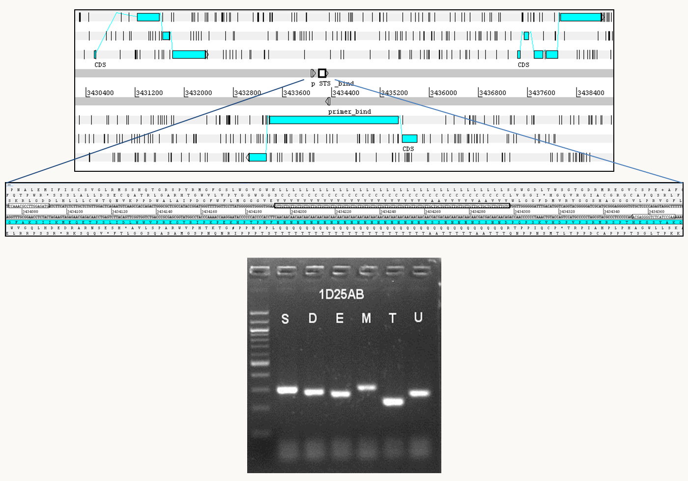

On observe que le nombre de répétition de ces séquences est très variable en fonction des individus (de 10 à 60 répétitions pour les micro et de 10 à 300 pour le mini). Micro- et minisatellites sont le plus souvent présents en plusieurs copies dans le génome, où ils sont insérés entre des séquences uniques. Ils sont simples à révéler par PCR ou Southern Blot. Leur extraordinaire variabilité en fait d'excellents outils pour la cartographie, les recherches judiciaires ou l'établissement de paternité. Dans certains cas cependant, ils sont trop variables et changent entre les parents et les descendants ou même entre les cellules d'un même individu. L'amplification du nombre de ces motifs est à l'origine de certaines maladies chez l'homme.

Voyons pratiquement comment cela marche.

- la recherche de paternité
  Dans ce cas, les échantillons d'ADN à tester proviennent d'un enfant, de la mère et de un ou plusieurs pères possibles. Les échantillons prélevés sont généralement des volumes sanguins suffisants pour obtenir une bonne quantité d'ADN de bonne qualité qui peut alors être utilisé pour plusieurs analyses de mini et microsatellites. En effet, la taille totale d'un minisatellite est de l'ordre de quelques dizaines de paires de bases à quelques kilobases et l'ADN extrait doit donc être de bonne qualité pour pouvoir les détecter.
  - la recherche par PCR s'effectue à l'aide de deux amorces situées de part et d'autre du micro ou minisatellite dans les régions uniques (voir la figure 40). La taille identique des bandes permet alors de rapprocher le père et l'enfant.
  - la recherche par Southern Blot s'effectue après digestion avec un enzyme qui ne coupe pas dans le minisatellite et hybridation avec une sonde qui est dans une des séquences uniques voisines.

- la recherche judiciaire
  Il s'agit le plus souvent de retrouver un individu à partir d'un petit échantillon (cheveux, tache de sang ou de sperme). L'échantillon est en général de mauvaise qualité et âgé. L'ADN récupéré est donc en petite quantité et dégradé si bien que des petits fragments (de quelques centaines de paires de bases au plus) sont obtenus. Il faut donc se contenter d'analyser des microsatellites par PCR et confronter les résultats avec ceux de plusieurs coupables possibles.

Notez que l'être humain étant diploïde, la détection des microsatellites permet de détecter des individus homozygotes et des individus hétérozygotes. Il est évident que pour affirmer la paternité ou la culpabilité avec une forte confiance (>99.99%) plusieurs mini ou micro satellites très polymorphes doivent être regardés. la figure 42 donne la position des marqueurs testés couramment.

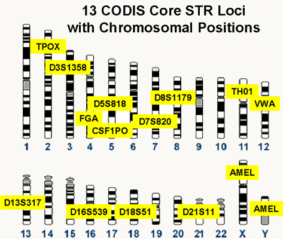

Dans les deux cas, une figure résume le nombre de répétions ou les allèles trouvés aux différents loci testés, ce qui donne l'empreinte génétique qui est unique pour chacun d'entre nous (figure 43).

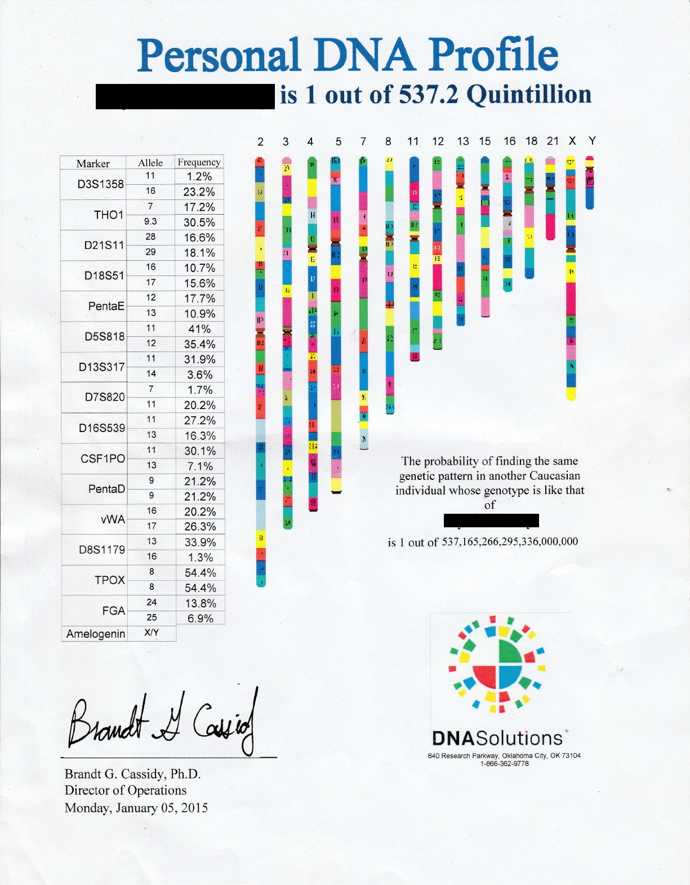

### Les haplotypes et idiomorphes

Certains polymorphismes affectent plusieurs gènes d'un seul coup. D'autres sont retrouvés regroupés dans différents individus d'une population et se séparent rarement. On ne parle alors pas d'allèles pour ces polymorphismes complexes mais d'**haplotypes**.

exemples:

- Chez l'homme, l'ADN mitochondrial contient de nombreux polymorphismes. Ceux-ci ne sont pas distribués aléatoirement dans les individus car les mêmes polymorphismes sont toujours retrouvés associés chez différents individus. Cela reflète l'histoire évolutive de l'ADN mitochondrial car chez l'homme celui-ci se transmettant uniquement par la mère, il ne subit pas de recombinaison (nous verrons plus en détail dans un chapitre ultérieur, les modalités de la transmission de ces polymorphismes mitochondriaux au cours des mitoses et des méioses). La connaissance de ces haplotypes, permet donc de retracer, l'histoire des populations humaines, et plus particulièrement celle des femmes, et de proposer des hypothèses sur les mouvements des populations au cours du temps (figure 44). Notez que des études similaires sont faites avec le chromosome Y qui trace l'homme.

  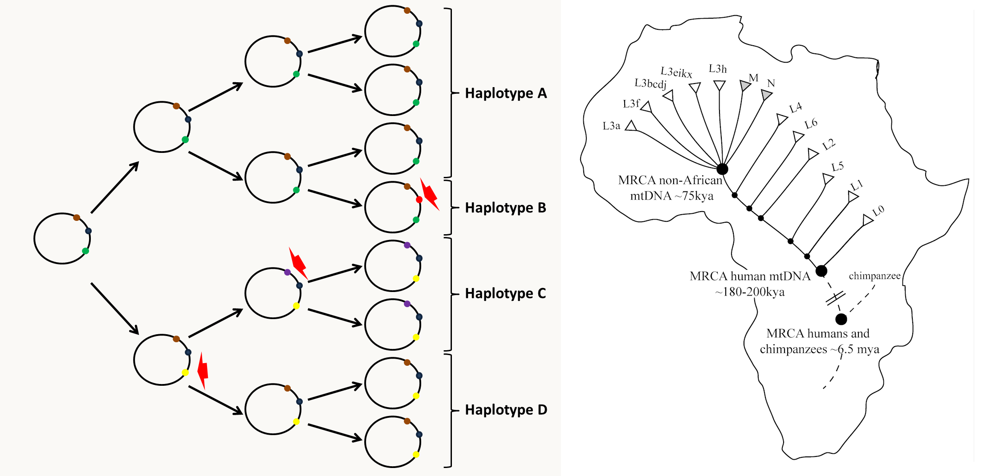

- Chez *Neurospora crassa* entre les souches mata et matA ou chez *Podospora anserina* entre les souches mat+ et mat-,  les différences sont dues à plusieurs gènes: il y a un gène au locus mata/mat+ et trois gènes au locus matA/mat- (figure 45). Chez ces deux champignons hétérothalliques, les croisements ne sont fertiles qu'entre souches mata (resp. mat+) et mat A (resp. mat-). Dans ce cas, on parle d'**idiomorphes** plutôt que d'haplotypes. Ces idiomorphes contrôlent les types sexuels pour assurer la reproduction mais aussi un phénomène d'incompatibilité des hétérocaryons spécifiquement chez *Neurospora crassa*. Chez les champignons, il est possible de fusionner deux cellules différentes pour obtenir une cellule avec un cytoplasme résultant de la fusion des deux cytoplasmes et contenant les noyaux des deux cellules: les cellules sont naturellement multinucléées chez les champignons *Pezizomycotina* et peuvent fusionner naturellement selon un processus appelé **anastomose**. Il est donc facile d'obtenir ce que l'on appelle un **hétérocaryon** en mélangeant les mycéliums de deux souches de génotypes différents. Chez *Neurospora crassa*, la présence dans le même cytoplasme de noyaux mata et matA est impossible car dans ce cas il se produit une réaction qui aboutit à la mort de la cellule. Au contraire chez *Podospora anserina*, la condition naturelle du champignon est d'être sous la forme d'un hétérocaryon mat+/mat- et donc d'être autofertile.

  

### Les variations chromosomiques

Celles-ci sont variées. Citons entre autre des modifications de la structure des chromosomes telle que les délétions, les duplications de certaines régions, les inversions ou les translocations (voir figure 59). A ceci, il faut ajouter les variations du nombre de chromosomes telles que :

- des modifications du taux de ploïdie: c'est dire des individus qui comportent 3 génomes haploïdes (triploïdes) ou 4 génomes haploïdes (tétraploïdes) au lieu de deux génomes. Ces phénomènes sont fréquents chez les plantes.

- des différences dans le nombre de chromosomes liées à des chromosomes optionnels (chez certaines plantes) ou qui ont été perdus ou gagnés par rapport au génome normal (triploïde partiel ou haploïde partiel: dans ce cas on parle d'aneuploïde) ou à des fusions de chromosomes.

Citons un cas de fusion qui est très utilisé en génétique de la drosophile. On dispose de souches dites avec des X attachés (X^X). Il s'agit en fait de fusion de chromosomes X. Chez la drosophile le contrôle du sexe se fait par une balance entre le nombre de chromosomes X et le nombre de jeux d'autosomes (A).

si X = A alors l'individu est femelle
si X = 1/2 de A alors l'individu est mâle

Dans le cas des X attachés les individus X^X Y sont donc femelles. Que se passe-t-il si nous les croisons (figure 46) avec des mâles classiques ?

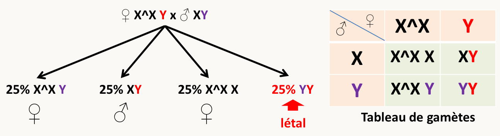

Nous voyons par exemple que dans ce type de croisements le mâle hérite son chromosome Y de sa mère  et son chromosome X de son père, à l'inverse des croisements normaux.

## L'épigénétique

Une partie des polymorphismes héritables présents dans les populations n'est pas liée à des polymorphismes classiques, c'est à dire résultants de variations de la séquence primaire de l'ADN. Ces polymorphismes ont souvent des modalités de transmission qui n'obéissent pas aux lois de Mendel. On dit qu'ils proviennent de **modifications épigénétiques** et leur apparition est liée à ce qu'on appelle des **épimutations**. Il existe une grande variété de mécanismes conduisant à ces polymorphismes épigénétiques qui peuvent être classés sous deux grandes bannières: hérédité de structure et hérédité de régulation. Les modifications épigénétiques les plus connues sont à la charnière de ces deux groupes car elles résultent de modifications de structure de la chromatine, ce qui a un impact sur la régulation des gènes affectés. Nous allons voir quelques exemples emblématiques qui permettent de montrer la variété des mécanismes épigénétiques.

- Le plus vieux polymorphisme héritable et encore présent dans les collections a été découvert chez la plante *Linaria vulgaris* par Linnée (celui qui a inventé la nomenclature binomiale), il y a maintenant environ 250 ans! Il affecte la forme des fleurs (figure 46). Les analyses génétiques ont montré qu'en F1 d'un croisement normale x peloric, la descendance est normale et qu'en F2, le caractère ségrège de manière quasi mendélienne comme étant dû à un couple d'allèle d'un gène appelé *lcyc*. Néanmoins, le caractère est plus instable qu'un caractère lié à une mutation traditionnelle et les réversions de la forme normale vers peloric sont assez fréquentes, en particulier sur une même plante qui peut donc présenter un mélange de fleurs normales et de fleurs peloric. Les 2 allèles ont été clonés et aucune différence de la séquence primaire en acide nucléique pouvant expliquer le phénotype n'a été détectée. Des analyses de l'ADN de *lcyc* avec des enzymes de restriction sensibles à la méthylation ont permis de montrer que dans les individus peloric l'ADN est méthylé alors qu'il ne l'est pas dans les individus normaux. Pour voir l'état de méthylation, on utilise des enzymes de restriction isoschizomères reconnaissant le même site de coupure mais qui sont sensibles différentiellement à la méthylation. Par exemple, *Mbo*I coupe l'ADN non méthylé et méthylé alors que *Sau*3A1 coupe uniquement l'ADN non méthylé, les deux enzymes reconnaissant la séquence GATC. La méthylation de l'ADN est associée à une absence de transcription du gène lcyc spécifiquement dans la forme peloric. Cet état de méthylation est transmissible de manière très stable à travers la mitose et la méiose grâce à l'activité de méthylase de maintenance qui agissent sur des ADN hémi-méthylés (figure 46), expliquant que la forme peloric soit transmise de manière quasi mendélienne. Leur activité n'est pas efficace à 100%, expliquant les réversions fréquentes du caractère. L'état méthylé est acquis quant à lui par l'action de méthylase dite *de novo* de manière plus rare.

  

  Comme on le voit avec l'exemple des fleurs normales *versus* peloric l'état de méthylation est héritable. On note cependant une certaine instabilité des états de méthylation qui sont donc réversibles. Il existe d'autres types de phénomènes qui ressemblent à celui-ci, dans le sens qu'il s'agit de modifications structurales de l'ADN (le plus souvent de la chromatine chez les eucaryotes) sans changement de séquence, aboutissant à une hétérochromatinisation des gènes et leur inactivation transcriptionnelle. On parle alors de mécanismes dit de **TGS (pour Transciptional Gene Silencing)** qui sont donc liés soit à de la méthylation de l'ADN soit à des modifications de structure de la chromatine.

- Les mécanismes dit de **PTGS (pour Post Transciptional Gene Silencing)** sont liés à des états régulatoires alternatifs (présence ou absence d'une nucléase spécifique) liés à des ARNs double brin.  Ce mécanisme est par exemple responsable de l'extinction fréquente des transgènes dans les OGM de plantes. En effet, lorsque 'un gène est introduit par transformation dans une plante pour en multiplier le nombre de copies, il est très fréquent que toutes les copies, y compris celle déjà présente dans la plante soient inactives, bien que les gènes soient dépourvus de mutations et soient transcrits normalement. L'extinction se situe au niveau de la stabilité des messagers qui sont dégradés par un mécanisme maintenant bien connu et qui implique une RNAase dont la spécificité est conférée par un ARNsi (figure 48). On appelle ce phénomène la **cosuppression**. Il a été décrit pour la première fois chez des pétunias transformés par le gène de la synthase de chalcone, un enzyme impliqué dans la biosynthèse de pigment flavonoïdes, ou il altère la coloration des fleurs (figure 48). Ce phénomène est cependant très général chez la plupart des eucaryotes où il est souvent connu sous le nom d'interférence à ARN. Il existe par exemple dans certains isolats naturels de pétunias qui n'ont pas de pigments au centre des fleurs. Nous reviendrons sur ce mécanisme qui est fréquemment utilisé pour inactiver les gènes chez de nombreux eucaryotes.

  ![en haut mécanisme de PTGS. Dans le cas du PTGS, le gène endogène (ChsA) est transcrit normalement et le transgène produit, outre des messagers normaux, des ARNs aberrants, le plus souvent partiellement double brin. Ces ARNs double brin sont reconnus par l'enzyme DICER qui les clive en ARNsi d'une vingtaine de nucléotides. Les ARNsi se dissocient et se réassocient avec l'enzyme RISC qui cible les messagers normaux grâce à l'homologie de séquence entre l'ARNsi et le messager et catalyse leur dégradation. Notez que si la reconnaissance est incomplète parce que les séquences ne sont pas parfaitement homologues, cela aboutit à l'inactivation de la traduction plutôt que la dégradation du messager. Le phénomène est probablement amplifié par une ARN polymérase ARN-dépendante (RDRP) qui amplifie la quantité d'ARN aberrants en utilisant l'ARN normal comme matrice, comme cela a été montré chez Arabidopsis thaliana. En bas, pétunia sauvage à gauche et deux souches présentant de la cosuppression au centre et à droite.](img/image048.png)

- Chez *Podospora anserina*, il existe deux types de souches dans la nature qui diffèrent par la présence de deux allèles du gène het-S/s appelés, het-s et het-S. Comme pour le type sexuel de *Neurospora crassa*, le gène het-S/s contrôle l'incompatibilité végétative (voir ci-dessus). Quand des cellules het-s et het-S fusionnent; l'hétérocaryon het-s + het-S formé meurt rapidement. En fait, les souches portant l'allèle het-s présentent des propriétés particulières. Elles se présentent naturellement sous deux formes : sous la forme het-s pour 70% d'entre elles, elles sont incompatibles avec les souches het-S, mais elles peuvent se présenter aussi dans 30% des cas sous la forme het-s* qui n'est pas incompatible avec les souches het-S (figure 49). Ce qui est très surprenant, c'est que lorsque l'on prend ses souches het-s* et qu'on les met en contact avec une souche het-s alors elles deviennent het-s !  Cela s'explique par la transmission des souches het-s vers les souches het-s* d'un élément cytoplasmique et infectieux (figure 48) qui envahit donc le mycélium het-s* et le convertit en het-s. L'analyse génétique montre une ségrégation étrange non mendélienne, puisque:

  lors d'un croisement ♀ het-s* x ♂ het-s,  100% de la descendance est het-s*

  lors d'un croisement ♀ het-s x ♂ het-s*,  100% de la descendance est het-s

  confirmant une ségrégation avec le cytoplasme puisque le gamète femelle transmet l'état het-s* ou het-s. Plus étrange, lors de croisements  entre souches het-s et het-S, la descendance portant l'allèle het-s est het-s* dans 100% des cas (figure 49), comme si het-s avait disparu! Le caractère peut réapparaître, le passage d'une souche het-s* vers une souche het-s, se faisant spontanément avec une fréquence faible. Maintenant nous savons que la différence entre les souches het-s est het-s* est due à deux conformations différentes de la protéine codée par het-s: la conformation het-s incorporée dans des fibres amyloïdes étant infectieuse vis à vis de la conformation het-s* (figure 49).

  ![à gauche, la transmission via les anastomoses et la ségrégation non mendélienne du caractère het-s*. A droite, explication du comportement de l'allèle het-s. Après traduction, la protéine het-s est soluble et n'interagit pas avec het-S. En absence de fibre amyloïde, les souches sont donc sous forme het-s*. L'apparition spontanée d'une première fibre, entraîne de manière autocatalytique l'incorporation de het-s dans la fibre qui interagit alors avec het-S et démasque un domaine de mort cellulaire présent dans het-S.](img/image049.png)

  On dit que la protéine het-s se comporte comme un **prion**. La définition de prion a été donnée pour la première fois par Stanley Prusiner en 1982 à l'agent responsable de la maladie de Creutzfeld-Jacob et autres encéphalopathie spongiformes (Kuru, tremblante du mouton, maladie de la vache folle..) qui a les mêmes propriétés d'incorporation autocatalytique au sein de fibres amyloïdes. Ce genre de phénomènes d'hérédité a été prouvé pour de nombreuses autres protéines chez les levures dont bien évidemment *Saccharomyces cerevisiae* chez qui ils ont été analysés en détail, mais aussi chez des bactéries, des plantes et des animaux.  Les prions sont les exemples les plus emblématiques de l'hérédité de structure.

Notez qu'il existe une classe de phénomènes épigénétiques : les états métaboliques ou régulatoires alternatifs qui sont très complexes et ont intervenir de nombreux partenaires. Ces caractères épigénétiques sont transmissibles d'une génération à la suivante, mais en général ne suivent pas les lois de Mendel.  Ils sont en plus souvent instables ce qui les différencient des polymorphismes liés à des différences de la séquence primaires d'acides nucléiques. En conclusion, les phénomènes épigénétiques sont très variés et fréquents dans la nature où ils interviennent dans des phénomènes divers surtout dans les cellules eucaryotes. Pratiquement, ils sont importants pour la transgenèse et la thérapie génique. Il est en effet fréquent qu'après introduction de séquences d'ADN dans une cellule, l'expression de celles-ci soit rapidement inhibée soit par TGS soit par PTGS.

## Les mutations

Nous avons vu au début de ce chapitre qu'il existe des polymorphismes dans les populations et avons pu pour un gène donné en calculer les fréquences. Quelle est l'évolution des fréquences des différents allèles polymorphes dans une population ?
Nous ne répondrons pas en détail à cette question car elle nécessite des analyses qui sont du ressort de la Génétique des Populations. Cependant nous allons quand même montrer que dans une grande population, si les gamètes se rencontrent au hasard et qu'aucune sélection ne s'effectue sur ces gamètes ou sur leurs descendants alors les fréquences des différents allèles restent constantes au cours des générations. C'est la loi de Hardy-Weinberg.

Soit un gène polymorphe avec deux allèles a et b. Ces allèles sont présents avec les fréquences alléliques respectives, Fa et Fb. Évidemment Fa + Fb = 1. Selon nos hypothèses, cela veut dire que les parents vont produire Fa de gamètes a et Fb de gamètes b. La figure 50 présente le calcul des fréquences de production de gamètes a et b par les descendants issus la rencontre de ces gamètes.

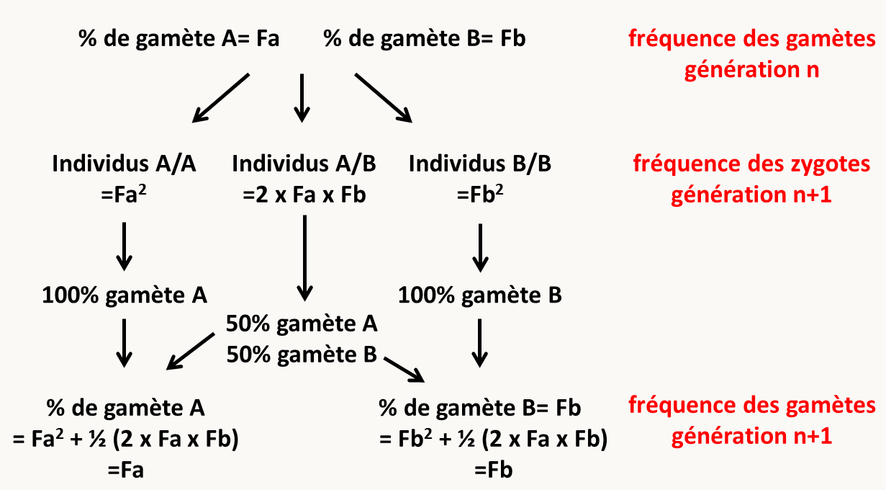

Donc les fréquences alléliques restent constantes d'une génération à l'autre.

Il n'y a donc pas de disparition du polymorphisme sous les hypothèses de répartition aléatoires des gamètes. On dit que la population est en équilibre de Hardy-Weinberg. Si des variations de ces fréquences sont observées au cours des générations dans une population cela veut dire que des mécanismes supplémentaires à la répartition simple au hasard des gamètes sont en action. Il peut s'agir de mécanismes de sélection, de migration ou autres évènement tels que l'apparition de nouveaux allèles. En effet, si du polymorphisme existe au sein des populations c'est qu'il a été créé. **Il existe donc des mécanismes qui permettent l'apparition de polymorphisme. Il s'agit le plus souvent des mutations**, dans d'autres cas plus rares d'**épimutations**.

On peut expérimentalement mettre en évidence l'existence des mutations. Lorsque l'on prend un grand effectif d'individus d'une souche pure, on constate que certains individus (en général en proportion infime) présentent spontanément des variations. On appelle alors la population de départ la souche **"sauvage"** et les individus des **variants**. Si les descendants de ceux-ci présentent encore le caractère nouveau et que celui-ci peut donc se transmettre, on les appelle des **mutants** et on dit qu'ils portent une **mutation** (bien sûr dans le cas où un changement de séquence dans le matériel génétique a été mis en évidence ou est fortement suspecté; autrement il peut s'agir **épimutants**). Tout caractère peut être affecté. On peut ainsi définir un certain nombre de type de mutations en se référant aux polymorphismes qu'elles entraînent.

## Les différents types de mutations

Les mutations sont souvent qualifiées par le polymorphisme qu'elles créent (SNR, inversion, insertion etc.) ou les caractères qu'elles entraînent. Voici quelques types de mutations classées en fonction de leurs effets physiologiques :

- les mutations **létales** qui entraînent la létalité des souches qui les portent. Il est évident que de telles mutations ne peuvent apparaître dans une population que si elles sont récessives ou conditionnelles.
- les mutations d'**auxotrophie** qui ne permettent plus aux souches qui les portent de pousser sur milieu minimum
- les mutations **thermosensibles** ou **cryosensibles**
- les mutations **pléiotropes** qui affectent plusieurs caractères en même temps

etc.

Ici nous devons faire la distinction entre deux types de mutations différentes. Dans la nature, il existe grosso modo deux types d'organismes: ceux pour lesquels toute cellule peut assurer sa descendance (exemple: les bactéries, les champignons, les protistes, etc.) et ceux pour lesquels il existe deux types de cellules : les cellules **somatiques** qui n'assure pas la descendance et les cellules **germinales** qui assurent la descendance (exemple: les animaux et les plantes supérieures). Dans le premier groupe d'organismes, toute mutation est susceptible de se transmettre à la génération suivante par contre dans le deuxième groupe seule celles affectant la lignée germinale se transmettront à la descendance, ce sont les **mutations germinales**. Il existe d'autres mutations qui affectent spécifiquement les cellules somatiques dites **mutations somatiques**.

Attention une mutation qui apparaît dans une cellule somatique se transmet à tous les descendants de cette cellule, elle ne sera par contre pas transmise aux descendants issus de la lignée germinale de la génération suivante. Ces mutations ne sont cependant pas négligeables biologiquement car une catégorie importante regroupe les mutations somatiques qui conduisent à la formation de tumeurs cancéreuses!

## Les modalités d'apparition des mutations

Les mutations résultent de deux grands types de phénomènes.

- la fidélité de la transmission du matériel génétique n'est pas de 100%. Ceci dérive de plusieurs processus intrinsèquement liées aux propriétés physico-chimiques de la matière.

  Exemples :

  - La tautomérisation de certaines bases qui peuvent entraîner des appariements illégitimes qui ne seront pas détectés et qui pourront donc donner naissance à des mutations au tour de réplication suivant. Ce phénomène intéresse toute les bases  la cytosine (figure 51) mais aussi l’adénine avec l’imino-adénine qui s’hybride avec la cytosine, la thymine avec l’énol-thymine qui s’hybride mieux avec la guanine que l’adénine et la guanine avec l’énol-guanine se s'associe avec avec la thymine en préférence à la cytosine.

    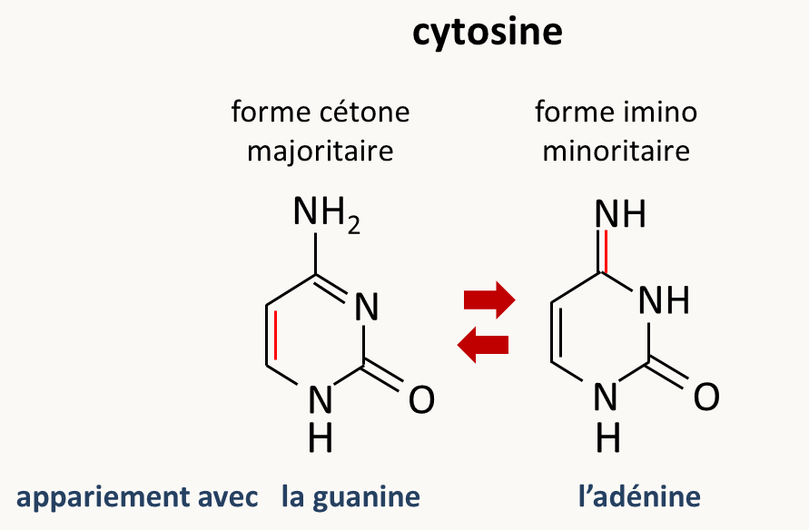

  - La désamination des bases : la cytosine se transforme en uracile qui s'hybride avec l'adénine, l'adénine se transforme en hypoxanthine qui s'hybride préférentiellement avec la cytosine, la guanine en xanthine qui s'associe soit avec la thymine soit avec la cytosine, et la 5-methyl-cytosine donne de la thymine.

  - la perte de bases par dépurination et dépyrimidination qui a lieu surtout à pH acide. Dans ce cas, la polymérase ne sait pas quoi ajouter comme base complémentaire...

- l'ADN subit aussi d'autres lésions qui sont réparées plus ou moins efficacement. Ceux-ci peuvent résulter de la production normale des radicaux libres dans les cellules aérobies. En effet, la chaîne respiratoire génère constamment  des radicaux hydroxyl OH°, des ions superoxydes O2-et du peroxyde d'hydrogène H2O2. Ces molécules très réactives interagissent avec les bases de l’ADN et les modifient ou les cassent.  L'ADN mitochondrial va bien évidemment être très souvent "attaqué" par les radicaux libres. Les conditions de l'environnement vont aussi avoir une influence sur la fréquence d'apparition des dommages. C'est le cas par exemple de la présence de rayonnements ou d'**agents mutagènes**.

  Exemples :

  - Les rayons X et les rayons γ provoquent des cassures doubles brin.
  - Les rayons UV, aux longueurs d’onde proches du maximum d’absorption de l’ADN (260-280nm), provoque la formation de dimère de cyclobutane-pyrimidine. Ceci entraîne une torsion anormale de l’ADN et empêche l’appariement correct au moment de la réplication, qui s’arrête ou est considérablement freinée. Ces dimères sont extrêmement stables. En pratique cependant, le rayonnement solaire d’UV à ces longueurs d’onde est presque totalement absorbé par la couche d’ozone (quand elle existe...).

  - Les agents alkylants directs ou ceux produits après métabolisation par les cytochromes P450 comme l’acétyl amino fluorène et le benzopyrène fabriqués par l'homme ou l’aflatoxine B1 fabriquée par le champignon *Aspergillus flavus* vont se "cross-linker" à l'ADN et l'endommager.
  - La mitomycine, le cis-platine ou le psoralène vont ponter entre eux les deux brins de l'ADN et bloquer la réplication.
  - La proflavine ou l'ICR-170 (=acridine mustard ou 2-methoxy-6-chloro-9[3- (ethyl-2-chloroethyl)aminopropylamino]acridine·2) s'intercalent entre les bases de l'ADN et causent des décalages du cadre de lecture.
  - L'éthyl-méthylsulfonate réagit avec la guanine et la transforme en *O*6-ethylguanine qui va s'hybrider au cours de la réplication avec la thymine.
  - la colchicine empêche la formation des fuseaux et cause ainsi des pertes de chromosomes ou alors des polyploïdisations.

  Notez que ces produits mutagènes sont très toxiques car ils ont des activités cancérigènes ou tératogènes. Il est aussi possible de baisser le taux de mutations spontanées grâce à certains composés. On sait par exemple, que l'adjonction de produits ayant des activités antioxydantes permet de limiter le taux de mutations en particulier au niveau de l'ADN mitochondrial. Les fréquences de ces dommages sont impressionnantes; on estime en effet qu'une cellule animale  par génération subit:

  - 20 000 cassures simple-brin

  - 10 000 dépurinations de bases

  - 5 000 alkylations de bases

  - 2 000 oxydations de bases

  - 500-600 désamination de bases

  - 10-20 cassures double-brins

Il est bien évident que les cellules ont de multiples mécanismes pour éliminer les dommages que subit l'ADN, mais les mécanismes de réparation ne sont pas parfaits, surtout si les altérations se sont produites juste avant la réplication et/ou qu'elles sont présentes en trop grands nombres et que les systèmes de réparation sont débordés. De même, les dommages qui affectent un seul des deux brins de l'ADN peuvent être facilement réparés alors que ceux qui affectent les deux brins le seront plus difficilement, en particulier chez les cellules haploïdes, car chez les cellules diploïdes, il existe des mécanismes qui vont utiliser la copie intacte d'ADN pour réparer la copie endommagée. Des mutations peuvent alors se produire à cause de mauvaises réparations ou par "erreurs de réplication" faites par la polymérase. L'apparition des mutations, bien que rare, est donc un phénomène spontané et continuel. Néanmoins, leur fréquence peut être augmentée par la présence d'agents mutagènes. L'analyse détaillée des multiples mécanismes moléculaires de réparation des dommages à l'ADN est en dehors du cadre de ce livre et je vous renvoie vers des cours de biologie moléculaire pour en savoir plus. Nous reviendrons cependant au cours de l'étude de la recombinaison sur certains mécanismes de réparation car les deux phénomènes sont liés et partagent les mêmes acteurs moléculaires.

Voyons maintenant plus en détail l'aspect génétique du phénomène en commençant par les modalités de leur apparition.

Le problème de l'apparition des mutations n'est pas trivial et il est encore débattu aujourd'hui. En effet, si la majorité des généticiens s'accordent pour dire que les mutations se produisent au hasard, il en existe quelques-uns qui pensent que celles-ci pourraient être induites par le milieu. Il faut comprendre induite non pas comme "ayant une fréquence augmentée par le milieu" car nous avons vu qu'effectivement des conditions de milieu peuvent augmenter de manière considérable le taux de mutation, mais plutôt dirigées par le milieu. Des expériences ont fait resurgir de manière épisodique ce débat qui malheureusement sort du cadre de ce cours. Quoi qu'il en soit, des expériences ont clairement montré que les mutations apparaissent spontanément. La première démonstration convaincante de ceci a été faite grâce à ce que l'on appelle aujourd'hui le test de fluctuation.

## Le test de fluctuation

Prenons l'exemple qu'étudiait Salvator Luria et Max Delbrück (1943) et qui a permis d'apporter la première démonstration que les mutations apparaissent spontanément avant le traitement qui permet de les révéler. Ces chercheurs étudiaient la résistance d'*Escherichia coli* B au phage α. Pour révéler les bactéries résistantes, ils mettaient en cultures des bactéries sensibles, les laissaient pousser, puis ajoutaient des phages et étalaient la culture sur des boites de Petri. Seules les bactéries résistantes donnaient naissance à des colonies (facilement comptables !). Ils essayaient de mesurer la fréquence d'apparition de bactéries résistantes au phage et observaient de grandes fluctuations dans leurs résultats. Ils ont raisonné justement que cette fluctuation était en fait due à l'apparition stochastique des mutations et pourrait donc permettre de trancher entre les deux hypothèses du moment:

Hypothèse I: les mutations sont induites avec une certaine probabilité dans la bactérie par le contact avec le phage. En d'autre terme, il existe une petite probabilité qu'une bactérie résiste à l'attaque d'un phage et si elle résiste, elle et ses descendants acquièrent alors une immunité contre le phage.

Hypothèse II: les mutations de résistance apparaissent dans la bactérie spontanément avec une probabilité fixe avant leur exposition au phage.

Dans le cas de la première hypothèse, l'étalement de cultures indépendantes de bactéries traitées par le phage devrait donner toujours la même quantité de bactéries résistantes qui dépend de la probabilité que la bactérie résiste au phage. Comme celle-ci est très petite et l'effectif est très grand, la loi de probabilité attendue est donc une loi de Poisson qui a pour caractéristique que sa moyenne égale sa variance. Au contraire, dans le cas de la deuxième hypothèse, le moment d'apparition des mutations va varier en fonction des cultures, entraînant une grande différence entre les cultures ou l'évènement a eu lieu tôt et ceux où il a eu lieu tard (figure 52). Dans ce cas, la variance sera très supérieure à la moyenne. Pour éliminer un biais expérimental de mortalité différentielle liée aux conditions expérimentales, une culture contrôle est aliquotée sur plusieurs boites: normalement le nombre de bactéries résistantes doit dans ce cas une loi de Poisson.

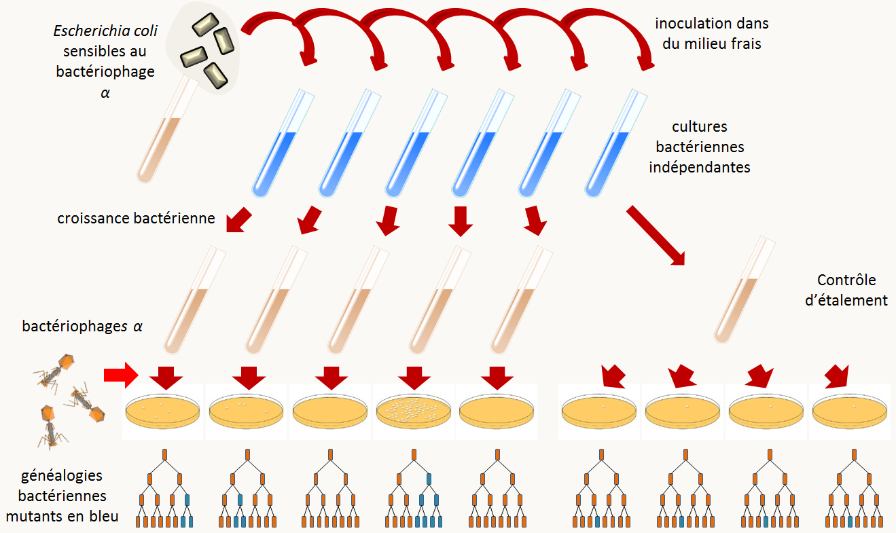

Donc Luria a fait l'expérience (Delbrück ayant fait le développement théorique de l'idée de Luria) et a obtenu les résultats suivants:

exemple (parmi 3 expériences témoin) de résultats obtenus si une culture est divisée en 10 et étalée sur 10 boîtes : 14, 15, 13, 21, 15, 14, 26, 16, 20, 13

moyenne= 16,7
variance= 15

L'analyse statistique montre que ces deux chiffres ne sont pas différents. Donc la procédure d'étalement n'introduit pas de variation significative autre que l'échantillonnage au hasard.

exemple (parmi 10 expériences) de résultats obtenus si plusieurs cultures sont faites en parallèle et étalées sur des boites séparées dans les conditions de l'expérience témoin: 1, 0, 3, 0, 0, 5, 0, 6, 107, 0, 0, 0, 1, 0, 0, 64, 0, 35, 0, 5

moyenne= 11,35
variance= 694 (corrigée pour la variation de l'étalement).

CQFD: il est clair que c'est l'hypothèse n°1 (les mutations préexistent à leur révélation) qui est la bonne !

De plus cette expérience nous permet de bien saisir la différence entre taux de mutants et taux de mutation. En effet, le nombre de mutants observés dans une culture résulte du nombre de mutations apparues et du nombre de divisions que le mutant a pu faire avant la révélation. Le taux de mutant est donc variable d'une culture à une autre en fonction du hasard de l'apparition des mutations. Au contraire, le taux de mutation est constant (si les conditions expérimentales sont constantes) et les mutations apparaissent au hasard.

S'il est facile de calculer le taux de mutants, quid du taux de mutation ?

Le test de fluctuation fait ci-dessus permet de le calculer: pour ceci, il faut s'intéresser aux cultures qui ne donnent pas de mutants résistants. On admet que chacune des cultures a été initiée avec le même nombre n0 de bactérie au début et contient le même nombre de bactéries n à la fin. Il s'est donc passé n-n0 divisions dans chacune des cultures. Si P est la probabilité de muter en souche résistante à chaque division (taux de mutation par unité de génération), la proportion de cultures sans mutant (f que l'on mesure dans l'expérience) est égale à la probabilité d'observer 0 mutation après toutes ces n-1 divisions, soit (1-p)n-n0. De là, on tire que

p= 1- e ln f / n-n0.

Par exemple dans une de leurs expériences, Luria et Delbrück ont effectué 87 cultures, parmi celles-ci, 29 ne présentaient pas de colonies résistantes. Ces cultures ont été ensemencées avec 50-500 bactéries et contenaient à la fin environ 2.4 108 bactéries, d'où l'on tire que le taux de mutation est de:

p= 1- e ln f / n-n0 = 4,5 10-9 mutations / division cellulaire

Une autre expérience indépendante a permis de montrer plus simplement le même résultat. C'est l'expérience des répliques sur velours inventée par Joshua et Esther Lederberg (1952). La figure 53 résume l’expérience en prenant un exemple de bactéries résistantes à la streptomycine. Des bactéries sensibles sont étalées sur du milieu sans antibiotique, et ensuite repiquées grâce à du velours sur du milieu contenant de l'antibiotique. Sur ce milieu, les mutants résistants poussent et sont facilement repérables. Il suffit ensuite de retourner vers la boîte de milieu initial sans antibiotique pour constater que les levures de la colonie initiale de les repiquer sur du milieu avec antibiotique et de constater que la toutes les cellules de la colonie sont aussi résistantes, et que donc, ce n'est pas le milieu qui a provoqué la mutation de résistance mais bien un évènement aléatoire.

![Figure 53: le principe du test de Luria et Delbrück. Une culture de bactéries sensibles est étalée sur du milieu avec (+ streptomycine) ou sans antibiotique (-streptomycine). Sur le milieu avec l’antibiotique (boite n°1), des bactéries résistantes génèrent des colonies contenant des millions d’individus résistants. S’ils sont étalés sur du milieu avec de l’antibiotique, chacun de ces descendants résistants va former de nouvelles colonies (boite n°2), montrant l’héritabilité de la mutation conférant la résistance. Sur le milieu sans antibiotique (boite n°3), toutes les bactéries qu’elles soient résistantes ou sensibles donnent naissance à des colonies. Joshua et Esther Lederberg ont utilisé la méthode des répliques au velours pour former une copies de ces colonies sur du milieu avec de la streptomycine (boite n°4). Le tissu de velours permet en effet de prélever une partie des cellules des colonies s’il est appliqué sur la boite n°3 et de transférer ensuite une fraction de celles-ci sur du milieu frais par simple contact. Seules les colonies contenant des individus résistants vont alors donner naissance sur la boite n°4 à des nouvelles colonies. Comme précédemment, si ces descendants sont de nouveau étalés sur du milieu avec de l’antibiotique (boite n°5), ils vont tous donner naissance à de nouvelles colonies. Il est maintenant simple de savoir si la mutation de résistance à la streptomycine de la boite n°4 est apparue avant le contact des bactéries avec l’antibiotique. En effet, la colonie de la boite n°3 qui a donné naissance à la colonie résistante de la boite n°4 n’a jamais vu l’antibiotique. Contenant des bactéries déjà résistantes, leur étalement sur du milieu avec antibiotique donnera naissance à des colonies nombreuses (boite n°6). Un témoin avec une colonie qui n’a pas donné naissance à une colonie résistante sur la boite n°4 confirme qu’aucune des bactéries qui la composent n’est résistante (boite n°7). Le résultat de ce test a toujours conduit à la conclusion que les bactéries résistantes détectées sur la boite n°4 étaient en fait déjà présentes sur la boite n°3.](img/image053.png)

Ce résultat est l'un des plus fondamental de la biologie car, combiné avec le processus de sélection naturelle énoncé par Darwin, il a permis de proposer une hypothèse non finaliste de l'évolution de la vie que l'on désigne sous le terme de néodarwinisme. En effet, "un œil n'a pas été créé dans le but de voir" même s'il sert à ça, mais les organismes possèdes des yeux car (1) aléatoirement par le biais de mutations, certains ont acquis la capacité de détecter la lumière et (2) par ce fait, ils ont été avantagés par rapport à ceux qui en étaient dépourvus au niveau de leur reproduction, probablement parce que les yeux leur permettaient une meilleure connaissance du milieu alentour. Notez que le débat fait toujours rage pour savoir si cette évolution est obligatoirement progressive (c.a.d. que l'établissement de l'œil résulte de la succession de plusieurs mutations) ou s'il est possible de faire des sauts (c.a.d. qu'un "proto-œil" efficace est apparu à la suite d'une seule mutation).

## Fréquences d'apparition des mutations

L'exemple du test de fluctuation de Luria et Delbrück semble indiquer que le taux des mutations spontanées est très faible en conditions normales (c'est à dire en l'absence des agents mutagènes mentionnés plus haut), d'autant plus que la résistance au bactériophage pourrait être causée par des mutations localisées dans de nombreux gènes différents et que donc le taux de mutation pour chaque gène est encore plus faible. En fait les taux de mutation peuvent varier grandement en fonction de nombreux paramètres. Par exemple, voyons quelques taux de mutations pour certains caractères chez différents organismes:

| organisme                   | changement de phénotype                               | taux de mutation                                        |
| --------------------------- | ----------------------------------------------------- | ------------------------------------------------------- |
| bactériophage T2            | inhibition de la lyse                                 | 10-8 gènes mutants/réplication               |
|                             | changement spécificité d'hôte                         | 3.10-9 gènes mutants/réplication             |
| *Escherichia coli*          | capacité à fermenter lactose vers incapacité          | 2.10-7 cellules mutantes/division cellulaire |
| *Chlamydomonas reinhardtii* | sensible à la streptomycine vers résistant            | 10-8 cellules mutantes/division cellulaire   |
| *Neurospora crassa*         | prototrophie pour l'inositol vers auxotrophie         | 8.10-8 spores mutantes/spores totales        |
| *Drosophila melanogaster*   | œil rouge brique  œil blanc                           | 4.10-5 gamètes mutants/gamètes totaux        |
| *Homo sapiens*              | Chorée de Hungtington (maladie autosomale dominante)  | 10-8 gamètes mutants/gamètes totaux          |
|                             | dystrophie musculaire de Duchenne (maladie récessive) | 4-10.10-5 gamètes mutants/gamètes totaux     |

On constate une variabilité entre organismes mais aussi pour différents caractères à l'intérieur d'une même espèce. En fait ces données sont globales et ne tiennent pas en compte un certain nombre de données, dont:

- le nombre de gènes différents qu'il est possible de muter pour obtenir le caractère en question.

  exemples

  - Chez *Escherichia coli*, le taux de mutations spontanées  pour obtenir des souches résistantes à la streptomycine est de l'ordre de 10-12 par réplication, car la résistance ne peut être obtenue que grâce à quelques mutations affectant quelques codons d'un seul gène codant une protéine ribosomale. Au contraire, le taux de mutation pour le caractère croissance lente est de l'ordre de 10-6 car plusieurs centaines de gènes sont impliqués dans la croissance d’*Escherichia coli*.
  - De même, si on part d'une souche de levure *Saccharomyces cerevisiae* prototrophe, il est possible de trouver avec une fréquence assez élevée des souches auxotrophes car on estime à environ 200 le nombre de gènes impliqués dans les biosynthèses de métabolites. Une mutation, qui inactive l'un de ces gènes, est suffisante pour entraîner l'auxotrophie. Par contre, si on recherche une auxotrophie pour un métabolite particulier (acide aminé ou base), ce taux sera beaucoup plus faible.

- la redondance des gènes. En effet, s'il existe deux copies (ou plus) du même gène dans le génome il sera très difficile de trouver des mutations qui abolissent le fonctionnement des deux gènes en même temps (celles-ci sont en général récessives). Souvent les mutations obtenues dans ce cas altèrent la régulation des gènes en abolissant simultanément l'expression de toutes les copies. Elles ne sont donc pas localisées dans les gènes en question mais dans leur régulateur ! Par contre, pour chacun des gènes, il est possible d'obtenir des mutations dominantes.

Si on considère le taux de mutation par gène, il existe aussi une variabilité entre gènes liée à la taille du gène, à la sensibilité du produit codé aux changements d'acides aminés (ou des bases !), etc.

Enfin, une mention particulière doit être fait pour les transposons car ils sont la cause de nombreuses mutations. En fait chez de nombreux organismes, les transposons sont les principales sources de mutations spontanées. Chez la drosophile, on estime par exemple que 50% des mutations spontanées sont dues à des transposons. Dans un génome "stabilisé", la fréquence de transposition est donc du même ordre de grandeur que celle des mutations spontanées soit environ 10-6.  De même, la fréquence de réversion, correspondant à l’excision d'un transposon qui causait une mutation, et qui entraîne donc retour au phénotype sauvage, est de l'ordre de 10-6 par génération. Cela a été évalué par exemple chez *Escherichia coli* avec les séquences IS. Dans un génome "non stabilisé", c'est à dire en voie d'envahissement par un transposon, la fréquence de transposition peut être beaucoup plus élevée : 10-3 à 10-4.

Exemples

- L'élément P de *Drosophila melanogaster* est un transposon à ADN de type II nouvellement arrivée chez cette mouche.  Avant 1940, les souches de drosophile collectées dans la nature et cultivées dans les laboratoires sont toutes de type M c’est-à-dire dépourvues d’éléments P. Depuis 1960 les souches naturelles sont envahies d’éléments P, sur toute la planète, même dans des endroits très reculés. Elles sont dites de type P. L'élément P provient d'une autre espèce: *Drosophila willistoni*, dans un foyer d'Amérique centrale où ces deux espèces cohabitent. Quand on croise des souches M avec des mouches de type P on reconstitue l'envahissement, et les éléments P qui transposent provoquent un taux de mutations 1000 fois supérieur au taux de mutation spontané usuel. Dans certaines conditions, en laboratoire, la fréquence d'excision et de transposition de P peut aller jusqu'à quelques pourcents.
- Chez les plantes, certains transposons sont exceptionnellement mobiles : c’est le cas de Tam4 chez la gueule-de-loup *Antirrhinum majus* où les fréquences de transposition et d’excision atteignent quelques pourcents ; de plus il y a des transpositions fréquentes dans les cellules somatiques, ce qui peut se voir phénotypiquement, par exemple par des feuilles ou des fleurs tachetées.
- Dans le cas des transposons de type I de la levure *Saccharomyces cerevisiae* (transposons Ty), on estime la fréquence de transposition à un événement toutes les 20 générations, soit une fréquence d'environ 10-6 par génération. La fréquence d' "excision" mesurée expérimentalement est légèrement plus forte 10-5 à 10-6. Cette fréquence mesure en fait la fréquence de recombinaison entre les deux LTR pour générer des solo LTR.

En résumé, il n'existe pas de règle fixe. Cependant, à l'intérieur d'une lignée pure, le taux de mutation se maintient dans une certaine fourchette et il est possible de caractériser certains types d'organismes comme mutant facilement et d'autres difficilement, en relation vraisemblablement avec la présence de transposons plus ou moins actifs. Néanmoins, il est possible de détecter à l'intérieur d'une même espèce des individus qui présentent des taux de mutations différents. En particulier, chez certains individus, il existe des mutations qui augmentent dramatiquement le taux de mutations pour tous les caractères. Ces mutations sont appelées **mutateurs** ou **hypermutateurs**. Elles ont été bien décrites chez les bactéries. Il semble que ces mutations permettent aux bactéries qui les portent une adaptation rapide aux environnements qui changent fréquemment.

## Les différents types moléculaires de mutations et leurs effets phénotypiques

Nous allons rapidement mentionner les mutations les plus importantes car cette partie est redondante avec votre cours de biologie moléculaire.

### Les mutations ponctuelles

Ces mutations modifient 1 ou quelques nucléotides (changement de la nature de nucléotides ou insertion/délétion de nucléotides).

- On appelle **transitions** les changements de purines en purines (ou pyrimidines en pyridmidines) et **transversions** les changements de purines en pyridmidines (ou pyrimidines en purines). Ces mutations sont générées par de nombreux mécanismes différents. En fonction de leurs localisations, elles vont avoir des effets différents sur l'expression des gènes. Prenons des exemples dans le cas du gène de la β-globine humaine (figure 54). Ce gène fait partie d'un des deux clusters de gènes codant des sous-unités de l'hémoglobine et de nombreux polymorphismes sont connus dans ces gènes (figure 54, pour un catalogue exhaustif, je vous invite à aller visiter le site http://globin.cse.psu.edu/). Chez l'homme, il est très rare d'observer l'apparition *de novo* de mutations. La plupart des variations dans ce gène sont silencieuses. Cependant comme environ 200 allèles différents allèles de ce gène provoquent des β-thalassémies, maladies qui sont clairement délétères pour les individus qui sont affectés, on considère que ces allèles dérivent par mutations d'un allèle sauvage.

  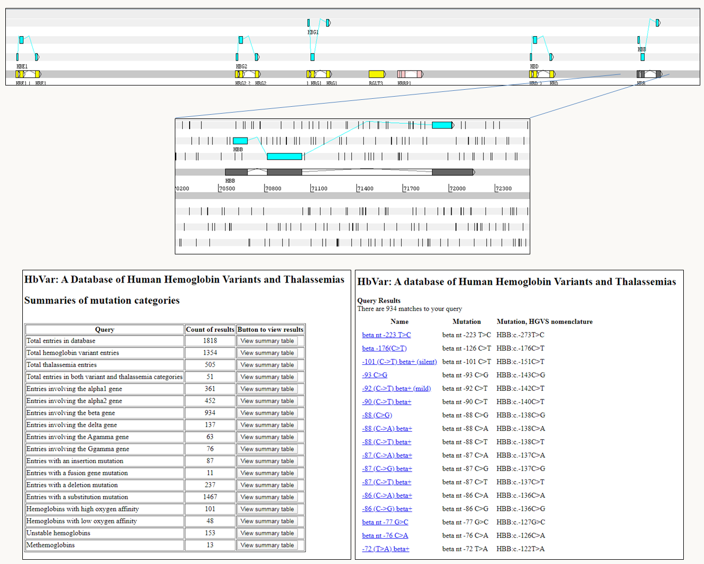

  Les effets potentiels des transitions et transversions localisées dans les séquences codantes sur le fonctionnement des protéines sont résumés dans la figure 55. En général du fait de la dégénérescence du code les transitions ont moins d'impact que les transversions. En effet, pour de nombreux codons, une transition de la troisième base du codon ne change pas le sens (codon Glu, Asp, Asn...) alors qu'une transversion le fait. La plupart de ces mutations, en particulier celles affectant la troisième paire de base des codons, sont neutres ou silencieuses (encore une fois à cause de la dégénérescence du code) ou conduisent à des mutations **faux-sens** où un acide aminé en remplace un autre. Dans la plupart des cas, les mutations faux-sens ont un impact limité sur le fonctionnement des protéines, sauf bien évidemment si elles intéressent le site catalytique d'un enzyme. Au contraire, les mutations générant des codons stop ou mutations **non-sens** ont un impact important sur le fonctionnement des protéines en les tronquant.

  

- Des nucléotides peuvent décaler le cadre de lecture et sont, dans ce cas, appelées décalage de cadre ou en bon franglais **frameshifts**. Les frameshifts sont soit +1 soit -1 en fonction du décalage qu'ils engendrent. Généralement, cela aboutit, comme dans le cas des mutations non-sens, à un produit tronqué plus ou moins fonctionnel (figure 56.

  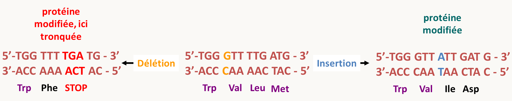

  On connaît par exemple de nombreuses mutations de ce type dans le gène de β-globine qui sont récessives ou dominantes en fonction de leur position (figure 57). La figure 57 donne aussi des exemples d'insertions/délétions un peu plus complexes, mais qui modifient un nombre restreint de nucléotides. Le cas de la mutation du codon 31/32 est intéressant car l'ajout de trois bases permet l'insertion d'une arginine supplémentaire, ce qui donne une thalassémie. Cependant, dans le cas le plus fréquent, l'ajout d'un acide aminé a peu d'effet sur le fonctionnement d'une protéine.

  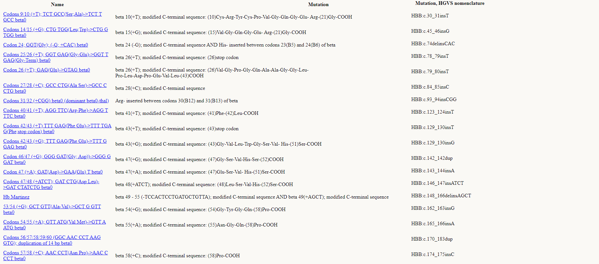

Une propriété génétique importante des mutations ponctuelles est qu'elles peuvent reverser. En effet, Il est possible d'abolir par une seconde mutation, le changement qu'a provoqué la première mutation. On dit que cette deuxième mutation est une **réversion**. Celle-ci peut être **vraie et rétablir le nucléotide initial** ou bien restaurer le même acide aminé mais codé par un autre codon (ou rétablir la phase un peu plus en amont ou en aval du lieu du premier changement de phase).

exemples

- AAG → AAC → AAG  qui donne lysine → asparagine → lysine. Il s'agit d'une réversion vraie

- AAG → AAC → AAA qui donne lysine → asparagine → lysine qui est une réversion

### Les délétions

Celles-ci peuvent englober une partie d'un gène, un gène entier ou plusieurs gènes. Leurs effets sont souvent drastiques. Si la délétion est de grande taille, elle englobe plusieurs gènes dont certains peuvent être essentiels. Les grandes délétions sont donc, en général, létales chez les haploïdes. Leur intérêt réside dans le fait que si un gène est délété (et uniquement ce gène), on peut connaître grâce au phénotype que cela entraîne le rôle de ce gène. On dit qu'on est en présence de l'**allèle nul** (notez que la présence d'un codon stop au début de la phase codante ou une mutation dans l'ATG initiateur sont aussi en théorie des allèles nuls, mais ce type de mutations peut réserver des surprises). On sait maintenant les créer à volonté comme indiqué dans le chapitre 3. De manière surprenante la plupart des gènes pris individuellement ne sont pas essentiels. C'est à dire que la cellule survie très bien s'ils sont délétés. Cela provient le plus souvent de la redondance des gènes et des systèmes dans la cellule.

Les délétions peuvent aussi servir pour la cartographie. Je vous conseille de résoudre le problème de TD pour comprendre comment cela fonctionne.

### Les transpositions

Nous avons vu que ces évènements sont très fréquents et une bonne partie des mutations dans les populations naturelles est en fait liée à des évènements de transposition. Les effets sont de deux types. Le transposon peut s'insérer dans un gène et l'inactiver. Mais, il peut aussi s'insérer dans ses régions régulatrices et en déréguler l'expression.

exemples

- Chez *Saccharomyces cerevisiae*,  l'insertion d'un transposon Ty en amont du gène *ADH2*, normalement induit par l’éthanol et réprimé par le glucose, rend la synthèse de l’alcool déhydrogénase constitutive.
- Chez la drosophile: insertion d'un transposon *copia* dans le deuxième intron du gène *white* perturbe la transcription et provoque l’apparition d’yeux orange au lieu de rouge brique.
- Chez la souris, l'insertion d'un rétroélément IAP (intracisternal-A particle) dans un exon non codant, en 5' du gène *Agouti* dérégule l'expression de la protéine ce qui conduit à des souris à poil jaune. cette mutation est bien évidemment dominante.

Les excisions de transposons peuvent aussi conduire à des changements de phénotypes. Par exemple, si un gène est dérégulé par la présence d'un transposon dans son promoteur ou un de ses introns, l'excision du transposon peut conduire à un retour à une expression sauvage. Néanmoins, la majorité des transposons laissent des cicatrices après leur excision, souvent une duplication de quelques paires de bases. L'excision de transposons présents dans des séquences codantes peut donc aboutir à des frameshifts, ce qui souvent ne permet pas une restauration d'un phénotype sauvage. Si l'ADN ajouté est un multiple de trois bases, cela peut aboutir à l'ajout d'un ou plusieurs acides aminés, et donc éventuellement une restauration d'un phénotype sauvage ou proche du sauvage.

### La recombinaison comme générateur de variation

Lorsque l'on compare les génomes d'espèces proches, voire de souches différentes d'une même espèce, on constate qu'ils ont souvent divergé via la présence de modifications de la structure des chromosomes (figure 58).

De même, les cellules cancéreuses ou des mutants présentent de nombreuses modifications de caryotypes avec en particulier des altérations de la structure de chromosomes (figure 59)

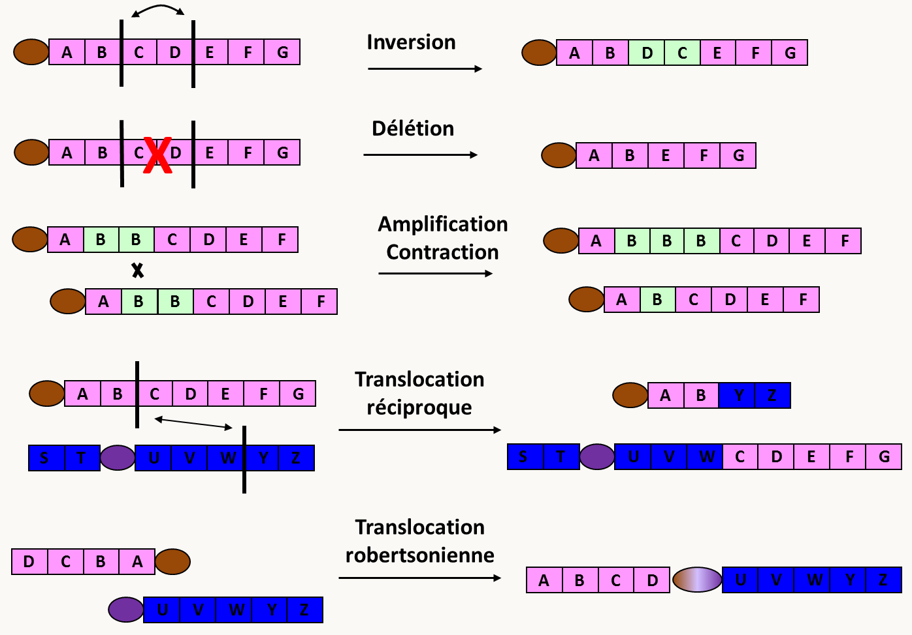

En fait, ces modifications de la structure des chromosomes sont souvent le fait de recombinaisons entre séquences répétées, duplications segmentales ou transposons. En effet, il existe dans la cellule un mécanisme de recombinaison qui permettent l'échange des brins d'ADN entre **séquences dites homologues**, c'est à dire ayant la même séquence: le **crossing-over**. Les crossing-over sont clairement visualisés au cours de la méiose par les chiasmas qui en sont la manifestation physique et qui sont le reflet des échanges de brins. Nous verrons plus loin en détail le mécanisme de genèse de ces crossing-over pendant la méiose et leurs implications sur la ségrégation des allèles. Ils se produisent dans toutes les cellules durant toutes les phases cellulaires et ils peuvent générer de la diversité génétique. Les plus fréquents impliquent les séquences répétées. En fonction de leur position sur la même molécule ou sur deux molécules différentes ainsi que leurs orientations, ils vont créer des délétions, insertions, inversions, amplifications, contractions ou translocations (figure 60).

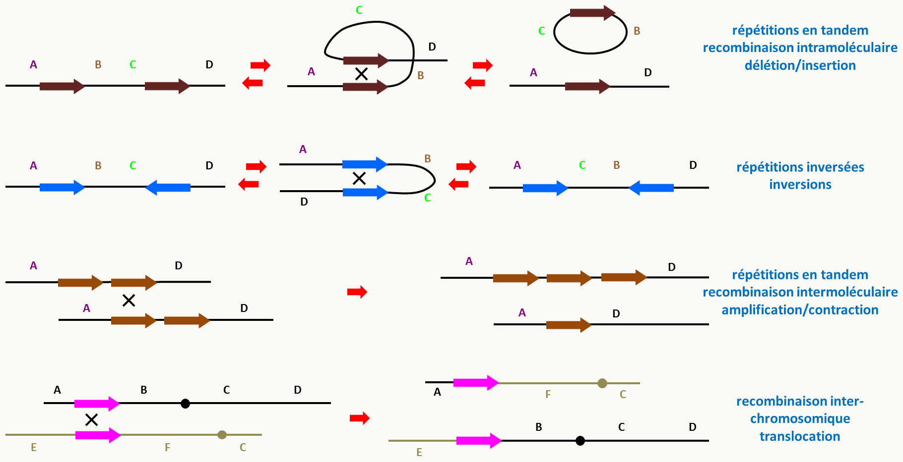

Notez qu'il existe des recombinaisons qui se produisent entre séquences non homologues et vont aussi provoquer des délétions, des inversions et des translocations. Celles-ci sont en général plus rares et résultent de mauvaises réparations de cassures doubles brins. Elles vont par exemple avoir lieu dans des cellules soumises aux rayons X ou  γ.

Chez les eucaryotes, la présence de ces modifications de chromosomes peut avoir des effets sur la fertilité au cours de la reproduction sexuée. En effet, des inversions successives empêchent la recombinaison en méiose en limitant les possibilités d'appariements entre chromosomes homologues porteur ou non d'une inversion, et si une recombinaison se produit, les chromosomes résultants sont déficients (figure 61).

Ce mécanisme participe donc à la diminution ou l'absence éventuelle de descendants lors des croisements entre souches porteuses d'inversion. Chez la drosophile, il existe de nombreux chromosomes portant des complexes d'inversion construits par l'homme: les **chromosomes balanceurs**. La recombinaison est donc abolie dans une mouche hétérozygote portant un chromosome balanceur et un chromosome normal pour le chromosome en question. Ces chromosomes balanceurs permettent donc de maintenir au cours des divisions des combinaisons génétiques intéressantes.

Les translocations (sauf les translocations roberstoniennes, figure 59) conduisent aussi à des problèmes en méiose. En effet, l'association des bivalents conduit à la présence de croix translocation qui vont poser des problèmes de gestion à la première division de méiose (figure 62).

![croix de translocation en première division de méiose. Chaque chromosome 1 ou 2 a autant de chance de partir avec l'autre chromosome initial ou transloqué. Si les deux chromosomes initiaux partent ensembles en première division (les deux chromosomes transloqués partiront donc aussi ensembles), les gamètes produits seront viables. Au contraire, si un chromosome initial migre avec un chromosome transloqué, les 4 gamètes produits seront non-viables car dans chacun des noyaux finaux, il manquera un morceau de chromosome.](img/image062.png)

Notez que, si la mutation est le créateur primaire de la variation, la recombinaison peut associer différents polymorphismes et par-là augmenter la variation en générant de nouvelles combinaisons génétiques (haplotypes). C'est ce phénomène qui se produit en méiose et qui explique le maintien de la reproduction sexuée chez de nombreux eucaryotes, bien que celle-ci soit coûteuse en énergie et qu'il faille souvent la rencontre de deux partenaires pour assurer une descendance. Mais la recombinaison a aussi d'autres effets en modifiant la structure des chromosomes via des crossing-over, le plus souvent entre séquences répétées. Ces modifications de structure participent à l'isolement reproductif entre espèces. On dit donc que les génomes sont fluides car ils peuvent facilement changer de structure. Nous reviendrons sur ce point dans le chapitre suivant sur la génomique.

### Les aneuploïdes et les polyploïdes

A l'autre extrême du spectre en taille se trouvent les accidents chromosomiques qui ont des origines variées. Au cours de la mitose ou de la méiose un accident fréquent est l'absence de clivage d'un centromère (figure 63). Il ne se produit pas alors de disjonction des deux chromatides et le résultat est un noyau où il manque un chromosome et un noyau avec un chromosome surnuméraire. On aboutit alors à la formation d'un aneuploïde.

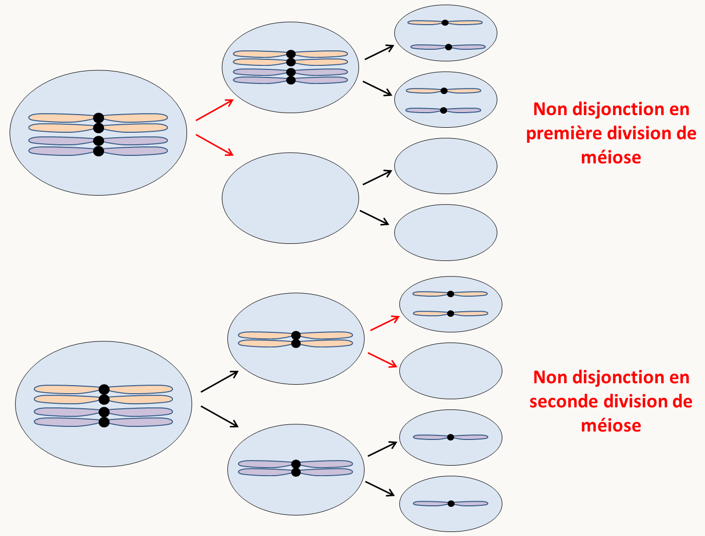

Il n'existe pas de règle générale pour les effets des aneuploïdies. Chez l'homme, elles sont particulièrement néfastes et le plus souvent létales et seuls quelques chromosomes dont les chromosomes sexuels peuvent être en un seul ou trois exemplaires. La **trisomie** du chromosome 21 est la seule qui permet la viabilité à long terme chez l'homme, alors que les trisomies du chromosome 13 cause le syndrome de Patau et la trisomie du chromosome 18 le syndrome d'Edwards qui sont létales très tôt chez les enfants atteints. Les individus XXY ont le syndrome de Klinefelter. Ils sont de sexe masculin mais présentent plusieurs problèmes dont la stérilité. Les individus XYY ou "double Y" sont quant à eux quasi indistinguables des hommes XY; ils sont souvent un peu plus grands que les individus XY. Le fait que ces individus aurait des tendances plus agressives et auraient des tendances criminelles est faux! Les monosomies autosomales de chromosomes complets sont létales chez l'homme. Celle du chromosome X entraîne le syndrome de Turner. La plupart des embryons atteints avortent et les individus porteurs du syndrome et qui naissent ont des problèmes multiples, incluant la stérilité. Les aneuploïdies peuvent aussi se produire en mitose au cours du développement embryonnaire et dans ce cas, seule une partie des cellules de l'individu sera affecté: on dit qu'il est formé d'une **mosaïque génétique**. Les individus affectés peuvent avoir des problèmes plus ou moins importants en fonction de la proportion de ses cellules aneuploïdes. Souvent, seule une partie des chromosomes est manquante ou surnuméraire; ils ont des **aneuploïdies partielle**. Là encore les individus porteurs ont des problèmes variés en fonction des fragments de chromosomes impliqués.

Nous avons vu avec les X attachés que chez la drosophile le chromosome X peut se trouver en trois copies (dont deux attachés). Chez la levure par contre les aneuploïdies sont viables (à conditions d'avoir au moins un jeu complet de chromosomes !) et très fréquentes dans les populations naturelles, en particulier dans certaines souches que l'on utilise pour faire du vin. Souvent ces aneuploïdies créent des difficultés d'appariement au niveau de la prophase de la première division de la méiose et entraînent ainsi des diminutions de la fertilité.

Un autre phénomène assez fréquent est la **polyploïdisation**. Celle-ci se produit lorsqu'il y a duplication du jeu de chromosome sans division du noyau. Je vous rappelle que la colchicine entraîne ce genre d'anomalies. On a ainsi cherché à créer de nouvelles plantes d'intérêt agricole. Par exemple, le triticale a été obtenu en croisant le blé (qui est en fait un hexaploïde: 2n = 6x = 42) et le seigle (qui est un diploïde: 2n = 2x = 14). La F1 de ce croisement comporte 21 + 7 chromosomes qui malheureusement ne peuvent faire une méiose car chaque chromosome est unique. L'ajout de colchicine a permis de doubler le nombre de chromosomes car sans fuseau, il n'y a pas d'anaphase et donc les chromosomes ne se séparent pas à la mitose. On obtient ainsi des **amphiploïdes** (2n = 2x 28) qui sont fertiles et qui ont la résistance du seigle et le rendement du blé. La même technique avec le chou et le radis a malheureusement donné des plantes avec des racines de choux et des feuilles de radis, sans donc aucun intérêt agronomique !!!

# Chapitre 2: Quelques notions de génomique

## Qu'est-ce que la génomique ?

Initié par la détermination des séquences complètes des **génomes** de divers organismes (voir la table suivante qui donne les étapes importantes jusqu'à la publication du génome humain en 2001), la génomique est la sous-discipline de la génétique qui regroupe les connaissances génétiques sur un organisme et tente de les synthétiser. Elle traite en particulier de l'organisation globale des génomes. Un **génome** est alors défini principalement par les généticiens moléculaires: il s'agit de la totalité des séquences d'ADN et d'ARN qui font partie de l'information transmise aux descendants par les parents. Notez qu'il est possible maintenant d'avoir accès aux changements structuraux de l'ADN associés aux séquences génomiques comme la méthylation de l'ADN ou les modifications des histones favorisant ou défavorisant la formation hétérochromatine. La génomique s'intéresse donc aussi à certains mécanismes épigénétiques qui vont structurer le génome et avoir un impact sur son expression.

La génomique nous permet par exemple d'analyser et de comparer les génomes des différents organismes (au sein d'une même espèce ou entre espèces différentes) et donc de mieux comprendre leur fonctionnement, (aussi bien dans leur ressemblance que leur dissemblance) et leur évolution. La disponibilité de la séquence facilite aussi les analyses de génétique dirigée, comme expliqué dans le chapitre suivant. Cette facilité a été poussée jusqu'au point où des collections de souches inactivées pour chacun des gènes non essentiels sont disponibles pour plusieurs organismes, voir tous les gènes chez certains diploïdes où les inactivations peuvent être conservées à l'état hétérozygote comme *Saccharomyces cerevisiae* (consultez le site du SGD pour en savoir plus: https://www.yeastgenome.org/). Enfin, une large part actuelle de la génomique consiste dans la détermination de transcriptomes, c'est à dire de profils d'expression transcriptionnelle de tous les gènes, dans différentes conditions afin d'avoir une idée des mécanismes d'adaptation des organismes à leur environnement.

| Espèce                      | Date de publication                            | Taille            |
| --------------------------- | ---------------------------------------------- | ----------------- |
| Bacteriophage phi X174      | 2/24/1977 - 1er virus                          | 5,375             |
| Génome mitochondrial humain | 4/9/1981 - 1er génome mitochondrial            | 16,569            |
| Bacteriophage Lambda        | 12/25/1982                                     | 48,502            |
| Virus d'Epstein-Barr        | 7/19/1984                                      | 172,281           |
| Human cytomegalovirus AD169 | 12/6/1989                                      | 229,354           |
| *Haemophilus influenzae*    | 7/28/1995 - 1ère cellule                       | 1,830,138         |
| *Synechocystis sp.*         | 6/30/1996                                      | 3,573,471         |
| *Saccharomyces cerevisiae*  | 5/29/1997 (publication Nature) - 1er eucaryote | ~12 000 000       |
| *Escherichia coli*          | 9/5/1997                                       | 4,639,221         |
| Génome nucléaire humain     | 2/15/2001                                      | 3 200 000 000 x 2 |

Actuellement, les coûts et efficacités de ces techniques sont tels, qu'il est possible de faire séquencer son génome pour quelques centaines d'euros. Des grands programmes visant à établir des génomes et transcriptomes à haut débit sont en cours. Souvent appelé "1000 génomes", ils se déclinent par exemple chez l'homme (1000 human genomes: https://www.internationalgenome.org/), les champignons  (1000 fungal genomes: https://mycocosm.jgi.doe.gov/mycocosm/home) ou les animaux avec cette fois 10 000 génomes (https://genome10k.soe.ucsc.edu/). Pourtant, les premiers génomes séquencés l'ont été au prix d'efforts pécuniaires et humains considérables. Nous allons voir donc les deux stratégies principales utilisées pour établir les séquences des génomes. Pour l'aspect technique du séquençage, je vous renvoie aux cours de biologie moléculaires

## Stratégies pour séquencer des génomes complets

### Première stratégie

Cette stratégie est plus longue mais plus sûre ! C'est celle adoptée par les consortiums publics de séquençage du génome de *Saccharomyces cerevisiae* ou du génome humain.

1°) cloner dans des cosmides ou des BAC (Bacterial Artificial Chromosome) des longs fragments du génome. Les BAC sont des plasmides simple-copie dérivés du plasmide F qui peuvent accepter jusqu'à 250 kb de séquence. Leur faible nombre de copie assure leur stabilité (pas de réarrangements dans la bactérie) et la représentativité du génome (peu de chance d'avoir un gène trop exprimé et délétère pour la bactérie), ce qui n'est pas forcément le cas avec les cosmides qui recombinent plus dans *Escherichia coli*.

2°) cartographier ces cosmides et/ou BAC soit moléculairement avec des enzymes de restrictions ou des amplifications PCR (il existe de nombreuses méthodes !), soit en s'ancrant sur une carte génétique, si celle-ci est suffisamment dense.

3°) séquencer les cosmides/BACs adjacents en utilisant la première méthode.

Cela revient à obtenir les séquences pour chaque cosmide/BAC. L'arrangement final des séquences se faisant grâce à la carte. Cette méthodologie n'est plus vraiment utilisée. Elle a été remplacée par la stratégie suivante moins demandeuse en temps, mais qui est moins fiable.

### Deuxième stratégie

Cette stratégie a été utilisé pour la première fois par la compagnie privée Celera pour séquencer le génome de drosophile et le génome humain. Dans sa première version, elle utilisait toujours le séquençage de Sanger classique:

1°) fragmenter aléatoirement le génome par des méthodes physiques (qui sont plus aléatoires que l'utilisation de méthodes enzymatiques), tel que les ultrasons ou la nébulisation (utilisation d'un gaz sous pression) pour générer des fragments d'environ 1 kb (je vous rappelle que c'est la taille maximum de séquence fiable obtenue en une seule réaction avec les technologies disponibles). Cela évite aussi l'apparition de "gènes" qui serait toxique pour la bactérie qui est utilisée à la deuxième étape (c'est à dire *Escherichia coli* !).

2°) cloner les fragments dans un vecteur plasmidique et obtenir une banque totale du génome (on estime qu'il faut une couverture d'au moins 10 X le génome, c'est à dire que la taille combinée des inserts présents dans la banque doit être 10 fois plus importante que la taille du génome, un peu de statistique montre que dans ces conditions, environ 99,9% du génome devrait être séquencé une fois.

3°) séquencer automatiquement les inserts et rapatrier les séquences dans des fichiers.

4°) utiliser des programmes qui permettent à partir des fragments de séquence de faire des contigs.

5°) combler les trous soit en clonant de manière dirigée les régions manquantes, soit par PCR en amplifiant à l'aide d'amorces localisées au bord des contigs. Il faut bien sûr ensuite séquencer ces régions.

Cette méthode est rapide mais nécessite des outils informatiques très puissants, ce qui n'est plus un problème grâce à l'augmentation des performances des ordinateurs. Par exemple pour le génome humain, il faut comparer 32 000 000 séquences entre elles ! Elle suppose aussi qu'il n'y a pas trop de séquences répétées car dans ce cas, l'analyse informatique ne permettra pas facilement de donner la séquence dans le bon ordre ! on dit par exemple que Celera s'est "aidé" du génome "publique" pour établir sa séquence ! De toute manière, il faut vérifier qu'il n'y a pas eu d'erreurs à l'assemblage en comparant cette séquence avec soit une carte de restriction, soit une carte génétique.

Il existe maintenant des machines capables de générer plusieurs dizaines de millions de séquences de cours fragments d’ADN de quelques dizaines à quelques centaines de nucléotides à partir d’ADN génomique fragmenté. La méthode la plus utilisées actuellement est celle d'Illumina (https://www.illumina.com/). Des améliorations permettent de plus par exemple de séquencer le génome d'une seule cellule par cette méthode (https://www.illumina.com/content/dam/illumina-marketing/documents/products/research_reviews/single-cell-sequencing-research-review.pdf)! Des programmes informatiques permettent ensuite de reconstituer le génome, mais celui-ci est souvent très fragmenté (plusieurs milliers de morceaux…). Pour pallier à ce problème, des méthodes comme celle du PacBio (https://www.pacb.com/) ou du Nanopore (https://nanoporetech.com/) permettent de séquencer plusieurs milliers de nucléotides en continu, ce qui va permettre d'améliorer les assemblages. Malheureusement, les séquences obtenues contiennent de nombreuses erreurs et ces techniques appliquées seules ne donnent pas de bons résultats. Actuellement, la méthode de choix est donc la suivante:

1°) séquencer par Illumina **et** PacBio ou Nanopore

2°) assembler en utilisant des programmes dédiés qui permettent de combiner les deux types de séquençage comme Unicycler. Cette étape peut maintenant se faire sur un ordinateur de bureau en quelques heures pour des génomes bactériens ou des "petits eucaryotes" comme les levures, champignons filamenteux, protistes et algues à petits génomes (< 100 Mb). Les génomes plus gros demandent toujours des gros ordinateurs...

Enfin, les séquences des ARN par "RNAseq" (voir vos cours de BM) sont généralement réalisées afin de pouvoir annoter correctement le génome. En effet, nous n'avons pas discuté cette étape finale du travail: la définition des gènes présents dans le génome. Il existe trois types d'annotation:

- L'utilisation de séquences d'ARN; c'est à dire maintenant de données de RNAseq.
- Prédictions *de novo* des régions potentiellement codantes. Il est possible maintenant de prédire les régions codant pour des protéines, des ARNt, des snRNA... en se basant sur des caractéristiques de ces régions. Pour les ARNt, il s'agit des structures secondaires et de l'anticodon, pour les protéines, il s'agit des consensus de démarrage et fin de traduction, de biais de codons, de signaux d'épissage *etc*.

- Utilisation de la conservation évolutive des régions codantes. Pour ceci, il faut comparer les ORF (Open Reading Frames qui sont les séquences situées entre deux codons stop) présentes dans la séquence avec les banques de données afin d'identifier celles conservées au cours de l'évolution et qui ont donc de grandes chances de coder pour une information. Cette étape permet en même temps de prédire la fonction potentielle des gènes ainsi détectés.

Le plus souvent, les trois méthodes sont appliquées et un consensus des trois prédictions est retenu. Les programmes de séquençage proposent donc souvent deux listes: celles de toutes les prédictions qui est la réunion des CDS (= séquences potentiellement codantes) obtenues par les trois méthodes et celles qui sont les plus probables (qui correspondent grosso modo plutôt à l'intersection des trois méthodes).

Il ne reste plus ensuite qu'à déposer la séquence dans les banques de données comme GenBank (https://www.ncbi.nlm.nih.gov/genbank/), ENA de l'EMBL (https://www.ebi.ac.uk/ena) ou DDJB (https://www.ddbj.nig.ac.jp/index-e.html). Ces trois banques échanges leurs données de manière régulière et contiennent les mêmes données mais présentées de manières différentes. Depuis quelques années, elles ne contiennent plus la totalité des séquences disponibles et il faut maintenant naviguer sur de nombreux sites pour accéder aux séquences...

Il existe de nombreux programmes qui permettent la visualisation de ces séquences (voir par exemple le "genome data viewer" du NCBI (https://www.ncbi.nlm.nih.gov/genome/gdv/). Un programme de visualisation en local (artemis; https://www.sanger.ac.uk/science/tools/artemis) lit facilement les fichiers d'annotation téléchargeables à partir des banques de données (GenBank ou EMBL) et permet de voir simplement les caractéristiques des génomes  sur votre ordinateur personnel, ce que la section suivante va faire!

## Les génomes des principaux organismes modèles et leur évolution

En fait, il existe une assez bonne corrélation entre la taille des génomes dans les différents groupes d'organisme et leur position phylogénétique. Cependant, il existe des exceptions qui sont regroupées sous la terminologie du paradoxe C. Par exemple, chez les vertébrés, les salamandres ont 50 fois plus d'ADN que l'Homme et l'amibe unicellulaire *Amoeba dubia* possède un génome mesurant 670 000 Mb, soit une taille plus de 200 fois plus grande que celle du génome humain!  Voici d'autres exemples de discordances:

**Plantes** :

- Arabidopsis : 138 Mb
- Tabac : 3 800 Mb
- Pin :  68 000 Mb

**Animaux** :

- Lamproie :  1 900 Mb
- Homme :  3 200 Mb
- Protoptère :  140 000 Mb

La figure 64 présente la phylogénie globale  actuelle. Pour  rappel, les animaux font partie des *Holozoa*, les plantes des *Archaeplastida* et les champignons des *Holomycota*, le reste des eucaryotes étant des "protistes".

La table suivante vous donnent un ordre de grandeur des génomes, en paire de bases et en gènes, ainsi que la taille moyenne des gènes chez quelques organismes - le plus souvent utilisés comme modèles pour les analyses génétiques - appartenant aux différents groupes biologiques mentionnés dans la figure 64.

|             |                              |                                       | taille (Mb) | nb de gènes codant des protéines | taille moyenne des gènes |
| ----------- | ---------------------------- | ------------------------------------- | ----------- | -------------------------------- | ------------------------ |
| Eubactéries |                              | *Escherichia coli*                    | 4.6         | ~4 400                           | 1 kb                     |
|             |                              | *Streptomyces lividans*               | 8.3         | ~7 300                           | 1 kb                     |
|             |                              | *Mycoplasma genitalium*               | 0.58        | 483                              | 1 kb                     |
| Archées     |                              | *Pyrococcus abyssi*                   | 1.7         | 1 765                            | 1 kb                     |
|             |                              | *Archeoglobus fulgidus*               | 2.2         | 2 437                            | 0,8 kb                   |
| Eucaryotes  | *Excavata*                   | *Giardia lamblia*                     | 12          | ~6 500                           | 1.3 kb                   |
|             | *Heterokonta*                | *Ectocarpus silicosus*                | 196         | ~12 200                          | 6.8 kb                   |
|             | *Hacrobia*                   | *Emiliania huxleyi*                   | 168         | ~40 000                          | 1.6 kb                   |
|             | *Dinoflagellata*             | *Symbiodinium microadriaticum*        | 808         | ~43 000                          | 12.2 kb                  |
|             | *Apicomplexa* (SAR)          | *Plasmodium falciparum*               | 23          | ~5 200                           | 2.2 kb                   |
|             | *Ciliophora* (SAR)           | *Paramecium tetraurelia* (macronoyau) | 72          | ~40 000                          | 1.6 kb                   |
|             | *Plantae* (*Archaeplastida*) | *Chlamydomonas reinhardtii*           | 111         | ~16 400                          | 5.4 kb                   |
|             |                              | *Physcomitrella patens*               | ~500        | ~36 000                          | 2.4 kb                   |
|             |                              | *Populus trichocarpa*                 | ~500        | ~45 500                          | 2.2 kb                   |
|             |                              | *Arabidopsis thaliana*                | 138         | ~27 600                          | 2.0 kb                   |
|             | *Amoebozoa*                  | *Dictyostelium discoideum*            | 34          | ~12 500                          | 1.9 kb                   |
|             | *Microsporidia*              | *Encephalitozoon cuniculi*            | 2.9         | ~2 000                           | 1.1 kb                   |
|             | *Eumycota*                   | *Saccharomyces cerevisiae*            | 12          | ~6 400                           | 2 kb                     |
|             |                              | *Podospora anserina*                  | 35.5        | ~11 700                          | 1.8 kb                   |
|             |                              | *Neurospora crassa*                   | 41          | ~10 700                          | 2.5 kb                   |
|             | *Metazoa*                    | *Caenorhabditis elegans*              | 100         | ~18 000                          | 3 kb                     |
|             |                              | *Drosophila melanogaster*             | ~140        | ~18 000                          | 3 kb                     |
|             |                              | *Danio rerio*                         | ~1 400      | ~25 600                          | 11 kb                    |
|             |                              | *Mus musculus*                        | ~2 700      | 19000 - 24 500                   | 10.5 kb                  |
|             |                              | *Homo sapiens*                        | 3 286       | ~20 000                          | 14 kb                    |

Notez que ces chiffres peuvent être amenés à changer car il s'agit d'estimations et les tailles et contenus en gènes varient en fonction des souches (voir plus bas). De plus, si pour certains génomes comme celui de *Saccharomyces cerevisiae* le génome et le contenu codant sont bien connus, pour d'autres espèces, les données sont plus incertaines: on ne sait par exemple toujours pas le nombre exact de gènes chez l'homme!

La séquence complète des génomes de nombreux organismes permet maintenant de mieux comprendre comment ils évoluent. De ces études qui dépassent le cadre de ce cours, nous retiendrons cependant quelques tendances marquantes :

- Chez les procaryotes, les génomes sont compacts et leur capacité codante est utilisée au mieux. Le génome est généralement un chromosome circulaire (figure 65), mais dans certains cas plusieurs chromosomes peuvent être présents et certains chromosomes bactériens sont linéaires (chez *Streptomyces lividans* par exemple). Les gènes sont regroupés en opérons. L'évolution des génomes procaryotes se fait principalement par des évènements de recombinaisons, générateurs d'inversions et de délétion. Les analyses phylogénétiques de comparaison de séquence montrent aussi que les génomes procaryotes ne sont pas complètement imperméables: il existe de nombreux transferts latéraux de gènes. Chez les archées on peut retrouver des gènes dont la séquence est plus proche de celles de gènes d'eubactéries que d'autres archées. On suppose alors qu'il y a eu transfert latéral de gènes (via des plasmides conjugatifs ou via la transformation naturelle ?). Il existe un débat pour évaluer l'importance de ces transferts au cours de l'évolution. Certains extrémistes pensent que ces transferts sont tellement massifs qu'ils empêchent d'obtenir des phylogénies satisfaisantes pour les bactéries et les archées.

  ![le génome d'Escherichia coli, un génome procaryote circulaire typique. En bleu, les séquences codant pour des protéines. Les gènes sont proches les uns des autres et organisés en opéron (notez la position des gènes sur les brins d'ADN; les gènes proches sont souvent sur le même brin, ce qui indique la présence probable d'un opéron). Il n'y a pas d'introns; En fait, il en existe néanmoins quelques-uns qui ont des structures différentes de celles présents dans les génomes nucléaires des eucaryotes.](img/image065.png)

- Chez les eucaryotes, il existe une nette augmentation de la taille des génomes en fonction du degré de complexité des organismes (cf. le tableau ci-dessus). Attention, je rappelle que cette règle n'est pas absolue et qu'il existe de nombreuses exceptions (paradoxe C). Cette augmentation est due en faible partie à l'augmentation du nombre de gènes (un peu plus de 6000 chez la levure à environ 20 000 chez l'homme, cf. tableau ci-dessus). La génération de ces gènes se fait souvent par duplications, suivies de spécialisation des 2 copies qui sont alors appelées des **paralogues**. C'est ce qui s'est passé par exemple pour la genèse des différents gènes de globines présent chez les vertébrés. Notez que les **orthologues** désignent un même gène présent chez des espèces différentes et qui a évolué sans duplication. Pour faire la phylogénie des espèces, il faut donc comparer entre eux des orthologues et non des paralogues. Dans une première étape une duplication conduit à une **redondance génétique**. Puis, des phénomènes de mutations/sélections conduisent à une **néo-fonctionnalisation**, où les deux gènes acquièrent des régulations et/ou des fonctions différentes. Nous avons vu que dans certains cas, des polyploïdisations du génome ont eu lieu, particulièrement chez les plantes. Des traces de tels évènement ont été détectés chez de nombreux autres organismes comme le champignon *Rhizopus oryzae* ou le cilié *Paramecium tetraurelia* chez lequel, trois évènements successifs de polyploïdisation ont pu être mis en évidence! De manière étonnante, la levure *Saccharomyces cerevisiae* semble être un ancien amphiploïde résultant de l'hybridation de deux levures (figure 66).

   ![l'ancêtre de Saccharomyces cerevisiae est un amphiploïde. Deux espèces de levures éloignées se serait croisées pour donner un hybride. Cet hybride aurait subi un doublement de son matériel génétique, ce qui aurait permis un retour à la possibilité de faire des méioses. Par la suite, des pertes d'une des deux copies de gènes présents se seraient produites pour aboutir au génome actuel, où seules certaines régions sont dupliquées. Sur la carte, les différentes régions dupliquées sont codées par la même couleur.](img/image066.png)

  Il semble que ces phénomènes d'hybridation soient plus fréquents qu'anticipés précédemment. Par exemple, de nombreuses souches utilisées pour faire du vin en Alsace, Allemagne, Hongrie, etc. sont en fait des hybrides de *Saccharomyces cerevisiae* et *Saccharomyces kudriavzevii*. Récemment, Denny, une fille connue par un fragment d'os et qui vivait il y a environ 90 000 ans était probablement un hybride obtenu par la reproduction d'une mère néandertalienne avec un homme Denisovien. *Homo neanderthalensis* et *Homo denisova* sont souvent considérés comme des espèces différentes et distinctes d'*Homo sapiens*, même s'ils n'en sont probablement que des sous espèces.

  Souvent, l'hybride "F1" qui possède la moitié du génome d'une première espèce et l'autre de moitié provenant de la seconde espèce se recroise avec des individus appartenant à une seule des espèces parentales. Ses descendants vont donc avoir les trois quart de leur génome provenant de cette espèce et un quart de l'autre. Ces descendants vont à leur tour se recroiser avec la même espèce et donner des descendants avec 7/8 de leur génome provenant de celle-ci et 1/8 de l'autre. Ce processus se reproduisant, à la fin du processus la totalité du génome de l'autre espèce devrait disparaître aléatoire au gré du brassage génétique et des recombinaisons, sauf s'il existe un avantage sélectif à conserver certains gènes. On dit alors que les gènes conservés ont subi une **introgression** du génome de cette espèce vers le génome de l'espèce utilisé pour les croisements. Ce phénomène s'est produit par exemple entre *Homo sapiens* et *Homo neanderthalensis* qui se sont croisés lorsque *Homo sapiens* est sorti d'Afrique. Aujourd'hui les populations africaines ne possèdent pas de gènes provenant d'*Homo neanderthalensis, alors que les populations eurasiennes en contiennent environ 3%. Collectivement, 20% du génome d'Homo neanderthalensis* sont conservés dans les divers génomes d'*Homo sapiens* séquencés jusqu'à présent! Certains gènes ont clairement été retenus grâce aux avantages sélectifs qu'ils confèrent comme STAT2 qui intervient dans la réponse aux virus et dont la fréquence dans les populations mélanésiennes (par exemple en Nouvelle Guinée) ne peut s'expliquer que par une **sélection positive**. L'homme dirige souvent ce processus pour introduire des caractères intéressants d'une espèce dans une autres, notamment avec les plantes cultivées: gènes de résistance à des pathogènes, gènes permettant de meilleurs rendements, une meilleure conservation, etc.

  Toutefois, un comparatif des génomes de différents eucaryotes montre que les régions codant pour des protéines représentent souvent une part négligeable et que l'augmentation de taille des génomes passe par d'autres mécanismes. Il est donc à noter que l'homme possède moins de gènes qu'une plante et à peine plus qu'un ver ou une mouche ! en fait ces chiffres sont trompeurs. En effet, ils ne tiennent compte ni des duplications massives (Arabidopsis a probablement été polyploïdisé et la plupart des gènes sont présents en plusieurs exemplaires très proches), ni surtout des évènements post-transcriptionnels qui permettent une augmentation de la diversité en protéines. Par exemple, il existe des phénomènes d'épissage alternatifs qui aboutissent à la fabrication de plusieurs protéines à partir d'un même transcrit primaire. Ce phénomène est très fréquent chez l'homme, moins fréquent chez Arabidopsis et probablement très rare chez la levure.

  L'augmentation de la taille des génomes passe donc principalement par (1) la variation du nombre et de la taille des introns (de 0 ou 1 intron de quelques dizaines de paires de bases à plusieurs introns de plusieurs dizaines de kilobases), (2) l'augmentation du nombre des transposons et autres séquences répétées (les satellites en particulier). C'est l'augmentation de cette fraction du génome qui permet d'expliquer en grande partie le paradoxe C. Certaines espèces ont plus de transposons que d'autres. Les raisons en sont obscures. Les transposons sont principalement localisés entre les gènes et/ou dans les introns. (3) La présence de **pseudogènes**. Un pseudogène est un gène qui dans le passé a été fonctionnel et a par la suite perdu sa fonction. L'étape ultime de la pseudogénisation est la perte complète du gène, c'est à dire sa délétion! C'est le cas par exemple chez les champignons *Podospora anserina* et surtout *Podospora* *comata* chez qui plusieurs centaines de pseudogènes ont été identifiés: en fait près de 10% des gènes semblent "pseudogénisés" chez cette dernière espèce! Notez que chez les vertébrés, l'accumulation de transposons se fait principalement sous forme de transposons non fonctionnels, chez qui les transposases et reverse transcriptases sont inactives car codées par des pseudogènes. Ces tendances se voient facilement si l'on compare les structures des génomes de la levure *Saccharomyces cerevisiae* (figure 66), du champignon *Podospora anserin*a (figure 67) et de l'homme (figure 68).

  

  

  

Le dernier point qu'il est nécessaire de discuter concerne la variabilité des génomes qui peut maintenant être évaluée en comparant directement les séquences génomiques. Nous avons vu (cf. figure 58) que les génomes pouvait varier par la présence de réarrangements et qu'au sein d'une espèce le pourcentage de divergence était de l'ordre du ‰ alors qu'il est plutôt de l'ordre du % entre espèces distinctes (2% par exemple entre l'homme et le chimpanzé). Les séquences de nombreuses souches pour une même espèce permettent maintenant de définir le "**core génome**" qui correspond aux gènes présents dans toutes les souches et le "**pan génome**" qui correspond lui à tous les gènes retrouvés dans au moins une des souches. Chez les bactéries, il existe de nombreux gènes optionnels si bien que le pan génome est beaucoup plus grand que le core génome. Par exemple (figure 70), l'analyse de 20 souche d'*Escherichia coli* a permis d'identifier 10 131 gènes différents (= pan génome); seulement 2 167 étaient présents dans toutes les souches (= core génome) et les souches possèdent en moyenne 4721 gènes! Les gènes du core génome codent pour des fonctions essentielles de la cellule (réplication, transcription, traduction...) alors que les gènes présents optionnellement codent pour des fonctions facultatives mais permettant une meilleure adaptation à l’environnement comme des résistances à des antibiotiques, la capacité à métaboliser des composés organiques, la production de toxines etc.

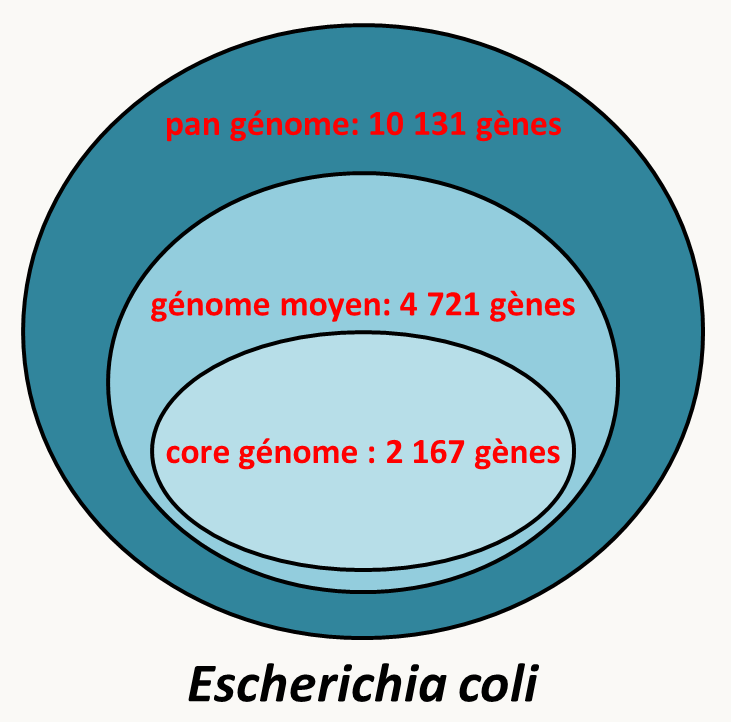

La figure 71 donne un aperçu des core et pan génomes de quatre champignons et montre clairement que chez certains eucaryotes le contenu en gène présente aussi une grande variabilité au sein d'une même espèce. Comme chez les procaryotes, les gènes optionnels permettent une meilleure adaptation à l'environnement. Ils peuvent être regroupés sur des chromosomes optionnels. C'est le cas par exemple chez les champignons du genre *Fusarium* dont certaines souches contiennent des chromosomes surnuméraires. Il a été montré chez *Fusarium oxysporum*, qui est un pathogène ayant un large spectre d'hôte, que des déterminants de spécificités et de virulence pour les différents hôtes sont portés par ces chromosomes surnuméraires.

Chez l'homme, les différences entre le core et le pan génome sont moins prononcés. Une étude sur les population africaine a montré que celles-ci possèdent collectivement environ 300 Mb de plus que le génome de référence "GRCh38 ", soit 10% de séquences supplémentaires. Les populations asiatiques chinoises et coréennes partagent 120 MB de plus avec les populations africaines. Un analyse plus spécifiques des populations Han de Chine montre que celles-ci ont environ 30 MB qui leur sont propres en comparaison avec le génome de références contenant 188 gènes nouveaux codant pour des protéines.

Cette variabilité inattendue révélée par les analyses génomiques montrent que les différentes souches ou individus pour une même espèce peuvent avoir des contenus géniques très différents. Nous reviendrons sur ce point dans un chapitre ultérieur lorsque nous discuterons du fond génétique.

# Chapitre 3: La mutagenèse

## Le principe de la mutagenèse

La méthodologie génétique est une approche très performante pour étudier le fonctionnement des systèmes biologiques (gènes et protéines, réseaux de gènes et mécanismes pluri-moléculaires, cellulaires ou agissant au niveau de l'organisme). En effet, en perturbant un système, par exemple en enlevant une pièce d'un système, il est facile d'observer ce qui a changé dans son fonctionnement et donc de savoir à quoi sert la pièce manquante. En génétique, la démarche suivie consiste donc dans un premier temps à obtenir des mutants qui ont des défauts dans l'objet ou le processus que l'on étudie. Il existe deux grands types de démarches pour obtenir ces mutants: la méthode dite de **génétique classique ou directe** et la méthode dite de **génétique inverse ou dirigée** (figure 72). Bien qu'inventé plus tard, nous commencerons par la génétique inverse car c'est la méthode la plus utilisée actuellement, même si grâce aux nouvelles techniques de séquençage, la génétique directe redevient plus fréquemment utilisée.

![démarches suivies au cours des analyses de génétique classique ou inverse. Pour la génétique classique, la démarche démarre par la recherche de mutants sur des critères phénotypiques intéressants pour le processus étudié (mutants d'auxotrophie pour la biosynthèse des acides aminés, mutants de longévité pour le vieillissement, mutants arrêtés à une étape embryonnaire pour l'analyse du développement, etc.); c'est ce l'on appelle une mutagenèse qui aboutit à l'obtention de mutants indépendants.  Il faut ensuite caractériser les mutations par les méthodes de la génétique classique. Ensuite, les différents gènes ainsi identifiés par des mutations et qui interviennent dans le processus sont clonés par des démarches de génétique moléculaire (clonage positionnel, par expression fonctionnelle ou séquences complètes des génomes mutants). La formulation de modèles passe par la caractérisation fine des mutants qui fait appel aux méthodes de la biochimie et biologie moléculaire, de la cytologie, de la génétique des interactions afin d'obtenir des mutants supplémentaires, et éventuellement de la génétique inverse pour vérifier certaines hypothèses.  La génétique inverse consiste dans l'obtention par les techniques de l'ADN recombinant in vitro de mutations spécifiques dans des gènes dont on connait la séquence mais généralement pas le rôle, et la réintroduction de ceux-ci par transformation ou transfection dans un organisme afin d'obtenir des mutants de ces gènes; les effets obtenus sont ensuite analysés par les mêmes techniques que ceux obtenus par mutagenèse classique afin de formuler des modèles de fonctionnement. Ceci aboutit souvent à l'identification de nouveaux gènes candidats qui vont pouvoir à leur tour être analysés par génétique inverse.](img/image072.png)

## Les technologies de l'ADN recombinant et la mutagenèse dirigée

La mutagenèse dirigée consiste en la création artificielle *in vitro* de mutations dans une séquence connue d'ADN ou comme nous le verrons de constructions  de "**cassettes**" permettant d'inactiver/muter les gènes, suivi de leur introduction dans des cellules afin de les muter. Une cassette est une séquence d'ADN construite *in vitro* par les technologies de l'ADN recombinant (digestion enzymatique par des enzymes de restriction et religation, fabrication par PCR et PCR-fusion de gènes tronqués ou fusionnés, mutagenèse ponctuelle dirigée avec le système Ung-/Dut-, etc.); je vous renvoie vers les cours de Biologie Moléculaire pour le détail des constructions). Les cassettes une fois introduites vont avoir différents devenirs en fonction de leur caractéristiques, mais souvent elles vont devoir s'intégrer au sein du/des chromosome(s) de la cellule par recombinaison. Nous allons donc voir plus en détail ces deux mécanismes avant d'expliquer plusieurs stratégies de modifications des gènes.

### Les mécanismes de la transformation

Nous avons vu que le principe de la transformation a été découvert par Frederick Griffith (voir la section "Frederick Griffith en 1928 découvre la transformation génétique") en étudiant la bactérie *Streptococcus pneumoniae*. Cette bactérie est naturellement **compétente** à intégrer de l'ADN exogènes comme beaucoup d'autres bactéries, car il existe plusieurs dizaines d'autres espèces appartenant à de nombreux phyla bactériens pour lesquelles une compétence naturelle à la transformation a pu être démontrée. Celle-ci ne se produit toutefois pas à toutes les étapes du cycle cellulaire et il faut souvent des conditions particulières pour qu'elle se déroule. Il existe aussi des méthodes qui vont permettre de rendre compétentes des cellules bactériennes réfractaires. Les techniques sont multiples et visent à modifier l'enveloppe bactérienne, ce qui va entraîner le démasquage du système qui va permettre l'import de l'ADN. Celui-ci semble reposer principalement sur les protéines de la famille Com qui permet l'entrée d'ADN sous forme linéaire simple brin lors de la compétence naturelle (figure 73). Cependant, chez *Escherichia coli*, la compétence artificielle inhibe l'entrée via ce système et active l'entrée via la protéine OmpA de la membrane externe; dans ce cas l'ADN entre sous forme double brin éventuellement circulaire dans le cas des plasmides.

Il existe néanmoins de nombreuses espèces bactériennes pour lesquels la transformation est inefficace ou nulle. Pour faire entrer de l'ADN dans ce type de bactéries, les scientifiques utilisent plutôt le phénomène de conjugaison (voir figure 37) avec une bactérie donneuse facilement transformable qui va recevoir la cassette par transformation comme *Escherichia coli*, et la bactérie réfractaire à la transformation comme receveuse. Le clonage des cassettes se fait donc dans des plasmides conjugatifs comme l'épisome F et le processus va nécessiter des marqueurs (généralement de résistances à des antibiotiques) pour sélectionner les conjuguants et contre sélectionner les souches donneuses (figure 74).

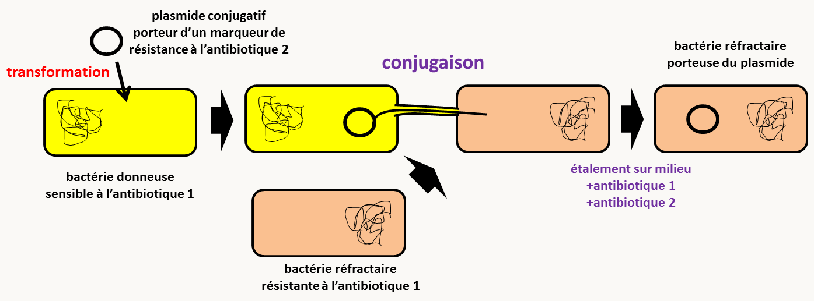

Chez les eucaryotes, il semble aussi exister une transformation naturelle qui a été mise en évidence pour l'instant uniquement chez *Saccharomyces cerevisiae*; elle se produit vraisemblablement peu fréquemment. Elle permet par exemple d'expliquer la présence dans les génomes eucaryote de gènes provenant d'espèces éloignées qui peuvent être soit des procaryotes soit des eucaryotes. On parle alors de **transferts horizontaux** de gènes (qui sont bien évidemment beaucoup plus fréquents chez les bactéries!). Néanmoins, il faut souvent rendre les cellules eucaryotes compétentes pour faire entrer de l'ADN. Chez les organismes contenant une paroi comme les levures ou les champignons filamenteux, il suffit souvent de l'enlever en utilisant des enzymes pour obtenir des **protoplastes**, c'est à dire des cellules dépourvues de paroi. On peut aussi ajouter aux cellules intactes ou aux protoplastes du PEG (=polyéthylène glycol) qui semble agir en déstabilisant les membranes et/ou un cation (Li+ ou Ca2+) et/ou faire un choc thermique qui semblent aussi participer de manière synergique à la déstabilisation de la membrane. Alternativement, il est possible de faire un choc électrique qui va avoir aussi un effet déstabilisateur sur les membranes; ce type de transformation est appelé **électroporation**. A chaque espèce d'eucaryote, un protocole particulier mis en place par essais/erreurs va devoir être utilisé. Le mécanisme de pénétration de l'ADN a été étudié chez *Saccharomyces cerevisiae* et il met en jeu des endocytoses suivies probablement de rupture de la vésicule d'endocytose (figure 75). L'ADN peut donc entre sous toutes ses formes: linéaire, circulaire, simple brin ou double brin.

Pour les eucaryotes réfractaires, il est possible d'utiliser la transformation par *Agrobacterium tumefaciens*  qui naturellement injecte de l'ADN linéaire aux plantes qu'elle infecte. Celui-ci est porté par un large plasmide appelé Ti (voir figure 38). Des modifications du plasmide (figure 76) vont permettre la mise au point de systèmes de transformation efficaces, en transformant dans un premier temps *Agrobacterium tumefaciens* et ensuite en transférant les cassettes dans les eucaryotes. Bien évidemment, des plantes, mais aussi des champignons, des algues et des animaux ont été transformés avec succès en utilisant.

![plasmide typique utilisé pour transformer des cellules eucaryotes via A. tumefaciens. Le plasmide porte un marqueur de sélection (résistance) qui permet la sélection à la fois dans E. coli et A. tumefaciens. Une origine de réplication permet la réplication dans E. coli et une autre la réplication dans A. tumefaciens. La région STA assure la stabilité du plasmide dans A. tumefaciens. Ces régions vont permettre d'amplifier le plasmide dans un premier temps en utilisant E. coli et dans un second de le transférer dans A. tumefaciens. La région transférée dans la cellule eucaryote est délimitée par deux frontières de séquences spécifiques. Entre ces deux frontières sont introduits un marqueur de sélection qui fonctionne dans l'organisme à transformer (un gène de résistance à un antifongique ou un herbicide par exemple) et des sites de clonage multiple qui vont permettre d'insérer les cassettes. L'ADN est donc transféré sous forme linéaire double brin.](img/image076.png)

Il existe aussi une méthode "brutale" pour transformer les cellules: leur tirer dessus avec un canon à ADN! Cette méthode de transformation dite par "**biolistique**" (figure 77) permet de transformer tous types de cellules et surtout leurs organites comme les mitochondries et les plastes qui ne peuvent pas être transformés en utilisant les méthodes classiques.

Notez que les méthodes présentées dans ce paragraphe sont les plus communes et qu'il en existe d'autres basées par exemple sur l'infectiosité de virus, l'injection à l'aide d'une aiguille dans les œufs de vertébrés, de drosophile ou de *Caenorhabditis elegans*, ou directement sur la capacité des eucaryotes phagotrophes à incorporer des particules alimentaires. Dans la plupart des cas, l'efficacité de transformation est faible et il faut donc un moyen pour sélectionner les cellules ayant subi une transformation appelées **transformants**. Les deux moyens les plus courants sont:

- la présence dans l'ADN d'un marqueur de résistance à une substance toxique et l'utilisation comme réceptrice d'une souche sensible à cette substance. Les transformants sont sélectionnés sur leur résistance.
- la présence dans l'ADN d'un gène impliqué dans la biosynthèse d'un métabolite et l'utilisation comme réceptrice d'une souche auxotrophe mutée pour ce gène. Les transformants sont sélectionnés sur leur retour à la prototrophie.

### Le devenir de l'ADN une fois dans la cellule

Une fois dans la cellule l'ADN peut avoir différents devenirs en fonction de séquences qu'il porte et de la forme, simple ou double brin, linéaire ou circulaire, sous laquelle il entre dans la cellule. L'ADN simple brin doit redevenir double brin et/ou circulaire dans le cas des plasmides circulaires, ce qui est pris en charge par la machinerie cellulaire. Ensuite, l'ADN peut être répliqué s'il possède une origine de réplication. C'est bien évidemment le cas des plasmides qui vont porter leur propre origine de réplication, mais c'est aussi le cas si l'ADN porte une origine de réplication chromosomique. Chez *Saccharomyces cerevisiae*, ce type de séquence s'appelle ARS pour "Autonomously Replication Sequence". Leur présence permet de maintenir sous forme extrachromosomique des ADNs sous forme circulaire à environ une vingtaine de copie/noyau. Ceux-ci sont mal ségrégés en mitose/méiose et sont souvent perdu sauf  s'ils possèdent une séquence CEN (pour Centromérique) qui va faire baisser le nombre de copie de cellule (2/3 par cellule) mais assurer une répartition équitable au cours des divisions. Chez les autres eucaryotes, les séquences ARS ne sont généralement pas fonctionnelles et il n'existe pas de plasmides nucléaires. L'ADN ne peut donc pas se répliquer; néanmoins chez *Schizosaccharomyces pombe*, la séquence ARS1 et l'origine de réplication du plasmide 2µ sont fonctionnelles. De manière intéressante, l'adjonction de séquences télomériques aux deux extrémités de la séquence d'ADN permet souvent son maintien sous forme extrachromosomique double brin, mais avec une grande instabilité; ceci a été montré par exemple chez *Podospora anserina*.

Si l'ADN ne peut pas se répliquer la seule manière qu'il a pour être conservé est d'être intégré dans le génome: on parle alors de **transformation intégrative**. Cette intégration se produit grâce aux phénomènes de recombinaison dont nous allons voir les principaux mécanismes. Notez qu'il existe plusieurs autres mécanismes qui ne seront pas évoqués ici. je vous renvoie vers les cours de Biologie Moléculaire pour en savoir plus sur la recombinaison.

### Les mécanismes principaux de la recombinaison

Dans son sens le plus large le recombinaison est la réorganisation du génome, soit par réassortiment au hasard des chromosomes à la méiose (c'est à dire par le brassage chromosomique), soit plus spécifiquement par la cassure et le recollage réassorti des brins d’ADN, comme ce qu'il se passe au cours des crossing-over méiotiques. C'est souvent ce dernier type de mécanisme qui définit la recombinaison au sens plus strict des biologistes moléculaires. Il existe en trois grands groupes: la recombinaison homologue, la recombinaison non-homologue et la recombinaison spécifique à un site particulier. Nous allons voir un exemple de chacune de ces recombinaisons.

- #### La recombinaison homologue

  La recombinaison homologue se produit entre deux molécules d'ADN de séquences identiques ou pour le moins très proches: pour se produire de manière efficace il faut en général au moins deux régions de quelques dizaines à quelques centaines de paires de bases et dont les séquences ne divergent pas plus de 5-10% (séquences dites **homéologues**), mais ces chiffres varient en fonction des espèces. *Saccharomyces cerevisiae* est par exemple moins regardante qu'*Escherichia coli* quant à la ressemblance des deux séquences et la recombinaison homologue est très efficace même entre courtes régions d'une cinquantaine de paires de bases. Chez *Podospora anserina*, la taille minimale pour une efficacité élevée de recombinaison homologue est plutôt de 500 bp, même si elle peut se produire entre deux séquences de 200 pb. Le mécanisme principal de la recombinaison homologue est la **réparation des ADN double brin**, ou le "**Double Strand Break Repair**" en bon franglais (figure 78).

  ![le double strand break repair entraîne soit la production de conversions soit de crossing over. Lorsqu'un ADN subit une cassure double brin, il peut être réparé en utilisant une molécule d'ADN homologue, c'est à dire possédant la même séquence. Cela peut être le cas dans une cellule diploïde et dans ce cas la deuxième copie peut servir de matrice. Mais c'est aussi le cas après réplication chez les bactéries et les eucaryotes haploïde (en phase G2). Éventuellement, une séquence homologue/homéologue située ailleurs dans le génome peut être utilisée, ce qui conduira à un réarrangement (voir figure 60). La réparation commence par la résection simple brin au niveau de la cassure par une nucléase spécifique et la reconnaissance et l’appariement des deux séquences. Puis, l'ADN du brin intact est ouvert et la portion simple brin d'une des deux extrémités libre du brin à réparer vient s'hybrider avec le brin intact. Le remplissage des "trous" par une polymérase et la fermeture des simples-brins par une ligase conduit à une structure possédant deux jonctions de Holliday. Cette double jonction est résolue par une résolvase et conduit en fonction de l'action de la résolvase au niveau de chaque jonction soit à une conversion soit à un crossing-over (voir figure 79). Les enzymes impliqués dans ce mécanismes sont très conservés au cours de l'évolution: système RecA,B,C,D chez les bactéries et gènes rad/XP/ERCC chez les eucaryotes.](img/image078.png)

  La résolution des jonctions de Holliday (figure 79) est une étape clé de la recombinaison car en fonction de la façon dont elle est résolue, il y aura une **conversion**, c'est à dire à un remplacement sur la molécule cassée d'une courte séquence située au niveau de la cassure par celle de la molécule intacte, ou un crossing-over.

  ![la résolution de la jonction de Holliday se fait par deux nouvelles coupures des simples brins. Suivant la position de ces coupures on aura ou non échange de séquences flanquantes. Par exemple, s’il y a coupure et raboutage des deux brins qui ont subi l’échange (flèches orangées), il n’y aura pas de crossing-over visible et seul un très petit fragment est échangé sur un seul brin. En revanche si les deux coupures ont lieu sur les deux brins qui n’ont pas subi l’échange (flèches roses), un crossing-over se produira.](img/image079.png)

  La recombinaison homologue est donc un produit dérivé d'un mécanisme impliqué initialement dans la réparation des cassures doubles brin. Chez la *Saccharomyces cerevisiae* c’est même la principale stratégie de réparation des cassures double-brin.  Il a été co-opté en méiose pour faire des crossing-over. En effet, la recombinaison méiotique commence par la génération programmée de coupures double brin le long des chromosomes en prophase de première division de méiose par la protéine SPO11. Ces coupures et leurs résolutions en crossing-over versus conversion (figures 78 et 79) se produisent selon un profil régulé génétiquement si bien par exemple que la présence d'un premier crossing-over inhibe généralement la survenue d'un deuxième proche; ce processus s'appelle **interférence**. La répartition des cassures assurent en fait que virtuellement chaque chromosome subira un au moins un crossing-over, mais pas une multitude (généralement moins de 5). La réparation peut aussi se produire dans des noyaux diploïdes lors du cycle cellulaire non méiotique, elle peut alors générer des **crossing-over mitotiques**. Elle participe à des programmes cellulaires qui visent à exprimer différentiellement des gènes comme par exemple l'interconversion des gènes de type sexuel MATa et MATα chez *Saccharomyces cerevisiae* ou la variation des antigènes de surface des trypanosomes responsable de la maladie du sommeil qui leur permet d'échapper au système immunitaire. Enfin, ce système va permettre l'intégration d'ADN exogène au sein du génome cellulaire. Il faut donc que l'ADN transformant contienne une région homologue/homéologue à une région du génome de la cellule hôte. L'intégration d'une molécule circulaire nécessite un seul crossing-over alors que celle d'un ADN linéaire en requiert deux, conduisant respectivement à l'intégration de la molécule circulaire et le remplacement de la région située entre les deux crossing-over (figure 80).

  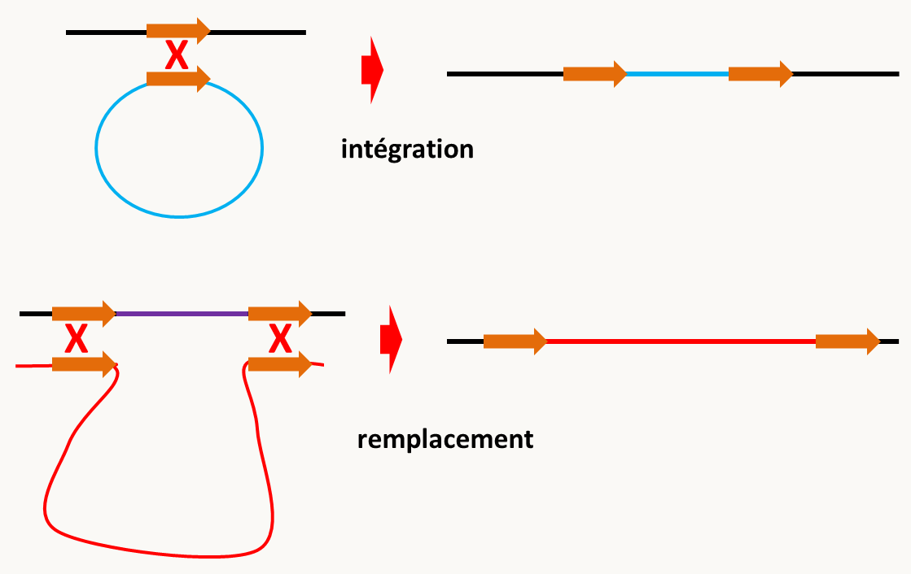

- ####  La recombinaison non-homologue

  La présence d'extrémités d'ADN, telles que celle présentes après une cassure active d'autres systèmes de recombinaison qui n'ont pas besoin d'homologie de séquences. Chez les eucaryotes, le système principal est basé sur les protéines ku70 et ku80 faisant partie du système NHEJ pour **Non-Homologous End-Joining**, en français le système de **jonction d'extrémités non homologues**  (figure 81). Celui-ci va religuer entre elles des extrémités d'ADN libres indépendamment de la présence d'homologie de séquence.

  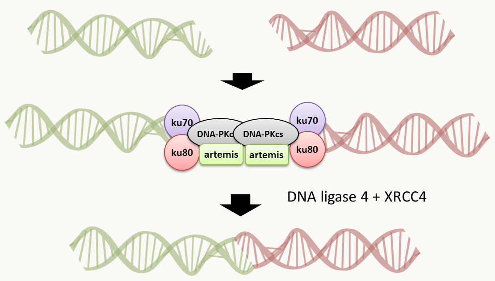

  Il va donc conduire à l'intégration aléatoire dans le génome de l'ADN exogène à un site de coupure aléatoire. Notez que fréquemment, l'ADN intégré a subit des remaniements (délétion, concaténation...) avant son intégration. On dit qu'il s'intègre alors de manière **ectopique**, en opposition aux intégrations homologues. De fait, lors de transformations, il y a une compétition entre les systèmes de recombinaison homologue et non-homologue. Les proportions respectives entre les deux est une caractéristique propre à chaque espèce qui fluctue en fonction de la taille de la région d'homologie et de la nature de l'ADN utilisé comme le montre la table suivante:

  |                             | % d'intégration homologue                                    |
  | --------------------------- | ------------------------------------------------------------ |
  | *Chlamydomonas reinhardtii* | 1‰ à 2.5%                                                    |
  | *Physcomitrella patens*     | >50% dès que la région d'homologie > 1 kb                    |
  | *Arabidopsis thaliana*      | 0% (situation de toutes les plantes "supérieures")           |
  | *Dictyostelium discoideum*  | ~1%                                                          |
  | *Saccharomyces cerevisiae*  | >90% dès que la région d'homologie >50 bp                    |
  | *Podospora anserina*        | 1-10% si taille de la région d'homologie < 10 kb et 30% si taille > 20 kb |
  | *Neurospora crassa*         | 1-20% en fonction de la taille                               |
  | *Alternaria alternata*      | 30-80% molécules circulaires - 100% molécules linéaires      |
  | *Caenorhabditis elegans*    | 1‰-1%                                                        |
  | *Drosophila melanogaster*   | <1‰                                                          |
  | *Danio rerio*               | 10-50%                                                       |
  | *Mus musculus*              | <1%                                                          |

  Dans le cas où le pourcentage de recombinaison homologue est faible, les généticiens utilisent maintenant des souches receveuses dans lesquels les gènes codant les sous-unités ku70 ou ku80 ont été inactivés. Dans de tels souches, la fréquence de recombinaison homologue dépasse le plus souvent 90% voire 99%.

- #### La recombinaison "site-spécifique"

  La recombinaison site-spécifique, comme son nom l'indique, se fait entre deux séquences spécifiques, souvent identiques. Elle nécessite un couple d'acteur comprenant une recombinase et un site de reconnaissance sur l’ADN au niveau duquel elle coupe. Ce type de système a souvent évolué dans des systèmes viraux ou épisomiques pour catalyser l'intégration de l'ADN infectieux dans le génome, ce qui au cours de l'évolution permet leur maintien fidèle au cours des générations. Il en existe plusieurs exemples dont certains sont mis à profit en génétique moléculaire pour faire de la recombinaison dirigée, comme le système de  l'intégrase Int/xis et les sites attB/attP pour l’insertion du phage λ dans le chromosome d'*Escherichia coli*, et surtout la recombinase Cre et son site de reconnaissance site loxP qui dérivent du phage P1 (**système CRE/LOX**) et la "flipase" FLP du plasmide 2µ de *Saccharomyces cerevisiae* et son site FRT (**système FLP/FRT**). La taille des sites de reconnaissance est en général variable mesurant de quelques paires de bases à quelques dizaines de paires de bases; notez que que les sites FRT et loxP mesurent la même taille de 34 pb et ont la même structure car ils sont constitués  de deux régions palindromiques de 13 bp séparée par un espace de 8 pb ou spacer (figure 82). Deux sites FRT sont en positions inversées sur le plasmide 2µ. La recombinaison permet donc d'inverser une région du plasmide (figure 82). Dans le cas de loxP, la recombinaison permet d'intégrer inefficacement P1 dans le chromosome d'*Escherichia coli* à un site variant appelé loxB (figure 82). Par contre, la recombinaison entre deux sites loxP est très efficace.

  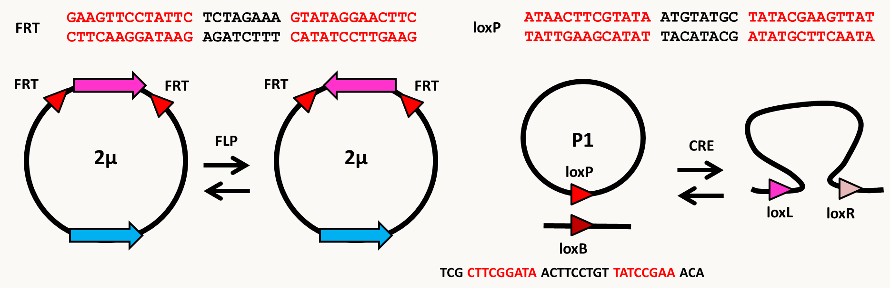

  Ces systèmes de recombinaison sites-spécifiques ont permis la mise au point d'outils génétiques très intéressants. Notez que CRE/LOX est très utilisé dans la souris alors que FLP/FRT l'est dans la drosophile. Nous reviendrons sur leur utilisation lorsque nous aurons vu quelques méthodes pour modifier les gènes, ce qui est le but de la section suivante.

Dans la section suivante nous allons en particulier voir qu'actuellement, il est possible de modifier à volonté le génome grâce au système **CRISPR/CAS9**. Cependant, d'autres techniques plus anciennes sont toujours utilisées pour modifier les gènes. Nous en verrons seulement quelques-unes d'entre elles. Pour rappel, la démarche est la suivante:

- création d'un système qui permet d'obtenir une modification du gène ou de son expression *in vitro*, sous forme d'un fragment d'ADN appelé une cassette

- introduction de la cassette dans la cellule par transformation

- criblage des transformants et vérification de la fonctionnalité de l'ADN mutant introduit, car la transformation génétique est en général un phénomène rare (voir section ci-dessus sur la transformation) et l'ADN introduit dans la cellule peut avoir un devenir complexe (voir section ci-dessus sur la recombinaison)

La première étape relève de votre cours de biologie moléculaire et je n'insisterai pas sur les moyens d'obtenir les cassettes. J'insisterai donc plus sur les stratégies à utiliser et leurs limites.

### Comment inactiver un gène

Actuellement, il existe de nombreuses techniques pour inactiver des gènes et ainsi obtenir des allèles nuls. La technologie utilisée dépend de l'organisme et de ses propriétés biologiques. La première méthode mise au point consistait à transformer la cellule avec une molécule d'ADN circulaire portant un petit morceau du gène à inactiver pour obtenir ce que l'on appelle une disruption (figure 83). Cependant, ce type de mutation peut dans certains cas ne pas être nul car un petit morceau de la protéine est fabriquée. Il est donc conseillé de faire plutôt un remplacement de gène (figure 83) ce qui implique la transformation avec un fragment d'ADN linéaire et deux crossing-over. Dans les deux cas, il faut sélectionner les transformants, ce qui est fait le plus souvent grâce aux deux systèmes de sélection présentés ci-dessus et qui sont pour rappel:

- la présence dans l'ADN à transformer d'un marqueur de résistance à une substance toxique et l'utilisation comme réceptrice d'une souche sensible à cette substance. Les transformants sont sélectionnés sur leur résistance.
- la présence dans l'ADN d'un gène impliqué dans la biosynthèse d'un métabolite et l'utilisation comme réceptrice d'une souche auxotrophe mutée pour ce gène. Les transformants sont sélectionnés sur leur retour à la prototrophie.

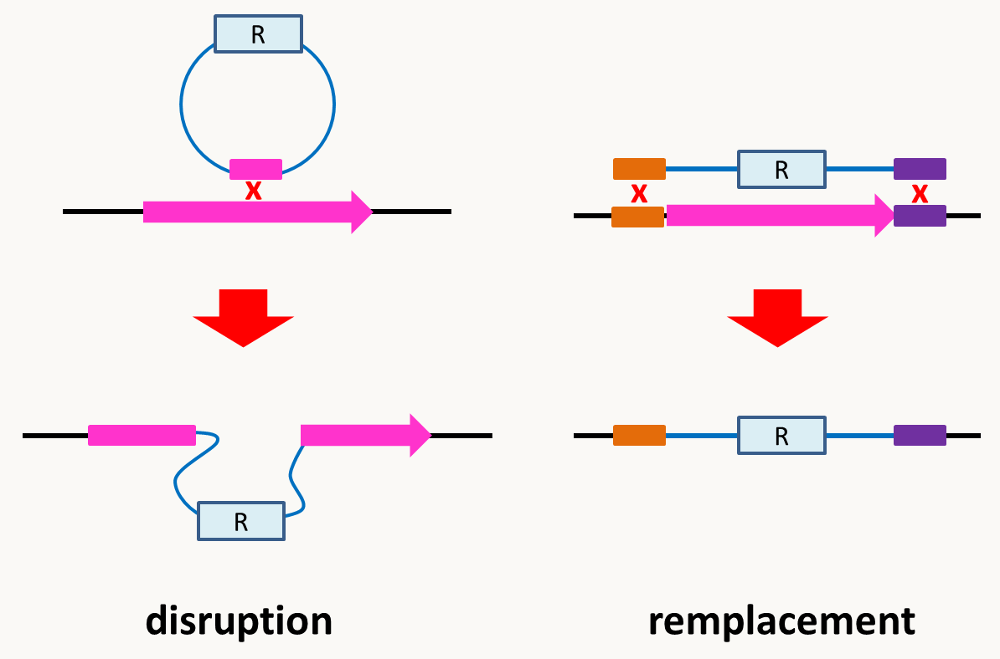

Ce système est largement utilisé chez les champignons (levures et filamenteux; figure 84), *Chlamydomonas* ou même la souris chez qui l'inactivation de gènes prend plus d'étapes du fait qu'il faut transformer des cellules en culture et ensuite les réintroduire dans des embryons afin d'obtenir des souris mutantes (figure 85).

![remplacement de gènes chez Saccharomyces cerevisiae en utilisant le marqueur d'auxotrophie à l'uracile URA3. Il est possible de faire le remplacement directement sur une souche haploïde mais si le gène est essentiel, aucun mutant ne sera obtenu. Il est donc conseillé comme sur le schéma de transformer avec la cassette de remplacement une souche diploïde. Dans ce cas, une seule des deux copies est remplacée car le remplacement simultané des deux copies est extrêmement rare. Les transformants sont sélectionnés sur leur retour à la prototrophie alors que la souche de départ est auxotrophe pour l'uracile. L'efficacité du remplacement est telle que seule une vérification par PCR est nécessaire pour s'assurer que le remplacement a bien été fait. Pour ceci, il faut utiliser des amorces situées à l'extérieur de la région d'homologie utilisée pour faire le remplacement (amorces 1 et 2). Seuls les transformants ayant un remplacement correct donneront des bandes de tailles connues en utilisant les couples d'amorces 1+3 et 2+4. Une méiose permet d'obtenir des tétrades. Si les 4 ascospores sont viables alors le gène n'est pas essentiel. Si seulement les deux spores URA3- sont viables alors le gène est essentiel. Chez les champignons filamenteux, il est recommandé de vérifier la délétion par Southern blot car il existe des évènements d'insertion complexes ou l'allèle remplacé et l'allèle sauvage sont tous les deux présents. De même, la plupart étant essentiellement haploïdes, l'obtention de remplacement de gènes essentiels est plus difficile mais pas impossible.](img/image084.png)

![remplacement de gènes chez la souris. Dans le cas d'organismes pluricellulaires, il faut transformer la lignée germinale, ce qui n'est pas simple même si des systèmes à base de virus peuvent être envisagés. Dans le cas de la souris, le plus simple est de faire le remplacement de gènes sur des cellules totipotentes en utilisant la résistance à la généticine (=G418). Comme dans le cas de la levure, une seule des deux copies est remplacée. La vérification d'abord par PCR comme chez la levure permet de trier les candidats. Il est recommander de vérifier ces candidats par Southern Blot car il existe des évènements d'intégration complexes que seul une analyse plus poussée permet de cribler. Une fois le remplacement assuré, la lignée totipotente mutante est injectée dans des embryons de souris; il est recommandé de choisir des souris de phénotypes différents pour faciliter la détection des souriceaux chimère ou mosaïques qui vont résulter de l'intégration des cellules injectées dans l'embryon; des souris ayant des différences de couleur de pelage offrent une façon simple de trier. Il faut aussi espérer que la lignée germinale des souris mosaïques F0 contient des cellules mutantes afin que leur descendance F1 contienne la mutation; sa présence peut être détectée par PCR comme indiqué figure 84. La descendance F1 sera hétérozygote et devrait donc vivre. Le croisement des descendants hétérozygotes entre eux permet d'obtenir les homozygotes afin d'évaluer leur phénotype. La présence du remplacement et de l'allèle sauvage par PCR permet de déterminer le statut des descendants F2 car ceux-ci peuvent toujours être hétérozygotes ou homozygotes sauvages.](img/image085.png)

Ces méthodes de remplacement de gènes sont maintenant bien maîtrisées chez de nombreux organismes eucaryotes, en particulier chez *Saccharomyces cerevisiae*, chez qui les collections des délétions de tous les gènes ont été générées de cette manière en utilisant le marqueur de résistance à la kanamycine A. Je reviendrai sur ces collections dans la section sur la mutagenèse classique car elles peuvent être utilisées pour sélectionner des mutants facilement. De même une collection de délétion de la majorité des gènes de *Neurospora crassa* est aussi disponible. Chez la souris, il existe des compagnies de biotechnologie qui font le travail pour vous... Dans le cas des bactéries, la stratégie est légèrement différentes (figure 86).

En effet, chez beaucoup de bactéries, les délétions passent par l'utilisation de **plasmides "suicide"**, c'est à dire incapable de se répliquer, ce qui va forcer leur intégration dans le génome. Il existe plusieurs stratégies pour ce faire. On peut par exemple construire la cassette de délétion (une délétion interne du gène "rose" dans la figure 86) dans un plasmide qui se réplique chez *Escherichia coli* mais qui ne se réplique pas chez la bactérie pour laquelle on souhaite déléter le gène (*Bacillus subtilis* dans la figure 86). De manière alternative il existe des origines de réplication thermosensibles. Il suffit donc de passer les bactéries à température non permissive et de sélectionner le maintien du plasmide en incorporant l'antibiotique que le marqueur de résistance R sert à détoxiquer. Un évènement de recombinaison homologue permet d'obtenir l'intégration au gène et une structure où les copies délétées et intactes entourent le plasmide. Celui-ci porte un deuxième gène qui va permettre une **"contre sélection"** de l'intégration, ici le gène sacB qui permet la production d'une substance toxique en présence de saccharose chez *Bacillus subtilis*. Cela va permettre de sélectionner des évènements de recombinaison entre les copies intactes et délétées qui vont conduire à l'élimination le gène sacB. En fonction des sites du crossing-over (indiqués dans la figure par les extrémités des accolades), il y a le maintien de la copie sauvage ou le remplacement par la copie mutée. Il existe des collections de mutants pour tous les gènes non essentiels chez de nombreuses bactéries dont *Escherichia coli*, *Bacillus subtilis* ou encore  *Acinetobacter baylyi*.

Enfin, il est possible de raffiner ces méthodes (figure 87), en particulier chez la souris chez qui il est possible de fabriquer des souches où le gène à déléter est entouré de sites loxP. L'action de la recombinase CRE est alors contrôlée spécifiquement dans un tissu grâce à un promoteur spécifique ou par l'ajout d'une molécule provoquant la délétion seulement dans un tissu ou au moment voulu.

![remplacement contrôlé de gènes chez la souris. L'utilisation du système CRE/LOX permet de choisir le lieu et/ou le moment de la délétion. Pour cela, il faut construire des souris portant deux sites loxP autour du gène à déléter. Cela nécessite deux transformations successives avec des cassettes permettant l'insertion des sites loxP en même temps que les marqueurs de sélection qui sont la résistance à la néomycine et à la puromycine. L'apport de la recombinase CRE se fait en croisant des souris obtenues aussi par transgénèse et qui exprime la recombinase soit à partir d'un promoteur fonctionnel dans un lignage cellulaire ou en réponse à un inducteur (la tétracycline par exemple), ce qui va provoquer la recombinaison entre les sites loxP (et donc la délétion du gène) de manière contrôlée.](img/image087.png)

Néanmoins, malgré la popularité de ces méthodes, il existe des organismes chez lesquels la recombinaison homologue est trop rare pour que la sélection de mutants soit possible (voir le tableau ci-dessus). Chez ces organismes des méthodes alternatives ont été développées. Elles utilisent soit des phénomènes d'interférences à ARN (RNAi), soit le système CRISPR/CAS9.

Par exemple, chez *Caenorhabditis elegans*, la recombinaison homologue est très rare. Mais comme chez une vaste majorité d'eucaryotes (des phénomènes identiques ont été observés chez les vertébrés, les plantes, certains champignons, et des protistes divers), il a été observé que l'injection d'ARN doubles brins correspondant à un gène aboutit à l'extinction de l'expression de ce gène (voir la section sur l'épigénétique dans le chapitre 1). Ce phénomène est systémique chez le ver, c'est à dire que l'injection dans quelques cellules permet l'extinction du gène dans l'ensemble des cellules (sauf les cellules neuronales qui semblent isolées des autres cellules). Cette extinction peut même se transmettre sur une ou deux générations. Encore plus intéressant, il a été montré que nourrir les vers avec des bactéries produisant les ARN doubles brins, entraîne l'extinction du gène correspondant dans les cellules non-neuronales de *Caenorhabditis elegans*!  L'alimentation en continu des vers avec les bactéries porteuses de l'ARN double brin permet de maintenir au cours des générations l'extinction du gène correspondant. Les bactéries servant de nourriture aux vers ont été modifiées de façon à ce qu'elles produisent beaucoup d'ARN double brin et des systèmes ingénieux ont permis de constituer des collections de bactéries portant des ARN double brin pour tous les gènes du ver (une bactérie ne portant bien évidemment qu'un seul ARN double brin). Comme dans le cas de la collection de délétion des gènes chez *Saccharomyces cerevisiae* ou les bactéries, ces collections de bactéries permettent de mettre au point des cribles pour sélectionner des mutants. Le même type d'extinction par RNAi utilisant des bactéries porteuses d'ARN double brin est utilisé par exemple chez la paramécie. Dans le cas d'autres organismes récalcitrants, des cassettes permettant l'expression des ARN double brin sont intégrées au génome en utilisant la recombinaison non-homologue.

L'arrivée de la technologie CRISPR/CAS9 a révolutionné l'obtention de mutants nuls pour les organismes chez qui les mutations sont difficiles à obtenir, ce qui inclut les plantes supérieures chez qui la recombinaison homologue est nulle, mais aussi la drosophile et la plupart des animaux pour lesquels l'obtention de mutant est, bien que faisable, compliquée. Elle facilite aussi l'obtention de mutants aussi chez des champignons, des algues, des protistes parasites ou libres, etc. Je reviendrai sur cette méthode dans la section sur la modification d'un seul nucléotide car CRISPR/CAS9 permet ce genre de modifications.

### Comment sur-exprimer un gène

La surexpression d'un gène permet aussi d'avoir des informations sur son rôle. En effet, en général la surexpression provoque un phénotype opposé à l'inactivation (attention, il y a des cas où cela n'est pas le cas et la sur-expression peut par exemple entraîner le même phénotype que la délétion...). On connaît deux stratégies pour sur-exprimer un gène.

-  Il est possible d'introduire par transformation plusieurs copies du gène. La méthode la plus sure est de le mettre sur un plasmide **multicopie** mais ceci n'est possible que chez le nombre limité d'organismes où l'on dispose d'un tel outil  comme les bactéries ou les levures *Saccharomyces cerevisiae* et *Schizosaccharomyces pombe*. Une seconde seconde méthode consiste à transformer les cellules avec des quantités importantes d'ADN. Chez certains organismes comme *Caenorhabditis elegans*, cela aboutit à l'intégration en tandem de plusieurs copies de cet ADN permettant ainsi en théorie la sur-expression. Je vous rappelle cependant qu'il n'y a pas toujours de relation entre le nombre de copie et l'expression à cause de processus de régulation et qu'en particulier chez certains organismes, on constate une inactivation des gènes en plusieurs exemplaires par méthylation ou PTGS (voir la section sur l'épigénétique dans le chapitre 1).

- s'il s'agit d'un gène codant pour une protéine, il est possible de cloner la séquence codante du gène dans une cassette d'expression forte. Cette cassette est constituée d'un fragment d'ADN comprenant un promoteur fort (provenant d'un gène dont le produit intervient dans la glycolyse comme gpd, gène d'actine ou du facteur d'élongation de la traduction eEF1A) et d'un fragment d'ADN provenant d'une région terminateur d'un gène (figure 88). Notez que la plupart des promoteurs utilisés sont non-seulement forts mais aussi constitutifs, c'est à dire qu'ils vont s'exprimer tout le temps. Le gène sera donc non seulement fortement exprimé mais aussi dérégulé.

  

Pour ce genre d'expérience, il n'est évidemment pas nécessaire d'inactiver le(s) gène(s) déjà présents. Pour s'assurer de la sur-expression du produit, il faut regarder le niveau d'expression de la protéine dans des extraits de protéines totales (il est par exemple possible de révéler dans certains cas par un traitement immunologique).

Ce type d'expérience permet d'apporter des éléments sur la fonctionnalité de protéines. Par exemple, chez *Caenorhabditis elegans*, il existe deux types de vers qui ont un comportement soit solitaire, soit grégaire. La différence est liée à la présence dans les populations d'un gène polymorphe présentant deux allèles. Ce gène *npr-1* code pour un produit qui ressemble à un récepteur de neuropeptides. L'allèle solitaire est dominant sur l'allèle grégaire. L'analyse moléculaire des deux allèles montre qu'ils sont tous les deux fonctionnels. L'hypothèse faite est donc que le produit de l'allèle grégaire fonctionne moins bien que celui de l'allèle solitaire. Pour tester ceci, des œufs de la souche grégaire ont été injectés par différentes quantités d'ADN contenant les allèles grégaires ou solitaires. Alors qu'avec l'allèle solitaire toutes les quantités testées donnent des souches transformées avec un comportement solitaire, dans le cas de l'allèle grégaire les seules les souches issues du traitement avec la quantité la plus importante ont un comportement solitaire. Cela montre qu'effectivement l'allèle grégaire code probablement pour une protéine moins fonctionnelle que celle codée par l'allèle solitaire.

### Comment modifier un seul nucléotide dans un gène

Pour analyser finement le rôle d'une protéine ou d'un ARN, il est souvent nécessaire de modifier un seul acide aminé ou nucléotide. Cela peut se faire soit en réintroduisant un allèle modifié comme voulu dans une souche délétée pour l'allèle sauvage du gène. Une autre possibilité rendue maintenant simple grâce au système CRISPR/CAS9 est de modifier *in situ* de manière dirigée le nucléotide (figure 89).

![modification de gènes utilisant le système CRISPR/CAS9. Le système CRISPR/CAS9 dérive d'un mécanisme de défense bactérien vis à vis des bactériophages. Il aboutit à la coupure double brin d'un ADN de séquence spécifique via l'hybridation avec un ARN guide et un assemblage avec la nucléase CAS9. La longueur de la séquence qui s'hybride est de 20 nucléotides, ce qui est en général suffisant pour que l'ARN guide ne s'hybride qu'avec une seule séquence dans le génome, même si celui-ci est complexe comme le génome humain. Néanmoins, la reconnaissance des 7 premiers nucléotides étant moins importante, il est donc possible d'avoir des coupures indésirables. La seule contrainte pour la coupure est la présence après la séquence d'hybridation d'un dinucléotide GG espacé par un nucléotide de la région d'hybridation (séquence PAM pour Protospacer Adjacent Motif: NGG) si la protéine CAS9 provient de Streptococcus pyogenes. Notez que cette séquence PAM est différente entre les différentes endonucléase CAS9 et il est donc possible de couper à différents endroits en utilisant différentes CAS9. Notez qu'il existe des programmes qui permettent de choisir le site de coupure idéal. Une fois la cassure double brin exécutée par la protéine CAS9 au niveau du 16ème nucléotide hybridé, elle est réparé par la machinerie cellulaire, soit via le système de réparation des cassures double brin, soit via le système de non-homologous end joining. Si aucune matrice n'est fournie (cas n°1), la réparation à l'identique entraîne une nouvelle coupure et ce jusqu'à ce qu'une mutation (en bleu) au site de coupure empêchant l'hybridation se produise. Cela aboutit donc à la création de mutations ponctuelles (faux-sens, non-sens ou frameshift) au site de coupure. Si une cassette de délétion est fournie comme matrice pour exécuter la réparation, ceci peut aboutir au remplacement du gène par le marqueur de résistance (cas n°2), enfin une matrice portant une mutation désirée (en rouge) peut être fournie (cas n°3); dans ce cas la réparation peut aboutir à un changement précis de nucléotide ou par exemple à une délétion propre entre les codons start et stop d'un gène.](img/image089.png)

Le système CRISPR/CAS9 est maintenant bien maîtrisé chez de nombreux organismes. Dans certains cas, la nucléase CAS9 et l'ARN guide sont exprimés via des transgènes, comme par exemple chez certains champignons. Dans ce cas, la nucléase CAS9 peut être contrôlé via un promoteur qui permet de réguler le timing et/ou le lieu de création des mutations, comme avec les systèmes CRE/LOX ou FLP/FRT. Il est aussi possible d'introduire dans les cellules par électroporation directement le complexe CAS9/ARN guide produit *in vitro* (des compagnies fournissent directement ce type de produits). Les généticiens travaillant sur les plantes et les animaux préfèrent généralement cette deuxième possibilité. De même, le système CRISPR/CAS9 peut permettre la construction de multiples mutants en une seule étape, soit en exprimant plusieurs ARN guides, soit en ciblant une région de séquences identiques dans plusieurs gènes (ce qui peut être le cas par exemple de gènes appartenant à des familles multigéniques).

Malgré tout, il existe d'autres stratégies qui permettent d'introduire à volonté des mutations dans un génome. Chez les bactéries, le système basé sur un plasmide suicide décrit figure 86 permet ce type de modification du génome. Chez les champignons, une méthode alternative consiste à co-transformer deux ADN: un fragment linéaire portant la mutation désiré et un plasmide circulaire portant un marqueur de sélection et une séquence permettant son intégration à un autre endroit du génome de préférence sur un autre chromosome (figure 90). Les transformants sont sélectionnés grâce au marqueur présent sur le plasmide. On constate expérimentalement qu'une large fraction des transformant a non seulement intégré le plasmide via un crossing-over, mais a aussi intégré l'autre molécule via deux crossing-over (généralement dans 5-10% des transformants). Il suffit ensuite de sélectionner moléculairement (par PCR et/ou séquençage) quels transformants ont eu les deux modifications. Il est aussi possible de se débarrasser du plasmide intégré en croisant un "bon" transformant  avec la souche sauvage: dans la descendance, 25% des individus porteront seulement la mutation désirée (si le plasmide s'intègre évidemment à un site indépendant génétiquement de l'allèle construit).

En résumé, il est maintenant possible de construire assez facilement chez pratiquement tous les organismes des allèles nuls par remplacement ou délétions propres, de sur-exprimer ou déréguler des gènes et même d'en changer un seul nucléotide. Ces technologies sont évidemment mises à profit par les chercheurs pour comprendre le vivant, mais aussi par les industriels et les agronomes pour améliorer ou modifier les propriétés des organismes: il s'agit des technologies qui permettent la production des **organismes génétiquement modifiés ou OGM**. Dans le contexte médical, ces mêmes technologies vont être connues sous le terme de **thérapie génique** et dans ce cas, il s'agit souvent de réparer un gène déficient. Notez que les nouvelles technologies basées sur CRISPR/CAS9 permettent de produire facilement des souches OGM où un seul nucléotide est changé et où il n'y a donc plus de marqueur de résistance (qui est une des critiques souvent formulées à leur encontre). Fondamentalement, elles ne sont donc pas différentes de souches obtenues par mutagenèse classique qui socialement semble poser moins de problème d'acceptation. Néanmoins, contrairement à la mutagenèse classique qui mime ce qu'il se passe dans la nature: mutations aléatoires suivies de sélection (ici exercée par le généticien, l'industriel ou l'agronome), la mutagenèse inverse permet d'obtenir des mutations de manière dirigée, ce qui n'est pas sans rappeler le lamarckisme...

## La mutagenèse classique

La mutagenèse classique permet produire toute une palette de mutations ayant des effets divers sur les gènes allant de leur inactivation jusqu'à leur dérégulation en passant par des modifications du fonctionnement des protéines qu'ils codent. Elle se passe en deux étapes principales:

- l'application du traitement mutagène
- la sélection des mutants

### L'application du traitement mutagène

Même si celui-ci n'est pas obligatoire, le faible taux des mutations spontanées entraîne dans la grande majorité des cas, l'utilisation d'un traitement mutagène. Ce traitement va dicter en fonction de sa spécificité le type de mutations qui vont être obtenues; je vous renvoie aux sections sur les modalités et fréquences d'apparition des mutations dans le chapitre 1 pour en savoir plus. De même, le traitement mutagène va moduler le type de clonage, c'est à dire d'identification du/des gène(s) mutés, qui pourra être effectué par la suite. Actuellement, trois grands types de mutagènes sont utilisés:

- **La mutagenèse classique aux UV ou avec des produits chimiques mutagènes.**

  D'un point de vue de la sécurité, les UV sont préférables en particulier depuis que du matériel facile d'utilisation et parfaitement sécurisé est disponible. Cependant, le spectre des mutations obtenues avec les UV ne permet pas toujours d'obtenir ce que l'on désire. De même, certains organismes sont très résistants aux traitements avec des UV. Les mutagènes chimiques sont alors utilisés. Il existe alors des conditions draconiennes d'utilisation de ces produits qui se fait dans des pièces sécurisées. Pour que ce type de traitement soit efficace, il faut que de nombreuses mutations soient produites. Les mutations apparaissant au hasard dans le génome, beaucoup d'entre elles vont toucher des gènes essentiels et donc après le traitement le taux de survie va être fortement diminué. En pratique, il faut donc partir d'un effectif suffisamment grand pour tenir compte de cette létalité. Réciproquement, le taux de survie est une indication de l'efficacité du traitement mutagène. Classiquement, un taux de survie de 1 à 5% est indicatif que le traitement a bien fonctionné et que de nombreuses mutations ont été produites. Les mutations obtenues avec ce type de traitement sont le plus souvent ponctuelles  mais il est aussi possible d'obtenir avec certains produits des délétions. Elles peuvent inactiver des gènes, modifier leur fonctionnement voir augmenter leur fonctionnement. Ce type de mutagenèse permet donc d'obtenir des mutations qui ont un large éventail d'effets. Par contre leur identification moléculaire est plus complexe que les deux autres types de mutagenèse. Nous verrons un exemple de chacune des trois méthodes possibles d'identification de ces mutations dans une section suivante qui sera dédié à ce problème.

- **La mutagenèse insertionnelle par transformation (& le REMI) ou par transposition.**

  La mutagenèse insertionnelle par transformation se base sur les propriétés de l'intégration de l'ADN exogène introduit dans des cellules. Il est bien évident que ces évènements d'intégration sont sélectionnés grâce à la présence sur l'ADN introduit d'un marqueur de sélection (gène de résistance à un antibiotique, marqueur d'auxotrophie ...). Chez la majorité des organismes, l'ADN transformé recombine via le système de non-homologous end joining (voir tableau ci-dessus), c'est à dire ne faisant pas appel à la présence de séquences homologues. Ces morceaux d'ADN en s'insérant vont inactiver ou modifier l'expression de gènes. Le plus souvent le processus d'intégration est complexe et modifie profondément la structure de l'ADN qui s'insère (insertion de plusieurs copies du fragment d'ADN) et celle de l'ADN situé au point de jonction (délétion ou duplication de la séquence d'insertion). Des chercheurs ont constaté chez certains organismes que si l'ADN est préalablement linéarisé par un enzyme de restriction et que l'enzyme de restriction est aussi ajouté dans le mélange de transformation, alors l'intégration se produit proprement (une seule copie de l'ADN est intégrée et l'insertion se fait sans délétion ou duplication à une séquence qui correspond à un site de restriction de l'enzyme utilisé (figure 91).  Ce type de mutagenèse est appelée REMI pour Restriction Enzyme Mediated Insertional mutagenesis.

  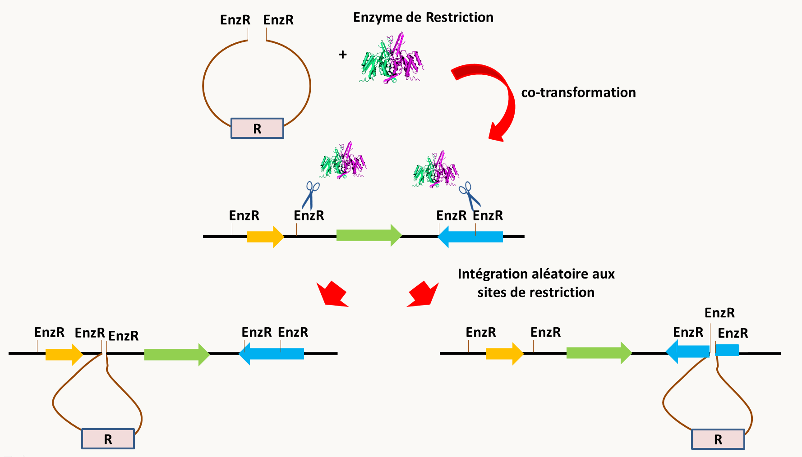

  L'inactivation par insertion peut aussi se faire en utilisant des transposons. Chez les champignons, le système est basé sur les propriétés du gène codant la réductase du nitrate (figure 92).

  ![la mutagenèse insertionnelle par transposition chez les champignons. La souche de départ contient un transposon modifié contenant un marqueur de résistance bactérien et une origine de réplication fonctionnelle chez Escherichia coli. Il est inséré entre le promoteur et la séquence codante du gène nia codant pour la réductase des nitrates. Elle contient aussi la transposase sous le contrôle d'un promoteur modulable. Du fait de l'insertion du transposons, le gène nia n'est pas exprimé; la souche est donc incapable d'utiliser le nitrate comme source d'azote (elle est aussi résistante au chlorate ce qui a permis de sélectionner l'insertion du transposon dans le gène nia). L'expression de la transposase est induite via le promoteur modulable. Elle permet l'excision du transposon, ce qui est facilement sélectionnable en recherchant les souches capable d'utiliser le nitrate comme source d'azote. Dans une large fraction de ces souches excisées, le transposon s'est réinséré au hasard dans le génome. L'identification de la région dans laquelle le transposons s'est réinséré est facile grâce au marqueur de résistance bactérien et à l'origine de réplication (voir figure 84).](img/image092.png)

  C'est néanmoins chez *Drosophila melanogaster* que le système a été perfectionné en utilisant l'élément P (figure 93). Nous avons vu que ce transposon à ADN de type II est nouvellement arrivée chez cette mouche (voir section sur les fréquences d'apparition des mutations du chapitre 1). Il est capable de transposer d'un vecteur plasmidique dans l'ADN chromosomique des noyaux des cellules germinales. Ses propriétés en font un vecteur de choix pour introduire de l'ADN dans la drosophile et pour faire des mutants car il transpose à haute fréquence, dans des conditions bien contrôlables, il n'a besoin pour cela que de la transposase spécifique codée par l’élément P lui-même et des quelques dizaines de nucléotides présents à ses deux extrémités, les séquences ITR qu’on appelle les " pieds " de P.

  ![la transformation et la mutagenèse par transposition de l'élément P chez la drosophile. Deux plasmides différents sont co-injectés dans des œufs de drosophile 1h à 1h30 après la ponte, à l’aide d’un micromanipulateur. Un porte un transposon modifié, l’autre la source de transposase produite via un promoteur fort. A cet âge les embryons sont sous forme de syncytium. Le transposon modifié porte au minimum un site de clonage et un marqueur de transgénèse (ici le gène white, la souche réceptrice étant alors mutante white avec des yeux blancs et de type M, c'est à dire dépourvue de l'élément P), placés entre les pieds de l'élément P. Le plasmide portant le gène de la transposase pénètre dans les noyaux, y est transcrit et ensuite l'ARNm produit est traduit dans le cytoplasme syncytial de l’embryon. La transposase entre dans les noyaux des cellules souches à l'origine de la lignée germinale en même temps que le plasmide contenant le transgène; elle catalyse à la fois la coupure du plasmide vecteur contenant le transgène au niveau des "pieds de P" et de l'ADN chromosomique au hasard, et y insère le transgène. Le transfert de gènes est accompli avec une efficacité raisonnable qui fait que l'inspection visuelle des mouches provenant des oeufs injectés est suffisante pour obtenir des embryons avec des yeux rouges dans lesquels le transposon s'est inséré avec succès. Le transposons transféré est alors stable et se transmet fidèlement aux générations suivantes. La transposase fortement exprimée peut aussi être intégrée de la même manière dans le génome. Elle va alors provoquer la transposition de l'élément P à d'autres endroits du génome et donc faire le traitement mutagène. Il ne faut pas oublier que la drosophile est diplobiontique et que pour obtenir les mutations à l'état homozygote, il faudra faire deux séries de croisements. Au cours de ces croisements, il est simple d'identifier les descendants dépourvus de transposase afin que les insertions des transposons soient stables.  Le transposon a été modifié pour faciliter son utilisation. Par exemple, on peut ajouter des séquences plasmidiques (ori et marqueur de résistance) qui permettront le clonage ultérieur des séquences génomiques flanquantes (figure 94). On peut aussi ajouter des promoteurs forts ou un enhancer qui va déréguler les gènes environnants. L'ajout de la séquence codante de la GFP permet de voir l'expression des gènes au point d'insertion, etc.](img/image093.png)

  Les mutagenèses insertionnelles génèrent donc comme leur nom l'indique des mutants d'insertion qui, le plus souvent, sont des allèles nuls ou ayant une expression modifiée. Le spectre est donc plus réduit que les traitements mutagènes classiques aux UV ou produits chimiques. Mais des méthodes simples permettent d'identifier rapidement les gènes dans lesquelles les insertions se sont produites (la figure 94 en donne deux exemples).

  ![deux méthodes pour identifier les sites d'insertion. En haut, si la séquence insérée contient un marqueur bactérien de résistance à un antibiotique et une origine de réplication (voir figure 92 et 93), il suffit de couper l'ADN génomique de la souche d'intérêt porteuse de l'insertion avec un enzyme de restriction qui ne coupe pas dans l'ADN inséré et de religuer les ADN. Le mélange est ensuite transformé dans Escherichia coli. Seul le plasmide porteur de l'origine de réplication va pouvoir se propager dans E. coli. Il rendra les bactéries résistantes à l'antibiotique et pourra facilement être purifié et séquencé. En bas, si les régions permettant un clonage dans E. coli ne sont pas présentes, il suffit de faire une "PCR inverse". Pour ceci, il faut couper l'ADN de la souche porteuse de l'insertion par un enzyme de restriction et recirculariser l'ADN avec une ligase. Une amplification par PCR avec des amorces judicieusement placées permet d'amplifier un fragment d'ADN contenant la jonction.](img/image094.png)

- **Le criblage de banques de mutants**

  La disponibilité de collections extensives de mutants générés par mutagenèse inverse permet d'envisager leur criblage direct. Pour rappel, de telles banques sont disponibles chez plusieurs bactéries (banques obtenues par plasmide suicide chez *Escherichia coli*, *Bacillus subtilis*...), *Caenorhabditis elegans* (banque RNAi), *Neurospora crassa* et bien évidemment chez *Saccharomyces cerevisiae* chez qui elles ont été obtenues en premier. La méthodologie la plus brutale consiste à cribler les mutants un par un. Dans le cas des banques bactériennes et de levure, elles se présentent dans des microplaques: des cribles simples peuvent donc être directement appliqués en repiquant les microplaques avec des outils appropriés, ce qui facilite leur mises en place. Bien évidemment, les banques étant référencés, il est facile d'identifier les gènes dont les mutations sont intéressantes.

  Chez *Saccharomyces cerevisiae*, la stratégie a été améliorée afin de permettre des cribles dans des expériences de compétitions. En effet, chaque délétion est identifiée par deux séquences spécifiques: les uptag et downtag. Celles-ci vont permettre de suivre spécifiquement chacune des souches mutantes dans un mélange de toutes les souches (figure 95).

  ![en haut, structure des cassettes de délétion; les uptag et downtag sont des séquences de 20 pb spécifiques à chacune des délétions. Elles permettent donc d'amplifier spécifiquement les jonctions des délétions dans un mélange en utilisant les couples d'amorces rouge ou bleu. Les régions en bleu de part et d'autre des uptag et downtag sont communes à toutes les délétions et permettent d'amplifier les délétions marquées pour le séquençage à haut débit. En bas, en partant d'un mélange où chaque souche mutante est présente en même quantité, l'application d'une sélection va modifier les proportions des différentes souches en fonction du rôle de chacun des gènes délétés. Il est simple de savoir les souches favorisées ou défavorisées en analysant l'ADN du mélange final en comparaison avec celui du mélange initial, soit par hybridation sur micropuces des uptag et downtag, sot par séquençage à haut débit en utilisant les régions communes à toutes les délétions pour amorcer les réactions.](img/image095.png)

  Il va de soi que les seuls types de mutants qui vont pouvoir être obtenus sont ceux initialement présents dans la collection. Il s'agit le plus souvent d'allèle nuls, bien que les collections de "mutants par RNAi" chez *Caenorhabditis elegans* sont plutôt des "**hypomorphes**", c'est à dire des mutants ayant une diminution partielle de l'activité des gènes ciblés par le RNAi car leur expression n'est pas totalement inhibée, quelques ARNm pouvant être traduits avant d'être dégradés.

L'application d'un type ou un autre de traitement mutagène dépend non seulement du spectre de mutations que l'on souhaite mais aussi des organismes auxquels on s'adresse. En effet, Les microbes poussant sur boite de Pétri (bactéries, levures, champignons...) se prêtent bien au traitement mutagène avec les UV. Par contre ceux-ci sont peu pénétrants et ne pourront pas par exemple provoquer des mutations dans les organismes aquatiques (algues et protistes) ou les organismes pluricellulaires qui ont une lignée germinale volumineuse ou protégée (animaux et plantes). Il est donc souhaitable d'utiliser dans ce cas un traitement chimique. Les rayons X sont plus pénétrants mais vont essentiellement causer des défauts chromosomiques (larges délétions, inversions, translocations), qui vont par la suite être difficiles à analyser. Les systèmes de mutagenèses insertionnelles ont longtemps été préférés car l'identification des gènes mutés est facile. Nous verrons que l'avènement des méthodes de séquençage à haut débit renverse actuellement cette tendance.

### La sélection des mutants: les cribles

Le but des expériences de mutagenèse est d'obtenir des mutants qui ont un phénotype voulu afin d'étudier certains processus. Comme ces expériences sont souvent lourdes et peuvent être dangereuses si des produits mutagènes puissants sont utilisés, il est important de minimiser au maximum l'expérimentation. Ceci passe donc par la mise au point de systèmes astucieux permettant de récupérer les mutants d'intérêt. Il faut donc mettre au point ce que l'on appelle un **crible de sélection**.

Ce crible de sélection peut permettre de récupérer directement les mutants d'intérêt. Ce sont des **cribles de sélection dit positifs**. Au contraire les **cribles négatifs** impliquent le test de tous les individus pour trouver ceux qui seront intéressants. Il est évident que ce type de crible est beaucoup plus lourd et consommateur en matériel ! Par exemple, afin d'identifier la cible moléculaire d'un antibiotique, il est possible de rechercher deux types de mutants : des mutants résistants à l'antibiotique ou des mutants encore plus sensibles que les cellules sauvages dits mutants **hypersensibles** (figure 96):

- Pour rechercher les mutants résistants, il existe un crible positif très simple. Il suffit d'étaler les cellules à la sortie du traitement mutagène sur du milieu contenant l'antibiotique. "Tout ce qui pousse" est bon.

- Par contre, dans le cas réciproque où l'on recherche des mutants hypersensibles, il faut impérativement à la sortie du traitement mutagène étaler les cellules sur du milieu sans antibiotique et ensuite repiquer les colonies obtenues sur du milieu avec antibiotique. Les cellules qui poussent sur le premier milieu mais pas sur le suivant sont les bonnes: on a donc affaire à un crible de sélection négatif typique.

  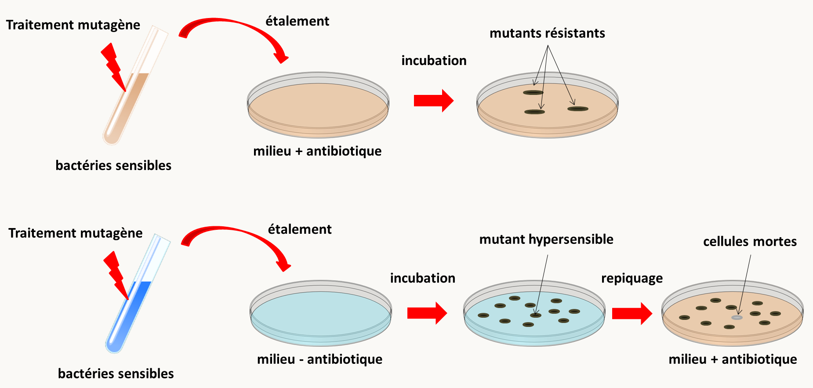

Les cribles de sélection font appel à l'imagination des généticiens. Pour vous familiariser avec les techniques de mutagenèse, nous allons donc en voir trois différents.

- **La sélection de mutations de la chaîne respiratoire chez la levure *Saccharomyces cerevisiae***

La levure *Saccharomyces cerevisiae* est un organisme aérobie facultatif, c'est à dire qu'elle peut fermenter en absence de source de carbone respirable. Sa croissance peut donc se faire par fermentation en absence d'oxygène ou par la fermentation suivie de la respiration en présence d'oxygène. Il est possible de lui fournir des sources d'énergie non fermentable et donc uniquement utilisable par la respiration (glycérol ou lactate). Ce système est donc idéal pour sélectionner des mutants affectant la respiration et ainsi de décortiquer le système respiratoire. La recherche de mutants incapables de respirer se fait en recherchant après traitement mutagène des souches qui pousse sur un milieu fermentable (milieu contenant du glucose) mais qui ne pousse pas sur milieu uniquement respirable (milieu contenant du glycérol ou du lactate). Ce crible est donc un crible négatif. Il conduit à l'isolement de mutants ayant acquis une mutation soit de l'ADN mitochondrial (mutant rho- ou mit-) ou de l'ADN nucléaire (mutant pet-). D'autres cribles permettent d'obtenir des mutants plus spécifiques. Par exemple, c'est en utilisant le crible ci-dessus avec du lactate qu'ont été récupérés des mutants dans le gène codant le cytochrome C (qui est un intermédiaire du transport des électrons dans la chaîne respiratoire). En fait, la levure possède 2 gènes qui codent pour le cytochrome C. L'un assure 95% de la production de cytochrome C (iso1) l'autre 5% (iso2). On s'est aperçu par hasard qu'un mutant déficient dans la production iso1 peut respirer en utilisant du glycérol comme source de carbone mais pas du lactate (il est probable que la respiration du glycérol nécessite moins de cytochrome C que celle du lactate et que les 5% iso2 suffisent pour permettre la respiration). Ceci n'est pas le cas de la majorité des mutants affectés dans la chaîne respiratoire. Il est donc possible de récupérer assez spécifiquement des mutants de l'iso1 en sélectionnant par réplique des souches qui respirent sur glycérol mais pas sur lactate. C'est toujours un crible négatif.
Un autre crible disponible est l'utilisation de benzidine qui colore en bleu foncé les hémoprotéines. La coloration est plus sensible aux variations de la quantité de cytochrome C qu'à celles des autres cytochromes. Pour chercher des mutants déficients en cytochrome C, il suffit donc de rechercher des colonies bleu clair parmi les sauvages qui sont bleu foncé. Il s'agit donc là d'un crible positif.

- **La sélection de drosophiles femelle-stériles**

L'obtention de mutants de drosophile femelle-stériles permet d'identifier des gènes qui interviennent dans la fabrication des ovocytes. Plusieurs gènes sont impliqués. Certains sont localisés sur le chromosome X et d'autres sur les autosomes. Nous allons voir un crible qui permet d'identifier des gènes sur le chromosome X. L'utilisation de drosophiles pendant la mutagenèse est délicate. En effet, le traitement mutagène affecte la lignée germinale des mouches traitées et la révélation de l'effet mutagène se fait sur les générations suivantes. Comme dans toutes les mutagenèses, les mouches doivent être traitées individuellement afin de les différencier et d'obtenir des **allèles mutants indépendants**. Dans le cas, de mutations de stérilité, le crible est en plus compliqué par le fait que les mouches femelles porteuses ne laisseront pas de descendance, en particulier des mutations de stérilité femelle dominante ne pourront être conservées à l'aide de mouches femelle ! Il faut donc un crible qui permet de mettre en évidence la stérilité tout en conservant les mutants!  De même, la biologie des mouches (où des fécondations multiples se produisent) fait que l'on doit s'assurer dès le départ de l'expérience que les mouches femelles utilisées sont vierges, afin d'obtenir des résultats interprétables. Les généticiens de drosophile ont donc mis au point une armada d'outils pratiques pour effectuer des mutagenèses dans de bonnes conditions (figure 97).

Chez les organismes diplobiontiques comme la drosophile, la révélation des mutations récessives prend donc au moins deux générations. Il va de soi que ce type de crible implique un travail considérable.

- **La sélection de mutations qui affectent la régulation par la lumière bleue chez *Neurospora crassa***

Parfois, le criblage de mutations passe par la construction d'outils appropriés. Examinons plus en détail un exemple très élégant chez le champignon filamenteux *Neurospora crassa* qui  présente un rythme circadien de la production de conidies. Ce rythme est contrôlé par la lumière dans la zone du spectre qui donne la lumière bleue. Des gènes régulés par la lumière bleue ont été isolés et deux premiers gènes de régulation avait été identifiés (*wc-1* et *wc-2*). Il semblait aux expérimentateurs que plusieurs gènes de régulation devaient encore être identifiés. Pour ceci le système décrit sur la figure 98 a été mis au point.

![mise au point d'un crible de sélection de mutants de régulation par la lumière chez Neurospora crassa. Le promoteur du gène al-3 qui est régulé par la lumière a été fusionné à la séquence codante du gène mtr. Ce gène code une perméase qui permet l'entrée de certains acides aminés dont le tryptophane et la phénylalanine. Une souche mtr- et trp- est transformée avec cette construction. Les transformants obtenus peuvent pousser sur du milieu + tryptophane que si le champignon est éclairé ! Deux types de cribles positifs vont pouvoir être menés (voir texte).](img/image098.png)

​	Ce système fourni deux cribles de sélection positifs :

- Premièrement, Il est possible de cribler des mutants qui poussent sur milieu + tryptophane dans le noir. Ces mutants ont une expression constitutive à partir du promoteur *al-3*. Avec ce système, il est donc facile d'obtenir des mutations dans des répresseurs de *al-3*. C'est ainsi qu'a été obtenu le gène *ccb-1* qui semble être un répresseur de certains gènes régulés par la lumière.

- Deuxièmement, il existe un analogue toxique de la phénylalanine, la p-fluorophenylalanine qui entre dans la cellule via le transporteur mtr. La croissance des transformants est donc inhibée à la lumière si l'on met de la p-fluorophenylalanine dans le milieu. Ceci donne un deuxième moyen de sélection positif. Il suffit de sélectionner des mutants qui poussent dans ces conditions. Ceux-ci n'expriment plus mtr à partir du promoteur al-3. Il est de plus possible de faire varier la quantité de p-fluorophenylalanine, ce qui permet d'obtenir des mutants ayant des effets plus ou moins importants. Les cibles des mutations dans ce cas sont donc des activateurs d'*al-3*. Comme prévu, les gènes *wc-1* et *wc-2* ont été retrouvés en utilisant ce crible et c'est ainsi qu'ont été identifiés deux nouveaux gènes *blr-1* et *blr-2*. Ces deux gènes ont des effets moins importants que *wc-1* et *wc-2* qui semblent être les seuls gènes dont les mutations rendent les souches complètement aveugles à la lumière bleue.

Ce système a donc permis de sélectionner des nouveaux gènes qui ont une influence plus subtile sur la régulation par la lumière bleue.

Ces trois exemples montrent donc la diversité des méthodes utilisées pour obtenir des mutants. Une des caractéristiques importantes de ces cribles génétiques est la production de **mutants indépendants, c'est à dire provenant d'évènements mutationnels différents**. En effet, la sélection des mutants n'est que la première partie du travail (voir figure 99 pour rappel détaillé de la démarche). Pour éviter du travail redondant, il est donc préférable de ne pas faire plusieurs fois le même travail sur des mutants qui ne seraient pas indépendants. En particulier, une fois que les mutants sont obtenus, il faut dans un premier temps les analyser génétiquement afin de:

- s'assurer que le phénotype est bien la résultante d'une seule mutation. Pour ceci, il faut analyser la ségrégation des mutations.
- répartir les mutations dans les différents gènes identifiés. Pour ceci, le généticien dispose de deux outils principaux, la complémentation et la cartographie.

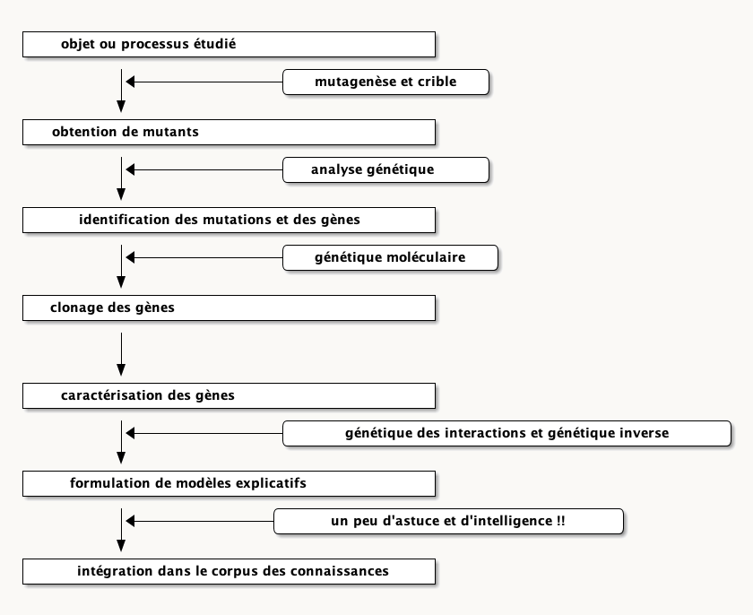

L'analyse génétique est suivie d'une analyse moléculaire afin d'identifier les gènes dans lesquels ont eu lieu les mutations. Ces trois étapes sont obligatoires avant de pouvoir formuler des modèles et d'entreprendre des analyses supplémentaires pour préciser et vérifier les modèles. Nous allons voir chacune de ces étapes dans les chapitres suivants en commençant par la complémentation.

# Chapitre 4: La complémentation

## Principe du test de complémentation

A l'issue d'une mutagenèse, on dispose d'une collection d'allèles mutants. Dans ce chapitre, nous partons du fait que chacun des mutants analysés obtenus porte une seule mutation indépendante de celles présentes dans les autres mutants. Pour voir comment déterminer si une seule mutation est bien à l'origine du phénotype, il suffit d'appliquer les règles de ségrégation de Mendel. Nous reviendrons sur ce point dans le chapitre suivant. En général, ces allèles confèrent le même phénotype. La question se pose alors de savoir combien de gènes sont mis en jeu pour obtenir cette collection d'allèles. La génétique a développé des méthodes qui permettent de répondre à cette question dont le **test de complémentation** qui est le plus rapide à mettre en œuvre. Son application permet d'avoir une bonne idée du nombre de gènes.

Le test consiste dans la fabrication d'une souche pour laquelle les allèles mutants sont associés deux à deux en configuration trans et en l'observation du phénotype (figure 100). Pour ceci, il suffit de croiser les mutants entre eux et de regarder le phénotype de souches F1 diploïdes obtenues.

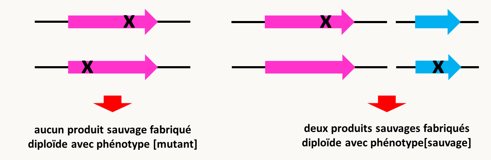

- Si les deux allèles sont allèles d'un même gène, cela aboutit au schéma de gauche de la figure 100. Dans ces conditions, aucun allèle sauvage n'est présent dans la souche et l'on peut raisonnablement suspecter que le phénotype de la souche sera mutant.
- Si les deux allèles sont des allèles de gènes différents, cela aboutit au schéma de droite de la figure 100. Dans ces conditions, on voit qu'il y a présence d'allèles sauvages pour chacun des gènes. Donc, si les allèles mutants a et b sont récessifs vis à vis de leurs allèles sauvages respectifs, on peut cette fois raisonnablement suspecter que la souche sera de phénotype sauvage. Notez que ce test ne s'applique donc pas si les mutations sont dominantes.

Le principe du test est donc le suivant. On fabrique les souches avec toutes les combinaisons d'allèles mutants obtenus après mutagenèse, associés deux à deux. **Si pour une combinaison le phénotype de la souche obtenue est mutant, on dit que les deux allèles ne complémentent pas et qu'ils sont probablement allèles d'un même gène**. **Si le phénotype de la souche obtenue est sauvage, on dit alors que les deux allèles complémentent et qu'ils sont probablement allèles de deux gènes différents.** A l'aide de ceci, on construit un tableau. Il reste ensuite à déterminer le nombre de gènes. Le tableau suivant donne un exemple de tableau provenant d'une analyse faite dans mon laboratoire. Ces résultats ont été obtenu en analysant le champignon *Podospora anserina*, qui est haplobiontique. L'analyse des diploïdes n'est donc pas faisable sur les thalles végétatifs. Il est possible par contre d'analyser des dicaryons, chacun des noyaux portant une mutation. Le principe du test reste donc le même. Nous avons obtenu après mutagenèse 6 souches du  portant chacune un allèle mutant indépendant. Ces 6 souches ne différencient pas d'organes femelles (périthèces). Nous avons associé dans des hétérocaryons les six allèles deux à deux et avons obtenu les résultats suivants :

|    | m1 | m2 | m3 | m4 | m5 | m6 |
|----|----|----|----|----|----|----|
| m1 | -  | +  | +  | +  | -  | -  |
| m2 |    | -  | -  | +  | +  | +  |
| m3 |    |    | -  | +  | +  | +  |
| m4 |    |    |    | -  | +  | +  |
| m5 |    |    |    |    | -  | -  |
| m6 |    |    |    |    |    | -  |

Le signe - indique que l'hétérocaryon avec mi dans un noyau et mj dans l'autre ne différencie pas de périthèce (phénotype mutant). Le signe + indique qu'il en différencie (phénotype sauvage).

De ce tableau nous pouvons tirer que :

- l'allèle m4 complémente avec tous les autres et donc qu'il caractérise un gène.
- les allèles m1, m5 et m6 ne complémentent pas entre eux mais complémentent avec tous les autres et donc qu'ils caractérisent un deuxième gène
- les allèles m2 et m3 ne complémentent pas entre eux mais complémentent avec tous les autres et donc qu'ils caractérisent un troisième gène.

Au total, il est donc possible de définir trois groupes de complémentation. Il semble donc y avoir trois gènes identifiables par cette méthode.

## Conditions d'application

L'application du test se fait différemment en fonction du type d'organisme. En effet, la construction des souches est simple si on est chez un organisme diplobiontique ou haplodiplobiontique. Il suffit dans ce cas de croiser des parents purs pour chacun des allèles mutants et d'observer la F1 ou les diploïdes produits.

Chez les organismes haplobiontique, comme *Podospora anserina*, ou dans les cellules en culture, il est souvent impossible de fabriquer des noyaux diploïdes. On a donc comme expliqué ci-dessus recourt à la fabrication d'hétérocaryons. Mais les résultats obtenus sont plus aléatoire. En effet, dans un noyau diploïde, les allèles sont certainement présents à l'état "hétérozygotes" avec un nombre fixe de copies. Chez les hétérocaryons, le rapport des noyaux peut varier, voire à l'extrême un des deux types de noyau peut se perdre. La construction d'**hétérocaryons dit balancés** peut compenser ceci. Un des noyaux possède un marqueur d'auxotrophie ou de résistance à un antibiotique. L'autre possède un autre marqueur d'auxotrophie ou une autre résistance. Par exemple, chez *Podospora anserina*, on dispose d'une souche *leu1-1* qui est auxotrophe pour la leucine et d'une souche *lys2-1* qui est auxotrophe pour la lysine. On sait que si l'on forme un hétérocaryon *leu1-1/lys2-1*, celui pousse sur milieu minimum (figure 101). Cela veut donc dire que les deux mutations complémentent et qu'elles affectent des gènes différents, ce que l'on pouvait présager!

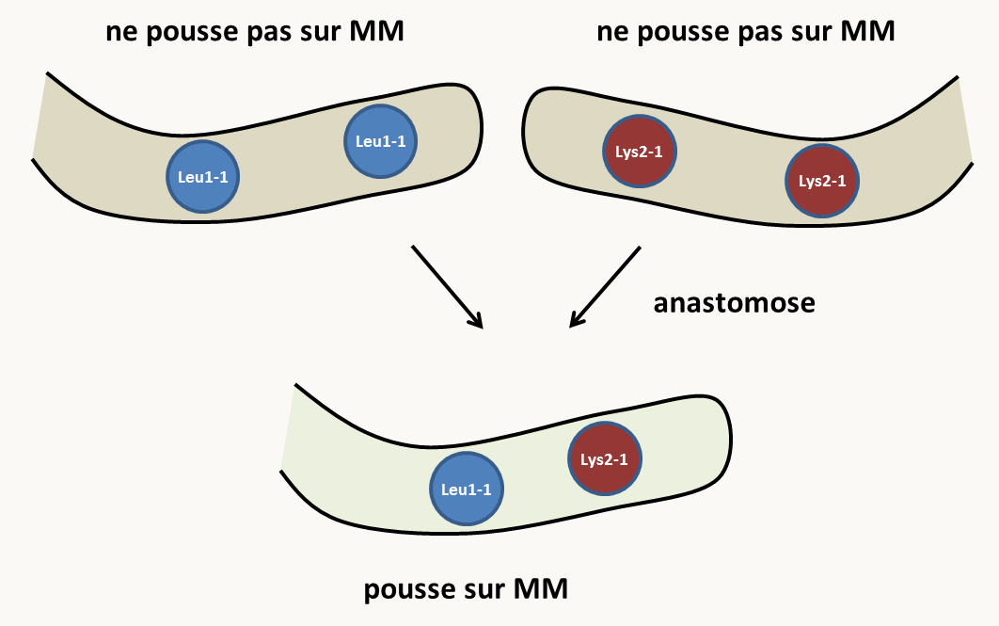

Ceci permet donc de conserver les deux types de noyaux. Si l'on veut tester la complémentation de deux mutations m1 et m2, il suffit de construire l'hétérocaryon (leu1-1, m1)/(lys2-1, m2) et de le faire pousser sur milieu minimum. Celui-ci conservera les noyaux avec m1 et ceux avec m2.

Dans certains systèmes génétiques et il est difficile de maintenir les mutations en position trans à cause des recombinaisons. Cela aboutit à la formation de configurations où les mutations sont en positions cis (figure 102).

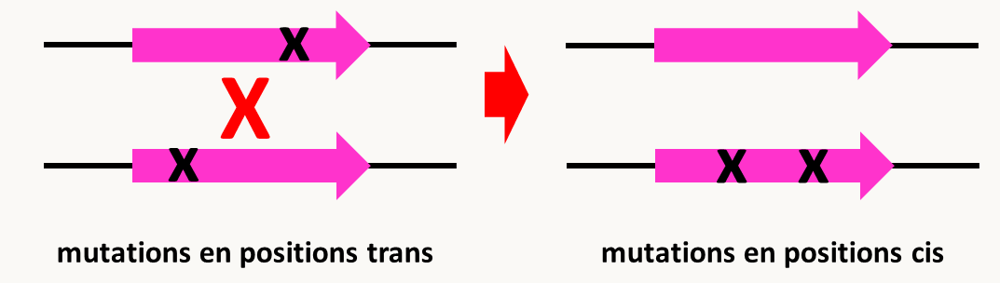

On ré-obtient donc dans ce cas un allèle sauvage qui a toutes les chances de conférer un phénotype sauvage et ceci bien que les 2 mutations soient initialement dans le même gène. Les génomes mitochondriaux et plastidiques sont sujets à ce type d'évènement. Par exemple, dans le génome mitochondrial de levure, la recombinaison est très rapide. Si l'on veut tester la complémentation de mutations mitochondriales affectant la respiration, il faut donc procéder comme décrit dans la figure 103 à gauche. En effet, le protocole décrit dans la figure 103 à droite va entraîner la sélection des recombinants sauvages et non pas celle des diploïdes où se produit la complémentation:

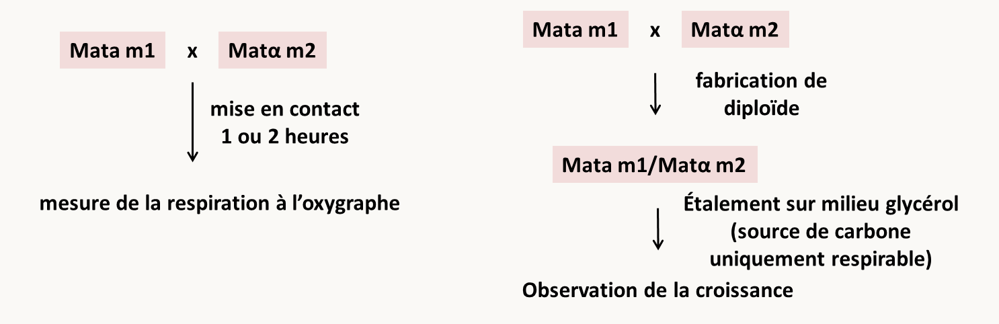

Des problèmes similaires peuvent se rencontrer dans le cas de l'étude des mutations dans des phages ou des virus.

En résumé, il faut pour **appliquer le test de complémentation, s'assurer que les mutations sont récessives et qu'elles sont bien présentes et associées en trans**.

## Les limites du test

Si le test de complémentation est un test très puissant, il arrive toutefois de rencontrer un certain nombre d'exception. Notez que si des mutations n'ont pas les propriétés attendues dans le test de complémentation, cela apporte des indications sur le fonctionnement des gènes mutants.

- **Des mutations localisées dans le même gène mais qui complémentent !**

Il arrive que des mutations localisées dans un même gène complémentent. On parle alors de **complémentation intragénique ou inter-allélique**. Deux explications au moins sont possibles pour l'expliquer (figure 104).

![mécanismes de la complémentation inter-allélique. En haut, dans le cas de protéines homo-multimériques, des mutations qui altèrent la fonctionnalité des multimères peuvent se compenser. Des mutations dans des résidus qui sont à la surface des monomères et qui changent la charge peuvent empêcher la formation de multimères et inactiver la protéine. La mise en présence des deux types de monomères permet de reconstituer un complexe actif. En bas, la complémentation est un test qui analyse la fonction. Si un gène produit un polypeptide qui exerce plusieurs fonctions, alors des mutations affectant chacune des fonctions peuvent complémenter.](img/image104.png)

Un exemple de protéine multifonctionnelle avec de la complémentation inter-allélique a bien été décrit chez *Neurospora crassa*. Chez cette espèce, la synthèse du tryptophane nécessite deux étapes catalysées par le même polypeptide qui porte les deux activités et qui est codé par le gène *trp-3*. On connaît deux groupes de mutations qui abolissent chacune des fonctions, et un groupe qui abolit les deux activités. Les premières mutations complémentent entre elles, alors qu'elles ne complémentent avec celles du dernier groupe. Notez que les mutations dans un même groupe ne complémentent pas entre elles !

- **Des mutations récessives localisées dans des gènes différents mais qui ne complémentent pas !**

Pour pouvoir appliquer le test de complémentation, il faut que les produits des gènes testés diffusent et agissent au même endroit. Ceci est surtout valable pour les hétérocaryons. Un exemple bien connu est celui des gènes impliqués dans la caryogamie chez la levure et dont les produits doivent être présents à la surface des noyaux pour que la fusion nucléaire ait lieu. Ceux-ci ne diffusant pas entre les noyaux après la plasmogamie, il n'y aura pas de fusion nucléaire dans les mutants nuls de ces gènes. On aura donc l'impression qu'il n'y a pas de complémentation bien que les mutations soient récessives (figure 105).

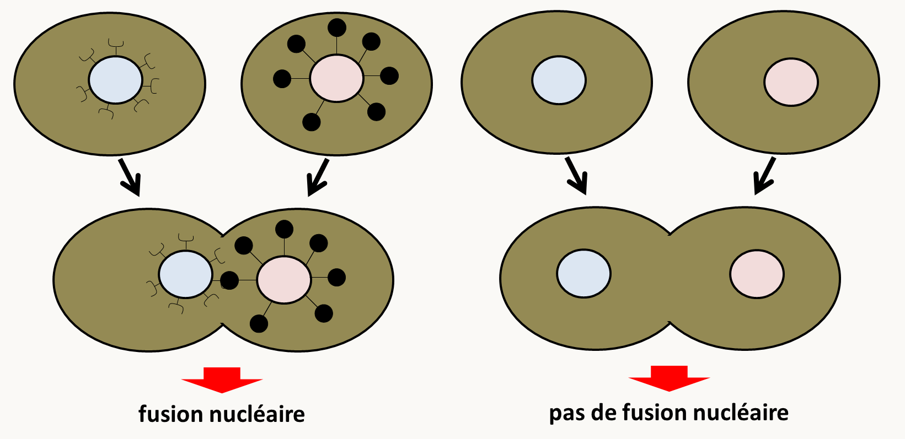

Dans le cas de protéines hétéro-multimériques, des mutations qui altèrent la fonctionnalité des multimères peuvent avoir des effets coopératifs et ainsi aboutir à un effet supérieur à ceux créés par chacune des mutations, cela peut se faire parce que le produit présent dans la souche portant les deux mutations est un poison ou parce que dans le double mutant, il n'y a plus suffisamment de produits fonctionnels pour assurer la fonction cellulaire requise (figure 106).

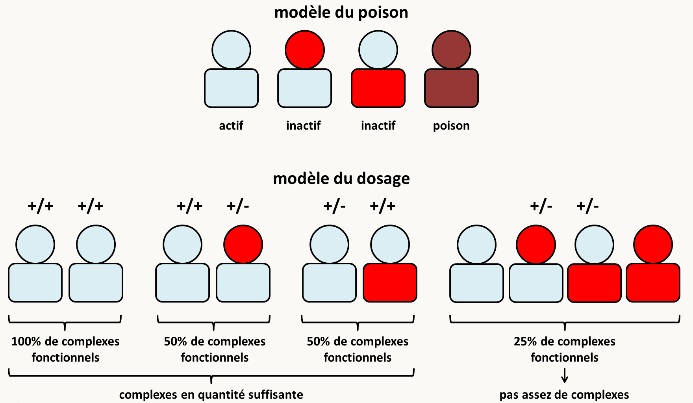

Un exemple de ce type de mécanismes est observé avec des gènes codant pour des protéines associées à l'actine. L'actine est codée par le gène *ACT1* chez *Saccharomyces cerevisiae*. Les mutations *act1-1* et *act1-4* provoquent une thermosensibilité récessive à 27°C (la température permissive est de 25°C). Les protéines codées par les gènes TPM1 et SAC6 interagissent avec le cytosquelette d'actine. Les mutations tmp1- et sac6- causent aussi un phénotype de thermosensibilité récessif. Par contre si on construit les souches diploïdes suivantes on obtient dans un cas un résultat bizarre.

| souche                                                      | phénotype          |
| ----------------------------------------------------------- | ------------------ |
| act1-1 TPM1+ / ACT1+ tpm1- | thermorésistant    |
| act1-4 TPM1+ / ACT1+ tpm1- | thermorésistant    |
| act1-1 SAC6+ / ACT1+ sac6- | thermorésistant    |
| act1-4 SAC6+ / ACT1+ sac6- | **THERMOSENSIBLE** |

Il existe donc un effet spécifique non attendu spécifiquement entre act1-4 et sac6-. Cet effet est retrouvé fréquemment avec des mutations dans *ACT1* et des mutations dans les gènes codant pour les protéines qui interagissent avec le cytosquelette. Les deux modèles du dosage et du poison ont été proposés pour expliquer ce phénomène. En fait, les 2 cas peuvent se produire dans le cas du système actine, c.a.d. qu'en fonction des couples de mutations l'un ou l'autre s'applique.

## Le terme de complémentation a été adapté à trois autres situations

Le terme de complémentation n'est pas restreint à la génétique formelle et est utilisé dans un contexte différent par d'autres biologistes. Dans tous les cas, il s'agit de restaurer un état sauvage dans un mutant.

- Le terme a été co-opté par les biochimistes, pour identifier une protéine responsable d'une fonction particulière. Par exemple, le groupe de Kornberg qui travaillait sur l'initiation de la réplication chez *Escherichia coli*, disposait de mutants d'initiation de la réplication (dnaB, etc.). Le groupe avait aussi un test d'initiation *in vitro* à partir d'un extrait acellulaire de la souche sauvage. Pour identifier les protéines affectées dans les différents mutants, par exemple dnaB. Les chercheurs du groupe ont fait un extrait acellulaire de la souche mutante dnaB et ont montré qu'il ne permettait pas la réplication *in vitro*. Ils ont ensuite fractionné l'extrait acellulaire issue de la souche sauvage et ont ajouté séparément les différentes fractions à leur extrait de dnaB. Ils ont ainsi pu caractériser la fraction qui contenait la protéine dnaBp sur le critère de restauration de l'initiation de la réplication. On dit qu'ils ont identifié par **complémentation *in vitro*** la protéine dnaB Des fractionnements successifs de ce type ont ainsi permis de purifier différentes protéines impliquées dans l'initiation de la réplication chez *Escherichia coli*.

- Le terme a aussi été co-opté par les généticiens moléculaires, pour l**e clonage des gènes par expression**, qui est un terme plus correct que le terme de **clonage par complémentation**. Lorsque l'on dispose d'une souche qui n'exprime pas un caractère (parce qu'elle contient un allèle mutant d'un gène ou parce que l'organisme ne possède pas le gène), il est possible de trouver des gènes qui restaurent le caractère. Il faut pour cela fabriquer une banque à partir d'une souche qui présente le caractère et transformer la souche qui ne le possède pas. L'isolement de transformants qui ont le caractère recherché permet de conclure que ceux-ci contiennent un fragment d'ADN qui restaure le caractère et donc le gène responsable (attention, il peut aussi s'agir de réversions). Par exemple, nous avons déjà vu ce principe pour les plasmides contenant un gène capable de restaurer la prototrophie à des mutants et qui sert de marqueur de sélection. Voici un autre exemple tiré de mon laboratoire. Nous possédons des souches qui ne différencient plus de périthèces (organes femelles) à cause de la présence d'un allèle mutant du gène *IDC1*. Nous voulions cloner l'allèle sauvage du gène. Pour ceci nous disposions d'une banque de cosmides fabriquée à partir de la souche sauvage. Nous avons transformé la souche mutante *IDC1* par les cosmides de cette banque. Nous avons testé la fertilité des transformants et avons trouvé un transformant qui était fertile. Celui-ci avait intégré l'ADN qui contenait l'allèle sauvage du gène *IDC1*. Nous disons donc que nous avons cloné par complémentation ou par expression le gène *IDC1+*. Notez que pour que ce type de clonage marche, il faut que la souche réceptrice porte l'allèle récessif et la banque contiennent l'allèle dominant. Nous reviendrons sur ce point dans la section dédiée au clonage des gènes lorsque l'on dispose de mutant.

- Le terme est aussi utilisé pour la validation du rôle des mutations construites par mutagenèse dirigée dans les phénotypes observés. En effet, nous avons vu que l'intégration de l'ADN transformé dans une cellule ne se passe pas toujours de manière simple. Si des mutations sont construites en utilisant la transformation, il n'est pas toujours assuré que la mutation construite soit à l'origine de tous les phénotypes observés. C'est aussi potentiellement le cas avec le système CRISPR/CAS9 si la nucléase CRISPR clive d'autres cibles que celle choisie. Pour vérifier si la mutation construite est bien à l'origine de tous les phénotypes, il suffit de réintroduire l'allèle sauvage dans la souche mutante. Si on observe un retour à l'état sauvage pour tous les phénotypes, on dit qu'on a procédé à **la complémentation de la souche mutante pour prouver que la mutation construite est bien à l'origine des phénotypes**.

# Chapitre 5: La recombinaison et l'établissement de cartes génétiques

## Utilité des cartes génétiques

La cartographie permet de positionner des gènes sur les chromosomes. A l'issue de mutagenèse, cette méthode permet d'analyser le contenu en mutation(s) des souches obtenues (en effet, à l'issue de la mutagenèse, il n'est pas rare qu'un mutant contiennent plusieurs mutations). Elle permet aussi de ranger les différentes mutations dans des locus (ou loci) sur les chromosomes et donc d'estimer le nombre de ces locus et par extension donc le nombre de gènes. Contrairement à la complémentation, cette méthode fonctionne avec les allèles récessifs ou dominants. Toutefois, elle a aussi ses limites en particulier, elle ne permet pas de différencier si des mutations proches sont effectivement dans un même gène ou deux gènes proches. De même, deux mutations situées aux deux extrémités d'un grand gène peuvent recombiner. Cette méthode doit donc s'utiliser si possible en association avec un test de complémentation et l’interprétation des deux tests simultanément permet généralement de conclure avec grande certitude sur le nombre de gènes et leurs positions dans le génome.

Pour la mettre en œuvre, il faut croiser les mutants par la souche sauvage puis croiser les mutants entre eux et analyser la descendance. Ceci se réalise très bien chez les eucaryotes au moment de la reproduction sexuée, mais il existe d'autres méthodes (en particulier chez les procaryotes) qui ne mettent pas en jeu la reproduction sexuée.

## Les eucaryotes: la méiose

La plupart des analyses cartographiques chez les eucaryotes utilisent la méiose. L'analyse diffère bien évidemment entre les organismes haplobiontiques, où l'on observe principalement les résultats de la méiose, diplobiontiques, où l'on observe les résultats du réassortiment des gamètes au cours des fécondations, et les haplodiplobiontiques chez qui il est possible d'observer à la fois les résultats des méioses et des fécondations. Nous allons analyser chacun de ces types d'organismes. Mais avant, nous allons analyser quelques grands principe de ségrégation des gènes et des chromosomes.

Chez tous les organismes, nous avons vu que l'on définit deux grands phénomènes de recombinaison génétique qui permettent de réassortir différents allèles. Le premier phénomène provient de la ségrégation indépendante des chromosomes homologues et des chromatides au moment des deux divisions de la méiose, il s'agit du brassage chromosomique. Dans ses expériences Mendel n'a utilisé que des gènes localisés sur des chromosomes différents; ce qui l'a conduit à énoncer sa deuxième loi d'indépendance de ségrégations des caractères. Cependant, rapidement, on s'est aperçu que certains gènes ne ségrégeaient pas indépendamment les uns des autres (et donc que la deuxième loi de Mendel était fausse dans certains cas). Rapidement, il a été établi qu'ils se trouvaient sur les mêmes chromosomes et qu'ils pouvaient être dissociés par le deuxième type d'évènement de recombinaison au sein d'un chromosome auxquels le nom de crossing-over a été donné.

La fréquence de ces crossing-over peut servir à mesurer la distance entre deux régions de l'ADN située sur un même chromosome. En effet, plus ces régions sont éloignées, plus la fréquence des crossing-over entre ces régions sera élevée. Par convention, on définit **1 unité de distance génétique (que l'on mesure en centimorgan, cM) comme la distance entre deux régions pour lesquelles en moyenne 1 produit de la méiose sur 100 est recombiné.** En d'autre terme, pour deux régions d'un même chromosome (chromatide) séparées de 1 cM, il y a une chance sur cent que les deux régions se retrouvent sur 2 chromatides différentes après la méiose.

<u>***Pour calculer les distances entre deux régions, il faut donc calculer le pourcentage de chromatides recombinées parmi la totalité des chromatides.***</u>

Pour calculer la distance entre deux gènes, il faut donc déterminer le nombre de chromatides ayant une des deux combinaisons parentales (P1 et P2) et le nombre de celles ayant une des deux combinaisons recombinées (R1 et R2). La distante génétique en cM sera alors égale à 100 x (R1+R2)/(P1+P2+R1+R2). Notez que si les allèles ségrègent indépendamment les effectifs de chacune des combinaisons sont identiques (P1= P2 = R1 = R2). En appliquant la formule ci-dessus, on voit donc que la "distance génétique" calculable culmine à 50 cM. Dans ce cas, il y a indépendance génétique et on ne peut pas formellement calculer de distance!

Notez le cas où on observe une indépendance génétique entre deux gènes, cela ne veut pas forcémment dire que les gènes sont sur des chromosomes différents. En effet, deux gènes suffisamment éloignés sur un même chromosome peuvent ségréger indépendamment l'un de l'autre si suffisamment de crossing-over ont lieu entre eux à chaque méiose.

Dans les calculs ci-dessus, on ne tient compte que des recombinants détectables. Mais, s'il se produit un deuxième crossing-over entre les locus examinés, cela va entraîner un retour à une combinaison d'aspect parental, bien qu'il y ait eu une recombinaison (figure 107).

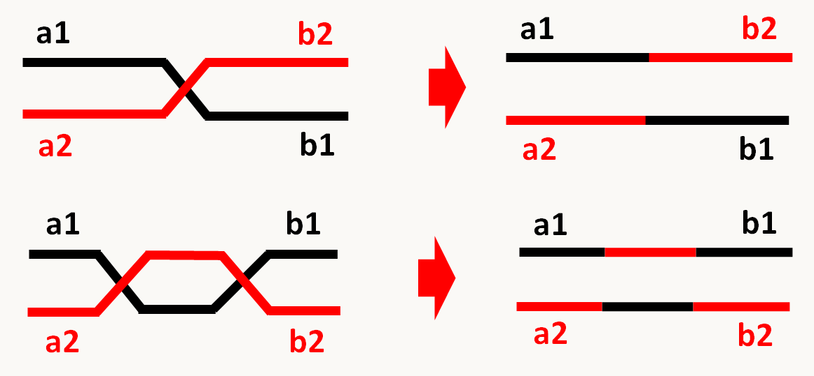

Dans ces conditions, on voit que la distance sera sous-estimée car il faudrait compter deux fois les doubles crossing-over, alors que ceci ne seront seront pas comptés. Ce biais est de plus en plus important quand la distance entre les deux régions augmente. Deux approches sont possibles pour contourner ce problème. On peut essayer de cartographier à l'aide de marqueurs intermédiaires de façon à ne prendre en compte que des petites distances. Les distances ainsi calculées peuvent être additionnées pour donner la distance réelle entre les deux marqueurs les plus éloignés (dit les **marqueurs distaux**). Cette addition peut conduire à une distance supérieure à 50 cM qui indique donc que plusieurs crossing-over par méiose se produisent entre les marqueurs distaux. On peut aussi extrapoler la distance en supposant que l'apparition des crossing-over est aléatoire. Voyons comment procéder.

Lorsqu'il se produit plus d'un crossing-over, la fréquence des produits de méiose recombinés que l'on peut détecter (FR) est la moitié du nombre réel quel que soit le nombre de crossing-over (figure 108).

![calcul de FR= fréquence de produits de méiose recombinés apparents. Sans crossing-over, FR= 0%; avec un crossing-over, FR= 50%; FR= 50 % aussi avec deux crossing-over. En effet, si on fixe le premier crossing-over (flèche rose), il existe quatre possibilités pour les chromatides impliquées dans le deuxième crossing-over. Deux des possibilités conduisent à la détection de recombinants et les deux autres à une absence de détection. Au total, la moitié des recombinants seront donc détectables si deux crossing-over sont en jeu.](img/image108.png)

D'après la figure 108, on voit donc que si deux gènes sont éloignées et que plusieurs crossing-over se produisent entre eux en moyenne par méiose, la fréquence des méioses qui n'ont pas subi de crossing-over, c'est à dire celles ou F(X = 0), est reliée à la fréquence des recombinants car elle est égale à 1 - 2 x FR.

Or nous pouvons relier le nombre moyen de crossing-over à la fréquence des produits de méiose sans crossing-over car la loi d'apparition des crossing-over suit une loi de Poisson si les crossing-over sont rares et indépendants les uns des autres (loi de probabilité des évènements rares). Les fréquences du nombre des crossing-over sont donc données par la formule **F(X = i)  = e-m mi/i!**, où m est le nombre moyen de crossing-over entre les deux régions et i le nombre de crossing-over.

Cela veut dire que la proportion des méioses où il ne se produit pas de crossing-over est F(X = 0) = e-m = 1 - 2 x RF. D'où l'on tire que **m = - ln (1 - 2 x FR)**

Nous voyons sur la figure 108 que pour 1 crossing-over par méiose, il y a seulement la moitié des chromatides qui sont recombinées et donc la distance génétique est 1/2 m, soit pour avoir la distance en cM :

**d = - 1/2 ln (1- 2 x RF) X 100**

exemple:

Si on trouve 38 % de chromatides recombinées à l'issue du croisement que l'on analyse, la vraie distance est probablement proche de - 0.5 x ln (1- 2 x 0.38) = 0.71, soit une distance génétique de 71 cM. Vous voyez donc que si on ne corrige pas la distance, on la sous-estime grandement. Cette distance plus grande que 50 cM reflète le fait qu'il se produit en moyenne plus d'un crossing-over par méiose entre les deux gènes, comme dans le cas où on utilise des marqueurs intermédiaires pour calculer la distance entre marqueurs distaux.

Mais attention, ce calcul n'est valide que si les crossing-over se produisent indépendamment les uns des autres. Ceci n'est pas le cas pour de nombreux organismes car il existe des **interférences de crossing-over**. Le plus souvent, la présence d'un premier crossing-over inhibe la production d'un deuxième dans les régions proches. De plus, nous allons voir que chez certains organismes, où l'analyse des produits de la méiose est possible, nous pouvons avoir accès aux doubles crossing-over. Cette formule ne s'applique pas pour l'estimation à partir de la distance qui prend en compte déjà les doubles crossing-over.

### Les organismes haplobiontiques: *Neurospora crassa* et les champignons filamenteux ascomycètes ayant des asques ordonnés

Nous avons vu dans l'introduction Générale, que chez les champignons du type de *Neurospora crassa*, la structure de l'asque donne directement accès aux phénomènes de ségrégation qui se sont produits au cours de la méiose car ces asques ont une mémoire de l'orientation des fuseaux aux cours de la méiose : on parle d'asques ordonnés. Chez ce champignon, il est donc possible de faire trois types d'analyse, l'analyse de spores en vrac, l'analyse d'asques non ordonnés et l'analyse d'asques ordonnés. Après la méiose chez ce champignon, il se produit une mitose qui conduit à des asques contenant huit spores. Cela n'est pas gênant car les 2 spores issues d'une mitose sont a priori identiques et cote à cote (figure 109)

Nous allons détailler uniquement ce qu'il se passe dans le cas de l'analyse des asques ordonnés car nous verrons l'analyse de tétrades désordonnées et les spores en vrac dans le cas de la levure. Pour simplifier l'explication et les dessins, nous ne considérerons donc que les produits avant la mitose postméiotique. Schématisons avec 1 gène sur un chromosome ce qui se passe au cours de méiose (figure 110)

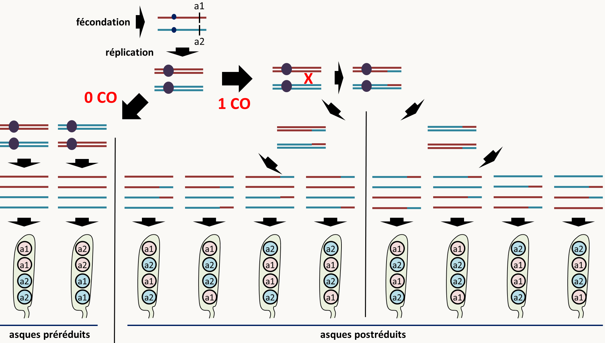

On voit qu'il est possible de définir deux types d'asques: les **préréduits** et les **postréduits**. Les asques préréduits sont faciles à repérer car chaque demi-asque est homogène avec soit deux spores a1 soit deux spores a2, alors que pour les asques postréduits les demi-asques contient une spore avec un allèle et une spore avec l'autre.

- Le premier renseignement que l'on tire est que s'il y a un seul couple d'allèle responsable d'un caractère alors, les deux allèles ségrègent 2:2 dans chacun des asques (c'est à dire que deux spores sont a1 et deux spores sont a2)!

  **Donc, si un caractère ségrège 2:2 dans les asques c'est qu'il est codé par un gène, s'il ne ségrège pas 2:2 dans chacun des asques (ségrégation de type 3:1 ou 4:0) c'est qu'il n'est pas codé par un seul gène.**

- Deuxièmement, les proportions d'asques préréduits et postréduits dépendent de la fréquence des crossing-over qui se produisent entre le centromère et le gène. On peut calculer la distance entre le gène et le centromère : **d= nb d'asques postréduits/ 2 x le nb total d'asques x 100 cM** (car pour chaque asque postréduit, seulement la moitié des chromatides est recombinée).

  <u>Que se passe-t-il si le gène est très proche du centromère ?</u>

  ​	- Dans ce cas, on n'obtient que des asques préréduits, et la distance est nulle.

  <u>Que se passe-t-il si le gène est très éloigné de son centromère ?</u>

  ​	- Dans ce cas, on obtient un mélange d'asques préréduits et postréduits dans une proportion respectivement de 1/3 et 2/3. En effet:

  - si pas de crossing-over entre le gène et son centromère: 100% des asques sont préréduits

  - si 1 crossing-over entre le gène et son centromère: 100% des asques sont postréduits

  - si 2 crossing-over entre le gène et son centromère: 50 % d'asques préréduits et 50 % d'asques postréduits (figure 111)

    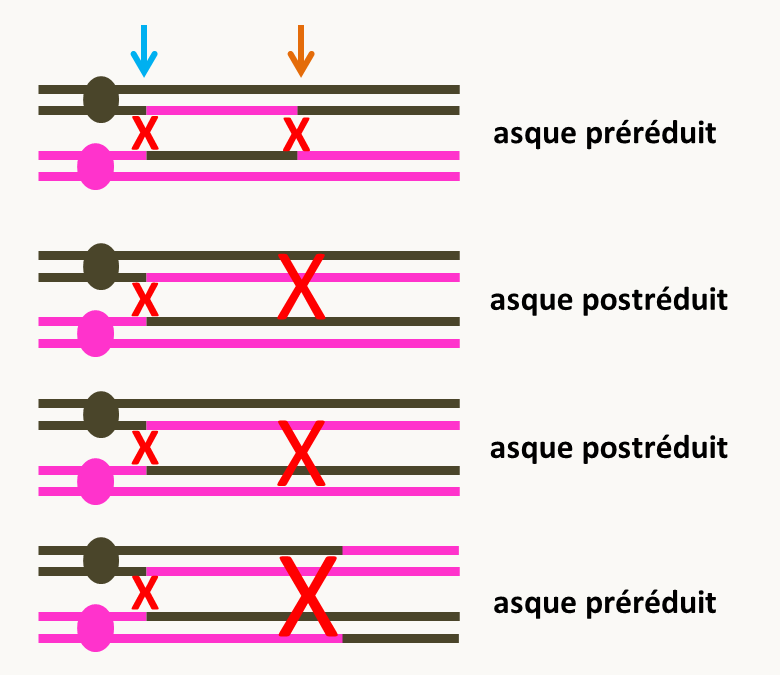

  On voit donc que :

  - Si on part d'un asque préréduit et que l'on fait 1 crossing-over supplémentaire, on obtient un asque postréduit.
  - Si on part d'un asque postréduit et que l'on fait 1 crossing-over, on obtient dans un cas sur deux un asque postréduit et dans un cas sur deux un asque préréduit.

  On peut donc construire ainsi la suite suivante: (% d'asques postréduits)n = (% d'asques préréduits)n-1 + 1/2 (% d'asques postréduits)n-1

  et comme (% d'asques préréduits)n-1 = 1- (% d'asques postréduits)n-1, on en déduit que  (% d'asques postréduits)n = 1 -1/2 (% d'asques postréduits)n-1

et donc **lorsque n est très grand la proportion d'asques postréduits converge vers 2/3** qui est la limite à l'infinie de cette suite. Donc si le pourcentage d'asques postréduits est de 66%, cela veut dire que le gène est éloigné de son centromère est qu'il ségrège indépendamment du centromère ! Attention dans ces conditions, on ne peut pas calculer une distance !!!

**En résumé : pour analyser ces asques, on recherche les asques pré- et post-réduits. Puis on calcule le pourcentage de post-réduction qui représente le double de la distance (après la correction par 100 pour avoir des cM !). Sauf, si le pourcentage d'asques postréduits est égal à 66%, car le gène est indépendant de son centromère et on ne peut calculer de distance.**

Lorsque plusieurs gènes sont en jeu (ségrégation de type 3:1 ou 4;0), je vous conseille de traiter les données pour chaque gène par rapport à son centromère indépendamment des autres. Ensuite, il faut traiter les gènes deux à deux sous forme d'asques non-ordonnés comme dans le cas de la levure.

### Les organismes haplodiplobiontiques: *Saccharomyces cerevisiae* et les levures ascomycètes

Nous avons vu dans l'introduction que chez les levures du type de *Saccharomyces cerevisiae*, il est possible d'observer les résultats de la méiose dans des asques non ordonnés. Ceux-ci contiennent 4 spores d'où leur nom de tétrades. Comme, elles ne sont pas ordonnées, l'information de position par rapport au centromère est perdue. Cette analyse fournit donc moins de renseignements que l'analyse des asques ordonnés.

- Comme pour *Neurospora crassa*, si un gène est en jeu dans le croisement, toutes les tétrades ségrègent 2:2 pour les deux allèles du gène. La présence de tétrades 3:1 ou 4:0 est indicatif de la présence de plus d'un gène.

- Si deux gènes sont mis en jeu (comme dans le cas d'un croisement mutant par mutant) alors, l'analyse de tétrades fournit des informations sur la position de ces deux gènes l'un par rapport à l'autre.  Croisons une souche a1 b1 par une souche a2 b2. On voit donc que les associations parentales sont a1 b1 et a2 b2, et les associations recombinées sont a1 b2 et a2 b1

  - Si les gènes sont sur des chromosomes différents, ils ségrègent indépendamment au cours du brassage chromosomique et il peut se produire en plus des crossing-over entre les gènes et leur centromère (figure 112 et 113).

  ![ségrégation de deux gènes localisés sur des chromosomes différents dans les tétrades de levure sans ou avec un seul crossing-over. Sans crossing-over, comme chaque association de chromosomes est équiprobable au cours de la première division de la méiose, on obtient autant de tétrades avec uniquement des associations parentales dites ditypes parentaux que de tétrades contenant uniquement des associations recombinées dites ditypes recombinés. Avec un crossing-over entre l'un des gènes et son centromère, on obtient uniquement des asques contenant une spore de chacune des 4 associations dits tétratypes.](img/image112.png)

  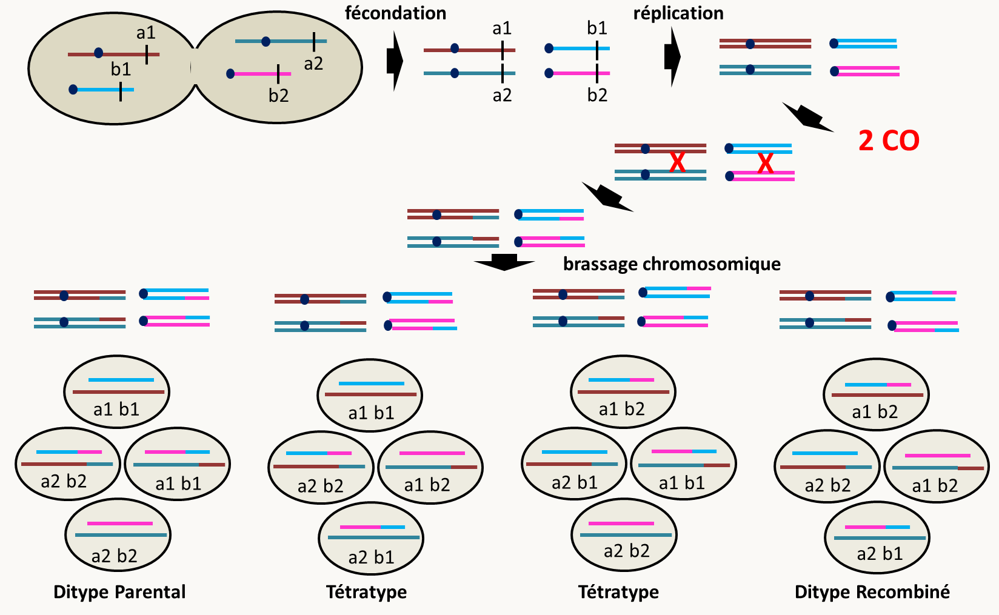

  Dans les figures 112 et 113, seuls ont été représentés les asques obtenus si les deux chromosomes "du haut" (et donc aussi les deux chromosomes du bas) ségrègent ensembles. On obtient les mêmes résultats si ce ne sont pas ces chromosomes qui ségrègent ensembles. On voit qu'il est possible de définir trois types de tétrades; les **ditypes parentaux** (DP) pour lesquels uniquement les associations parentales sont présentes dans les spores, les **ditypes recombinés** (DR) pour lesquels  uniquement les associations recombinées sont présentes dans les spores et les **tétratypes** (T) pour lesquels deux spores ont une association parentale et les deux autres une association recombinée. Comme chaque association de chromosomes est équiprobable au cours de la première ou de la deuxième division de la méiose, on obtient sans crossing-over uniquement des DP et des DR en quantités identiques, avec un crossing-over uniquement des T, et avec 2 crossing-over des DRs et des DPs en proportions de 1/4 et des T en proportions de 1/2

  Donc, si l'on réunit les résultats obtenus avec 0, 1 ou 2 crossing-over, on obtient au total autant de ditypes parentaux que de ditypes recombinés : **DP = DR**

  Par contre, la fréquence des tétratypes dépend des crossing-over qui se produisent entre les gènes et leur centromère. Cette fréquence n'est pas informative car elle provient de la combinaison des tétratypes issus des crossing-over entre (a1/a2) et son centromère, de ceux issus des crossing-over entre (b1/b2) et son centromère et des tétratypes issus de doubles crossing-over entre les deux gènes et leurs centromères respectifs.

  Que se passe-t-il si les gènes sont très éloignés de leurs centromères et que de nombreux crossing-over se produisent ?

  Dans ces conditions, le pourcentage maximum de tétratypes plafonne à 2/3. En effet, le tableau suivant donne les types et les fréquences des tétrades désordonnées que l'on observe en fonction des pré- et post-réduction des deux gènes situés sur deux chromosomes différents (faites les schémas !) :

  |                | préréduit             | postréduit                     |
  | -------------- | --------------------- | ------------------------------ |
  | **préréduit**  | **50 % DP : 50 % DR** | **100 % T**                    |
  | **postréduit** | **100 % T**           | **25 % DP : 50 % T : 25 % DR** |

  et donc si X est la fréquence de postréduction du premier gène et Y la fréquence de postréduction du deuxième gène, la fréquence de tétratype est : **T = Y(1-X) + X (1-Y) + 1/2 XY= X + Y - 3/2 XY**

  Considérons le cas de deux gènes très éloignés de leurs centromères. C'est la configuration où il se produit le maximum de crossing-over et où X et Y sont les plus élevés. Dans ces conditions, nous avons vu précédemment au cours de l'analyse des asques chez *Neurospora crassa* qu'ils sont postréduits avec une fréquence de 2/3, d'où la fréquence maximale de tétratypes T = 2/3 + 2/3 - 3/2 (2/3 x 2/3) = 2/3

- Analysons maintenant ce qui se passe pour la même combinaison génique a1 b1 x a2 b2 dans le cas où les deux gènes se trouveraient sur le même chromosome.

  - Un premier cas à considérer, est celui où les "deux gènes" sont en fait un seul et même gène (ce qui peut arriver à l'issue de la mutagenèse et que l'on croise les mutants entre eux) ! Dans ce cas, la descendance est en théorie uniformément mutante ! Mais attention, si les différences entre les deux allèles et l'allèle sauvage ne sont pas localisées au même endroit, il est possible d'obtenir de rares recombinants sauvages après un crossing-over en méiose. On parle alors de **recombinaison intragénique**.

  - Si les deux gènes sont sont bien différents, ils ne ségrègent pas indépendamment et il peut se produire des crossing-over entre les deux gènes. Seuls ceux-ci sont représentés dans la figure 114 car ce sont les seuls qui sont informatifs.

    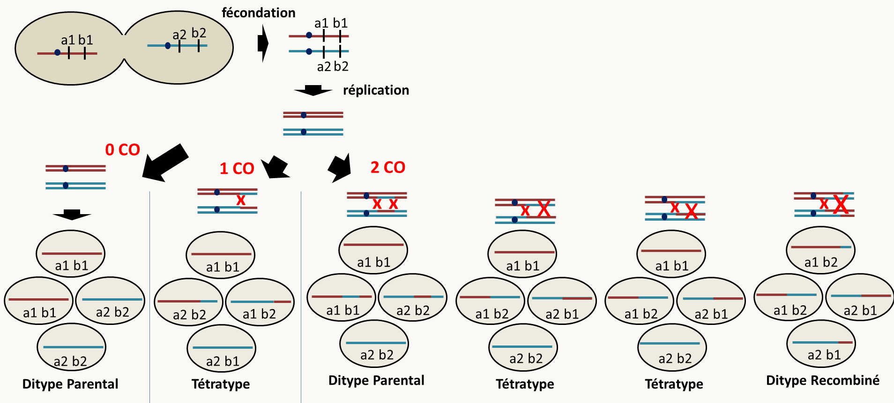

    On voit que dans ce cas les DP sont beaucoup plus fréquents que les DR (DP > DR) car ils sont obtenus soit en absence de crossing-over, soit lorsque deux crossing-over qui engagent les mêmes chromatides se produisent. Les DRs ne sont obtenus que dans le cas où 2 crossing-over engagent les 4 chromatides.

    Il est possible de calculer la distance en tenant compte des doubles crossing-over, car les DR provenant uniquement des méioses où se sont produit des doubles crossing-over, ils peuvent servir à estimer leur nombre. Après dénombrement et simplification on trouve que:

    **d = (T + 6 DR)/2 x Ntot x 100 cM**, où Ntot est le nombre total de tétrades analysées

    Que se passe-t-il si la distance entre les deux gènes augmente ?

    Comme pour le cas où les deux gènes sont sur des chromosomes différents nous allons voir que DP = DR et que T = 2/3.  En effet:

    si 0 crossing-over: 100% de DP
    si 1 crossing-over: 100% de T
    si 2 crossing-over: 50% de T, 25 % de DP et 25% de DR

    On voit donc que si on part d'un DP ou d'un DR et que l'on fait un crossing-over supplémentaire on obtient un T. Et que si on part d'un T, on obtient 1/2 de T et 1/4 de DP et 1/4 de DR.

    On peut alors construire la suite: Tn = DPn-1 + DRn-1 + 1/2 Tn-1 = DPn-1 + 1 - (DPn-1 + Tn-1) + 1/2 Tn-1= 1 -  1/2 Tn-1

    D'où la convergence du nombre de T vers 2/3. De même, on voit que DP = DR = 1/6 lorsque de nombreux crossing-over se produisent entre les deux gènes.

Donc, pour l'analyse de tétrades, il faut caractériser les DP, DR et T, ensuite deux cas:

- 1°) DP = DR alors les deux gènes sont indépendants

  - si la fréquence de tétratypes est inférieure à 66%, les gènes sont sur des chromosomes différents
  - si la fréquence de tétratypes est égale à 66%, on ne peut pas conclure

- 2°) DP > DR alors les deux gènes sont liés et on peut calculer la distance d = (T + 6 DR)/2 x Ntot x 100 cM

#### L'analyse de spores en vrac

Dans certains cas, il n'est pas possible d'effectuer des analyses en asques ordonnés ou même en tétrades, par exemple chez certains champignons comme *Aspergillus nidulans* pour lesquels les asques sont trop fragiles pour être récoltés individuellement (voir dans l'Introduction Générale le cycle de cette espèce). Il est évident que l'on peut faire de même pour *Neurospora crassa* et *Saccharomyces cerevisiae*. Mais, Le fait de ne pas considérer les asques fait que de l'information est perdue (en particulier, on ne peut pas évaluer les doubles crossing-over entre deux gènes). Ce type d'analyse fourni donc moins d'information que l'analyse de tétrades ordonnées ou non. L'analyse des spores en vrac est par contre souvent beaucoup plus facile à mettre en œuvre pratiquement et suffit souvent en première approche.

- Si un gène est en jeu au cours du croisement (a- x a+), on récupère en théorie 50% spores a-  et 50% de spores a+

- Si deux gènes sont en jeu au cours du croisement (a- b+ x a+ b-) et s'ils sont indépendants, on récupère un quart de chacune des catégories. Par contre un excès de catégories parentales sera indicatif d'une liaison entre les gènes. On pourra alors calculer une distance :

  ​			**d = nombre de spores recombinante / nombre total de spores x 100 cM**

Dans ce cas, l'utilisation de l'extrapolation de la distance pour tenir compte des crossing-over multiples  est souhaitable.

### Les organismes diplobiontiques: *Caenorhabditis elegans*

Chez le ver *Caenorhabditis elegans*, comme chez les tous les animaux et les plantes supérieures, il n'est possible d'observer que le réassortiment des gamètes après fécondations. Chez ce ver, les autofécondations des hermaphrodites et les croisements mâles par hermaphrodites permettent de faire rapidement des analyses de ségrégation, en particulier en raison de son temps de génération très court.

Les lois de Mendel vues dans l'Introduction Générale, nous disent que chez les diplobiontiques que la ségrégation d'un gène ne peut se voir qu'en F2 si l'on part d'un croisement entre lignées pures. En effet, en F1, il est seulement possible de déterminer la dominance/récessivité des allèles. En F2, un couple d'allèle va ségréger avec 3/4 de descendants ayant le phénotype dominant et un quart ayant le phénotype récessif. Si deux gènes autosomaux sont en jeu, il est possible de voir comment ils vont ségréger en analysant un tableau de gamètes et de résultats de fécondation. Si les deux souches initiales ont les génotypes a-/a- b+/b+ (souche mutée sur a) et a+/a+ b-/b- (souche mutée sur b), en F1, tous les descendants auront le génotype a-/a+ b+/b-. L'analyse de la F1 permet donc de déterminer la dominance récessivité et pour notre exemple nous choisirons que les allèles a- et b- sont des allèles mutants récessifs. Le tableau d'une autofécondation de descendants Fi est donné sur la figure 115.

Nous voyons dans le tableau de la figure 115 que si les gènes sont indépendants, c'est à dire si les catégories parentales et recombinées sont obtenues en quantités égales, on obtient 1/16 de doubles-homozygotes récessifs (case rose) qui auront donc les deux phénotypes mutants, 3/16 de souches homozygotes uniquement pour a- (cases vertes) et qui auront donc seulement le phénotype mutant de a-,  3/16 de souches homozygotes uniquement pour b- (case bleue) et qui auront donc seulement le phénotype mutants de b- et les autres (cases violettes et orange) ont au moins un allèle sauvage pour a <u>et</u> un allèle sauvage pour b et auront donc un phénotype sauvage; seul 1/16. On voit donc la ségrégation de type "**9:3:3:1**" observées par Mendel typique de gènes indépendants. Dans le cas, où les mutations provoquent le même phénotype, on voit qu'il y aura 9/16 de sauvages et 7/16 de mutants.

Nous voyons que si les gènes sont liés, les doubles-homozygotes récessifs vont diminuer car dans ce cas les proportions de gamètes recombinés diminuent alors que les parentaux augmentent. Dans le cas extrême, où il n'y a pas de recombinant, alors en F2, 25% des descendants ont le phénotype mutant de a-, 25% des descendants ont le phénotype mutant de b- et 50% descendants sont sauvages et il n'y a pas de doubles-homozygotes récessifs.

Un moyen simple de voir si les gènes sont liés ou non est donc de compter les nombre de doubles-homozygotes récessifs:

- S'ils sont en proportion égale à 1/16 de l'effectif total de la descendance alors les gènes sont indépendants.
- S'ils ont en proportion inférieure à 1/16 de l'effectif total de la descendance alors les gènes sont liés. Il est alors possible de calculé la distance génétique: **d= 2 x √p̅ x 100 cM** ou p est la proportion des doubles-homozygotes récessifs.

Notez que si les deux mutations sont dominantes, la case diagnostique sera celle des sauvages (case orange qui dans ce cas est celle des doubles-homozygotes récessifs) et les mêmes observations s'appliqueront. Dans le cas, de croisements avec une mutation récessive et une mutation dominante, il faut choisir la bonne case diagnostique, c'est à dire celle où les individus portent à l'état homozygote l'allèle récessif et l'allèle sauvage pour le gène portant la mutation dominante.

Enfin, le tableau de la figure 115 est celui de la ségrégation de gènes autosomaux. Si un des gènes est porté sur le chromosome X, il faut tenir compte du fait que les mâles sont hémizygotes pour ce chromosome. Dans ce cas, les mâles porteurs de l'allèle récessif seront de phénotype mutant.

### Le test 3-points

Dans le cas où plus de deux mutations sont en jeu dans les croisements, je vous conseille de les traiter deux à deux. Il est cependant un cas, celui dit du test trois points, où l'analyse des trois mutations ensembles permet de les ordonner sur les chromosomes (figure 116).

![test 3-points: dans un croisement d'une F1 hérérozygote par elle-même, la fréquence d'un double crossing-over entre a et b et entre b et c est le produit de la fréquence d'un crossing-over entre a et b avec celle d'un crossing-over entre b et c. Elle est donc très inférieure à ces deux dernières fréquences. Dans les descendants les chromatides portant (a1 b2 c1) et (a2 b1 c2) sera la plus faible. En résumé, le gène qui recombine avec les deux autres avec la plus faible fréquence se trouve au milieu.](img/image116.png)

### La ségrégation extrachromosomique méiotique

Chez la plupart des organismes, il existe une différence entre le gamète apporté par le mâle et celui apporté par la femelle. Le plus souvent, le cytoplasme est apporté uniquement par la femelle. Il s'ensuit dans ces organismes une ségrégation des mitochondries (et des plastes) qui suit le plus souvent une hérédité strictement maternelle. Attention, il existe des exceptions. En particulier chez les moules les mitochondries peuvent être héritées du partenaire mâle ! Dans tous les cas, l'hérédité est dite **non-mendélienne** ou **extrachromosomique**. Je vous rappelle que nous avons déjà vu une hérédité non-mendélienne dans le chapitre des polymorphismes avec le système het-s / het-s* de Podospora anserina.

Chez l'homme, il existe un certain nombre de maladies pour laquelle l'hérédité est strictement maternelle comme des myopathies et des surdités. Nous avons aussi vu que cette hérédité strictement maternelle permet de retracer l'histoire de l'ADN mitochondrial (voir les haplotypes dans le paragraphe du polymorphisme) et par-là de retracer l'histoire des populations humaines. Voici d'autres exemples:

- Chez certains champignons, nous avons vu qu'il existe une différenciation de gamètes mâles et femelles. Il est donc possible d'orienter des croisements. Chez *Podospora anserina*, il existe une souche résistante au chloramphénicol. Cette souche porte un allèle particulier (*capR*) du gène du grand ARN ribosomique mitochondrial codé par le génome mitochondrial. Il a été obtenu après une mutagenèse. L'allèle sauvage étant appelé *capS*. Il est possible (et techniquement facile) de croiser les souches de 2 façons, femelle *capR* x mâle *capS* ou femelle *capS* x mâle *capR*. Dans le premier cas, la descendance obtenue est entièrement *capR* dans le deuxième cas, elle est entièrement *capS*.

- Chez *Saccharomyces cerevisiae*, les deux cellules contribuent équitablement au cytoplasme au cours de la reproduction sexuée. Après méiose, le cytoplasme est divisé en quatre, ce qui aboutit le plus souvent à une absence de ségrégation des caractères pendant la méiose. L'exemple le plus extrême et le cas d'un croisement d'une souche sauvage avec une souche dépourvue d'ADN mitochondrial incapable de respirer (dite souche rho°) (figure 117). Le diploïde peut respirer ainsi que les quatre spores issues de la méiose. La ségrégation est de type 4:0.

  

### Le rapport carte génétique / carte physique

Nous avons vu que nous pouvons mesurer des distances génétiques entre les gènes. Ceci permet donc d'établir des cartes génétiques. La génomique permet maintenant d'avoir accès à une distance physique dans les génomes qui peut se mesurer en nucléotide (ou paire de base) et donc d'établir des cartes physiques des chromosomes. Quelle est la relation entre distance génétique et distance physique ? En fonction des organismes la relation peut être très contrastée !

- chez la levure, l'estimation de la distance entre deux gènes contigus est de 1cM. Les gènes se répartissent *grosso modo* tous les 2 kb et donc chez la levure 1 cM ~ 2 kb. Ce rapport est relativement constant même si localement il existe des régions avec peu de crossing-over (où 1 cM représente plus de 2 kb) et des "points chauds" (où 1 cM représente moins de 2 kb).

- chez les drosophiles mâles, les crossing-over sont très rares. Chez les femelles, on estime le rapport à environ 1 cM ~ 500 kb. Chacun des gros chromosomes subit donc environ un crossing-over par méiose.

- chez l'homme, l'estimation actuelle est de 1 cM pour 1 Mb (= 106 pb). Ceci a pour conséquence que chaque chromosome subit entre un et trois crossing-over par méiose. Donc, chacun des chromosomes, que vous avez hérités de vos parents, est une mosaïque des chromosomes de vos grands-parents ! Vous êtes donc réellement génétiquement uniques, sauf si vous avez un vrai jumeau (et encore nous avons vu qu'il existe des événements génétiques somatiques par exemple !).

- chez *Podospora anserina*, la carte génétique ne reflète pas la carte physique (figure 118). En effet, les crossing-over ne sont pas indépendants et il existe des interférences très fortes, c'est à dire que la probabilité qu'il se produise un crossing-over supplémentaire sur un chromosome dépend de la préexistence d'autres crossing-over. De plus, les crossing-over se produisent uniquement dans certaines régions. Cela aboutit à une carte génétique où les gènes ne sont pas espacés régulièrement mais à une carte où ils sont groupés en paquets. En particulier sur le chromosome 1, il ne se produit qu'un seul crossing-over entre le centromère et l'idiomorphe du type sexuel *mat*. Sur ce chromosome, il existe d'autres gènes (comme *AS4* ou *modC*) qui co-ségrègent avec *mat* (d<<0.1 cM) et qui présentent aussi des ségrégations distordues. En effet, le pourcentage de post-réduction de *mat* et *AS4* est de 98 %.

  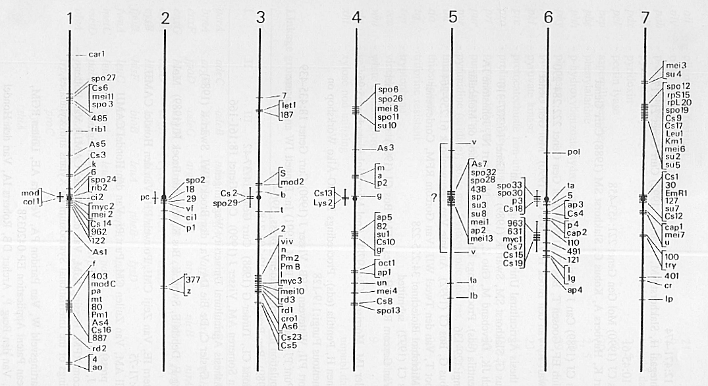

## Les eucaryotes: la mitose

Nous avons vu dans l'Introduction Générale qu'au cours d'une mitose, il ne se produit pas (en théorie !) de changements du matériel génétique; Chaque cellule fille recevant la même information de la cellule mère.

Il existe cependant quelques cas, où des changements se produisent et où ceux-ci peuvent être utilisés par les généticiens pour faire de la cartographie.

#### Ségrégation des chromosomes nucléaires

##### Non-disjonction en mitose

Nous avons vu qu'il peut se produire des anomalies de ségrégation des chromosomes nucléaires comme la non-disjonction. Si ceci est le plus souvent létal chez les haploïdes, chez les diploïdes les cellules déficientes pour un chromosome ou avec un chromosome surnuméraire peuvent survivre. Ce type d'événements est en général très rare (mais il peut être provoqué par divers traitement, dont la colchicine). Par exemple, chez un hétérozygote a-/a+ (avec a- récessif), la non-disjonction du chromosome portant l'allèle a+ permet de voir apparaître des cellules avec un phénotype mutant (figure 119).

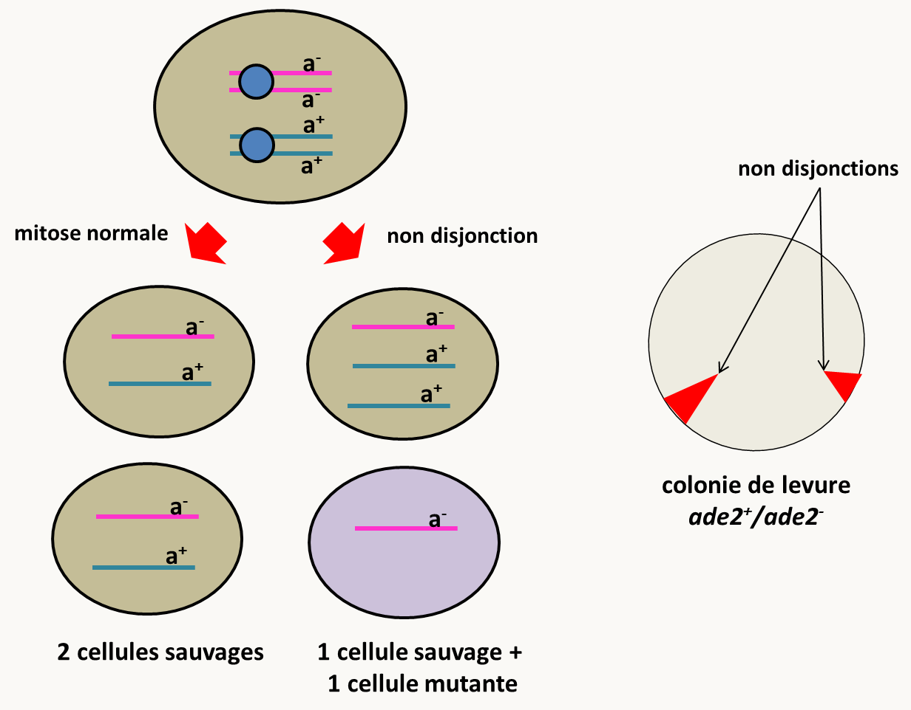

Dans le cas d'une colonie de levure, on voit apparaître un secteur mutant au sein d'une colonie sauvage (à gauche dans la figure 119). Dans le cas d'un animal, on obtient ce que l'on appelle une mosaïque, c'est à dire un individu avec un mélange de cellules ayant des compositions génétiques différentes. Deux gènes situés sur le même chromosome vont co-ségréger au cours des non-disjonctions.

##### Cycle parasexuel

Chez les champignons haploïdes et plus particulièrement chez *Aspergillus nidulans*, il existe un cycle que l'on qualifie de cycle parasexuel (voir figure 13). Chez cette espèce, il est donc possible de sélectionner des noyaux diploïdes qui sont générés spontanément et qui se propagent de manière assez stable surtout s'il existe une pression de sélection. Ceux-ci retournent cependant rapidement à l'état haploïde en absence de pression de sélection. Il en résulte des ré-associations aléatoires des chromosomes présents dans les souches utilisées initialement pour fabriquer le diploïde. Ceci permet de cartographier rapidement les gènes sur les différents chromosomes. De fait, pour localiser les gènes, on dispose  de souches "plurimarquées" sur tous les chromosomes qui permettent en un seul croisement de cartographier les gènes sur un des 8 chromosomes.

Prenons l'exemple pour localiser un gène sur le chromosome II d'un gène "a" avec 2 allèles (a+ et a-). Le chromosome II porte w (white) un marqueur de coloration blanche des conidies, les conidies sauvages w+ étant vertes. Pour la localisation, on construit dans un premier temps un hétérocaryon avec des noyaux <a+, y, w+ > et des noyaux <a+, y+, w>  où y (=yellow) est un marqueur de coloration qui donne des conidies jaunes et qui n'est pas situé sur le chromosome II. L'hétérocaryon produit des conidies qui sont soit blanches soit jaunes car les conidies possèdent un seul noyau. Ensuite, on sélectionne facilement un diploïde qui a des conidies vertes. Si les conidies sont vertes c'est que le noyau est diploïde et qu'il se produit de la complémentation entre les couples y/y+ et w/w+. Puis, on attend l'haploïdisation et on regarde le phénotype des souches qui ont des conidies blanches:

- Si toutes ces souches ont le phénotype apporté par a+, c'est que le gène "a" se trouve aussi sur le chromosome II.

- Si la moitié des souches ont le phénotype a- et l'autre moitié le phénotype a+, alors le gène "a" ne se trouve pas sur le chromosome II.

##### Crossing-over mitotiques

Finalement, il se produit au cours de la mitose de rares crossing-over dit crossing-over mitotiques (que l'on peut induire par des traitements appropriés en cassant l'ADN par exemple!). On obtient dans ce cas, aussi des colonies sectorisées ou des mosaïques. Par exemple chez la drosophile, les marqueurs y (couleur jaune du corps) et Sn (soies courtes et courbes) sont situés sur le même chromosome. Que se passe-t-il si des crossing-over mitotiques se produisent dans une mouche hétérozygote avec les allèles y et Sn associés en trans? La figure 120 montre ce qu'il se passe si le crossing-over se produit entre le centromère et les deux gènes.

![effets des crossing-over mitotiques. Après un crossing-over entre le gène Sn et le centromère, dans le cas de gauche avec ségrégation de la chromatide 1 avec la chromatide 4 et donc de la chromatide 2 avec la chromatide 3, deux cellules sauvages sont obtenues. Au contraire, dans le cas de droite, où la chromatide 1 ségrège avec la chromatide 3 et donc de la chromatide 2 avec la chromatide 4, les cellules filles seront pour l'une homozygote pour Sn et l'autre homozygote pour y. Chacune va donner naissance à un clone ce qui va aboutir à ce que l'on appelle des clones ou spots jumeaux.](img/image120.png)

On estime la fréquence spontanée de la recombinaison mitotique chez la drosophile à 10-5 par division. On voit donc que, plus le nombre de cellules est grand et plus celles-ci se divisent activement, plus de crossing-over mitotiques ont des chances de se produire. Pour qu'ils apparaissent phénotypiquement il faut :

- qu’il ait eu lieu suffisamment tôt dans le développement pour que les clones soient suffisamment étendus pour être visibles
- qu’il se produise dans une cellule du tissu où le gène s’exprime

Les généticiens de la drosophile ont réussi à augmenter la fréquence des crossing-over mitotiques pour faire de l’analyse clonale. Cela peut se faire en irradiant les larves de mouches aux rayons X. L'utilisation du système FLP/FRT  permet maintenant non seulement d’obtenir des clones mitotiques dans 90% des mouches mais aussi de cibler les crossing-over mitotiques dans des tissus particuliers. Des séquences FRT ont été introduites sur les 3 grands chromosomes de la drosophile et la recombinase FLP a été placé sous le contrôle de divers promoteurs. On peut donc générer des échanges de portions de chromosomes à la demande en induisant l’expression de la recombinase FLP en générant par croisement des mouches portant les sites FRT et la recombinase FLP associés aux mutations que l'on veut étudier. Chez la drosophile, les crossing-over mitotique ne servent pas vraiment à la cartographie, mais à:

- savoir si un gène a une **expression autonome cellulaire ** ou non. Dans le cas d'une expression autonome, c'est à dire que le produit du gène ne diffuse pas à l'extérieur de la cellule, on observe des spots jumeaux. Si ce n'est pas le cas et que le produit du gène diffuse d'une cellule à une autre, le produit sauvage diffusera à partir des cellules sauvages qui entoure le spot mutant. Celui-ci ne sera donc pas visible.
- déterminer le lignage d’une cellule, c’est-à-dire la portion de territoire qui descend d’elle par divisions successives
- étudier l’expression d’un gène après son stade de létalité : en effet si une mutation dans un gène est létale pour l’organisme à un stade très précoce on ne pourra pas savoir, autrement que par analyse clonale, quel est son rôle ensuite c’est-à-dire quel sera le phénotype cellulaire chez le mutant à un stade plus tardif.
- de manière converse, on peut déterminer le moment ou un gène cesse d’être requis.

Je vous rappelle que de nombreux cancers sont provoqués à la suite de crossing-over mitotiques ou de non-disjonctions, en particulier chez certains sujets prédisposés. Par exemple, certains individus portent un allèle défectif du gène Rb à l'état hétérozygote. Ces individus montrent des prédispositions aux tumeurs oculaires (rétinoblastomes) car après des crossing-over mitotiques, certaines de leurs cellules se retrouvent homozygotes pour l'allèle défectif qui intervient dans la prévention de la prolifération des cellules de la rétine. Ces cellules s'engagent alors dans la voie qui après d'autres mutations (au moins deux chez l'homme) permettent de former une tumeur cancéreuse. Il en va de même pour le gène célèbre codant la protéine p53. On appelle ces gènes des gènes suppresseurs de tumeurs. Pour ces gènes, l'allèle sauvage est dominant et il faut inactiver les 2 copies du gène pour engager la tumeur. Je vous rappelle qu'un oncogène est la forme mutante d'un gène cellulaire (appelé proto-oncogène) qui entraîne la cancérisation. Dans ce cas, l'oncogène est dominant par rapport à la forme sauvage proto-oncogène.

#### Ségrégation extrachromosomique mitotique

Nous n'avons pas encore parlé en détail de la transmission en mitose du matériel génétique extra chromosomique. Celui-ci ne possède probablement pas de système de répartition aussi efficace que les chromosomes nucléaires au moment de la mitose. On connaît en fait très mal les modalités de répartitions des mitochondries et des plastes, même si des progrès ont été faits chez *Saccharomyces cerevisiae* sur le sujet. En fait dans une cellule, il existe plusieurs copies du génome mitochondrial (ou plastidique) qui le plus souvent est une molécule d'ADN circulaire. Ceux-ci semblent se répartir au hasard au moment de la division. Les mitochondries sont capables de fusionner et fissionner permettant à des molécules d'ADN différentes de rentrer en contact et ensuite de ségréger. Les recombinaisons entre molécules d'ADN mitochondrial sont très fréquentes et sont détectables aussi bien après la mitose que la méiose.

Voyons ce qui se passe au moment de mitoses en prenant comme exemple la levure *Saccharomyces cerevisiae* (figure 121). Si on effectue un croisement entre une cellule haploïde sauvage et une cellule haploïde mutante qui porte un allèle mutant pour un gène mitochondrial, on obtient un diploïde qui contient les deux types d'ADN mitochondriaux, on dit que le diploïde est **hétéroplasmique** ou que c'est un **hétéroplasmon**. Au cours des mitoses, les ADN mitochondriaux vont entrer aléatoirement dans le bourgeon qui deviendra la cellule fille. Certaines cellules retrouveront alors un état **homoplasmique**, c'est à dire avec un seul type de mitochondrie.

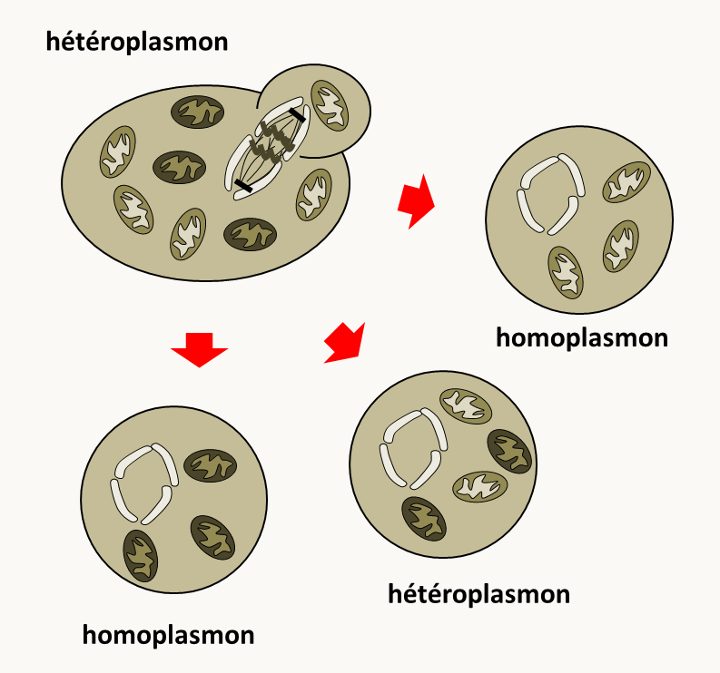

 Chez la levure, ce processus est très efficace (sans que l'on sache pourquoi) et les cellules hétéroplasmiques disparaissent très rapidement de la culture. On constate donc une ségrégation des deux caractères au cours des mitoses. Ceci permet de différencier facilement des mutations affectant l'ADN mitochondrial (mutation rho- et mit-) de mutations affectant l'ADN nucléaire (mutation pet-) ou de mutants dépourvus d'ADN mitochondrial (mutation rho°). En effet, ces dernières ne ségrègent pas au cours de la mitose (aux rares crossing-over et non-disjonction près pour les mutations nucléaires). Enfin, pour rappel, nous avons vu au chapitre 4 que les recombinaisons rapides de l'ADN mitochondrial empêchent la réalisation des tests de complémentation basés sur la croissance des diploïdes (figure 103).

Dans certains cas, un seul des deux types de molécules d'ADN mitochondrial est transmis préférentiellement en mitose. Chez l'homme la transmission préférentielle dans la lignée somatique de certaines molécules défectives d'ADN mitochondrial aboutit à des pathologies incluant des myopathies et des cécités.

## Les procaryotes

Nous avons vu dans l'Introduction Générale qu'il n'existe pas chez les bactéries de mécanismes similaires à la reproduction sexuée des eucaryotes. Cependant, il est possible d'établir des cartes en utilisant trois phénomènes permettant d'échanger ou d'introduire de l'ADN dans une cellule procaryote: la **conjugaison**, la **transformation** et la **transduction**. De ces trois techniques, la transduction est la plus utilisée.

### La conjugaison

Les bactéries peuvent contenir des plasmides conjugatifs (tels que le plasmide F chez *Escherichia coli*, figure 37). Ces plasmides conjugatifs ont permis le développement de systèmes de cartographie. En effet, ces plasmides ont la capacité de s'intégrer dans le chromosome bactérien par recombinaison, ce sont des **épisomes** (figure 122). Les souches ayant un plasmide intégré sont appelées **Hfr** (pour haute fréquence de recombinaison). Elles ont toutes les caractéristiques de bactéries F+ si ce n'est que lors du transfert de F vers une bactérie F-, ce transfert s'accompagne de celui de l'ADN du chromosome (figure 122). Après cette conjugaison, il se produit une recombinaison dans la bactérie F- entre l'ADN du chromosome et l'ADN nouvellement introduit (figure 122).

![souche Hfr et principe de la conjugaison chez Escherichia coli. La conjugaison a lieu avec une souche donneuse Hfr sensible à un antibiotique et une souche receveuse qui y est résistante (ici la streptomycine). Ici la souche donneuse est sauvage et donc prototrophe pour l'histidine (his+), alors que la réceptrice est auxotrophe pour cet acide aminé. Le transfert du chromosome bactérien de la souche donneuse vers la souche receveuse peut se voir par l'obtention de conjugants résistants à la streptomycine (et donc ayant le génome de la receveuse) et qui sont devenus prototrophe grâce à un double crossing-over qui a permis le remplacement de l'allèle his- par l'allèle his+.](img/image122.png)

Notez que le plus souvent après une conjugaison avec une souche Hfr, la bactérie receveuse reste F-. Ce système a permis le développement d'un système de cartographie efficace (figure 123). En effet, si la bactérie donneuse Hfr diffère de la bactérie réceptrice par un certain nombre de marqueurs, il est possible de suivre l'apparition au cours du temps de ces marqueurs dans la bactérie réceptrice. Pour ceci il faut "croiser" une bactérie Hfr avec une bactérie  F-  et interrompre la conjugaison à différents moments... simplement en agitant la culture !  Ensuite, il faut mesurer la cinétique d'apparition dans la receveuse des différents marqueurs.

Chez *Escherichia coli*, l'insertion du plasmide F dans le chromosome peut se faire à différents endroits (figure 122). Ceci permet de cartographier à partir de plusieurs origines. Les données obtenues montrent alors que les ordres obtenus pour les mêmes marqueurs diffèrent mais ne sont pas aléatoires. L'analyse de l'ensemble des résultats a permis de conclure qu'en fait le chromosome de *Escherichia coli* est circulaire (figure 124). Le principe par conjugaison permet donc de cartographier facilement des mutations nouvellement obtenues en se servant des mutants comme réceptrices et de souches Hfr sauvages comme donneuses.

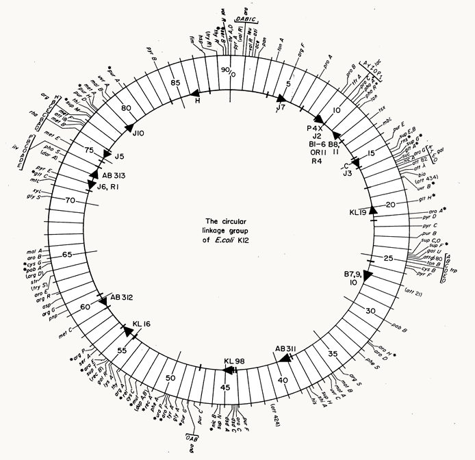

### La transformation

Le principe de la cartographie est le même que pour la transduction (cf. section suivante) avec la différence que l'introduction de l'ADN se fait par transformation plutôt que via un phage.

### La transduction

La transduction est l'introduction d'ADN exogène via un bactériophage. Il existe plusieurs types de transduction en fonction du type de phage utilisé. La méthode la plus répandue car elle permet de cartographier n'importe quelle région du génome bactérien est la transduction généralisée qui se fait avec le phage P1. Le principe de la transduction est le suivant est décrit sur la figure 125.

![principe de la cartographie par transduction avec le phage P1. Le phage P1 peut emporter un fragment du génome bactérien de la bactérie donneuse et l'injecter à la bactérie receveuse. Les phages emportant un morceau de chromosome bactérien n'empaquètent pas leur propre ADN correctement et sont donc souvent défectifs. La fréquence de ce processus est très faible. Il faut donc pouvoir sélectionner facilement la bactérie transduite (par un retour au phénotype sauvage a+ et/ou b+ par exemple). Le principe de la cartographie est alors très simple. Si on part d'une souche donneuse a+ b+ c+ et que l'on transduit une bactérie réceptrice a- b- c-, les bactéries "co-transduite" a+ b+  seront d'autant plus fréquentes que les gènes a et b sont proches. Le gène c étant éloignés des deux autres, il ne sera jamais co-transduit. Notez que pour que les gènes soient co-transduits, il faut qu'ils soient sur un fragment suffisamment petit pour qu'il puisse être emporté par le phage P1, soit espacés au maximum de 60 kb.](img/image125.png)

# Chapitre 6: L'identification des allèles sauvages et mutants

Après les analyses génétiques par test de complémentation et cartographie pour déterminer le nombre de gènes identifiés lors d'une mutagenèse classique, l'étape suivante consiste dans l'identification moléculaire des gènes mutés, c'est à dire l'obtention de leurs séquences sous forme sauvage et mutante afin d'avoir une idée de la fonction potentielle du gène, en comparant par exemple la séquence de la protéine ou de l'ARN codé avec des banques de données, ainsi qu'une idée de la nature de la mutation (voir la figure 99). Nous avons vu que cette étape est simple si le traitement mutagène est fait par insertion d'ADN exogène (comme dans le REMI) ou à l'aide d'un transposon (figure 94). Par contre, dans le cas de mutagenèse avec les rayons UV ou des mutagènes chimiques, l'identification peut présenter des problèmes. Avec l'arrivée des technologies de séquençage à haut débit, celle-ci est maintenant souvent grandement simplifiée. Néanmoins, deux autres méthodes plus anciennes sont toujours utilisées pour identifier les gènes : le clonage par expression et le clonage positionnel. Nous allons donc voir, les trois technologies successivement.

## Le clonage par expression

Aussi souvent appelé clonage par complémentation (voir le chapitre 4), cette méthode de clonage ne peut se faire que chez les organismes transformables facilement et pour lesquels il est possible de cribler un grand nombre de transformants, soit essentiellement des bactéries, des levures et avec quelques adaptations les champignons filamenteux. Elle repose sur l'utilisation d'une **banque génomique** (figure 126).

![principe de la construction d'une banque d'ADN génomique. L'ADN de l'organisme pour lequel on souhaite construire une banque est extrait et fragmenté (par digestion enzymatique partielle, fragmentation physique...). Il est ensuite cloné dans un vecteur bactérien. Chacun des clones contient un plasmide portant un fragment d'ADN génomique. La collection des clones obtenus s'appelle une banque d'ADN génomique. Elle est complète si elle contient au moins une fois chacun des gènes de l'organisme de départ. Comme le clonage est normalement aléatoire, cela sera vrai s'il y a suffisamment de clones. On appelle couverture le nombre de fois ou une région d'ADN est présente dans les clones; elle est représenté par la lettre X: une couverture de 1X veut dire la taille combinée des inserts de la banque est identique à la taille du génome et donc que les gènes sont représentés une seule fois en moyenne dans la banque. Pour être complète, la couverture d'une banque doit être d'au moins 5X à 10X.](img/image126.png)

Pour identifier le gène mutant, la stratégie dépend de la dominance/récessivité de la mutation. Dans le cas où la mutation est récessive, le principe du clonage par expression consiste dans la transformation de la souche mutante par l'ADN plasmidique des clones d'une banque d'ADN génomique obtenue à partir de la souche sauvage (figure 127). Les transformants obtenus présentant un phénotype sauvage sont sélectionnés: ils portent normalement un plasmide portant l'allèle sauvage du gène muté. Le plasmide peut être extrait et l'insert qu'il porte séquencé. Une fois la séquence sauvage obtenue, la séquence du mutant peut facilement être obtenue en amplifiant par PCR l'ADN génomique du mutant.

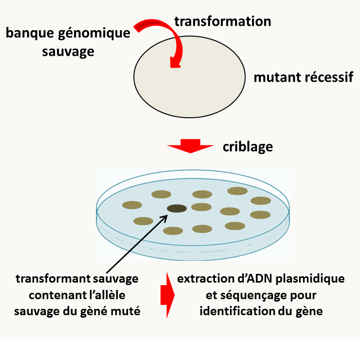

Dans le cas où la mutation est dominante, il faut procéder de manière réciproque, c'est à dire construire une banque génomique à partir de l'ADN du mutant et transformer la souche sauvage. Les transformants sont ensuite criblés sur l'apparition de souches présentant un phénotype mutant. Notez que pour les mutations récessives, il suffit de construire une fois pour toute une banque génomique à partir du sauvage et de l'utiliser pour cloner toutes les mutations récessives. Dans le cas des mutations dominantes, il faut à chaque fois construire une nouvelle banque, ce qui est parfois une étape longue et ardue.

Dans le cas des organismes qui n'ont pas de plasmide réplicatif, comme les champignons filamenteux, il est souvent difficile de récupérer les plasmides à partir des transformants complémentés (pour les mutations récessives) ou exprimant l'allèle mutant (pour les mutations dominantes). Les banques sont alors construites dans des vecteurs portants des longs inserts, tels que les cosmides. Les cosmides sont maintenus dans des plaques de micro-titration de 96 puits identifiées. Les ADN des clones sont transformés par pool de 96 et les transformants sont criblés pour le phénotype diagnostique. Si aucun transformant intéressant n'est identifié, le pool suivant est analysé. Le processus est répété jusqu'à ce qu'un transformant diagnostique soit obtenu. La microplaque dont est issu le transformant est alors analysée par pool de 10, puis les clones du pool de 10 intéressant sont analysés individuellement. On appelle ce type de criblage de la **sib-sélection**. Notez que le fragment d'ADN identifié par cette méthode est généralement grand (les inserts des cosmides font par exemple 40-45 kb) et contient plusieurs gènes (souvent 10-15 gènes pour un cosmide). Il faut alors procéder à sa fragmentation et analyser chacun des fragments pour savoir si l'un d'entre eux (portant un seul gène) est capable de conférer le phénotype d'intérêt. Notez qu'avant de poursuivre des expériences qui peuvent être longue et coûteuse, il est conseillé dans tous les cas de clonage par expression de **réintroduire le gène candidat**, et uniquement le gène candidat, **pour valider que c'est bien le bon gène**: normalement **dans ce cas** **tous les transformants devraient présenter le phénotype diagnostique**. Un exemple du clonage du gène IDC1 chez *Podospora anserina* par cette méthode est donné à la fin du chapitre 4.

## Le clonage positionnel

La deuxième méthode, celle du clonage positionnel, peut être utilisé dans tous les cas où les analyses de ségrégation sont faciles, tout au moins possibles. C'est le cas des eucaryotes chez qui il existe une reproduction sexuée. De fait, c'est la technique qui a été utilisée pour identifier chez l'homme la majorité des gènes affectés chez les malades atteints de maladie génétique. Cette méthode se base sur des analyses de co-ségrégation du phénotype mutant avec des marqueurs génétique le plus souvent de marqueurs de type microsatellite (voir chapitre 1), afin d'établir une carte fine de la position de la mutation dans le génome (figure 128). Il faut donc disposer de deux souches présentant entre elles de nombreux polymorphismes moléculaires, facilement analysable, par exemple par PCR (d'où l’utilisation préférentielle des microsatellites). C'est bien évidemment le cas chez l'homme où tous les individus diffèrent entre eux par de nombreux polymorphismes (sauf les vrais jumeaux). Dans l'exemple de la figure 128, l'organisme est haplobiontique, ce qui facilite la démonstration du principe, mais la technique est bien évidemment possible, mais plus longue et complexe, chez les diplobiontiques. La méthode démarre par la génération d'une descendance F1 d'un croisement de la souche mutante avec une souche sauvage présentant de nombreux polymorphisme avec la souche dont est issu le mutant. Les descendants sont dans un premier temps phénotypés, c'est à dire qu'il est établi s'ils ont un phénotype sauvage ou mutant. Puis ils sont génotypés pour les différents marqueurs, c'est à dire qu'il est établi si leurs marqueurs microsatellites proviennent du parent sauvage ou du parent mutant. Ces données permettent alors de construire une carte génétique dans laquelle est localisé précisément l'allèle mutant par rapport aux différents marqueurs testés.

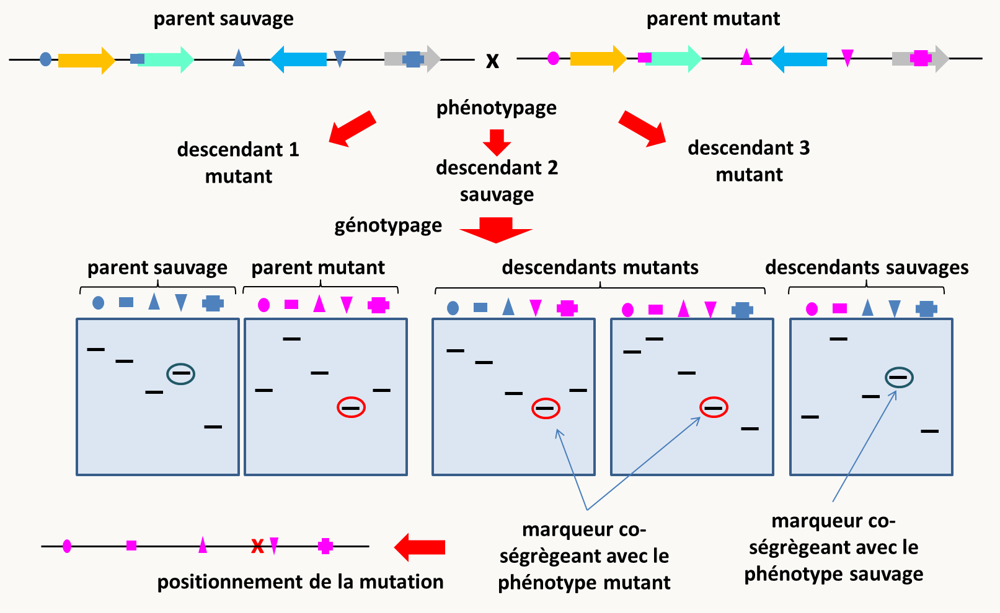

Une fois la mutation positionnée, la suite des opérations dépend de la disponibilité de la séquence génomique de l'organisme étudié.

- Si celle-ci est disponible, il est facile d'identifier le ou les gènes candidats potentiels. Ceux-ci seront validés en les transformants et en observant l'apparition dans les transformants de phénotypes diagnostiques, comme expliqué dans la section précédente. S'il n'est pas possible de transformer comme chez l'Homme, il faut alors obtenir les séquences de plusieurs sujets sains non porteurs, de plusieurs sujets porteurs sains et/ou malades et identifier les polymorphismes absents des sujets non porteurs et présents chez les porteurs (pour les mutations récessives à l'état homozygote chez les malades et l'état hétérozygote chez les porteurs sains). Cela permet alors d'identifier des candidats potentiels.

- Si la séquence du génome n'est pas disponible, il faut alors faire une marche chromosomique en partant du gène cloné le plus proche, pour lequel on possède donc la séquence (figure 129). Notez que celle-ci est grandement facilitée si on dispose d'une banque génomique. Si ce n'est pas le cas, il faut alors utiliser la PCR inverse (figure 94) pour marcher, ce qui est long et incertain. Le principe consiste à récupérer les régions d'ADN jouxtant celle connue et de tester si ces régions contiennent le gène d'intérêt. L'identification de gène(s) candidat(s) se fait de manière identique à ce que l'on fait dans le cas où la séquence génomique est disponible. On voit donc que dans le cas des organismes non transformables, cela veut dire qu'il faut alors établir de nombreuses séquences à partir d'individus sauvages et mutants. On "marche" ainsi sur le chromosome jusqu'à ce que le bon gène soit identifié.

- 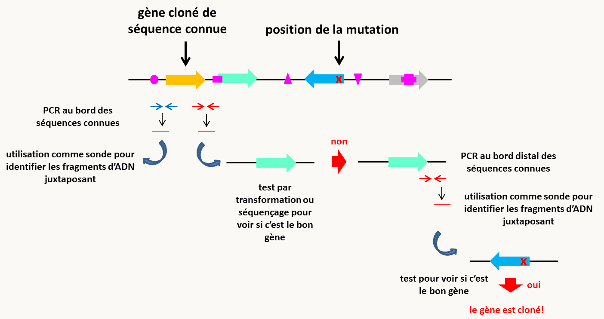

## Le séquençage complet des génomes

Avec le développement des nouvelles technologies de séquençage à haut débit, l'identification des gènes peut maintenant se faire en séquençant les génomes des mutants puis en comparant la séquence obtenue avec celle de référence de la souche sauvage. Si cette méthode semble simple dans son précepte, il faut néanmoins faire attention dans l'application car il est possible de mal identifier une mutation importante et de se focaliser sur une mutation en fait sans intérêt. De fait, un traitement mutagène aboutit très souvent à l'accumulation de mutations qui n'ont rien à voir dans la genèse du phénotype d'intérêt. De plus, la présence de nombreux polymorphismes dans les génomes chez de nombreuses espèces (comme l'homme par exemple) peut rendre difficile l'identification par séquençage globale des génomes mutants.

Pour circonvenir le premier problème, il suffit de faire une **introgression** avec la souche parentale qui n'a pas subi de traitement mutagène (figure 130 à gauche). Au premier tour de croisement avec la souche sauvage vierge de traitement, la moitié du génome des descendants proviendra de cette souche, au deuxième tour un quart, etc. Si bien qu'après six croisements, il ne reste plus dans les descendants mutants en théorie que 1.5 % du génome de la souche ayant subi le traitement mutagène. Il ne reste donc plus dans le génome de ces souches F6 qu'une petite région génomique autour de la mutation d'intérêt. Il suffit de séquencer le génome d'une seule de ces souches et de la comparer avec la séquence de référence de la souche parentale. C'est cette technique que nous utilisons dans mon laboratoire pour identifier les mutations chez *Podospora anserina*, chez qui les génomes des souches *mat+* et *mat-* sont identiques (sauf autour du type sexuel). Au contraire, chez *Neurospora crassa*, il est impossible de croiser des souches *mata* et *matA* ayant des génomes très similaires. Chez cette espèce, il est donc difficile de différencier entre les polymorphismes et les vraies mutations recherchées. Les généticiens utilisent alors une deuxième méthode (figure 130 à droite) de séquençage en pool. Pour ce faire, un croisement sauvage par mutant est réalisé et la descendance est phénotypée. Puis l'ADN est extrait collectivement d'un pool de descendants mutants et d'un pool de descendant sauvages. Les deux ADN sont ensuite séquencés et comparés. Seule la mutation d'intérêt (et les polymorphismes qui lui sont liés génétiquement) va se retrouver dans l'ADN des mutants et donc dans 100% des séquences qui recouvrent cette mutation. Les polymorphismes non liés seront quant à eux présents dans seulement 50% des séquences. Bien évidemment plus les polymorphismes liés seront proches de la mutation, plus la fréquence des séquences qui les contiennent sera proche de 100 %.

En général, pour obtenir les gènes candidats porteurs de mutations potentielles, il suffit de "mapper" en utilisant des programmes informatiques *ad hoc* les fragments de séquences obtenus par séquençage à haut débit sur la séquence de référence, c'est à dire de placer sur le génome l'ensemble des séquences obtenue via le séquençage à haut débit (figure 131). Des programmes informatiques donnent ensuite la position des mutations potentielles dans le génome.

![résultat d'un mapping des courtes séquences obtenues à partir du mutant spod1 via le séquençage à haut débit (traits bleus) sur la séquence de référence de la souche sauvage (en bas, les boites représentent les séquences codantes) chez Podospora anserina. Seule une courte région d'intérêt est montrée. Les différences entre les séquences du mutant et celle de la souche de référence sont en rouge. On voit la présence de nombreuses erreurs de séquence dispersées dans les différentes séquences obtenues par le séquençage à haut débit, ce qui est usuel avec les technologies actuelles. La position de la mutation (indiquée par la flèche rouge) est par contre bien visible sous la forme d'un trait rouge car la différence de séquence avec la souche sauvage est présente dans quasiment toutes les séquences. En haut, le détail des séquences autour de la mutation montre qu'il s'agit d'une transition de C vers T entraînant le changement au codon 289 d'une glycine par un acide glutamique dans un gène appelé PaIPK2 codant pour une inositol-polyphosphate kinase.](img/image131.png)

Notez que comme pour les deux autres cas d'identification de gènes via l'expression des allèles sauvages ou mutants ou via le clonage positionnel, les candidats doivent être validés soit en complémentant la mutation chez les organismes transformables, soit en séquençant plusieurs individus porteurs et non porteurs de la mutation. Par exemple, la mutation de PaIPK2 (figure 131) a été validée comme responsable des phénotypes présentés par le mutant spod1 en transformant l'allèle sauvage du gène spod1+ dans le mutant spod1, car ce mutant était récessif. Tous les transformants obtenus avait le phénotype sauvage.

Notez que l'analyse du mutant n°2218 de *Podospora anserina* permet d'illustrer élégamment la nécessité de valider les gènes candidats identifiés par une des trois méthodes exposées ci-dessus, en complémentant correctement la mutation si elle est récessive ou en vérifiant que l'expression de l'allèle mutant dominant dans la souche sauvage provoque bien le phénotype mutant. En effet, la mutation récessive présente dans ce mutant 2218 a été identifiée par clonage positionnel: il s'agissait d'une délétion d'environ 1560 pb après le gène *PaCdk5* et tronquant le début du gène *PaNip3* (figure 132). De manière surprenante, l'introduction de l'allèle sauvage du gène *PaNip3* ne permet pas de restaurer un phénotype sauvage. D'ailleurs sa délétion n’entraîne pas de phénotype visible. L'introduction de l'allèle sauvage du gène *PaCdk5* permet de restaurer un phénotype sauvage mais que si l'ADN s'intègre au locus *PaCdk5*. S'il s'intègre ailleurs dans le génome, il n'y a pas de complémentation des phénotypes mutants (pas de complémentation en *trans*) ! Ce phénomène étrange a pu être compris lorsqu'il a été déterminé que le gène responsable des phénotypes était le gène *PaTim54*. La délétion entraîne une diminution de 80% de son expression, par un mécanisme encore incompris mais qui pourrait être lié à un changement de structure de la chromatine de la région environnante. L'introduction de l'allèle sauvage du gène *PaTim54* même dans une région distante du locus *PaTim54* (sur un autre chromosome par exemple) permet de restaurer un phénotype sauvage, montrant qu'il est bien le gène important. L'introduction au locus *PaCdk5* de l'allèle sauvage *PaCdk5* restaure l'expression correcte du gène *PaTim54*, probablement en restaurant une structure correcte de la chromatine dans la région.  Notez que le clonage par expression aurait pu aboutir à l'identification incorrecte de *PaCdk5* comme étant le gène important, si l'analyse n'avait pas été poussée plus loin que l'obtention d'une complémentation par réintroduction de l'allèle sauvage de *PaCdk5* dans le mutant n°2218!

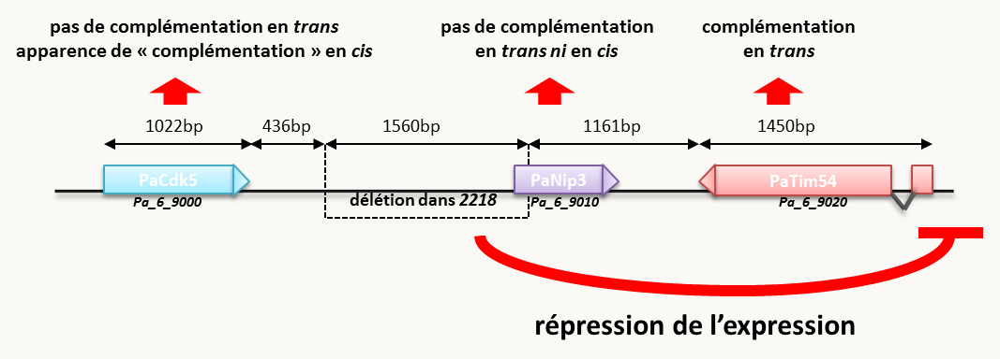

# Chapitre 7: L'analyse phénotypique

Le phénotype est l'ensemble des caractéristiques, morphologiques, physiologiques, métaboliques, développementales, comportementales etc... d'un individu. La présence de modifications du phénotype par les mutations permet d'avoir des indications sur le rôle des gènes dans la physiologie et le développement cellulaire ou des organismes. En effet, un gène code une protéine ou un ARN qui effectue à son tour une action physiologique:

- Une protéine de structure participe à la mise en place de structures intra-nucléaires (histones...), cellulaires (actine, myosine, tubuline, protéines membranaires...) ou extracellulaires (collagènes, élastines...)
- Un enzyme catalyse une ou plusieurs réactions
- Une protéine régulatrice (activateur ou répresseur de transcription, traduction...) influe sur le niveau d’expression d’autres gènes. Elle peut agir seule ou faire partie d'un complexe multipeptidique (ribosome, splicesome, protéasome...)
- si c'est un ARN il peut jouer un rôle structural et ou catalytique (par exemple dans le ribosome) ou régulateur (ARN antisens...)

Le produit du gène participe à l'élaboration du phénotype, qui est le résultat visible de l'action de toutes les protéines et de tous les ARN actifs, présents à un moment donné de la vie de l'organisme ou de la cellule. Nous avons vu que les effets des mutations sur le phénotype va dépendre de leur nature mais aussi des produits qu'elles altèrent. Réciproquement, une analyse fine des phénotypes permet d'obtenir des informations sur la nature de la mutation mais aussi éventuellement sur le type de produits codé par le gène qu'elle perturbe.

## Pléiotropie ou mutations multiples?

Nous avons vu au chapitre 1 qu'il existe des mutations dites **pléiotropes** qui peuvent entraîner des phénotypes multiples. L'analyse de la ségrégation permet souvent de savoir si des altérations phénotypiques multiples sont bien dues à la présence d'une seule mutation, car dans ce cas toutes les différences phénotypiques vont co-ségréger ensembles au cours des générations. Néanmoins, même s'il y a co-ségrégation de toutes les différences phénotypiques et donc une seule mutation, il est possible que plusieurs gènes soient en jeu. C'est par exemple le cas si la mutation est une délétion qui englobe plusieurs gènes voisins. C'est aussi le cas, si la mutation modifie la structure de la chromatine et perturbe l'expression de plusieurs gènes voisins.

Si la mutation n’affecte qu’un seul gène il faut se demander si celui-ci donne naissance à une seule protéine ayant plusieurs fonctions ou à plusieurs protéines ayant des fonctions différentes (par exemple par épissage alternatif). S'il n'y a qu'une seule protéine affectée et que le phénotype est complexe on dit alors qu'il est pléiotrope, c’est-à-dire que la mutation d'un seul gène donne plusieurs phénotypes mutants. On en conclut que le produit du gène intervient dans un processus affectant plusieurs aspects de la physiologie comme la signalisation, une voie métabolique centrale, la transcription, la traduction, la dégradation des protéines, etc.

## Base physiologiques de la dominance et de la récessivité

La récessivité ou la dominance d'une mutation est une indication importante quant à la nature de la mutation et par ricochet quant à la fonction du gène altéré. En effet, on s'attend à ce qu'une mutation récessive soit plutôt une perte de fonction puisque la présence de l'allèle sauvage permet de la compenser. Au contraire, une mutation dominante serait plutôt un gain de fonction puisque la présence du produit sauvage ne permet pas d'éliminer son effet. Néanmoins, si le dosage du produit du gène muté est important, une perte de fonction de ce produit peut avoir un effet dominant ou le plus souvent semi-dominant, si dans l'hétérozygote mutant/sauvage, il n'y a pas assez de produit pour assurer une activité sauvage. On dit alors que ces allèles sont  **haplo-insuffisants**. Nous avons vu dans le chapitre 1 quelques définitions concernant l'effet des allèles sur le fonctionnement des gènes. En revoici une liste exhaustive:

- **Allèles perte-de-fonction**
  - **Allèle amorphe ou nul** : correspond à une mutation qui abolit complètement la fonction du produit du gène ; celui-ci est totalement inactif ou absent.
  - **Allèle hypomorphe** appelé aussi "**leaky**" : le produit du gène est synthétisé et il a la même fonction que le produit sauvage, mais la mutation fait que, soit il est en quantité plus faible, soit il est moins actif.

- **Allèles gain-de-fonction**
  - **Allèle hypermorphe** : le produit est fonctionnellement équivalent au produit sauvage mais il est fait présent en plus grande quantité.
  - **Allèle néomorphe** : le produit est fonctionnellement différent du sauvage ou bien il est équivalent au produit sauvage mais délivré au mauvais moment ou au mauvais endroit.
  - **Allèle antimorphe** ou **dominant négatif**: le produit fabriqué à partir de l'allèle mutant possède une activité antagoniste de celle du produit sauvage.

### Comment savoir à quel type d'allèle on a affaire?

La réaction du phénotype devant un nombre croissant de copies du gène muté permet de distinguer entre différents types d'allèles:

- Pour un allèle amorphe, l'addition de copies supplémentaires du gène muté n'a aucun effet supplémentaire sur le phénotype
- Par contre pour un allèle hypomorphe, qui conserve une fraction de la fonction sauvage, on se rapprochera du phénotype sauvage en multipliant le nombre de copies
- Pour un allèle hypermorphe, on observera à l’inverse une accentuation du phénotype mutant si le nombre de copie augmente

De même la modulation du nombre d'allèles sauvage en présence d'allèles mutants permet de différencier certains allèles dominants

- Pour un allèle néomorphe, qui a une fonction nouvelle, l'addition de copies du gène sauvage ne change rien au phénotype mutant.
- Au contraire, un allèle antimorphe sera titré par l'addition de copies sauvage, ce qui atténuera le phénotype mutant. De plus, le phénotype d'un allèle antimorphe sera aggravé en présence d'une délétion du gène sauvage.

la table suivante résume les phénotypes obtenus dans différentes combinaisons alléliques pour les différents types d'allèles:

| Allèle      | Type de mutation                                             | m/m                          | m/+                                   | m/délétion                                        |
| ----------- | ------------------------------------------------------------ | ---------------------------- | ------------------------------------- | ------------------------------------------------- |
| amorphe     | perte de fonction totale (récessive ou semi-dominant*)       | mutant (0 dose)              | sauvage ou intermédiaire* (1 dose)    | mutant ou intermédiaire* (0 dose)                 |
| hypomorphe  | perte de fonction partielle (récessive)                      | mutant (2 fractions de dose) | sauvage (1 dose + 1 fraction de dose) | mutant plus fort (1 fraction de dose)             |
| hypermorphe | gain de fonction davantage de produit (dominante)            | mutant (>>2 doses)           | mutant plus faible (> 2 doses)        | mutant plus faible ou tend vers sauvage (>1 dose) |
| néomorphe   | gain d'une nouvelle fonction (dominante)                     | mutant ou double mutant**    | mutant                                | mutant (double mutant)**                          |
| antimorphe  | gain de fonction antagoniste à la fonction sauvage (dominante) | mutant                       | mutant plus faible                    | mutant                                            |
(*) cas d'haplo-insuffisance.
(**) éventuellement double mutant d’une part à cause de l’absence du produit sauvage (si elle a un phénotype), d’autre part à cause de l’apparition d'une nouvelle fonction et du phénotype qui lui est associé.

Les mutants du gène White-spotting chez la souris permet d’illustrer la variété des allèles de nature différente que l’on peut obtenir pour un seul gène. On connaît en effet de très nombreux allèles affectant ce locus.

- A l'état hétérozygote, tous provoquent des taches blanches sur le pelage. Ils sont donc dominants. Certains allèles présentent à l'état hétérozygote un phénotype supplémentaire, une anémie par manque de globules rouges. Ils sont donc aussi dominants pour l’anémie. Par contre, d’autres allèles sont récessifs pour ce phénotype d'anémie.

- A l'état homozygote, on voit clairement que les différents allèles ont un effet spécifique et variable. Certains confèrent une létalité pendant le développement fœtal. Si on autopsie les fœtus, on constate que le décès a lieu à cause d'une anémie sévère. A ce stade, le développement du pelage n'est pas encore fait donc on ne peut donc pas savoir quelle aurait été la couleur du pelage chez ces embryons avortés. Chez les homozygotes viables, on voit que les taches blanches du pelage sont plus étendues que chez l'hétérozygote: parfois le pelage est complètement blanc, parfois non. Toutefois, l'intensité du phénotype est gradué de la même façon si on compare les hétérozygotes et les homozygotes.

- Pour certains homozygotes viables on voit apparaître un troisième phénotype: un défaut de fertilité. Les allèles concernés sont toujours récessifs.

On a donc affaire à un locus dont les allèles donnent un phénotype pléiotrope c'est-à-dire que les mutations dans ce gène affectent plusieurs fonctions (couleur du pelage, différentiation des cellules sanguine et différentiation de la lignée germinale) qui à première vue n'ont rien à voir entre elles. Il faut donc trouver une explication: on a affaire à un seul gène, de nombreuses études l'ont montré, et il faut donc trouver pour le produit du gène une fonction qui permette de rendre compte des trois effets. Pour cela il faut commencer par examiner le plus finement possible les phénotypes. On va mettre en œuvre différents niveaux d'analyse du phénotype:

- observation macroscopique: mesure de la superficie des taches blanches et mesure du nombre de descendants
- autopsie des fœtus et évaluation de la cause de la mort
- examen des organes chez les mutants viables: examen sanguin, examen des cellules de la peau et dissection des gonades ;

On observe ainsi que dans les trois phénotypes c'est le nombre de cellules spécialisées impliquées dans la production des phénotypes qui est affecté:

- peu ou pas de mélanocytes chez les mutants. La synthèse des pigments du pelage est donc diminuée, non par manque d'un des enzymes impliqués dans la biosynthèse des mélanines  mais par manque des cellules dans lesquelles s'expriment les gènes codant pour les enzymes de biosynthèse des pigments
- peu ou pas d'érythrocytes d'où l'anémie
- peu ou pas de cellules germinales d'où la stérilité

De ces analyses phénotypiques fines ont en conclut que la protéine codée par White-spotting interviendrait dans la prolifération, la différenciation ou la migration des cellules souches de ces différentes lignées cellulaires. L'étape suivante de l'identification par clonage du gène White-spotting a montré qu'il codait pour une protéine de 975 acides aminés ayant les propriétés d'un récepteur transmembranaire à tyrosine kinase (RTK). Ce récepteur, qui agit en dimère, reçoit un signal venant de l'environnement ou de cellules voisines, sous la forme d’un ligand qui se fixe sur son domaine extracellulaire. La fixation du ligand entraîne l’activation du récepteur, qui se traduit par la phosphorylation de certains de ses résidus tyrosine qui pourront à leur tour activer une autre protéine par phosphorylation. la disponibilité de la séquence a permis de caractériser la nature moléculaire de plusieurs allèles, ce qui est résumé dans la table suivante:

### Description phénotypique des allèles

| allèle | nature                              | hétérozygotes Wx/+              | homozygotes Wx/Wx                               |
| ------ | ----------------------------------- | ------------------------------- | ----------------------------------------------- |
| W19H   | délétion totale                     | grosses taches blanches         | létal après 12 jours in utero par anémie sévère |
| W37    | faux-sens 582 E-K                   | grosses taches blanches         | létal après 12 jours in utero par anémie sévère |
| W      | délétion de 78 aa  codon 513-590 | taches blanches                 | létal après 12 jours in utero par anémie sévère |
| W42    | faux-sens 790 D-N                   | tout blanc, anémie              | létal après 12 jours in utero par anémie sévère |
| W44    | faible expression                   | petites taches blanches         | blanc à 85%, fertilité réduite                  |
| W41    | faux-sens 831 V-M                   | petites taches blanches, anémie | blanc à 85%, anémie                             |

La disponibilité de la nature moléculaire des différents allèles permet maintenant de mieux comprendre comment agissent les mutations:

- L'allèle W19H est une délétion du gène White-spotting. Il s'agit donc d'un allèle nul. L'hétérozygote ne produit qu'une dose de protéine sauvage. Il est haplo-insuffisant pour la prolifération des mélanocytes ce qui affecte donc la couleur du pelage. Mais, il est récessif pour l’hématopoïèse et le développement des cellules germinales. Il s’ensuit qu’une dose de protéine est suffisante pour assurer le développement des cellules érythroïdes et germinales mais pas celui des mélanocytes. L'absence totale de produit est létale par anémie à 12 jours de gestation. Le produit du gène White-spotting est donc essentiel à la vie des souris.

- L'allèle W37 se comporte exactement comme W19H. La mutation faux-sens en position 582 qui change un acide glutamique en lysine est une mutation nulle. La protéine est présente mais totalement inactive. Par dosage de l'activité d'autophosphorylation à partir d'ATP marqué, on montre en effet que cette réaction n'a plus lieu chez le mutant. Ce faux-sens touche donc un acide aminé essentiel dans l'activité d'autophosphorylation qui précède le transfert du phosphate sur une protéine substrat.

- L'allèle W contient comme W19H une mutation nulle. Des expériences de localisation de la protéine tronquée montrent qu'elle n'est plus présente à la surface des cellules. De fait,  la délétion de 78 aa affecte un des domaines transmembranaires abolissant l'ancrage de la protéine dans la membrane.

- L'allèle W42 est intrigant car il montre à l'état hétérozygote un phénotype plus fort (un pelage entièrement blanc et une anémie) que l'allèle nul de référence! Il est donc aussi dominant pour l'hématopoièse. L'analyse de l'activité protéique montre que le faux-sens en position 790 qui change un acide aspartique en asparagine abolit l'activité d'autophosphorylation. Mais la protéine mutante est présente et sa présence diminue donc probablement l'activité de la protéine sauvage. Il s'agit d'un allèle dominant négatif ou antimorphe. On sait que la protéine codée par White spotting agit sous forme dimérique : un monomère mutant peut donc s'associer avec un monomère sauvage pour donner un dimère inactif.

- L'allèle W44 est perturbé dans son expression: le taux de transcrit est de 20% du sauvage environ. Le phénotype est plus léger que chez l'allèle nul. Il s'agit donc d'un allèle hypomorphe.

- L'allèle W41 se comporte à l'état hétérozygote comme l'allèle W42, son phénotype est plus accentué que chez l'allèle nul, il doit donc y avoir là aussi interférence avec l'allèle sauvage. *In vitro* la protéine mutante a une activité d'autophosphorylation diminuée mais pas nulle. Ceci expliquerait que les individus homozygotes soient viables, bien qu'anémiés. Cependant l’interaction des monomères mutants avec les monomères sauvages dans les hétérozygotes n'aboutit qu'à une diminution partielle de l'activité. W41 est donc un allèle antimorphe ayant une perte de fonction partielle.

En conclusion, les mutants de White-spotting offre un bel exemple de ce que l'on peut tirer de l'analyse de la complexité des phénotypes et des renseignements qu'on peut en tirer en conjonction avec une analyse moléculaire, biochimique et cytologique. Beaucoup de travail, venant de nombreuses équipes de chercheurs, ont été nécessaires pour faire d'abord l'analyse génétique chez la souris, puis la corrélation avec d'autres mammifères (chat, humain, cheval...). Ces analyses génétiques ont été suivies par des analyses moléculaires et biochimiques, puis avec un raccord avec les études sur le cancer. En effet, certaines tumeurs chez les mammifères comme des sarcomes chez le chat sont dues à une dérégulation du gène White-spotting dans les cellules somatiques.  On peut d’ailleurs remarquer que parmi tous les allèles du gène Whire-spotting,  les généticiens n’en ont isolé aucun qui correspondrait à un allèle hypermorphe, où le récepteur serait constitutivement activé. Ce peut être le cas s'il n'y a plus besoin de ligand pour déclencher la phosphorylation. On peut alors faire l’hypothèse que les allèles hypermorphes sont létaux à l’état hétérozygote, dès le stade embryonnaire précoce. Ceci est compatible avec l'observation que des mutations somatiques équivalentes provoquant une surexpression non régulée de la protéine ont un effet dévastateur car entraînant une prolifération cellulaire. Dans un embryon en cours de développement, l'effet d'une prolifération cellulaire anarchique est bien évidemment catastrophique.

Dans le même ordre d'idées que l'analyse fine de la dominance/récessivité des mutations, je vous rappelle que la présence d'exceptions à la complémentation (c'est à dire la complémentation interallélique et la non-complémentation intergénique) permet d'avoir quelques informations sur les rôles et la structure des produits codés par les gènes mutés: protéines ayant plusieurs fonctions, protéines homo-polymériques ou protéines hétéro-polymériques  (voir la section  sur les limites du test de complémentation dans le chapitre 4).

### Autonomie cellulaire de l’expression d’un gène

L'analyse phénotypique fine de mutants permet aussi d'avoir des informations sur le lieu d'action des gènes. En particulier, nous avons vu dans la section sur les crossing-over mitotiques du Chapitre 6 qu'il existe des gènes dits **autonomes cellulaires** dont les produits qu'ils codent ne diffusent pas à l'extérieur de la cellule et des gènes dits **non autonomes cellulaires** pour lesquels les produits qu'ils codent diffusent à l'extérieur de la cellule. Il existe des techniques simples qui permettent de déterminer le mode de fonctionnement des gènes et le lieu d'action des produits qu'ils codent.

Nous prendrons l'exemple du développement du périthèce chez *Podospora anserina* (figure133). Pour rappel, le périthèce est la fructification de cette espèce de champignon dans laquelle a lieu la reproduction sexuée.

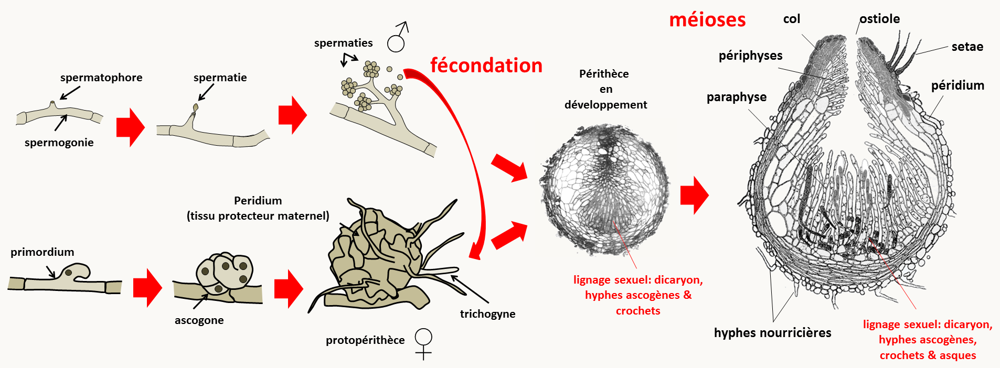

Chez cette espèce, dont le cycle ressemble fortement à celui de *Neurospora crassa* (voir Introduction Générale),  Les deux types sexuels sont appelés *mat+* et *mat-*. Comme chez *Neurospora crassa*, le périthèce résulte de la fécondation d'un gamète femelle (l'ascogone protégé par un péridium pluricellulaire dont l'origine provient du mycélium qui l'entoure) par un gamète mâle (ou spermatie). Trois partenaires sont impliqués dans son développement:

- Le tissu sexuel qui résulte de la fécondation de l'ascogone par une spermatie de type sexuel opposé
- Le tissu maternel protecteur ou nourricier: péridium, paraphyse, périphyse et autres cellules d'origine maternelle
- Le mycélium sous-jacent contenant les réserves énergétiques et qui nourrit la fructification en développement

De nombreux mutants affectant le développement de ce champignon sont disponibles. Comment savoir si les produits des gènes qu'ils codent sont importants dans le mycélium, le tissu maternel ou le tissu sexuel? Comment savoir si les produits qu'ils codent sont diffusibles?

Trois expériences simples d'analyses phénotypiques fines des mutants ont été développées pour répondre à ces questions. La première consiste dans la greffe de périthèce (figure 134).

La greffe d'un périthèce sauvage (c'est à dire issu d'un croisement sauvage x sauvage) sur du mycélium sauvage est très efficace car plus de 90% des périthèces greffés continuent leur développement sans accroc. Il est aussi possible de les greffer sur du mycélium mutant. Si le périthèce sauvage continue son développement dans les mêmes proportions que sur du mycélium sauvage, c'est que le produit du gène mutant n'est pas essentiel dans le mycélium, dans le cas contraire, il l'est. Si le mutant produit des périthèces (qui arrêtent leur développement), la greffe de ces périthèces sur du mycélium sauvage permet de savoir si le produit du gène est important dans le périthèce, auquel cas les périthèces ne continuent pas leur développement, ou non, auquel cas ils continuent leur maturation. Notez que dans le cas de la greffe de périthèces mutants sur du mycélium sauvage, si le produit du gène affecté n'est pas à expression autonomes cellulaires, il peut diffuser du mycélium dans le périthèce et venir masquer le fait que le produit du gène est nécessaire dans la fructification.

La deuxième analyse consiste en la construction d'une mosaïque génétique du mutant avec *Δmat*, une souche pour laquelle le type sexuel a été délété (figure 135). Une souche délétée du type sexuel ne peut pas engager la reproduction sexuée car elle ne peut pas reconnaître un partenaire sexuel compatible. Par contre, elle produit des gamètes mâles et femelles (inactifs donc) et surtout tous les tissus maternels requis pour le développement du périthèce.

Les mosaïques avec la souche *Δmat* permettent donc de savoir si  un gène est important pour la fécondation et le développement du tissu sexuel ou non. En effet, la mosaïque, qui est un tricaryon fabriqué en mélangeant la souche *Δmat* avec les souches mutantes *mat+* et *mat-*, ne produira des périthèces que si le gène n'est pas requis pour la fécondation et les étapes suivantes du développement du tissu sexuel. En effet, dans ce cas, la souche *Δmat* peut fournir (complémenter) les tissus maternels déficients dans le mutant. Au contraire, si c'est la fécondation et/ou le tissu sexuel qui sont affectés dans le mutant alors, la souche *Δmat* ne peut pas suppléée à cette déficience.

La troisième analyse consiste en la construction d'une mosaïque du mutant avec une souche *PaPks1-193* de type sexuel opposé. Le gène *PaPsk1* code pour un enzyme catalysant la première étape de la synthèse de mélanine chez *Podospora anserina*. La mutation *PaPks1-193* abolit la synthèse de pigment et entraîne donc une dépigmentation du mycélium, des fructifications et des ascospores. Ce gène est à expression autonome cellulaire. Cela se voit facilement car dans un croisement sauvage x *PaPks1-193* les ascospores d'un même asque portant l'allèle sauvage sont noires et celles portant *PaPks1-193* sont blanches. De même,  si on fabrique un hétérocaryon sauvage/*PaPks1-193*, celui-ci va produire un mélange de périthèces complètement blancs ou complètement verts, avec cependant quelques rares périthèces mosaïques ayant une partie de leur péridium blanche et une autre partie verte. Cela confirme que PaPks1 est à expression autonome cellulaire et montre aussi que le nombre de cellules qui initient le péridium est faible puisque la probabilité qu'il y ait des cellules sauvages et de cellules *PaPks1-193*  à l'origine d'un périthèce est faible.

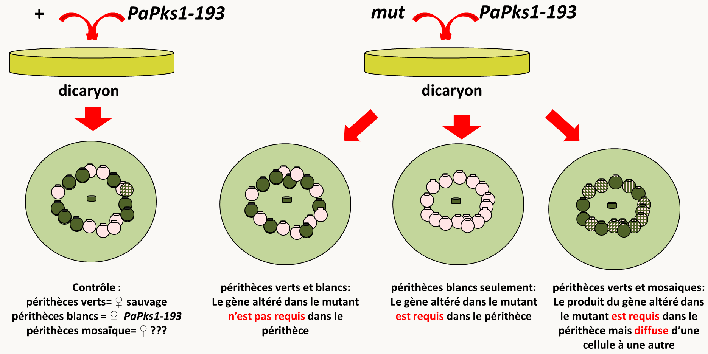

Les mosaïques fabriquées avec un mutant stérile et *PaPks1-193* peuvent présenter plusieurs types de fructifications. Soit, comme avec la souche sauvage, on observe des périthèces blancs et des périthèces verts, indiquant que le gène muté n'est pas requis dans le périthèce. Soit on observe uniquement des périthèces blanc indiquant que le gène est requis dans le périthèce et que  son produit ne diffuse pas. Soit on voit un mélange de périthèces verts et de périthèces mosaïques en quantité beaucoup plus importante que dans une mosaïque avec la souche sauvage, indiquant alors que le produit du gène est essentiel dans le périthèce mais qu'il diffuse car quelques cellules sauvages présentes dans le péridium suffisent pour une maturation correcte de la fructification.

Ces méthodes ne sont pas circonscrites à l'analyse du développement de la fructification chez *Podospora anserina*. En effet, greffes et mosaïques génétiques sont fréquemment utilisées aussi chez les animaux et les plantes pour analyser leur développement.

# Chapitre 8 : Les interactions géniques

Afin de déterminer les implications des gènes dans les divers processus du vivant, nous avons vu dans les chapitres 3 à 7 que les mutagenèses, qu'elles soient directes ou inverses, fournissent des mutants qui vont pouvoir être analysés à l'aide de techniques multiples, dont nous avons détaillés quelques exemples. Toutefois, si les informations obtenues par les méthodes décrites précédemment sont importantes, elles ne concernent principalement que les gènes pris isolément. Or, dans la physiologie cellulaire, les gènes agissent souvent de concert au sein de voies métaboliques ou de régulation pour effectuer leurs fonctions. De fait, nous avons vu au Chapitre 4, que l'analyse de la complémentation, en particulier lorsque il y a des exceptions au principe général, permet de suggérer des interactions entre les produits codés par plusieurs gènes. L'analyse des interactions entre mutations permet effectivement donc d'acquérir des informations supplémentaires par rapport à l'analyse des mutants isolément.

La méthodologie générale consiste à construire des doubles mutants (avec des mutations à l'état homozygote dans le cas de mutations récessives) et à observer leurs phénotypes. Formellement, il existe trois types d'interactions possibles:

- les deux mutations ne montrent pas d'interaction et le double mutant présente les phénotypes additionnés des deux mutations.
- les deux mutations ont des effets antagonistes. Le double mutant peut ne présenter par exemple que le phénotype d'une seule des deux mutations: on parle alors d'un effet **épistatique**. Le double mutant peut aussi présenter un phénotype plus proche de celui du sauvage, voire le phénotype sauvage : on parle alors d'effet **suppresseur**.
- les deux mutations voient leurs effets amplifiés de manière coopérative ou synergique, si bien que le double mutant présente un phénotype fortement aggravé par rapport à ce qui est attendu par la simple addition des mutations: on parle alors d'effet **accentuateur**.

Nous allons voir successivement chacun de ces types d'effets et ce que leur présence indique quant à la fonction des gènes.

## L’épistasie

Définition:  Une mutation est dite **épistatique** sur une autre mutation si le double mutant ne présente que le phénotype de cette mutation, alors que celui de l'autre est masqué. La mutation dont le phénotype est masqué est dite **hypostatique**. Comme pour la dominance/récessivité, il s'agit d'une sorte de relation de domination, mais:

- les relations de dominance/récessivité concernent les allèles d'un même gène
- l'épistasie/hypostasie concernent des allèles de gènes différents

Par extension, on dit qu'un gène est épistatique sur un autre (qui sera alors hypostatique) si les mutations de ce gène sont épistatiques sur celles affectant le gène hypostatique.

Des effets d'épistasie vont souvent se produire dans le cas où les mutations affectent des gènes qui participent à une même voie de biosynthèse, une même voie de régulation/signalisation ou un même processus développemental. Nous allons voir que l'interprétation des données d'épistasie n'est pas toujours simple. En effet, prenons comme premier exemple une voie de biosynthèse linaire d'un produit pour lequel un des intermédiaires est toxique ou coloré (figure 137). Les mutants dans ce gène seront létaux (ou pigmentés). Les doubles mutants possédant cette mutation létale ou pigmentant et une autre mutation située en amont dans la chaîne de biosynthèse seront viables ou incolore, puisque le produit toxique ou coloré ne sera pas fabriqué. Le gène agissant en amont est donc épistatique sur celui en aval. De même, les doubles mutants possédant cette mutation létale ou pigmentant et une autre mutation située en aval dans la chaîne de biosynthèse seront létaux ou colorés, puisque le produit est fabriqué dans ce type de doubles-mutants. Une fois encore c'est le gène situé en amont qui est épistatique. Le même raisonnement s'applique dans le cas d'une voie de développement linéaire (figure 137): c'est le gène contrôlant l'étape la plus en amont qui sera épistatique sur les gènes situés plus en aval.

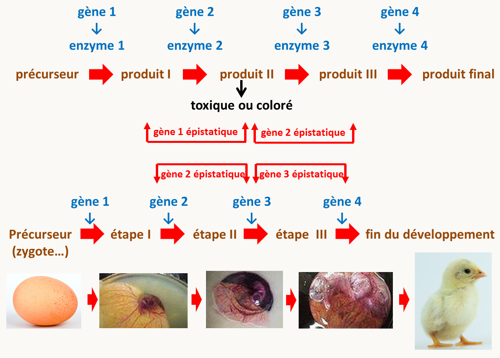

Maintenant si on regarde ce qu'il se passe dans une voie de signalisation ou de régulation linéaire comportant des activateurs et des répresseurs (figure 138); on voit que les gènes épistatiques sont ceux qui sont en aval lorsque l'épistasie est testée entre un activateur et un répresseur. Pour voir ceci, raisonnons à partir des mutations perte-de-fonction qui sont les plus fréquentes.

- Si la régulation est positive, c'est à dire que le partenaire situé en amont active celui situé en aval, une mutation nulle dans le gène amont entraîne une absence de réponse au signal comme c’est normalement le cas chez le sauvage.

- Si la régulation est négative,  c'est à dire que le partenaire situé en amont réprime celui situé en aval, une mutation nulle dans le  gène amont codant donc un répresseur entraîne que la partie de la voie de signalisation située en dessous est active en l’absence de signal : on dit que l'expression de la voie est **constitutive**.

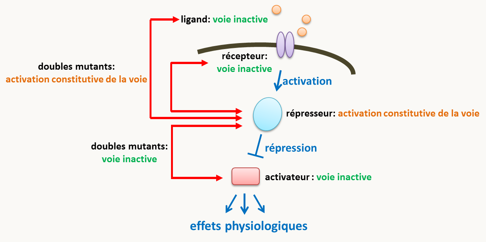

On voit maintenant facilement que:

- un double mutant affecté pour un répresseur et un activateur situé en amont de celui-ci aura une activation constitutive de la partie de la voie située en aval du répresseur.
- un double mutant affecté pour un répresseur et un activateur situé en aval de celui-ci n'aura pas d'activation de la voie. En effet, le signal constitutif d'activation de la voie sera arrêté par l'absence de l'activateur situé en dessous.

En conclusion dans les deux cas, c'est le gène situé en aval qui est épistatique. Au contraire, si les deux mutations affectent deux activateurs (comme par exemple, le récepteur et l'activateur le plus en aval de la figure 138), la voie se comportera comme dans le mutant de l'activateur le plus en amont. Toute la partie située en dessous de l'activateur le plus en amont sera inactive et donc ce sera cette fois le gène le plus en amont qui sera épistatique. C'est aussi le cas si les deux mutations affectent deux répresseurs car la partie située en aval du premier répresseur sera constitutivement active. Notez que généralement, les mutations dans les gènes codant les activateurs d'une voie de signalisation linéaire auront tous le même phénotype et il est donc pas possible d'observer une épistasie. Il en va de même avec les répresseurs.

Dans le cas de voies branchées les résultats peuvent être plus complexes (figure 139).

![épistasie dans une voie de biosynthèse branchée et complexe. Dans cette voie, deux précurseurs produisent deux pigments (ici un jaune, le pigment 1, et un bleu, le pigment 2) via deux voies linéaires. Les mutants dans les gènes de biosynthèse du pigment 1 sont donc bleus et ceux dans les gènes de biosynthèse du pigment 2 sont jaunes, alors que le sauvage sera vert. Il y a en plus des gènes codant pour des enzymes impliqués dans le dépôt correct des pigments; leurs mutants seront blancs car les pigments ne seront pas correctement déposés. On voit clairement que dès qu'un des gènes impliqués dans le dépôt des pigments est muté, la souche sera blanche, peu importe le(s) pigment(s) fabriqué(s). Ces gènes sont donc épistatiques sur les gènes de fabrication des pigments 1 et 2, bien qu'ils agissent en aval.](img/image139.png)

On voit donc qu’il est nécessaire de connaître assez précisément la nature des processus biologiques en cause pour pouvoir interpréter correctement les relations d’épistasie. C'est particulièrement vrai si les voies sont branchées ou complexes. Néanmoins, l'obtention de données d'épistasie permet de formuler des hypothèse quant aux relations entre gènes, en particulier dans leur ordre d'intervention dans une voie de biosynthèse, développement et particulièrement de signalisation ou régulation.

### Comment ordonner deux gènes impliqués dans une voie de signalisation?

L'épistasie est d'un grand intérêt pour ordonner les gènes dans des voies de signalisation ou de régulation pouvant mettre en jeu, en cascade, de nombreux gènes. Pour ceci, il faut évaluer les relations d'épistasie sur les gènes deux par deux. Ceci nécessite de posséder des mutants affectés dans les deux gènes et ayant des phénotypes différents, car bien évidemment si les phénotypes conférés sont identiques, il n'est pas possible de voir si l'un masque l'autre...

Il faut dans un premier temps créer un double mutant, par croisement. Si les mutations sont dominantes il suffit que les mutations soient présentes même à l’état hétérozygote dans le même organisme. Si les mutations sont récessives, il faut alors créer un double mutant homozygote pour les deux mutations.

On observe ensuite le phénotype du double mutant: la mutation épistatique est celle dont le phénotype l'emporte. Pour interpréter les résultats sans risque de se tromper, il faut prendre quelques précautions:

- Il faut que les deux gènes interviennent bien sur la même voie et non sur deux voies parallèles. Dans ce dernier cas on le saura rapidement, car le phénotype du double mutant n'est pas celui de l'un ou de l'autre mais au minimum une addition des deux phénotypes.
- les deux gènes doivent être complètement inactifs chez les deux simples mutants si ceux-ci ont  des pertes de fonction. En effet, l'interprétation peut être difficile dans le cas de mutants hypomorphes (voir la section sur  les effets accentuateurs).
- Il faut que le signal et les deux gènes étudiés soient les seuls déterminants du phénotype dans l'expérience: tous les autres gènes sont donc supposés fonctionner de façon sauvage chez les simples et doubles mutants.

Si ces critères sont observés, on peut alors en déduire:

- Si les deux phénotypes observés chez les deux simples mutants sont de même type - tous les deux ont une voie inactive ou tous les deux ont une voie constitutives - alors la mutation épistatique est dans le gène amont. Si les deux phénotypes observés chez les simples mutants sont l'un inactif l'autre constitutif, alors la mutation épistatique se trouve dans le gène aval (voir la figure 138).

Cette règle peut s’exprimer aussi de la manière suivante, qui est équivalente :

- Si c'est le même état du signal qui révèle le phénotype mutant chez les deux simples mutants, la mutation épistatique se trouve dans le gène amont; si c'est un état opposé du signal elle se trouve dans le gène aval.

Pour illustrer cette méthode, voici un exemple d'analyse de relation d'épistasie utilisant *Saccharomyces cerevisiae*. Cette levure sait utiliser le saccharose comme source de carbone car elle possède une invertase qui hydrolyse ce sucre en glucose et fructose. Normalement, en présence de glucose ou de son analogue non métabolisable le 2-deoxyglucose, la synthèse d'invertase est réprimée: une souche sauvage est donc incapable de croître sur du milieu contenant du 2-déoxyglucose et du saccharose. Deux mutants haploïdes de régulation de la voie d'utilisation du saccharose comme source de carbone ont été isolés:

- Le mutant *snf1-* ne peut pas pousser sur du milieu avec du saccharose comme seule source de carbone (mais il pousse très bien sur glucose). Chez ce mutant le gène codant l'invertase est sauvage.
- Le mutant *cid1-* pousse en présence de saccharose + 2-déoxyglucose.

Dans le cas de la mutation *snf1-* on a une expression abolie de l'invertase. Au contraire, dans le mutant *cid1-* on a un phénotype constitutif. Les deux mutations étant récessives et donc des pertes de fonction, *snf1* code un activateur et *cid1* pour un répresseur.

L'analyse du double mutant *snf1- cid1-* montre qu'il a le même phénotype que le simple mutant *snf1-*. La mutation  *snf1-* est donc épistatique sur la mutation *cid1-*. Les deux phénotypes sont opposés chez les simples mutants, on en conclut que le gène agissant en aval est *snf1* et que donc *cid1* réprime directement ou indirectement l'activité de *snf1*.

### Les groupes d'épistasie

Lorsque l'on possède des mutants ayant un phénotype semblable, il est possible de les regrouper en groupes présentant entre eux des relations d'épistasie, indiquant que les gènes pour lesquels ils sont affectés agissent dans une même voie. Les différents groupes formés sont alors appelé **groupes d'épistasie**.

Par exemple,  la recherche de mutants sensibles aux rayons UV chez *Saccharomyces cerevisiae* a permis le criblage de 96 mutants indépendants, appelés mutants *rad*, comportant chacun une seule mutation récessive. Les mutants ont été croisés deux à deux pour tester la complémentation. Ceci a permis de regrouper les allèles dans 30 groupes de complémentation différents qui correspondent donc en première approximation à 30 gènes différents. Ces 30 gènes interviennent-ils tous dans le même processus de réparation, les uns à la suite des autres, ou bien y-a-t-il plusieurs manières de réparer?

Pour répondre à cette question, une analyse d'épistasie a été entreprise. Tous les doubles mutants possibles entre les allèles de gènes différents pris deux à deux ont donc été construits; néanmoins pour simplifier, un seul allèle par gène est testé, ce qui représente déjà 30 x 29= 870 double mutants! Pour ceci, les diploïdes sauvages construits pour le test de complémentation ont été mis à sporuler. Après méiose et ségrégation, un quart des spores est double mutante. Si les deux locus sont liés l'analyse est un peu plus compliquée car les doubles mutants, qui ne sont obtenus que par crossing-over, sont donc plus rares.

Ensuite, la sensibilité aux UV pour chaque simple mutant haploïde et pour tous les doubles mutants haploïdes a été évaluée:

- Si la sensibilité aux UV du double mutant était la même que celle de l'un des deux simples mutants, c'est qu'il y a une relation d'épistasie entre eux, donc qu'ils font partie de la même voie de réparation, dans laquelle ils interviennent séquentiellement.

- Si la sensibilité du double mutant est l'addition de celle des deux simples mutants c'est que les deux gènes interviennent dans des processus différents dont les effets sur le phénotype s'additionnent chez le double mutant.

En procédant ainsi systématiquement on est arrivé à classer les 30 gènes dans trois groupes d'épistasie différents, suggérant trois mécanismes indépendants de réparation des lésions UV. L'un d'eux en particulier, appelé groupe RAD3, regroupe des gènes dont les produits sont impliqués dans la réparation par excision de nucléotides après lésions créées par les radiations.

## La suppression

Le deuxième type de relation entre mutations concerne les effets antagonistes. Notez qu'une mutation épistatique peut avoir un effet antagoniste sur une autre rien qu'en masquant son phénotype. Néanmoins, il existe d'autres manières pour une mutation d'annuler le phénotype d'une autre. Généralement, l'antagonisme entre mutations n'est pas testé de manière dirigée comme dans le cas de l'épistasie, mais se constate, voire s'utilise, au cours d'expériences de mutagenèse. En effet, une technique classique de génétique consiste à sélectionner des mutations ayant des effets antagonistes d'une autre mutation dans un gène déjà bien caractérisé afin d'identifier d'autres gènes impliqués dans le même processus physiologique: on dit alors que l'on fait une recherche de **suppresseurs**.

Prenons un exemple chez mon champignon favori, *Podospora anserina*. Ce champignon produit des ascospores noires (en fait vertes très foncées) grâce à un dépôt de mélanine. Nous avons vu qu'il existe des mutants, dont le mutant *PaPks1-193* (voir section du Chapitre 7 sur l'Autonomie cellulaire de l’expression d’un gène), qui produisent des ascospores dépourvues des pigments (figure 140). D’abord découverts par hasard, puis activement recherchés, des mutants de la souche *PaPks1-193* retrouvant une couleur plus proches du sauvage (avec donc des ascospores vertes avec des pigmentations allant du vert clair au noir) ont été obtenus (figure 140). On appelle souvent ce type de souches qui possède une phénotype plus proche du sauvage que la souche mutante initiale des **révertants**. Que contiennent ces révertants? En particulier, la mutation *PaPks1-193* est-elle toujours présentes dans ces souches ayant des ascospores colorées?

Pour apporter une réponse, un premier croisement avec la souche  *PaPks1-193* doit être fait afin de voir s'il y a une deuxième mutation dans ces souches à pigmentation restaurée (figure 140). En effet, dans ce cas il y a une ségrégation 50% de spores blanche et 50% de spores colorées dans la descendance. C'est ce que qui est observé dans une majorité des souches ayant une pigmentation restaurée, indiquant que le retour de la pigmentation est bien lié à la présence <u>d'une deuxième mutation ayant un effet antagoniste</u> ou **suppresseur** de la mutation *PaPks1-193*.

Un deuxième croisement est réalisé entre les descendants révertants et la souche sauvage et dans la descendance deux types de ségrégation sont observés (figure 140):

- Dans le premier type, on constate la présence de 50% de spores noires et 50% de spores pigmentées (et donc 100% de spores noires si le retour à la pigmentation redonne un phénotype sauvage). Dans ce cas, on peut en conclure que la deuxième mutation est très proche de la mutation initiale *PaPks1-193* car elle ne recombine pas avec elle (auquel cas, nous devrions avoir des descendants ayant le phénotype blanc apporté par la mutation *PaPks1-193* seule). L'hypothèse la plus probable est qu'il s'agit d'une deuxième mutation dans le gène *PaPks1* qui annule ou modifie la première mutation. On parle alors de **réversion** ou **suppresseur intragénique**. L'hypothèse la plus logique, mais pas forcément la plus probable, est un retour dans le gène *PaPks1* à une séquence identique à celle de l'allèle sauvage: il s'agit alors d'une **réversion vraie**. Toutefois, en fonction du type de mutation, le retour à un phénotype sauvage n'implique pas forcément une réversion vraie, on parle alors simplement de réversion (parfois de réversion intragénique, ce qui est une redondance). En voici quelques exemples:
  - La mutation initiale est un faux-sens ou un non-sens et la réversion consiste en l'acquisition à l'endroit de la première mutation d'une seconde mutation dite **intra-codon** qui va permettre de coder pour un acide aminé compatible avec la fonction de la protéine.
  - La mutation initiale est un frameshift +1 (resp. -1) et la seconde mutation est un frameshift -1 (resp. +1) qui permet de restaurer la phase normale de décodage. La protéine ainsi obtenue aura une courte séquence située entre les deux frameshift qui ne sera pas celle de la protéine sauvage. Souvent, ce type de protéines est partiellement fonctionnel et leur production permet de restaurer  au moins en partie le phénotype sauvage.
  - Plus intéressant pour les biochimistes, la mutation initiale est un faux-sens dans un codon codant pour un acide aminé important pour la structuration et/ou le fonctionnement de la protéine. La mutation rend donc la protéine inactive et la seconde mutation a lieu dans un codon codant pour un acide aminé qui interagit avec l'acide aminé important et restaure la structuration et/ou la fonction de la protéine. Ce type d'analyse permet donc d'identifier de nouveaux acides aminés importants pour le fonctionnement de la protéine.

Notez qu'il n'est souvent pas possible de corriger par réversion une délétion, sauf s'il existe une copie (inactive) du gène dans un autre endroit du génome.

- Dans le deuxième type, des mutants ayant le phénotype de la souche portant *PaPks1-193* sont obtenus.  Il y a donc eu recombinaison entre la mutation *PaPks1-193* et la mutation antagoniste. L'hypothèse la plus probable est que la deuxième mutation s'est produite dans un gène autre que *PaPks1*. Ceci sera d'autant plus vrai si les descendant de type  *PaPks1-193* sont présents à la fréquence de 25% car dans ce cas, le gène *PaPks1* et celui portant la mutation antagoniste seront indépendants, possiblement sur un autre chromosome. Si le gène portant la mutation antagoniste est lié à *PaPks1*, les descendants de type  *PaPks1-193* seront présent avec une fréquence inférieure à 25%. Il même possible de calculer la distance qui sera égale à 2 x la fréquence de descendant de type *PaPks1-193* x 100 cM. Dans le cas où la deuxième mutation a lieu dans un autre gène que celui de la mutation initiale, on dit qu'il s'agit d'un **suppresseur extragénique** (et plus rarement de réversion fausse, terme que je n'aime pas bien). Notez que l'on ne sait rien a priori du phénotype de la mutation suppresseur seule. Celui-ci peut aller d'une absence de phénotype à un phénotype opposé à celui de la mutation originale, en passant par d'autres phénotypes plus imprévus. En effet, nous allons voir dans les sections suivantes les différentes modalités d'action de telles mutations suppresseurs, car elles peuvent être variés et inattendues.

En résumé, **il existe deux grands types de mutations qui permettent de restaurer un phénotype sauvage: les réversions qui vont se produire dans le même gène que celui portant la mutation initiale et les suppresseurs extragéniques qui vont se produire dans un autre gène**. Les réversions intragéniques permettent d’avoir des informations sur les relations structure-fonction à l’intérieur d’une protéine, mais elles ne permettent pas d’identifier de nouveaux gènes. Au contraire, les suppresseurs extragéniques ont été étudiés de façon plus extensive car ils sont des outils exceptionnels pour établir que des relations fonctionnelles existent entre deux protéines et donc pour décortiquer des voies métaboliques ou de signalisation. Donc une bonne part du travail du généticien qui étudie un gène et sa fonction consistera à isoler et à caractériser  (par les méthodes de la mutagenèse directe vue au chapitre 3) des suppresseurs extragéniques du phénotype des allèles mutants de son gène préféré, en particulier de la délétion de ce gène car alors les mutants identifiés seront essentiellement extragéniques! Nous allons donc détailler un peu plus la manière dont fonctionnent ces suppresseurs.

### Suppresseur par épistasie agissant sur la même voie

Nous avons vu que les mutations épistatiques masquent les effets d'autres mutations, et peuvent de ce fait conférer au double mutant un phénotype plus proche du sauvage que ne l'est celui du mutant contenant la mutation hypostatique. C'est particulièrement le cas si les mutations affectent des processus biologiques dont le contrôle fait intervenir des voies de signalisation c'est à dire protéines qui sont activées séquentiellement via des successions d'activateurs et répresseurs qui agissent en "cascade", pour aboutir finalement à l'activation ou l'extinction de l'expression de gènes cibles (voir section précédente sur l'épistasie).

Une mutation suppressive agira donc en altérant l’activité soit d’un répresseur soit d’un activateur de la voie à une étape différente de la première mutation. Ceci permet d’identifier et d’ordonner des partenaires agissant dans la même voie de régulation à des étapes différentes. On a alors une suppression qui est **gène-spécifique** et **allèle-non-spécifique**. Cependant, ils sont parfois **allèle-spécifique**. Cela veut dire que la mutation suppresseur n'agira que sur des mutations de certains gènes voire dans certains cas uniquement sur certains allèles particuliers de ce gène. Par exemple, une mutation nulle dans un répresseur sera corrigée par des mutations nulles d'activateurs que s'ils sont situés en dessous du répresseur dans la voie de signalisation. Par contre, les mêmes mutations nulles dans des activateurs ne corrigeront pas une mutation nulle d'un répresseur situé en dessous dans la voie de signalisation. De même, une mutation dominante constitutive dans un activateur sera corrigée par une mutation nulle affectant un activateur agissant en aval; ce suppresseur ne corrigera pas par contre une mutation nulle récessive affectant l’activateur amont. Notez que le fait que ce type de suppresseur peut agir sur des mutations nulles veut dire qu'ils sont capables de supprimer des délétions.

En conclusion, quand deux mutations causent des phénotypes opposés et que l’une supprime le phénotype de l’autre on parle de suppression par épistasie et le phénotype observé chez le double mutant (qui donc n’est pas sauvage mais souvent moins altéré que celui de la mutation hypostatique) est celui de la mutation épistatique.

#### Les suppresseurs multicopies

Un cas particulier de la suppression par épistasie est la suppression d'un phénotype mutant par surexpression d'un gène sauvage. Par exemple, chez *Saccharomyces cerevisiae*, une cellule haploïde de génotype MATa peut se conjuguer avec une cellule de génotype MATα pour former un diploïde MATa/MATα. Un tel diploïde est capable de sporuler en milieu carencé. Des mutants sont disponibles dans les gènes des types sexuels mata ou matα. A l'état hétérozygote (souches Mata- Matα ou Mata Matα-), ces diploïdes sont incapables de sporuler. On peut obtenir la suppression de ce phénotype mutant en transformant le diploïde mutant par un plasmide multicopie portant le gène *IME1* sauvage (inducteur de méiose). L'explication est la suivante: pour déclencher la méiose le complexe protéique a/α est requis pour activer le gène *IME1* qui à son tour active des gènes cibles spécifiques de la méiose. Si le gène sauvage *IME1* est présent en 25 ou 30 copies au lieu de deux, la transcription basale, même très faible, de *IME1* suffit pour pour accumuler suffisamment de protéine déclenchant ainsi la méiose.

La recherche de suppresseur de ce type, dits **suppresseurs multicopies**, est très simple chez les bactéries et les levures car il suffit de transformer la souche mutante par une banque d'ADN génomique de la souche sauvage construite dans un plasmide multicopie, comme le plasmide 2µ ou des plasmides possédant des séquences ARS pour les levures (figure 141). Les souches sélectionnées sont donc celles qui retrouvent un phénotype proche du sauvage. Outre celles qui portent l'allèle sauvage du gène mutant, ces souches porteront les gènes agissant en tant que suppresseurs multicopies. Ce type de mutagenèse a été utilisé extensivement chez *Saccharomyces cerevisiae* et *Schizosaccharomyces pombe* pour identifier des acteurs de nombreuses voies de signalisation et régulation.

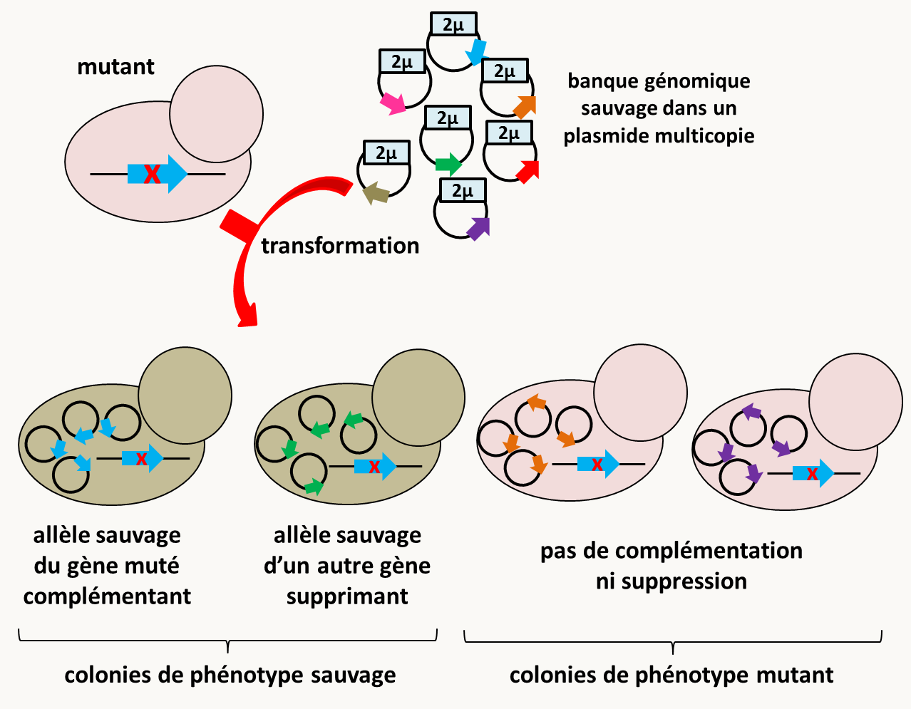

### Suppresseur agissant au niveau de l’activité de la protéine

Si une première mutation diminue l’activité spécifique d’une protéine, une mutation suppressive pourra intervenir pour l’augmenter. Notez que les réversions intragéniques intéressant les biochimistes entrent dans cette catégorie. Mais on peut envisager un autre mécanisme si les deux mutations affectent deux protéines qui forment un complexe par des contacts protéine-protéine comme deux sous-unités d’un enzyme hétéro-dimérique codées par des gènes différents, ou bien deux polypeptides intervenant dans un complexe multi-protéique (figure 142). Une première mutation dans une des protéines change un acide aminé impliqué dans le contact avec la protéine partenaire et ce contact est détruit. Le complexe ne se forme pas correctement et il est donc inactif. Une seconde mutation suppresseur dans la protéine partenaire peut rétablir le contact. Ce genre de mécanisme de suppression fonctionnelle est très important pour mettre en évidence les partenaires fonctionnels d’une protéine et identifier les acides aminés mis en jeu. Notez que nous avons vu un cas ressemblant mais qui intéressent des allèles différents d'un même gène codant pour une protéine homo-multimérique dans le cadre de la complémentation intragénique.

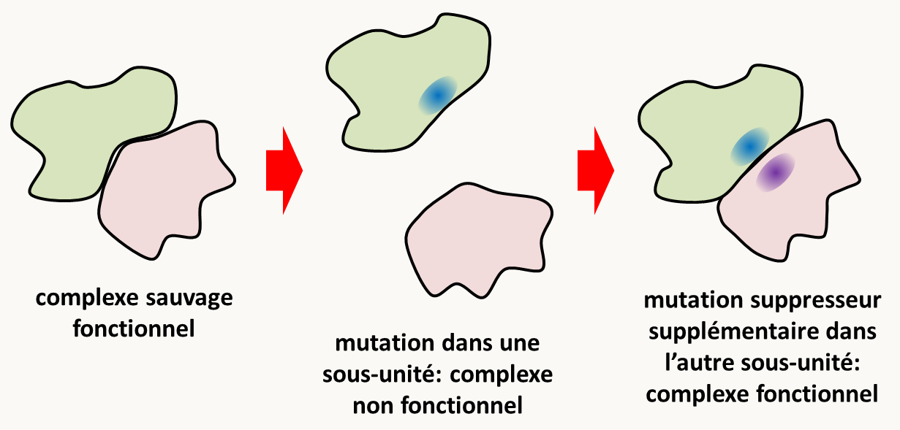

De tels suppresseurs sont  bien évidemment **gène-spécifique** et **allèle-spécifique**. En effet, la restauration de l'activité du complexe ne peut se faire qu'entre monomères ayant des mutations bien spécifiques s'annulant l'une l'autre. Il est donc peu probable que ce type de suppresseur agisse sur une délétion. Notez que ce n'est pas impossible comme par exemple dans le cadre de complexe multimérique où une mutation suppresseur peut renforcer la stabilité d'un complexe qui redevient fonctionnel en absence d'une de ses sous-unités n'ayant pas d'activité catalytique mais servant à sa stabilisation.

### Suppresseur agissant au niveau de l’expression d’un gène

Si une mutation diminue l’expression d’un gène, donc la quantité finale de protéine active synthétisée, on peut imaginer qu’une deuxième mutation qui augmente l’expression compense l’effet de la première.
La mutation suppressive peut agir à différents niveaux :

- mutations dans le promoteur du gène altéré par la mutation et agissant donc en cis sur le même gène pour augmenter la transcription du gène. Il ne s'agira donc pas d'un suppresseur extragénique mais d'une réversion intragénique. Ce sera aussi le cas d'une duplication ou d'une amplification du gène mutant.
- mutations dans la machinerie de transcription qui la rendent plus active, ou dans celle de maturation de l’ARNm qui rendent l’épissage des introns plus efficace. En particulier, des mutations dans des activateurs de transcription impliqués dans l'expression du gène et qui ont par exemple une affinité augmentée pour le promoteur vont se comporter comme des suppresseur extragénique.
- mutations qui augmentent la stabilité de l’ARNm ou de la protéine, en diminuant leur turn-over. Notez que dans le cas de la stabilité des ARN messager, cela peut laisser l'opportunité à la machinerie de traduction de faire plus d'erreurs (voir section sur les suppresseurs informationnels).

La spécificité de ces suppresseurs est variable en fonction des gènes qu'ils affectent; néanmoins le plus souvent ces suppresseurs sont **gène-spécifique** et **allèle-spécifique**. Cette classe de suppresseur permet donc d’identifier soit des régulateurs spécifiques d’un gène donné ou le plus souvent des gènes intervenant dans les processus généraux de l’expression génique. Mais dans certains on peut isoler ainsi des protéines qui interagissent. Par exemple, chez *Caenorhabditis elegans*, le gène *unc54* code pour une myosine impliquée dans la contraction musculaire. Un allèle mutant de ce gène à l’état hétérozygote conduit à la paralysie du ver. La mutation est dominante et on a des raisons de penser que l’allèle muté empoisonne l’allèle sauvage. En effet, on a isolé un suppresseur chez lequel on a montré que le gène sauvage *unc54* était dupliqué. Il y a donc deux copies de l’allèle actif produisant une double dose de protéines et une copie du gène muté codant le poison qui ne peut titrer qu'une dose de la protéine active.

### Suppresseur agissant sur une voie parallèle

Une mutation qui inactive une voie peut être supprimée par une deuxième mutation qui active une voie parallèle venant compenser le défaut de la première. Ce type de suppresseurs où la fonction déficiente est appelé **suppresseur fonctionnel** au sens strict (en effet, les suppresseurs fonctionnels au sens large englobent l'ensemble des suppresseurs permettant une restauration de la "fonction" du gène muté, y compris par activation d'une voie parallèle, soit tous les types de suppresseur vus précédemment). Ils vont être **gène-spécifique** mais **allèle-non-spécifique**. Ils vont en particulier pouvoir supprimer des délétions.

Un exemple classique chez *Escherichia coli* est la suppression de mutations dans la perméase au maltose qui rendent la bactérie incapable de croître sur maltose par des mutations qui modifient la spécificité de la perméase au lactose . Celle-ci devient capable de transporter le maltose alors que la perméase sauvage en est incapable.

Un autre exemple pris chez *Saccharomyces cerevisiae* concerne le cytochrome C qui est présent sous deux isoformes. Deux gènes codent chacun un des deux cytochromes C. *CYC1* code l'iso1-cytc qui représente 90% du cytochrome C présent dans les cellules et *CYC7* code l'iso2-cytc qui représente les 10% restants. Une mutation nulle dans *CYC1* provoque un retard de croissance sur milieu glucosé et entraîne donc des colonies de petite taille. On connaît une mutation suppressive qui supprime ce phénotype et restaure une croissance normale : il s’agit d’une mutation dans *CYC7* qui multiplie par 18 l'expression de l'iso2cytc. Cette mutation est une insertion d'un transposon Ty1 à 240 bp en amont de la phase codante et qui augmente donc la transcription du gène *CYC7*. Attention, il s'agit bien d'un suppresseur qui active une autre voie (ici par augmentation de la transcription de *CYC7*) et non pas d'un suppresseur qui restaure l'expression de la protéine déficiente, ici la protéine codée par *CYC1*.

### Suppresseur informationnel

Une dernière manière permettant de corriger les effets d'une mutation est d'avoir un processus de décodage de l'information génétique qui fait beaucoup d'erreurs. En effet, parmi les ARN messagers et/ou protéines produits avec beaucoup d'erreurs, certains retrouvent une séquence sauvage ou suffisamment proche pour avoir une activité qui va supprimer les effets de la mutation. Ce type de suppresseur est appelé **suppresseur informationnel**, en opposition aux suppresseur fonctionnels. Les mutants portant des mutations dans l'appareil de traduction seront ceux qui vont être le plus fréquemment retrouvés car la traduction est un processus sujet à beaucoup d'erreurs. En effet, en moyenne chez *Saccharomyces cerevisiae*, l'appareil de traduction incorpore un mauvais acide aminé à la place du bon avec des fréquences variant entre 4 x 10-5  et 6.9 x 10-4 en fonction des codons; des fréquences similaires sont mesurées chez *Escherichia coli*. Les ARN polymérases ont des taux d'erreurs bien inférieurs: de 10-9 à 10-12. Ce type de suppresseur supprime essentiellement des mutations ponctuelles: faux-sens, non-sens, frameshift +1 et -1 et n'auront aucun effet sur des délétions de gènes, contrairement par exemple à certains suppresseurs fonctionnels.

Si nous reprenons notre exemple de suppresseur de la mutation *PaPks1-193* chez *Podospora anserina*, une large fraction des suppresseurs obtenus sont en fait des suppresseurs informationnels. Un test simple pour vérifier si on a affaire à un suppresseur informationnel est de voir si le suppresseur est **gène non-spécifique**. En effet, des erreurs au cours de la traduction vont permettre de corriger des mutations présentes dans de nombreux gènes dont les fonctions n'ont pas de relation entre elles. Chez *Podospora anserina,* les suppresseurs informationnels obtenus permettent par exemple de corriger la mutation *leu1-1* qui affecte le gène *Leu1* codant l'enzyme 3-isopropylmalate dehydrogenase impliqué dans la synthèse de la leucine. Cette enzyme ne catalyse pas de réaction potentiellement capable de remplacer celles catalysées par la synthase de polykétide codée par le gène *PaPks1*. Ils corrigent aussi la mutation *mei2-1* qui affecte un gène contrôlant la méiose et donc dont la fonction n'a rien à voir avec la synthèse de mélanine ou de leucine. L'analyse du **spectre de suppression** permet de voir qu'il y a trois groupes principaux de suppresseurs informationnels affectant la traduction:

- Des suppresseurs vont supprimer un large spectre de mutations ponctuelles: faux-sens, non-sens, frameshift +1 et -1. Ils sont donc **gène-non-spécifique** et **allèle-non-spécifique**, on les dit **suppresseurs omnipotents**. Les mutations de ce type affectent souvent des protéines ribosomales qui vont participer à la fabrication de ribosomes décodant mal les ARN messagers. Chez *Podospora anserina*, les suppresseurs dans les gènes *su3*  (codant la protéine ribosomale S5) et *su12* (codant la protéine ribosomale S7) appartiennent à ce type de suppresseur.

- Des suppresseurs vont supprimer principalement des codons stop. Les mutations de ce type affectent les facteurs de terminaison de la traduction. Dans le cas de *Podospora anserina*, il s'agit des gènes *su1* et *su2* codant respectivement pour les facteurs de terminaison eRF3 et eRF1. Ils sont moins omnipotents que les précédents mais suppriment néanmoins un large classe de mutations: ils sont donc **gène-non-spécifique** et **allèle-non-spécifique**.

- Des suppresseurs vont supprimer spécifiquement un type de faux-sens ou de non-sens. Ces suppresseurs spécifiques de non-sens ou de faux-sens sont causés par une mutation dans le gène d’un ARN de transfert (figure 143). Ce type de suppresseur est donc **allèle-spécifique** mais **gène-non-spécifique**. De plus, ils sont dominants car la présence seule de l'ARNt suppresseur suffit à ce qu'il décode le codon mutant. Chez *Podospora anserina*, les gènes *su4* et *su8* codent pour les deux isoformes de l'ARNt incorporant de la sérine au codon TCA. Les mutations suppresseurs *su4-1* et *su8-1* changent l'anticodon de ces ARNt, si bien qu'ils décodent maintenant les codons stop TGA (figure 143). La mutation de *PaPKS1-193* est un codon stop UGA et est efficacement supprimée par *su4-1* et *su8-1*.

  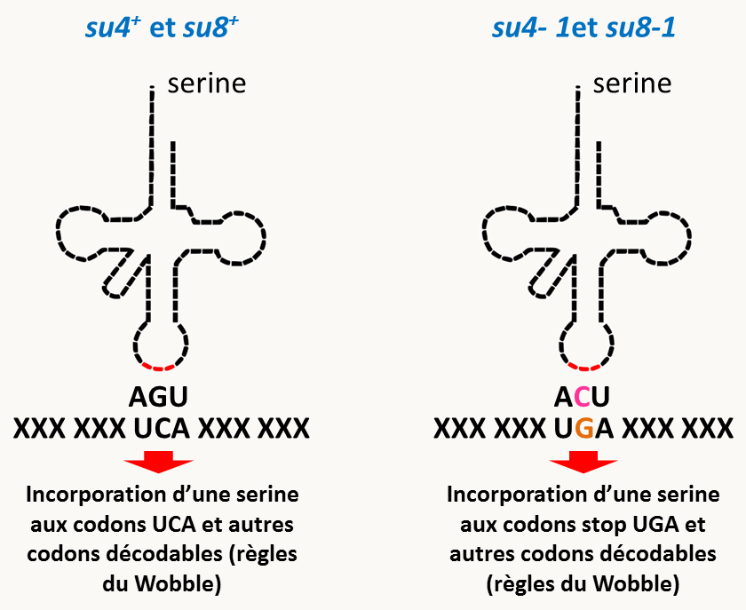

Les suppresseurs informationnels ont généralement de nombreux phénotypes associés car il vont modifier la production de nombreuses protéines. Par exemple, chez *Podospora anserina*, les suppresseurs omnipotents ou dans les gènes *su1* et *su2* codant les facteurs de terminaison ont des retards de croissance et des diminutions de fertilité. Les souches portant l'ARNt suppresseur *su8-1* n'ont pas de défaut par contre les souches portant *su4-1* ont des problèmes de fertilité: les croisements *su4+*  x *su4-1* sont peu fertiles et les croisements *su4-1* x *su4-1* sont stériles. Le gène *su8* code donc l'isoforme minoritaire et *su4* l'isoforme majoritaire de l'ARNt décodant les codons UCA et autres codons décodables selon les règles du Wobble. Notez qu'il n'y a pas chez *Podospora anserina* d'autres ARNt pouvant décoder ces codons car le double mutant *su4-1* *su8-1* est non viable car les codons UCA et autres codons décodables ne sont pas traduits. Ceci a été confirmé par la séquence complète du génome. La classe des suppresseurs informationnels a permis de mettre en évidence et d’étudier avec beaucoup de détails le mécanisme de la traduction.

### Comment analyser des suppresseurs issus d'une mutagenèse?

Comme nous l'avons écrit plus haut, la recherche de suppresseur est une technique puissante souvent utilisée par la généticiens pour identifier de nouveaux gènes impliqués dans le processus qu'ils étudient, mais aussi par les biochimistes pour étudier les relations structures fonctions au sein des protéines. Toutefois, la diversité des mécanismes permettant de corriger l'effet de mutations fait qu'une analyse génétique des révertants obtenus est souvent nécessaires pour avoir une idée de ceux potentiellement intéressants, c'est à dire le plus souvent ceux agissant par épistasie ou sur une voie parallèle pour les généticiens et les réversions intragéniques pour les biochimistes. Notez que cette analyse fournit des pistes probables  et non des certitudes. En effet, comme dans le cas de l'épistasie c'est seulement en connaissant bien le fonctionnement du processus biologique étudié que l'on arrive à comprendre complètement comment les différentes mutations interagissent entre elles. La figure 144 résume la démarche:

-  Celle-ci commence par des croisements entre la souche mutante de départ et les révertants sélectionnés pour valider que le retour au phénotype sauvage est bien dû à une seule mutation dans chaque révertant. A cette étape, il est possible d'utiliser les techniques de détermination des groupes de complémentation (si les suppresseurs sont récessifs) et de cartographies pour déterminer le nombre de gènes suppresseurs.
- La deuxième étape consiste en des croisements des révertants avec la souche sauvage afin de voir la ségrégation du suppresseur par rapport à la mutation de départ: cela permet de faire la différence entre les réversions ayant eu lieu à l'intérieur du gène muté dans la souche de départ et les suppresseurs extragéniques. Si des réversions son obtenues, seule la détermination de la séquence du nouvel allèle permettra de faire la différence entre réversion vraie ou réversion liée à la présence d'une mutation additionnelle. Notez que si la souche révertante n'a pas un phénotype complètement sauvage, elle ne contient certainement pas une réversion vraie!
- La troisième étape consiste normalement en la mesure du spectre de suppression en utilisant des mutants affectés dans des gènes impliqués dans des phénomènes divers afin de déterminer si le suppresseur est gène-non-spécifique, auquel cas ce sera probablement un suppresseur informationnel soit omnipotent (s'il est allèle-non spécifique) et de type ARNt suppresseur (s'il est allèle spécifique). Cette étape est souvent oubliée car elle est longue et demande beaucoup de travail: il faut construire plusieurs doubles mutants! Elle est faite souvent uniquement si on a une suspicion que le suppresseur est de type informationnel. Au cours de cette étape, il est souhaitable de tester aussi l'activité des suppresseurs sur différents allèles du gène muté présent dans la souche initiale (si plusieurs allèles sont disponibles), et en particulier de tester l'activité de la suppression sur la délétion de ce gène. Cela permettra ultérieurement de mieux comprendre comment fonctionne le suppresseur: par épistasie, sur une voie parallèle, en modifiant l'expression du gène ou en agissant au niveau de l'activité de la protéine.
- L'étape suivante, si elle n'a pas été réalisée, est le croisement avec une souche délétée du gène portant la mutation initiale utilisée pour rechercher des suppresseurs. Cette étape est souvent non-nécessaire car la mutation de départ est généralement une délétion du gène ou a été réalisée à l'étape précédente! Seuls les suppresseurs fonctionnant par épistasie dans une même voie ou modifiant une voie parallèle sont normalement capables de supprimer la délétion. Notez que ce sont ces suppresseurs qui intéressent le plus souvent les généticiens...
- Dans le cas où la délétion n'est pas supprimée, si on a une suspicion de suppression par modification de l'expression du gène, il faut alors mesurer celle-ci par qRT-PCR, Northern Blot, Western Blot...
- Enfin, tout au long du processus, il faut voir si la mutation suppresseur est dominante ou récessive, et confère un phénotype qui lui est propre, indépendamment de celui de suppression. Pour ceci, il faut regarder les souches portant la mutation suppresseur seule. La dominance/récessivité de la suppression et/ou du phénotype propre au suppresseur renforce en effet les hypothèses que l'on peut faire sur le mode de suppression. Un phénotype très pléiotrope indiquera un suppresseur informationnel omnipotent ou dans un système général contrôlant l'expression de nombreux gènes. Un phénotype "apparenté" à celui de la souche de départ, comme par exemple le phénotype inverse de celui de la souche de départ indiquera une suppression par épistasie, *etc.*

Quoi qu'il en soit, il est important de se rappeler que les données génétiques permettront seulement de formuler des modèles et que seule un analyse moléculaire plus poussée permettra de mieux comprendre comment fonctionne réellement le processus biologique analysé.

## L’accentuation

A l’inverse des suppresseurs, il existe des cas où une deuxième mutation, au lieu de supprimer le phénotype mutant causé par une première mutation, l’aggrave. On parle alors de **mutations d’accentuation** ( “ **enhancer** ” en anglais). Fréquemment le phénotype du double homozygote est tellement aggravé qu’il devient létal : on parle alors de **co-létalité**.

- L'aggravation d'un phénotype peut se produire dans le cas de mutations affectant deux gènes agissant dans des voies parallèles redondantes. Le manque d'un des gènes arrête la voie dans lequel il intervient et reporte toute l'activité sur l'autre, et réciproquement si l'autre gène est muté. Si les deux gènes manquent alors le processus est complètement arrêté et on observe un phénotype mutant.
  On voit que ceci est exactement l'inverse de la suppression observée par renforcement d'une voie parallèle. Par exemple, chez les mammifères le gène *myoD* code pour un effecteur déterminant la différenciation musculaire. Une mutation nulle dans le gène *myoD* de la souris ne provoque pas de désorganisation du système musculaire: la souris homozygote mutante est viable, fertile et elle développe des muscles. Même manque d'effets pour un autre effecteur musculaire, *myf5*. Il y a donc redondance entre les deux produits qui peuvent se remplacer l'un l'autre. En revanche, le double mutant *myf5* *myoD* est létal. En fait, on voit que chez les souris homozygotes mutantes pour *myoD* l'expression de *myf5* est très élevé et réciproquement.
- L'aggravation d'un phénotype peut aussi se produire si les mutations affectent deux gènes agissant séquentiellement sur la même voie. Dans ce cas, il ne s'agit pas de mutation de perte totale de fonction mais simplement de mutants hypomorphes. Une réduction des deux produits par perte de fonction partielle peut donner un phénotype léger, alors que l'addition des deux pertes entraîne un phénotype fortement aggravé voire létal si les gènes sont essentiels. On remarque que ceci est l'inverse de la suppression par épistasie. Par exemple, chez la drosophile, l'allèle mutant *sevB4* du gène *sevenless* codant pour un récepteur à activité tyrosine kinase, donne des photorécepteurs R7 normaux à 22°C mais plus de photorécepteurs R7 à 24°C conférant alors un phénotype d'œil rugueux uniquement à 24°C. La présence de la mutation dominante *E(sev)* située dans un gène autosomal appelé *drk* confère aux mouches *sevB4* un phénotype rugueux aussi à 22°C accentuant donc le phénotype.  Le gène drk code pour une protéine à domaine SH3 agissant en aval de sevenless dans la voie de signalisation de la différentiation des photorécepteurs R7.
- L'aggravation d'un phénotype peut aussi se produire si les mutations affectent des gènes codant des produits interagissant entre eux au sein d'un complexe hétéro-multimérique. Une mutation peu sévère, hypomorphe, dans l’une ou l’autre des protéines fait que le complexe remplit un peu moins bien sa fonction mais c'est peu visible phénotypiquement. En revanche l'addition des deux mutations hypomorphes rendra le complexe inactif donnant un phénotype accentué parfois létal si la fonction est essentielle. L'ensemble des deux mutations équivaut à une mutation nulle  c'est à dire le rend inapte à remplir sa fonction. Par exemple, chez *Saccharomyces cerevisiae*, une mutation thermosensible (*ts1N*) dans le gène *CDC28* provoque un arrêt complet de la division cellulaire à 36°C mais pas à 28°C. Une mutation nulle dans un gène codant pour la cycline CLB1 n’a aucun phénotype visible. La souche portant les deux mutations devient létale à 28°C par arrêt complet de la division cellulaire. On sait en effet que les deux protéines, Cdc28 et la cycline Clb1, interagissent au sein d'un complexe pour déclencher la mitose.

### Comment sélectionner des mutations d'accentuation?

Tout comme on se sert de la suppression, on peut se servir de la propriété d'accentuation d'un phénotype pour cribler de nouveaux mutants affectés dans des gènes interagissant avec un premier allèle mutant. Il est possible de cribler directement sur le phénotype d'accentuation. Chez *Saccharomyces cerevisiae* un système génétique élégant a été mis au point pour sélectionner des mutations ayant un effet de co-létalité avec une autre mutation (figure 145). En effet, ce système permet de faire un crible visuel positif basé sur les propriétés de coloration rouge d'un mutant du gène *ade2*. Comme l'analyse de suppresseur, ce système est fréquemment utilisé pour identifier des gènes impliqués dans le même processus biologique ou pour identifier des voies compensatoires exerçant la même fonction.

![stratégie de recherche de co-létaux chez Saccharomyces cerevisiae. La souche de départ porte des mutations dans les gènes ADE2, ADE3 et ADE8, ce qui lui confère une couleur blanche car le pigment rouge qui s'accumule dans les mutants ADE2- n'est pas produit. En effet, les gènes ADE3 et ADE8 codent pour des enzymes agissant en amont de l'enzyme codé par le gène ADE2; c'est le substrat de l'enzyme codé par ADE2 qui est transformé en métabolite rouge. Cette souche est aussi mutée pour le gène URA3 qui va servir de marqueur de sélection pour introduire un plasmide et permettre une contre-sélection pour vérifier la présence d'une mutation co-létale. Dans cette souche est introduite la mutation pour laquelle on souhaite obtenir des mutations co-létales (croix rouge). Puis, un plasmide portant les allèles sauvages des gènes ADE3, ADE8 et URA3, ainsi que l'allèle sauvage du gène qui porte dans le génome la mutation pour laquelle on souhaite trouver des mutations co-létales est introduit par transformation en sélectionnant les transformants devenu prototrophes pour l'uracile. Cette souche est rouge (car le pigment rouge caractéristique des souches ade2 est fabriqué) mais va présenter de nombreux secteurs blanc indicatif de la perte du plasmide, puisque le gène qu'il porte n'est pas essentiel. Après traitement mutagène, les souches ne pouvant plus perdre le plasmide, et donc l'allèle sauvage du gène d'intérêt, ne présenteront donc plus de secteurs blancs. Ce crible positif permet de sélectionner rapidement des candidats porteurs de mutations co-létales. Pour valider la présence d'une mutation co-létale, il suffit de repiquer les candidats sur milieu contenant de l'acide 5-fluoro-orotique (5FOA). En effet, ce produit est métabolisé uniquement dans les souches URA3+ par l'enzyme codé par le gène URA3; il devient alors toxique. Si le plasmide porteur de l'allèle URA3+ ne peut être perdu, les cellules repiquées mourront, alors que celles ne portant pas de mutations de co-létalité pousseront.](img/image145.png)

## Le fond génétique

Les sections ci-dessus montrent que les mutations sont capables d'interagir entre elles pour donner des nouveaux phénotypes qui sont soit plus prononcés (effets accentuateurs), soit moins prononcés (effets suppresseurs) que la simple addition de leur phénotypes propres. Nous avons vu dans le chapitre 2 portant sur la génomique qu'une même espèce peut présenter de grandes variations dans la composition de son génome avec des souches qui peuvent varier entre elles avec un pourcentage de l'ordre du pour mille (‰) et la présence de **gènes optionnels** (les gènes du pan génome absents du core génome). Si la plupart de ces nombreux polymorphismes sont silencieux, certains confèrent des caractéristiques propres à chaque souche. L'ensemble des polymorphismes propres à chaque souche est ce que l'on appelle le **fond génétique**. La présence de ces polymorphismes fait que souvent les mutations n'ont pas les mêmes effets dans les différentes souches à cause des interactions qu'elles engagent avec les polymorphismes, même s'ils sont silencieux en eux-mêmes. Ceci a été montré à de multiples reprises:

- Chez *Saccharomyces cerevisiae*, les souches Σ1278b et S288c diffèrent par environ 3.2 polymorphismes par kilobase. L'analyse de la létalité de délétions ciblées de gènes a montré que 44 délétions sont létales spécifiquement chez Σ1278b et 13 spécifiquement chez S288c. Les analyses génétiques ont montré que la létalité est due dans la plupart des cas par des interactions complexes avec plusieurs allèles présents spécifiquement dans chacune des souches.

  Une analyse étendue à quatre souches différant de 5.4 à 5.9 SNP/kb et cultivées dans 38 conditions différentes (mais avec seulement 3786 délétions testées) a montré des différences de phénotypes dans 18% des comparaisons "2 à 2" entre souches sur l'ensemble des conditions testées, montrant l'étendue des variations phénotypiques induites par le fond génétique.

- Chez *Caenorhabditis elegans*, sur 1400 gènes inactivés par interférence à ARN, 20% des inactivations ont montré des différences de phénotypes entre deux souches: N2 venant de Bristol et CB4856 venant d'Hawaï. Dans la plupart des cas, la sévérité de l'inactivation et celle du phénotype qui l'accompagne peuvent être reliées au niveau d'expression du gène ciblé. Ces niveaux d'expression différents entre souches sont aussi la résultante d'interactions multiples au sein du fond génétique propre à chaque souche.

Les généticiens utilisent ces fonds génétiques pour identifier de nouveaux gènes impliqués dans divers processus, en particulier ceux qui contrôlent des caractères continus. Pour ce faire, ils croisent deux souches ayant des fonds génétiques distincts et analysent les phénotypes de la génération F1. Par des méthodes statistiques, ils peuvent ensuite analyser la ségrégation de caractères quantitatifs avec celles de marqueurs, généralement de type microsatellite, selon une démarche qui ressemble à celle du clonage positionnel (voir chapitre 6). Dans le cas où un phénotype intéressant est identifié, il est possible de procéder à une introgression dans un des fonds génétiques pour voir s'il est causé par la disruption d'une seule interaction (auquel cas  le phénotype ségrégera selon les modalités d'une seule mutation au cours des générations d'introgression).

Une des conclusions importantes que l'on peut tirer de ces phénomènes d'interaction entre mutation est que **la recombinaison entre individus ayant des fond génétiques différents peut faire apparaître de nouveaux phénotypes en absence d'apparition de mutations nouvelles**, rien qu'en jouant sur l'apparition/disparition d'interactions entre polymorphismes. La recombinaison, qui est un processus majeur se déroulant au cours de la reproduction sexuée chez les eucaryotes, est donc un moteur important de l'évolution via la création de nouveaux phénotypes qui sont ensuite triés par le crible de la sélection naturelle.

Une autre observation qui découle des interactions entre mutation est qu'il est maintenant possible d'expliquer la raison de la pénétrance incomplète et de l'expressivité variable des phénotypes présentés par cerains allèles (voir la section sur Les Lois de Mendel et les gènes dans l'Introduction Générale). En effet, pour expliquer ces variations il faut faire appel à 3 causes possibles:

- Le fond génétique qui va dicter le comportement des allèles via les interactions potentielles qu'ils peuvent avoir entre eux. Dans certains cas, le fond génétique a très peu d'effet. C'est le cas par exemple du déterminisme des groupes sanguins chez l'homme. Au contraire, d'autres caractères comme les caractères continus (intensité de la pigmentation, taille mais aussi par exemple le nombre de facettes des yeux des insectes qui n'est pas un caractère continu mais qui présente néanmoins une grande étendue de variation) vont être très influencés par le fond génétique.

- Les effets de l'environnement: il suffit de rappeler par exemple que le sexe des crocodiles est déterminé par la température d'incubation des œufs: une température entre 31°C et 34 °C donnera des mâles, une température inférieure à 31°C ou supérieure à 35°C donnera des femelles
- Des effets épigénétiques souvent liés à l'histoire des individus. Nous avons en effet vu que des phénomènes épigénétiques peuvent modifier le comportement des organismes. Ceux-ci se déclenchent aléatoirement, reversent fréquemment mais peuvent aussi être induit dans des conditions particulières. Nous avons vu par exemple que chez *Podospora anserina*, le simple contact avec une souche portant le prion het-s transforme les souches het-s* dépourvues de prions en souche het-s porteuse du prion. L'histoire qu'une souche porteuse de l'allèle *het-s* a eu, en étant rentré ou non en contact avec une souche porteuse du prion, affecte donc son phénotype.

L'implication de ces trois phénomènes fait que le déterminisme génétique n'est pas si absolu que certains le pensent. Certes, il est des cas où il est effectivement absolu. Un exemple emblématique est bien évidemment le déterminisme des groupes sanguins qui non seulement sont insensibles au fond génétique, mais aussi à l'environnement et pour lesquels on ne connaît pas de phénomènes épigénétiques qui les affectent naturellement. On connaît par contre des modifications épigénétiques des gènes du type ABO dans certaines cellules cancéreuses! Mais pour la plupart des caractères complexes, la génétique joue seulement une part, parfois négligeable, dans d'autres cas importante, dans l'élaboration du phénotype final: en résumé les caractères complexes sont souvent la résultantes d'interactions multiples entre polymorphismes, l'environnement et l'histoire épigénétique des individus et de leurs progéniteurs. Parmi ce type de caractères, on peut citer l'alcoolisme (et les autres addictions), l'homosexualité, la susceptibilité aux cancers et de nombreux autres caractères où la génétique, l'environnement et la part moins identifiée de l'épigénétique interviennent. Rien de surprenant alors que pour ces caractères, les déterminants génétiques ont le plus souvent une pénétrance incomplète et/ou une expressivité variable.
