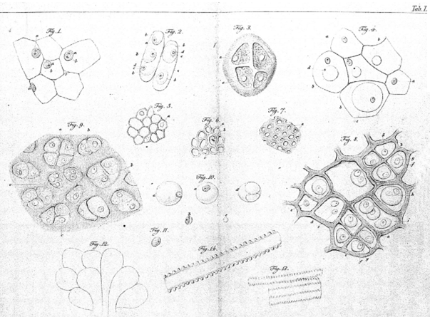
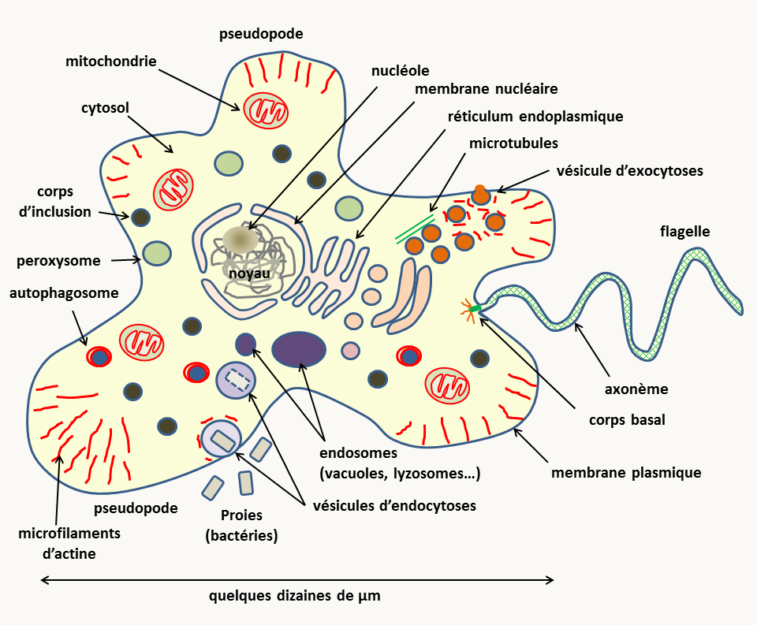
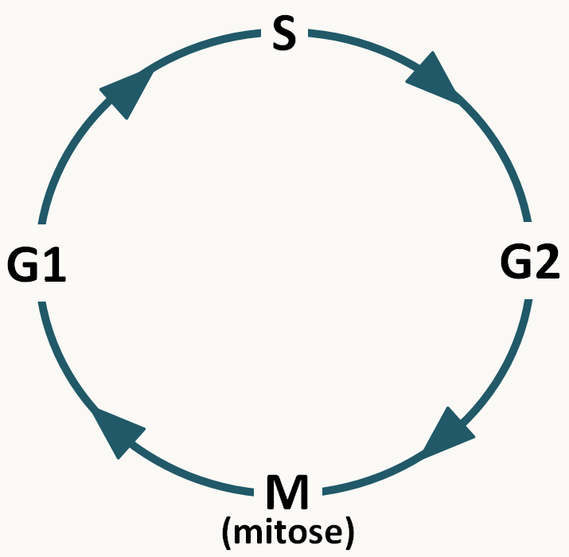
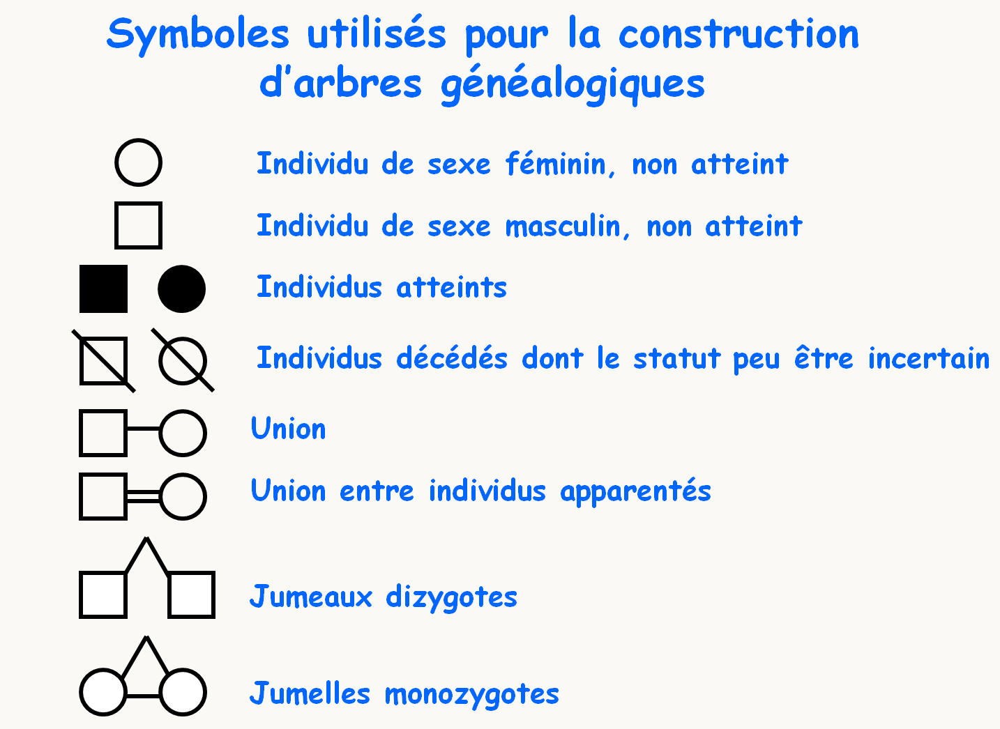
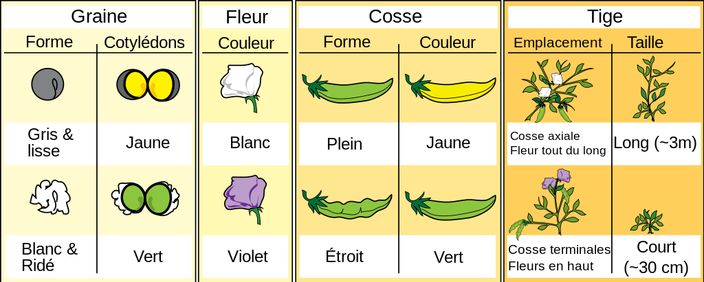
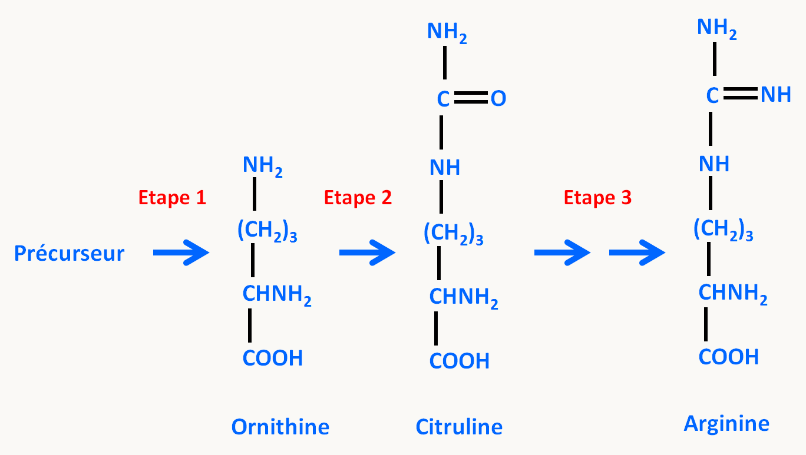

# Introduction générale

De nos jours, tout le monde sait qu'il est impossible de faire se reproduire ensemble un chien et un chat (notez que dans l'antiquité de tels croisements monstrueux étaient fréquemment évoqués !). Chiens et chats font partie de deux espèces différentes. Cette notion est en fait plutôt récente et la définition d'une espèce, en tant que groupe d'organismes inter fertiles produisant des descendants fertiles, a été défendue par le naturaliste français Buffon (1707-1788). Même de nos jours, cette notion de l'espèce n'est pas encore complètement établie et il existe des cas où elle est matière à débat (par exemple : qu'est-ce qu'une espèce de bactérie?).

De même nous savons qu'un couple de chats engendre uniquement des chats et un couple de chiens uniquement des chiens. A chaque espèce sont associés des "caractères particuliers" qui se conservent au cours de la reproduction engagée par deux individus de la même espèce. Mais, nous savons qu'à l'intérieur d'une espèce, il existe différents caractères. Cependant, on observe aussi dans certains cas la transmission d'une génération à l'autre de ces caractères plus subtils. Citons :

- coloration du pelage des chats siamois
- teneur en amidon du pois lui donnant un aspect lisse ou rugueux
- chez l'homme, la morphologie jusque dans ses plus fins détails comme l'existence de vrais jumeaux, difficilement distinguables même par leurs proches, le montrent

**Conclusion :** Au cours de la reproduction, les parents transmettent à leur descendance une information qui permet la "construction de l'individu". Il y a une transmission quasi à l'identique de cette information : la transmission est donc en très grande partie INVARIANTE. Pour une espèce donnée, l'information est quasi constante, elle présente néanmoins des petites VARIATIONS d'un individu à l'autre.
On définit la génétique comme la science qui a pour but d'étudier cette information.

**Il existe deux aspects distincts à la génétique :**

- l'étude du mode de transmission de cette information (aspect formel)
- l'étude de la nature de cette information et de la façon dont elle s'exprime (aspect moléculaire)

C'est le premier aspect qui se base sur l'analyse de croisements dirigés qui sont la caractéristique la plus connue de la génétique (rappelez-vous vos cours de lycée !). Outre cet aspect fondamental, la génétique a aussi offert à la Biologie une méthodologie très puissante pour résoudre certains problèmes, en particulier ceux qui traitent de la fonction des macromolécules biologiques.

## Rappels Biologiques

Avant de rentrer plus avant dans l'analyse génétique, nous allons avoir besoin d'un certain nombre de rappels biologiques. En effet, comment discuter la transmission de l'information au cours de générations, si l'on ne connaît les mécanismes biologiques qui opèrent au cours de la reproduction ! Rappelons d'abord que :

**Tout organisme est constitué de cellules :**
Les premières cellules ont été décrites par Robert Hooke en 1665 (figure 1). La théorie actuelle a été formulée par Mathias-Jacob Schleiden et Théodore Schwann en 1837-1839 (figure 2).

**Toute cellule naît d'une cellule :**
La génération spontanée des "gros organismes" a été abandonnée grâce à Francesco Redi (1626-1694), même si Buffon la défend encore un siècle plus tard. En effet, avant cette époque, on faisait naître des souris de tas de grains et des "vers" de la putréfaction. L'expérience de Redi montre que si on met de la viande dans une fiole bouchée par de la gaze fine, il n'apparaît jamais de vers. Le problème est plus complexe pour les organismes microscopiques et il faut attendre Louis Pasteur (1860) pour que la question soit définitivement tranchée (figure 3)

![en l'absence de stérilisation (pas de chauffage), Pasteur observe une putréfaction (ou fermentation) avec une apparition de microorganismes. Après une stérilisation par chauffage, Pasteur n'observe pas de putréfaction. Par contre après cassure du tube de verre et exposition de la matière à l'air, les microorganismes apparaissent entraînant la putréfaction. L'explication qu'il donne est la suivante: les particules présentes dans l'air se déposent dans le tube avant d'avoir atteint la matière. Si celle-ci est stérile, il n'y a pas de putréfaction. La cassure du tube permet à ces germes d'atteindre la matière et de démarrer le processus. Notez que dans cette expérience de l'air "non altéré" passe sans problème dans la fiole à tout moment, il n'y a donc pas altération de "principe de l'air"qui empêcherait l'apparition spontanée de cellules. Cette expérience prouve qu'il y a besoin de germes pour initier la putréfaction et donc que la génération spontanée n'existe pas.](img/image003.png)

**Conclusion:** si toute cellule naît d'une cellule, d'un point de vue génétique, cela veut dire que l'information présente dans un organisme n'apparaît pas spontanément ! Elle est produite à partir d'une information préexistante. Celle-ci doit donc être dupliquée avant d'être transmise.

Si toute cellule naît d'une cellule, comment est faite une cellule ? Et comment se reproduit-elle ?

Les analyses biologiques du début du siècle ont conduit à distinguer deux grands types de cellules, suivant leur constitution et leur mode de reproduction : les cellules procaryotes et les cellules eucaryotes.

## Les cellules procaryotes

On les regroupe souvent sous le terme générique de "bactéries". Il en existe en fait deux grands groupes, les vraies bactéries (appelées parfois eubactéries, maintenant le plus souvent simplement bactéries) et les archées, qui ont des fonctionnements différents au niveau moléculaire. Cependant, les cellules des deux groupes possèdent une organisation similaire (figure 4).

**Structure:**

- Ces cellules sont généralement de petite taille (attention, il existe des exceptions !)

- Leur structure est très simple, le plus souvent sans cytosquelette ni réseau de membrane interne: la production d'énergie n'est pas compartimentée, elle se produit au niveau de la membrane plasmique. Autour de la cellule, on note la présence d'une paroi complexe. Dans le cytoplasme, il y a présence des ribosomes et d'une masse "plus claire", le nucléoïde qui contient l'ADN. Attention le nucléoïde n'est pas un noyau car il n'est pas entouré par une membrane. Il existe de ce fait un couplage entre transcription et traduction. L'ADN est présent sous forme d'un ou quelques chromosomes, le plus souvent circulaire(s), mais pas toujours.

- Ces bactéries n'ont pas de processus d'endocytose et "n'ingèrent" donc que des molécules solubles qui pénètrent à l'intérieur de la cellule via les transporteurs membranaires.

- Elles ne forment jamais d'organismes pluricellulaires complexes, mais néanmoins les cellules sont capables de se différencier pour former des spores ou des colonies contenant des cellules de morphologies différentes.

- Leur unité de structure cache une grande complexité de métabolisme et de fonctionnement au niveau moléculaire. Ceci entraîne une diversité biologique très importante. Les procaryotes ont ainsi pu coloniser quasiment tous les milieux : des plus froids (mers polaires à la limite de la congélation) aux plus chauds (sources thermales à plus de 120°C), sous la croûte terrestre ou à l'intérieur du corps humain.

  **Division**

- Elles se divisent simplement par **fission binaire**, en général pour donner deux cellules identiques. Il n'y a pas d'individualisation de chromosomes visibles en cytologie à aucun moment de leur cycle de vie. Attention, le processus de division est cependant hautement contrôlé par des structures particulières; la petitesse des cellules empêche leur visualisation facile avec un microscope optique.

- Il n'existe pas de reproduction sexuée au sens usuel du terme. Il est cependant possible pour des cellules procaryotes d'échanger de l'ADN grâce aux phénomènes de conjugaison, de transduction et de transformation.

## Les cellules eucaryotes

Cet ensemble regroupe une variété de cellules présentant des organisations plus ou moins complexes. Cependant, elles ont toute la caractéristique d'avoir un noyau, composé d'une double membrane entourant l'ADN. Celui-ci présente une organisation complexe (figure 5).

**Structure:**

- Le plus souvent, outre le noyau, elles présentent une structure interne complexe avec un cytosquelette vrai (microtubules, filaments d'actine etc.) et un système de membranes délimitant de nombreuses organelles (réticulum associé au noyau, appareil de Golgi, mitochondrie, lysosome / vacuole, peroxysome, etc.). De plus, chez de nombreux protistes et chez les plantes, des plastes assurent la photosynthèse. Il y a donc une compartimentation de la production d'énergie dans les mitochondries et les plastes, et des réactions enzymatiques (faites le cytosol, les peroxysomes, les lysosomes, etc.). La présence du noyau, caractéristique des eucaryotes, entraîne un découplage entre transcription et traduction. Ceci permet des niveaux de régulation supplémentaires par rapport aux procaryotes.

- Elles ont la possibilité de faire des endocytoses, ce qui permet des échanges additionnels avec le milieu extérieur, mais aussi des régulations supplémentaires.

- Ces cellules peuvent se différencier et donner naissance à des organismes pluricellulaires. Ils ont une grande diversité au niveau du métabolisme (mais moindre que chez les bactéries) et de leur fonctionnement au niveau moléculaire. Je vous renvoie aux cours de biologie moléculaire, biochimie et microbiologie de maîtrise pour approfondir vos connaissances sur le sujet. Vous pouvez aussi consulter le [livre de microbiologie eucaryote](https://hal.archives-ouvertes.fr/hal-01263138) qui donne un aperçu de la diversité des eucaryotes "simples".

- Leur matériel génétique est présent dans plusieurs compartiments. La plus grosse partie se trouve dans le noyau sous forme de plusieurs molécules d'ADN linéaires double brins ou chromosomes et dont le nombre est défini. Si un seul lot de chromosomes est présent, la cellule est dite haploïde, si deux lots identiques sont présents la cellule est dite diploïde, avec trois lots, elle est triploïde et avec quatre elle est tétraploïde. L'autre compartiment qui contient de l'ADN et la mitochondrie. L'ADN y est présent sous formes de plusieurs molécules de structures très variables en fonction des lignées d'eucaryotes (voir le [livre de microbiologie eucaryote](https://hal.archives-ouvertes.fr/hal-01263138)) et dont le nombre varie en fonction des étapes du cycle de vie et/ou des conditions de l'environnement. Chez les plantes et certains protozoaires, de l'ADN est aussi présents dans les plastes ou d'autres organelles (voir le [livre de microbiologie eucaryote](https://hal.archives-ouvertes.fr/hal-01263138)).

**Division:**

Leur processus de division est complexe ce qui résulte en une transmission plus complexe de l'information génétique au cours des générations. Il en existe deux types : les **mitoses** et les **méioses**.

## La mitose

C'est la division la plus courante pour les cellules eucaryotes, aussi bien chez les unicellulaires que chez les pluricellulaires.  Sa découverte ainsi que la généralisation de sa présence chez tous les eucaryotes se sont faites progressivement au XVIIème et XIXème siècles, le terme de mitose ayant été utilisé pour la première fois en 1882 par Walther Fleming.

Je rappelle que toutes les cellules d'un organisme pluricellulaire sont issues par mitose d'une cellule unique (l'œuf chez les animaux, l'ovule fécondée à l'origine de la graine chez les plantes et la spore chez les champignons). Elles constituent un clone (note : ce terme s'applique aussi aux cellules procaryotes issues d'une même cellule initiale: une colonie bactérienne est un clone). La mitose est une étape du cycle cellulaire : celui-ci se décompose comme indiqué dans la figure 6.

Classiquement, quatre phases sont définies:

S: phase de synthèse. C'est à ce moment que l'information est dupliquée (= réplication de l'ADN !)

G1 et G2 sont des phases d'attente ou GAP. Pendant ces phases, un certain nombre de décisions sont prises (Y-a-t-il assez d'énergie pour se diviser ?...) et des contrôles sont faits (l'ADN est-il bien répliqué ? ...)

M: Mitose qui intervient entre les phases G2 et G1 et qui est le moment exact où le matériel génétique est réparti dans les deux cellules filles. C'est un processus dynamique dont la durée est variable d'un organisme à un autre mais qui prend en général moins d'une heure. Elle a été découverte chez les plantes par Edouard Stasburger (1875). Flemming (1880) montre qu'elle existe aussi chez les animaux et appelle chromatine la substance dont sont faites les particules "colorantes" du noyau. Waldeyer (1888) donne le nom de chromosome à ces particules. La figure 7 en donne les principales étapes.

![la mitose chez Saccharomyces cerevisiae. Au cours de la prophase, les chromosomes se condensent et les deux chromatides qui les composent et qui sont chacune des molécules filles issues de la réplication sont bien visibles. Les chromosomes s'alignent via leur centromère sur la plaque équatoriale. Lorsqu'ils sont bien alignés, l'étape dite métaphase est atteinte. Les centromères se clivent et chacune des chromatides pour chaque chromosome se dirigent vers un pôle opposé du noyau. C'est l'étape dite d'anaphase. Notez qu'à ce moment, chaque chromatide devient un chromosome. Au cours de la télophase les noyaux se divisent et les chromosomes se décondensent.  Puis la cellule se divise, c'est l'étape de cytodiérese. Pour les mitochondries, qui chez la levure porte un génome circulaire, l'entrée dans le bourgeon est contrôlé par un système qui assure une partition correcte des mitochondries entre la cellule mère et le bourgeon.](img/image007.png)

Il existe de nombreuses variations sur ce schéma. Par exemple, chez les animaux et les plantes, la membrane nucléaire disparaît pendant le processus. Il y a des "asters" plutôt qu'un "Spindle Pole Body" ou SPB.  La cytologie a aussi permis de décrire différents types de chromosomes (figure 8) en fonction de la position de leur centromère. Tailles et types des chromosomes permettent  donc de les différencier et d'en établir un catalogue ou **caryotype**.

Ce qu'il faut retenir c'est qu'**à l'issue de la mitose il y a répartition à l'identique des chromosomes nucléaires: une cellule à n chromosomes donne naissance à deux cellules à n chromosomes, une cellule à 2n chromosomes donne naissance à 2 cellules à 2n chromosomes.** Il y a aussi partition plus ou moins équitable du cytoplasme et donc une transmission souvent peu biaisée du matériel génétique présent dans les organelles du cytoplasme (mitochondries, plastes...).

## La méiose

Cette division est très importante car elle est impliquée dans la reproduction sexuée des organismes (attention, la reproduction sexuée n'est pas une étape obligatoire chez les eucaryotes car de nombreux organismes ont une reproduction uniquement asexuée).

Oscar Hertwig (1875) montre que pendant la fécondation de l'œuf d'oursin, le noyau du spermatozoïde pénètre dans l'ovule et fusionne avec le noyau déjà présent. Edouard van Beneden (1883-1888) montre que les spermatozoïdes et les ovules ont le même nombre de chromosomes et que ceux-ci sont en quantité deux fois moins importante que dans les cellules germinales qui leur ont donné naissance. Ces études cytologiques montrent qu'il existe chez les eucaryotes une alternance de phases haploïdes où les cellules ont n chromosomes et de phases diploïdes, où elles ont 2n chromosomes (figure 9). C'est la reproduction sexuée grâce à laquelle les eucaryotes échangent de l'information génétique. A partir de ces observations cytologiques, August Weismann (1887) formule la première théorie chromosomique de l'hérédité : l'information génétique est portée par les chromosomes. **L'analyse génétique se base donc principalement sur des analyses des croisements se produisant au cours de la reproduction sexuée.**

La figure 9 décrit la terminologie utilisée de manière générale concernant le cycle de vie des eucaryotes. En fait à pour chaque groupe d'eucaryote, il existe une terminologie particulière pour les gamètes et le zygote. Notez que la fécondation s'appelle conjugaison lorsque les deux gamètes ont la même taille. La fécondation/conjugaison permet de réunir deux génomes haploïdes dits parentaux pour redonner un diploïde. Elle se décompose en deux étapes:  la fusion des gamètes ou plasmogamie puis la fusion des noyaux ou caryogamie.  Chez certains eucaryotes, la fusion cellulaire n'est pas toujours immédiatement suivie de la fusion des noyaux. Il se produit alors une dicaryophase avec des cellules binucléées.

La méiose est la division particulière qui permet le passage de la phase diploïde à la phase haploïde (figure 10). Pour effectuer la méiose, il faut donc partir d'une cellule diploïde à 2n chromosomes. Cette division est précédée comme pour la mitose de la duplication du matériel génétique (réplication de l'ADN). Au cours de la méiose, il y a deux divisions successives qui aboutissent à la production de 4 cellules haploïdes à n chromosomes suivant le schéma général décrit dans la figure 10.

![une méiose typique commence par une première division (Méiose I) qui voit lors de la prophase I la condensation des chromosomes (étape du leptotène), suivie de leur association en bivalents: c'est à dire que les chromosomes "homologues" vont s'associer dans un premier temps grâce à un complexe protéique: le complexe synaptonémal (étape du zygotène). L'association est suivie de recombinaison entre les chromatides des deux chromosomes des bivalents (étape du pachytène). Ceux-ci sont visibles cytologiquement: il'agit des chiasmas. Ces chiasmas maintiennent entre eux les deux chromosomes lorsque le complexe synaptonémal se résorbe en fin de prophase I (étape du diplotène). Les bivalents vont ensuite se positionner sur la plaque équatoriale. Une fois en position, l'étape de métaphase I est atteinte. Lors de l'étape suivante (anaphase I), la résolution des chiasmas permets aux deux chromosomes (chacun ayant deux chromatides) de se séparer et de s'éloigner à chacun des pôles du noyau. La télophase I voit la décondensation partielle des chromosomes. Elle est immédiatement suivie de leur recondensation nécessaire pour la deuxième division de méiose (Méiose II) qui est une mitose classique. Notez que chez de nombreux eucaryotes, la méiose peut être suivie de mitoses dites postméiotiques comme chez les champignons ascomycètes filamenteux. Pour les organelles situées dans le cytoplasme et contenant leur propre génome (mitochondrie, plastes, etc.), il n'existe pas en général de mécanismes particuliers qui vont permettre leur transmission préférentielle (attention, il existe des exceptions), mais si l'organisme différentie des gamètes morphologiquement différents (mâles notés ♂ et femelles notés ♀) il va y a voir un biais de transmission aux gamètes. le cas le plus commun est que seul le gamète femelle transmet l'ADN des organelles.](img/image010.png)

Le brassage aléatoire des chromosomes et les crossing-over sont les deux mécanismes qui vont participer à la recombinaison entre les deux génomes parentaux. La recombinaison au sens génétique du terme est le fait que des informations provenant des deux parents d'un individu se retrouve associés dans ses gamètes. Les descendants que va générer cet individu vont donc être formés d'une mosaïque des chromosomes provenant de chacun de leurs parents.

Ce qu'il faut donc retenir c'est que **la méiose permet de restaurer l'état haploïde chez les eucaryotes et que cela s'accompagne de la recombinaison des informations génétiques  due au brassage chromosomique et aux crossing-over**. Elle n'est qu'une des étapes du cycle de vie des eucaryotes dont **la diploïdie va être restauré par la fécondation/conjugaison**.

## Quelques organismes modèles en génétique

**La durée des phases haploïdes et diploïdes est variable en fonction des organismes. Cela veut donc dire que pour chaque organisme, l'analyse génétique des croisements suivra des modalités différentes en fonction de la phase qui peut être observée facilement.** Les cycles décrits ci-dessous présentent les trois grands groupes de cycles qui sont distingués, en prenant les exemples des organismes les plus étudiés en génétique. Ensuite, vous sont données quelques caractéristiques génétiques de ces organismes.

### *Saccharomyces cerevisiae*

Si la phase haploïde est aussi longue que la phase diploïde, le cycle est dit **haplodiplobiontique**. Ce type de cycle est présent chez quelques levures dont la levure de boulanger *Saccharomyces cerevisiae* (figure 11). Cette levure se divise par bourgeonnement d'une cellule fille à partir de la cellule mère, ce qui veut dire que le cytoplasme n'est pas réparti équitablement entre les deux cellules issues de la mitose. Par contre, la conjugaison entre gamètes se fait entre deux cellules non distinguables morphologiquement mais génétiquement différentes: on dit que *Saccharomyces cerevisiae* est hétérothallique. De même, la méiose produit quatre ascospores identiques morphologiquement dont deux sont d'un type (mata) est les deux autres de l'autre type (matα). On dit que le type sexuel de *Saccharomyces cerevisiae* est bipolaire. Le cycle est rapide et dure environ une semaine pour aller d'une souche diploïde à ses descendants diploïdes obtenus par fécondations d'haploïdes.

![la levure de boulanger Saccharomyces cerevisiae. Pour cette levure, il existe 2 types sexuels appelé mata et matα. Les cellules haploïdes mata ou matα, peuvent se diviser par mitose et générer des clones. La division s'effectue par bourgeonnement donnant deux cellules de tailles différentes : la cellule mère et la cellule fille (à gauche). La conjugaison (équivalent à la fécondation) ne peut avoir lieu qu'entre une cellule haploïde mata et une cellule haploïde matα. La cellule diploïde résultant de la fusion peut aussi se diviser par mitose. Lorsque se produit une carence en nutriments, la cellule effectue une méiose. Celle-ci ne peut se produire que dans une cellule diploïde mata/matα. Elle produit 4 spores haploïdes empaquetées dans un asque que l'on appelle une tétrade; les spores sont alors appelées des ascospores. Deux ascospores seront mata et les deux autres matα.](img/image011.png)

Le génome haploïde de *Saccharomyces cerevisiae* est constitué de 16 chromosomes nucléaire et d'un chromosome mitochondrial circulaire. Il mesure environ 12 Mb et code pour environ 6000 gènes. Il est très facile de transformer génétiquement cette levure et il existe de nombreux mutants, y compris une collection des délétions de tous les gènes. Pour en savoir plus sur la génétique de *Saccharomyces cerevisiae* le site [SGD](https://www.yeastgenome.org/) (pour *Saccharomyces* Genome Database) est incontournable. D'un point de vue génétique, il faut retenir que dans ce type d'organisme il est possible d'observer les résultats des fécondations et des méioses.

###  *Neurospora crassa* et *Aspergillus nidulans*

Lorsque la phase haploïde est très longue alors que la phase diploïde est réduite au minimum, on parle alors de cycle **haplobiontique**. Ce type de cycle est présent chez les champignons filamenteux comme *Neurospora crassa*, *Aspergillus nidulans* ou *Podospora anserina*. Pour tout savoir sur la génétique de *Podospora anserina* qui est le champignon modèle étudié par les français vous pouvez consulter le livre gratuit ["*Podospora anserina*"](https://hal.archives-ouvertes.fr/hal-02475488). Nous allons plutôt développer *Neurospora crassa* et *Aspergillus nidulans* car ce sont des modèles plus répandus dans les laboratoires (sauf en France!).

*Neurospora crassa* est un hétérothallique bipolaire avec deux types sexuels appelés mata et matA et qui différencie des gamètes mâles et femelles (figure 12).  La fécondation ne peut se produire qu'entre deux gamètes de types sexuels opposés: ♂ mata x ♀ matA et ♂ matA x ♀ mata. Comme chez les autres champignons ascomycètes *Pezizomycotina*,  la plasmogamie est suivie d'une étape de dicaryose ou **dicaryophase** aboutissant à l'amplification des cellules binucléées avant la caryogamie: à partir d'une fécondation, plusieurs centaines d'asques vont être produits. Notez que la position des ascospores dans les asques reflète la position des fuseaux de division: on dit que les asques sont ordonnés. Le cycle dure deux à trois semaines.

![Neurospora crassa possède deux types sexuels appelés mata et matA. Le mycélium du champignon est haploïde et différencie des organes mâles ou spermaties et femelles ou ascogones. La fécondation se produit entre un organe mâle d'un type sexuel et un organe femelle du type sexuel opposé. La fécondation est suivie d'une étape dicaryotique qui permet de multiplier le nombre de cellules issues de la fécondation et dans lesquelles auront lieu les caryogamies qui sont immédiatement suivies des méioses et d'une mitose post-méiotique supplémentaire donnant naissance à des asques contenant 8 ascospores ordonnées. Toutes ces étapes de développement sexuel se produisent dans une fructification appelée périthèce (en haut à gauche). Le champignon est aussi capable de différencier des spores de dispersion asexuelle. Il en existe de deux types: certaines sont uninucléées, les microconidies, qui peuvent aussi servir de gamètes mâles, les autres sont plurinucléées et sont appelées les macroconides. Elles accumulent des carotènes orangés (en bas à gauche).](img/image012.png)

Le génome de *Neurospora crassa* est constitué de sept chromosomes nucléaires et d'un chromosome mitochondrial circulaire. Il mesure 43 Mb et code pour environ 11 000 gènes. La transformation génétique de *Neurospora crassa* est facile et une banque de mutants de délétion de chaque gène est disponible. De nombreux mutants affectant ce champignon ont été sélectionnés. Plus d'informations sur la génétique de ce champignon sont disponibles sur le site du [FGSC](http://www.fgsc.net/) (pour Fungal Genetics Stock Center).

Le site du [FGSC](http://www.fgsc.net/)  donne aussi des informations précieuses sur un second champignon ascomycète possédant un cycle similaire et qui est très utilisé en génétique: *Aspergillus nidulans* (figure 13).  *Aspergillus nidulans* est homothallique, ce qui veut dire qu'il n'a pas besoin d'un partenaire sexuel pour initier la reproduction sexuée. De fait, il ne différencie aucun gamète mâle, l'ascogone se fécondant lui-même. Le cycle sexuel est assez peu utilisé pour faire des analyses génétiques avec ce champignon. En effet, il possède un cycle parasexuel efficace qui est le mode préféré par les généticiens (encadré bleu de la figure 13). La durée du cycle parasexuel est de deux à trois semaines. De plus, l'analyse en asque est impossible car ils sont très fragile et éclatent facilement: il est donc très difficile de les analyser un par un. Ils sont aussi non ordonnés.

![Aspergillus nidulans n'a pas de type sexuel et les ascogones engagent seuls le processus sexuel en s'autofécondant. Comme pour Neurospora crassa, la plasmogamie est suivie d'une phase dicaryotique qui permet d'amplifier le nombre d'asques obtenus après un seul évènement de fécondation. La fructification est fermée et s'appelle un cléistothèce (en bas à gauche). Comme Neurospora crassa, Aspergillus nidulans différencie des conidies uninucléées qui assurent une reproduction asexuelle (en haut à gauche, différents mutants de coloration des conidies d'Aspergillus nidulans).Le cycle parasexuel, très efficace chez Aspergillus nidulans, permet une alternance de générations haploïdes et diploïdes sans sexualité (encadré bleu). Il débute par une anastomose, c’est à dire la plasmogamie de deux cellules haploïdes sans formation de gamète. L’hétérocaryon résultant peut subir une caryogamie (fusion de noyaux) pour donner des noyaux diploïdes. Ceux-ci sont très instables et redonnent rapidement après pertes aléatoires de chromosomes des noyaux haploïdes. Les recombinants ainsi obtenu vont présenter une mosaïque aléatoire des chromosomes des deux « parents ». Il arrive aussi que des évènements de réparation des dommages à l’ADN conduisent dans le noyau diploïde à des crossing-over mitotiques, ce qui va ajouter à la diversité génétique des recombinants.](img/image013.png)

Le génome d'*Aspergillus nidulans* est constitué de huit chromosomes nucléaires et d'un chromosome mitochondrial circulaire. Il code pour environ 10500 gènes. La transformation génétique et l'obtention de mutants est aussi très simple chez ce champignon. Il n'y a pas par contre de programme de délétions systématiques de tous les gènes nucléaires.

D'un point de vue génétique, il faut retenir que dans ce type d'organismes, on ne peut regarder facilement que le résultat de la méiose.

### Les animaux et les plantes

Chez les animaux et les plantes supérieures, la phase diploïde dure très longtemps alors que la phase haploïde est réduite au minimum. On parle de cycle **diplobiontique**. Il en existe beaucoup de variations.

#### *Caenorhabditis elegans*

Chez le nématode *Caenorhabditis elegans*, il existe des individus hermaphrodites avec deux chromosomes X qui peuvent s'autoféconder pour donner naissance principalement à des hermaphrodites. Rarement, un accident de méiose aboutit à la perte du chromosome X dans un gamète. L'œuf résultant de la fécondation d'un gamète normal avec ce gamète donne naissance à un mâle incapable de s'autoféconder mais qui peut produire des spermatozoïdes fécondant les hermaphrodites. Le cycle dure trois jours.

![les individus hermaphrodites de Caenorhabditis elegans produisent oeufs par autofécondation. Ceux-ci éclosent pour donner naissance à une larve qui subit 4 métamorphoses pour redonner un adulte hermaphrodite. En cas de carence nutritionnelle, les larves L1 peuvent se différencier en forme de résistance dite dauer. Au retour de la présence de nutriments, les larves dauer redonnent des larves L4. Les rares individus mâles sont obtenus spontanément par perte d'un chromosome X. Lorsqu'un hermaphrodite est fécondé par un mâle, la majorité de sa descendance sera issue de fécondation croisée et donc hermaphrodite pour environ 50% et mâle pour 50%.](img/image014.png)

*Caenorhabditis elegans* possède un génome 97 Mb répartis sur cinq paires d'autosomes, un chromosome sexuel X (les hermaphrodites sont noté X X et les mâles X 0), et une génome mitochondrial circulaire. La transformation génétique de ce ver est possible, mais la méthode privilégiée pour inactiver les gènes est l'interférence à ARN, qui est facile à mettre en œuvre car il suffit d'exprimer l'ARN interférent double brin dans les bactéries qui servent de source de nutriments pour inactiver les gènes "cognate" dans le ver! La stratégie CRISPR/CAS0 a aussi été développée pour *Caenorhabditis elegans*.

#### *Homo sapiens*

Il n'est pas, je pense nécessaire de revenir sur la biologie humaine car vous devez être familier avec cette espèce! Il possède le cycle générique avec des sexes séparés comme la plupart des animaux dont la drosophile, le poisson zèbre ou la souris qui sont les autres grands modèles d'étude génétique. la durée de son cycle est très longs (2 ou 3 décades) en comparaison de la souris (environ 2-3 mois), du poisson zèbre (3-4 mois) et de la drosophile (10 jours).

Le génome  humain est constitué d'environ 3.2 milliards de paires de base et code pour environ 20-30 000 gènes. Il est réparti sur 22 paires d'autosomes,1 paire de chromosomes sexuels (X et Y: XX détermine le sexe femelle et XY le sexe mâle) et un chromosome mitochondrial circulaire (voir https://www.ncbi.nlm.nih.gov/genome/guide/human/?). Il est strictement interdit (au moins en France) de modifier les génomes de la lignée germinale, et les thérapies géniques modifiant la lignée somatique sont encadrées. De même, les croisements forcés sont interdits! L'analyse génétique passe donc principalement par l'analyse de pedigrees dont la signalétique est codifiée (figure 16).

La souris, le poisson zèbre et la drosophile sont quant à eux transformables génétiquement et de nombreux mutants sont disponibles pour les trois espèces. Leurs génomes haploïdes font 2.5 milliard de paires de base  pour environ 20-30 000 gènes chez la souris (voir http://www.informatics.jax.org/), 1.4 milliard de paires de base et 26 000 gènes chez le poisson zèbre (voir https://zfin.org/) et 175 Mb pour environ 15 000 gènes chez la drosophile (voir https://flybase.org/).

#### *Arabidopsis thaliana*

Les plantes à fleur sont diploïdes et produisent des gamètes mâles et femelles sur/dans des organes reproducteurs spéciaux : étamines pour les gamètes mâles et ovaires pour les gamètes femelles. Les sexes sont soit séparés dans les plantes dites dioïques (voire sur des plants différents dans les dioïques stricts) ou dans les mêmes fleurs chez les plantes monoïques. L'espèce modèle la plus utilisée est *Arabidospsis thaliana* ou l'arabette des dames (figure 17). Cette espèce est dite gynodioïque, c'est a dire qu'elle a des plants femelles et des plants hermaphrodites mais aucun plant qui est strictement mâle.  La durée du cycle est de six semaines chez *Arabidopsis thaliana*.

![les fleurs sont le lieu où se tiennent les méioses. Celles-ci sont suivies de mitoses. le gamète femelle ou ovule est donc entouré de ses cellules soeurs (6 au total), en particulier la cellule centrale diploïde issue des deux noyaux polaires. Le grain de pollen mâle germe et le noyau haploïde se divise. Un des noyaux obtenus va féconder le noyau de l'ovule femelle, un autre féconde une cellule centrale diploïde qui se retrouve donc triploïde. Dans la graine finale, l'ovule donne naissance à l'embryon et la cellule triploïde donne naissance à l'albumen nourricier.](img/image017.png)

le génome nucléaire d'*Arabidopsis thalian*a ne mesure que 175 Mb, ce qui est petit pour un génome de plante qui sont le plus souvent de l'ordre du milliard de paires de bases. Il code pour environ 25 000 gènes. Le chromosome mitochondrial est circulaire, mesure environ 370 000 paires de base et code pour 33 protéines, les ARNr et 21 ARNts;  le chromosome plastidial est circulaire, il mesure environ 155 000 paire de base et code pour 85 protéines, les deux ARNr et 30 ARNts.

D'un point de vue génétique, il faut retenir que chez ces organismes diplobiontiques, on ne regarde facilement que les zygotes qui sont issus de la fécondation.

### Les virus

Finalement, il existe un groupe "d'organismes" avec lequel il est possible d'effectuer des analyses génétiques : les bactériophages (= phages = virus de bactéries) et les virus. Il existe de nombreux cycles d'infection pour ces virus et je vous renvoie aux cours de virologie pour approfondir vos connaissances. La figure 18 résume deux cycles classiques d'un virus infectant une cellule eucaryote et d'un phage attaquant une bactérie.

Les génomes viraux présentent une grande variété de tailles et de structures. Le plus petit, celui du circovirus porcin, ne fait que 1759 nucléotides et code pour trois protéines. Il se présente sous forme d'une molécule d'ADN circulaire simple brin dans les particules virales infectieuses. A l'opposé, le génome du virus géant "Megavirus chilensis" infectant des amibes mesure 1.26 Mb et code pour 1120 protéines. Dans les particules virales, il est sous forme d'ADN linéaire double brin. Les génomes peuvent aussi être linéaires et/ou composés de plusieurs molécules. Enfin, certains ne sont pas fait d'ADN mais d'ARN simple ou double brin, linéaires ou circulaires. Pour faire des analyses génétiques, il est possible de faire des infections virales multiples. Plusieurs génomes viraux sont alors présents dans la même cellule. C'est l'équivalent de croisements. On peut ensuite observer le processus d'infection ou analyser la descendance produite.

## Un peu d'histoire

### Les caractères et le phénotype
Initialement, la génétique formelle traitait quantitativement de la manière dont les caractères sont transmis d'une génération à l'autre. Elle a été initiée par Gregor Mendel vers 1860 avec des études sur les pois. Elle a été redécouverte au début du siècle par Hugo de Vries, Carl Correns et Erich Tschermark. Elle a été ensuite étendue aux animaux par Lucien Cuénot et William Bateson. Voyons comment elle a débuté avec Mendel.

Pour ses expériences, Mendel a choisi des plantes possédant des propriétés particulières qui lui ont facilité l'analyse.

- Il fallait qu'elles arborent des caractères constants et facilement différentiables.

- Il fallait qu'il puisse contrôler les croisements et en particulier qu'il puisse éviter les contaminations de pollen venant de l'extérieur.

- Les hybrides fabriqués devaient être aussi fertiles que les parents.

Ceci a conduit aux définitions suivantes (en gras) que nous utilisons encore actuellement :

**Définition d'un caractère : C'est une caractéristique morphologique ou biologique pour laquelle on dispose de spécimens qui montrent une différence plus ou moins héritable, c'est à dire se transmettant d'une génération à une autre**

Exemples :

- le système des groupes sanguins ABO ou rh+/rh-

  pour ce caractère, l'hérédité est stricte

- la taille

- le poids

- la couleur des yeux et des cheveux

- les nuances de la peau (peau blanche ou mate)

  pour ces caractères l'hérédité est moins stricte ou plus complexe

Contre exemples :

- le bronzage !

- la langue parlée. Même si son environnement culturel influence grandement la langue qu'il parle voire celle qu'il peut apprendre, chaque être humain a la possibilité d'apprendre toutes les langues.  La langue n'est donc pas un caractère héritable au sens génétique du terme.

Certains caractères montrent des variations discontinues alors que d'autres montrent des variations continues. Ces derniers sont plus difficiles à étudier et nécessitent une analyse statistique poussée. Nous n'en parlerons pas dans ce livre à moins que nous puissions définir des classes bien différenciées et les considérer comme des caractères discontinus.

Certains caractères se transmettent à l'identique au cours des générations. On parle de caractères simples (groupes sanguins par exemple). D'autres ne se conservent pas aussi simplement: il s'agit des caractères complexes (la forme ou la couleur des yeux). En général, ceux-ci peuvent se décomposer en caractères simples. Pratiquement, on étudie d'abord les caractères simples et on complexifie par la suite: **la génétique est donc une science réductrice**.

**Définition du phénotype : c'est l'ensemble des caractères d'un individu.** Le plus souvent on ne décrit que les phénotypes intéressants pour l'étude que l'on veut mener !

**Définition d'une lignée pure : une lignée pure est une lignée pour laquelle les caractères se retrouvent inchangés d'une génération à l'autre.** Pratiquement, cela n'est souvent réalisable que sur des organismes modèles et souvent uniquement sur certains caractères

Exemples:

- On dispose de lignée de Drosophile avec des yeux de différentes couleurs. Le type le plus répandu dans la nature a des yeux rouge brique, Dans les laboratoires des lignées pures de mouches ayant des phénotypes différents, avec des yeux blancs, oranges, marrons ou rouge vif sont fréquemment utilisées.

- Mendel pour ses expériences a choisi des pois du genre *Pisum* dont nous savons maintenant qu'ils ont un cycle diplobiontique. Les autofécondations sont possibles et très facilement réalisées, les fécondations "parasites" sont très rares. Mendel disposait pour ces pois de lignées pures ayant différents caractères qui se conservaient à l'identique au cours des générations par autofécondation. Les caractères qu'il a choisis d'analyser sont décrits dans la figure 19

### Les lois de Mendel et les gènes

Attachons-nous avec Mendel à un de ces caractères, la couleur du pois. Il a en effet observé les mêmes résultats pour tous les caractères. Il a effectué trois générations de croisements impliquant ce caractère.

- Lorsqu'il croise des plantes donnant des pois verts avec d'autres donnant des pois jaunes, 100% de la descendance (qu'il appelle génération F1) donne des pois jaunes. Il ne constate pas de forme intermédiaire. Il définit alors le terme de **caractère dominant** (celui qui domine dans la génération F1: ici pois jaune) et de **caractère récessif** (celui qui disparaît dans la F1: ici pois vert). D'un point de vue des notations, les caractères dominants sont écrits le plus souvent en majuscules romaines et les caractères récessifs en minuscules romaines.

  Nous savons depuis que dans certains croisements:

  - le phénotype de la F1 peut être intermédiaire entre celui des deux parents. Par exemple chez certains pétunias: pétunia blanc x pétunia rouge à F1 de pétunias roses. On dit que le caractère est **semi-dominant.**
  - le phénotype de la F1 peut être l'expression simultanée de celui des deux parents. Par exemple chez l'homme, un homme de groupe sanguin AA x femme de sanguin groupe BB à enfants de groupe sanguin AB. On dit que le caractère est **co-dominant**.

- Lorsqu'il croise les descendants F1 par autofécondation: F1 x F1 (pour obtenir la génération qu'il appelle F2), il obtient 75% de pois jaunes et 25 % de pois verts.

- Lorsqu'il croise cette F2 par autofécondation: F2 x F2 (pour obtenir la génération qu'il appelle F3), il constate que les individus "pois verts" donnent naissance uniquement à des individus "pois verts". Par contre 1/3 des individus pois jaunes donnent naissance uniquement à des individus pois jaunes alors que 2/3 des individus se comportent comme ceux de la génération F1 (c.a.d., donnant 25% d'individus "pois verts" et 75% d'individus "pois jaunes").

L'interprétation qu'il donne est la suivante: le pois possède 2 copies de l'information ( nous savons maintenant qu'il est diploïde!!) et reçoit une copie de chacun de ses parents avec la même probabilité. Ceci peut se formaliser de la manière résumée sur la figure 20.

![formalisation des résultats de Mendel lorsqu'il croise des souches qui diffèrent par un seul caractère. Les parents portent deux copies identiques de l'information codant la couleur des pois, soit vert (v) soit jaune (J). En F1, les descendants portent aussi deux copies, une verte provenant du parent vert et une jaune provenant du parent jaune. Le caractère jaune est dominant et donc tous les descendants F1 sont jaunes. L'autofécondation des F1 donne en F2 25% de pois vert et 75% de pois jaunes, ce qui est prédit par le tableau de gamète où chaque information de caractère au une équiprobabilité d'être transmise; dans ce tableau la couleur des cases donne la couleur prédite pour le descendant. Le même tableau permet de prédire qu'un tiers des descendants F2 à pois jaunes, ceux qui sont J/J, donneront par autofécondation une descendance F3 100% à pois jaune et les deux autres tiers, ceux qui sont v/J, donneront une descendance identique à la F1.](img/image020.png)

Il semble donc exister une information spécifique pour la couleur du pois qui diffère entre les souches. Cette information est présente en deux copies dans les pois et pour obtenir les proportions ci-dessus, il faut que chacune des copies soit transmise avec la même probabilité: **ce sont la première loi de Mendel qui stipule que chaque gamète ne contient qu'un seul facteur héréditaire et la deuxième loi qui stipule que les différentes versions d'un caractère se séparent et se réassortissent indépendamment.**

**Mendel a ensuite regardé les caractères deux à deux et noté qu'ils sont transmis indépendamment. C'est la troisième loi de Mendel.** Cette loi n'est vraie que dans certains cas. Nous reviendrons ultérieurement plus en détail sur les ségrégations lorsque plusieurs caractères sont en jeu.

Cette unité d'information qui diffère entre les deux souches, c'est ce que l'on appelle maintenant **un gène** (terme inventé par Johanssen). Le gène se trouve sous plusieurs formes: ce que l'on appelle **les allèles ou formes alléliques**. Dans notre exemple, le gène contrôle la couleur du pois et il a deux formes alléliques : "pois verts" ou "pois jaune". Notez que dans de nombreux cas, le gène possède plus de 2 allèles, comme par exemple le système ABO avec 3 allèles. Chez un diploïde, lorsque les deux allèles sont identiques, on dit que l'individu est **homozygote** (pois v/v ou J/J), et **hétérozygotes** lorsqu'ils sont différents (pois v/J).

On étend naturellement aux allèles les notions de dominance et récessivité. Ceux-ci sont écrits en général en italique (majuscule pour les allèles dominants et minuscules pour les allèles récessifs).

Pour chaque souche il est possible de donner son contenu en formes alléliques, c'est ce que l'on appelle le **génotype**. Ici le génotype des parents est soit *v/v* soit *J/J*, celui de la F1 est *v/J*, *etc.*

Comme pour le phénotype, on ne donne en général qu'un génotype partiel correspondant à ce que l'on veut étudier. On étend aux allèles les notions de dominance et récessivité. Maintenant que nous disposons d'un vocabulaire, nous allons répondre à deux questions.

**1°) est-ce qu'un même phénotype observé pour deux individus indépendants est forcément causé par un même génotype ?**

La réponse est NON !

exemple: au phénotype "pois jaune" correspondent deux génotypes *v/J* et *J/J* . Nous verrons par la suite que des allèles de gènes différents peuvent aussi être responsables de phénotypes identiques.

**2°) est-ce qu'un même génotype assure toujours un même phénotype ?**

La réponse est NON !

Le phénotype résulte de l'interaction entre le génotype et l'environnement. Pour certains caractères, la part prise par l'environnement est négligeable, alors que pour d'autre elle peut être prépondérante:

exemples:

- dans le système des groupes sanguins ABO ou rh+/rh-, la part de l'environnement est inexistante.

- le nombre des facettes des yeux de la drosophile fluctue en fonction de la température (figure 21).

Dans cet exemple, on constate un effet non négligeable de l'environnement (la température de croissance). Il est alors possible de définir la **norme de réaction qui est l'ensemble des valeurs que peut prendre le phénotype en fonction des conditions de milieu**. Ici de 650 à 850 facettes pour la souche A, de 550 à 700 pour la souche B et de 250 à 300 pour la souche C.

L'existence de normes de réaction montre qu'il existe des allèles qui ne s'expriment que dans certaines conditions. On parle alors d**'allèles conditionnels**. Certains allèles entraînent par exemple une létalité dans certaines conditions alors qu'ils n'ont pas d'effet dans d'autres conditions. Ce genre d'allèles est très important car il permet d'étudier des processus vitaux pour la cellule ou l'organisme. La température est la condition qui a souvent le plus d'importance. On définit classiquement 2 types d'allèles :

- Si les allèles sont létaux à haute température on dit qu'ils sont **thermosensibles**.
- Si les allèles sont létaux à basse température on dit qu'ils sont **cryosensibles**.

La figure 22 montre les effets d'un allèle conditionnel thermosensible de *Podospora anserina* à deux températures: 18°C  qui est la température permissive à laquelle le mutant produit des ascospores et 22°C qui est la température non-permissive à laquelle il n'en produit pas.

Pour certains allèles, on constate que différents individus ayant les mêmes allèles peuvent exprimer une gamme de phénotype. Cela peut être dû par exemple à des facteurs environnementaux qui étaient présents pendant le développement de l'organisme ou à la présence d'autres allèles dans le génome et qui interfèrent avec l'allèle étudié pour en varier les effets. On définit alors l'expressivité d'un génotype pour chaque individu qui est le degré d'expression de son génotype. Si l'expressivité est forte cela veut dire que le phénotype est bien exprimé. Cette définition n'a d'intérêt que si l'expressivité est variable !

exemples:

- on connaît chez l'homme des allèles qui entraîne une prédisposition à certains cancers. Certains individus porteurs de ces allèles développeront rapidement plusieurs cancers (expressivité forte) alors que d'autres individus ne développeront un cancer que tardivement (expressivité faible).

- la couleur du pelage chez beaucoup d'animaux dont le beagle (figure 23)

  

Il est aussi possible de définir **la pénétrance qui est le pourcentage d'individus présentant le phénotype pour un génotype donné dans des conditions données**.

exemple:

- il existe chez l'homme un allèle dominant provoquant la déformation de la main qui ressemble alors à une pince (ectrodactylie) qui a une pénétrance de 70%. Ceci veut dire que 30% des individus ne présentent pas le défaut mais possède l'allèle, ce qui complique le conseil génétique.

Pour conclure, il faut impérativement comprendre que l'expression des gènes est soumise à de nombreuses fluctuations aboutissant à des caractères très souvent présentant des phénotypes variables.  C'est le cas par exemple des gènes de susceptibilité: ce n'est pas parce que vous possédez l'allèle responsable d'une condition, que vous déclencherez cette condition et que celle-ci répondra aux critères canoniques de définition de son phénotype ! La figure 24 résume les différences entre expressivité et pénétrance et la figure 25 donne un exemple de caractère à expressivité variable ET pénétrance incomplète chez le champignon *Podospora anserina*.

### Les expériences de Beadle et Tatum: un gène, un enzyme

Nous avons vu que Weismann a proposé la première théorie chromosomique de l'hérédité. Celle-ci a été énoncée plus précisément par Th. Boveri et W. Sutton en 1903. Ils ont en effet remarqué la très forte ressemblance entre la transmission des chromosomes et celle des gènes. Thomas Morgan et son école (Muller, Sturtevant, Bridges) ainsi que Creighton et Barbara Mc Clintock ont définitivement établi cette théorie par une série d'études sur la drosophile et le maïs.

L'étape suivante a été la démonstration qu'un gène code pour un enzyme par G. W. Beadle et E. L. Tatum en 1941. Voici comment ils ont procédé.

Des études précédentes avaient suggéré que "les gènes et la spécificité enzymatique étaient du même ordre". Pour établir qu'un gène code pour une enzyme comme nous le formulons maintenant, ils ont étudié le champignon *Neurospora crassa*. Leur hypothèse de travail était que si les gènes codent pour des enzymes alors il devrait être possible d'obtenir des souches déficientes dans des gènes qui contrôlent des réactions enzymatiques spécifiques. Ils ont obtenu de telles souches. Celles-ci poussent sur du milieu qu'ils ont appelé complet (c.a.d. qui contient les métabolites finaux qui sont nécessaires pour que le champignon croisse, comme les acides aminés, vitamines, bases etc.) mais ne poussent pas sur du milieu dit minimum (qui ne contient pas les métabolites). Ces souches sont dites **auxotrophes**, alors que la souche sauvage qui pousse sur le milieu minimum est dite **prototrophe**. La supplémentation du milieu minimum par une substance précise qui restaure la croissance permet de savoir quel enzyme est déficient.

Au cours de leurs études, ils ont par exemple obtenu trois souches qui ne pouvaient pas pousser sur du milieu dépourvu d'arginine.

| souches | phénotype                                                         | gène muté|
|---------|-------------------------------------------------------------------|----------|
| A       | pousse sur milieu minimum +arginine                               | 1        |
| B       | pousse sur milieu minimum +arginine ou +citruline                 | 2        |
| C       | pousse sur milieu minimum+ arginine ou + citruline ou + ornithine | 3        |

Or dans la cellule, des analyses biochimiques ont permis d'élucider la chaîne de biosynthèse de l'arginine qui est résumé dans la figure 26.

Ici pour expliquer les résultats, il suffit de supposer que :

- le gène 1 contrôle l'étape 3
- le gène 2 contrôle l'étape 2
- le gène 3 contrôle l'étape 1

Maintenant nous savons que ce principe un gène/ un enzyme est très général.

Mais attention, la situation est souvent plus complexe. Un gène peut coder pour une protéine possédant plusieurs activités enzymatiques ou à l'inverse coder pour une seule sous-unité d'un enzyme en comprenant plusieurs. Il peut coder pour une protéine de structure, de régulation ou pour un ARN (tRNA, rRNA, snRNA etc.). D'autres "gènes" sont des éléments nécessaires au fonctionnement des réplicons : origines de réplication ou centromères par exemple. Enfin, des données récentes, sur lesquels nous reviendrons dans la section sur l'épigénétique, indiquent que certains "gènes" n'ont pas les caractéristiques usuelles.

Notez que les biologistes moléculaires ont réduit la définition du gène à un segment d'ADN codant pour un produit (pour un biologiste moléculaire, une origine de réplication n'est pas un gène). Cette définition est beaucoup trop restrictive pour les généticiens car il est possible de détecter des caractères qui ne sont pas directement reliés à un segment d'ADN (en fait, on en découvre actuellement de plus en plus !!).

### Quelles est la nature chimique de l'information génétique ?

Après la jonction effectuée entre phénotype et génotype se pose la question de la nature chimique de l'information génétique. Deux étapes essentielles ont mené à la découverte de l'ADN en tant que support principal de l'information génétique. Néanmoins, d'autres arguments ont été apportés par différents chercheurs afin de convaincre la communauté scientifique.

#### Frederick Griffith en 1928 découvre la transformation génétique

F. Griffith travaille sur le streptocoque et fait une observation étrange sur la virulence de cette bactérie (figure 27). Il possède deux types de souches de *Streptococcus pneumoniae*:

- des souches virulentes létales pour les souris qu'il appelle "S" car elles ont un aspect lisse lorsqu'elles forment des colonies sur boite de Pétri (s = smooth).

- des souches non virulentes "R" donnant des colonies rugueuses sur boite de Pétri (r = rough).

La différence de morphologie est due à la présence de polysaccharides protecteurs autour de la cellule chez les souches S. Ces polysaccharides ont différentes compositions qui spécifient le type des pneumocoques (I, II, III etc.). Ils sont facilement visualisables par l'utilisation d'anticorps spécifiques.

Lorsque Griffith chauffe les cellules S de type III et qu'il les injecte à des souris, celles-ci ne meurent pas, le chauffage ayant tué les pneumocoques (on peut le vérifier après étalement sur milieu gélosé). De même, l'injection de cellules R de type II vivantes ne provoque pas la mort des souris. Par contre s'il injecte des cellules S III chauffées avec des cellules R II, il constate la mort rapide des souris. Il extrait les bactéries des cadavres et les étales sur boîte de Pétri: certaines des bactéries qui poussent ont un aspect lisse, elles sont S de type III (figure 27).

Quelque chose qui porte l'information "S III" dans les cellules S tuées se transmet aux cellules "R" vivantes et les transforme en S ! Il a donc découvert le principe de la **transformation génétique**. Celle-ci consiste en l'introduction à l'intérieur de la cellule d'une information exogène provenant d'une autre cellule. On exclut évidemment dans cette définition, l'introduction d'information virale pour laquelle on utilise plutôt le terme de **transfection**.

#### Avery, Mc Leod et Mc Carthy en 1943 purifient le principe transformant

Partant des expériences de Griffith et en utilisant le système *in vitro*, ces chercheurs purifient par des techniques de biochimie le principe transformant mis en évidence par Griffith. Leurs résultats montrent clairement et de manière surprenante pour l'époque que l'ADN est le principe transformant. En effet, l'hypothèse la plus en vogue était que les protéines étaient le support de l'information génétique: elles représentent la plus grande fraction des chromosomes et elles sont beaucoup plus diverses et complexes que l'ADN. Les expériences d'Avery et ses collaborateurs montrent clairement que les gènes sont faits d'ADN. Il faut en particulier noter que le polysaccharide constituant la capside protectrice des cellules S n'est pas capable de transformer les cellules R en S.

Maintenant, nous savons transformer pratiquement tous les types de cellules procaryotes et eucaryotes. Pour les organismes bien étudiés, il existe même plusieurs méthodes. Par exemple, pour transformer *Escherichia coli*, il existe au moins une dizaine de protocoles efficaces ! Ces expériences ont donc conduit au développement ultérieurs des technologies de transgenèse et donc de création d'organismes génétiquement modifiés ou OGM. Nous reviendrons sur ce point lors de la partie sur la "génétique réverse".

L'étape suivante de la compréhension de ce qu'est l'information génétique est passée par la détermination de la structure de l'ADN par Watson et Crick en 1953. D'un point de vue génétique, elle  a permis de proposer des mécanismes pour expliquer comment l'information génétique est codée dans l'ADN et comment elle est transmise au cours des générations. Je vous renvoie à des cours de Biologie Moléculaire pour approfondir vos connaissances sur les structures de l'ADN, de l'ARN, comment ils sont répliqués et transcrits et comment est exprimé l'information, en particulier comment les messagers sont décodés par le ribosome et les ARNts en utilisant le code génétique.

### Quelles sont les quantités d'information nécessaires pour fabriquer les différents organismes ?

Récemment, une grande publicité a été donnée à l'ADN en tant que seul support de l'information génétique. En effet, on parle du gène de l'alcoolisme, de l'homosexualité, de la schizophrénie etc. Nous avons déjà vu plus haut que la relation gène/phénotype n'est pas absolue et que le milieu (soit au cours du développement, soit plus tard) peut influer fortement sur l'expression des différents allèles. De même, nous savons que certaines structures cellulaires ne peuvent se former qu'à partir de structures préexistantes (c'est le cas par exemple des mitochondries) et nous verrons avec l'épigénétique d'autres exemples où l'information génétique n'est pas directement codée par les acides nucléiques. Pour l'instant, la proportion réciproque de l'information contenue dans l'ADN et celle qui doit se transmettre par continuité cellulaire n'est pas connue. Les deux informations sont essentielles: une cellule ne peut survivre très longtemps sans son ADN, mais la présence de l'ADN et des constituants cellulaires sous une forme désorganisée ne produit pas spontanément une cellule !

Il est donc pour l'instant très difficile de répondre à la question de la quantité d'information nécessaire à l'élaboration d'une cellule (nous devrions d'ailleurs plutôt parler de la quantité d'information nécessaire à son intégrité).

Cependant, la connaissance du génome complet d'un organisme peut permettre d'évaluer le nombre de gènes (et donc grosso modo de protéines) nécessaire à sa propagation. Pour l'instant, le génome contenant le plus petit nombre de gènes est celui de *Mycosplasma genitalium*, une bactérie parasite intracellulaire appartenant au groupe des Mollicutes. Il contient environ 520 gènes dont 480 codent pour des protéines. En comparant ce génome avec ceux d'autres bactéries, il est possible de définir le lot minimum de gènes présent dans toutes ces bactéries (l'analyse a été faite initialement avec le génome de *Haemophilus influenza*). Ce lot de gènes doit en théorie être le lot de gènes minimum qui permet d'assurer la vie d'une cellule procaryote (il va manquer les gènes responsables des fonctions assurées par des protéines différentes entre organismes, on connaît de tels exemples pour la charge des tRNA par exemple). Cette comparaison aboutit pour l'instant à environ 250 gènes. Des analyses fonctionnelles du génome de *Bacillus subtilis* aboutissent au même ordre de grandeur (un peu moins de 300 gènes sont essentiels).

A l'inverse des chercheurs américains ont créé des bactéries "synthétiques" qui présentent un lot minimal de gènes, en remplaçant dans des cellules de *Mycoplasma capricolum* le génome par des chromosomes fabriqués *in vitro*. La souche JCVI-syn3A ainsi obtenu contient un génome de 543 kilobases codant pour 493 gènes, dont 452 codant pour des protéines. les cellules JCV-syn3A ont un temps de doublement de 2 heures en milieu complet, indiquant qu'elles sont toujours une division efficace.

Nous reviendrons dans la suite de ce livre sur quelques notions de génomique qui est la partie de la génétique qui traite de l'organisation des génomes et du fonctionnement cellulaire global.
