# Chapitre 1: La variation

## Le polymorphisme

Nous avons vu dans l'introduction que la reproduction est invariante. Cependant, lorsque l'on regarde des individus pris dans la nature, on constate que ceux-ci montrent une variabilité phénotypique. Cette variabilité peut être due à des facteurs environnementaux ou historiques mais elle peut aussi provenir de la présence d'allèles différents de certains gènes.

exemple:

- Chez l'homme, il existe dans les populations de nombreuses différences héréditaires liées à la présence d'allèles différents de gènes contrôlant des caractères visibles (couleur de la peau, des cheveux ou des yeux, taille, poids, *etc.*) ou invisibles (groupes sanguins *etc.*).

On dit que les populations présentent un **polymorphisme** pour les caractères/gènes en question. Les gènes sont dits polymorphes (= qui possèdent plusieurs formes).

On peut alors définir les **fréquences alléliques** des différents allèles du gène qui sont les proportions des différents allèles dans la population. Pour les calculer, il faut estimer les fréquences des différents génotypes et ensuite en déduire la fréquence de chacun des allèles.

exemple:

Dans une population d'esquimaux, le groupe sanguin M/N a été étudié. Ce groupe sanguin possède deux allèles M et N. Les résultats obtenus sont les suivants :

| génotype            | MM    | MN    | NN    |
|---------------------|-------|-------|-------|
| proportion observée | 0,835 | 0,156 | 0,009 |

La fréquence de M = 0,835 + 0,156/2 = 0,913, celle de N = 0,009 + 0,156/2

Ces fréquences sont une mesure du polymorphisme existant pour un gène dans la population. Elles fluctuent en fonction du gène étudiée. Une autre mesure, plus utilisée car elle reflète mieux le polymorphisme, est le pourcentage d'hétérozygotes présent dans la population, c'est ce que l'on appelle le **taux d'hétérozygotie**.

## Les moyens d'étude du polymorphisme

Il est possible d'explorer le polymorphisme à différents niveaux. Le premier niveau est l'exploration de l'aspect phénotypique que l'on peut apprécier par diverses techniques (observation directe, détection immunologique, etc.). Ce que l'on constate c'est que le polymorphisme est extrêmement variable en fonction du type d'organisme étudié, de la population et du caractère.

exemple:

- Si nous reprenons l'analyse des groupes sanguins M/N étendue à plusieurs populations, nous arrivons aux résultats consignés dans le tableau suivants qui donne les proportions observées des individus MM, MN et NN dans plusieurs populations et les fréquences alléliques calculées à partir de ces proportions:

|            | MM  | MN  | NN  | M   | N                 |
|------------|-----|-----|-----|-----|-------------------|
| esquimaux  |0,835|0,156|0,009|0,913|0,087              |
| aborigènes |0,024|0,304|0,672|0,176|0,824              |
| égyptiens  |0,278|0,489|0,233|0,523|0,477              |
| allemands  |0,297|0,507|0,196|0,550|0,450              |
| chinois    |0,332|0,486|0,182|0,575|0,425              |
| nigérians  |0,301|0,495|0,204|0,548|0,452              |

Vous voyez que les populations sont très variables quant à la présence des deux allèles M et N.

Il est possible de détecter des différences de structure pour de nombreux enzymes en les faisant migrer sur des gels d'acrylamide non-dénaturants (figure 28). Les enzymes sont ensuite révélés *in situ* dans le gel grâce à un test coloré: on obtient ce que l'on appelle un **zymogramme**. Ceci permet de détecter de nombreux polymorphismes qui ne sont pas directement apparents au moment de l'observation macroscopique des individus. Ceci a suggéré que de nombreux polymorphismes sont en fait invisibles et n'entraînent pas de phénotype : Ils seraient donc **"neutres" ou "silencieux"** d'un point de vue évolutif. Nous allons voir dans les paragraphes suivants qu'effectivement de nombreux polymorphismes sont neutres.

Un autre niveau d'observation se situe directement au niveau du matériel génétique. Il est possible de le subdiviser en 3 sous-niveaux d'observations: les chromosomes, des caractéristiques moléculaires de la séquence (sites de restriction, etc.) et enfin la séquence elle-même.

- Dans un premier temps, les chercheurs ont observé les caryotypes des individus d'une même espèce. Ils ont vu que certaines populations naturelles (surtout de plantes) contiennent des modifications de caryotype très importantes: présence de chromosomes surnuméraires, fusion de chromosomes (et réciproquement !), altérations de la structure de certains chromosomes, éventuellement polyploïdie. Nous n'entrerons pas le détail des techniques d'observation car celles-ci relèvent de la cytogénétique.

- Le deuxième niveau d'accès se fait via l'utilisation de techniques moléculaires qui permettent de détecter de nombreux polymorphismes silencieux ou non. De nombreuses techniques sont disponibles et nous en verrons seulement quelques-unes parmi la panoplie qui est disponible actuellement.
  - Le **RFLP (Restriction Fragment Length Polymorphism)**. Il est possible par exemple pour détecter des polymorphismes de faire des Southern Blots à partir d'ADN provenant de souches différentes et d'hybrider les filtres obtenus avec des sondes appropriées. Des polymorphismes de présence / absence de sites de restriction sont alors détectables. Cette technique maintenant ancienne n'est plus couramment utilisée du fait de sa lourdeur

  - Les **PCR et RAPD (Random Amplified Polymorphic DNA)**.  L'utilisation de la PCR du fait de sa rapidité permet de détecter facilement des polymorphismes de taille. En effet, des couples d'amorces permettent d'amplifier des régions données du génome. Celles-ci peuvent contenir des polymorphismes de taille avec des insertions ou délétion de séquences; ce que l'on appelle maintenant des **indels**. Les produits résultant de l'amplification auront alors des tailles différentes. Nous reviendrons sur ce genre de polymorphisme un peu plus loin car ce sont eux qui sont utilisés pour faire les **empreintes génétiques**. La PCR permet aussi de détecter d'autres polymorphismes plus subtils. Il existe de nombreuses méthodes utilisant la PCR; une fréquemment utilisée est la RAPD (Random Amplification Polymorphism DNA, figure 29).

![principe de la RAPD (Random Amplification Polymorphism DNA). La RAPD utilise la méthode de la PCR mais avec un seul oligonucléotide d'une dizaine de nucléotides de long. Mis en présence d'un ADN génomique dans des conditions de faible stringence, cet oligonucléotide va s'hybrider avec de nombreuses séquences. L'hybridation est imparfaite mais suffisante pour que les amorces puissent être utilisées par la Taq DNA polymérase. Pour les souches 1 et 2 dont les génomes sont schématisés à gauche, l'amplification par PCR va permettre de faire apparaître un certain nombre de bandes (ici celles générées par les amorces surlignées en orange, pratiquement on utilise des conditions qui permettent d'amplifier une dizaine de bandes). L'utilisation de plusieurs oligonucléotides de séquences différentes et des modifications de la stringence permet d'obtenir des profils en "RAPD" des souches. Si des polymorphismes sont présents entre des souches, ils permettront des hybridations différentielles des amorces (ici en rouge) et conduiront à des modifications des profils RAPD. Ce type de technique est très utilisé pour "génotyper" des souches. Dans certains cas, les polymorphismes sont associés à des caractéristiques des souches (comme la virulence pour des souches de bactéries ou de champignons pathogènes ou encore la productivité de certaines plantes d'intérêt agronomique, etc.). La photo à droite montre un exemple de RAPD produite à partir d'ADN de souches de la nature de l'escargot, Biomphalaria glabrata, qui sont résistantes (B et 10-R2) ou sensible (M) au ver parasite Schistosoma mansoni. Cet escargot est un hôte intermédiaire de ce ver trématode qui infecte aussi l'homme; 600 millions de personnes vivent dans les zones à risque où réside ce pathogène.](img/image029.png)

- Enfin, la détermination directe des séquences d'ADN provenant d'individus ou de souches différentes permet de détecter de nombreux polymorphismes.

  - exemples:

    - La protéine P53 est une protéine impliquée dans le contrôle de la prolifération cellulaire et qui empêche la formation de tumeurs cancéreuses. Du fait de son implication dans la formation de cancers, les séquences du gène codant cette protéine ont été obtenues chez de nombreux individus. Dans la séquence codante du gène, il a pu être trouvé un certain nombre de polymorphismes (qui n'ont pas d'effet sur le fonctionnement de la protéine bien que certains changent un acide aminé dans la séquence de la protéine). La table ci-dessous donne les variations rencontrées les plus fréquemment.

    | N°du codon | nucléotide | acide aminé |
    | ---------- | ---------- | ----------- |
    | 213        | CAG ou CGG | Arg         |
    | 72         | CGC ou CCC | Arg ou Pro  |
    | 47         | CCG ou TCG | Pro ou Ser  |

    - Le projet ENCODE (https://www.encodeproject.org/)  a permis de détecter 1,5 million de polymorphismes n'affectant qu'une seule base ou **SNP (pour Single Nucleotide Polymorphism)** dans le génome humain, ce qui veut dire que deux génomes humains pris au hasard diffèrent par environ une base sur deux mille! Ce chiffre ne prend pas en compte les différences de nombres de copies de séquence répétées et des indels! Ces valeurs de l'ordre du ‰ sont couramment retrouvées lorsque des souches différentes pour une espèce données sont comparées. Au contraire, lorsque des souches provenant d'espèces proches (comme les espèces jumelles appartenant au même complexe), les valeurs de polymorphismes sont souvent 10 fois supérieures et donc de l'ordre du %. Par exemple, les différences entre les génomes de l'homme moderne et de l'homme de Néandertal sont quatre à six fois supérieures à celles trouvées entre humains modernes, soit un pourcentage d'identité de 99.5%. Avec le chimpanzé, ce pourcentage descend à environ 98%.

## Localisation des polymorphismes

Les polymorphismes peuvent être localisés dans les gènes. Dans ce cas, ils peuvent avoir des effets sur le fonctionnement des gènes et entraîneront des variations détectables au niveau de l'organisme. Dans beaucoup de cas, ils n'entraînent cependant aucune modification de fonctionnement et n'auront pas d'effet.

- exemples:

  - nous avons vu que le gène codant la protéine P53 possède des polymorphismes nucléotidiques qui ne se retrouvent pas au niveau de la protéine. Il est donc raisonnable de penser que ces polymorphismes n'ont aucun effet phénotypique au niveau de l'organisme. Dans le même gène, il existe d'autres polymorphismes qui modifient le fonctionnement de la protéine. Les porteurs de certains allèles présentent des prédispositions à développer des cancers.

  - les polymorphismes présent dans les introns sont en général silencieux, sauf s'ils perturbent l'épissage de l'intron.

Les polymorphismes localisés entre les gènes n'auront en général pas d'effet au niveau de l'organisme, sauf s'ils touchent des régions qui régulent l'expression des gènes.

On admet maintenant que la plupart des polymorphismes présents dans les génomes sont neutres d'un point de vue évolutif, c'est à dire qu'ils n'entraînent ni avantages ni désavantages sélectifs. De fait, ils sont dans la plupart des cas localisés dans des régions qui "ne s'expriment pas" (régions intergéniques ou introns). Nous reviendrons sur ces problèmes d'effets des polymorphismes dans la section qui traite de la mutation.

## Les différents types de polymorphismes moléculaires

Il existe de très nombreux types polymorphismes. Ce qui suit concerne principalement les polymorphismes qui sont retrouvés de manière abondante dans la nature.

### Les modifications ponctuelles ou SNP (Single Nucleotide Polymorphism)

On appelle ponctuelles des modifications qui n'affectent que un ou quelques nucléotides. Ces modifications ne sont en général détectables au niveau de la molécule d'ADN que par séquençage. Ce sont soit des variations de nucléotides (sans changement du nombre de nucléotides) soit des insertions/délétions de 1 ou quelques nucléotides. Elles sont très fréquentes (voir plus haut).

### Les Indels: duplication segmentales et transposons

Très souvent des séquences diffèrent par la présence d'insertions / délétions de longues séquences d'ADN ou **indel**. Ceux-ci sont facilement détectables par PCR ou si la taille de la modification est importante, directement sur le caryotype (cf. variations chromosomiques). Certains de ces indels sont des duplications, voire des amplifications plus importantes de séquences du génome contenant éventuellement des gènes. On appelle ces séquences des **duplications segmentales**. Lorsque les séquences dupliquées sont les unes à la suite des autres, c'est à dire en tandem, le nombre de répétition est souvent très variable. Nous reverrons ceci plus en détail dans le paragraphe sur les mini/microsatellites.

Cependant, dans la très grande majorité des cas, les indels sont dû à la présence absence de séquences d'**ADN mobiles que l'on appelle ""éléments transposables" ou transposons**. Ces morceaux d'ADN ont la propriété de pouvoir se répliquer indépendamment du chromosome et de s'insérer à différents endroits du génome. Ils peuvent donc "sauter" d'une région à une autre, ce qui explique le polymorphisme de leur présence ou absence à certains locus. Ils ont été découverts par Barbara Mc Clintock en étudiant chez le maïs des phénomènes d’instabilité génétique qu’elle a attribué à un élément mobile Ds (pour dissociation ) et à son compagnon l’élément Ac (pour activateur). Après plusieurs décennies d’études génétiques et moléculaires (travail commencé en 1940 jusqu’à sa mort en 1992), elle a pu montrer en détail comment les éléments Ds et Ac transposaient et comment ils altéraient l’expression des gènes voisins. Son travail a révolutionné les idées précédemment admises sur la stabilité du génome et ouvert la voie aux conceptions modernes sur la fluidité, la variabilité, la constante réorganisation des génomes (voir plus loin). Actuellement, suivant les modalités de leur déplacement, on distingue deux grands groupes principaux de transposons

- les **transposons de type I ou rétrotransposons** (= rétroposons) où la séquence du transposon se trouve amplifiée par des étapes de transcription et reverse transcription (figure 30). Certains sont apparentés aux rétrovirus, qui se différencient des rétrotransposons par le fait que les rétrovirus ont une phase extracellulaire, alors que les rétrotransposons ne sortent pas de leur cellule hôte. Actuellement, il n'est pas clair de savoir si les rétrotransposons ont généré les rétrovirus ou l’inverse! Quoi qu'il en soit, ces transposons ont donc de grandes capacités d'envahissement des génomes car leur mécanisme de transposition est de type copier/coller.

	![cycle des rétrotransposons et de rétrovirus. L'élément initial est présent dans le génome de l'hôte où il s'est intégré par recombinaison. Cet élément possède son propre promoteur ce qui permet sa transcription. L'ARN messager maturé est exporté dans le cytoplasme où il est traduit, ce qui permet la production d'une transcriptase inverse et/ou de protéines de capside. Dans le cas des rétrotransposons, la transcriptase inverse se sert immédiatement de l'ARN pour refaire un ADN double brin qui une fois importé dans le noyau peut se réinsérer. Dans le cas des rétrovirus, l'ARN est encapsidé et la particule virale exportée. Elle pourra alors infecter une nouvelle cellule hôte. Notez que l'on connaît des exemples où l'ARN du rétrotransposons est encapsidé mais la particule pseudovirale obtenue ne quitte pas la cellule.](img/image030.png)

	Il existe deux grands groupe de ces transposons de type I: les rétrotransposons à LTR qui sont proches des rétrovirus et les rétrotransposons sans LTR (figure 31). La transposition des rétrotransposons à LTR est bien comprise; celle de ceux sans LTR l'est moins.

	![les deux grands types de rétrotransposons avec ou sans LTR. Les LTR pour Long Terminal Repeat sont de  séquences d'ADN de quelques dizaines/centaines de paires de base, identiques et situées aux extrémités du transposons dans le même sens. Elles contiennent des séquences impliquées dans la transcription et la transcription inverse de l'élément. En général, ces rétrotransposons codent pour une protéine de capside (gag) et la transcriptase inverse pol. Les deux phases codantes sont généralement séparées par un codon stop ou un décalage de cadre d'une paire de base. La protéine pol est donc souvent traduite grâce à une erreur de traduction ce qui permet d'assurer un rapport correct de protéines de capside versus polymérase pour assurer un empaquetage correct d'une particule virale. D'autres rétrotransposons ont la même structure que les rétrotransposons à LTR mais n'ont pas de LTR. D'autres ont des structures plus simples et ne codent pas pour des protéines. Dans ce cas, il existe des éléments ailleurs dans le génome qui fournissent les enzymes nécessaires à la transposition. Lors de leur insertion, les rétrotransposons provoquent des petites répétitions de l'ADN du site cible (DR) de quelques paires de bases.](img/image031.png)

	Notez que les deux copies de LTR bordant les rétrotransposons du premier type peuvent être le siège d'un évènement de recombinaison, ce qui va aboutir à l'excision du transposon et au maintien dans le génome d'une seule copie de LTR (voir plus bas le mécanisme d'excision). Il ne reste donc que ce que l'on appelle alors un "solo LTR". Ces solo LTR peuvent être très fréquents dans les génomes.

- Les **transposons à ADN ou transposons de type II** qui ne passent pas par un intermédiaire ARN (figure 32).  La transposition peut être conservative (de type couper/coller): le transposon s'excise du fragment d'ADN et se réintègre à un autre endroit. Ces transposons n'ont donc pas a priori des grandes potentialités d'envahissement du génome. Ce qui est important d'un point de vue génétique, c'est que lorsque les transposons de ce type s'excise, suivant le mécanisme mis en jeu, ils peuvent ou non laisser une "cicatrice". La cicatrice est variable en fonction de l'élément et peut être composée de quelques nucléotides provenant de l'élément ou d'une duplication de la région où l'élément est inséré. La transposition peut aussi être réplicative et ces transposons ont des potentialités plus importantes d'envahissement des génomes. Au moment de leur intégration, ces transposons créent, comme les transposons précédents, des petites duplications au point d'insertion qui vont laisser les cicatrices observées lors de leur excision.

  

  la structure de ces éléments est simple car ils sont composés d'un gène codant une 'transposase' qui possède des activités endonuncléase/recombinase, entouré de deux séquences répétées inversées ou ITR pour Inverted terminal Repeat. Ces transposons sont sujet à de nombreuses mutations et dans les génomes, il en existe souvent de copies tronquées.  Elles sont incapables de bouger seules et ont besoin de transposases codées par les transposons pleine longueur. Les plus petits sont appelé MITE pour Miniature Inverted–Repeat Transposable Elements.

	

Outre ces deux grands types, il existe plusieurs autres éléments mobiles plus exotiques. C'est le cas par exemple d'introns situés dans le génome mitochondrial chez les champignons qui ont des capacités de transposition, comme le premier intron du gène codant la sous-unité I de l'oxydase du cytochrome  C chez *Podospora anserina* qui contient un intron original. Celui-ci code pour une transcriptase inverse qui lui permet de se comporter comme un transposon. Nous reviendrons sur cet exemple dans la section suivante sur les éléments extrachromosomiques (voir figure 40).

Notez que les transposons sont très répandus car il sont virtuellement présents dans tous les génomes!  Dans la plupart des espèces, il existe même plusieurs transposons dont certains ont pu s'amplifier de manière extraordinaires (figure 34).

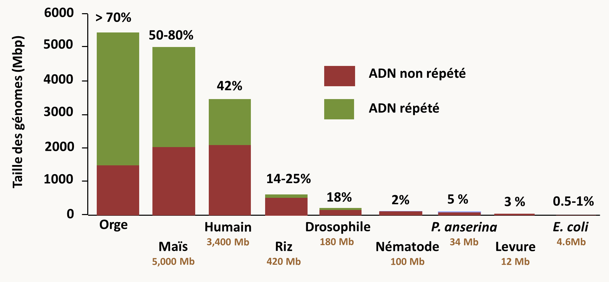

- chez les mammifères, plus d'un million de transposons se sont accumulés dans le génome. Ils représentent au moins 35% du génome humain. Les "rétroéléments" L1 (pour line 1) et Alu sont les plus fréquents.
- chez les plantes, l'accumulation de transposons est extrême puisqu'ils peuvent représenter la fraction majoritaire du génome (60-80%); dans certains cas, comme chez le pin, où ils représenteraient 100 000 MB d'ADN soit 50 fois le génome humain !!!
- chez la drosophile, ils représentent 18% du génome.
- chez le champignon *Podospora anserina*, on estime qu'il représente 5-10% du génome
- chez *Saccharomyces cerevisiae* qui est pauvre en transposon, il n'existe que 5 rétrotransposons (appelés Ty1 à Ty5 pour Transposons of Yeast) dont le nombre de copie varie en fonction des souches de quelques copies à plusieurs centaines, en particulier de solo LTR.
- chez les bactéries, les transposons semblent plus rares, comme chez *Escherichia coli*, où ils représentent moins de 1% du génome. Chez les procaryotes, les transposons sont souvent modulaires. L'unité de base est appelée séquence IS pour séquence d'insertion. Formellement, elles sont l'équivalent des transposons eucaryote de type II. Des séquences IS peuvent encadrer des régions d'ADN contenant des gènes responsables de résistances à des produits toxiques (comme les antibiotiques) ou de métabolismes particuliers. L'ensemble se comporte alors comme un transposon géant et se transfère éventuellement horizontalement entre bactéries.

Dans la plupart des génomes, les transposons ne sont pas répartis au hasard (figure 35). En effet, ils sont concentrés au centromère dont ils constituent souvent la majeure partie. Ils sont aussi présents aux télomères et chez certains eucaryotes qui n'ont pas de télomérase, leur transposition permet le maintien de l'intégrité des extrémités des chromosomes. Ils sont enfin présents sous forme de "nids à transposons"  dans des régions situées au sein des bras chromosomiques. La plupart de ces nids à transposons sont empaquetés dans de hétérochromatine qui va inhiber leur expression. Néanmoins, les transposons peuvent s'insérer virtuellement partout dans le génome et leur insertion peut causer des inactivations de gènes ou des modifications de leur expression.

### Les éléments génétiques extrachromosomiques

Il s'agit principalement de plasmides et autres épisomes. Néanmoins, dans certains cas il peut s'agit d'ARN doubles brin apparentés à certains virus, voire des bactéries endosymbiotiques. Par exemple, chez *Saccharomyces cerevisiae* le caractère "killer" est conféré par des ARNs double brin alors que chez la paramécie, il est conféré par des bactéries endosymbiotiques. Le caractère "killer" permet aux souches qui le portent de tuer les souches sensibles en secrétant une toxine à laquelle elles résistent. Les facteurs de résistance ou antitoxines sont souvent portées par le même élément que celui qui porte les toxines.

Les plasmides sont surtout présents chez les bactéries où ils confèrent des résistances à divers antibiotiques et les archées, mais ils sont aussi détectés chez les eucaryotes. Chez les eucaryotes avec quelques exceptions, ils sont localisés dans la mitochondrie ou le chloroplaste où ils ne semblent pas promouvoir des avantages mais plutôt des inconvénients. Je vous rappelle que les plasmides ont permis le développement de systèmes de manipulation de l'ADN in vitro et de la technologie de l'ADN recombinant en permettant le clonage et l'analyse des gènes. Pour plus de détail, je vous renvoie à vos cours de Biologie Moléculaire. Cette technologie sera considérée comme acquise dans ce livre dans le cas des bactéries. Voici quelques exemples de plasmides et autres éléments génétiques facultatifs.

Chez *Escherichia coli*

- ColE1 : Ce plasmide est circulaire double brin, mesure 9 kb et est présent à 10-30 copies par cellules. Il est connu pour avoir donné son origine de réplication qui est à la base de la majorité des vecteurs que nous utilisons (pBR322, Puc18, pBluescript, etc.; figure 36). Il porte un gène de production de bactériocine (ici la colicine E1) qui est une protéine bactéricide et qui assure donc un avantage aux bactéries qui le portent. Il existe de nombreux autres types de gènes pouvant être portés par des plasmides: gènes de résistance à des antibiotiques, gènes de virulence, gènes d'enzymes de dégradation de substrats divers...

  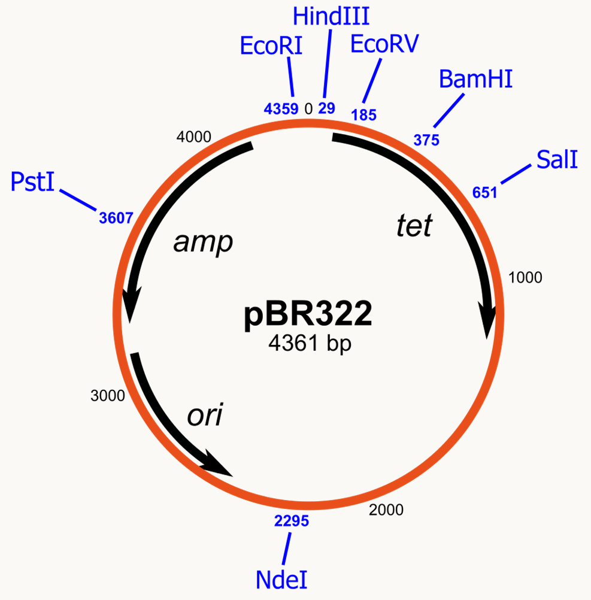

- L'épisome F: Le plasmide F est circulaire double brin, fait 94,5 kb et se trouve à 1 copie par cellule (figure 37). Il ne porte pas de gène de résistance ou autre mais il code pour de nombreux gènes impliqués dans la formation de contacts entre cellules et du transfert du plasmide pendant la "conjugaison". En effet, on appelle F+ les souches qui portent le plasmide F et F- celles qui ne le portent pas. Les souches F+ ont de long "poils" sexuels qui permettent d'établir des ponts cytoplasmiques avec des souches F-. Après établissement du contact entre une cellule F+ et une cellule F-, le plasmide F est transféré unidirectionnellement de la souche F+ vers la souche F- aboutissant à sa transformation en souche F+. On appelle ce processus conjugaison ou abusivement cycle parasexuel et les F+ sont alors appelées mâles et les F- femelles (figure 37).

  

  F possède aussi plusieurs régions qui permettent son insertion dans le chromosome: il s'agit donc d'un épisome. Nous verrons comment l'utiliser pour la cartographie de gènes dans les bactéries.

- Le plasmide Ti: ce plasmide présent chez la bactérie *Agrobacterium tumefaciens* porte la région T-DNA qui est injectée dans les cellules de plantes par la bactérie lorsque celle-ci infecte les plantes.

  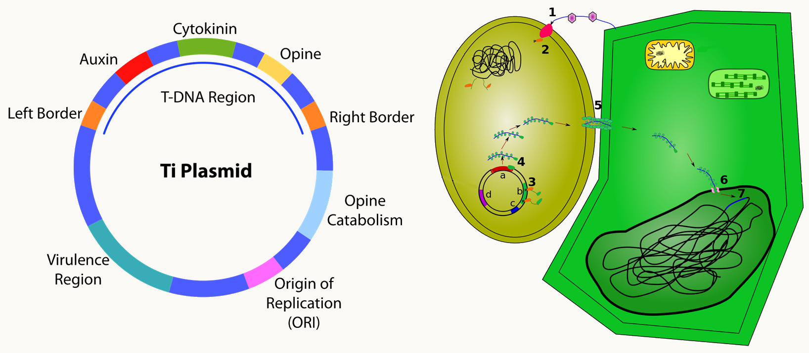

  Ce plasmide a permis de mettre au point des méthodes pour transformer les cellules végétales ou fongiques.

Chez *Saccharomyces cerevisiae*

- 2µ : Le plasmide 2µ est circulaire double brin et fait 6,3 kb (figure 39). Il se trouve dans le noyau de levure à 20/30 copies par cellule. On ne comprend pas bien pourquoi il est maintenu dans les populations, car il ne semble pas conférer d'avantage (résistance ou autres) aux souches qui le portent et ne semble pas avoir de système de propagation efficace comme F. Pourtant,  il est présent dans environ 70% des souches et se perd avec une fréquence inférieure à 0.001 %. Outre une origine de réplication (ORI) et une région cis qui confère la stabilité du plasmide (STB), il possède quatre gènes codant pour des protéines dont deux (REP1 et REP2) sont impliquées avec STB dans l'équipartition du plasmide entre cellules mères et cellules filles et une (FLP1) dans un mécanisme de recombinaison spécifique qui permet l'interconversion du plasmide entre deux formes en catalysant la recombinaison entre les deux séquences FRT, ce qui permet de changer de mode de réplication et donc participe au contrôle du nombre de copies du plasmide. La dernière RAF1 contrôle aussi la stabilité et le nombre de copies du plasmide. Le plasmide 2µ a servi de base pour générer de nombreux vecteurs pour introduire de l'ADN chez la levure et le système FLP/FRT a permis la construction de systèmes de mutations conditionnelles.

  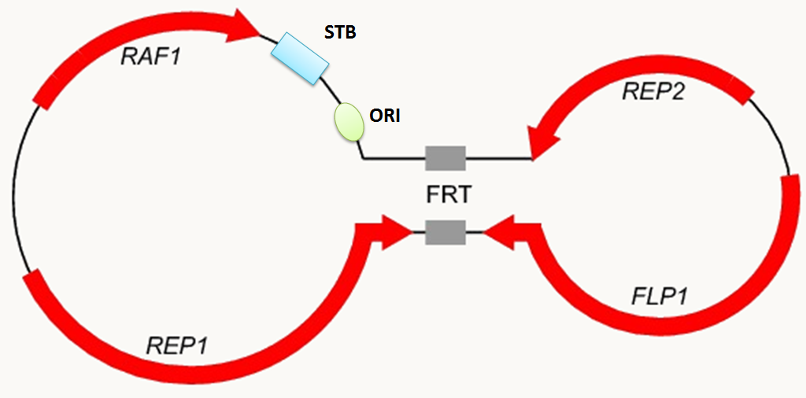

Chez *Podospora anserina*

- pAL2-1: ce plasmide de 9.3 kb est localisé dans la mitochondrie de quelques souches de *Podospora anserina* (figure 40). Contrairement aux plasmides précédents, il est linéaire. Il code pour deux protéines: une ADN polymérase et une ARN polymérase probablement impliquées dans l'expression et la réplication du plasmide. pAL2-1 confère un allongement de la longévité des souches qui le porte, ce qui est en opposition à des plasmides similaires présents chez *Neurospora crassa* qui eux causent au contraire des syndromes dégénératifs accélérés.

- senDNAα: nous avons vu dans la section précédente que le gène codant la sous-unité I de l'oxydase du cytochrome C chez *Podospora anserina* contient un intron original qui a la capacité de transposer (figure 40). Les copies transposées sont présentes dans une minorité des molécules de génomes et ne sont détectables que par PCR. Il a aussi la capacité de se retrouver sous forme de molécules circulaires extra-chromosomiques qui s'amplifie au fur et à mesure que les souches sénescent. En particulier, il est indétectable dans les souches jeunes, alors qu'il peut remplacer l'ADN mitochondrial dans la plupart des souches sénescentes. Le modèle pour expliquer la genèse de la première molécule extrachromosomique est basée sur la transposition de l'intron en amont de sa position, créant ainsi un doublet d'intron en tandem direct. Une recombinaison entre les deux copies permet de libérer une molécule circulaire (voir plus loin dans le livre, ce qu'il se passe lorsque deux séquences répétées en tandem recombinent) et qui ensuite peut s'amplifier via la présence d'une origine de réplication. La vitesse de l'amplification de cet élément dépend des souches, mais son amplification semble une constante de toutes les souches sauvages étudiées. Cet élément permet de montrer les limites de la notion de polymorphisme des éléments génétiques extrachromosomiques. En bon franglais, on parle donc plutôt d'un élément "plasmid-like".

  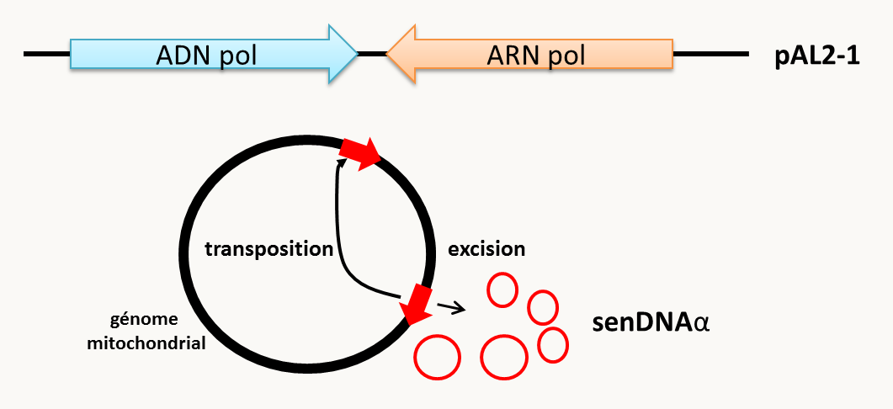

### Les mini et les microsatellites

Chez de nombreuses espèces (et en particulier chez les vertébrés), on note la présence de séquences répétées en tandem que l'on appelle satellites car généralement elles ne migrent pas à la même position que l'ADN génomique classique dans les centrifugations en gradients de césium, utilisées pour purifier l'ADN. Ces séquences en général ne codent pour rien (les gènes d'ARN ribosomaux en sont des contre-exemples). Ce qui est intéressant est que ces séquences présentent le plus souvent une variation du nombre de motifs. On distingue particulièrement deux types de séquences en fonction de la taille de l'unité répétée:

- Les **microsatellites** qui ont quelques nucléotides de longueur comme par exemple le trinucléotide GTT du microsatellite 1D25 de *Podospora anserina* (figure 41).
- Les **minisatellites** qui ont de 10 à 30 nucléotides de longueur.

On observe que le nombre de répétition de ces séquences est très variable en fonction des individus (de 10 à 60 répétitions pour les microsatellites et de 10 à 300 pour les minisatellites). Micro- et minisatellites sont le plus souvent présents en plusieurs copies dans le génome, où ils sont insérés entre des séquences uniques. Ils sont simples à révéler par PCR ou Southern Blot. Leur extraordinaire variabilité en fait d'excellents outils pour la cartographie, les recherches judiciaires ou l'établissement de paternité. Dans certains cas cependant, ils sont trop variables et changent entre les parents et les descendants ou même entre les cellules d'un même individu. L'amplification du nombre de ces motifs est à l'origine de certaines maladies chez l'homme.

Voyons pratiquement comment cela marche.

- Pour la recherche de paternité : dans ce cas, les échantillons d'ADN à tester proviennent d'un enfant, de la mère et de un ou plusieurs pères possibles. Les échantillons prélevés sont généralement des volumes sanguins suffisants pour obtenir une bonne quantité d'ADN de bonne qualité qui peut alors être utilisé pour plusieurs analyses de mini et microsatellites. En effet, la taille totale d'un minisatellite est de l'ordre de quelques dizaines de paires de bases à quelques kilobases et l'ADN extrait doit donc être de bonne qualité pour pouvoir les détecter.
  - la recherche par PCR s'effectue à l'aide de deux amorces situées de part et d'autre du micro ou minisatellite dans les régions uniques (voir la figure 41). La taille identique des bandes permet alors de rapprocher le père et l'enfant.
  - la recherche par Southern Blot s'effectue après digestion avec un enzyme qui ne coupe pas dans le minisatellite et hybridation avec une sonde qui est dans une des séquences uniques voisines.

- Pour la recherche judiciaire : il s'agit le plus souvent de retrouver un individu à partir d'un petit échantillon (cheveux, tache de sang ou de sperme). L'échantillon est en général de mauvaise qualité et âgé. L'ADN récupéré est donc en petite quantité et dégradé si bien que des petits fragments (de quelques centaines de paires de bases au plus) sont obtenus. Il faut donc se contenter d'analyser des microsatellites par PCR et confronter les résultats avec ceux de plusieurs coupables possibles.

Notez que l'être humain étant diploïde, la détection des microsatellites permet de détecter des individus homozygotes et des individus hétérozygotes. Il est évident que pour affirmer la paternité ou la culpabilité avec une forte confiance (>99.99%) plusieurs mini ou micro satellites très polymorphes doivent être regardés. La figure 42 donne la position des marqueurs testés couramment.

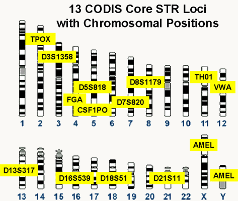

Dans les deux cas, une figure résume le nombre de répétions ou les allèles trouvés aux différents loci testés, ce qui donne l'empreinte génétique qui est unique pour chacun d'entre nous (figure 43).

### Les haplotypes et idiomorphes

Certains polymorphismes affectent plusieurs gènes d'un seul coup. D'autres sont retrouvés regroupés dans différents individus d'une population et se séparent rarement. On ne parle alors pas d'allèles pour ces polymorphismes complexes mais d'**haplotypes**.

exemples:

- Chez l'homme, l'ADN mitochondrial contient de nombreux polymorphismes. Ceux-ci ne sont pas distribués aléatoirement dans les individus car les mêmes polymorphismes sont toujours retrouvés associés chez différents individus. Cela reflète l'histoire évolutive de l'ADN mitochondrial car chez l'homme celui-ci se transmettant uniquement par la mère, il ne subit pas de recombinaison (nous verrons plus en détail dans un chapitre ultérieur, les modalités de la transmission de ces polymorphismes mitochondriaux au cours des mitoses et des méioses). La connaissance de ces haplotypes, permet donc de retracer, l'histoire des populations humaines, et plus particulièrement celle des femmes, et de proposer des hypothèses sur les mouvements des populations au cours du temps (figure 44). Notez que des études similaires sont faites avec le chromosome Y qui trace l'homme.

  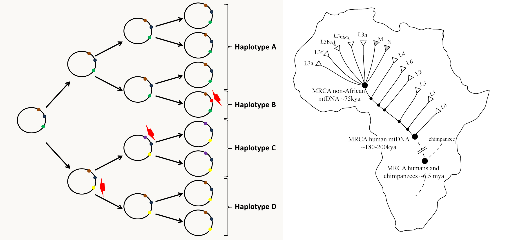

- Chez *Neurospora crassa* entre les souches mata et matA ou chez *Podospora anserina* entre les souches mat+ et mat-,  les différences sont dues à plusieurs gènes: il y a un gène au locus mata/mat+ et trois gènes au locus matA/mat- (figure 45). Chez ces deux champignons hétérothalliques, les croisements ne sont fertiles qu'entre souches mata (resp. mat+) et mat A (resp. mat-). Dans ce cas, on parle d'**idiomorphes** plutôt que d'haplotypes. Ces idiomorphes contrôlent les types sexuels pour assurer la reproduction mais aussi un phénomène d'incompatibilité des hétérocaryons spécifiquement chez *Neurospora crassa*. Chez les champignons, il est possible de fusionner deux cellules différentes pour obtenir une cellule avec un cytoplasme résultant de la fusion des deux cytoplasmes et contenant les noyaux des deux cellules: les cellules sont naturellement multinucléées chez les champignons *Pezizomycotina* et peuvent fusionner naturellement selon un processus appelé **anastomose**. Il est donc facile d'obtenir ce que l'on appelle un **hétérocaryon** en mélangeant les mycéliums de deux souches de génotypes différents. Chez *Neurospora crassa*, la présence dans le même cytoplasme de noyaux mata et matA est impossible car dans ce cas il se produit une réaction qui aboutit à la mort de la cellule. Au contraire chez *Podospora anserina*, la condition naturelle du champignon est d'être sous la forme d'un hétérocaryon mat+/mat- et donc d'être autofertile.

  

### Les variations chromosomiques

Celles-ci sont variées. Citons entre autre des modifications de la structure des chromosomes telle que les délétions, les duplications de certaines régions, les inversions ou les translocations (voir figure 59). A ceci, il faut ajouter les variations du nombre de chromosomes telles que :

- des modifications du taux de ploïdie: c'est dire des individus qui comportent 3 génomes haploïdes (triploïdes) ou 4 génomes haploïdes (tétraploïdes) au lieu de deux génomes. Ces phénomènes sont fréquents chez les plantes.

- des différences dans le nombre de chromosomes liées à des chromosomes optionnels (chez certaines plantes) ou qui ont été perdus ou gagnés par rapport au génome normal (triploïde partiel ou haploïde partiel: dans ce cas on parle d'aneuploïde) ou à des fusions de chromosomes.

Citons un cas de fusion qui est très utilisé en génétique de la drosophile. On dispose de souches dites avec des X attachés (X^X). Il s'agit en fait de fusion de chromosomes X. Chez la drosophile le contrôle du sexe se fait par une balance entre le nombre de chromosomes X et le nombre de jeux d'autosomes (A). Si X = A alors l'individu est femelle, si X = 1/2 de A alors l'individu est mâle.

Dans le cas des X attachés les individus X^X Y sont donc femelles. Que se passe-t-il si nous les croisons (figure 46) avec des mâles classiques ?

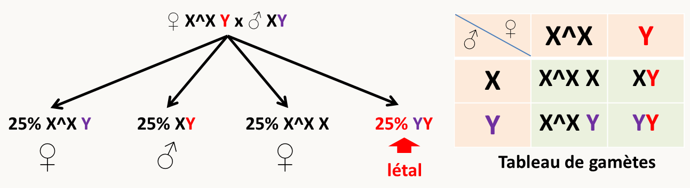

Nous voyons par exemple que dans ce type de croisements le mâle hérite son chromosome Y de sa mère  et son chromosome X de son père, à l'inverse des croisements normaux.

## L'épigénétique

Une partie des polymorphismes héritables présents dans les populations n'est pas liée à des polymorphismes classiques, c'est à dire résultants de variations de la séquence primaire de l'ADN. Ces polymorphismes ont souvent des modalités de transmission qui n'obéissent pas aux lois de Mendel. On dit qu'ils proviennent de **modifications épigénétiques** et leur apparition est liée à ce qu'on appelle des **épimutations**. Il existe une grande variété de mécanismes conduisant à ces polymorphismes épigénétiques qui peuvent être classés sous deux grandes bannières: hérédité de structure et hérédité de régulation. Les modifications épigénétiques les plus connues sont à la charnière de ces deux groupes car elles résultent de modifications de structure de la chromatine, ce qui a un impact sur la régulation des gènes affectés. Nous allons voir quelques exemples emblématiques qui permettent de montrer la variété des mécanismes épigénétiques.

- Le plus vieux polymorphisme héritable et encore présent dans les collections a été découvert chez la plante *Linaria vulgaris* par Linnée (celui qui a inventé la nomenclature binomiale), il y a maintenant environ 250 ans! Il affecte la forme des fleurs (figure 47). Les analyses génétiques ont montré qu'en F1 d'un croisement normale x peloric, la descendance est normale et qu'en F2, le caractère ségrège de manière quasi mendélienne comme étant dû à un couple d'allèle d'un gène appelé *lcyc*. Néanmoins, le caractère est plus instable qu'un caractère lié à une mutation traditionnelle et les réversions de la forme *peloric* vers *normale* sont assez fréquentes, en particulier sur une même plante qui peut donc présenter un mélange de fleurs normales et de fleurs *peloric*. Les 2 allèles ont été clonés et aucune différence de la séquence primaire en acide nucléique pouvant expliquer le phénotype n'a été détectée. Des analyses de l'ADN de *lcyc* avec des enzymes de restriction sensibles à la méthylation ont permis de montrer que dans les individus peloric l'ADN est méthylé alors qu'il ne l'est pas dans les individus normaux. Pour voir l'état de méthylation, on utilise des enzymes de restriction isoschizomères reconnaissant le même site de coupure mais qui sont sensibles différentiellement à la méthylation. Par exemple, *Mbo*I coupe l'ADN non méthylé et méthylé alors que *Sau*3A1 coupe uniquement l'ADN non méthylé, les deux enzymes reconnaissant la séquence GATC. La méthylation de l'ADN est associée à une absence de transcription du gène lcyc spécifiquement dans la forme peloric. Cet état de méthylation est transmissible de manière très stable à travers la mitose et la méiose grâce à l'activité de méthylase de maintenance qui agissent sur des ADN hémi-méthylés (figure 47), expliquant que la forme peloric soit transmise de manière quasi mendélienne. Leur activité n'est pas efficace à 100%, expliquant les réversions fréquentes du caractère. L'état méthylé est acquis quant à lui par l'action de méthylase dite *de novo* de manière plus rare.

  

  Comme on le voit avec l'exemple des fleurs normales *versus* peloric l'état de méthylation est héritable. On note cependant une certaine instabilité des états de méthylation qui sont donc réversibles. Il existe d'autres types de phénomènes qui ressemblent à celui-ci, dans le sens qu'il s'agit de modifications structurales de l'ADN (le plus souvent de la chromatine chez les eucaryotes) sans changement de séquence, aboutissant à une hétérochromatinisation des gènes et leur inactivation transcriptionnelle. On parle alors de mécanismes dit de **TGS (pour Transcriptional Gene Silencing)** qui sont donc liés soit à de la méthylation de l'ADN soit à des modifications de structure de la chromatine.

- Les mécanismes dit de **PTGS (pour Post Transcriptional Gene Silencing)** sont liés à des états régulatoires alternatifs (présence ou absence d'une nucléase spécifique) liés à des ARNs double brin.  Ce mécanisme est par exemple responsable de l'extinction fréquente des transgènes dans les OGM de plantes. En effet, lorsqu'un gène est introduit par transformation dans une plante pour en multiplier le nombre de copies, il est très fréquent que toutes les copies, y compris celles déjà présentes dans la plante soient inactives, bien que les gènes soient dépourvus de mutations et soient transcrits normalement. L'extinction se situe au niveau de la stabilité des messagers qui sont dégradés par un mécanisme maintenant bien connu et qui implique une RNAase dont la spécificité est conférée par un ARNsi (figure 48). On appelle ce phénomène la **cosuppression**. Il a été décrit pour la première fois chez des pétunias transformés par le gène de la synthase de chalcone, un enzyme impliqué dans la biosynthèse de pigment flavonoïdes, ou il altère la coloration des fleurs (figure 48). Ce phénomène est cependant très général chez la plupart des eucaryotes où il est souvent connu sous le nom d'interférence à ARN. Il existe par exemple dans certains isolats naturels de pétunias qui n'ont pas de pigments au centre des fleurs. Nous reviendrons sur ce mécanisme qui est fréquemment utilisé pour inactiver les gènes chez de nombreux eucaryotes.

  ![en haut mécanisme de PTGS. Dans le cas du PTGS, le gène endogène (ChsA) est transcrit normalement et le transgène produit, outre des messagers normaux, des ARNs aberrants, le plus souvent partiellement double brin. Ces ARNs double brin sont reconnus par l'enzyme DICER qui les clive en ARNsi d'une vingtaine de nucléotides. Les ARNsi se dissocient et se réassocient avec l'enzyme RISC qui cible les messagers normaux grâce à l'homologie de séquence entre l'ARNsi et le messager et catalyse leur dégradation. Notez que si la reconnaissance est incomplète parce que les séquences ne sont pas parfaitement homologues, cela aboutit à l'inactivation de la traduction plutôt que la dégradation du messager. Le phénomène est probablement amplifié par une ARN polymérase ARN-dépendante (RDRP) qui amplifie la quantité d'ARN aberrants en utilisant l'ARN normal comme matrice, comme cela a été montré chez Arabidopsis thaliana. En bas, pétunia sauvage à gauche et deux souches présentant de la cosuppression au centre et à droite.](img/image048.png)

- Chez *Podospora anserina*, il existe deux types de souches dans la nature qui diffèrent par la présence de deux allèles du gène het-S/s appelés, het-s et het-S. Comme pour le type sexuel de *Neurospora crassa*, le gène het-S/s contrôle l'incompatibilité végétative (voir ci-dessus). Quand des cellules het-s et het-S fusionnent; l'hétérocaryon het-s + het-S formé meurt rapidement. En fait, les souches portant l'allèle het-s présentent des propriétés particulières. Elles se présentent naturellement sous deux formes : sous la forme het-s pour 70% d'entre elles, elles sont incompatibles avec les souches het-S, mais elles peuvent se présenter aussi dans 30% des cas sous la forme het-s* qui n'est pas incompatible avec les souches het-S (figure 49). Ce qui est très surprenant, c'est que lorsque l'on prend ses souches het-s* et qu'on les met en contact avec une souche het-s alors elles deviennent het-s !  Cela s'explique par la transmission des souches het-s vers les souches het-s* d'un élément cytoplasmique et infectieux (figure 48) qui envahit donc le mycélium het-s* et le convertit en het-s. L'analyse génétique montre une ségrégation étrange non mendélienne, puisque:

  lors d'un croisement ♀ het-s* x ♂ het-s,  100% de la descendance est het-s*

  lors d'un croisement ♀ het-s x ♂ het-s*,  100% de la descendance est het-s

  confirmant une ségrégation avec le cytoplasme puisque le gamète femelle transmet l'état het-s* ou het-s. Plus étrange, lors de croisements  entre souches het-s et het-S, la descendance portant l'allèle het-s est het-s* dans 100% des cas (figure 49), comme si het-s avait disparu! Le caractère peut réapparaître, le passage d'une souche het-s* vers une souche het-s, se faisant spontanément avec une fréquence faible. Maintenant nous savons que la différence entre les souches het-s est het-s* est due à deux conformations différentes de la protéine codée par het-s: la conformation het-s incorporée dans des fibres amyloïdes étant infectieuse vis à vis de la conformation het-s* (figure 49).

  ![à gauche, la transmission via les anastomoses et la ségrégation non mendélienne du caractère het-s*. A droite, explication du comportement de l'allèle het-s. Après traduction, la protéine het-s est soluble et n'interagit pas avec het-S. En absence de fibre amyloïde, les souches sont donc sous forme het-s*. L'apparition spontanée d'une première fibre, entraîne de manière autocatalytique l'incorporation de het-s dans la fibre qui interagit alors avec het-S et démasque un domaine de mort cellulaire présent dans het-S.](img/image049.png)

  On dit que la protéine het-s se comporte comme un **prion**. La définition de prion a été donnée pour la première fois par Stanley Prusiner en 1982 à l'agent responsable de la maladie de Creutzfeld-Jacob et autres encéphalopathie spongiformes (Kuru, tremblante du mouton, maladie de la vache folle..) qui a les mêmes propriétés d'incorporation autocatalytique au sein de fibres amyloïdes. Ce genre de phénomènes d'hérédité a été prouvé pour de nombreuses autres protéines chez les levures dont bien évidemment *Saccharomyces cerevisiae* chez qui ils ont été analysés en détail, mais aussi chez des bactéries, des plantes et des animaux.  Les prions sont les exemples les plus emblématiques de l'hérédité de structure.

Notez qu'il existe une classe de phénomènes épigénétiques : les états métaboliques ou régulatoires alternatifs qui sont très complexes et font intervenir de nombreux partenaires. Ces caractères épigénétiques sont transmissibles d'une génération à la suivante, mais en général ne suivent pas les lois de Mendel.  Ils sont en plus souvent instables ce qui les différencient des polymorphismes liés à des différences de la séquence primaires d'acides nucléiques. En conclusion, les phénomènes épigénétiques sont très variés et fréquents dans la nature où ils interviennent dans des phénomènes divers surtout dans les cellules eucaryotes. Pratiquement, ils sont importants pour la transgenèse et la thérapie génique. Il est en effet fréquent qu'après introduction de séquences d'ADN dans une cellule, l'expression de celles-ci soit rapidement inhibée, soit par TGS, soit par PTGS.

## Les mutations

Nous avons vu au début de ce chapitre qu'il existe des polymorphismes dans les populations et avons pu pour un gène donné en calculer les fréquences. Quelle est l'évolution des fréquences des différents allèles polymorphes dans une population ?
Nous ne répondrons pas en détail à cette question car cela nécessite des analyses qui sont du ressort de la Génétique des Populations. Cependant, nous allons quand même montrer que dans une grande population, si les gamètes se rencontrent au hasard et qu'aucune sélection ne s'effectue sur ces gamètes ou sur leurs descendants alors les fréquences des différents allèles restent constantes au cours des générations. C'est la loi de Hardy-Weinberg.

Soit un gène polymorphe avec deux allèles a et b. Ces allèles sont présents avec les fréquences alléliques respectives, Fa et Fb. Évidemment Fa + Fb = 1. Selon nos hypothèses, cela veut dire que les parents vont produire Fa de gamètes a et Fb de gamètes b. La figure 50 présente le calcul des fréquences de production de gamètes a et b par les descendants issus la rencontre de ces gamètes.

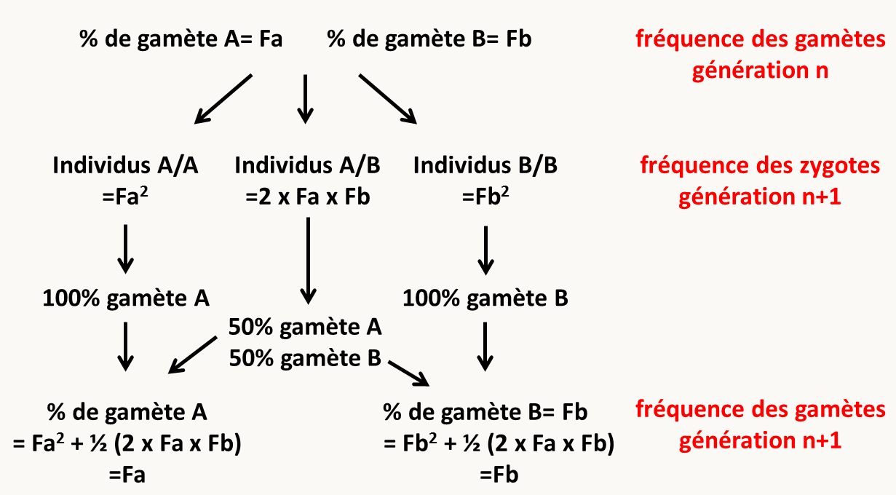

Le calcul montre que les fréquences alléliques restent constantes d'une génération à l'autre. Il n'y a donc pas de disparition du polymorphisme sous les hypothèses de répartition aléatoires des gamètes. On dit que la population est en équilibre de Hardy-Weinberg. Si des variations de ces fréquences sont observées au cours des générations dans une population cela veut dire que des mécanismes supplémentaires à la répartition simple au hasard des gamètes sont en action. Il peut s'agir de mécanismes de sélection, de migration ou autres évènement tels que l'apparition de nouveaux allèles. En effet, si du polymorphisme existe au sein des populations c'est qu'il a été créé. **Il existe donc des mécanismes qui permettent l'apparition de polymorphisme. Il s'agit le plus souvent des mutations**, dans d'autres cas plus rares d'**épimutations**.

On peut expérimentalement mettre en évidence l'existence des mutations. Lorsque l'on prend un grand effectif d'individus d'une souche pure, on constate que certains individus (en général en proportion infime) présentent spontanément des variations. On appelle alors la population de départ la souche **"sauvage"** et les individus des **variants**. Si les descendants de ceux-ci présentent encore le caractère nouveau et que celui-ci peut donc se transmettre, on les appelle des **mutants** et on dit qu'ils portent une **mutation** (bien sûr dans le cas où un changement de séquence dans le matériel génétique a été mis en évidence ou est fortement suspecté; autrement il peut s'agir d'**épimutants**). Tout caractère peut être affecté. On peut ainsi définir un certain nombre de type de mutations en se référant aux polymorphismes qu'elles entraînent.

## Les différents types de mutations

Les mutations sont souvent qualifiées par le polymorphisme qu'elles créent (SNR, inversion, insertion etc.) ou les caractères qu'elles entraînent. Voici quelques types de mutations classées en fonction de leurs effets physiologiques :

- les mutations **létales** qui entraînent la létalité des souches qui les portent. Il est évident que de telles mutations ne peuvent apparaître dans une population que si elles sont récessives ou conditionnelles.
- les mutations d'**auxotrophie** qui ne permettent plus aux souches qui les portent de pousser sur milieu minimum
- les mutations **thermosensibles** ou **cryosensibles**
- les mutations **pléiotropes** qui affectent plusieurs caractères en même temps

etc.

Ici nous devons faire la distinction entre deux types de mutations différentes. Dans la nature, il existe grosso modo deux types d'organismes: ceux pour lesquels toute cellule peut assurer sa descendance (exemple: les bactéries, les champignons, les protistes, etc.) et ceux pour lesquels il existe deux types de cellules : les cellules **somatiques** qui n'assure pas la descendance et les cellules **germinales** qui assurent la descendance (exemple: les animaux et les plantes supérieures). Dans le premier groupe d'organismes, toute mutation est susceptible de se transmettre à la génération suivante par contre dans le deuxième groupe seule celles affectant la lignée germinale se transmettront à la descendance, ce sont les **mutations germinales**. Il existe d'autres mutations qui affectent spécifiquement les cellules somatiques dites **mutations somatiques**.

Attention une mutation qui apparaît dans une cellule somatique se transmet à tous les descendants de cette cellule, elle ne sera par contre pas transmise à la génération suivante aux descendants issus de la lignée germinale. Ces mutations ne sont cependant pas négligeables biologiquement car une catégorie importante regroupe les mutations somatiques qui conduisent à la formation de tumeurs cancéreuses!

## Les modalités d'apparition des mutations

Les mutations résultent de deux grands types de phénomènes.

- la fidélité de la transmission du matériel génétique n'est pas de 100%. Ceci dérive de plusieurs processus intrinsèquement liées aux propriétés physico-chimiques de la matière.

  Exemples :

  - La tautomérisation de certaines bases qui peuvent entraîner des appariements illégitimes qui ne seront pas détectés et qui pourront donc donner naissance à des mutations au tour de réplication suivant. Ce phénomène intéresse toute les bases  la cytosine (figure 51) mais aussi l’adénine avec l’imino-adénine qui s’hybride avec la cytosine, la thymine avec l’énol-thymine qui s’hybride mieux avec la guanine que l’adénine et la guanine avec l’énol-guanine se s'associe avec avec la thymine en préférence à la cytosine.

    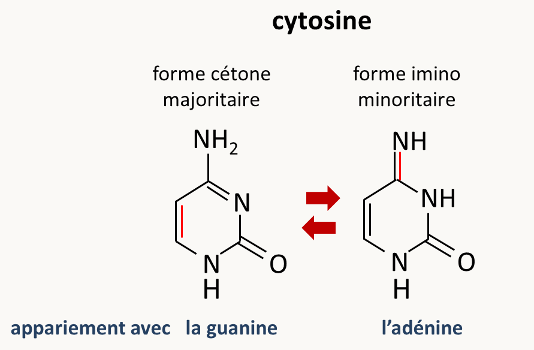

  - La désamination des bases : la cytosine se transforme en uracile qui s'hybride avec l'adénine, l'adénine se transforme en hypoxanthine qui s'hybride préférentiellement avec la cytosine, la guanine en xanthine qui s'associe soit avec la thymine soit avec la cytosine, et la 5-methyl-cytosine donne de la thymine.

  - la perte de bases par dépurination et dépyrimidination qui a lieu surtout à pH acide. Dans ce cas, la polymérase ne sait pas quoi ajouter comme base complémentaire...

- l'ADN subit aussi d'autres lésions qui sont réparées plus ou moins efficacement. Celles-ci peuvent résulter de la production normale des radicaux libres dans les cellules aérobies. En effet, la chaîne respiratoire génère constamment  des radicaux hydroxyl OH°, des ions superoxydes O2-et du peroxyde d'hydrogène H2O2. Ces molécules très réactives interagissent avec les bases de l’ADN et les modifient ou les cassent.  L'ADN mitochondrial va bien évidemment être très souvent "attaqué" par les radicaux libres. Les conditions de l'environnement vont aussi avoir une influence sur la fréquence d'apparition des dommages. C'est le cas par exemple de la présence de rayonnements ou d'**agents mutagènes**.

  Exemples :

  - Les rayons X et les rayons γ provoquent des cassures doubles brin.
  - Les rayons UV, aux longueurs d’onde proches du maximum d’absorption de l’ADN (260-280nm), provoquent la formation de dimère de cyclobutane-pyrimidine. Ceci entraîne une torsion anormale de l’ADN et empêche l’appariement correct au moment de la réplication, qui s’arrête ou est considérablement freinée. Ces dimères sont extrêmement stables. En pratique cependant, le rayonnement solaire d’UV à ces longueurs d’onde est presque totalement absorbé par la couche d’ozone (quand elle existe...).

  - Les agents alkylants directs ou ceux produits après métabolisation par les cytochromes P450 comme l’acétyl amino fluorène et le benzopyrène fabriqués par l'homme ou l’aflatoxine B1 fabriquée par le champignon *Aspergillus flavus* vont se "cross-linker" à l'ADN et l'endommager.
  - La mitomycine, le cis-platine ou le psoralène vont ponter entre eux les deux brins de l'ADN et bloquer la réplication.
  - La proflavine ou l'ICR-170 (=acridine mustard ou 2-methoxy-6-chloro-9[3- (ethyl-2-chloroethyl)aminopropylamino]acridine·2) s'intercalent entre les bases de l'ADN et causent des décalages du cadre de lecture.
  - L'éthyl-méthylsulfonate réagit avec la guanine et la transforme en *O*6-ethylguanine qui va s'hybrider au cours de la réplication avec la thymine.
  - la colchicine empêche la formation des fuseaux et cause ainsi des pertes de chromosomes ou alors des polyploïdisations.

  Notez que ces produits mutagènes sont très toxiques car ils ont des activités cancérigènes ou tératogènes. Il est aussi possible de baisser le taux de mutations spontanées grâce à certains composés. On sait par exemple, que l'adjonction de produits ayant des activités antioxydantes permet de limiter le taux de mutations en particulier au niveau de l'ADN mitochondrial. Les fréquences de ces dommages sont impressionnantes; on estime en effet qu'une cellule animale  par génération subit:

  - 20 000 cassures simple-brin

  - 10 000 dépurinations de bases

  - 5 000 alkylations de bases

  - 2 000 oxydations de bases

  - 500-600 désamination de bases

  - 10-20 cassures double-brins

Il est bien évident que les cellules ont de multiples mécanismes pour éliminer les dommages que subit l'ADN, mais les mécanismes de réparation ne sont pas parfaits, surtout si les altérations se sont produites juste avant la réplication et/ou qu'elles sont présentes en trop grands nombres et que les systèmes de réparation sont débordés. De même, les dommages qui affectent un seul des deux brins de l'ADN peuvent être facilement réparés alors que ceux qui affectent les deux brins le seront plus difficilement, en particulier chez les cellules haploïdes, car chez les cellules diploïdes, il existe des mécanismes qui vont utiliser la copie intacte d'ADN pour réparer la copie endommagée. Des mutations peuvent alors se produire à cause de mauvaises réparations ou par "erreurs de réplication" faites par la polymérase. L'apparition des mutations, bien que rare, est donc un phénomène spontané et continuel. Néanmoins, leur fréquence peut être augmentée par la présence d'agents mutagènes. L'analyse détaillée des multiples mécanismes moléculaires de réparation des dommages à l'ADN est en dehors du cadre de ce livre et je vous renvoie vers des cours de biologie moléculaire pour en savoir plus. Nous reviendrons cependant au cours de l'étude de la recombinaison sur certains mécanismes de réparation car les deux phénomènes sont liés et partagent les mêmes acteurs moléculaires.

Voyons maintenant plus en détail l'aspect génétique du phénomène en commençant par les modalités de leur apparition.

Le problème de l'apparition des mutations n'est pas trivial et il est encore débattu aujourd'hui. En effet, si la majorité des généticiens s'accordent pour dire que les mutations se produisent au hasard, il en existe quelques-uns qui pensent que celles-ci pourraient être induites par le milieu. Il faut comprendre induite non pas comme "ayant une fréquence augmentée par le milieu" car nous avons vu qu'effectivement des conditions de milieu peuvent augmenter de manière considérable le taux de mutation, mais plutôt dirigées par le milieu. Des expériences ont fait resurgir de manière épisodique ce débat qui malheureusement sort du cadre de ce cours. Quoi qu'il en soit, des expériences ont clairement montré que les mutations apparaissent spontanément. La première démonstration convaincante de ceci a été faite grâce à ce que l'on appelle aujourd'hui le test de fluctuation.

## Le test de fluctuation

Prenons l'exemple qu'étudiait Salvator Luria et Max Delbrück (1943) et qui a permis d'apporter la première démonstration que les mutations apparaissent spontanément avant le traitement qui permet de les révéler. Ces chercheurs étudiaient la résistance d'*Escherichia coli* B au phage α. Pour révéler les bactéries résistantes, ils mettaient en cultures des bactéries sensibles, les laissaient pousser, puis ajoutaient des phages et étalaient la culture sur des boites de Petri. Seules les bactéries résistantes donnaient naissance à des colonies (facilement comptables !). Ils essayaient de mesurer la fréquence d'apparition de bactéries résistantes au phage et observaient de grandes fluctuations dans leurs résultats. Ils ont raisonné justement que cette fluctuation était en fait due à l'apparition stochastique des mutations et pourrait donc permettre de trancher entre les deux hypothèses du moment:

Hypothèse I: les mutations sont induites avec une certaine probabilité dans la bactérie par le contact avec le phage. En d'autre terme, il existe une petite probabilité qu'une bactérie résiste à l'attaque d'un phage et si elle résiste, elle et ses descendants acquièrent alors une immunité contre le phage.

Hypothèse II: les mutations de résistance apparaissent dans la bactérie spontanément avec une probabilité fixe avant leur exposition au phage.

Dans le cas de la première hypothèse, l'étalement de cultures indépendantes de bactéries traitées par le phage devrait donner toujours la même quantité de bactéries résistantes qui dépend de la probabilité que la bactérie résiste au phage. Comme celle-ci est très petite et l'effectif est très grand, la loi de probabilité attendue est donc une loi de Poisson qui a pour caractéristique que sa moyenne égale sa variance. Au contraire, dans le cas de la deuxième hypothèse, le moment d'apparition des mutations va varier en fonction des cultures, entraînant une grande différence entre les cultures ou l'évènement a eu lieu tôt et ceux où il a eu lieu tard (figure 52). Dans ce cas, la variance sera très supérieure à la moyenne. Pour éliminer un biais expérimental de mortalité différentielle liée aux conditions expérimentales, une culture contrôle est aliquotée sur plusieurs boites: normalement le nombre de bactéries résistantes doit dans ce cas suivre une loi de Poisson.

Donc Luria a fait l'expérience (Delbrück ayant fait le développement théorique de l'idée de Luria) et a obtenu les résultats suivants:

exemple (parmi 3 expériences témoin) de résultats obtenus si une culture est divisée en 10 et étalée sur 10 boîtes : 14, 15, 13, 21, 15, 14, 26, 16, 20, 13

moyenne= 16,7
variance= 15

L'analyse statistique montre que ces deux chiffres ne sont pas différents. Donc la procédure d'étalement n'introduit pas de variation significative autre que l'échantillonnage au hasard.

exemple (parmi 10 expériences) de résultats obtenus si plusieurs cultures sont faites en parallèle et étalées sur des boites séparées dans les conditions de l'expérience témoin: 1, 0, 3, 0, 0, 5, 0, 6, 107, 0, 0, 0, 1, 0, 0, 64, 0, 35, 0, 5

moyenne= 11,35
variance= 694 (corrigée pour la variation de l'étalement).

CQFD: il est clair que c'est l'hypothèse n°II (les mutations préexistent à leur révélation) qui est la bonne !

De plus cette expérience nous permet de bien saisir la différence entre taux de mutants et taux de mutation. En effet, le nombre de mutants observés dans une culture résulte du nombre de mutations apparues et du nombre de divisions que le mutant a pu faire avant la révélation. Le taux de mutant est donc variable d'une culture à une autre en fonction du hasard de l'apparition des mutations. Au contraire, le taux de mutation est constant (si les conditions expérimentales sont constantes) et les mutations apparaissent au hasard.

S'il est facile de calculer le taux de mutants, quid du taux de mutation ?

Le test de fluctuation fait ci-dessus permet de le calculer: pour ceci, il faut s'intéresser aux cultures qui ne donnent pas de mutants résistants. On admet que chacune des cultures a été initiée avec le même nombre n0 de bactéries au début et contient le même nombre de bactéries n à la fin. Il s'est donc passé n-n0 divisions dans chacune des cultures. Si P est la probabilité de muter en souche résistante à chaque division (taux de mutation par unité de génération), la proportion de cultures sans mutant (f que l'on mesure dans l'expérience) est égale à la probabilité d'observer 0 mutation après toutes ces n-1 divisions, soit (1-p)n-n0. De là, on tire que

p= 1- e ln f / n-n0.

Par exemple dans une de leurs expériences, Luria et Delbrück ont effectué 87 cultures, parmi celles-ci, 29 ne présentaient pas de colonies résistantes. Ces cultures ont été ensemencées avec 50-500 bactéries et contenaient à la fin environ 2.4 108 bactéries, d'où l'on tire que le taux de mutation est de:

p= 1- e ln f / n-n0 = 4,5 10-9 mutations / division cellulaire

Une autre expérience indépendante a permis de montrer plus simplement le même résultat. C'est l'expérience des répliques sur velours inventée par Joshua et Esther Lederberg (1952). La figure 53 résume l’expérience en prenant un exemple de bactéries résistantes à la streptomycine. Des bactéries sensibles sont étalées sur du milieu sans antibiotique, et ensuite repiquées grâce à du velours sur du milieu contenant de l'antibiotique. Sur ce milieu, les mutants résistants poussent et sont facilement repérables. Il suffit ensuite de retourner vers la boîte de milieu initial sans antibiotique pour constater que les levures de la colonie initiale de les repiquer sur du milieu avec antibiotique et de constater que la toutes les cellules de la colonie sont aussi résistantes, et que donc, ce n'est pas le milieu qui a provoqué la mutation de résistance mais bien un évènement aléatoire.

![Figure 53: le principe de l'expérience des époux Lederberg. Une culture de bactéries sensibles est étalée sur du milieu avec (+ streptomycine) ou sans antibiotique (-streptomycine). Sur le milieu avec l’antibiotique (boite n°1), des bactéries résistantes génèrent des colonies contenant des millions d’individus résistants. S’ils sont étalés sur du milieu avec de l’antibiotique, chacun de ces descendants résistants va former de nouvelles colonies (boite n°2), montrant l’héritabilité de la mutation conférant la résistance. Sur le milieu sans antibiotique (boite n°3), toutes les bactéries qu’elles soient résistantes ou sensibles donnent naissance à des colonies. Joshua et Esther Lederberg ont utilisé la méthode des répliques au velours pour former une copie de ces colonies sur du milieu avec de la streptomycine (boite n°4). Le tissu de velours permet en effet de prélever une partie des cellules des colonies s’il est appliqué sur la boite n°3 et de transférer ensuite une fraction de celles-ci sur du milieu frais par simple contact. Seules les colonies contenant des individus résistants vont alors donner naissance sur la boite n°4 à des nouvelles colonies. Comme précédemment, si ces descendants sont de nouveau étalés sur du milieu avec de l’antibiotique (boite n°5), ils vont tous donner naissance à de nouvelles colonies. Il est maintenant simple de savoir si la mutation de résistance à la streptomycine de la boite n°4 est apparue avant le contact des bactéries avec l’antibiotique. En effet, la colonie de la boite n°3 qui a donné naissance à la colonie résistante de la boite n°4 n’a jamais vu l’antibiotique. Contenant des bactéries déjà résistantes, leur étalement sur du milieu avec antibiotique donnera naissance à des colonies nombreuses (boite n°6). Un témoin avec une colonie qui n’a pas donné naissance à une colonie résistante sur la boite n°4 confirme qu’aucune des bactéries qui la composent n’est résistante (boite n°7). Le résultat de ce test a toujours conduit à la conclusion que les bactéries résistantes détectées sur la boite n°4 étaient en fait déjà présentes sur la boite n°3.](img/image053.png)

Ce résultat est l'un des plus fondamental de la biologie car, combiné avec le processus de sélection naturelle énoncé par Darwin, il a permis de proposer une hypothèse non finaliste de l'évolution de la vie que l'on désigne sous le terme de néodarwinisme. En effet, "un œil n'a pas été créé dans le but de voir" même s'il sert à ça, mais les organismes possèdes des yeux car (1) aléatoirement par le biais de mutations, certains ont acquis la capacité de détecter la lumière et (2) par ce fait, ils ont été avantagés par rapport à ceux qui en étaient dépourvus au niveau de leur reproduction, probablement parce que les yeux leur permettaient une meilleure connaissance du milieu alentour. Notez que le débat fait toujours rage pour savoir si cette évolution est obligatoirement progressive (c.a.d. que l'établissement de l'œil résulte de la succession de plusieurs mutations) ou s'il est possible de faire des sauts (c.a.d. qu'un "proto-œil" efficace est apparu à la suite d'une seule mutation).

## Fréquences d'apparition des mutations

L'exemple du test de fluctuation de Luria et Delbrück semble indiquer que le taux des mutations spontanées est très faible en conditions normales (c'est à dire en l'absence des agents mutagènes mentionnés plus haut), d'autant plus que la résistance au bactériophage pourrait être causée par des mutations localisées dans de nombreux gènes différents et que donc le taux de mutation pour chaque gène est encore plus faible. En fait les taux de mutation peuvent varier grandement en fonction de nombreux paramètres. Par exemple, voyons quelques taux de mutations pour certains caractères chez différents organismes:

| organisme                   | changement de phénotype                               | taux de mutation                                        |
| --------------------------- | ----------------------------------------------------- | ------------------------------------------------------- |
| bactériophage T2            | inhibition de la lyse                                 | 10-8 gènes mutants/réplication               |
|                             | changement spécificité d'hôte                         | 3.10-9 gènes mutants/réplication             |
| *Escherichia coli*          | capacité à fermenter lactose vers incapacité          | 2.10-7 cellules mutantes/division cellulaire |
| *Chlamydomonas reinhardtii* | sensible à la streptomycine vers résistant            | 10-8 cellules mutantes/division cellulaire   |
| *Neurospora crassa*         | prototrophie pour l'inositol vers auxotrophie         | 8.10-8 spores mutantes/spores totales        |
| *Drosophila melanogaster*   | œil rouge brique  œil blanc                           | 4.10-5 gamètes mutants/gamètes totaux        |
| *Homo sapiens*              | Chorée de Hungtington (maladie autosomale dominante)  | 10-8 gamètes mutants/gamètes totaux          |
|                             | dystrophie musculaire de Duchenne (maladie récessive) | 4-10.10-5 gamètes mutants/gamètes totaux     |

On constate une variabilité entre organismes mais aussi pour différents caractères à l'intérieur d'une même espèce. En fait ces données sont globales et ne tiennent pas en compte un certain nombre de données, dont:

- le nombre de gènes différents qu'il est possible de muter pour obtenir le caractère en question.

  exemples

  - Chez *Escherichia coli*, le taux de mutations spontanées  pour obtenir des souches résistantes à la streptomycine est de l'ordre de 10-12 par réplication, car la résistance ne peut être obtenue que grâce à quelques mutations affectant quelques codons d'un seul gène codant une protéine ribosomale. Au contraire, le taux de mutation pour le caractère croissance lente est de l'ordre de 10-6 car plusieurs centaines de gènes sont impliqués dans la croissance d’*Escherichia coli*.
  - De même, si on part d'une souche de levure *Saccharomyces cerevisiae* prototrophe, il est possible de trouver avec une fréquence assez élevée des souches auxotrophes car on estime à environ 200 le nombre de gènes impliqués dans les biosynthèses de métabolites. Une mutation, qui inactive l'un de ces gènes, est suffisante pour entraîner l'auxotrophie. Par contre, si on recherche une auxotrophie pour un métabolite particulier (acide aminé ou base), ce taux sera beaucoup plus faible.

- la redondance des gènes. En effet, s'il existe deux copies (ou plus) du même gène dans le génome il sera très difficile de trouver des mutations qui abolissent le fonctionnement des deux gènes en même temps (celles-ci sont en général récessives). Souvent les mutations obtenues dans ce cas altèrent la régulation des gènes en abolissant simultanément l'expression de toutes les copies. Elles ne sont donc pas localisées dans les gènes en question mais dans leur régulateur ! Par contre, pour chacun des gènes, il est possible d'obtenir des mutations dominantes.

Si on considère le taux de mutation par gène, il existe aussi une variabilité entre gènes liée à la taille du gène, à la sensibilité du produit codé aux changements d'acides aminés (ou des bases !), etc.

Enfin, une mention particulière doit être fait pour les transposons car ils sont la cause de nombreuses mutations. En fait chez de nombreux organismes, les transposons sont les principales sources de mutations spontanées. Chez la drosophile, on estime par exemple que 50% des mutations spontanées sont dues à des transposons. Dans un génome "stabilisé", la fréquence de transposition est donc du même ordre de grandeur que celle des mutations spontanées soit environ 10-6.  De même, la fréquence de réversion, correspondant à l’excision d'un transposon qui causait une mutation, et qui entraîne donc retour au phénotype sauvage, est de l'ordre de 10-6 par génération. Cela a été évalué par exemple chez *Escherichia coli* avec les séquences IS. Dans un génome "non stabilisé", c'est à dire en voie d'envahissement par un transposon, la fréquence de transposition peut être beaucoup plus élevée : 10-3 à 10-4.

Exemples

- L'élément P de *Drosophila melanogaster* est un transposon à ADN de type II nouvellement arrivée chez cette mouche.  Avant 1940, les souches de drosophile collectées dans la nature et cultivées dans les laboratoires sont toutes de type M c’est-à-dire dépourvues d’éléments P. Depuis 1960 les souches naturelles sont envahies d’éléments P, sur toute la planète, même dans des endroits très reculés. Elles sont dites de type P. L'élément P provient d'une autre espèce: *Drosophila willistoni*, dans un foyer d'Amérique centrale où ces deux espèces cohabitent. Quand on croise des souches M avec des mouches de type P on reconstitue l'envahissement, et les éléments P qui transposent provoquent un taux de mutations 1000 fois supérieur au taux de mutation spontané usuel. Dans certaines conditions, en laboratoire, la fréquence d'excision et de transposition de P peut aller jusqu'à quelques pourcents.
- Chez les plantes, certains transposons sont exceptionnellement mobiles : c’est le cas de Tam4 chez la gueule-de-loup *Antirrhinum majus* où les fréquences de transposition et d’excision atteignent quelques pourcents ; de plus il y a des transpositions fréquentes dans les cellules somatiques, ce qui peut se voir phénotypiquement, par exemple par des feuilles ou des fleurs tachetées.
- Dans le cas des transposons de type I de la levure *Saccharomyces cerevisiae* (transposons Ty), on estime la fréquence de transposition à un événement toutes les 20 générations, soit une fréquence d'environ 10-6 par génération. La fréquence d' "excision" mesurée expérimentalement est légèrement plus forte 10-5 à 10-6. Cette fréquence mesure en fait la fréquence de recombinaison entre les deux LTR pour générer des solo LTR.

En résumé, il n'existe pas de règle fixe. Cependant, à l'intérieur d'une lignée pure, le taux de mutation se maintient dans une certaine fourchette et il est possible de caractériser certains types d'organismes comme mutant facilement et d'autres difficilement, en relation vraisemblablement avec la présence de transposons plus ou moins actifs. Néanmoins, il est possible de détecter à l'intérieur d'une même espèce des individus qui présentent des taux de mutations différents. En particulier, chez certains individus, il existe des mutations qui augmentent dramatiquement le taux de mutations pour tous les caractères. Ces mutations sont appelées **mutateurs** ou **hypermutateurs**. Elles ont été bien décrites chez les bactéries. Il semble que ces mutations permettent aux bactéries qui les portent une adaptation rapide aux environnements qui changent fréquemment.

## Les différents types moléculaires de mutations et leurs effets phénotypiques

Nous allons rapidement mentionner les mutations les plus importantes car cette partie est redondante avec votre cours de biologie moléculaire.

### Les mutations ponctuelles

Ces mutations modifient un ou quelques nucléotides (changement de la nature de nucléotides ou insertion/délétion de nucléotides).

- On appelle **transitions** les changements de purines en purines (ou pyrimidines en pyridmidines) et **transversions** les changements de purines en pyridmidines (ou pyrimidines en purines). Ces mutations sont générées par de nombreux mécanismes différents. En fonction de leurs localisations, elles vont avoir des effets différents sur l'expression des gènes. Prenons des exemples dans le cas du gène de la β-globine humaine (figure 54). Ce gène fait partie d'un des deux clusters de gènes codant des sous-unités de l'hémoglobine et de nombreux polymorphismes sont connus dans ces gènes (figure 54, pour un catalogue exhaustif, je vous invite à aller visiter le site http://globin.cse.psu.edu/). Chez l'homme, il est très rare d'observer l'apparition *de novo* de mutations. La plupart des variations dans ce gène sont silencieuses. Cependant comme environ 200 allèles différents allèles de ce gène provoquent des β-thalassémies, maladies qui sont clairement délétères pour les individus qui sont affectés, on considère que ces allèles dérivent par mutations d'un allèle sauvage.

  

  Les effets potentiels des transitions et transversions localisées dans les séquences codantes sur le fonctionnement des protéines sont résumés dans la figure 55. En général du fait de la dégénérescence du code les transitions ont moins d'impact que les transversions. En effet, pour de nombreux codons, une transition de la troisième base du codon ne change pas le sens (codon Glu, Asp, Asn...) alors qu'une transversion le fait. La plupart de ces mutations, en particulier celles affectant la troisième paire de base des codons, sont neutres ou silencieuses (encore une fois à cause de la dégénérescence du code) ou conduisent à des mutations **faux-sens** où un acide aminé en remplace un autre. Dans la plupart des cas, les mutations faux-sens ont un impact limité sur le fonctionnement des protéines, sauf bien évidemment si elles intéressent le site catalytique d'un enzyme. Au contraire, les mutations générant des codons stop ou mutations **non-sens** ont un impact important sur le fonctionnement des protéines en les tronquant.

  

- Des nucléotides peuvent décaler le cadre de lecture et sont, dans ce cas, appelées décalage de cadre ou en bon franglais **frameshifts**. Les frameshifts sont soit +1 soit -1 en fonction du décalage qu'ils engendrent. Généralement, cela aboutit, comme dans le cas des mutations non-sens, à un produit tronqué plus ou moins fonctionnel (figure 56).

  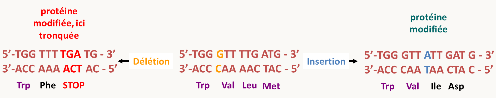

  On connaît par exemple de nombreuses mutations de ce type dans le gène de β-globine qui sont récessives ou dominantes en fonction de leur position (figure 57). La figure 57 donne aussi des exemples d'insertions/délétions un peu plus complexes, mais qui modifient un nombre restreint de nucléotides. Le cas de la mutation du codon 31/32 est intéressant car l'ajout de trois bases permet l'insertion d'une arginine supplémentaire, ce qui donne une thalassémie. Cependant, dans le cas le plus fréquent, l'ajout d'un acide aminé a peu d'effet sur le fonctionnement d'une protéine.

  

Une propriété génétique importante des mutations ponctuelles est qu'elles peuvent reverser. En effet, Il est possible d'abolir par une seconde mutation, le changement qu'a provoqué la première mutation. On dit que cette deuxième mutation est une **réversion**. Celle-ci peut être **vraie et rétablir le nucléotide initial** ou bien restaurer le même acide aminé mais codé par un autre codon (ou rétablir la phase un peu plus en amont ou en aval du lieu du premier changement de phase).

exemples

- AAG → AAC → AAG  qui donne lysine → asparagine → lysine. Il s'agit d'une réversion vraie

- AAG → AAC → AAA qui donne lysine → asparagine → lysine qui est une réversion

### Les délétions

Celles-ci peuvent englober une partie d'un gène, un gène entier ou plusieurs gènes. Leurs effets sont souvent drastiques. Si la délétion est de grande taille, elle englobe plusieurs gènes dont certains peuvent être essentiels. Les grandes délétions sont donc, en général, létales chez les haploïdes. Leur intérêt réside dans le fait que si un gène est délété (et uniquement ce gène), on peut connaître grâce au phénotype que cela entraîne le rôle de ce gène. On dit qu'on est en présence de l'**allèle nul** (notez que la présence d'un codon stop au début de la phase codante ou une mutation dans l'ATG initiateur sont aussi en théorie des allèles nuls, mais ce type de mutations peut réserver des surprises). On sait maintenant les créer à volonté comme indiqué dans le chapitre 3. De manière surprenante la plupart des gènes pris individuellement ne sont pas essentiels. C'est à dire que la cellule survie très bien s'ils sont délétés. Cela provient le plus souvent de la redondance des gènes et des systèmes dans la cellule.

Les délétions peuvent aussi servir pour la cartographie. Je vous conseille de résoudre le problème de TD pour comprendre comment cela fonctionne.

### Les transpositions

Nous avons vu que ces évènements sont très fréquents et une bonne partie des mutations dans les populations naturelles est en fait liée à des évènements de transposition. Les effets sont de deux types. Le transposon peut s'insérer dans un gène et l'inactiver. Mais, il peut aussi s'insérer dans ses régions régulatrices et en déréguler l'expression.

exemples

- Chez *Saccharomyces cerevisiae*,  l'insertion d'un transposon Ty en amont du gène *ADH2*, normalement induit par l’éthanol et réprimé par le glucose, rend la synthèse de l’alcool déhydrogénase constitutive.
- Chez la drosophile: insertion d'un transposon *copia* dans le deuxième intron du gène *white* perturbe la transcription et provoque l’apparition d’yeux orange au lieu de rouge brique.
- Chez la souris, l'insertion d'un rétroélément IAP (intracisternal-A particle) dans un exon non codant, en 5' du gène *Agouti* dérégule l'expression de la protéine ce qui conduit à des souris à poil jaune. cette mutation est bien évidemment dominante.

Les excisions de transposons peuvent aussi conduire à des changements de phénotypes. Par exemple, si un gène est dérégulé par la présence d'un transposon dans son promoteur ou un de ses introns, l'excision du transposon peut conduire à un retour à une expression sauvage. Néanmoins, la majorité des transposons laissent des cicatrices après leur excision, souvent une duplication de quelques paires de bases. L'excision de transposons présents dans des séquences codantes peut donc aboutir à des frameshifts, ce qui souvent ne permet pas une restauration d'un phénotype sauvage. Si l'ADN ajouté est un multiple de trois bases, cela peut aboutir à l'ajout d'un ou plusieurs acides aminés, et donc éventuellement une restauration d'un phénotype sauvage ou proche du sauvage.

### La recombinaison comme générateur de variation

Lorsque l'on compare les génomes d'espèces proches, voire de souches différentes d'une même espèce, on constate qu'ils ont souvent divergé via la présence de modifications de la structure des chromosomes (figure 58).

De même, les cellules cancéreuses ou des mutants présentent de nombreuses modifications de caryotypes avec en particulier des altérations de la structure de chromosomes (figure 59)

En fait, ces modifications de la structure des chromosomes sont souvent le fait de recombinaisons entre séquences répétées, duplications segmentales ou transposons. En effet, il existe dans la cellule un mécanisme de recombinaison qui permet l'échange des brins d'ADN entre **séquences dites homologues**, c'est à dire ayant la même séquence: le **crossing-over**. Les crossing-over sont clairement visualisés au cours de la méiose par les chiasmas qui en sont la manifestation physique et qui sont le reflet des échanges de brins. Nous verrons plus loin en détail le mécanisme de genèse de ces crossing-over pendant la méiose et leurs implications sur la ségrégation des allèles. Ils se produisent dans toutes les cellules durant toutes les phases cellulaires et ils peuvent générer de la diversité génétique. Les plus fréquents impliquent les séquences répétées. En fonction de leur position sur la même molécule ou sur deux molécules différentes ainsi que leurs orientations, ils vont créer des délétions, insertions, inversions, amplifications, contractions ou translocations (figure 60).

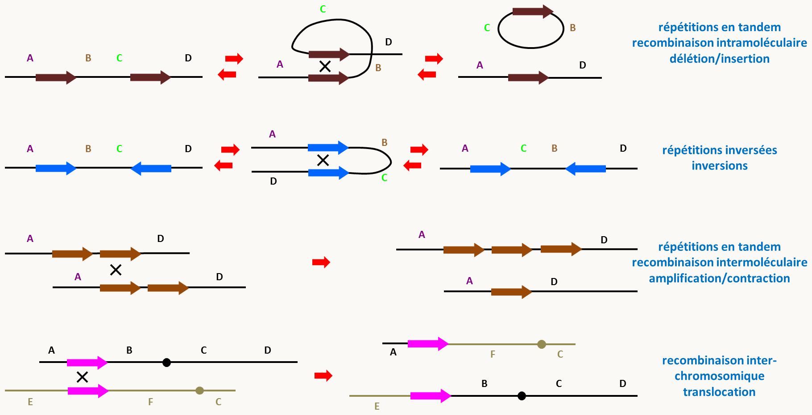

Notez qu'il existe des recombinaisons qui se produisent entre séquences non homologues et vont aussi provoquer des délétions, des inversions et des translocations. Celles-ci sont en général plus rares et résultent de mauvaises réparations de cassures doubles brins. Elles vont par exemple avoir lieu dans des cellules soumises aux rayons X ou  γ.

Chez les eucaryotes, la présence de ces modifications de chromosomes peut avoir des effets sur la fertilité au cours de la reproduction sexuée. En effet, des inversions successives empêchent la recombinaison en méiose en limitant les possibilités d'appariements entre chromosomes homologues porteur ou non d'une inversion, et si une recombinaison se produit, les chromosomes résultants sont déficients (figure 61).

Ce mécanisme participe donc à la diminution ou l'absence éventuelle de descendants lors des croisements entre souches porteuses d'inversion. Chez la drosophile, il existe de nombreux chromosomes portant des complexes d'inversion construits par l'homme: les **chromosomes balanceurs**. La recombinaison est donc abolie dans une mouche hétérozygote portant un chromosome balanceur et un chromosome normal pour le chromosome en question. Ces chromosomes balanceurs permettent donc de maintenir au cours des divisions des combinaisons génétiques intéressantes.

Les translocations (sauf les translocations roberstoniennes, figure 59) conduisent aussi à des problèmes en méiose. En effet, l'association des bivalents conduit à la présence de croix translocation qui vont poser des problèmes de gestion à la première division de méiose (figure 62).

![croix de translocation en première division de méiose. Chaque chromosome 1 ou 2 a autant de chance de partir avec l'autre chromosome initial ou transloqué. Si les deux chromosomes initiaux partent ensembles en première division (les deux chromosomes transloqués partiront donc aussi ensembles), les gamètes produits seront viables. Au contraire, si un chromosome initial migre avec un chromosome transloqué, les 4 gamètes produits seront non-viables car dans chacun des noyaux finaux, il manquera un morceau de chromosome.](img/image062.png)

Notez que, si la mutation est le créateur primaire de la variation, la recombinaison peut associer différents polymorphismes et par-là augmenter la variation en générant de nouvelles combinaisons génétiques (haplotypes). C'est ce phénomène qui se produit en méiose et qui explique le maintien de la reproduction sexuée chez de nombreux eucaryotes, bien que celle-ci soit coûteuse en énergie et qu'il faille souvent la rencontre de deux partenaires pour assurer une descendance. Mais la recombinaison a aussi d'autres effets en modifiant la structure des chromosomes via des crossing-over, le plus souvent entre séquences répétées. Ces modifications de structure participent à l'isolement reproductif entre espèces. On dit donc que les génomes sont fluides car ils peuvent facilement changer de structure. Nous reviendrons sur ce point dans le chapitre suivant sur la génomique.

### Les aneuploïdes et les polyploïdes

A l'autre extrême du spectre en taille se trouvent les accidents chromosomiques qui ont des origines variées. Au cours de la mitose ou de la méiose un accident fréquent est l'absence de clivage d'un centromère (figure 63). Il ne se produit pas alors de disjonction des deux chromatides et le résultat est un noyau où il manque un chromosome et un noyau avec un chromosome surnuméraire. On aboutit alors à la formation d'un aneuploïde.

Il n'existe pas de règle générale pour les effets des aneuploïdies. Chez l'homme, elles sont particulièrement néfastes et le plus souvent létales et seuls quelques chromosomes dont les chromosomes sexuels peuvent être en un seul ou trois exemplaires. La **trisomie** du chromosome 21 est la seule qui permet la viabilité à long terme chez l'homme, alors que les trisomies du chromosome 13 causent le syndrome de Patau et la trisomie du chromosome 18 le syndrome d'Edwards qui sont létales très tôt chez les enfants atteints. Les individus XXY ont le syndrome de Klinefelter. Ils sont de sexe masculin mais présentent plusieurs problèmes dont la stérilité. Les individus XYY ou "double Y" sont quant à eux quasi indistinguables des hommes XY; ils sont souvent un peu plus grands que les individus XY. Le fait que ces individus auraient des tendances plus agressives et auraient des tendances criminelles est faux! Les monosomies autosomales de chromosomes complets sont létales chez l'homme. Celle du chromosome X entraîne le syndrome de Turner. La plupart des embryons atteints avortent et les individus porteurs du syndrome et qui naissent ont des problèmes multiples, incluant la stérilité. Les aneuploïdies peuvent aussi se produire en mitose au cours du développement embryonnaire et dans ce cas, seule une partie des cellules de l'individu sera affectée: on dit qu'il est formé d'une **mosaïque génétique**. Les individus affectés peuvent avoir des problèmes plus ou moins importants en fonction de la proportion de ses cellules aneuploïdes. Souvent, seule une partie des chromosomes est manquante ou surnuméraire; ils ont des **aneuploïdies partielle**. Là encore les individus porteurs ont des problèmes variés en fonction des fragments de chromosomes impliqués.

Nous avons vu avec les X attachés que chez la drosophile le chromosome X peut se trouver en trois copies (dont deux attachés). Chez la levure par contre les aneuploïdies sont viables (à conditions d'avoir au moins un jeu complet de chromosomes !) et très fréquentes dans les populations naturelles, en particulier dans certaines souches que l'on utilise pour faire du vin. Souvent ces aneuploïdies créent des difficultés d'appariement au niveau de la prophase de la première division de la méiose et entraînent ainsi des diminutions de la fertilité.

Un autre phénomène assez fréquent est la **polyploïdisation**. Celle-ci se produit lorsqu'il y a duplication du jeu de chromosome sans division du noyau. Je vous rappelle que la colchicine entraîne ce genre d'anomalies. On a ainsi cherché à créer de nouvelles plantes d'intérêt agricole. Par exemple, le triticale a été obtenu en croisant le blé (qui est en fait un hexaploïde: 2n = 6x = 42) et le seigle (qui est un diploïde: 2n = 2x = 14). La F1 de ce croisement comporte 21 + 7 chromosomes qui malheureusement ne peuvent faire une méiose car chaque chromosome est unique. L'ajout de colchicine a permis de doubler le nombre de chromosomes car sans fuseau, il n'y a pas d'anaphase et donc les chromosomes ne se séparent pas à la mitose. On obtient ainsi des **amphiploïdes** (2n = 2x 28) qui sont fertiles et qui ont la résistance du seigle et le rendement du blé. La même technique avec le chou et le radis a malheureusement donné des plantes avec des racines de choux et des feuilles de radis, sans donc aucun intérêt agronomique !!!
