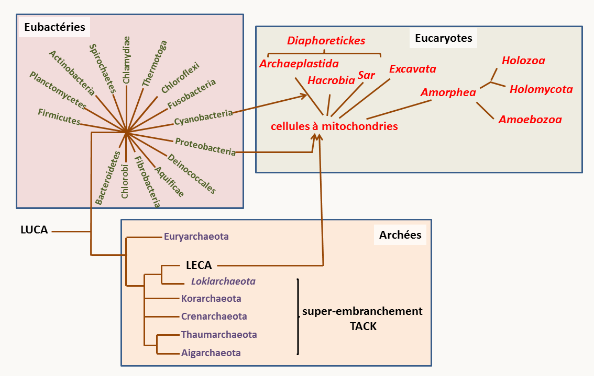
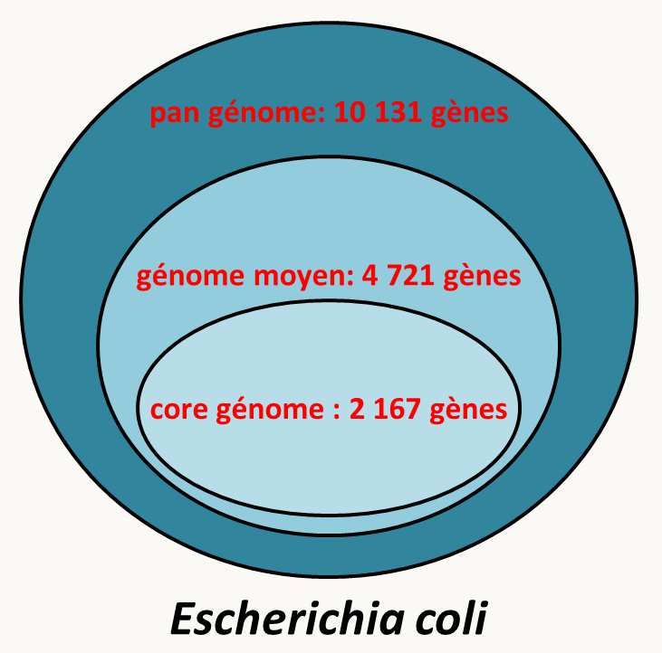
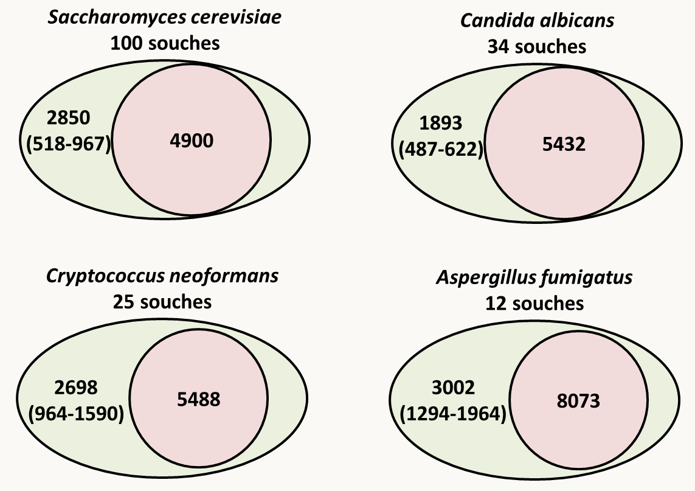

# Chapitre 2: Quelques notions de génomique

## Qu'est-ce que la génomique ?

Initié par la détermination des séquences complètes des **génomes** de divers organismes (voir la table suivante qui donne les étapes importantes jusqu'à la publication du génome humain en 2001), la génomique est la sous-discipline de la génétique qui regroupe les connaissances génétiques sur un organisme et tente de les synthétiser. Elle traite en particulier de l'organisation globale des génomes. Un **génome** est alors défini principalement par les généticiens moléculaires: il s'agit de la totalité des séquences d'ADN et d'ARN qui font partie de l'information transmise aux descendants par les parents. Notez qu'il est possible maintenant d'avoir accès aux changements structuraux de l'ADN associés aux séquences génomiques comme la méthylation de l'ADN ou les modifications des histones favorisant ou défavorisant la formation hétérochromatine. La génomique s'intéresse donc aussi à certains mécanismes épigénétiques qui vont structurer le génome et avoir un impact sur son expression.

La génomique nous permet par exemple d'analyser et de comparer les génomes des différents organismes (au sein d'une même espèce ou entre espèces différentes) et donc de mieux comprendre leur fonctionnement, (aussi bien dans leur ressemblance que leur dissemblance) et leur évolution. La disponibilité de la séquence facilite aussi les analyses de génétique dirigée, comme expliqué dans le chapitre suivant. Cette facilité a été poussée jusqu'au point où des collections de souches inactivées pour chacun des gènes non essentiels sont disponibles pour plusieurs organismes, voir tous les gènes chez certains diploïdes où les inactivations peuvent être conservées à l'état hétérozygote comme *Saccharomyces cerevisiae* (consultez le site du SGD pour en savoir plus: https://www.yeastgenome.org/). Enfin, une large part actuelle de la génomique consiste dans la détermination de transcriptomes, c'est à dire de profils d'expression transcriptionnelle de tous les gènes, dans différentes conditions afin d'avoir une idée des mécanismes d'adaptation des organismes à leur environnement.

| Espèce                      | Date de publication                            | Taille            |
| --------------------------- | ---------------------------------------------- | ----------------- |
| Bacteriophage phi X174      | 2/24/1977 - 1er virus                          | 5,375             |
| Génome mitochondrial humain | 4/9/1981 - 1er génome mitochondrial            | 16,569            |
| Bacteriophage Lambda        | 12/25/1982                                     | 48,502            |
| Virus d'Epstein-Barr        | 7/19/1984                                      | 172,281           |
| Human cytomegalovirus AD169 | 12/6/1989                                      | 229,354           |
| *Haemophilus influenzae*    | 7/28/1995 - 1ère cellule                       | 1,830,138         |
| *Synechocystis sp.*         | 6/30/1996                                      | 3,573,471         |
| *Saccharomyces cerevisiae*  | 5/29/1997 (publication Nature) - 1er eucaryote | ~12 000 000       |
| *Escherichia coli*          | 9/5/1997                                       | 4,639,221         |
| Génome nucléaire humain     | 2/15/2001                                      | 3 200 000 000 x 2 |

Actuellement, les coûts et efficacités de ces techniques sont tels, qu'il est possible de faire séquencer son génome pour quelques centaines d'euros. Des grands programmes visant à établir des génomes et transcriptomes à haut débit sont en cours. Souvent appelé "1000 génomes", ils se déclinent par exemple chez l'homme (1000 human genomes: https://www.internationalgenome.org/), les champignons  (1000 fungal genomes: https://mycocosm.jgi.doe.gov/mycocosm/home) ou les animaux avec cette fois 10 000 génomes (https://genome10k.soe.ucsc.edu/). Pourtant, les premiers génomes séquencés l'ont été au prix d'efforts pécuniaires et humains considérables. Nous allons voir donc les deux stratégies principales utilisées pour établir les séquences des génomes. Pour l'aspect technique du séquençage, je vous renvoie aux cours de biologie moléculaires

## Stratégies pour séquencer des génomes complets

### Première stratégie

Cette stratégie est plus longue mais plus sûre ! C'est celle adoptée par les consortiums publics de séquençage du génome de *Saccharomyces cerevisiae* ou du génome humain.

1°) cloner dans des cosmides ou des BAC (Bacterial Artificial Chromosome) des longs fragments du génome. Les BAC sont des plasmides simple-copie dérivés du plasmide F qui peuvent accepter jusqu'à 250 kb de séquence. Leur faible nombre de copie assure leur stabilité (pas de réarrangements dans la bactérie) et la représentativité du génome (peu de chance d'avoir un gène trop exprimé et délétère pour la bactérie), ce qui n'est pas forcément le cas avec les cosmides qui recombinent plus dans *Escherichia coli*.

2°) cartographier ces cosmides et/ou BAC soit moléculairement avec des enzymes de restrictions ou des amplifications PCR (il existe de nombreuses méthodes !), soit en s'ancrant sur une carte génétique, si celle-ci est suffisamment dense.

3°) séquencer les cosmides/BACs adjacents en utilisant la première méthode.

Cela revient à obtenir les séquences pour chaque cosmide/BAC. L'arrangement final des séquences se faisant grâce à la carte. Cette méthodologie n'est plus vraiment utilisée. Elle a été remplacée par la stratégie suivante moins demandeuse en temps, mais qui est moins fiable.

### Deuxième stratégie

Cette stratégie a été utilisé pour la première fois par la compagnie privée Celera pour séquencer le génome de drosophile et le génome humain. Dans sa première version, elle utilisait toujours le séquençage de Sanger classique:

1°) fragmenter aléatoirement le génome par des méthodes physiques (qui sont plus aléatoires que l'utilisation de méthodes enzymatiques), tel que les ultrasons ou la nébulisation (utilisation d'un gaz sous pression) pour générer des fragments d'environ 1 kb (je vous rappelle que c'est la taille maximum de séquence fiable obtenue en une seule réaction avec les technologies disponibles). Cela évite aussi l'apparition de "gènes" qui serait toxique pour la bactérie qui est utilisée à la deuxième étape (c'est à dire *Escherichia coli* !).

2°) cloner les fragments dans un vecteur plasmidique et obtenir une banque totale du génome (on estime qu'il faut une couverture d'au moins 10 X le génome, c'est à dire que la taille combinée des inserts présents dans la banque doit être 10 fois plus importante que la taille du génome, un peu de statistique montre que dans ces conditions, environ 99,9% du génome devrait être séquencé une fois.

3°) séquencer automatiquement les inserts et rapatrier les séquences dans des fichiers.

4°) utiliser des programmes qui permettent à partir des fragments de séquence de faire des contigs.

5°) combler les trous soit en clonant de manière dirigée les régions manquantes, soit par PCR en amplifiant à l'aide d'amorces localisées au bord des contigs. Il faut bien sûr ensuite séquencer ces régions.

Cette méthode est rapide mais nécessite des outils informatiques très puissants, ce qui n'est plus un problème grâce à l'augmentation des performances des ordinateurs. Par exemple pour le génome humain, il faut comparer 32 000 000 séquences entre elles ! Elle suppose aussi qu'il n'y a pas trop de séquences répétées car dans ce cas, l'analyse informatique ne permettra pas facilement de donner la séquence dans le bon ordre ! on dit par exemple que Celera s'est "aidé" du génome "publique" pour établir sa séquence ! De toute manière, il faut vérifier qu'il n'y a pas eu d'erreurs à l'assemblage en comparant cette séquence avec soit une carte de restriction, soit une carte génétique.

Il existe maintenant des machines capables de générer plusieurs dizaines de millions de séquences de cours fragments d’ADN de quelques dizaines à quelques centaines de nucléotides à partir d’ADN génomique fragmenté. La méthode la plus utilisées actuellement est celle d'Illumina (https://www.illumina.com/). Des améliorations permettent de plus par exemple de séquencer le génome d'une seule cellule par cette méthode (https://www.illumina.com/content/dam/illumina-marketing/documents/products/research_reviews/single-cell-sequencing-research-review.pdf)! Des programmes informatiques permettent ensuite de reconstituer le génome, mais celui-ci est souvent très fragmenté (plusieurs milliers de morceaux…). Pour pallier à ce problème, des méthodes comme celle du PacBio (https://www.pacb.com/) ou du Nanopore (https://nanoporetech.com/) permettent de séquencer plusieurs milliers de nucléotides en continu, ce qui va permettre d'améliorer les assemblages. Malheureusement, les séquences obtenues contiennent de nombreuses erreurs et ces techniques appliquées seules ne donnent pas de bons résultats. Actuellement, la méthode de choix est donc la suivante:

1°) séquencer par Illumina **et** PacBio ou Nanopore

2°) assembler en utilisant des programmes dédiés qui permettent de combiner les deux types de séquençage comme Unicycler. Cette étape peut maintenant se faire sur un ordinateur de bureau en quelques heures pour des génomes bactériens ou des "petits eucaryotes" comme les levures, champignons filamenteux, protistes et algues à petits génomes (< 100 Mb). Les génomes plus gros demandent toujours des gros ordinateurs...

Enfin, les séquences des ARN par "RNAseq" (voir vos cours de BM) sont généralement réalisées afin de pouvoir annoter correctement le génome. En effet, nous n'avons pas discuté cette étape finale du travail: la définition des gènes présents dans le génome. Il existe trois types d'annotation:

- L'utilisation de séquences d'ARN; c'est à dire maintenant de données de RNAseq.
- Prédictions *de novo* des régions potentiellement codantes. Il est possible maintenant de prédire les régions codant pour des protéines, des ARNt, des snRNA... en se basant sur des caractéristiques de ces régions. Pour les ARNt, il s'agit des structures secondaires et de l'anticodon, pour les protéines, il s'agit des consensus de démarrage et fin de traduction, de biais de codons, de signaux d'épissage *etc*.

- Utilisation de la conservation évolutive des régions codantes. Pour ceci, il faut comparer les ORF (Open Reading Frames qui sont les séquences situées entre deux codons stop) présentes dans la séquence avec les banques de données afin d'identifier celles conservées au cours de l'évolution et qui ont donc de grandes chances de coder pour une information. Cette étape permet en même temps de prédire la fonction potentielle des gènes ainsi détectés.

Le plus souvent, les trois méthodes sont appliquées et un consensus des trois prédictions est retenu. Les programmes de séquençage proposent donc souvent deux listes: celles de toutes les prédictions qui est la réunion des CDS (= séquences potentiellement codantes) obtenues par les trois méthodes et celles qui sont les plus probables (qui correspondent grosso modo plutôt à l'intersection des trois méthodes).

Il ne reste plus ensuite qu'à déposer la séquence dans les banques de données comme GenBank (https://www.ncbi.nlm.nih.gov/genbank/), ENA de l'EMBL (https://www.ebi.ac.uk/ena) ou DDJB (https://www.ddbj.nig.ac.jp/index-e.html). Ces trois banques échanges leurs données de manière régulière et contiennent les mêmes données mais présentées de manières différentes. Depuis quelques années, elles ne contiennent plus la totalité des séquences disponibles et il faut maintenant naviguer sur de nombreux sites pour accéder aux séquences...

Il existe de nombreux programmes qui permettent la visualisation de ces séquences (voir par exemple le "genome data viewer" du NCBI (https://www.ncbi.nlm.nih.gov/genome/gdv/). Un programme de visualisation en local (artemis; https://www.sanger.ac.uk/science/tools/artemis) lit facilement les fichiers d'annotation téléchargeables à partir des banques de données (GenBank ou EMBL) et permet de voir simplement les caractéristiques des génomes  sur votre ordinateur personnel, ce que la section suivante va faire!

## Les génomes des principaux organismes modèles et leur évolution

En fait, il existe une assez bonne corrélation entre la taille des génomes dans les différents groupes d'organisme et leur position phylogénétique. Cependant, il existe des exceptions qui sont regroupées sous la terminologie du paradoxe C. Par exemple, chez les vertébrés, les salamandres ont 50 fois plus d'ADN que l'Homme et l'amibe unicellulaire *Amoeba dubia* possède un génome mesurant 670 000 Mb, soit une taille plus de 200 fois plus grande que celle du génome humain!  Voici d'autres exemples de discordances:

**Plantes** :

- Arabidopsis : 138 Mb
- Tabac : 3 800 Mb
- Pin :  68 000 Mb

**Animaux** :

- Lamproie :  1 900 Mb
- Homme :  3 200 Mb
- Protoptère :  140 000 Mb

La figure 64 présente la phylogénie globale  actuelle. Pour  rappel, les animaux font partie des *Holozoa*, les plantes des *Archaeplastida* et les champignons des *Holomycota*, le reste des eucaryotes étant des "protistes".

La table suivante vous donnent un ordre de grandeur des génomes, en paire de bases et en gènes, ainsi que la taille moyenne des gènes chez quelques organismes - le plus souvent utilisés comme modèles pour les analyses génétiques - appartenant aux différents groupes biologiques mentionnés dans la figure 64.

|             |                              |                                       | taille (Mb) | nb de gènes codant des protéines | taille moyenne des gènes |
| ----------- | ---------------------------- | ------------------------------------- | ----------- | -------------------------------- | ------------------------ |
| Eubactéries |                              | *Escherichia coli*                    | 4.6         | ~4 400                           | 1 kb                     |
|             |                              | *Streptomyces lividans*               | 8.3         | ~7 300                           | 1 kb                     |
|             |                              | *Mycoplasma genitalium*               | 0.58        | 483                              | 1 kb                     |
| Archées     |                              | *Pyrococcus abyssi*                   | 1.7         | 1 765                            | 1 kb                     |
|             |                              | *Archeoglobus fulgidus*               | 2.2         | 2 437                            | 0,8 kb                   |
| Eucaryotes  | *Excavata*                   | *Giardia lamblia*                     | 12          | ~6 500                           | 1.3 kb                   |
|             | *Heterokonta*                | *Ectocarpus silicosus*                | 196         | ~12 200                          | 6.8 kb                   |
|             | *Hacrobia*                   | *Emiliania huxleyi*                   | 168         | ~40 000                          | 1.6 kb                   |
|             | *Dinoflagellata*             | *Symbiodinium microadriaticum*        | 808         | ~43 000                          | 12.2 kb                  |
|             | *Apicomplexa* (SAR)          | *Plasmodium falciparum*               | 23          | ~5 200                           | 2.2 kb                   |
|             | *Ciliophora* (SAR)           | *Paramecium tetraurelia* (macronoyau) | 72          | ~40 000                          | 1.6 kb                   |
|             | *Plantae* (*Archaeplastida*) | *Chlamydomonas reinhardtii*           | 111         | ~16 400                          | 5.4 kb                   |
|             |                              | *Physcomitrella patens*               | ~500        | ~36 000                          | 2.4 kb                   |
|             |                              | *Populus trichocarpa*                 | ~500        | ~45 500                          | 2.2 kb                   |
|             |                              | *Arabidopsis thaliana*                | 138         | ~27 600                          | 2.0 kb                   |
|             | *Amoebozoa*                  | *Dictyostelium discoideum*            | 34          | ~12 500                          | 1.9 kb                   |
|             | *Microsporidia*              | *Encephalitozoon cuniculi*            | 2.9         | ~2 000                           | 1.1 kb                   |
|             | *Eumycota*                   | *Saccharomyces cerevisiae*            | 12          | ~6 400                           | 2 kb                     |
|             |                              | *Podospora anserina*                  | 35.5        | ~11 700                          | 1.8 kb                   |
|             |                              | *Neurospora crassa*                   | 41          | ~10 700                          | 2.5 kb                   |
|             | *Metazoa*                    | *Caenorhabditis elegans*              | 100         | ~18 000                          | 3 kb                     |
|             |                              | *Drosophila melanogaster*             | ~140        | ~18 000                          | 3 kb                     |
|             |                              | *Danio rerio*                         | ~1 400      | ~25 600                          | 11 kb                    |
|             |                              | *Mus musculus*                        | ~2 700      | 19000 - 24 500                   | 10.5 kb                  |
|             |                              | *Homo sapiens*                        | 3 286       | ~20 000                          | 14 kb                    |

Notez que ces chiffres peuvent être amenés à changer car il s'agit d'estimations et les tailles et contenus en gènes varient en fonction des souches (voir plus bas). De plus, si pour certains génomes comme celui de *Saccharomyces cerevisiae* le génome et le contenu codant sont bien connus, pour d'autres espèces, les données sont plus incertaines: on ne sait par exemple toujours pas le nombre exact de gènes chez l'homme!

La séquence complète des génomes de nombreux organismes permet maintenant de mieux comprendre comment ils évoluent. De ces études qui dépassent le cadre de ce cours, nous retiendrons cependant quelques tendances marquantes :

- Chez les procaryotes, les génomes sont compacts et leur capacité codante est utilisée au mieux. Le génome est généralement un chromosome circulaire (figure 65), mais dans certains cas plusieurs chromosomes peuvent être présents et certains chromosomes bactériens sont linéaires (chez *Streptomyces lividans* par exemple). Les gènes sont regroupés en opérons. L'évolution des génomes procaryotes se fait principalement par des évènements de recombinaisons, générateurs d'inversions et de délétion. Les analyses phylogénétiques de comparaison de séquence montrent aussi que les génomes procaryotes ne sont pas complètement imperméables: il existe de nombreux transferts latéraux de gènes. Chez les archées on peut retrouver des gènes dont la séquence est plus proche de celles de gènes d'eubactéries que d'autres archées. On suppose alors qu'il y a eu transfert latéral de gènes (via des plasmides conjugatifs ou via la transformation naturelle ?). Il existe un débat pour évaluer l'importance de ces transferts au cours de l'évolution. Certains extrémistes pensent que ces transferts sont tellement massifs qu'ils empêchent d'obtenir des phylogénies satisfaisantes pour les bactéries et les archées.

  ![le génome d'Escherichia coli, un génome procaryote circulaire typique. En bleu, les séquences codant pour des protéines. Les gènes sont proches les uns des autres et organisés en opéron (notez la position des gènes sur les brins d'ADN; les gènes proches sont souvent sur le même brin, ce qui indique la présence probable d'un opéron). Il n'y a pas d'introns; En fait, il en existe néanmoins quelques-uns qui ont des structures différentes de celles présents dans les génomes nucléaires des eucaryotes.](img/image065.png)

- Chez les eucaryotes, il existe une nette augmentation de la taille des génomes en fonction du degré de complexité des organismes (cf. le tableau ci-dessus). Attention, je rappelle que cette règle n'est pas absolue et qu'il existe de nombreuses exceptions (paradoxe C). Cette augmentation est due en faible partie à l'augmentation du nombre de gènes (un peu plus de 6000 chez la levure à environ 20 000 chez l'homme, cf. tableau ci-dessus). La génération de ces gènes se fait souvent par duplications, suivies de spécialisation des 2 copies qui sont alors appelées des **paralogues**. C'est ce qui s'est passé par exemple pour la genèse des différents gènes de globines présent chez les vertébrés. Notez que les **orthologues** désignent un même gène présent chez des espèces différentes et qui a évolué sans duplication. Pour faire la phylogénie des espèces, il faut donc comparer entre eux des orthologues et non des paralogues. Dans une première étape une duplication conduit à une **redondance génétique**. Puis, des phénomènes de mutations/sélections conduisent à une **néo-fonctionnalisation**, où les deux gènes acquièrent des régulations et/ou des fonctions différentes. Nous avons vu que dans certains cas, des polyploïdisations du génome ont eu lieu, particulièrement chez les plantes. Des traces de tels évènement ont été détectés chez de nombreux autres organismes comme le champignon *Rhizopus oryzae* ou le cilié *Paramecium tetraurelia* chez lequel, trois évènements successifs de polyploïdisation ont pu être mis en évidence! De manière étonnante, la levure *Saccharomyces cerevisiae* semble être un ancien amphiploïde résultant de l'hybridation de deux levures (figure 66).

   ![l'ancêtre de Saccharomyces cerevisiae est un amphiploïde. Deux espèces de levures éloignées se serait croisées pour donner un hybride. Cet hybride aurait subi un doublement de son matériel génétique, ce qui aurait permis un retour à la possibilité de faire des méioses. Par la suite, des pertes d'une des deux copies de gènes présents se seraient produites pour aboutir au génome actuel, où seules certaines régions sont dupliquées. Sur la carte, les différentes régions dupliquées sont codées par la même couleur.](img/image066.png)

  Il semble que ces phénomènes d'hybridation soient plus fréquents qu'anticipés précédemment. Par exemple, de nombreuses souches utilisées pour faire du vin en Alsace, Allemagne, Hongrie, etc. sont en fait des hybrides de *Saccharomyces cerevisiae* et *Saccharomyces kudriavzevii*. Récemment, Denny, une fille connue par un fragment d'os et qui vivait il y a environ 90 000 ans était probablement un hybride obtenu par la reproduction d'une mère néandertalienne avec un homme Denisovien. *Homo neanderthalensis* et *Homo denisova* sont souvent considérés comme des espèces différentes et distinctes d'*Homo sapiens*, même s'ils n'en sont probablement que des sous espèces.

  Souvent, l'hybride "F1" qui possède la moitié du génome d'une première espèce et l'autre de moitié provenant de la seconde espèce se recroise avec des individus appartenant à une seule des espèces parentales. Ses descendants vont donc avoir les trois quart de leur génome provenant de cette espèce et un quart de l'autre. Ces descendants vont à leur tour se recroiser avec la même espèce et donner des descendants avec 7/8 de leur génome provenant de celle-ci et 1/8 de l'autre. Ce processus se reproduisant, à la fin du processus la totalité du génome de l'autre espèce devrait disparaître aléatoire au gré du brassage génétique et des recombinaisons, sauf s'il existe un avantage sélectif à conserver certains gènes. On dit alors que les gènes conservés ont subi une **introgression** du génome de cette espèce vers le génome de l'espèce utilisé pour les croisements. Ce phénomène s'est produit par exemple entre *Homo sapiens* et *Homo neanderthalensis* qui se sont croisés lorsque *Homo sapiens* est sorti d'Afrique. Aujourd'hui les populations africaines ne possèdent pas de gènes provenant d'*Homo neanderthalensis, alors que les populations eurasiennes en contiennent environ 3%. Collectivement, 20% du génome d'Homo neanderthalensis* sont conservés dans les divers génomes d'*Homo sapiens* séquencés jusqu'à présent! Certains gènes ont clairement été retenus grâce aux avantages sélectifs qu'ils confèrent comme STAT2 qui intervient dans la réponse aux virus et dont la fréquence dans les populations mélanésiennes (par exemple en Nouvelle Guinée) ne peut s'expliquer que par une **sélection positive**. L'homme dirige souvent ce processus pour introduire des caractères intéressants d'une espèce dans une autres, notamment avec les plantes cultivées: gènes de résistance à des pathogènes, gènes permettant de meilleurs rendements, une meilleure conservation, etc.

  Toutefois, un comparatif des génomes de différents eucaryotes montre que les régions codant pour des protéines représentent souvent une part négligeable et que l'augmentation de taille des génomes passe par d'autres mécanismes. Il est donc à noter que l'homme possède moins de gènes qu'une plante et à peine plus qu'un ver ou une mouche ! en fait ces chiffres sont trompeurs. En effet, ils ne tiennent compte ni des duplications massives (Arabidopsis a probablement été polyploïdisé et la plupart des gènes sont présents en plusieurs exemplaires très proches), ni surtout des évènements post-transcriptionnels qui permettent une augmentation de la diversité en protéines. Par exemple, il existe des phénomènes d'épissage alternatifs qui aboutissent à la fabrication de plusieurs protéines à partir d'un même transcrit primaire. Ce phénomène est très fréquent chez l'homme, moins fréquent chez Arabidopsis et probablement très rare chez la levure.

  L'augmentation de la taille des génomes passe donc principalement par (1) la variation du nombre et de la taille des introns (de 0 ou 1 intron de quelques dizaines de paires de bases à plusieurs introns de plusieurs dizaines de kilobases), (2) l'augmentation du nombre des transposons et autres séquences répétées (les satellites en particulier). C'est l'augmentation de cette fraction du génome qui permet d'expliquer en grande partie le paradoxe C. Certaines espèces ont plus de transposons que d'autres. Les raisons en sont obscures. Les transposons sont principalement localisés entre les gènes et/ou dans les introns. (3) La présence de **pseudogènes**. Un pseudogène est un gène qui dans le passé a été fonctionnel et a par la suite perdu sa fonction. L'étape ultime de la pseudogénisation est la perte complète du gène, c'est à dire sa délétion! C'est le cas par exemple chez les champignons *Podospora anserina* et surtout *Podospora* *comata* chez qui plusieurs centaines de pseudogènes ont été identifiés: en fait près de 10% des gènes semblent "pseudogénisés" chez cette dernière espèce! Notez que chez les vertébrés, l'accumulation de transposons se fait principalement sous forme de transposons non fonctionnels, chez qui les transposases et reverse transcriptases sont inactives car codées par des pseudogènes. Ces tendances se voient facilement si l'on compare les structures des génomes de la levure *Saccharomyces cerevisiae* (figure 66), du champignon *Podospora anserin*a (figure 67) et de l'homme (figure 68).

  

  

  

Le dernier point qu'il est nécessaire de discuter concerne la variabilité des génomes qui peut maintenant être évaluée en comparant directement les séquences génomiques. Nous avons vu (cf. figure 58) que les génomes pouvait varier par la présence de réarrangements et qu'au sein d'une espèce le pourcentage de divergence était de l'ordre du ‰ alors qu'il est plutôt de l'ordre du % entre espèces distinctes (2% par exemple entre l'homme et le chimpanzé). Les séquences de nombreuses souches pour une même espèce permettent maintenant de définir le "**core génome**" qui correspond aux gènes présents dans toutes les souches et le "**pan génome**" qui correspond lui à tous les gènes retrouvés dans au moins une des souches. Chez les bactéries, il existe de nombreux gènes optionnels si bien que le pan génome est beaucoup plus grand que le core génome. Par exemple (figure 70), l'analyse de 20 souche d'*Escherichia coli* a permis d'identifier 10 131 gènes différents (= pan génome); seulement 2 167 étaient présents dans toutes les souches (= core génome) et les souches possèdent en moyenne 4721 gènes! Les gènes du core génome codent pour des fonctions essentielles de la cellule (réplication, transcription, traduction...) alors que les gènes présents optionnellement codent pour des fonctions facultatives mais permettant une meilleure adaptation à l’environnement comme des résistances à des antibiotiques, la capacité à métaboliser des composés organiques, la production de toxines etc.

La figure 71 donne un aperçu des core et pan génomes de quatre champignons et montre clairement que chez certains eucaryotes le contenu en gène présente aussi une grande variabilité au sein d'une même espèce. Comme chez les procaryotes, les gènes optionnels permettent une meilleure adaptation à l'environnement. Ils peuvent être regroupés sur des chromosomes optionnels. C'est le cas par exemple chez les champignons du genre *Fusarium* dont certaines souches contiennent des chromosomes surnuméraires. Il a été montré chez *Fusarium oxysporum*, qui est un pathogène ayant un large spectre d'hôte, que des déterminants de spécificités et de virulence pour les différents hôtes sont portés par ces chromosomes surnuméraires.

Chez l'homme, les différences entre le core et le pan génome sont moins prononcés. Une étude sur les population africaine a montré que celles-ci possèdent collectivement environ 300 Mb de plus que le génome de référence "GRCh38 ", soit 10% de séquences supplémentaires. Les populations asiatiques chinoises et coréennes partagent 120 MB de plus avec les populations africaines. Un analyse plus spécifiques des populations Han de Chine montre que celles-ci ont environ 30 MB qui leur sont propres en comparaison avec le génome de références contenant 188 gènes nouveaux codant pour des protéines.

Cette variabilité inattendue révélée par les analyses génomiques montrent que les différentes souches ou individus pour une même espèce peuvent avoir des contenus géniques très différents. Nous reviendrons sur ce point dans un chapitre ultérieur lorsque nous discuterons du fond génétique.
