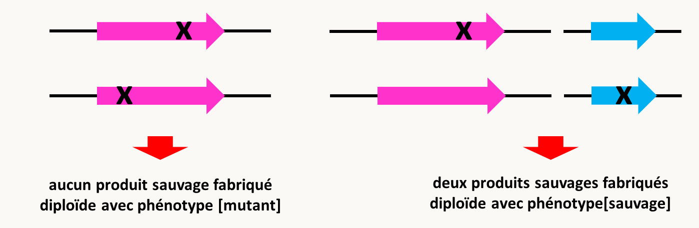
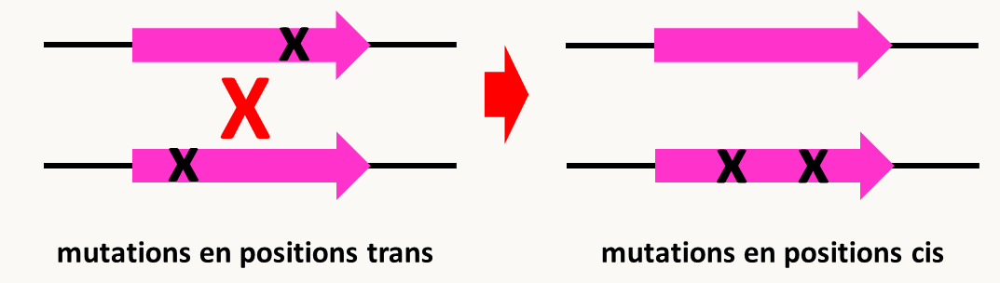
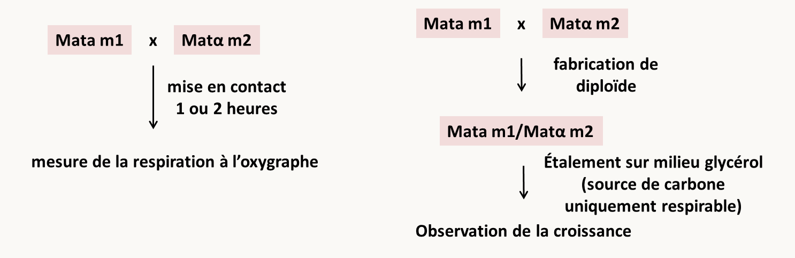
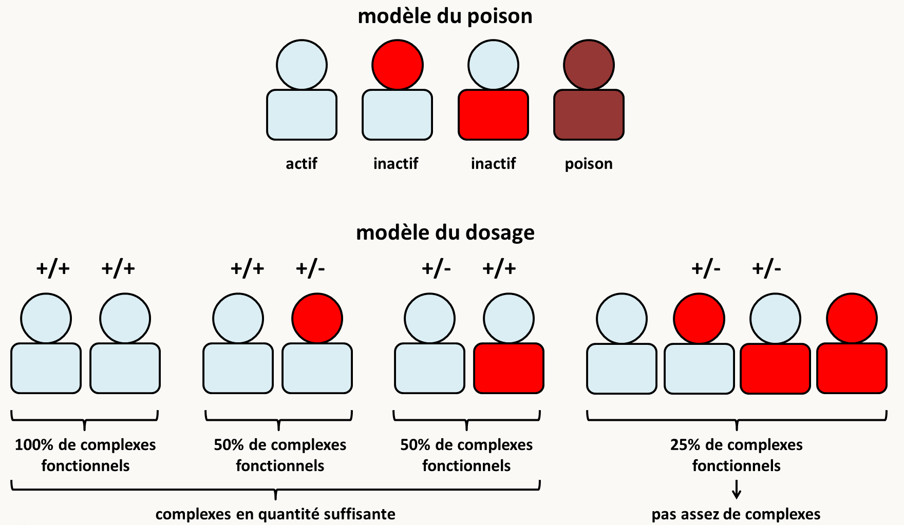

# Chapitre 4: La complémentation

## Principe du test de complémentation

A l'issue d'une mutagenèse, on dispose d'une collection d'allèles mutants. Dans ce chapitre, nous partons du fait que chacun des mutants analysés obtenus porte une seule mutation indépendante de celles présentes dans les autres mutants. Pour voir comment déterminer si une seule mutation est bien à l'origine du phénotype, il suffit d'appliquer les règles de ségrégation de Mendel. Nous reviendrons sur ce point dans le chapitre suivant. En général, ces allèles confèrent le même phénotype. La question se pose alors de savoir combien de gènes sont mis en jeu pour obtenir cette collection d'allèles. La génétique a développé des méthodes qui permettent de répondre à cette question dont le **test de complémentation** qui est le plus rapide à mettre en œuvre. Son application permet d'avoir une bonne idée du nombre de gènes.

Le test consiste dans la fabrication d'une souche pour laquelle les allèles mutants sont associés deux à deux en configuration trans et en l'observation du phénotype (figure 100). Pour ceci, il suffit de croiser les mutants entre eux et de regarder le phénotype de souches F1 diploïdes obtenues.

- Si les deux allèles sont allèles d'un même gène, cela aboutit au schéma de gauche de la figure 100. Dans ces conditions, aucun allèle sauvage n'est présent dans la souche et l'on peut raisonnablement suspecter que le phénotype de la souche sera mutant.
- Si les deux allèles sont des allèles de gènes différents, cela aboutit au schéma de droite de la figure 100. Dans ces conditions, on voit qu'il y a présence d'allèles sauvages pour chacun des gènes. Donc, si les allèles mutants a et b sont récessifs vis à vis de leurs allèles sauvages respectifs, on peut cette fois raisonnablement suspecter que la souche sera de phénotype sauvage. Notez que ce test ne s'applique donc pas si les mutations sont dominantes.

Le principe du test est donc le suivant. On fabrique les souches avec toutes les combinaisons d'allèles mutants obtenus après mutagenèse, associés deux à deux. **Si pour une combinaison le phénotype de la souche obtenue est mutant, on dit que les deux allèles ne complémentent pas et qu'ils sont probablement allèles d'un même gène**. **Si le phénotype de la souche obtenue est sauvage, on dit alors que les deux allèles complémentent et qu'ils sont probablement allèles de deux gènes différents.** A l'aide de ceci, on construit un tableau. Il reste ensuite à déterminer le nombre de gènes. Le tableau suivant donne un exemple de tableau provenant d'une analyse faite dans mon laboratoire. Ces résultats ont été obtenus en analysant le champignon *Podospora anserina*, qui est haplobiontique. L'analyse des diploïdes n'est donc pas faisable sur les thalles végétatifs. Il est possible par contre d'analyser des dicaryons, chacun des noyaux portant une mutation. Le principe du test reste donc le même. Nous avons obtenu après mutagenèse 6 souches du  portant chacune un allèle mutant indépendant. Ces 6 souches ne différencient pas d'organes femelles (périthèces). Nous avons associé dans des hétérocaryons les six allèles deux à deux et avons obtenu les résultats suivants :

|    | m1 | m2 | m3 | m4 | m5 | m6 |
|----|----|----|----|----|----|----|
| m1 | -  | +  | +  | +  | -  | -  |
| m2 |    | -  | -  | +  | +  | +  |
| m3 |    |    | -  | +  | +  | +  |
| m4 |    |    |    | -  | +  | +  |
| m5 |    |    |    |    | -  | -  |
| m6 |    |    |    |    |    | -  |

Le signe - indique que l'hétérocaryon avec mi dans un noyau et mj dans l'autre ne différencie pas de périthèce (phénotype mutant). Le signe + indique qu'il en différencie (phénotype sauvage).

De ce tableau nous pouvons tirer que :

- l'allèle m4 complémente avec tous les autres et donc qu'il caractérise un gène.
- les allèles m1, m5 et m6 ne complémentent pas entre eux mais complémentent avec tous les autres et donc qu'ils caractérisent un deuxième gène
- les allèles m2 et m3 ne complémentent pas entre eux mais complémentent avec tous les autres et donc qu'ils caractérisent un troisième gène.

Au total, il est donc possible de définir trois groupes de complémentation. Il semble donc y avoir trois gènes identifiables par cette méthode.

## Conditions d'application

L'application du test se fait différemment en fonction du type d'organisme. En effet, la construction des souches est simple si on est chez un organisme diplobiontique ou haplodiplobiontique. Il suffit dans ce cas de croiser des parents purs pour chacun des allèles mutants et d'observer la F1 ou les diploïdes produits.

Chez les organismes haplobiontique, comme *Podospora anserina*, ou dans les cellules en culture, il est souvent impossible de fabriquer des noyaux diploïdes. On a donc comme expliqué ci-dessus recourt à la fabrication d'hétérocaryons. Mais les résultats obtenus sont plus aléatoire. En effet, dans un noyau diploïde, les allèles sont certainement présents à l'état "hétérozygotes" avec un nombre fixe de copies. Chez les hétérocaryons, le rapport des noyaux peut varier, voire à l'extrême un des deux types de noyau peut se perdre. La construction d'**hétérocaryons dit balancés** peut compenser ceci. Un des noyaux possède un marqueur d'auxotrophie ou de résistance à un antibiotique. L'autre possède un autre marqueur d'auxotrophie ou une autre résistance. Par exemple, chez *Podospora anserina*, on dispose d'une souche *leu1-1* qui est auxotrophe pour la leucine et d'une souche *lys2-1* qui est auxotrophe pour la lysine. On sait que si l'on forme un hétérocaryon *leu1-1/lys2-1*, celui pousse sur milieu minimum (figure 101). Cela veut donc dire que les deux mutations complémentent et qu'elles affectent des gènes différents, ce que l'on pouvait présager!

Ceci permet donc de conserver les deux types de noyaux. Si l'on veut tester la complémentation de deux mutations m1 et m2, il suffit de construire l'hétérocaryon (leu1-1, m1)/(lys2-1, m2) et de le faire pousser sur milieu minimum. Celui-ci conservera les noyaux avec m1 et ceux avec m2.

Dans certains systèmes génétiques et il est difficile de maintenir les mutations en position trans à cause des recombinaisons. Cela aboutit à la formation de configurations où les mutations sont en positions cis (figure 102).

On ré-obtient donc dans ce cas un allèle sauvage qui a toutes les chances de conférer un phénotype sauvage et ceci bien que les 2 mutations soient initialement dans le même gène. Les génomes mitochondriaux et plastidiques sont sujets à ce type d'évènement. Par exemple, dans le génome mitochondrial de levure, la recombinaison est très rapide. Si l'on veut tester la complémentation de mutations mitochondriales affectant la respiration, il faut donc procéder comme décrit dans la figure 103 à gauche. En effet, le protocole décrit dans la figure 103 à droite va entraîner la sélection des recombinants sauvages et non pas celle des diploïdes où se produit la complémentation:

Des problèmes similaires peuvent se rencontrer dans le cas de l'étude des mutations dans des phages ou des virus.

En résumé, il faut pour **appliquer le test de complémentation, s'assurer que les mutations sont récessives et qu'elles sont bien présentes et associées en trans**.

## Les limites du test

Si le test de complémentation est un test très puissant, il arrive toutefois de rencontrer un certain nombre d'exception. Notez que si des mutations n'ont pas les propriétés attendues dans le test de complémentation, cela apporte des indications sur le fonctionnement des gènes mutants.

- **Des mutations localisées dans le même gène mais qui complémentent !**

Il arrive que des mutations localisées dans un même gène complémentent. On parle alors de **complémentation intragénique ou inter-allélique**. Deux explications au moins sont possibles pour l'expliquer (figure 104).

![mécanismes de la complémentation inter-allélique. En haut, dans le cas de protéines homo-multimériques, des mutations qui altèrent la fonctionnalité des multimères peuvent se compenser. Des mutations dans des résidus qui sont à la surface des monomères et qui changent la charge peuvent empêcher la formation de multimères et inactiver la protéine. La mise en présence des deux types de monomères permet de reconstituer un complexe actif. En bas, la complémentation est un test qui analyse la fonction. Si un gène produit un polypeptide qui exerce plusieurs fonctions, alors des mutations affectant chacune des fonctions peuvent complémenter.](img/image104.png)

Un exemple de protéine multifonctionnelle avec de la complémentation inter-allélique a bien été décrit chez *Neurospora crassa*. Chez cette espèce, la synthèse du tryptophane nécessite deux étapes catalysées par le même polypeptide qui porte les deux activités et qui est codé par le gène *trp-3*. On connaît deux groupes de mutations qui abolissent chacune des fonctions, et un groupe qui abolit les deux activités. Les premières mutations complémentent entre elles, alors qu'elles ne complémentent avec celles du dernier groupe. Notez que les mutations dans un même groupe ne complémentent pas entre elles !

- **Des mutations récessives localisées dans des gènes différents mais qui ne complémentent pas !**

Pour pouvoir appliquer le test de complémentation, il faut que les produits des gènes testés diffusent et agissent au même endroit. Ceci est surtout valable pour les hétérocaryons. Un exemple bien connu est celui des gènes impliqués dans la caryogamie chez la levure et dont les produits doivent être présents à la surface des noyaux pour que la fusion nucléaire ait lieu. Ceux-ci ne diffusant pas entre les noyaux après la plasmogamie, il n'y aura pas de fusion nucléaire dans les mutants nuls de ces gènes. On aura donc l'impression qu'il n'y a pas de complémentation bien que les mutations soient récessives (figure 105).

Dans le cas de protéines hétéro-multimériques, des mutations qui altèrent la fonctionnalité des multimères peuvent avoir des effets coopératifs et ainsi aboutir à un effet supérieur à ceux créés par chacune des mutations, cela peut se faire parce que le produit présent dans la souche portant les deux mutations est un poison ou parce que dans le double mutant, il n'y a plus suffisamment de produits fonctionnels pour assurer la fonction cellulaire requise (figure 106).

Un exemple de ce type de mécanismes est observé avec des gènes codant pour des protéines associées à l'actine. L'actine est codée par le gène *ACT1* chez *Saccharomyces cerevisiae*. Les mutations *act1-1* et *act1-4* provoquent une thermosensibilité récessive à 27°C (la température permissive est de 25°C). Les protéines codées par les gènes TPM1 et SAC6 interagissent avec le cytosquelette d'actine. Les mutations tmp1- et sac6- causent aussi un phénotype de thermosensibilité récessif. Par contre si on construit les souches diploïdes suivantes on obtient dans un cas un résultat bizarre.

| souche                                                      | phénotype          |
| ----------------------------------------------------------- | ------------------ |
| act1-1 TPM1+ / ACT1+ tpm1- | thermorésistant    |
| act1-4 TPM1+ / ACT1+ tpm1- | thermorésistant    |
| act1-1 SAC6+ / ACT1+ sac6- | thermorésistant    |
| act1-4 SAC6+ / ACT1+ sac6- | **THERMOSENSIBLE** |

Il existe donc un effet spécifique non attendu spécifiquement entre act1-4 et sac6-. Cet effet est retrouvé fréquemment avec des mutations dans *ACT1* et des mutations dans les gènes codant pour les protéines qui interagissent avec le cytosquelette. Les deux modèles du dosage et du poison ont été proposés pour expliquer ce phénomène. En fait, les 2 cas peuvent se produire dans le cas du système actine, c.a.d. qu'en fonction des couples de mutations l'un ou l'autre s'applique.

## Le terme de complémentation a été adapté à trois autres situations

Le terme de complémentation n'est pas restreint à la génétique formelle et est utilisé dans un contexte différent par d'autres biologistes. Dans tous les cas, il s'agit de restaurer un état sauvage dans un mutant.

- Le terme a été coopté par les biochimistes, pour identifier une protéine responsable d'une fonction particulière. Par exemple, le groupe de Kornberg qui travaillait sur l'initiation de la réplication chez *Escherichia coli*, disposait de mutants d'initiation de la réplication (dnaB, etc.). Le groupe avait aussi un test d'initiation *in vitro* à partir d'un extrait acellulaire de la souche sauvage. Pour identifier les protéines affectées dans les différents mutants, par exemple dnaB. Les chercheurs du groupe ont fait un extrait acellulaire de la souche mutante dnaB et ont montré qu'il ne permettait pas la réplication *in vitro*. Ils ont ensuite fractionné l'extrait acellulaire issu de la souche sauvage et ont ajouté séparément les différentes fractions à leur extrait de dnaB. Ils ont ainsi pu caractériser la fraction qui contenait la protéine dnaBp sur le critère de restauration de l'initiation de la réplication. On dit qu'ils ont identifié par **complémentation *in vitro*** la protéine dnaB. Des fractionnements successifs de ce type ont ainsi permis de purifier différentes protéines impliquées dans l'initiation de la réplication chez *Escherichia coli*.

- Le terme a aussi été co-opté par les généticiens moléculaires, pour l**e clonage des gènes par expression**, qui est un terme plus correct que le terme de **clonage par complémentation**. Lorsque l'on dispose d'une souche qui n'exprime pas un caractère (parce qu'elle contient un allèle mutant d'un gène ou parce que l'organisme ne possède pas le gène), il est possible de trouver des gènes qui restaurent le caractère. Il faut pour cela fabriquer une banque à partir d'une souche qui présente le caractère et transformer la souche qui ne le possède pas. L'isolement de transformants qui ont le caractère recherché permet de conclure que ceux-ci contiennent un fragment d'ADN qui restaure le caractère et donc le gène responsable (attention, il peut aussi s'agir de réversions). Par exemple, nous avons déjà vu ce principe pour les plasmides contenant un gène capable de restaurer la prototrophie à des mutants et qui sert de marqueur de sélection. Voici un autre exemple tiré de mon laboratoire. Nous possédons des souches qui ne différencient plus de périthèces (organes femelles) à cause de la présence d'un allèle mutant du gène *IDC1*. Nous voulions cloner l'allèle sauvage du gène. Pour ceci nous disposions d'une banque de cosmides fabriquée à partir de la souche sauvage. Nous avons transformé la souche mutante *IDC1* par les cosmides de cette banque. Nous avons testé la fertilité des transformants et avons trouvé un transformant qui était fertile. Celui-ci avait intégré l'ADN qui contenait l'allèle sauvage du gène *IDC1*. Nous disons donc que nous avons cloné par complémentation ou par expression le gène *IDC1+*. Notez que pour que ce type de clonage marche, il faut que la souche réceptrice porte l'allèle récessif et la banque contiennent l'allèle dominant. Nous reviendrons sur ce point dans la section dédiée au clonage des gènes lorsque l'on dispose de mutant.

- Le terme est aussi utilisé pour la validation du rôle des mutations construites par mutagenèse dirigée dans les phénotypes observés. En effet, nous avons vu que l'intégration de l'ADN transformé dans une cellule ne se passe pas toujours de manière simple. Si des mutations sont construites en utilisant la transformation, il n'est pas toujours assuré que la mutation construite soit à l'origine de tous les phénotypes observés. C'est aussi potentiellement le cas avec le système CRISPR/CAS9 si la nucléase CRISPR clive d'autres cibles que celle choisie. Pour vérifier si la mutation construite est bien à l'origine de tous les phénotypes, il suffit de réintroduire l'allèle sauvage dans la souche mutante. Si on observe un retour à l'état sauvage pour tous les phénotypes, on dit qu'on a procédé à **la complémentation de la souche mutante pour prouver que la mutation construite est bien à l'origine des phénotypes**.
