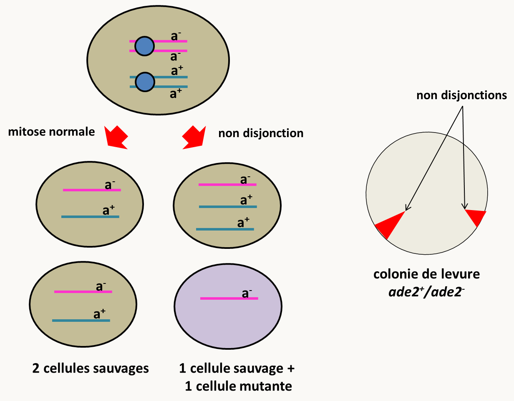
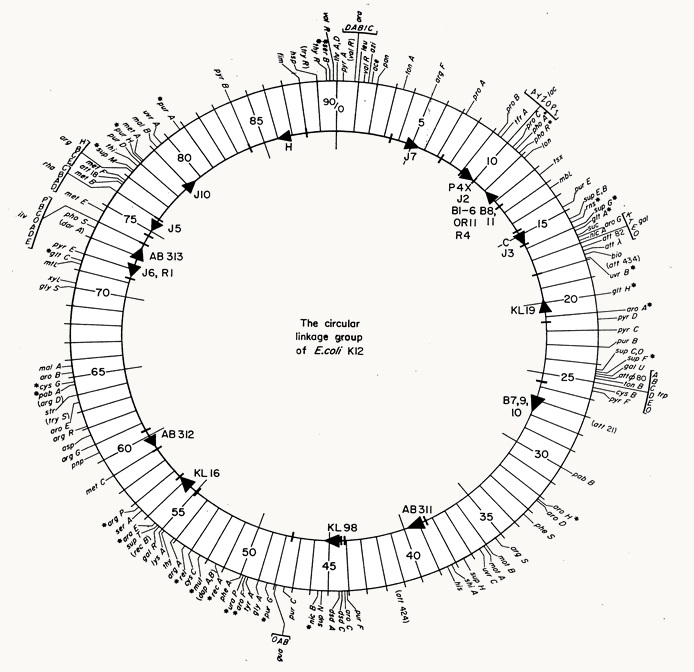

# Chapitre 5: La recombinaison et l'établissement de cartes génétiques

## Utilité des cartes génétiques

La cartographie permet de positionner des gènes sur les chromosomes. A l'issue de mutagenèse, cette méthode permet d'analyser le contenu en mutation(s) des souches obtenues (en effet, à l'issue de la mutagenèse, il n'est pas rare qu'un mutant contiennent plusieurs mutations). Elle permet aussi de ranger les différentes mutations dans des locus (ou loci) sur les chromosomes et donc d'estimer le nombre de ces locus et par extension donc le nombre de gènes. Contrairement à la complémentation, cette méthode fonctionne avec les allèles récessifs ou dominants. Toutefois, elle a aussi ses limites en particulier, elle ne permet pas de différencier si des mutations proches sont effectivement dans un même gène ou deux gènes proches. De même, deux mutations situées aux deux extrémités d'un grand gène peuvent recombiner. Cette méthode doit donc s'utiliser si possible en association avec un test de complémentation et l’interprétation des deux tests simultanément permet généralement de conclure avec grande certitude sur le nombre de gènes et leurs positions dans le génome.

Pour la mettre en œuvre, il faut croiser les mutants par la souche sauvage puis croiser les mutants entre eux et analyser la descendance. Ceci se réalise très bien chez les eucaryotes au moment de la reproduction sexuée, mais il existe d'autres méthodes (en particulier chez les procaryotes) qui ne mettent pas en jeu la reproduction sexuée.

## Les eucaryotes: la méiose

La plupart des analyses cartographiques chez les eucaryotes utilisent la méiose. L'analyse diffère bien évidemment entre les organismes haplobiontiques, où l'on observe principalement les résultats de la méiose, diplobiontiques, où l'on observe les résultats du réassortiment des gamètes au cours des fécondations, et les haplodiplobiontiques chez qui il est possible d'observer à la fois les résultats des méioses et des fécondations. Nous allons analyser chacun de ces types d'organismes. Mais avant, nous allons analyser quelques grands principe de ségrégation des gènes et des chromosomes.

Chez tous les organismes, nous avons vu que l'on définit deux grands phénomènes de recombinaison génétique qui permettent de réassortir différents allèles. Le premier phénomène provient de la ségrégation indépendante des chromosomes homologues et des chromatides au moment des deux divisions de la méiose, il s'agit du brassage chromosomique. Dans ses expériences Mendel n'a utilisé que des gènes localisés sur des chromosomes différents; ce qui l'a conduit à énoncer sa deuxième loi d'indépendance de ségrégations des caractères. Cependant, rapidement, on s'est aperçu que certains gènes ne ségrégeaient pas indépendamment les uns des autres (et donc que la deuxième loi de Mendel était fausse dans certains cas). Rapidement, il a été établi qu'ils se trouvaient sur les mêmes chromosomes et qu'ils pouvaient être dissociés par le deuxième type d'évènement de recombinaison au sein d'un chromosome auxquels le nom de crossing-over a été donné.

La fréquence de ces crossing-over peut servir à mesurer la distance entre deux régions de l'ADN située sur un même chromosome. En effet, plus ces régions sont éloignées, plus la fréquence des crossing-over entre ces régions sera élevée. Par convention, on définit **1 unité de distance génétique (que l'on mesure en centimorgan, cM) comme la distance entre deux régions pour lesquelles en moyenne 1 produit de la méiose sur 100 est recombiné.** En d'autre terme, pour deux régions d'un même chromosome (chromatide) séparées de 1 cM, il y a une chance sur cent que les deux régions se retrouvent sur 2 chromatides différentes après la méiose.

<u>***Pour calculer les distances entre deux régions, il faut donc calculer le pourcentage de chromatides recombinées parmi la totalité des chromatides.***</u>

Pour calculer la distance entre deux gènes, il faut donc déterminer le nombre de chromatides ayant une des deux combinaisons parentales (P1 et P2) et le nombre de celles ayant une des deux combinaisons recombinées (R1 et R2). La distante génétique en cM sera alors égale à 100 x (R1+R2)/(P1+P2+R1+R2). Notez que si les allèles ségrègent indépendamment les effectifs de chacune des combinaisons sont identiques (P1= P2 = R1 = R2). En appliquant la formule ci-dessus, on voit donc que la "distance génétique" calculable culmine à 50 cM. Dans ce cas, il y a indépendance génétique et on ne peut pas formellement calculer de distance!

Notez le cas où on observe une indépendance génétique entre deux gènes, cela ne veut pas forcémment dire que les gènes sont sur des chromosomes différents. En effet, deux gènes suffisamment éloignés sur un même chromosome peuvent ségréger indépendamment l'un de l'autre si suffisamment de crossing-over ont lieu entre eux à chaque méiose.

Dans les calculs ci-dessus, on ne tient compte que des recombinants détectables. Mais, s'il se produit un deuxième crossing-over entre les locus examinés, cela va entraîner un retour à une combinaison d'aspect parental, bien qu'il y ait eu une recombinaison (figure 107).

Dans ces conditions, on voit que la distance sera sous-estimée car il faudrait compter deux fois les doubles crossing-over, alors que ceci ne seront seront pas comptés. Ce biais est de plus en plus important quand la distance entre les deux régions augmente. Deux approches sont possibles pour contourner ce problème. On peut essayer de cartographier à l'aide de marqueurs intermédiaires de façon à ne prendre en compte que des petites distances. Les distances ainsi calculées peuvent être additionnées pour donner la distance réelle entre les deux marqueurs les plus éloignés (dit les **marqueurs distaux**). Cette addition peut conduire à une distance supérieure à 50 cM qui indique donc que plusieurs crossing-over par méiose se produisent entre les marqueurs distaux. On peut aussi extrapoler la distance en supposant que l'apparition des crossing-over est aléatoire. Voyons comment procéder.

Lorsqu'il se produit plus d'un crossing-over, la fréquence des produits de méiose recombinés que l'on peut détecter (FR) est la moitié du nombre réel quel que soit le nombre de crossing-over (figure 108).

![calcul de FR= fréquence de produits de méiose recombinés apparents. Sans crossing-over, FR= 0%; avec un crossing-over, FR= 50%; FR= 50 % aussi avec deux crossing-over. En effet, si on fixe le premier crossing-over (flèche rose), il existe quatre possibilités pour les chromatides impliquées dans le deuxième crossing-over. Deux des possibilités conduisent à la détection de recombinants et les deux autres à une absence de détection. Au total, la moitié des recombinants seront donc détectables si deux crossing-over sont en jeu.](img/image108.png)

D'après la figure 108, on voit donc que si deux gènes sont éloignées et que plusieurs crossing-over se produisent entre eux en moyenne par méiose, la fréquence des méioses qui n'ont pas subi de crossing-over, c'est à dire celles ou F(X = 0), est reliée à la fréquence des recombinants car elle est égale à 1 - 2 x FR.

Or nous pouvons relier le nombre moyen de crossing-over à la fréquence des produits de méiose sans crossing-over car la loi d'apparition des crossing-over suit une loi de Poisson si les crossing-over sont rares et indépendants les uns des autres (loi de probabilité des évènements rares). Les fréquences du nombre des crossing-over sont donc données par la formule **F(X = i)  = e-m mi/i!**, où m est le nombre moyen de crossing-over entre les deux régions et i le nombre de crossing-over.

Cela veut dire que la proportion des méioses où il ne se produit pas de crossing-over est F(X = 0) = e-m = 1 - 2 x RF. D'où l'on tire que **m = - ln (1 - 2 x FR)**

Nous voyons sur la figure 108 que pour 1 crossing-over par méiose, il y a seulement la moitié des chromatides qui sont recombinées et donc la distance génétique est 1/2 m, soit pour avoir la distance en cM :

**d = - 1/2 ln (1- 2 x RF) X 100**

exemple:

Si on trouve 38 % de chromatides recombinées à l'issue du croisement que l'on analyse, la vraie distance est probablement proche de - 0.5 x ln (1- 2 x 0.38) = 0.71, soit une distance génétique de 71 cM. Vous voyez donc que si on ne corrige pas la distance, on la sous-estime grandement. Cette distance plus grande que 50 cM reflète le fait qu'il se produit en moyenne plus d'un crossing-over par méiose entre les deux gènes, comme dans le cas où on utilise des marqueurs intermédiaires pour calculer la distance entre marqueurs distaux.

Mais attention, ce calcul n'est valide que si les crossing-over se produisent indépendamment les uns des autres. Ceci n'est pas le cas pour de nombreux organismes car il existe des **interférences de crossing-over**. Le plus souvent, la présence d'un premier crossing-over inhibe la production d'un deuxième dans les régions proches. De plus, nous allons voir que chez certains organismes, où l'analyse des produits de la méiose est possible, nous pouvons avoir accès aux doubles crossing-over. Cette formule ne s'applique pas pour l'estimation à partir de la distance qui prend en compte déjà les doubles crossing-over.

### Les organismes haplobiontiques: *Neurospora crassa* et les champignons filamenteux ascomycètes ayant des asques ordonnés

Nous avons vu dans l'introduction Générale, que chez les champignons du type de *Neurospora crassa*, la structure de l'asque donne directement accès aux phénomènes de ségrégation qui se sont produits au cours de la méiose car ces asques ont une mémoire de l'orientation des fuseaux aux cours de la méiose : on parle d'asques ordonnés. Chez ce champignon, il est donc possible de faire trois types d'analyse, l'analyse de spores en vrac, l'analyse d'asques non ordonnés et l'analyse d'asques ordonnés. Après la méiose chez ce champignon, il se produit une mitose qui conduit à des asques contenant huit spores. Cela n'est pas gênant car les 2 spores issues d'une mitose sont a priori identiques et cote à cote (figure 109)

Nous allons détailler uniquement ce qu'il se passe dans le cas de l'analyse des asques ordonnés car nous verrons l'analyse de tétrades désordonnées et les spores en vrac dans le cas de la levure. Pour simplifier l'explication et les dessins, nous ne considérerons donc que les produits avant la mitose postméiotique. Schématisons avec 1 gène sur un chromosome ce qui se passe au cours de méiose (figure 110)

On voit qu'il est possible de définir deux types d'asques: les **préréduits** et les **postréduits**. Les asques préréduits sont faciles à repérer car chaque demi-asque est homogène avec soit deux spores a1 soit deux spores a2, alors que pour les asques postréduits les demi-asques contient une spore avec un allèle et une spore avec l'autre.

- Le premier renseignement que l'on tire est que s'il y a un seul couple d'allèle responsable d'un caractère alors, les deux allèles ségrègent 2:2 dans chacun des asques (c'est à dire que deux spores sont a1 et deux spores sont a2)!

  **Donc, si un caractère ségrège 2:2 dans les asques c'est qu'il est codé par un gène, s'il ne ségrège pas 2:2 dans chacun des asques (ségrégation de type 3:1 ou 4:0) c'est qu'il n'est pas codé par un seul gène.**

- Deuxièmement, les proportions d'asques préréduits et postréduits dépendent de la fréquence des crossing-over qui se produisent entre le centromère et le gène. On peut calculer la distance entre le gène et le centromère : **d= nb d'asques postréduits/ 2 x le nb total d'asques x 100 cM** (car pour chaque asque postréduit, seulement la moitié des chromatides est recombinée).

  <u>Que se passe-t-il si le gène est très proche du centromère ?</u>

  ​	- Dans ce cas, on n'obtient que des asques préréduits, et la distance est nulle.

  <u>Que se passe-t-il si le gène est très éloigné de son centromère ?</u>

  ​	- Dans ce cas, on obtient un mélange d'asques préréduits et postréduits dans une proportion respectivement de 1/3 et 2/3. En effet:

  - si pas de crossing-over entre le gène et son centromère: 100% des asques sont préréduits

  - si 1 crossing-over entre le gène et son centromère: 100% des asques sont postréduits

  - si 2 crossing-over entre le gène et son centromère: 50 % d'asques préréduits et 50 % d'asques postréduits (figure 111)

    

  On voit donc que :

  - Si on part d'un asque préréduit et que l'on fait 1 crossing-over supplémentaire, on obtient un asque postréduit.
  - Si on part d'un asque postréduit et que l'on fait 1 crossing-over, on obtient dans un cas sur deux un asque postréduit et dans un cas sur deux un asque préréduit.

  On peut donc construire ainsi la suite suivante: (% d'asques postréduits)n = (% d'asques préréduits)n-1 + 1/2 (% d'asques postréduits)n-1

  et comme (% d'asques préréduits)n-1 = 1- (% d'asques postréduits)n-1, on en déduit que  (% d'asques postréduits)n = 1 -1/2 (% d'asques postréduits)n-1

et donc **lorsque n est très grand la proportion d'asques postréduits converge vers 2/3** qui est la limite à l'infinie de cette suite. Donc si le pourcentage d'asques postréduits est de 66%, cela veut dire que le gène est éloigné de son centromère est qu'il ségrège indépendamment du centromère ! Attention dans ces conditions, on ne peut pas calculer une distance !!!

**En résumé : pour analyser ces asques, on recherche les asques pré- et post-réduits. Puis on calcule le pourcentage de post-réduction qui représente le double de la distance (après la correction par 100 pour avoir des cM !). Sauf, si le pourcentage d'asques postréduits est égal à 66%, car le gène est indépendant de son centromère et on ne peut calculer de distance.**

Lorsque plusieurs gènes sont en jeu (ségrégation de type 3:1 ou 4;0), je vous conseille de traiter les données pour chaque gène par rapport à son centromère indépendamment des autres. Ensuite, il faut traiter les gènes deux à deux sous forme d'asques non-ordonnés comme dans le cas de la levure.

### Les organismes haplodiplobiontiques: *Saccharomyces cerevisiae* et les levures ascomycètes

Nous avons vu dans l'introduction que chez les levures du type de *Saccharomyces cerevisiae*, il est possible d'observer les résultats de la méiose dans des asques non ordonnés. Ceux-ci contiennent 4 spores d'où leur nom de tétrades. Comme, elles ne sont pas ordonnées, l'information de position par rapport au centromère est perdue. Cette analyse fournit donc moins de renseignements que l'analyse des asques ordonnés.

- Comme pour *Neurospora crassa*, si un gène est en jeu dans le croisement, toutes les tétrades ségrègent 2:2 pour les deux allèles du gène. La présence de tétrades 3:1 ou 4:0 est indicatif de la présence de plus d'un gène.

- Si deux gènes sont mis en jeu (comme dans le cas d'un croisement mutant par mutant) alors, l'analyse de tétrades fournit des informations sur la position de ces deux gènes l'un par rapport à l'autre.  Croisons une souche a1 b1 par une souche a2 b2. On voit donc que les associations parentales sont a1 b1 et a2 b2, et les associations recombinées sont a1 b2 et a2 b1

  - Si les gènes sont sur des chromosomes différents, ils ségrègent indépendamment au cours du brassage chromosomique et il peut se produire en plus des crossing-over entre les gènes et leur centromère (figure 112 et 113).

  ![ségrégation de deux gènes localisés sur des chromosomes différents dans les tétrades de levure sans ou avec un seul crossing-over. Sans crossing-over, comme chaque association de chromosomes est équiprobable au cours de la première division de la méiose, on obtient autant de tétrades avec uniquement des associations parentales dites ditypes parentaux que de tétrades contenant uniquement des associations recombinées dites ditypes recombinés. Avec un crossing-over entre l'un des gènes et son centromère, on obtient uniquement des asques contenant une spore de chacune des 4 associations dits tétratypes.](img/image112.png)

  

  Dans les figures 112 et 113, seuls ont été représentés les asques obtenus si les deux chromosomes "du haut" (et donc aussi les deux chromosomes du bas) ségrègent ensembles. On obtient les mêmes résultats si ce ne sont pas ces chromosomes qui ségrègent ensembles. On voit qu'il est possible de définir trois types de tétrades; les **ditypes parentaux** (DP) pour lesquels uniquement les associations parentales sont présentes dans les spores, les **ditypes recombinés** (DR) pour lesquels  uniquement les associations recombinées sont présentes dans les spores et les **tétratypes** (T) pour lesquels deux spores ont une association parentale et les deux autres une association recombinée. Comme chaque association de chromosomes est équiprobable au cours de la première ou de la deuxième division de la méiose, on obtient sans crossing-over uniquement des DP et des DR en quantités identiques, avec un crossing-over uniquement des T, et avec 2 crossing-over des DRs et des DPs en proportions de 1/4 et des T en proportions de 1/2

  Donc, si l'on réunit les résultats obtenus avec 0, 1 ou 2 crossing-over, on obtient au total autant de ditypes parentaux que de ditypes recombinés : **DP = DR**

  Par contre, la fréquence des tétratypes dépend des crossing-over qui se produisent entre les gènes et leur centromère. Cette fréquence n'est pas informative car elle provient de la combinaison des tétratypes issus des crossing-over entre (a1/a2) et son centromère, de ceux issus des crossing-over entre (b1/b2) et son centromère et des tétratypes issus de doubles crossing-over entre les deux gènes et leurs centromères respectifs.

  Que se passe-t-il si les gènes sont très éloignés de leurs centromères et que de nombreux crossing-over se produisent ?

  Dans ces conditions, le pourcentage maximum de tétratypes plafonne à 2/3. En effet, le tableau suivant donne les types et les fréquences des tétrades désordonnées que l'on observe en fonction des pré- et post-réduction des deux gènes situés sur deux chromosomes différents (faites les schémas !) :

  |                | préréduit             | postréduit                     |
  | -------------- | --------------------- | ------------------------------ |
  | **préréduit**  | **50 % DP : 50 % DR** | **100 % T**                    |
  | **postréduit** | **100 % T**           | **25 % DP : 50 % T : 25 % DR** |

  et donc si X est la fréquence de postréduction du premier gène et Y la fréquence de postréduction du deuxième gène, la fréquence de tétratype est : **T = Y(1-X) + X (1-Y) + 1/2 XY= X + Y - 3/2 XY**

  Considérons le cas de deux gènes très éloignés de leurs centromères. C'est la configuration où il se produit le maximum de crossing-over et où X et Y sont les plus élevés. Dans ces conditions, nous avons vu précédemment au cours de l'analyse des asques chez *Neurospora crassa* qu'ils sont postréduits avec une fréquence de 2/3, d'où la fréquence maximale de tétratypes T = 2/3 + 2/3 - 3/2 (2/3 x 2/3) = 2/3

- Analysons maintenant ce qui se passe pour la même combinaison génique a1 b1 x a2 b2 dans le cas où les deux gènes se trouveraient sur le même chromosome.

  - Un premier cas à considérer, est celui où les "deux gènes" sont en fait un seul et même gène (ce qui peut arriver à l'issue de la mutagenèse et que l'on croise les mutants entre eux) ! Dans ce cas, la descendance est en théorie uniformément mutante ! Mais attention, si les différences entre les deux allèles et l'allèle sauvage ne sont pas localisées au même endroit, il est possible d'obtenir de rares recombinants sauvages après un crossing-over en méiose. On parle alors de **recombinaison intragénique**.

  - Si les deux gènes sont sont bien différents, ils ne ségrègent pas indépendamment et il peut se produire des crossing-over entre les deux gènes. Seuls ceux-ci sont représentés dans la figure 114 car ce sont les seuls qui sont informatifs.

    

    On voit que dans ce cas les DP sont beaucoup plus fréquents que les DR (DP > DR) car ils sont obtenus soit en absence de crossing-over, soit lorsque deux crossing-over qui engagent les mêmes chromatides se produisent. Les DRs ne sont obtenus que dans le cas où 2 crossing-over engagent les 4 chromatides.

    Il est possible de calculer la distance en tenant compte des doubles crossing-over, car les DR provenant uniquement des méioses où se sont produit des doubles crossing-over, ils peuvent servir à estimer leur nombre. Après dénombrement et simplification on trouve que:

    **d = (T + 6 DR)/2 x Ntot x 100 cM**, où Ntot est le nombre total de tétrades analysées

    Que se passe-t-il si la distance entre les deux gènes augmente ?

    Comme pour le cas où les deux gènes sont sur des chromosomes différents nous allons voir que DP = DR et que T = 2/3.  En effet:

    si 0 crossing-over: 100% de DP
    si 1 crossing-over: 100% de T
    si 2 crossing-over: 50% de T, 25 % de DP et 25% de DR

    On voit donc que si on part d'un DP ou d'un DR et que l'on fait un crossing-over supplémentaire on obtient un T. Et que si on part d'un T, on obtient 1/2 de T et 1/4 de DP et 1/4 de DR.

    On peut alors construire la suite: Tn = DPn-1 + DRn-1 + 1/2 Tn-1 = DPn-1 + 1 - (DPn-1 + Tn-1) + 1/2 Tn-1= 1 -  1/2 Tn-1

    D'où la convergence du nombre de T vers 2/3. De même, on voit que DP = DR = 1/6 lorsque de nombreux crossing-over se produisent entre les deux gènes.

Donc, pour l'analyse de tétrades, il faut caractériser les DP, DR et T, ensuite deux cas:

- 1°) DP = DR alors les deux gènes sont indépendants

  - si la fréquence de tétratypes est inférieure à 66%, les gènes sont sur des chromosomes différents
  - si la fréquence de tétratypes est égale à 66%, on ne peut pas conclure

- 2°) DP > DR alors les deux gènes sont liés et on peut calculer la distance d = (T + 6 DR)/2 x Ntot x 100 cM

#### L'analyse de spores en vrac

Dans certains cas, il n'est pas possible d'effectuer des analyses en asques ordonnés ou même en tétrades, par exemple chez certains champignons comme *Aspergillus nidulans* pour lesquels les asques sont trop fragiles pour être récoltés individuellement (voir dans l'Introduction Générale le cycle de cette espèce). Il est évident que l'on peut faire de même pour *Neurospora crassa* et *Saccharomyces cerevisiae*. Mais, Le fait de ne pas considérer les asques fait que de l'information est perdue (en particulier, on ne peut pas évaluer les doubles crossing-over entre deux gènes). Ce type d'analyse fourni donc moins d'information que l'analyse de tétrades ordonnées ou non. L'analyse des spores en vrac est par contre souvent beaucoup plus facile à mettre en œuvre pratiquement et suffit souvent en première approche.

- Si un gène est en jeu au cours du croisement (a- x a+), on récupère en théorie 50% spores a-  et 50% de spores a+

- Si deux gènes sont en jeu au cours du croisement (a- b+ x a+ b-) et s'ils sont indépendants, on récupère un quart de chacune des catégories. Par contre un excès de catégories parentales sera indicatif d'une liaison entre les gènes. On pourra alors calculer une distance :

  ​			**d = nombre de spores recombinante / nombre total de spores x 100 cM**

Dans ce cas, l'utilisation de l'extrapolation de la distance pour tenir compte des crossing-over multiples  est souhaitable.

### Les organismes diplobiontiques: *Caenorhabditis elegans*

Chez le ver *Caenorhabditis elegans*, comme chez les tous les animaux et les plantes supérieures, il n'est possible d'observer que le réassortiment des gamètes après fécondations. Chez ce ver, les autofécondations des hermaphrodites et les croisements mâles par hermaphrodites permettent de faire rapidement des analyses de ségrégation, en particulier en raison de son temps de génération très court.

Les lois de Mendel vues dans l'Introduction Générale, nous disent que chez les diplobiontiques que la ségrégation d'un gène ne peut se voir qu'en F2 si l'on part d'un croisement entre lignées pures. En effet, en F1, il est seulement possible de déterminer la dominance/récessivité des allèles. En F2, un couple d'allèle va ségréger avec 3/4 de descendants ayant le phénotype dominant et un quart ayant le phénotype récessif. Si deux gènes autosomaux sont en jeu, il est possible de voir comment ils vont ségréger en analysant un tableau de gamètes et de résultats de fécondation. Si les deux souches initiales ont les génotypes a-/a- b+/b+ (souche mutée sur a) et a+/a+ b-/b- (souche mutée sur b), en F1, tous les descendants auront le génotype a-/a+ b+/b-. L'analyse de la F1 permet donc de déterminer la dominance récessivité et pour notre exemple nous choisirons que les allèles a- et b- sont des allèles mutants récessifs. Le tableau d'une autofécondation de descendants Fi est donné sur la figure 115.

Nous voyons dans le tableau de la figure 115 que si les gènes sont indépendants, c'est à dire si les catégories parentales et recombinées sont obtenues en quantités égales, on obtient 1/16 de doubles-homozygotes récessifs (case rose) qui auront donc les deux phénotypes mutants, 3/16 de souches homozygotes uniquement pour a- (cases vertes) et qui auront donc seulement le phénotype mutant de a-,  3/16 de souches homozygotes uniquement pour b- (case bleue) et qui auront donc seulement le phénotype mutants de b- et les autres (cases violettes et orange) ont au moins un allèle sauvage pour a <u>et</u> un allèle sauvage pour b et auront donc un phénotype sauvage; seul 1/16. On voit donc la ségrégation de type "**9:3:3:1**" observées par Mendel typique de gènes indépendants. Dans le cas, où les mutations provoquent le même phénotype, on voit qu'il y aura 9/16 de sauvages et 7/16 de mutants.

Nous voyons que si les gènes sont liés, les doubles-homozygotes récessifs vont diminuer car dans ce cas les proportions de gamètes recombinés diminuent alors que les parentaux augmentent. Dans le cas extrême, où il n'y a pas de recombinant, alors en F2, 25% des descendants ont le phénotype mutant de a-, 25% des descendants ont le phénotype mutant de b- et 50% descendants sont sauvages et il n'y a pas de doubles-homozygotes récessifs.

Un moyen simple de voir si les gènes sont liés ou non est donc de compter les nombre de doubles-homozygotes récessifs:

- S'ils sont en proportion égale à 1/16 de l'effectif total de la descendance alors les gènes sont indépendants.
- S'ils ont en proportion inférieure à 1/16 de l'effectif total de la descendance alors les gènes sont liés. Il est alors possible de calculé la distance génétique: **d= 2 x √p̅ x 100 cM** ou p est la proportion des doubles-homozygotes récessifs.

Notez que si les deux mutations sont dominantes, la case diagnostique sera celle des sauvages (case orange qui dans ce cas est celle des doubles-homozygotes récessifs) et les mêmes observations s'appliqueront. Dans le cas, de croisements avec une mutation récessive et une mutation dominante, il faut choisir la bonne case diagnostique, c'est à dire celle où les individus portent à l'état homozygote l'allèle récessif et l'allèle sauvage pour le gène portant la mutation dominante.

Enfin, le tableau de la figure 115 est celui de la ségrégation de gènes autosomaux. Si un des gènes est porté sur le chromosome X, il faut tenir compte du fait que les mâles sont hémizygotes pour ce chromosome. Dans ce cas, les mâles porteurs de l'allèle récessif seront de phénotype mutant.

### Le test 3-points

Dans le cas où plus de deux mutations sont en jeu dans les croisements, je vous conseille de les traiter deux à deux. Il est cependant un cas, celui dit du test trois points, où l'analyse des trois mutations ensembles permet de les ordonner sur les chromosomes (figure 116).

![test 3-points: dans un croisement d'une F1 hérérozygote par elle-même, la fréquence d'un double crossing-over entre a et b et entre b et c est le produit de la fréquence d'un crossing-over entre a et b avec celle d'un crossing-over entre b et c. Elle est donc très inférieure à ces deux dernières fréquences. Dans les descendants les chromatides portant (a1 b2 c1) et (a2 b1 c2) sera la plus faible. En résumé, le gène qui recombine avec les deux autres avec la plus faible fréquence se trouve au milieu.](img/image116.png)

### La ségrégation extrachromosomique méiotique

Chez la plupart des organismes, il existe une différence entre le gamète apporté par le mâle et celui apporté par la femelle. Le plus souvent, le cytoplasme est apporté uniquement par la femelle. Il s'ensuit dans ces organismes une ségrégation des mitochondries (et des plastes) qui suit le plus souvent une hérédité strictement maternelle. Attention, il existe des exceptions. En particulier chez les moules les mitochondries peuvent être héritées du partenaire mâle ! Dans tous les cas, l'hérédité est dite **non-mendélienne** ou **extrachromosomique**. Je vous rappelle que nous avons déjà vu une hérédité non-mendélienne dans le chapitre des polymorphismes avec le système het-s / het-s* de Podospora anserina.

Chez l'homme, il existe un certain nombre de maladies pour laquelle l'hérédité est strictement maternelle comme des myopathies et des surdités. Nous avons aussi vu que cette hérédité strictement maternelle permet de retracer l'histoire de l'ADN mitochondrial (voir les haplotypes dans le paragraphe du polymorphisme) et par-là de retracer l'histoire des populations humaines. Voici d'autres exemples:

- Chez certains champignons, nous avons vu qu'il existe une différenciation de gamètes mâles et femelles. Il est donc possible d'orienter des croisements. Chez *Podospora anserina*, il existe une souche résistante au chloramphénicol. Cette souche porte un allèle particulier (*capR*) du gène du grand ARN ribosomique mitochondrial codé par le génome mitochondrial. Il a été obtenu après une mutagenèse. L'allèle sauvage étant appelé *capS*. Il est possible (et techniquement facile) de croiser les souches de 2 façons, femelle *capR* x mâle *capS* ou femelle *capS* x mâle *capR*. Dans le premier cas, la descendance obtenue est entièrement *capR* dans le deuxième cas, elle est entièrement *capS*.

- Chez *Saccharomyces cerevisiae*, les deux cellules contribuent équitablement au cytoplasme au cours de la reproduction sexuée. Après méiose, le cytoplasme est divisé en quatre, ce qui aboutit le plus souvent à une absence de ségrégation des caractères pendant la méiose. L'exemple le plus extrême et le cas d'un croisement d'une souche sauvage avec une souche dépourvue d'ADN mitochondrial incapable de respirer (dite souche rho°) (figure 117). Le diploïde peut respirer ainsi que les quatre spores issues de la méiose. La ségrégation est de type 4:0.

  

### Le rapport carte génétique / carte physique

Nous avons vu que nous pouvons mesurer des distances génétiques entre les gènes. Ceci permet donc d'établir des cartes génétiques. La génomique permet maintenant d'avoir accès à une distance physique dans les génomes qui peut se mesurer en nucléotide (ou paire de base) et donc d'établir des cartes physiques des chromosomes. Quelle est la relation entre distance génétique et distance physique ? En fonction des organismes la relation peut être très contrastée !

- chez la levure, l'estimation de la distance entre deux gènes contigus est de 1cM. Les gènes se répartissent *grosso modo* tous les 2 kb et donc chez la levure 1 cM ~ 2 kb. Ce rapport est relativement constant même si localement il existe des régions avec peu de crossing-over (où 1 cM représente plus de 2 kb) et des "points chauds" (où 1 cM représente moins de 2 kb).

- chez les drosophiles mâles, les crossing-over sont très rares. Chez les femelles, on estime le rapport à environ 1 cM ~ 500 kb. Chacun des gros chromosomes subit donc environ un crossing-over par méiose.

- chez l'homme, l'estimation actuelle est de 1 cM pour 1 Mb (= 106 pb). Ceci a pour conséquence que chaque chromosome subit entre un et trois crossing-over par méiose. Donc, chacun des chromosomes, que vous avez hérités de vos parents, est une mosaïque des chromosomes de vos grands-parents ! Vous êtes donc réellement génétiquement uniques, sauf si vous avez un vrai jumeau (et encore nous avons vu qu'il existe des événements génétiques somatiques par exemple !).

- chez *Podospora anserina*, la carte génétique ne reflète pas la carte physique (figure 118). En effet, les crossing-over ne sont pas indépendants et il existe des interférences très fortes, c'est à dire que la probabilité qu'il se produise un crossing-over supplémentaire sur un chromosome dépend de la préexistence d'autres crossing-over. De plus, les crossing-over se produisent uniquement dans certaines régions. Cela aboutit à une carte génétique où les gènes ne sont pas espacés régulièrement mais à une carte où ils sont groupés en paquets. En particulier sur le chromosome 1, il ne se produit qu'un seul crossing-over entre le centromère et l'idiomorphe du type sexuel *mat*. Sur ce chromosome, il existe d'autres gènes (comme *AS4* ou *modC*) qui co-ségrègent avec *mat* (d<<0.1 cM) et qui présentent aussi des ségrégations distordues. En effet, le pourcentage de post-réduction de *mat* et *AS4* est de 98 %.

  

## Les eucaryotes: la mitose

Nous avons vu dans l'Introduction Générale qu'au cours d'une mitose, il ne se produit pas (en théorie !) de changements du matériel génétique; Chaque cellule fille recevant la même information de la cellule mère.

Il existe cependant quelques cas, où des changements se produisent et où ceux-ci peuvent être utilisés par les généticiens pour faire de la cartographie.

#### Ségrégation des chromosomes nucléaires

##### Non-disjonction en mitose

Nous avons vu qu'il peut se produire des anomalies de ségrégation des chromosomes nucléaires comme la non-disjonction. Si ceci est le plus souvent létal chez les haploïdes, chez les diploïdes les cellules déficientes pour un chromosome ou avec un chromosome surnuméraire peuvent survivre. Ce type d'événements est en général très rare (mais il peut être provoqué par divers traitement, dont la colchicine). Par exemple, chez un hétérozygote a-/a+ (avec a- récessif), la non-disjonction du chromosome portant l'allèle a+ permet de voir apparaître des cellules avec un phénotype mutant (figure 119).

Dans le cas d'une colonie de levure, on voit apparaître un secteur mutant au sein d'une colonie sauvage (à gauche dans la figure 119). Dans le cas d'un animal, on obtient ce que l'on appelle une mosaïque, c'est à dire un individu avec un mélange de cellules ayant des compositions génétiques différentes. Deux gènes situés sur le même chromosome vont co-ségréger au cours des non-disjonctions.

##### Cycle parasexuel

Chez les champignons haploïdes et plus particulièrement chez *Aspergillus nidulans*, il existe un cycle que l'on qualifie de cycle parasexuel (voir figure 13). Chez cette espèce, il est donc possible de sélectionner des noyaux diploïdes qui sont générés spontanément et qui se propagent de manière assez stable surtout s'il existe une pression de sélection. Ceux-ci retournent cependant rapidement à l'état haploïde en absence de pression de sélection. Il en résulte des ré-associations aléatoires des chromosomes présents dans les souches utilisées initialement pour fabriquer le diploïde. Ceci permet de cartographier rapidement les gènes sur les différents chromosomes. De fait, pour localiser les gènes, on dispose  de souches "plurimarquées" sur tous les chromosomes qui permettent en un seul croisement de cartographier les gènes sur un des 8 chromosomes.

Prenons l'exemple pour localiser un gène sur le chromosome II d'un gène "a" avec 2 allèles (a+ et a-). Le chromosome II porte w (white) un marqueur de coloration blanche des conidies, les conidies sauvages w+ étant vertes. Pour la localisation, on construit dans un premier temps un hétérocaryon avec des noyaux <a-, y, w+ > et des noyaux <a+, y+, w>  où y (=yellow) est un marqueur de coloration qui donne des conidies jaunes et qui n'est pas situé sur le chromosome II. L'hétérocaryon produit des conidies qui sont soit blanches soit jaunes car les conidies possèdent un seul noyau. Ensuite, on sélectionne facilement un diploïde qui a des conidies vertes. Si les conidies sont vertes c'est que le noyau est diploïde et qu'il se produit de la complémentation entre les couples y/y+ et w/w+. Puis, on attend l'haploïdisation et on regarde le phénotype des souches qui ont des conidies blanches:

- Si toutes ces souches ont le phénotype apporté par a-, c'est que le gène "a" se trouve aussi sur le chromosome II.

- Si la moitié des souches ont le phénotype a- et l'autre moitié le phénotype a+, alors le gène "a" ne se trouve pas sur le chromosome II.

##### Crossing-over mitotiques

Finalement, il se produit au cours de la mitose de rares crossing-over dit crossing-over mitotiques (que l'on peut induire par des traitements appropriés en cassant l'ADN par exemple!). On obtient dans ce cas, aussi des colonies sectorisées ou des mosaïques. Par exemple chez la drosophile, les marqueurs y (couleur jaune du corps) et Sn (soies courtes et courbes) sont situés sur le même chromosome. Que se passe-t-il si des crossing-over mitotiques se produisent dans une mouche hétérozygote avec les allèles y et Sn associés en trans? La figure 120 montre ce qu'il se passe si le crossing-over se produit entre le centromère et les deux gènes.

![effets des crossing-over mitotiques. Après un crossing-over entre le gène Sn et le centromère, dans le cas de gauche avec ségrégation de la chromatide 1 avec la chromatide 4 et donc de la chromatide 2 avec la chromatide 3, deux cellules sauvages sont obtenues. Au contraire, dans le cas de droite, où la chromatide 1 ségrège avec la chromatide 3 et donc de la chromatide 2 avec la chromatide 4, les cellules filles seront pour l'une homozygote pour Sn et l'autre homozygote pour y. Chacune va donner naissance à un clone ce qui va aboutir à ce que l'on appelle des clones ou spots jumeaux.](img/image120.png)

On estime la fréquence spontanée de la recombinaison mitotique chez la drosophile à 10-5 par division. On voit donc que, plus le nombre de cellules est grand et plus celles-ci se divisent activement, plus de crossing-over mitotiques ont des chances de se produire. Pour qu'ils apparaissent phénotypiquement il faut :

- qu’il ait eu lieu suffisamment tôt dans le développement pour que les clones soient suffisamment étendus pour être visibles
- qu’il se produise dans une cellule du tissu où le gène s’exprime

Les généticiens de la drosophile ont réussi à augmenter la fréquence des crossing-over mitotiques pour faire de l’analyse clonale. Cela peut se faire en irradiant les larves de mouches aux rayons X. L'utilisation du système FLP/FRT  permet maintenant non seulement d’obtenir des clones mitotiques dans 90% des mouches mais aussi de cibler les crossing-over mitotiques dans des tissus particuliers. Des séquences FRT ont été introduites sur les 3 grands chromosomes de la drosophile et la recombinase FLP a été placé sous le contrôle de divers promoteurs. On peut donc générer des échanges de portions de chromosomes à la demande en induisant l’expression de la recombinase FLP en générant par croisement des mouches portant les sites FRT et la recombinase FLP associés aux mutations que l'on veut étudier. Chez la drosophile, les crossing-over mitotique ne servent pas vraiment à la cartographie, mais à:

- savoir si un gène a une **expression autonome cellulaire ** ou non. Dans le cas d'une expression autonome, c'est à dire que le produit du gène ne diffuse pas à l'extérieur de la cellule, on observe des spots jumeaux. Si ce n'est pas le cas et que le produit du gène diffuse d'une cellule à une autre, le produit sauvage diffusera à partir des cellules sauvages qui entoure le spot mutant. Celui-ci ne sera donc pas visible.
- déterminer le lignage d’une cellule, c’est-à-dire la portion de territoire qui descend d’elle par divisions successives
- étudier l’expression d’un gène après son stade de létalité : en effet si une mutation dans un gène est létale pour l’organisme à un stade très précoce on ne pourra pas savoir, autrement que par analyse clonale, quel est son rôle ensuite c’est-à-dire quel sera le phénotype cellulaire chez le mutant à un stade plus tardif.
- de manière converse, on peut déterminer le moment ou un gène cesse d’être requis.

Je vous rappelle que de nombreux cancers sont provoqués à la suite de crossing-over mitotiques ou de non-disjonctions, en particulier chez certains sujets prédisposés. Par exemple, certains individus portent un allèle défectif du gène Rb à l'état hétérozygote. Ces individus montrent des prédispositions aux tumeurs oculaires (rétinoblastomes) car après des crossing-over mitotiques, certaines de leurs cellules se retrouvent homozygotes pour l'allèle défectif qui intervient dans la prévention de la prolifération des cellules de la rétine. Ces cellules s'engagent alors dans la voie qui après d'autres mutations (au moins deux chez l'homme) permettent de former une tumeur cancéreuse. Il en va de même pour le gène célèbre codant la protéine p53. On appelle ces gènes des gènes suppresseurs de tumeurs. Pour ces gènes, l'allèle sauvage est dominant et il faut inactiver les 2 copies du gène pour engager la tumeur. Je vous rappelle qu'un oncogène est la forme mutante d'un gène cellulaire (appelé proto-oncogène) qui entraîne la cancérisation. Dans ce cas, l'oncogène est dominant par rapport à la forme sauvage proto-oncogène.

#### Ségrégation extrachromosomique mitotique

Nous n'avons pas encore parlé en détail de la transmission en mitose du matériel génétique extra chromosomique. Celui-ci ne possède probablement pas de système de répartition aussi efficace que les chromosomes nucléaires au moment de la mitose. On connaît en fait très mal les modalités de répartitions des mitochondries et des plastes, même si des progrès ont été faits chez *Saccharomyces cerevisiae* sur le sujet. En fait dans une cellule, il existe plusieurs copies du génome mitochondrial (ou plastidique) qui le plus souvent est une molécule d'ADN circulaire. Ceux-ci semblent se répartir au hasard au moment de la division. Les mitochondries sont capables de fusionner et fissionner permettant à des molécules d'ADN différentes de rentrer en contact et ensuite de ségréger. Les recombinaisons entre molécules d'ADN mitochondrial sont très fréquentes et sont détectables aussi bien après la mitose que la méiose.

Voyons ce qui se passe au moment de mitoses en prenant comme exemple la levure *Saccharomyces cerevisiae* (figure 121). Si on effectue un croisement entre une cellule haploïde sauvage et une cellule haploïde mutante qui porte un allèle mutant pour un gène mitochondrial, on obtient un diploïde qui contient les deux types d'ADN mitochondriaux, on dit que le diploïde est **hétéroplasmique** ou que c'est un **hétéroplasmon**. Au cours des mitoses, les ADN mitochondriaux vont entrer aléatoirement dans le bourgeon qui deviendra la cellule fille. Certaines cellules retrouveront alors un état **homoplasmique**, c'est à dire avec un seul type de mitochondrie.

 Chez la levure, ce processus est très efficace (sans que l'on sache pourquoi) et les cellules hétéroplasmiques disparaissent très rapidement de la culture. On constate donc une ségrégation des deux caractères au cours des mitoses. Ceci permet de différencier facilement des mutations affectant l'ADN mitochondrial (mutation rho- et mit-) de mutations affectant l'ADN nucléaire (mutation pet-) ou de mutants dépourvus d'ADN mitochondrial (mutation rho°). En effet, ces dernières ne ségrègent pas au cours de la mitose (aux rares crossing-over et non-disjonction près pour les mutations nucléaires). Enfin, pour rappel, nous avons vu au chapitre 4 que les recombinaisons rapides de l'ADN mitochondrial empêchent la réalisation des tests de complémentation basés sur la croissance des diploïdes (figure 103).

Dans certains cas, un seul des deux types de molécules d'ADN mitochondrial est transmis préférentiellement en mitose. Chez l'homme la transmission préférentielle dans la lignée somatique de certaines molécules défectives d'ADN mitochondrial aboutit à des pathologies incluant des myopathies et des cécités.

## Les procaryotes

Nous avons vu dans l'Introduction Générale qu'il n'existe pas chez les bactéries de mécanismes similaires à la reproduction sexuée des eucaryotes. Cependant, il est possible d'établir des cartes en utilisant trois phénomènes permettant d'échanger ou d'introduire de l'ADN dans une cellule procaryote: la **conjugaison**, la **transformation** et la **transduction**. De ces trois techniques, la transduction est la plus utilisée.

### La conjugaison

Les bactéries peuvent contenir des plasmides conjugatifs (tels que le plasmide F chez *Escherichia coli*, figure 37). Ces plasmides conjugatifs ont permis le développement de systèmes de cartographie. En effet, ces plasmides ont la capacité de s'intégrer dans le chromosome bactérien par recombinaison, ce sont des **épisomes** (figure 122). Les souches ayant un plasmide intégré sont appelées **Hfr** (pour haute fréquence de recombinaison). Elles ont toutes les caractéristiques de bactéries F+ si ce n'est que lors du transfert de F vers une bactérie F-, ce transfert s'accompagne de celui de l'ADN du chromosome (figure 122). Après cette conjugaison, il se produit une recombinaison dans la bactérie F- entre l'ADN du chromosome et l'ADN nouvellement introduit (figure 122).

![souche Hfr et principe de la conjugaison chez Escherichia coli. La conjugaison a lieu avec une souche donneuse Hfr sensible à un antibiotique et une souche receveuse qui y est résistante (ici la streptomycine). Ici la souche donneuse est sauvage et donc prototrophe pour l'histidine (his+), alors que la réceptrice est auxotrophe pour cet acide aminé. Le transfert du chromosome bactérien de la souche donneuse vers la souche receveuse peut se voir par l'obtention de conjugants résistants à la streptomycine (et donc ayant le génome de la receveuse) et qui sont devenus prototrophe grâce à un double crossing-over qui a permis le remplacement de l'allèle his- par l'allèle his+.](img/image122.png)

Notez que le plus souvent après une conjugaison avec une souche Hfr, la bactérie receveuse reste F-. Ce système a permis le développement d'un système de cartographie efficace (figure 123). En effet, si la bactérie donneuse Hfr diffère de la bactérie réceptrice par un certain nombre de marqueurs, il est possible de suivre l'apparition au cours du temps de ces marqueurs dans la bactérie réceptrice. Pour ceci il faut "croiser" une bactérie Hfr avec une bactérie  F-  et interrompre la conjugaison à différents moments... simplement en agitant la culture !  Ensuite, il faut mesurer la cinétique d'apparition dans la receveuse des différents marqueurs.

Chez *Escherichia coli*, l'insertion du plasmide F dans le chromosome peut se faire à différents endroits (figure 122). Ceci permet de cartographier à partir de plusieurs origines. Les données obtenues montrent alors que les ordres obtenus pour les mêmes marqueurs diffèrent mais ne sont pas aléatoires. L'analyse de l'ensemble des résultats a permis de conclure qu'en fait le chromosome de *Escherichia coli* est circulaire (figure 124). Le principe par conjugaison permet donc de cartographier facilement des mutations nouvellement obtenues en se servant des mutants comme réceptrices et de souches Hfr sauvages comme donneuses.

### La transformation

Le principe de la cartographie est le même que pour la transduction (cf. section suivante) avec la différence que l'introduction de l'ADN se fait par transformation plutôt que via un phage.

### La transduction

La transduction est l'introduction d'ADN exogène via un bactériophage. Il existe plusieurs types de transduction en fonction du type de phage utilisé. La méthode la plus répandue car elle permet de cartographier n'importe quelle région du génome bactérien est la transduction généralisée qui se fait avec le phage P1. Le principe de la transduction est le suivant est décrit sur la figure 125.

![principe de la cartographie par transduction avec le phage P1. Le phage P1 peut emporter un fragment du génome bactérien de la bactérie donneuse et l'injecter à la bactérie receveuse. Les phages emportant un morceau de chromosome bactérien n'empaquètent pas leur propre ADN correctement et sont donc souvent défectifs. La fréquence de ce processus est très faible. Il faut donc pouvoir sélectionner facilement la bactérie transduite (par un retour au phénotype sauvage a+ et/ou b+ par exemple). Le principe de la cartographie est alors très simple. Si on part d'une souche donneuse a+ b+ c+ et que l'on transduit une bactérie réceptrice a- b- c-, les bactéries "co-transduite" a+ b+  seront d'autant plus fréquentes que les gènes a et b sont proches. Le gène c étant éloignés des deux autres, il ne sera jamais co-transduit. Notez que pour que les gènes soient co-transduits, il faut qu'ils soient sur un fragment suffisamment petit pour qu'il puisse être emporté par le phage P1, soit espacés au maximum de 60 kb.](img/image125.png)
