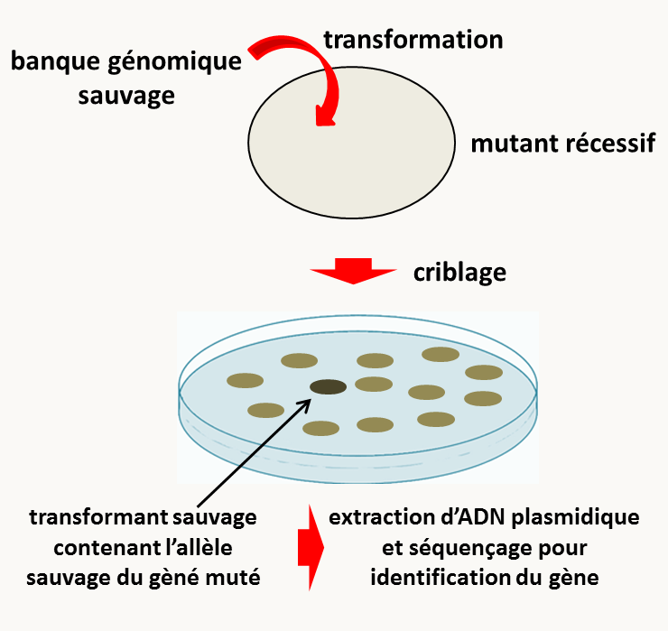

# Chapitre 6: L'identification des allèles sauvages et mutants

Après les analyses génétiques par test de complémentation et cartographie pour déterminer le nombre de gènes identifiés lors d'une mutagenèse classique, l'étape suivante consiste dans l'identification moléculaire des gènes mutés, c'est à dire l'obtention de leurs séquences sous forme sauvage et mutante afin d'avoir une idée de la fonction potentielle du gène, en comparant par exemple la séquence de la protéine ou de l'ARN codé avec des banques de données, ainsi qu'une idée de la nature de la mutation (voir la figure 99). Nous avons vu que cette étape est simple si le traitement mutagène est fait par insertion d'ADN exogène (comme dans le REMI) ou à l'aide d'un transposon (figure 94). Par contre, dans le cas de mutagenèse avec les rayons UV ou des mutagènes chimiques, l'identification peut présenter des problèmes. Avec l'arrivée des technologies de séquençage à haut débit, celle-ci est maintenant souvent grandement simplifiée. Néanmoins, deux autres méthodes plus anciennes sont toujours utilisées pour identifier les gènes : le clonage par expression et le clonage positionnel. Nous allons donc voir, les trois technologies successivement.

## Le clonage par expression

Aussi souvent appelé clonage par complémentation (voir le chapitre 4), cette méthode de clonage ne peut se faire que chez les organismes transformables facilement et pour lesquels il est possible de cribler un grand nombre de transformants, soit essentiellement des bactéries, des levures et avec quelques adaptations les champignons filamenteux. Elle repose sur l'utilisation d'une **banque génomique** (figure 126).

![principe de la construction d'une banque d'ADN génomique. L'ADN de l'organisme pour lequel on souhaite construire une banque est extrait et fragmenté (par digestion enzymatique partielle, fragmentation physique...). Il est ensuite cloné dans un vecteur bactérien. Chacun des clones contient un plasmide portant un fragment d'ADN génomique. La collection des clones obtenus s'appelle une banque d'ADN génomique. Elle est complète si elle contient au moins une fois chacun des gènes de l'organisme de départ. Comme le clonage est normalement aléatoire, cela sera vrai s'il y a suffisamment de clones. On appelle couverture le nombre de fois ou une région d'ADN est présente dans les clones; elle est représentée par la lettre X: une couverture de 1X veut dire que la taille combinée des inserts de la banque est identique à la taille du génome et donc que les gènes sont représentés une seule fois en moyenne dans la banque. Pour être complète, la couverture d'une banque doit être d'au moins 5X à 10X.](img/image126.png)

Pour identifier le gène mutant, la stratégie dépend de la dominance/récessivité de la mutation. Dans le cas où la mutation est récessive, le principe du clonage par expression consiste dans la transformation de la souche mutante par l'ADN plasmidique des clones d'une banque d'ADN génomique obtenue à partir de la souche sauvage (figure 127). Les transformants obtenus présentant un phénotype sauvage sont sélectionnés: ils portent normalement un plasmide portant l'allèle sauvage du gène muté. Le plasmide peut être extrait et l'insert qu'il porte séquencé. Une fois la séquence sauvage obtenue, la séquence du mutant peut facilement être obtenue en amplifiant par PCR l'ADN génomique du mutant.

Dans le cas où la mutation est dominante, il faut procéder de manière réciproque, c'est à dire construire une banque génomique à partir de l'ADN du mutant et transformer la souche sauvage. Les transformants sont ensuite criblés sur l'apparition de souches présentant un phénotype mutant. Notez que pour les mutations récessives, il suffit de construire une fois pour toute une banque génomique à partir du sauvage et de l'utiliser pour cloner toutes les mutations récessives. Dans le cas des mutations dominantes, il faut à chaque fois construire une nouvelle banque, ce qui est parfois une étape longue et ardue.

Dans le cas des organismes qui n'ont pas de plasmide réplicatif, comme les champignons filamenteux, il est souvent difficile de récupérer les plasmides à partir des transformants complémentés (pour les mutations récessives) ou exprimant l'allèle mutant (pour les mutations dominantes). Les banques sont alors construites dans des vecteurs portants des longs inserts, tels que les cosmides. Les cosmides sont maintenus dans des plaques de micro-titration de 96 puits identifiées. Les ADN des clones sont transformés par pool de 96 et les transformants sont criblés pour le phénotype diagnostique. Si aucun transformant intéressant n'est identifié, le pool suivant est analysé. Le processus est répété jusqu'à ce qu'un transformant diagnostique soit obtenu. La microplaque dont est issu le transformant est alors analysée par pool de 10, puis les clones du pool de 10 intéressant sont analysés individuellement. On appelle ce type de criblage de la **sib-sélection**. Notez que le fragment d'ADN identifié par cette méthode est généralement grand (les inserts des cosmides font par exemple 40-45 kb) et contient plusieurs gènes (souvent 10-15 gènes pour un cosmide). Il faut alors procéder à sa fragmentation et analyser chacun des fragments pour savoir si l'un d'entre eux (portant un seul gène) est capable de conférer le phénotype d'intérêt. Notez qu'avant de poursuivre des expériences qui peuvent être longue et coûteuse, il est conseillé dans tous les cas de clonage par expression de **réintroduire le gène candidat**, et uniquement le gène candidat, **pour valider que c'est bien le bon gène**: normalement **dans ce cas** **tous les transformants devraient présenter le phénotype diagnostique**. Un exemple du clonage du gène IDC1 chez *Podospora anserina* par cette méthode est donné à la fin du chapitre 4.

## Le clonage positionnel

La deuxième méthode, celle du clonage positionnel, peut être utilisé dans tous les cas où les analyses de ségrégation sont faciles, tout au moins possibles. C'est le cas des eucaryotes chez qui il existe une reproduction sexuée. De fait, c'est la technique qui a été utilisée pour identifier chez l'homme la majorité des gènes affectés chez les malades atteints de maladie génétique. Cette méthode se base sur des analyses de co-ségrégation du phénotype mutant avec des marqueurs génétiques le plus souvent de type microsatellite (voir chapitre 1), afin d'établir une carte fine de la position de la mutation dans le génome (figure 128). Il faut donc disposer de deux souches présentant entre elles de nombreux polymorphismes moléculaires, facilement analysable, par exemple par PCR (d'où l’utilisation préférentielle des microsatellites). C'est bien évidemment le cas chez l'homme où tous les individus diffèrent entre eux par de nombreux polymorphismes (sauf les vrais jumeaux). Dans l'exemple de la figure 128, l'organisme est haplobiontique, ce qui facilite la démonstration du principe, mais la technique est bien évidemment possible, mais plus longue et complexe, chez les diplobiontiques. La méthode démarre par la génération d'une descendance F1 d'un croisement de la souche mutante avec une souche sauvage présentant de nombreux polymorphisme avec la souche dont est issu le mutant. Les descendants sont dans un premier temps phénotypés, c'est à dire qu'il est établi s'ils ont un phénotype sauvage ou mutant. Puis ils sont génotypés pour les différents marqueurs, c'est à dire qu'il est établi si leurs marqueurs microsatellites proviennent du parent sauvage ou du parent mutant. Ces données permettent alors de construire une carte génétique dans laquelle est localisé précisément l'allèle mutant par rapport aux différents marqueurs testés.

Une fois la mutation positionnée, la suite des opérations dépend de la disponibilité de la séquence génomique de l'organisme étudié.

- Si celle-ci est disponible, il est facile d'identifier le ou les gènes candidats potentiels. Ceux-ci seront validés en les transformants et en observant l'apparition dans les transformants de phénotypes diagnostiques, comme expliqué dans la section précédente. S'il n'est pas possible de transformer comme chez l'Homme, il faut alors obtenir les séquences de plusieurs sujets sains non porteurs, de plusieurs sujets porteurs sains et/ou malades et identifier les polymorphismes absents des sujets non porteurs et présents chez les porteurs (pour les mutations récessives à l'état homozygote chez les malades et l'état hétérozygote chez les porteurs sains). Cela permet alors d'identifier des candidats potentiels.

- Si la séquence du génome n'est pas disponible, il faut alors faire une marche chromosomique en partant du gène cloné le plus proche, pour lequel on possède donc la séquence (figure 129). Notez que celle-ci est grandement facilitée si on dispose d'une banque génomique. Si ce n'est pas le cas, il faut alors utiliser la PCR inverse (figure 94) pour marcher, ce qui est long et incertain. Le principe consiste à récupérer les régions d'ADN jouxtant celle connue et de tester si ces régions contiennent le gène d'intérêt. L'identification de gène(s) candidat(s) se fait de manière identique à ce que l'on fait dans le cas où la séquence génomique est disponible. On voit donc que dans le cas des organismes non transformables, cela veut dire qu'il faut alors établir de nombreuses séquences à partir d'individus sauvages et mutants. On "marche" ainsi sur le chromosome jusqu'à ce que le bon gène soit identifié.

- 

## Le séquençage complet des génomes

Avec le développement des nouvelles technologies de séquençage à haut débit, l'identification des gènes peut maintenant se faire en séquençant les génomes des mutants puis en comparant la séquence obtenue avec celle de référence de la souche sauvage. Si cette méthode semble simple dans son précepte, il faut néanmoins faire attention dans l'application car il est possible de mal identifier une mutation importante et de se focaliser sur une mutation en fait sans intérêt. De fait, un traitement mutagène aboutit très souvent à l'accumulation de mutations qui n'ont rien à voir dans la genèse du phénotype d'intérêt. De plus, la présence de nombreux polymorphismes dans les génomes chez de nombreuses espèces (comme l'homme par exemple) peut rendre difficile l'identification par séquençage globale des génomes mutants.

Pour circonvenir le premier problème, il suffit de faire une **introgression** avec la souche parentale qui n'a pas subi de traitement mutagène (figure 130 à gauche). Au premier tour de croisement avec la souche sauvage vierge de traitement, la moitié du génome des descendants proviendra de cette souche, au deuxième tour un quart, etc. Si bien qu'après six croisements, il ne reste plus dans les descendants mutants en théorie que 1.5 % du génome de la souche ayant subi le traitement mutagène. Il ne reste donc plus dans le génome de ces souches F6 qu'une petite région génomique autour de la mutation d'intérêt. Il suffit de séquencer le génome d'une seule de ces souches et de la comparer avec la séquence de référence de la souche parentale. C'est cette technique que nous utilisons dans mon laboratoire pour identifier les mutations chez *Podospora anserina*, chez qui les génomes des souches *mat+* et *mat-* sont identiques (sauf autour du type sexuel). Au contraire, chez *Neurospora crassa*, il est impossible de croiser des souches *mata* et *matA* ayant des génomes très similaires. Chez cette espèce, il est donc difficile de différencier entre les polymorphismes et les vraies mutations recherchées. Les généticiens utilisent alors une deuxième méthode (figure 130 à droite) de séquençage en pool. Pour ce faire, un croisement sauvage par mutant est réalisé et la descendance est phénotypée. Puis l'ADN est extrait collectivement d'un pool de descendants mutants et d'un pool de descendants sauvages. Les deux ADN sont ensuite séquencés et comparés. Seule la mutation d'intérêt (et les polymorphismes qui lui sont liés génétiquement) va se retrouver dans l'ADN des mutants et donc dans 100% des séquences qui recouvrent cette mutation. Les polymorphismes non liés seront quant à eux présents dans seulement 50% des séquences. Bien évidemment plus les polymorphismes liés seront proches de la mutation, plus la fréquence des séquences qui les contiennent sera proche de 100 %.

En général, pour obtenir les gènes candidats porteurs de mutations potentielles, il suffit de "mapper" en utilisant des programmes informatiques *ad hoc* les fragments de séquences obtenus par séquençage à haut débit sur la séquence de référence, c'est à dire de placer sur le génome l'ensemble des séquences obtenue via le séquençage à haut débit (figure 131). Des programmes informatiques donnent ensuite la position des mutations potentielles dans le génome.

![résultat d'un mapping des courtes séquences obtenues à partir du mutant spod1 via le séquençage à haut débit (traits bleus) sur la séquence de référence de la souche sauvage (en bas, les boites représentent les séquences codantes) chez Podospora anserina. Seule une courte région d'intérêt est montrée. Les différences entre les séquences du mutant et celle de la souche de référence sont en rouge. On voit la présence de nombreuses erreurs de séquence dispersées dans les différentes séquences obtenues par le séquençage à haut débit, ce qui est usuel avec les technologies actuelles. La position de la mutation (indiquée par la flèche rouge) est par contre bien visible sous la forme d'un trait rouge car la différence de séquence avec la souche sauvage est présente dans quasiment toutes les séquences. En haut, le détail des séquences autour de la mutation montre qu'il s'agit d'une transition de C vers T entraînant le changement au codon 289 d'une glycine par un acide glutamique dans un gène appelé PaIPK2 codant pour une inositol-polyphosphate kinase.](img/image131.png)

Notez que comme pour les deux autres cas d'identification de gènes via l'expression des allèles sauvages ou mutants ou via le clonage positionnel, les candidats doivent être validés soit en complémentant la mutation chez les organismes transformables, soit en séquençant plusieurs individus porteurs et non porteurs de la mutation. Par exemple, la mutation de PaIPK2 (figure 131) a été validée comme responsable des phénotypes présentés par le mutant spod1 en transformant l'allèle sauvage du gène spod1+ dans le mutant spod1, car ce mutant était récessif. Tous les transformants obtenus avaient le phénotype sauvage.

Notez que l'analyse du mutant n°2218 de *Podospora anserina* permet d'illustrer élégamment la nécessité de valider les gènes candidats identifiés par une des trois méthodes exposées ci-dessus, en complémentant correctement la mutation si elle est récessive ou en vérifiant que l'expression de l'allèle mutant dominant dans la souche sauvage provoque bien le phénotype mutant. En effet, la mutation récessive présente dans ce mutant 2218 a été identifiée par clonage positionnel: il s'agissait d'une délétion d'environ 1560 pb après le gène *PaCdk5* et tronquant le début du gène *PaNip3* (figure 132). De manière surprenante, l'introduction de l'allèle sauvage du gène *PaNip3* ne permet pas de restaurer un phénotype sauvage. D'ailleurs sa délétion n’entraîne pas de phénotype visible. L'introduction de l'allèle sauvage du gène *PaCdk5* permet de restaurer un phénotype sauvage mais que si l'ADN s'intègre au locus *PaCdk5*. S'il s'intègre ailleurs dans le génome, il n'y a pas de complémentation des phénotypes mutants (pas de complémentation en *trans*) ! Ce phénomène étrange a pu être compris lorsqu'il a été déterminé que le gène responsable des phénotypes était le gène *PaTim54*. La délétion présente dans le mutant n°*2218* entraîne une diminution de 80% de son expression, par un mécanisme encore incompris mais qui pourrait être lié à un changement de structure de la chromatine de la région environnante. L'introduction de l'allèle sauvage du gène *PaTim54* même dans une région distante du locus *PaTim54* (sur un autre chromosome par exemple) permet de restaurer un phénotype sauvage, montrant qu'il est bien le gène important. L'introduction au locus *PaCdk5* de l'allèle sauvage *PaCdk5* restaure l'expression correcte du gène *PaTim54*, probablement en restaurant une structure correcte de la chromatine dans la région.  Notez que le clonage par expression aurait pu aboutir à l'identification incorrecte de *PaCdk5* comme étant le gène important, si l'analyse n'avait pas été poussée plus loin que l'obtention d'une complémentation par réintroduction de l'allèle sauvage de *PaCdk5* dans le mutant n°2218!

