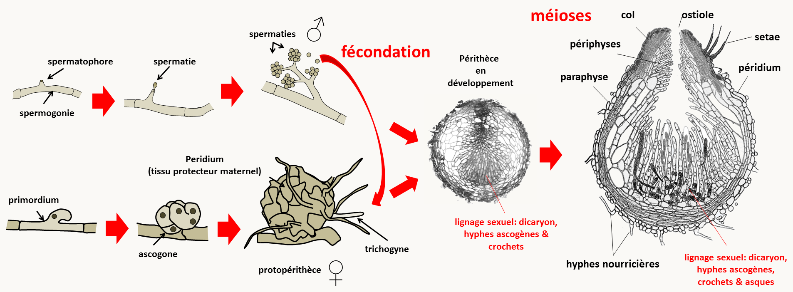
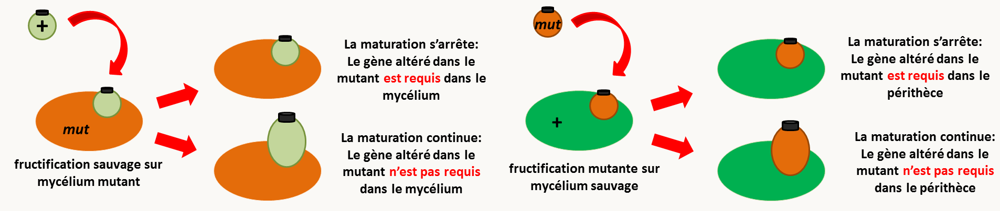
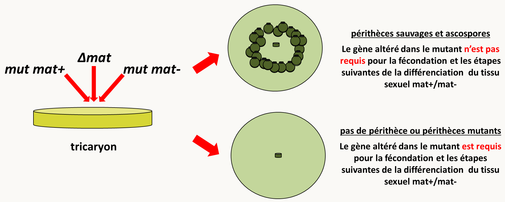
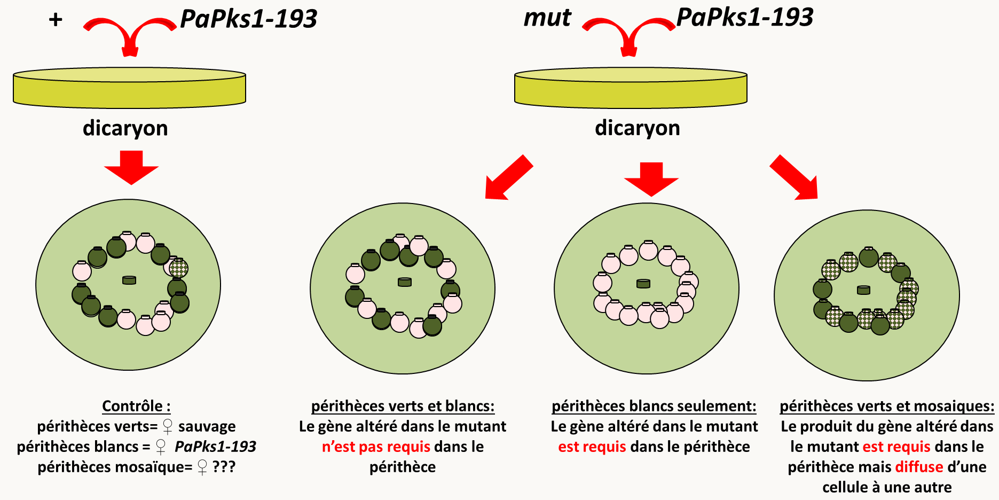

# Chapitre 7: L'analyse phénotypique

Le phénotype est l'ensemble des caractéristiques, morphologiques, physiologiques, métaboliques, développementales, comportementales etc... d'un individu. La présence de modifications du phénotype par les mutations permet d'avoir des indications sur le rôle des gènes dans la physiologie et le développement cellulaire ou des organismes. En effet, un gène code une protéine ou un ARN qui effectue à son tour une action physiologique:

- Une protéine de structure participe à la mise en place de structures intra-nucléaires (histones...), cellulaires (actine, myosine, tubuline, protéines membranaires...) ou extracellulaires (collagènes, élastines...)
- Un enzyme catalyse une ou plusieurs réactions
- Une protéine régulatrice (activateur ou répresseur de transcription, traduction...) influe sur le niveau d’expression d’autres gènes. Elle peut agir seule ou faire partie d'un complexe multipeptidique (ribosome, splicesome, protéasome...)
- si c'est un ARN il peut jouer un rôle structural et ou catalytique (par exemple dans le ribosome) ou régulateur (ARN antisens...)

Le produit du gène participe à l'élaboration du phénotype, qui est le résultat visible de l'action de toutes les protéines et de tous les ARN actifs, présents à un moment donné de la vie de l'organisme ou de la cellule. Nous avons vu que les effets des mutations sur le phénotype va dépendre de leur nature mais aussi des produits qu'elles altèrent. Réciproquement, une analyse fine des phénotypes permet d'obtenir des informations sur la nature de la mutation mais aussi éventuellement sur le type de produits codé par le gène qu'elle perturbe.

## Pléiotropie ou mutations multiples?

Nous avons vu au chapitre 1 qu'il existe des mutations dites **pléiotropes** qui peuvent entraîner des phénotypes multiples. L'analyse de la ségrégation permet souvent de savoir si des altérations phénotypiques multiples sont bien dues à la présence d'une seule mutation, car dans ce cas toutes les différences phénotypiques vont co-ségréger ensembles au cours des générations. Néanmoins, même s'il y a co-ségrégation de toutes les différences phénotypiques et donc une seule mutation, il est possible que plusieurs gènes soient en jeu. C'est par exemple le cas si la mutation est une délétion qui englobe plusieurs gènes voisins. C'est aussi le cas, si la mutation modifie la structure de la chromatine et perturbe l'expression de plusieurs gènes voisins.

Si la mutation n’affecte qu’un seul gène il faut se demander si celui-ci donne naissance à une seule protéine ayant plusieurs fonctions ou à plusieurs protéines ayant des fonctions différentes (par exemple par épissage alternatif). S'il n'y a qu'une seule protéine affectée et que le phénotype est complexe on dit alors qu'il est pléiotrope, c’est-à-dire que la mutation d'un seul gène donne plusieurs phénotypes mutants. On en conclut que le produit du gène intervient dans un processus affectant plusieurs aspects de la physiologie comme la signalisation, une voie métabolique centrale, la transcription, la traduction, la dégradation des protéines, etc.

## Base physiologiques de la dominance et de la récessivité

La récessivité ou la dominance d'une mutation est une indication importante quant à la nature de la mutation et par ricochet quant à la fonction du gène altéré. En effet, on s'attend à ce qu'une mutation récessive soit plutôt une perte de fonction puisque la présence de l'allèle sauvage permet de la compenser. Au contraire, une mutation dominante serait plutôt un gain de fonction puisque la présence du produit sauvage ne permet pas d'éliminer son effet. Néanmoins, si le dosage du produit du gène muté est important, une perte de fonction de ce produit peut avoir un effet dominant ou le plus souvent semi-dominant, si dans l'hétérozygote mutant/sauvage, il n'y a pas assez de produit pour assurer une activité sauvage. On dit alors que ces allèles sont  **haplo-insuffisants**. Nous avons vu dans le chapitre 1 quelques définitions concernant l'effet des allèles sur le fonctionnement des gènes. En revoici une liste exhaustive:

- **Allèles perte-de-fonction**
  - **Allèle amorphe ou nul** : correspond à une mutation qui abolit complètement la fonction du produit du gène ; celui-ci est totalement inactif ou absent.
  - **Allèle hypomorphe** appelé aussi "**leaky**" : le produit du gène est synthétisé et il a la même fonction que le produit sauvage, mais la mutation fait que, soit il est en quantité plus faible, soit il est moins actif.

- **Allèles gain-de-fonction**
  - **Allèle hypermorphe** : le produit est fonctionnellement équivalent au produit sauvage mais il est fait présent en plus grande quantité.
  - **Allèle néomorphe** : le produit est fonctionnellement différent du sauvage ou bien il est équivalent au produit sauvage mais délivré au mauvais moment ou au mauvais endroit.
  - **Allèle antimorphe** ou **dominant négatif**: le produit fabriqué à partir de l'allèle mutant possède une activité antagoniste de celle du produit sauvage.

### Comment savoir à quel type d'allèle on a affaire?

La réaction du phénotype devant un nombre croissant de copies du gène muté permet de distinguer entre différents types d'allèles:

- Pour un allèle amorphe, l'addition de copies supplémentaires du gène muté n'a aucun effet supplémentaire sur le phénotype
- Par contre pour un allèle hypomorphe, qui conserve une fraction de la fonction sauvage, on se rapprochera du phénotype sauvage en multipliant le nombre de copies
- Pour un allèle hypermorphe, on observera à l’inverse une accentuation du phénotype mutant si le nombre de copie augmente

De même la modulation du nombre d'allèles sauvage en présence d'allèles mutants permet de différencier certains allèles dominants

- Pour un allèle néomorphe, qui a une fonction nouvelle, l'addition de copies du gène sauvage ne change rien au phénotype mutant.
- Au contraire, un allèle antimorphe sera titré par l'addition de copies sauvage, ce qui atténuera le phénotype mutant. De plus, le phénotype d'un allèle antimorphe sera aggravé en présence d'une délétion du gène sauvage.

la table suivante résume les phénotypes obtenus dans différentes combinaisons alléliques pour les différents types d'allèles:

| Allèle      | Type de mutation                                             | m/m                          | m/+                                   | m/délétion                                        |
| ----------- | ------------------------------------------------------------ | ---------------------------- | ------------------------------------- | ------------------------------------------------- |
| amorphe     | perte de fonction totale (récessive ou semi-dominant*)       | mutant (0 dose)              | sauvage ou intermédiaire* (1 dose)    | mutant ou intermédiaire* (0 dose)                 |
| hypomorphe  | perte de fonction partielle (récessive)                      | mutant (2 fractions de dose) | sauvage (1 dose + 1 fraction de dose) | mutant plus fort (1 fraction de dose)             |
| hypermorphe | gain de fonction davantage de produit (dominante)            | mutant (>>2 doses)           | mutant plus faible (> 2 doses)        | mutant plus faible ou tend vers sauvage (>1 dose) |
| néomorphe   | gain d'une nouvelle fonction (dominante)                     | mutant ou double mutant**    | mutant                                | mutant (double mutant)**                          |
| antimorphe  | gain de fonction antagoniste à la fonction sauvage (dominante) | mutant                       | mutant plus faible                    | mutant                                            |
(*) cas d'haplo-insuffisance.
(**) éventuellement double mutant d’une part à cause de l’absence du produit sauvage (si elle a un phénotype), d’autre part à cause de l’apparition d'une nouvelle fonction et du phénotype qui lui est associé.

Les mutants du gène White-spotting chez la souris permet d’illustrer la variété des allèles de nature différente que l’on peut obtenir pour un seul gène. On connaît en effet de très nombreux allèles affectant ce locus.

- A l'état hétérozygote, tous provoquent des taches blanches sur le pelage. Ils sont donc dominants. Certains allèles présentent à l'état hétérozygote un phénotype supplémentaire, une anémie par manque de globules rouges. Ils sont donc aussi dominants pour l’anémie. Par contre, d’autres allèles sont récessifs pour ce phénotype d'anémie.

- A l'état homozygote, on voit clairement que les différents allèles ont un effet spécifique et variable. Certains confèrent une létalité pendant le développement fœtal. Si on autopsie les fœtus, on constate que le décès a lieu à cause d'une anémie sévère. A ce stade, le développement du pelage n'est pas encore fait donc on ne peut donc pas savoir quelle aurait été la couleur du pelage chez ces embryons avortés. Chez les homozygotes viables, on voit que les taches blanches du pelage sont plus étendues que chez l'hétérozygote: parfois le pelage est complètement blanc, parfois non. Toutefois, l'intensité du phénotype est gradué de la même façon si on compare les hétérozygotes et les homozygotes.

- Pour certains homozygotes viables on voit apparaître un troisième phénotype: un défaut de fertilité. Les allèles concernés sont toujours récessifs.

On a donc affaire à un locus dont les allèles donnent un phénotype pléiotrope c'est-à-dire que les mutations dans ce gène affectent plusieurs fonctions (couleur du pelage, différentiation des cellules sanguine et différentiation de la lignée germinale) qui à première vue n'ont rien à voir entre elles. Il faut donc trouver une explication: on a affaire à un seul gène, de nombreuses études l'ont montré, et il faut donc trouver pour le produit du gène une fonction qui permette de rendre compte des trois effets. Pour cela il faut commencer par examiner le plus finement possible les phénotypes. On va mettre en œuvre différents niveaux d'analyse du phénotype:

- observation macroscopique: mesure de la superficie des taches blanches et mesure du nombre de descendants
- autopsie des fœtus et évaluation de la cause de la mort
- examen des organes chez les mutants viables: examen sanguin, examen des cellules de la peau et dissection des gonades ;

On observe ainsi que dans les trois phénotypes c'est le nombre de cellules spécialisées impliquées dans la production des phénotypes qui est affecté:

- peu ou pas de mélanocytes chez les mutants. La synthèse des pigments du pelage est donc diminuée, non par manque d'un des enzymes impliqués dans la biosynthèse des mélanines  mais par manque des cellules dans lesquelles s'expriment les gènes codant pour les enzymes de biosynthèse des pigments
- peu ou pas d'érythrocytes d'où l'anémie
- peu ou pas de cellules germinales d'où la stérilité

De ces analyses phénotypiques fines ont en conclut que la protéine codée par White-spotting interviendrait dans la prolifération, la différenciation ou la migration des cellules souches de ces différentes lignées cellulaires. L'étape suivante de l'identification par clonage du gène White-spotting a montré qu'il codait pour une protéine de 975 acides aminés ayant les propriétés d'un récepteur transmembranaire à tyrosine kinase (RTK). Ce récepteur, qui agit en dimère, reçoit un signal venant de l'environnement ou de cellules voisines, sous la forme d’un ligand qui se fixe sur son domaine extracellulaire. La fixation du ligand entraîne l’activation du récepteur, qui se traduit par la phosphorylation de certains de ses résidus tyrosine qui pourront à leur tour activer une autre protéine par phosphorylation. la disponibilité de la séquence a permis de caractériser la nature moléculaire de plusieurs allèles, ce qui est résumé dans la table suivante:

### Description phénotypique des allèles

| allèle | nature                              | hétérozygotes Wx/+              | homozygotes Wx/Wx                               |
| ------ | ----------------------------------- | ------------------------------- | ----------------------------------------------- |
| W19H   | délétion totale                     | grosses taches blanches         | létal après 12 jours in utero par anémie sévère |
| W37    | faux-sens 582 E-K                   | grosses taches blanches         | létal après 12 jours in utero par anémie sévère |
| W      | délétion de 78 aa  codon 513-590 | taches blanches                 | létal après 12 jours in utero par anémie sévère |
| W42    | faux-sens 790 D-N                   | tout blanc, anémie              | létal après 12 jours in utero par anémie sévère |
| W44    | faible expression                   | petites taches blanches         | blanc à 85%, fertilité réduite                  |
| W41    | faux-sens 831 V-M                   | petites taches blanches, anémie | blanc à 85%, anémie                             |

La disponibilité de la nature moléculaire des différents allèles permet maintenant de mieux comprendre comment agissent les mutations:

- L'allèle W19H est une délétion du gène White-spotting. Il s'agit donc d'un allèle nul. L'hétérozygote ne produit qu'une dose de protéine sauvage. Il est haplo-insuffisant pour la prolifération des mélanocytes ce qui affecte donc la couleur du pelage. Mais, il est récessif pour l’hématopoïèse et le développement des cellules germinales. Il s’ensuit qu’une dose de protéine est suffisante pour assurer le développement des cellules érythroïdes et germinales mais pas celui des mélanocytes. L'absence totale de produit est létale par anémie à 12 jours de gestation. Le produit du gène White-spotting est donc essentiel à la vie des souris.

- L'allèle W37 se comporte exactement comme W19H. La mutation faux-sens en position 582 qui change un acide glutamique en lysine est une mutation nulle. La protéine est présente mais totalement inactive. Par dosage de l'activité d'autophosphorylation à partir d'ATP marqué, on montre en effet que cette réaction n'a plus lieu chez le mutant. Ce faux-sens touche donc un acide aminé essentiel dans l'activité d'autophosphorylation qui précède le transfert du phosphate sur une protéine substrat.

- L'allèle W contient comme W19H une mutation nulle. Des expériences de localisation de la protéine tronquée montrent qu'elle n'est plus présente à la surface des cellules. De fait,  la délétion de 78 aa affecte un des domaines transmembranaires abolissant l'ancrage de la protéine dans la membrane.

- L'allèle W42 est intrigant car il montre à l'état hétérozygote un phénotype plus fort (un pelage entièrement blanc et une anémie) que l'allèle nul de référence! Il est donc aussi dominant pour l'hématopoièse. L'analyse de l'activité protéique montre que le faux-sens en position 790 qui change un acide aspartique en asparagine abolit l'activité d'autophosphorylation. Mais la protéine mutante est présente et sa présence diminue donc probablement l'activité de la protéine sauvage. Il s'agit d'un allèle dominant négatif ou antimorphe. On sait que la protéine codée par White spotting agit sous forme dimérique : un monomère mutant peut donc s'associer avec un monomère sauvage pour donner un dimère inactif.

- L'allèle W44 est perturbé dans son expression: le taux de transcrit est de 20% du sauvage environ. Le phénotype est plus léger que chez l'allèle nul. Il s'agit donc d'un allèle hypomorphe.

- L'allèle W41 se comporte à l'état hétérozygote comme l'allèle W42, son phénotype est plus accentué que chez l'allèle nul, il doit donc y avoir là aussi interférence avec l'allèle sauvage. *In vitro* la protéine mutante a une activité d'autophosphorylation diminuée mais pas nulle. Ceci expliquerait que les individus homozygotes soient viables, bien qu'anémiés. Cependant l’interaction des monomères mutants avec les monomères sauvages dans les hétérozygotes n'aboutit qu'à une diminution partielle de l'activité. W41 est donc un allèle antimorphe ayant une perte de fonction partielle.

En conclusion, les mutants de White-spotting offre un bel exemple de ce que l'on peut tirer de l'analyse de la complexité des phénotypes et des renseignements qu'on peut en tirer en conjonction avec une analyse moléculaire, biochimique et cytologique. Beaucoup de travail, venant de nombreuses équipes de chercheurs, ont été nécessaires pour faire d'abord l'analyse génétique chez la souris, puis la corrélation avec d'autres mammifères (chat, humain, cheval...). Ces analyses génétiques ont été suivies par des analyses moléculaires et biochimiques, puis avec un raccord avec les études sur le cancer. En effet, certaines tumeurs chez les mammifères comme des sarcomes chez le chat sont dues à une dérégulation du gène White-spotting dans les cellules somatiques.  On peut d’ailleurs remarquer que parmi tous les allèles du gène Whire-spotting,  les généticiens n’en ont isolé aucun qui correspondrait à un allèle hypermorphe, où le récepteur serait constitutivement activé. Ce peut être le cas s'il n'y a plus besoin de ligand pour déclencher la phosphorylation. On peut alors faire l’hypothèse que les allèles hypermorphes sont létaux à l’état hétérozygote, dès le stade embryonnaire précoce. Ceci est compatible avec l'observation que des mutations somatiques équivalentes provoquant une surexpression non régulée de la protéine ont un effet dévastateur car entraînant une prolifération cellulaire. Dans un embryon en cours de développement, l'effet d'une prolifération cellulaire anarchique est bien évidemment catastrophique.

Dans le même ordre d'idées que l'analyse fine de la dominance/récessivité des mutations, je vous rappelle que la présence d'exceptions à la complémentation (c'est à dire la complémentation interallélique et la non-complémentation intergénique) permet d'avoir quelques informations sur les rôles et la structure des produits codés par les gènes mutés: protéines ayant plusieurs fonctions, protéines homo-polymériques ou protéines hétéro-polymériques  (voir la section  sur les limites du test de complémentation dans le chapitre 4).

### Autonomie cellulaire de l’expression d’un gène

L'analyse phénotypique fine de mutants permet aussi d'avoir des informations sur le lieu d'action des gènes. En particulier, nous avons vu dans la section sur les crossing-over mitotiques du Chapitre 6 qu'il existe des gènes dits **autonomes cellulaires** dont les produits qu'ils codent ne diffusent pas à l'extérieur de la cellule et des gènes dits **non autonomes cellulaires** pour lesquels les produits qu'ils codent diffusent à l'extérieur de la cellule. Il existe des techniques simples qui permettent de déterminer le mode de fonctionnement des gènes et le lieu d'action des produits qu'ils codent.

Nous prendrons l'exemple du développement du périthèce chez *Podospora anserina* (figure133). Pour rappel, le périthèce est la fructification de cette espèce de champignon dans laquelle a lieu la reproduction sexuée.

Chez cette espèce, dont le cycle ressemble fortement à celui de *Neurospora crassa* (voir Introduction Générale),  Les deux types sexuels sont appelés *mat+* et *mat-*. Comme chez *Neurospora crassa*, le périthèce résulte de la fécondation d'un gamète femelle (l'ascogone protégé par un péridium pluricellulaire dont l'origine provient du mycélium qui l'entoure) par un gamète mâle (ou spermatie). Trois partenaires sont impliqués dans son développement:

- Le tissu sexuel qui résulte de la fécondation de l'ascogone par une spermatie de type sexuel opposé
- Le tissu maternel protecteur ou nourricier: péridium, paraphyse, périphyse et autres cellules d'origine maternelle
- Le mycélium sous-jacent contenant les réserves énergétiques et qui nourrit la fructification en développement

De nombreux mutants affectant le développement de ce champignon sont disponibles. Comment savoir si les produits des gènes qu'ils codent sont importants dans le mycélium, le tissu maternel ou le tissu sexuel? Comment savoir si les produits qu'ils codent sont diffusibles?

Trois expériences simples d'analyses phénotypiques fines des mutants ont été développées pour répondre à ces questions. La première consiste dans la greffe de périthèce (figure 134).

La greffe d'un périthèce sauvage (c'est à dire issu d'un croisement sauvage x sauvage) sur du mycélium sauvage est très efficace car plus de 90% des périthèces greffés continuent leur développement sans accroc. Il est aussi possible de les greffer sur du mycélium mutant. Si le périthèce sauvage continue son développement dans les mêmes proportions que sur du mycélium sauvage, c'est que le produit du gène mutant n'est pas essentiel dans le mycélium, dans le cas contraire, il l'est. Si le mutant produit des périthèces (qui arrêtent leur développement), la greffe de ces périthèces sur du mycélium sauvage permet de savoir si le produit du gène est important dans le périthèce, auquel cas les périthèces ne continuent pas leur développement, ou non, auquel cas ils continuent leur maturation. Notez que dans le cas de la greffe de périthèces mutants sur du mycélium sauvage, si le produit du gène affecté n'est pas à expression autonomes cellulaires, il peut diffuser du mycélium dans le périthèce et venir masquer le fait que le produit du gène est nécessaire dans la fructification.

La deuxième analyse consiste en la construction d'une mosaïque génétique du mutant avec *Δmat*, une souche pour laquelle le type sexuel a été délété (figure 135). Une souche délétée du type sexuel ne peut pas engager la reproduction sexuée car elle ne peut pas reconnaître un partenaire sexuel compatible. Par contre, elle produit des gamètes mâles et femelles (inactifs donc) et surtout tous les tissus maternels requis pour le développement du périthèce.

Les mosaïques avec la souche *Δmat* permettent donc de savoir si  un gène est important pour la fécondation et le développement du tissu sexuel ou non. En effet, la mosaïque, qui est un tricaryon fabriqué en mélangeant la souche *Δmat* avec les souches mutantes *mat+* et *mat-*, ne produira des périthèces que si le gène n'est pas requis pour la fécondation et les étapes suivantes du développement du tissu sexuel. En effet, dans ce cas, la souche *Δmat* peut fournir (complémenter) les tissus maternels déficients dans le mutant. Au contraire, si c'est la fécondation et/ou le tissu sexuel qui sont affectés dans le mutant alors, la souche *Δmat* ne peut pas suppléée à cette déficience.

La troisième analyse consiste en la construction d'une mosaïque du mutant avec une souche *PaPks1-193* de type sexuel opposé. Le gène *PaPsk1* code pour un enzyme catalysant la première étape de la synthèse de mélanine chez *Podospora anserina*. La mutation *PaPks1-193* abolit la synthèse de pigment et entraîne donc une dépigmentation du mycélium, des fructifications et des ascospores. Ce gène est à expression autonome cellulaire. Cela se voit facilement car dans un croisement sauvage x *PaPks1-193* les ascospores d'un même asque portant l'allèle sauvage sont noires et celles portant *PaPks1-193* sont blanches. De même,  si on fabrique un hétérocaryon sauvage/*PaPks1-193*, celui-ci va produire un mélange de périthèces complètement blancs ou complètement verts, avec cependant quelques rares périthèces mosaïques ayant une partie de leur péridium blanche et une autre partie verte. Cela confirme que PaPks1 est à expression autonome cellulaire et montre aussi que le nombre de cellules qui initient le péridium est faible puisque la probabilité qu'il y ait des cellules sauvages et de cellules *PaPks1-193*  à l'origine d'un périthèce est faible.

Les mosaïques fabriquées avec un mutant stérile et *PaPks1-193* peuvent présenter plusieurs types de fructifications. Soit, comme avec la souche sauvage, on observe des périthèces blancs et des périthèces verts, indiquant que le gène muté n'est pas requis dans le périthèce. Soit on observe uniquement des périthèces blanc indiquant que le gène est requis dans le périthèce et que  son produit ne diffuse pas. Soit on voit un mélange de périthèces verts et de périthèces mosaïques en quantité beaucoup plus importante que dans une mosaïque avec la souche sauvage, indiquant alors que le produit du gène est essentiel dans le périthèce mais qu'il diffuse car quelques cellules sauvages présentes dans le péridium suffisent pour une maturation correcte de la fructification.

Ces méthodes ne sont pas circonscrites à l'analyse du développement de la fructification chez *Podospora anserina*. En effet, greffes et mosaïques génétiques sont fréquemment utilisées aussi chez les animaux et les plantes pour analyser leur développement.
