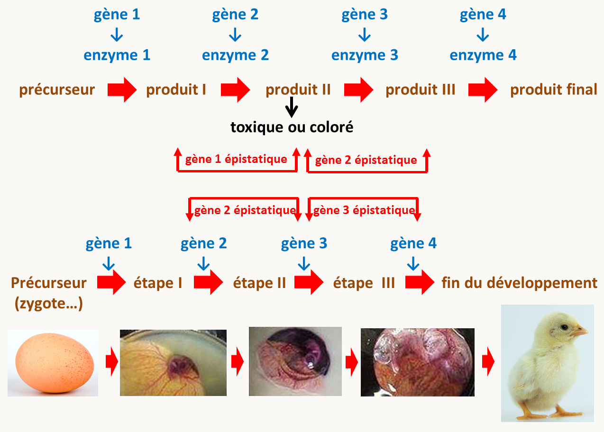
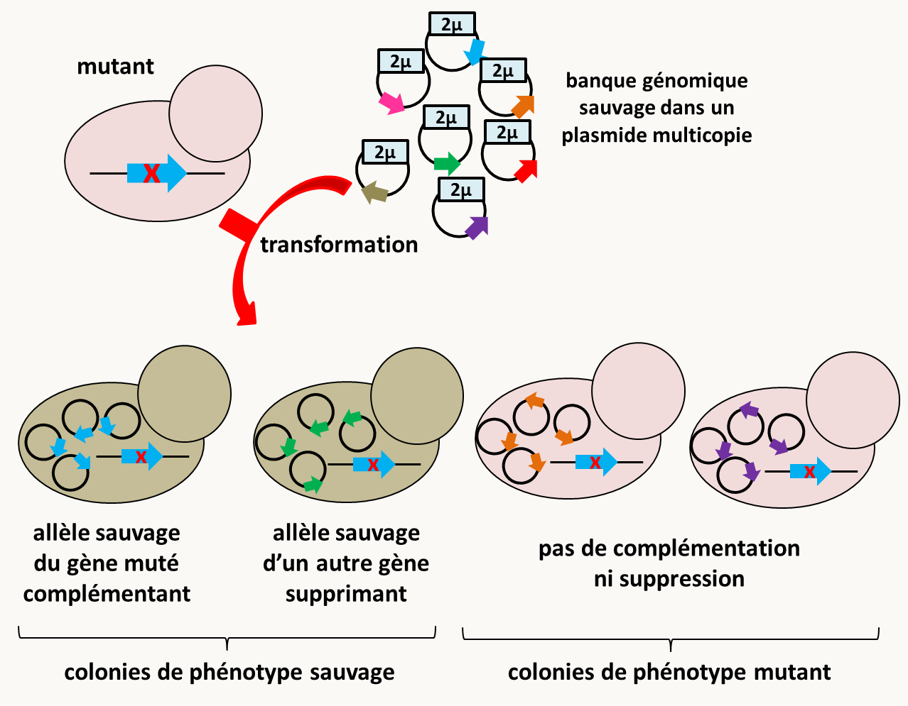
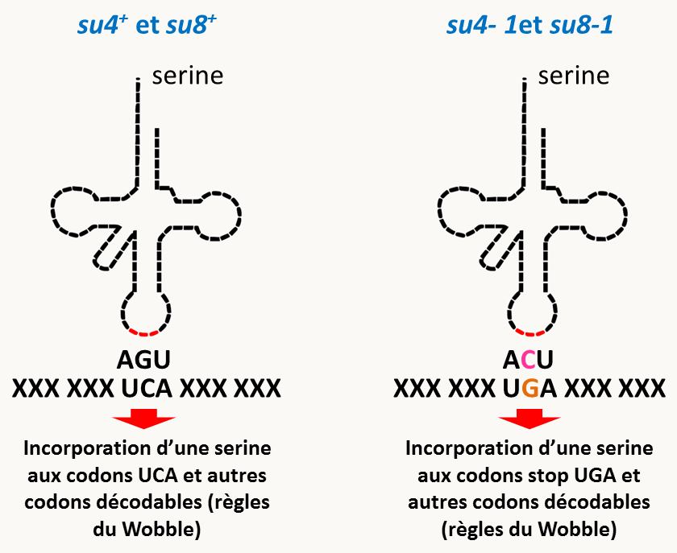
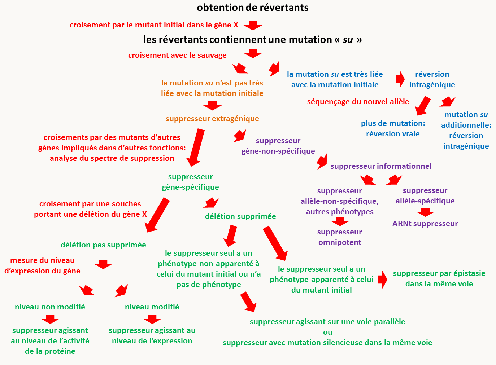

# Chapitre 8 : Les interactions géniques

Afin de déterminer les implications des gènes dans les divers processus du vivant, nous avons vu dans les chapitres 3 à 7 que les mutagenèses, qu'elles soient directes ou inverses, fournissent des mutants qui vont pouvoir être analysés à l'aide de techniques multiples, dont nous avons détaillés quelques exemples. Toutefois, si les informations obtenues par les méthodes décrites précédemment sont importantes, elles ne concernent principalement que les gènes pris isolément. Or, dans la physiologie cellulaire, les gènes agissent souvent de concert au sein de voies métaboliques ou de régulation pour effectuer leurs fonctions. De fait, nous avons vu au Chapitre 4, que l'analyse de la complémentation, en particulier lorsque il y a des exceptions au principe général, permet de suggérer des interactions entre les produits codés par plusieurs gènes. L'analyse des interactions entre mutations permet effectivement donc d'acquérir des informations supplémentaires par rapport à l'analyse des mutants isolément.

La méthodologie générale consiste à construire des doubles mutants (avec des mutations à l'état homozygote dans le cas de mutations récessives) et à observer leurs phénotypes. Formellement, il existe trois types d'interactions possibles:

- les deux mutations ne montrent pas d'interaction et le double mutant présente les phénotypes additionnés des deux mutations.
- les deux mutations ont des effets antagonistes. Le double mutant peut ne présenter par exemple que le phénotype d'une seule des deux mutations: on parle alors d'un effet **épistatique**. Le double mutant peut aussi présenter un phénotype plus proche de celui du sauvage, voire le phénotype sauvage : on parle alors d'effet **suppresseur**.
- les deux mutations voient leurs effets amplifiés de manière coopérative ou synergique, si bien que le double mutant présente un phénotype fortement aggravé par rapport à ce qui est attendu par la simple addition des mutations: on parle alors d'effet **accentuateur**.

Nous allons voir successivement chacun de ces types d'effets et ce que leur présence indique quant à la fonction des gènes.

## L’épistasie

Définition:  Une mutation est dite **épistatique** sur une autre mutation si le double mutant ne présente que le phénotype de cette mutation, alors que celui de l'autre est masqué. La mutation dont le phénotype est masqué est dite **hypostatique**. Comme pour la dominance/récessivité, il s'agit d'une sorte de relation de domination, mais:

- les relations de dominance/récessivité concernent les allèles d'un même gène
- l'épistasie/hypostasie concernent des allèles de gènes différents

Par extension, on dit qu'un gène est épistatique sur un autre (qui sera alors hypostatique) si les mutations de ce gène sont épistatiques sur celles affectant le gène hypostatique.

Des effets d'épistasie vont souvent se produire dans le cas où les mutations affectent des gènes qui participent à une même voie de biosynthèse, une même voie de régulation/signalisation ou un même processus développemental. Nous allons voir que l'interprétation des données d'épistasie n'est pas toujours simple. En effet, prenons comme premier exemple une voie de biosynthèse linaire d'un produit pour lequel un des intermédiaires est toxique ou coloré (figure 137). Les mutants dans ce gène seront létaux (ou pigmentés). Les doubles mutants possédant cette mutation létale ou pigmentant et une autre mutation située en amont dans la chaîne de biosynthèse seront viables ou incolore, puisque le produit toxique ou coloré ne sera pas fabriqué. Le gène agissant en amont est donc épistatique sur celui en aval. De même, les doubles mutants possédant cette mutation létale ou pigmentant et une autre mutation située en aval dans la chaîne de biosynthèse seront létaux ou colorés, puisque le produit est fabriqué dans ce type de doubles-mutants. Une fois encore c'est le gène situé en amont qui est épistatique. Le même raisonnement s'applique dans le cas d'une voie de développement linéaire (figure 137): c'est le gène contrôlant l'étape la plus en amont qui sera épistatique sur les gènes situés plus en aval.

Maintenant si on regarde ce qu'il se passe dans une voie de signalisation ou de régulation linéaire comportant des activateurs et des répresseurs (figure 138); on voit que les gènes épistatiques sont ceux qui sont en aval lorsque l'épistasie est testée entre un activateur et un répresseur. Pour voir ceci, raisonnons à partir des mutations perte-de-fonction qui sont les plus fréquentes.

- Si la régulation est positive, c'est à dire que le partenaire situé en amont active celui situé en aval, une mutation nulle dans le gène amont entraîne une absence de réponse au signal comme c’est normalement le cas chez le sauvage.

- Si la régulation est négative,  c'est à dire que le partenaire situé en amont réprime celui situé en aval, une mutation nulle dans le  gène amont codant donc un répresseur entraîne que la partie de la voie de signalisation située en dessous est active en l’absence de signal : on dit que l'expression de la voie est **constitutive**.

On voit maintenant facilement que:

- un double mutant affecté pour un répresseur et un activateur situé en amont de celui-ci aura une activation constitutive de la partie de la voie située en aval du répresseur.
- un double mutant affecté pour un répresseur et un activateur situé en aval de celui-ci n'aura pas d'activation de la voie. En effet, le signal constitutif d'activation de la voie sera arrêté par l'absence de l'activateur situé en dessous.

En conclusion dans les deux cas, c'est le gène situé en aval qui est épistatique. Au contraire, si les deux mutations affectent deux activateurs (comme par exemple, le récepteur et l'activateur le plus en aval de la figure 138), la voie se comportera comme dans le mutant de l'activateur le plus en amont. Toute la partie située en dessous de l'activateur le plus en amont sera inactive et donc ce sera cette fois le gène le plus en amont qui sera épistatique. C'est aussi le cas si les deux mutations affectent deux répresseurs car la partie située en aval du premier répresseur sera constitutivement active. Notez que généralement, les mutations dans les gènes codant les activateurs d'une voie de signalisation linéaire auront tous le même phénotype et il est donc pas possible d'observer une épistasie. Il en va de même avec les répresseurs.

Dans le cas de voies branchées les résultats peuvent être plus complexes (figure 139).

![épistasie dans une voie de biosynthèse branchée et complexe. Dans cette voie, deux précurseurs produisent deux pigments (ici un jaune, le pigment 1, et un bleu, le pigment 2) via deux voies linéaires. Les mutants dans les gènes de biosynthèse du pigment 1 sont donc bleus et ceux dans les gènes de biosynthèse du pigment 2 sont jaunes, alors que le sauvage sera vert. Il y a en plus des gènes codant pour des enzymes impliqués dans le dépôt correct des pigments; leurs mutants seront blancs car les pigments ne seront pas correctement déposés. On voit clairement que dès qu'un des gènes impliqués dans le dépôt des pigments est muté, la souche sera blanche, peu importe le(s) pigment(s) fabriqué(s). Ces gènes sont donc épistatiques sur les gènes de fabrication des pigments 1 et 2, bien qu'ils agissent en aval.](img/image139.png)

On voit donc qu’il est nécessaire de connaître assez précisément la nature des processus biologiques en cause pour pouvoir interpréter correctement les relations d’épistasie. C'est particulièrement vrai si les voies sont branchées ou complexes. Néanmoins, l'obtention de données d'épistasie permet de formuler des hypothèse quant aux relations entre gènes, en particulier dans leur ordre d'intervention dans une voie de biosynthèse, développement et particulièrement de signalisation ou régulation.

### Comment ordonner deux gènes impliqués dans une voie de signalisation?

L'épistasie est d'un grand intérêt pour ordonner les gènes dans des voies de signalisation ou de régulation pouvant mettre en jeu, en cascade, de nombreux gènes. Pour ceci, il faut évaluer les relations d'épistasie sur les gènes deux par deux. Ceci nécessite de posséder des mutants affectés dans les deux gènes et ayant des phénotypes différents, car bien évidemment si les phénotypes conférés sont identiques, il n'est pas possible de voir si l'un masque l'autre...

Il faut dans un premier temps créer un double mutant, par croisement. Si les mutations sont dominantes il suffit que les mutations soient présentes même à l’état hétérozygote dans le même organisme. Si les mutations sont récessives, il faut alors créer un double mutant homozygote pour les deux mutations.

On observe ensuite le phénotype du double mutant: la mutation épistatique est celle dont le phénotype l'emporte. Pour interpréter les résultats sans risque de se tromper, il faut prendre quelques précautions:

- Il faut que les deux gènes interviennent bien sur la même voie et non sur deux voies parallèles. Dans ce dernier cas on le saura rapidement, car le phénotype du double mutant n'est pas celui de l'un ou de l'autre mais au minimum une addition des deux phénotypes.
- les deux gènes doivent être complètement inactifs chez les deux simples mutants si ceux-ci ont  des pertes de fonction. En effet, l'interprétation peut être difficile dans le cas de mutants hypomorphes (voir la section sur  les effets accentuateurs).
- Il faut que le signal et les deux gènes étudiés soient les seuls déterminants du phénotype dans l'expérience: tous les autres gènes sont donc supposés fonctionner de façon sauvage chez les simples et doubles mutants.

Si ces critères sont observés, on peut alors en déduire:

- Si les deux phénotypes observés chez les deux simples mutants sont de même type - tous les deux ont une voie inactive ou tous les deux ont une voie constitutives - alors la mutation épistatique est dans le gène amont. Si les deux phénotypes observés chez les simples mutants sont l'un inactif l'autre constitutif, alors la mutation épistatique se trouve dans le gène aval (voir la figure 138).

Cette règle peut s’exprimer aussi de la manière suivante, qui est équivalente :

- Si c'est le même état du signal qui révèle le phénotype mutant chez les deux simples mutants, la mutation épistatique se trouve dans le gène amont; si c'est un état opposé du signal elle se trouve dans le gène aval.

Pour illustrer cette méthode, voici un exemple d'analyse de relation d'épistasie utilisant *Saccharomyces cerevisiae*. Cette levure sait utiliser le saccharose comme source de carbone car elle possède une invertase qui hydrolyse ce sucre en glucose et fructose. Normalement, en présence de glucose ou de son analogue non métabolisable le 2-deoxyglucose, la synthèse d'invertase est réprimée: une souche sauvage est donc incapable de croître sur du milieu contenant du 2-déoxyglucose et du saccharose. Deux mutants haploïdes de régulation de la voie d'utilisation du saccharose comme source de carbone ont été isolés:

- Le mutant *snf1-* ne peut pas pousser sur du milieu avec du saccharose comme seule source de carbone (mais il pousse très bien sur glucose). Chez ce mutant le gène codant l'invertase est sauvage.
- Le mutant *cid1-* pousse en présence de saccharose + 2-déoxyglucose.

Dans le cas de la mutation *snf1-* on a une expression abolie de l'invertase. Au contraire, dans le mutant *cid1-* on a un phénotype constitutif. Les deux mutations étant récessives et donc des pertes de fonction, *snf1* code un activateur et *cid1* pour un répresseur.

L'analyse du double mutant *snf1- cid1-* montre qu'il a le même phénotype que le simple mutant *snf1-*. La mutation  *snf1-* est donc épistatique sur la mutation *cid1-*. Les deux phénotypes sont opposés chez les simples mutants, on en conclut que le gène agissant en aval est *snf1* et que donc *cid1* réprime directement ou indirectement l'activité de *snf1*.

### Les groupes d'épistasie

Lorsque l'on possède des mutants ayant un phénotype semblable, il est possible de les regrouper en groupes présentant entre eux des relations d'épistasie, indiquant que les gènes pour lesquels ils sont affectés agissent dans une même voie. Les différents groupes formés sont alors appelé **groupes d'épistasie**.

Par exemple,  la recherche de mutants sensibles aux rayons UV chez *Saccharomyces cerevisiae* a permis le criblage de 96 mutants indépendants, appelés mutants *rad*, comportant chacun une seule mutation récessive. Les mutants ont été croisés deux à deux pour tester la complémentation. Ceci a permis de regrouper les allèles dans 30 groupes de complémentation différents qui correspondent donc en première approximation à 30 gènes différents. Ces 30 gènes interviennent-ils tous dans le même processus de réparation, les uns à la suite des autres, ou bien y-a-t-il plusieurs manières de réparer?

Pour répondre à cette question, une analyse d'épistasie a été entreprise. Tous les doubles mutants possibles entre les allèles de gènes différents pris deux à deux ont donc été construits; néanmoins pour simplifier, un seul allèle par gène est testé, ce qui représente déjà 30 x 29= 870 double mutants! Pour ceci, les diploïdes sauvages construits pour le test de complémentation ont été mis à sporuler. Après méiose et ségrégation, un quart des spores est double mutante. Si les deux locus sont liés l'analyse est un peu plus compliquée car les doubles mutants, qui ne sont obtenus que par crossing-over, sont donc plus rares.

Ensuite, la sensibilité aux UV pour chaque simple mutant haploïde et pour tous les doubles mutants haploïdes a été évaluée:

- Si la sensibilité aux UV du double mutant était la même que celle de l'un des deux simples mutants, c'est qu'il y a une relation d'épistasie entre eux, donc qu'ils font partie de la même voie de réparation, dans laquelle ils interviennent séquentiellement.

- Si la sensibilité du double mutant est l'addition de celle des deux simples mutants c'est que les deux gènes interviennent dans des processus différents dont les effets sur le phénotype s'additionnent chez le double mutant.

En procédant ainsi systématiquement on est arrivé à classer les 30 gènes dans trois groupes d'épistasie différents, suggérant trois mécanismes indépendants de réparation des lésions UV. L'un d'eux en particulier, appelé groupe RAD3, regroupe des gènes dont les produits sont impliqués dans la réparation par excision de nucléotides après lésions créées par les radiations.

## La suppression

Le deuxième type de relation entre mutations concerne les effets antagonistes. Notez qu'une mutation épistatique peut avoir un effet antagoniste sur une autre rien qu'en masquant son phénotype. Néanmoins, il existe d'autres manières pour une mutation d'annuler le phénotype d'une autre. Généralement, l'antagonisme entre mutations n'est pas testé de manière dirigée comme dans le cas de l'épistasie, mais se constate, voire s'utilise, au cours d'expériences de mutagenèse. En effet, une technique classique de génétique consiste à sélectionner des mutations ayant des effets antagonistes d'une autre mutation dans un gène déjà bien caractérisé afin d'identifier d'autres gènes impliqués dans le même processus physiologique: on dit alors que l'on fait une recherche de **suppresseurs**.

Prenons un exemple chez mon champignon favori, *Podospora anserina*. Ce champignon produit des ascospores noires (en fait vertes très foncées) grâce à un dépôt de mélanine. Nous avons vu qu'il existe des mutants, dont le mutant *PaPks1-193* (voir section du Chapitre 7 sur l'Autonomie cellulaire de l’expression d’un gène), qui produisent des ascospores dépourvues des pigments (figure 140). D’abord découverts par hasard, puis activement recherchés, des mutants de la souche *PaPks1-193* retrouvant une couleur plus proches du sauvage (avec donc des ascospores vertes avec des pigmentations allant du vert clair au noir) ont été obtenus (figure 140). On appelle souvent ce type de souches qui possède une phénotype plus proche du sauvage que la souche mutante initiale des **révertants**. Que contiennent ces révertants? En particulier, la mutation *PaPks1-193* est-elle toujours présentes dans ces souches ayant des ascospores colorées?

Pour apporter une réponse, un premier croisement avec la souche  *PaPks1-193* doit être fait afin de voir s'il y a une deuxième mutation dans ces souches à pigmentation restaurée (figure 140). En effet, dans ce cas il y a une ségrégation 50% de spores blanche et 50% de spores colorées dans la descendance. C'est ce que qui est observé dans une majorité des souches ayant une pigmentation restaurée, indiquant que le retour de la pigmentation est bien lié à la présence <u>d'une deuxième mutation ayant un effet antagoniste</u> ou **suppresseur** de la mutation *PaPks1-193*.

Un deuxième croisement est réalisé entre les descendants révertants et la souche sauvage et dans la descendance deux types de ségrégation sont observés (figure 140):

- Dans le premier type, on constate la présence de 50% de spores noires et 50% de spores pigmentées (et donc 100% de spores noires si le retour à la pigmentation redonne un phénotype sauvage). Dans ce cas, on peut en conclure que la deuxième mutation est très proche de la mutation initiale *PaPks1-193* car elle ne recombine pas avec elle (auquel cas, nous devrions avoir des descendants ayant le phénotype blanc apporté par la mutation *PaPks1-193* seule). L'hypothèse la plus probable est qu'il s'agit d'une deuxième mutation dans le gène *PaPks1* qui annule ou modifie la première mutation. On parle alors de **réversion** ou **suppresseur intragénique**. L'hypothèse la plus logique, mais pas forcément la plus probable, est un retour dans le gène *PaPks1* à une séquence identique à celle de l'allèle sauvage: il s'agit alors d'une **réversion vraie**. Toutefois, en fonction du type de mutation, le retour à un phénotype sauvage n'implique pas forcément une réversion vraie, on parle alors simplement de réversion (parfois de réversion intragénique, ce qui est une redondance). En voici quelques exemples:
  - La mutation initiale est un faux-sens ou un non-sens et la réversion consiste en l'acquisition à l'endroit de la première mutation d'une seconde mutation dite **intra-codon** qui va permettre de coder pour un acide aminé compatible avec la fonction de la protéine.
  - La mutation initiale est un frameshift +1 (resp. -1) et la seconde mutation est un frameshift -1 (resp. +1) qui permet de restaurer la phase normale de décodage. La protéine ainsi obtenue aura une courte séquence située entre les deux frameshift qui ne sera pas celle de la protéine sauvage. Souvent, ce type de protéines est partiellement fonctionnel et leur production permet de restaurer  au moins en partie le phénotype sauvage.
  - Plus intéressant pour les biochimistes, la mutation initiale est un faux-sens dans un codon codant pour un acide aminé important pour la structuration et/ou le fonctionnement de la protéine. La mutation rend donc la protéine inactive et la seconde mutation a lieu dans un codon codant pour un acide aminé qui interagit avec l'acide aminé important et restaure la structuration et/ou la fonction de la protéine. Ce type d'analyse permet donc d'identifier de nouveaux acides aminés importants pour le fonctionnement de la protéine.

Notez qu'il n'est souvent pas possible de corriger par réversion une délétion, sauf s'il existe une copie (inactive) du gène dans un autre endroit du génome.

- Dans le deuxième type, des mutants ayant le phénotype de la souche portant *PaPks1-193* sont obtenus.  Il y a donc eu recombinaison entre la mutation *PaPks1-193* et la mutation antagoniste. L'hypothèse la plus probable est que la deuxième mutation s'est produite dans un gène autre que *PaPks1*. Ceci sera d'autant plus vrai si les descendant de type  *PaPks1-193* sont présents à la fréquence de 25% car dans ce cas, le gène *PaPks1* et celui portant la mutation antagoniste seront indépendants, possiblement sur un autre chromosome. Si le gène portant la mutation antagoniste est lié à *PaPks1*, les descendants de type  *PaPks1-193* seront présent avec une fréquence inférieure à 25%. Il même possible de calculer la distance qui sera égale à 2 x la fréquence de descendant de type *PaPks1-193* x 100 cM. Dans le cas où la deuxième mutation a lieu dans un autre gène que celui de la mutation initiale, on dit qu'il s'agit d'un **suppresseur extragénique** (et plus rarement de réversion fausse, terme que je n'aime pas bien). Notez que l'on ne sait rien a priori du phénotype de la mutation suppresseur seule. Celui-ci peut aller d'une absence de phénotype à un phénotype opposé à celui de la mutation originale, en passant par d'autres phénotypes plus imprévus. En effet, nous allons voir dans les sections suivantes les différentes modalités d'action de telles mutations suppresseurs, car elles peuvent être variés et inattendues.

En résumé, **il existe deux grands types de mutations qui permettent de restaurer un phénotype sauvage: les réversions qui vont se produire dans le même gène que celui portant la mutation initiale et les suppresseurs extragéniques qui vont se produire dans un autre gène**. Les réversions intragéniques permettent d’avoir des informations sur les relations structure-fonction à l’intérieur d’une protéine, mais elles ne permettent pas d’identifier de nouveaux gènes. Au contraire, les suppresseurs extragéniques ont été étudiés de façon plus extensive car ils sont des outils exceptionnels pour établir que des relations fonctionnelles existent entre deux protéines et donc pour décortiquer des voies métaboliques ou de signalisation. Donc une bonne part du travail du généticien qui étudie un gène et sa fonction consistera à isoler et à caractériser  (par les méthodes de la mutagenèse directe vue au chapitre 3) des suppresseurs extragéniques du phénotype des allèles mutants de son gène préféré, en particulier de la délétion de ce gène car alors les mutants identifiés seront essentiellement extragéniques! Nous allons donc détailler un peu plus la manière dont fonctionnent ces suppresseurs.

### Suppresseur par épistasie agissant sur la même voie

Nous avons vu que les mutations épistatiques masquent les effets d'autres mutations, et peuvent de ce fait conférer au double mutant un phénotype plus proche du sauvage que ne l'est celui du mutant contenant la mutation hypostatique. C'est particulièrement le cas si les mutations affectent des processus biologiques dont le contrôle fait intervenir des voies de signalisation c'est à dire protéines qui sont activées séquentiellement via des successions d'activateurs et répresseurs qui agissent en "cascade", pour aboutir finalement à l'activation ou l'extinction de l'expression de gènes cibles (voir section précédente sur l'épistasie).

Une mutation suppressive agira donc en altérant l’activité soit d’un répresseur soit d’un activateur de la voie à une étape différente de la première mutation. Ceci permet d’identifier et d’ordonner des partenaires agissant dans la même voie de régulation à des étapes différentes. On a alors une suppression qui est **gène-spécifique** et **allèle-non-spécifique**. Cependant, ils sont parfois **allèle-spécifique**. Cela veut dire que la mutation suppresseur n'agira que sur des mutations de certains gènes voire dans certains cas uniquement sur certains allèles particuliers de ce gène. Par exemple, une mutation nulle dans un répresseur sera corrigée par des mutations nulles d'activateurs que s'ils sont situés en dessous du répresseur dans la voie de signalisation. Par contre, les mêmes mutations nulles dans des activateurs ne corrigeront pas une mutation nulle d'un répresseur situé en dessous dans la voie de signalisation. De même, une mutation dominante constitutive dans un activateur sera corrigée par une mutation nulle affectant un activateur agissant en aval; ce suppresseur ne corrigera pas par contre une mutation nulle récessive affectant l’activateur amont. Notez que le fait que ce type de suppresseur peut agir sur des mutations nulles veut dire qu'ils sont capables de supprimer des délétions.

En conclusion, quand deux mutations causent des phénotypes opposés et que l’une supprime le phénotype de l’autre on parle de suppression par épistasie et le phénotype observé chez le double mutant (qui donc n’est pas sauvage mais souvent moins altéré que celui de la mutation hypostatique) est celui de la mutation épistatique.

#### Les suppresseurs multicopies

Un cas particulier de la suppression par épistasie est la suppression d'un phénotype mutant par surexpression d'un gène sauvage. Par exemple, chez *Saccharomyces cerevisiae*, une cellule haploïde de génotype MATa peut se conjuguer avec une cellule de génotype MATα pour former un diploïde MATa/MATα. Un tel diploïde est capable de sporuler en milieu carencé. Des mutants sont disponibles dans les gènes des types sexuels mata ou matα. A l'état hétérozygote (souches Mata- Matα ou Mata Matα-), ces diploïdes sont incapables de sporuler. On peut obtenir la suppression de ce phénotype mutant en transformant le diploïde mutant par un plasmide multicopie portant le gène *IME1* sauvage (inducteur de méiose). L'explication est la suivante: pour déclencher la méiose le complexe protéique a/α est requis pour activer le gène *IME1* qui à son tour active des gènes cibles spécifiques de la méiose. Si le gène sauvage *IME1* est présent en 25 ou 30 copies au lieu de deux, la transcription basale, même très faible, de *IME1* suffit pour pour accumuler suffisamment de protéine déclenchant ainsi la méiose.

La recherche de suppresseur de ce type, dits **suppresseurs multicopies**, est très simple chez les bactéries et les levures car il suffit de transformer la souche mutante par une banque d'ADN génomique de la souche sauvage construite dans un plasmide multicopie, comme le plasmide 2µ ou des plasmides possédant des séquences ARS pour les levures (figure 141). Les souches sélectionnées sont donc celles qui retrouvent un phénotype proche du sauvage. Outre celles qui portent l'allèle sauvage du gène mutant, ces souches porteront les gènes agissant en tant que suppresseurs multicopies. Ce type de mutagenèse a été utilisé extensivement chez *Saccharomyces cerevisiae* et *Schizosaccharomyces pombe* pour identifier des acteurs de nombreuses voies de signalisation et régulation.

### Suppresseur agissant au niveau de l’activité de la protéine

Si une première mutation diminue l’activité spécifique d’une protéine, une mutation suppressive pourra intervenir pour l’augmenter. Notez que les réversions intragéniques intéressant les biochimistes entrent dans cette catégorie. Mais on peut envisager un autre mécanisme si les deux mutations affectent deux protéines qui forment un complexe par des contacts protéine-protéine comme deux sous-unités d’un enzyme hétéro-dimérique codées par des gènes différents, ou bien deux polypeptides intervenant dans un complexe multi-protéique (figure 142). Une première mutation dans une des protéines change un acide aminé impliqué dans le contact avec la protéine partenaire et ce contact est détruit. Le complexe ne se forme pas correctement et il est donc inactif. Une seconde mutation suppresseur dans la protéine partenaire peut rétablir le contact. Ce genre de mécanisme de suppression fonctionnelle est très important pour mettre en évidence les partenaires fonctionnels d’une protéine et identifier les acides aminés mis en jeu. Notez que nous avons vu un cas ressemblant mais qui intéressent des allèles différents d'un même gène codant pour une protéine homo-multimérique dans le cadre de la complémentation intragénique.

De tels suppresseurs sont  bien évidemment **gène-spécifique** et **allèle-spécifique**. En effet, la restauration de l'activité du complexe ne peut se faire qu'entre monomères ayant des mutations bien spécifiques s'annulant l'une l'autre. Il est donc peu probable que ce type de suppresseur agisse sur une délétion. Notez que ce n'est pas impossible comme par exemple dans le cadre de complexe multimérique où une mutation suppresseur peut renforcer la stabilité d'un complexe qui redevient fonctionnel en absence d'une de ses sous-unités n'ayant pas d'activité catalytique mais servant à sa stabilisation.

### Suppresseur agissant au niveau de l’expression d’un gène

Si une mutation diminue l’expression d’un gène, donc la quantité finale de protéine active synthétisée, on peut imaginer qu’une deuxième mutation qui augmente l’expression compense l’effet de la première.
La mutation suppressive peut agir à différents niveaux :

- mutations dans le promoteur du gène altéré par la mutation et agissant donc en cis sur le même gène pour augmenter la transcription du gène. Il ne s'agira donc pas d'un suppresseur extragénique mais d'une réversion intragénique. Ce sera aussi le cas d'une duplication ou d'une amplification du gène mutant.
- mutations dans la machinerie de transcription qui la rendent plus active, ou dans celle de maturation de l’ARNm qui rendent l’épissage des introns plus efficace. En particulier, des mutations dans des activateurs de transcription impliqués dans l'expression du gène et qui ont par exemple une affinité augmentée pour le promoteur vont se comporter comme des suppresseur extragénique.
- mutations qui augmentent la stabilité de l’ARNm ou de la protéine, en diminuant leur turn-over. Notez que dans le cas de la stabilité des ARN messager, cela peut laisser l'opportunité à la machinerie de traduction de faire plus d'erreurs (voir section sur les suppresseurs informationnels).

La spécificité de ces suppresseurs est variable en fonction des gènes qu'ils affectent; néanmoins le plus souvent ces suppresseurs sont **gène-spécifique** et **allèle-spécifique**. Cette classe de suppresseur permet donc d’identifier soit des régulateurs spécifiques d’un gène donné ou le plus souvent des gènes intervenant dans les processus généraux de l’expression génique. Mais dans certains on peut isoler ainsi des protéines qui interagissent. Par exemple, chez *Caenorhabditis elegans*, le gène *unc54* code pour une myosine impliquée dans la contraction musculaire. Un allèle mutant de ce gène à l’état hétérozygote conduit à la paralysie du ver. La mutation est dominante et on a des raisons de penser que l’allèle muté empoisonne l’allèle sauvage. En effet, on a isolé un suppresseur chez lequel on a montré que le gène sauvage *unc54* était dupliqué. Il y a donc deux copies de l’allèle actif produisant une double dose de protéines et une copie du gène muté codant le poison qui ne peut titrer qu'une dose de la protéine active.

### Suppresseur agissant sur une voie parallèle

Une mutation qui inactive une voie peut être supprimée par une deuxième mutation qui active une voie parallèle venant compenser le défaut de la première. Ce type de suppresseurs où la fonction déficiente est appelé **suppresseur fonctionnel** au sens strict (en effet, les suppresseurs fonctionnels au sens large englobent l'ensemble des suppresseurs permettant une restauration de la "fonction" du gène muté, y compris par activation d'une voie parallèle, soit tous les types de suppresseur vus précédemment). Ils vont être **gène-spécifique** mais **allèle-non-spécifique**. Ils vont en particulier pouvoir supprimer des délétions.

Un exemple classique chez *Escherichia coli* est la suppression de mutations dans la perméase au maltose qui rendent la bactérie incapable de croître sur maltose par des mutations qui modifient la spécificité de la perméase au lactose . Celle-ci devient capable de transporter le maltose alors que la perméase sauvage en est incapable.

Un autre exemple pris chez *Saccharomyces cerevisiae* concerne le cytochrome C qui est présent sous deux isoformes. Deux gènes codent chacun un des deux cytochromes C. *CYC1* code l'iso1-cytc qui représente 90% du cytochrome C présent dans les cellules et *CYC7* code l'iso2-cytc qui représente les 10% restants. Une mutation nulle dans *CYC1* provoque un retard de croissance sur milieu glucosé et entraîne donc des colonies de petite taille. On connaît une mutation suppressive qui supprime ce phénotype et restaure une croissance normale : il s’agit d’une mutation dans *CYC7* qui multiplie par 18 l'expression de l'iso2cytc. Cette mutation est une insertion d'un transposon Ty1 à 240 bp en amont de la phase codante et qui augmente donc la transcription du gène *CYC7*. Attention, il s'agit bien d'un suppresseur qui active une autre voie (ici par augmentation de la transcription de *CYC7*) et non pas d'un suppresseur qui restaure l'expression de la protéine déficiente, ici la protéine codée par *CYC1*.

### Suppresseur informationnel

Une dernière manière permettant de corriger les effets d'une mutation est d'avoir un processus de décodage de l'information génétique qui fait beaucoup d'erreurs. En effet, parmi les ARN messagers et/ou protéines produits avec beaucoup d'erreurs, certains retrouvent une séquence sauvage ou suffisamment proche pour avoir une activité qui va supprimer les effets de la mutation. Ce type de suppresseur est appelé **suppresseur informationnel**, en opposition aux suppresseur fonctionnels. Les mutants portant des mutations dans l'appareil de traduction seront ceux qui vont être le plus fréquemment retrouvés car la traduction est un processus sujet à beaucoup d'erreurs. En effet, en moyenne chez *Saccharomyces cerevisiae*, l'appareil de traduction incorpore un mauvais acide aminé à la place du bon avec des fréquences variant entre 4 x 10-5  et 6.9 x 10-4 en fonction des codons; des fréquences similaires sont mesurées chez *Escherichia coli*. Les ARN polymérases ont des taux d'erreurs bien inférieurs: de 10-9 à 10-12. Ce type de suppresseur supprime essentiellement des mutations ponctuelles: faux-sens, non-sens, frameshift +1 et -1 et n'auront aucun effet sur des délétions de gènes, contrairement par exemple à certains suppresseurs fonctionnels.

Si nous reprenons notre exemple de suppresseur de la mutation *PaPks1-193* chez *Podospora anserina*, une large fraction des suppresseurs obtenus sont en fait des suppresseurs informationnels. Un test simple pour vérifier si on a affaire à un suppresseur informationnel est de voir si le suppresseur est **gène non-spécifique**. En effet, des erreurs au cours de la traduction vont permettre de corriger des mutations présentes dans de nombreux gènes dont les fonctions n'ont pas de relation entre elles. Chez *Podospora anserina,* les suppresseurs informationnels obtenus permettent par exemple de corriger la mutation *leu1-1* qui affecte le gène *Leu1* codant l'enzyme 3-isopropylmalate dehydrogenase impliqué dans la synthèse de la leucine. Cette enzyme ne catalyse pas de réaction potentiellement capable de remplacer celles catalysées par la synthase de polykétide codée par le gène *PaPks1*. Ils corrigent aussi la mutation *mei2-1* qui affecte un gène contrôlant la méiose et donc dont la fonction n'a rien à voir avec la synthèse de mélanine ou de leucine. L'analyse du **spectre de suppression** permet de voir qu'il y a trois groupes principaux de suppresseurs informationnels affectant la traduction:

- Des suppresseurs vont supprimer un large spectre de mutations ponctuelles: faux-sens, non-sens, frameshift +1 et -1. Ils sont donc **gène-non-spécifique** et **allèle-non-spécifique**, on les dit **suppresseurs omnipotents**. Les mutations de ce type affectent souvent des protéines ribosomales qui vont participer à la fabrication de ribosomes décodant mal les ARN messagers. Chez *Podospora anserina*, les suppresseurs dans les gènes *su3*  (codant la protéine ribosomale S5) et *su12* (codant la protéine ribosomale S7) appartiennent à ce type de suppresseur.

- Des suppresseurs vont supprimer principalement des codons stop. Les mutations de ce type affectent les facteurs de terminaison de la traduction. Dans le cas de *Podospora anserina*, il s'agit des gènes *su1* et *su2* codant respectivement pour les facteurs de terminaison eRF3 et eRF1. Ils sont moins omnipotents que les précédents mais suppriment néanmoins un large classe de mutations: ils sont donc **gène-non-spécifique** et **allèle-non-spécifique**.

- Des suppresseurs vont supprimer spécifiquement un type de faux-sens ou de non-sens. Ces suppresseurs spécifiques de non-sens ou de faux-sens sont causés par une mutation dans le gène d’un ARN de transfert (figure 143). Ce type de suppresseur est donc **allèle-spécifique** mais **gène-non-spécifique**. De plus, ils sont dominants car la présence seule de l'ARNt suppresseur suffit à ce qu'il décode le codon mutant. Chez *Podospora anserina*, les gènes *su4* et *su8* codent pour les deux isoformes de l'ARNt incorporant de la sérine au codon TCA. Les mutations suppresseurs *su4-1* et *su8-1* changent l'anticodon de ces ARNt, si bien qu'ils décodent maintenant les codons stop TGA (figure 143). La mutation de *PaPKS1-193* est un codon stop UGA et est efficacement supprimée par *su4-1* et *su8-1*.

  

Les suppresseurs informationnels ont généralement de nombreux phénotypes associés car il vont modifier la production de nombreuses protéines. Par exemple, chez *Podospora anserina*, les suppresseurs omnipotents ou dans les gènes *su1* et *su2* codant les facteurs de terminaison ont des retards de croissance et des diminutions de fertilité. Les souches portant l'ARNt suppresseur *su8-1* n'ont pas de défaut par contre les souches portant *su4-1* ont des problèmes de fertilité: les croisements *su4+*  x *su4-1* sont peu fertiles et les croisements *su4-1* x *su4-1* sont stériles. Le gène *su8* code donc l'isoforme minoritaire et *su4* l'isoforme majoritaire de l'ARNt décodant les codons UCA et autres codons décodables selon les règles du Wobble. Notez qu'il n'y a pas chez *Podospora anserina* d'autres ARNt pouvant décoder ces codons car le double mutant *su4-1* *su8-1* est non viable car les codons UCA et autres codons décodables ne sont pas traduits. Ceci a été confirmé par la séquence complète du génome. La classe des suppresseurs informationnels a permis de mettre en évidence et d’étudier avec beaucoup de détails le mécanisme de la traduction.

### Comment analyser des suppresseurs issus d'une mutagenèse?

Comme nous l'avons écrit plus haut, la recherche de suppresseur est une technique puissante souvent utilisée par la généticiens pour identifier de nouveaux gènes impliqués dans le processus qu'ils étudient, mais aussi par les biochimistes pour étudier les relations structures fonctions au sein des protéines. Toutefois, la diversité des mécanismes permettant de corriger l'effet de mutations fait qu'une analyse génétique des révertants obtenus est souvent nécessaires pour avoir une idée de ceux potentiellement intéressants, c'est à dire le plus souvent ceux agissant par épistasie ou sur une voie parallèle pour les généticiens et les réversions intragéniques pour les biochimistes. Notez que cette analyse fournit des pistes probables  et non des certitudes. En effet, comme dans le cas de l'épistasie c'est seulement en connaissant bien le fonctionnement du processus biologique étudié que l'on arrive à comprendre complètement comment les différentes mutations interagissent entre elles. La figure 144 résume la démarche:

-  Celle-ci commence par des croisements entre la souche mutante de départ et les révertants sélectionnés pour valider que le retour au phénotype sauvage est bien dû à une seule mutation dans chaque révertant. A cette étape, il est possible d'utiliser les techniques de détermination des groupes de complémentation (si les suppresseurs sont récessifs) et de cartographies pour déterminer le nombre de gènes suppresseurs.
- La deuxième étape consiste en des croisements des révertants avec la souche sauvage afin de voir la ségrégation du suppresseur par rapport à la mutation de départ: cela permet de faire la différence entre les réversions ayant eu lieu à l'intérieur du gène muté dans la souche de départ et les suppresseurs extragéniques. Si des réversions son obtenues, seule la détermination de la séquence du nouvel allèle permettra de faire la différence entre réversion vraie ou réversion liée à la présence d'une mutation additionnelle. Notez que si la souche révertante n'a pas un phénotype complètement sauvage, elle ne contient certainement pas une réversion vraie!
- La troisième étape consiste normalement en la mesure du spectre de suppression en utilisant des mutants affectés dans des gènes impliqués dans des phénomènes divers afin de déterminer si le suppresseur est gène-non-spécifique, auquel cas ce sera probablement un suppresseur informationnel soit omnipotent (s'il est allèle-non spécifique) et de type ARNt suppresseur (s'il est allèle spécifique). Cette étape est souvent oubliée car elle est longue et demande beaucoup de travail: il faut construire plusieurs doubles mutants! Elle est faite souvent uniquement si on a une suspicion que le suppresseur est de type informationnel. Au cours de cette étape, il est souhaitable de tester aussi l'activité des suppresseurs sur différents allèles du gène muté présent dans la souche initiale (si plusieurs allèles sont disponibles), et en particulier de tester l'activité de la suppression sur la délétion de ce gène. Cela permettra ultérieurement de mieux comprendre comment fonctionne le suppresseur: par épistasie, sur une voie parallèle, en modifiant l'expression du gène ou en agissant au niveau de l'activité de la protéine.
- L'étape suivante, si elle n'a pas été réalisée, est le croisement avec une souche délétée du gène portant la mutation initiale utilisée pour rechercher des suppresseurs. Cette étape est souvent non-nécessaire car la mutation de départ est généralement une délétion du gène ou a été réalisée à l'étape précédente! Seuls les suppresseurs fonctionnant par épistasie dans une même voie ou modifiant une voie parallèle sont normalement capables de supprimer la délétion. Notez que ce sont ces suppresseurs qui intéressent le plus souvent les généticiens...
- Dans le cas où la délétion n'est pas supprimée, si on a une suspicion de suppression par modification de l'expression du gène, il faut alors mesurer celle-ci par qRT-PCR, Northern Blot, Western Blot...
- Enfin, tout au long du processus, il faut voir si la mutation suppresseur est dominante ou récessive, et confère un phénotype qui lui est propre, indépendamment de celui de suppression. Pour ceci, il faut regarder les souches portant la mutation suppresseur seule. La dominance/récessivité de la suppression et/ou du phénotype propre au suppresseur renforce en effet les hypothèses que l'on peut faire sur le mode de suppression. Un phénotype très pléiotrope indiquera un suppresseur informationnel omnipotent ou dans un système général contrôlant l'expression de nombreux gènes. Un phénotype "apparenté" à celui de la souche de départ, comme par exemple le phénotype inverse de celui de la souche de départ indiquera une suppression par épistasie, *etc.*

Quoi qu'il en soit, il est important de se rappeler que les données génétiques permettront seulement de formuler des modèles et que seule un analyse moléculaire plus poussée permettra de mieux comprendre comment fonctionne réellement le processus biologique analysé.

## L’accentuation

A l’inverse des suppresseurs, il existe des cas où une deuxième mutation, au lieu de supprimer le phénotype mutant causé par une première mutation, l’aggrave. On parle alors de **mutations d’accentuation** ( “ **enhancer** ” en anglais). Fréquemment le phénotype du double homozygote est tellement aggravé qu’il devient létal : on parle alors de **co-létalité**.

- L'aggravation d'un phénotype peut se produire dans le cas de mutations affectant deux gènes agissant dans des voies parallèles redondantes. Le manque d'un des gènes arrête la voie dans lequel il intervient et reporte toute l'activité sur l'autre, et réciproquement si l'autre gène est muté. Si les deux gènes manquent alors le processus est complètement arrêté et on observe un phénotype mutant.
  On voit que ceci est exactement l'inverse de la suppression observée par renforcement d'une voie parallèle. Par exemple, chez les mammifères le gène *myoD* code pour un effecteur déterminant la différenciation musculaire. Une mutation nulle dans le gène *myoD* de la souris ne provoque pas de désorganisation du système musculaire: la souris homozygote mutante est viable, fertile et elle développe des muscles. Même manque d'effets pour un autre effecteur musculaire, *myf5*. Il y a donc redondance entre les deux produits qui peuvent se remplacer l'un l'autre. En revanche, le double mutant *myf5* *myoD* est létal. En fait, on voit que chez les souris homozygotes mutantes pour *myoD* l'expression de *myf5* est très élevé et réciproquement.
- L'aggravation d'un phénotype peut aussi se produire si les mutations affectent deux gènes agissant séquentiellement sur la même voie. Dans ce cas, il ne s'agit pas de mutation de perte totale de fonction mais simplement de mutants hypomorphes. Une réduction des deux produits par perte de fonction partielle peut donner un phénotype léger, alors que l'addition des deux pertes entraîne un phénotype fortement aggravé voire létal si les gènes sont essentiels. On remarque que ceci est l'inverse de la suppression par épistasie. Par exemple, chez la drosophile, l'allèle mutant *sevB4* du gène *sevenless* codant pour un récepteur à activité tyrosine kinase, donne des photorécepteurs R7 normaux à 22°C mais plus de photorécepteurs R7 à 24°C conférant alors un phénotype d'œil rugueux uniquement à 24°C. La présence de la mutation dominante *E(sev)* située dans un gène autosomal appelé *drk* confère aux mouches *sevB4* un phénotype rugueux aussi à 22°C accentuant donc le phénotype.  Le gène drk code pour une protéine à domaine SH3 agissant en aval de sevenless dans la voie de signalisation de la différentiation des photorécepteurs R7.
- L'aggravation d'un phénotype peut aussi se produire si les mutations affectent des gènes codant des produits interagissant entre eux au sein d'un complexe hétéro-multimérique. Une mutation peu sévère, hypomorphe, dans l’une ou l’autre des protéines fait que le complexe remplit un peu moins bien sa fonction mais c'est peu visible phénotypiquement. En revanche l'addition des deux mutations hypomorphes rendra le complexe inactif donnant un phénotype accentué parfois létal si la fonction est essentielle. L'ensemble des deux mutations équivaut à une mutation nulle  c'est à dire le rend inapte à remplir sa fonction. Par exemple, chez *Saccharomyces cerevisiae*, une mutation thermosensible (*ts1N*) dans le gène *CDC28* provoque un arrêt complet de la division cellulaire à 36°C mais pas à 28°C. Une mutation nulle dans un gène codant pour la cycline CLB1 n’a aucun phénotype visible. La souche portant les deux mutations devient létale à 28°C par arrêt complet de la division cellulaire. On sait en effet que les deux protéines, Cdc28 et la cycline Clb1, interagissent au sein d'un complexe pour déclencher la mitose.

### Comment sélectionner des mutations d'accentuation?

Tout comme on se sert de la suppression, on peut se servir de la propriété d'accentuation d'un phénotype pour cribler de nouveaux mutants affectés dans des gènes interagissant avec un premier allèle mutant. Il est possible de cribler directement sur le phénotype d'accentuation. Chez *Saccharomyces cerevisiae* un système génétique élégant a été mis au point pour sélectionner des mutations ayant un effet de co-létalité avec une autre mutation (figure 145). En effet, ce système permet de faire un crible visuel positif basé sur les propriétés de coloration rouge d'un mutant du gène *ade2*. Comme l'analyse de suppresseur, ce système est fréquemment utilisé pour identifier des gènes impliqués dans le même processus biologique ou pour identifier des voies compensatoires exerçant la même fonction.

![stratégie de recherche de co-létaux chez Saccharomyces cerevisiae. La souche de départ porte des mutations dans les gènes ADE2, ADE3 et ADE8, ce qui lui confère une couleur blanche car le pigment rouge qui s'accumule dans les mutants ADE2- n'est pas produit. En effet, les gènes ADE3 et ADE8 codent pour des enzymes agissant en amont de l'enzyme codé par le gène ADE2; c'est le substrat de l'enzyme codé par ADE2 qui est transformé en métabolite rouge. Cette souche est aussi mutée pour le gène URA3 qui va servir de marqueur de sélection pour introduire un plasmide et permettre une contre-sélection pour vérifier la présence d'une mutation co-létale. Dans cette souche est introduite la mutation pour laquelle on souhaite obtenir des mutations co-létales (croix rouge). Puis, un plasmide portant les allèles sauvages des gènes ADE3, ADE8 et URA3, ainsi que l'allèle sauvage du gène qui porte dans le génome la mutation pour laquelle on souhaite trouver des mutations co-létales est introduit par transformation en sélectionnant les transformants devenu prototrophes pour l'uracile. Cette souche est rouge (car le pigment rouge caractéristique des souches ade2 est fabriqué) mais va présenter de nombreux secteurs blanc indicatif de la perte du plasmide, puisque le gène qu'il porte n'est pas essentiel. Après traitement mutagène, les souches ne pouvant plus perdre le plasmide, et donc l'allèle sauvage du gène d'intérêt, ne présenteront donc plus de secteurs blancs. Ce crible positif permet de sélectionner rapidement des candidats porteurs de mutations co-létales. Pour valider la présence d'une mutation co-létale, il suffit de repiquer les candidats sur milieu contenant de l'acide 5-fluoro-orotique (5FOA). En effet, ce produit est métabolisé uniquement dans les souches URA3+ par l'enzyme codé par le gène URA3; il devient alors toxique. Si le plasmide porteur de l'allèle URA3+ ne peut être perdu, les cellules repiquées mourront, alors que celles ne portant pas de mutations de co-létalité pousseront.](img/image145.png)

## Le fond génétique

Les sections ci-dessus montrent que les mutations sont capables d'interagir entre elles pour donner des nouveaux phénotypes qui sont soit plus prononcés (effets accentuateurs), soit moins prononcés (effets suppresseurs) que la simple addition de leur phénotypes propres. Nous avons vu dans le chapitre 2 portant sur la génomique qu'une même espèce peut présenter de grandes variations dans la composition de son génome avec des souches qui peuvent varier entre elles avec un pourcentage de l'ordre du pour mille (‰) et la présence de **gènes optionnels** (les gènes du pan génome absents du core génome). Si la plupart de ces nombreux polymorphismes sont silencieux, certains confèrent des caractéristiques propres à chaque souche. L'ensemble des polymorphismes propres à chaque souche est ce que l'on appelle le **fond génétique**. La présence de ces polymorphismes fait que souvent les mutations n'ont pas les mêmes effets dans les différentes souches à cause des interactions qu'elles engagent avec les polymorphismes, même s'ils sont silencieux en eux-mêmes. Ceci a été montré à de multiples reprises:

- Chez *Saccharomyces cerevisiae*, les souches Σ1278b et S288c diffèrent par environ 3.2 polymorphismes par kilobase. L'analyse de la létalité de délétions ciblées de gènes a montré que 44 délétions sont létales spécifiquement chez Σ1278b et 13 spécifiquement chez S288c. Les analyses génétiques ont montré que la létalité est due dans la plupart des cas par des interactions complexes avec plusieurs allèles présents spécifiquement dans chacune des souches.

  Une analyse étendue à quatre souches différant de 5.4 à 5.9 SNP/kb et cultivées dans 38 conditions différentes (mais avec seulement 3786 délétions testées) a montré des différences de phénotypes dans 18% des comparaisons "2 à 2" entre souches sur l'ensemble des conditions testées, montrant l'étendue des variations phénotypiques induites par le fond génétique.

- Chez *Caenorhabditis elegans*, sur 1400 gènes inactivés par interférence à ARN, 20% des inactivations ont montré des différences de phénotypes entre deux souches: N2 venant de Bristol et CB4856 venant d'Hawaï. Dans la plupart des cas, la sévérité de l'inactivation et celle du phénotype qui l'accompagne peuvent être reliées au niveau d'expression du gène ciblé. Ces niveaux d'expression différents entre souches sont aussi la résultante d'interactions multiples au sein du fond génétique propre à chaque souche.

Les généticiens utilisent ces fonds génétiques pour identifier de nouveaux gènes impliqués dans divers processus, en particulier ceux qui contrôlent des caractères continus. Pour ce faire, ils croisent deux souches ayant des fonds génétiques distincts et analysent les phénotypes de la génération F1. Par des méthodes statistiques, ils peuvent ensuite analyser la ségrégation de caractères quantitatifs avec celles de marqueurs, généralement de type microsatellite, selon une démarche qui ressemble à celle du clonage positionnel (voir chapitre 6). Dans le cas où un phénotype intéressant est identifié, il est possible de procéder à une introgression dans un des fonds génétiques pour voir s'il est causé par la disruption d'une seule interaction (auquel cas  le phénotype ségrégera selon les modalités d'une seule mutation au cours des générations d'introgression).

Une des conclusions importantes que l'on peut tirer de ces phénomènes d'interaction entre mutation est que **la recombinaison entre individus ayant des fond génétiques différents peut faire apparaître de nouveaux phénotypes en absence d'apparition de mutations nouvelles**, rien qu'en jouant sur l'apparition/disparition d'interactions entre polymorphismes. La recombinaison, qui est un processus majeur se déroulant au cours de la reproduction sexuée chez les eucaryotes, est donc un moteur important de l'évolution via la création de nouveaux phénotypes qui sont ensuite triés par le crible de la sélection naturelle.

Une autre observation qui découle des interactions entre mutation est qu'il est maintenant possible d'expliquer la raison de la pénétrance incomplète et de l'expressivité variable des phénotypes présentés par cerains allèles (voir la section sur Les Lois de Mendel et les gènes dans l'Introduction Générale). En effet, pour expliquer ces variations il faut faire appel à 3 causes possibles:

- Le fond génétique qui va dicter le comportement des allèles via les interactions potentielles qu'ils peuvent avoir entre eux. Dans certains cas, le fond génétique a très peu d'effet. C'est le cas par exemple du déterminisme des groupes sanguins chez l'homme. Au contraire, d'autres caractères comme les caractères continus (intensité de la pigmentation, taille mais aussi par exemple le nombre de facettes des yeux des insectes qui n'est pas un caractère continu mais qui présente néanmoins une grande étendue de variation) vont être très influencés par le fond génétique.

- Les effets de l'environnement: il suffit de rappeler par exemple que le sexe des crocodiles est déterminé par la température d'incubation des œufs: une température entre 31°C et 34 °C donnera des mâles, une température inférieure à 31°C ou supérieure à 35°C donnera des femelles
- Des effets épigénétiques souvent liés à l'histoire des individus. Nous avons en effet vu que des phénomènes épigénétiques peuvent modifier le comportement des organismes. Ceux-ci se déclenchent aléatoirement, reversent fréquemment mais peuvent aussi être induit dans des conditions particulières. Nous avons vu par exemple que chez *Podospora anserina*, le simple contact avec une souche portant le prion het-s transforme les souches het-s* dépourvues de prions en souche het-s porteuse du prion. L'histoire qu'une souche porteuse de l'allèle *het-s* a eu, en étant rentré ou non en contact avec une souche porteuse du prion, affecte donc son phénotype.

L'implication de ces trois phénomènes fait que le déterminisme génétique n'est pas si absolu que certains le pensent. Certes, il est des cas où il est effectivement absolu. Un exemple emblématique est bien évidemment le déterminisme des groupes sanguins qui non seulement sont insensibles au fond génétique, mais aussi à l'environnement et pour lesquels on ne connaît pas de phénomènes épigénétiques qui les affectent naturellement. On connaît par contre des modifications épigénétiques des gènes du type ABO dans certaines cellules cancéreuses! Mais pour la plupart des caractères complexes, la génétique joue seulement une part, parfois négligeable, dans d'autres cas importante, dans l'élaboration du phénotype final: en résumé les caractères complexes sont souvent la résultantes d'interactions multiples entre polymorphismes, l'environnement et l'histoire épigénétique des individus et de leurs progéniteurs. Parmi ce type de caractères, on peut citer l'alcoolisme (et les autres addictions), l'homosexualité, la susceptibilité aux cancers et de nombreux autres caractères où la génétique, l'environnement et la part moins identifiée de l'épigénétique interviennent. Rien de surprenant alors que pour ces caractères, les déterminants génétiques ont le plus souvent une pénétrance incomplète et/ou une expressivité variable.
