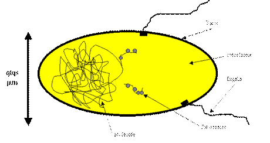
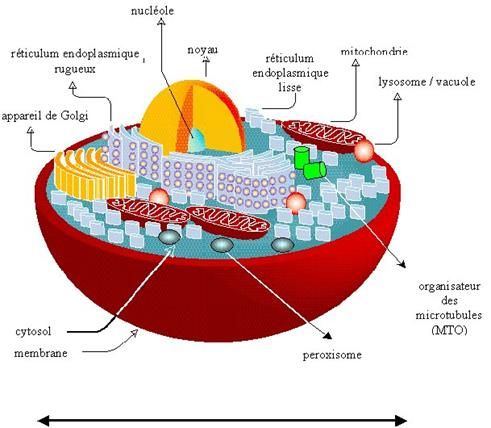
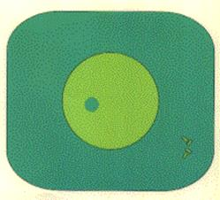
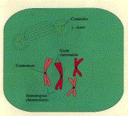
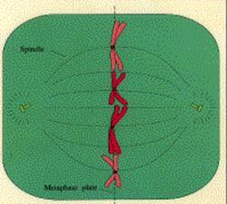
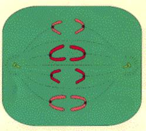
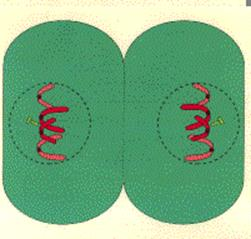
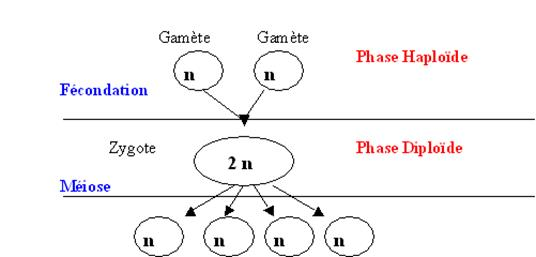
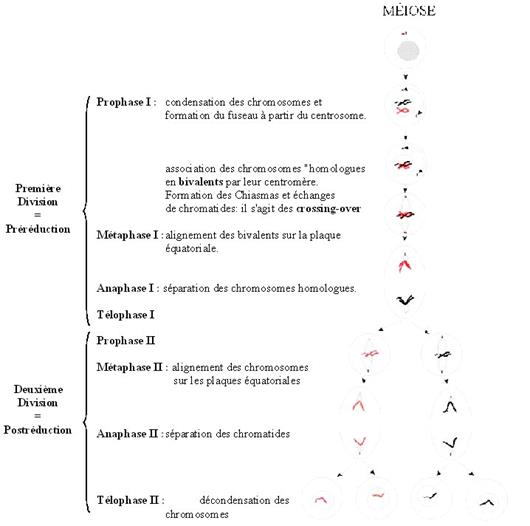

## Introduction générale

De nos jours, tout le monde sait qu'il est impossible de faire se reproduire ensemble un chien et un chat (notez que dans l'antiquité de tels croisements monstrueux étaient fréquemment évoqués !). Chiens et chats font partie de deux espèces différentes. Cette notion est en fait plutôt récente et la définition d'une espèce, en tant que groupe d'organismes inter fertiles produisant des descendants fertiles, a été défendue par le naturaliste français Buffon (1707-1788). Même de nos jours, cette notion de l'espèce n'est pas encore complètement établie et il existe des cas où elle est matière à débat (par exemple : qu'est-ce qu'une espèce de bactérie?).

De même nous savons qu'un couple de chats engendre uniquement des chats et un couple de chiens uniquement des chiens. A chaque espèce sont associés des "caractères particuliers" qui se conservent au cours de la reproduction engagée par deux individus de la même espèce. Mais, nous savons qu'à l'intérieur d'une espèce, il existe différents caractères. Cependant, on observe aussi dans certains cas la transmission d'une génération à l'autre de ces caractères plus subtils. Citons :

- coloration du pelage des chats siamois
- teneur en amidon du pois lui donnant un aspect lisse ou rugueux
- chez l'homme, la morphologie jusque dans ses plus fins détails comme l'existence de vrais jumeaux, difficilement distinguables même par leurs proches, le montrent

**Conclusion :** Au cours de la reproduction, les parents transmettent à leur descendance une information qui permet la "construction de l'individu". Il y a une transmission quasi à l'identique de cette information : la transmission est donc en très grande partie INVARIANTE. Pour une espèce donnée, l'information est quasi constante, elle présente néanmoins des petites VARIATIONS d'un individu à l'autre.
On définit la génétique comme la science qui a pour but d'étudier cette information.

Il existe deux aspects distincts à la génétique :

- l'étude du mode de transmission de cette information (aspect formel)
- l'étude de la nature de cette information
- l'étude de la façon dont s'exprime cette information (aspect moléculaire)

C'est le premier aspect qui se base sur l'analyse de croisements dirigés qui sont la caractéristique la plus connue de la génétique (rappelez-vous vos cours de lycée !).

Outre cet aspect fondamental, la génétique a aussi offert à la Biologie une méthodologie très puissante pour résoudre certains problèmes, en particulier ceux qui traitent de la fonction des macromolécules biologiques.

## Rappels Biologiques

Avant de rentrer plus avant dans l'analyse génétique, nous allons avoir besoin d'un certain nombre de rappels biologiques. En effet, comment discuter la transmission de l'information au cours de générations, si l'on ne connaît les mécanismes biologiques qui opèrent au cours de la reproduction ! Rappelons d'abord que :

Tout organisme est constitué de cellules :
Les premières cellules ont été décrites par Robert Hooke (1665). La théorie actuelle a été formulée par Mathias-Jacob Schleiden et Théodore Schwann (1839)

Toute cellule naît d'une cellule :
La génération spontanée des "gros organismes" a été abandonnée grâce à Francesco Redi (1626-1694), même si Buffon la défend encore un siècle plus tard. En effet, avant cette époque, on faisait naître des souris de tas de grains et des "vers" de la putréfaction. L'expérience de Redi montre que si on met de la viande dans une fiole bouchée par de la gaze fine, il n'apparaît jamais de vers. Le problème est plus complexe pour les organismes microscopiques et il faut attendre Louis Pasteur (1860) pour que la question soit définitivement tranchée. L'expérience est la suivante :

En l'absence de stérilisation (pas de chauffage), Pasteur observe une putréfaction (ou fermentation) avec une apparition de microorganismes. Après une stérilisation par chauffage, Pasteur n'observe pas de putréfaction. Par contre après cassure du tube de verre et exposition de la matière à l'air, les microorganismes apparaissent entraînant la putréfaction. L'explication qu'il donne est la suivante: les particules présentes dans l'air se déposent dans le tube avant d'avoir atteint la matière. Si celle-ci est stérile, il n'y a pas de putréfaction. La cassure du tube permet à ces germes d'atteindre la matière et de démarrer le processus. Notez que dans cette expérience de l'air "non altéré" passe sans problème dans la fiole à tout moment, il n'y a donc pas altération de "principe de l'air"qui empêcherait l'apparition spontanée de cellules. Cette expérience prouve qu'il y a besoin de germes pour initier la putréfaction et donc que la génération spontanée n'existe pas.

**Conclusion:** Toute cellule naît d'une cellule. D'un point de vue génétique, cela veut dire que l'information présente dans un organisme n'apparaît pas spontanément ! Elle est produite à partir d'une information préexistante. Celle-ci doit donc être dupliquée avant d'être transmise.

Si toute cellule naît d'une cellule, comment est faite une cellule ? et comment se reproduit-elle ?

Les analyses biologiques du début du siècle ont conduit à distinguer deux grands types de cellules, suivant leur constitution et leur mode de reproduction : les cellules procaryotes et les cellules eucaryotes.

## Les cellules Procaryotes

On les regroupe sous le terme générique de Bactéries. Il en existe deux grands groupes, les eubactéries et les archées, qui ont des fonctionnements différents au niveau moléculaire. Cependant, les cellules des deux groupes possèdent une organisation similaire.

**Structure:**

- Ces cellules sont généralement de petite taille (attention, il existe des exceptions !)

- Leur structure est très simple, le plus souvent sans cytosquelette ni réseau de membrane interne (la production d'énergie n'est pas compartimentée, elle se produit au niveau de la membrane plasmique). Autour de la cellule, on note la présence d'une paroi complexe. Dans le cytoplasme, il y a présence des ribosomes et d'une masse "plus claire", le nucléoïde qui contient l'ADN. Attention le nucléoïde n'est pas un noyau car il n'est pas entouré par une membrane (il existe de ce fait un couplage entre transcription et traduction). L'ADN est présent sous forme d'un ou quelques chromosomes, le plus souvent circulaire.

- Ces bactéries n'ont pas de processus d'endocytose et "n'ingère" donc que des molécules solubles.

- Elle ne forme jamais d'organisme pluricellulaire vrai, mais néanmoins les cellules sont capables de se différencier pour former des spores ou des colonies contenant des cellules de morphologies différentes.

- Leur unité de structure cache une grande complexité de métabolisme et de fonctionnement au niveau moléculaire. Ceci entraîne une diversité biologique très importante. Les procaryotes ont ainsi pu coloniser quasiment tous les milieux : des plus froids (mers polaires à la limite de la congélation) aux plus chauds (sources thermales à plus de 100°C), sous la croûte terrestre ou à l'intérieur du corps humain. Je vous renvoie au cours de microbiologie de maîtrise pour approfondir vos connaissances sur le sujet.
Division

- Elles se divisent simplement par fission, en général pour donner deux cellules identiques (voir film). Il n'y aucune structure marquante qui semble apparaître.

- Il n'y a pas d'individualisation de chromosomes visibles en cytologie à aucun moment de leur cycle de vie. Attention, le processus de division est cependant hautement contrôlé par des structures particulières; la petitesse des cellules empêche leur visualisation facile avec un microscope optique.

- Il n'existe pas de reproduction sexuée au sens usuel du terme. Il est cependant possible pour des cellules procaryotes d'échanger de l'ADN grâce aux phénomènes de conjugaison, de transduction et de transformation.

## Les cellules Eucaryotes

Cet ensemble regroupe une variété de cellules présentant des organisations plus ou moins complexes. Cependant, elles ont toute la caractéristique d'avoir un noyau, composé d'une double membrane entourant l'ADN. Celui-ci présente une organisation complexe.

**Structure:**

- Le plus souvent, outre le noyau, elles présentent une structure interne complexe avec un cytosquelette vrai (microtubules, filaments d'actine etc.) et un système de membranes délimitant de nombreuses organelles (outre le noyau associé au réticulum, appareil de Golgi, mitochondrie, lysosome / vacuole, peroxisome, etc.). De plus, chez de nombreux protistes et chez les plantes, des plastes assurent la photosynthèse. Il y a donc une compartimentation de la production d'énergie (mitochondrie et plastes) et des réactions enzymatiques (entre cytosol, peroxisome, lysosome etc.). La présence du noyau, caractéristique des eucaryotes, entraîne un découplage entre transcription et traduction. Ceci permet des niveaux de régulation supplémentaires.

- Elles ont la possibilité de faire des endocytoses, ce qui permet des échanges supplémentaires avec le milieu extérieur, mais aussi des régulations supplémentaires.

- Ces cellules peuvent se différencier et donner naissance à des organismes pluricellulaires. Ils ont une grande diversité au niveau du métabolisme (mais moindre que chez les bactéries) et de leur fonctionnement au niveau moléculaire. Je vous renvoie aux cours de biologie moléculaire, biochimie et microbiologie de maîtrise pour approfondir vos connaissances sur le sujet. Vous pouvez aussi consulter le cours de microbiologie eucaryote qui donne un aperçu de la diversité des eucaryotes "simples".

**Division:**

Leur processus de division est complexe ce qui résulte en une transmission plus complexe de l'information génétique au cours des générations. Il en existe deux types : les mitoses et les méioses.

## La mitose

C'est la division la plus courante pour les cellules eucaryotes, aussi bien chez les unicellulaires que chez les pluricellulaires. Je rappelle que toutes les cellules d'un organisme pluricellulaire sont issues par mitose d'une cellule unique (l'œuf chez les animaux, la graine chez les plantes et la spore chez les champignons). Elles constituent un clone (note : ce terme s'applique aussi aux cellules procaryotes issues d'une même cellule initiale). La mitose est une étape du cycle cellulaire : celui-ci se décompose de la manière suivante :

S: phase de synthèse. C'est à ce moment que l'information est dupliquée (= réplication de l'ADN !)

G1 et G2 sont des phases d'attente ou GAP. Pendant ces phases, un certain nombre de décisions sont prises (Y-a-t-il assez d'énergie pour se diviser ?...) et des contrôles sont faits (l'ADN est-il bien répliqué ? ...)

M: Mitose qui est le moment exact où le matériel génétique est réparti dans les deux cellules filles. C'est un processus dynamique dont la durée est variable d'un organisme à un autre mais qui prend en général moins d'une heure. Elle a été découverte chez les plantes par Edouard Stasburger (1875). Flemming (1880) montre qu'elle existe aussi chez les animaux et appelle chromatine la substance dont sont faites les particules "colorantes" du noyau. Waldeyer (1888) donne le nom de chromosome à ces particules

Cliquez pour voir le processus dynamique sur les films [mitose1](films/Mitose1.mov) (mitose réelle) et [mitose2](films/Mitose2.mov) (mitose schématisée).

Classiquement, on distingue 4 phases.

|                                                                                                                                                                                                                                  |                             |
| **Interphase** = G1 +S + G2                                                                                                                                                                                                   |    |
| **Prophase** condensation des chromosomes Dans le cytoplasme début de formation du fuseau à partir du centrosome qui se divise durant cette phase les chromosomes ont deux chromatides liées par leur centromère. |    |
| **Métaphase** Le fuseau est complet. Les chromosomes s'alignent sur la plaque équatoriale par leur centromère.                                                                                                          |    |
| **Anaphase** Les chromatides sœurs se séparent. Chacune migre à un pôle. Elles deviennent alors chacune "un chromosome"                                                                                                 |    |
| **Télophase** Les cellules terminent leur division. Les chromosomes se décondensent. L'enveloppe nucléaire se reforme (si elle a disparu). Le cytoplasme est partitionné en deux                                  |    |

Il existe de nombreuses variations sur ce schéma qui résume les étapes centrales et conservées du processus. Par exemple, chez les champignons, la membrane nucléaire ne disparaît pas pendant le processus. Il n'y a pas d' "asters" mais une structure équivalente qui s'appelle le "Spindle Pole Body". En tout cas, ce qu'il faut retenir c'est qu'à l'issue de la mitose il y a répartition à l'identique des chromosomes : une cellule à n chromosomes donne naissance à deux cellules à n chromosomes, une cellule à 2n chromosomes donne naissance à 2 cellules à 2n chromosomes. Il y a partition du cytoplasme.

On distingue les types de chromosomes suivants:

## La méiose

Cette division est très importante car elle est impliquée dans la reproduction sexuée des organismes (attention, la reproduction sexuée n'est pas une étape obligatoire chez les eucaryotes car de nombreux organismes ont une reproduction uniquement asexuée).

Oscar Hertwig (1875) montre que pendant la fécondation de l'œuf d'oursin, le noyau du spermatozoïde pénètre dans l'ovule et fusionne avec le noyau déjà présent. Edouard van Beneden (1883-1888) montre que les spermatozoïdes et les ovules ont le même nombre de chromosomes et que ceux-ci sont en quantité deux fois moins importante que dans les cellules germinales qui leur ont donné naissance. Ces études cytologiques montrent qu'il existe chez les eucaryotes une alternance de phases haploïdes où les cellules ont n chromosomes et de phases diploïdes, où elles ont 2n chromosomes. C'est la reproduction sexuée grâce à laquelle les cellules eucaryotes échangent de l'information génétique. A partir de ces observations cytologiques, August Weismann (1887) formule la première théorie chromosomique de l'hérédité : l'information génétique est portée par les chromosomes. L'analyse génétique se base donc principalement sur des analyses des croisements se produisant au cours de la reproduction sexuée.

Sur le schéma qui suit vous avez la terminologie utilisée de manière générale. En fait à pour chaque groupe d'eucaryote, il existe une terminologie particulière pour les gamètes et le zygote. Notez que la fécondation s'appelle conjugaison lorsque les deux gamètes ont la même taille.

La méiose est la division particulière qui permet le passage de la phase diploïde à la phase haploïde. Pour effectuer la méiose, il faut donc partir d'une cellule diploide à 2n chomosomes. Cette division est précédée comme pour la mitose de la duplication du matériel génétique (réplication de l'ADN). Au cours de la méiose, il y a deux divisions successives qui aboutissent à la production de 4 cellules haploïdes à n chromosomes suivant le schéma général suivant. Pour une vision dynamique de la méiose, cliquez les films [méiose1](films/Meiose1.mov) (images séquentielles d'une méiose) et [méiose2](films/Meiose2.mov) (schéma de la méiose)

La durée des phases haploïdes et diploïdes est variable en fonction des organismes. Cela veut donc dire que pour chaque organisme, l'analyse génétique des croisements suivra des modalités différentes en fonction de la phase qui peut être observée facilement. Les cycles décrits ci-dessous présentent les trois grands groupes de cycles qui sont distingués, en prenant les exemples des organismes les plus étudiés en génétique. Ensuite, vous sont données quelques caractéristiques génétiques de ces organismes.

La phase haploïde est aussi longue que la phase diploïde. Le cycle est dit haplodiplobiontique.

Ce type de cycle est présent chez de nombreuses levures.

### La levure *Saccharomyces cerevisiae*

Pour cette levure, il existe 2 types sexuels appelé mata et mata. Les cellules haploïdes mata ou mata, peuvent se diviser par mitose et générer des clones. La division s'effectue par bourgeonnement donnant deux cellules de tailles différentes : la cellule mère et la cellule fille. La conjugaison (équivalent à la fécondation) ne peut avoir lieu qu'entre une cellule haploïde mata et une cellule haploïde mata. La cellule diploïde résultant de la fusion peut aussi se diviser par mitose. Lorsque se produit une carence en nutriment, la cellule effectue une méiose. Celle-ci ne peut se produire que dans une cellule diploïde mata / mata. Elle produit 4 spores haploïdes empaquetées dans un asque (les spores sont appelées des ascospores) que l'on appelle une tétrade.

Note: Le génome haploïde de levure contient 16 chromosomes + le chromosome mitochondrial

D'un point de vue génétique, il faut retenir que dans ce type d'organisme il est possible d'observer les résultats des fécondations et des méioses.

La phase haploïde est très longue alors que la phase diploïde est réduite au minimum. On parle alors de cycle haplobiontique

Ce type de cycle est présent chez les champignons filamenteux.

### Le champignon filamenteux ascomycète *Neurospora crassa*

Comme la levure, N. crassa possède 2 types sexuels appelé mata et matA. Le mycélium du champignon est haploïde et différencie des organes mâles et femelles. La fécondation se produit entre un organe mâle d'un type sexuel et un organe femelle du type sexuel opposé. La fécondation est rapidement suivie de la méiose et d'une mitose post-méiotique supplémentaire qui donne naissance à un asque contenant 8 ascospores ordonnées.

Note: Neurospora contient 7 chromosomes + le chromosome mitochondrial.

D'un point de vue génétique, il faut retenir que dans ce type d'organismes, on ne peut regarder facilement que le résultat de la méiose.

La phase diploïde dure très longtemps alors que la phase haploïde est réduite au minimum. On parle de cycle diplobiontique

Ce type de cycle est présent chez les animaux et les plantes supérieures. Il en existe beaucoup de variations.

### Le maïs

Le plant de maïs est diploïde et produit des gamètes mâles et femelles sur des organes reproducteurs séparés. Le gamète mâle (le grain de pollen !) germe et le noyau haploïde se divise. Un des noyaux obtenus va féconder le noyau de l'ovule femelle, un autre féconde une cellule diploïde qui se retrouve donc triploïde. Dans le grain de maïs final, l'ovule donne naissance à l'embryon et la cellule triploïde donne naissance à l'albumen nourricier.

Note: le maïs a 10 chromosomes + le chromosome mitochondrial + le chromosome chloroplastique

### Le nématode *Caenorhabditis elegans*

Chez ce nématode, il existe des individus hermaphrodites avec deux chromosomes X qui peuvent s'autoféconder pour donner naissance principalement à des hermaphrodites. Rarement, un accident de méiose aboutit à la perte du chromosome X dans un gamète. L'œuf résultant de la fécondation d'un gamète normal avec ce gamète donne naissance à un mâle incapable de s'autoféconder mais qui peut produire des spermatozoïdes fécondant les hermaphrodites.

Note: C. elegans possède 5 paires d'autosome + le chromosome sexuel X (les hermaphrodites sont noté X X et les mâles X 0).

### La drosophile

Chez la drosophile, le mâle (X Y) produit des spermatozoïdes et qui vont féconder après copulation les ovules de la femelle. Notez que la femelle peut stocker les spermatozoïdes; il faut donc s'assurer que les femelles sont vierges afin de contrôler les croisements. Après la fécondation, l'œuf pondu donne naissance à une larve qui passe par 3 stades, et qui ensuite fait la métamorphose dans la pupe pour donner naissance aux adultes.

Notes: La drosophile possède 3 paires d'autosomes plus une paire de chromosomes sexuels (XX chez la femelle, XY chez le mâle) + le chromosome mitochondrial. Dans les glandes salivaires, les l'ADN se réplique pour donner naissance à des molécules d'ADN identiques qui s'associent pour générer les chromosomes géants ou polytènes, visibles en interphase. Je vous rappelle enfin que chez les mâles, il n'y a pas de crossing-over.

### L'homme

Je pense ne pas devoir vous décrire en détail la reproduction de l'homme !

Note: L'homme possède 22 paires d'autosomes + 1 paire de chromosomes sexuels (X et Y) + le chromosome mitochondrial.

D'un point de vue génétique, il faut retenir que chez ces organismes diplobiontiques, on ne regarde facilement que les zygotes qui sont issus de la fécondation.

## Les virus

Finalement, il existe un groupe "d'organismes" avec lequel il est possible d'effectuer des analyses génétiques : les bactériophages et les virus. Il existe aussi de nombreux cycles d'infection pour ces virus et je vous renvoie au cours de virologie de maîtrise pour approfondir vos connaissances. Le schéma suivant vous résume un cycle classique.

Pour faire des analyses génétiques, il est possible de faire des infections multiples. On met alors en présence plusieurs génomes viraux dans la même cellule. C'est l'équivalent de croisements. On peut ensuite observer le processus d'infection ou analyser la descendance produite.

