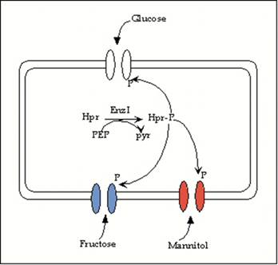
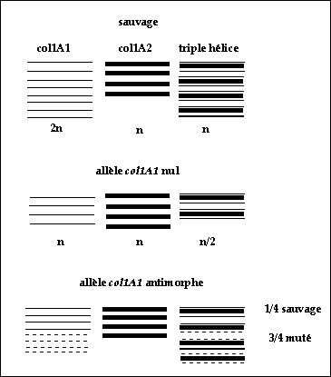
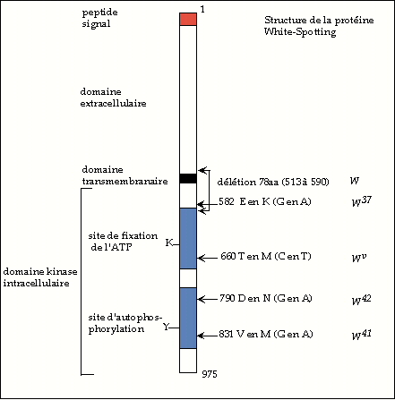

# LA REALISATION DU PHENOTYPE

## INTRODUCTION

Le phénotype est l'ensemble des caractéristiques, morphologiques, physiologiques, métaboliques, dévelopementales, comportementales etc... d'un individu. Si le génotype est muté on observera une différence entre le phénotype sauvage et mutant. 
Un gène code une protéine ou un ARN qui effectue à son tour une action physiologique:

- si c’est une protéine de structure elle participe à la mise en place de structures nucléaires (histones) ou cellulaires (actine, mysosine, tubuline, protéines de membranes) ou organiques (collagènes);
- si c’est un enzyme: elle catalyse une réaction par elle-même,
- si c’est une protéine régulatrice (activateur ou répresseur, facteur de transcription) elle influe sur le niveau d’expression d’autres gènes,
elle peut agir seule ou faire partie d'un complexe qui a une action physiologique (transcriptome, protéasome, ribosome).
- si c'est un ARN il peut jouer un rôle structural et ou catalytique (par ex dans le ribosome) ou regulateur (RNAi, ARN7SK).

Donc le produit du gène participe à l'élaboration du phénotype, qui est le résultat visible de l'action de toutes les protéines et de tous les ARN actifs, présents à un moment donné de la vie de l'organisme ou de la cellule.
Quand on possède une collection d’allèles mutants différents pour un gène donné, on observe souvent des différences dans les phénotypes donnés par chacun de ces allèles. Autrement dit, suivant la nature moléculaire de la mutation présente dans un gène donné, le phénotype pourra être différent. Il s’agit donc d’étudier la nature moléculaire des mutations et à partir de là de comprendre leur effet global sur le phénotype. 

Or il n'est pas si aisé de connaître la nature moléculaire du défaut c'est-à-dire de caractériser moléculairement chaque allèle mutant d'un gène donné. Pourtant cela est souvent essentiel pour interprêter le phénotype mutant et en déduire la fonction du produit du gène sauvage.

## DESCRIPTION DU PHENOTYPE

### Niveaux d’analyse d’un phénotype

On observe chez un individu un phénotype mutant : il faut d’abord décrire ce phénotype le plus finement possible. Il y a plusieurs niveaux d’analyse du phénotype, lequel dépend donc de l’observateur et des instruments et moyens d’analyse dont il dispose.

1. Niveau macroscopique primaire: forme, couleur, état de la croissance ; on change les conditions de milieu, la température, on fait agir des colorants, des drogues.
2. Niveau microscopique : on observe au microscope ou à la loupe; pour les organismes pluricellulaires on dissèque, on fixe, on colore.
3. Puis on passe à l’analyse biochimique et moléculaire. Pour cela on clone le gène sauvage pour pouvoir fabriquer des sondes. On analyse le mutant à différents niveaux:

- Structure de l'ADN génomique: Southern pour mettre en évidence des remaniements importants: délétions ou additions de matériel, duplications (de gène ou de chromosome)
- Clonage des mutations et séquençage de l'ADN pour mettre en évidence des mutations ponctuelles.
- Transcription du gène: Northern, RT-PCR ou hybridation in situ pour mettre en évidence des différences dans le taux de transcription ou dans les territoires d'expression ou dans le moment de l'expression,
- Expression de la protéine : détection de la protéine à l’aide d’anticorps spécifiques, afin de vérifier si elle est présente chez le mutant comme chez le sauvage, au bon moment et au bon endroit (organe, type de cellules, compartiment subcellulaire).
- Dosage de l’activité s’il s’agit d’un enzyme ou étude des propriétés physico-chimiques comme la mobilité électrophorétique.

### Pléiotropie

Une fois le phénotype décrit avec les moyens dont on dispose il faut se poser des questions :
Le phénotype est-il unique et bien circonscrit ou bien plusieurs fonctions sont-elles affectées?

Dans le second cas il faut d'abord être sur que le phénotype complexe obtenu n'est pas du en fait à plusieurs mutations affectant des gènes différents. Ce serait par exemple le cas si la mutation était une délétion qui englobe plusieurs gènes voisins. Si la mutation n’affecte qu’un seul gène il faut se demander si celui-ci donne naissance à une seule protéine ayant plusieurs fonctions ou à plusieurs protéines ayant des fonctions différentes (par exemple par épissage alternatif).

S'il n'y a qu'une seule protéine affectée et que le phénotype soit néanmoins complexe on dit qu'il est pléiotrope, c’est-à-dire qu’une mutation dans un seul gène donne plusieurs phénotypes mutants. On en conclut que le produit du gène fait partie d’une voie métabolique commune à plusieurs processus.

On connaît de nombreux cas de pléiotropie ; un exemple très classique est celui du métabolisme des sucres chez les bactéries. Chez E. coli une mutation nulle dans ptsI ou ptsH aboutit à l’impossibilité pour la bactérie de croître sur plusieurs sucres comme le glucose, le fructose, le saccharose, le mannitol, tout en laissant la possibilité de croître sur lactose. Ce n’est donc pas la dégradation de ces sucres par la glycolyse qui est affectée mais une autre voie commune, où ptsH et ptsI sont impliqués. On a montré qu’il s’agissait du système de transport de ces sucres à l’intérieur de la bactérie par l’intermédiaire du système des phosphotransférases. L’enzymeI codé par ptsI phosphoryle une protéine transporteur appelée Hpr et codée par ptsH, au dépens du phosphénol-pyruvate. Ensuite Hpr peut phosphoryler les diverses perméases, spécifiques de chacun des sucres. Ainsi activée chaque perméase importe le sucre en le phosphorylant.

## BASE PHYSIOLOGIQUE DE LA DOMINANCE ET DE LA RECESSIVITE

Chez les diploïdes deux allèles du même gène codent la même protéine. Si on a une combinaison hétéroallélique quel sera le phénotype? On a déjà vu que lorsque la combinaison est : un allèle muté et un allèle sauvage, deux cas se présentait. 

Si le phénotype donné par l’allèle sauvage l’emporte chez l’hétérozygote on dit que la mutation est récessive, si le phénotype donné par l’allèle mutant l’emporte on dit qu’il est dit dominant. Le phénotype donné par un allèle récessif est masqué et n’apparaîtra qu’à l’état homozygote.

Sur deux exemples on va faire le lien entre la quantité effective de produit protéique actif et le résultat sur le phénotype.

La couleur du pelage des souris est sous la dépendance de plusieurs gènes. Les souris sauvages ont un pelage brun lustré. Deux mélanines, l’eumélanine noire, la phaéomélanine jaune sont synthétisées dans les mélanocytes et colorent les poils : on trouve une bande noire à la base, une bande jaune intermédiaire et la pointe noire. Ce qui veut dire que la synthèse et le dépot des deux pigments sont temporellement régulés en fonction de la croissance du poil.

- Le gène c code la tyrosinase, premier enzyme de la synthèse des 2 mélanines.
- Le gène Agouti code une protéine qui règle le dépôt de la mélanine jaune dans le poil : elle intervient spécifiquement à un moment donné du développement du poil pour déposer la bande de pigment jaune, le pigment noir lui se déposant "par défaut".

### Locus c

On connaît les allèles suivants du gène c tous récessifs devant le sauvage:
ca/ ca pelage albinos
cch/ cch pelage chinchilla (gris)
ch/ ch himalayen (corps blanc extrémités noires) : la protéine est thermosensible et inactivée dans les portions du corps les plus chaudes
cch/ ca gris clair intermédiaire entre chinchilla et blanc
c+/ ca sauvage, 

Interprétation

On a une échelle de phénotypes qui suit la concentration des pigments produits par la voie métabolique qui commence par l'action de la tyrosinase.
c+/c+ brun lustré : deux allèles sauvages donc deux doses d’enzyme soit 100% d'enzyme et 100% de pigments,
ca/ ca blanc : il s'agit d'une mutation nulle, pas d'enzyme du tout, pas de pigments.

c+/ ca brun lustré : une seule dose d’enzyme soit 50% mais 100% de pigments. Donc une seule dose de tyrosinase suffit pour synthétiser 100% des pigments et assurer un phénotype sauvage.
cch/ cch gris : l’allèle est une perte de fonction partielle, on a seulement deux fractions de doses d'enzyme (ou deux doses d’enzyme partiellement actif) qui synthétisent moins de 100% de pigment (par ex 60% pour fixer les idées) donc le pelage est plus clair. La dose d'enzyme actif synthétisée à partir des deux allèles mutants est inférieure à une dose sauvage (puisqu'une dose restitue 100% de pigment).
cch/ ca gris clair : il ya co-dominance entre les deux allèles ; avec la convention ci-dessus on a seulement une dose d'enzyme partiellement actif et 30% de pigment .

Dans le cas ou une dose de protéine ne suffit pas pour assurer un phénotype sauvage, l’hétérozygote a un phénotype mutant, la mutation est dominante et on dit que l’allèle est haplo-insuffisant ( c'est le cas des mutations Minute par exemple).

On peut obtenir une dominance de l'allèle mutant par l'effet inverse, le plus classique, c'est-à-dire par surexpression du produit protéique par l'allèle mutant, comme dans le cas de l'allèle Ay développé ci-après.

### Locus Agouti (A)

On connaît plusieurs allèles récessifs de ce gène, ici l’allèle a, et d'autres qui sont dominants, comme ici Ay.
a/a pelage noir , 
a/A+ pelage sauvage,
Ay/A+ ou Ay/a pelage jaune.

Interprétation

- a/a : la mutation est nulle d’où pas de protéine Agouti, seul le pigment noir est déposé dans les poils.
- a/A+ : une dose de protéine sauvage, cela est suffisant pour assurer le dépôt correct du pigment jaune,
- A+/A+: deux doses de protéine sauvage, pigment jaune déposé correctement,
- Ay/a : Il y a surproduction permanente de protéine Agouti car dans l’allèle Ay le gène est mis sous contrôle d'un promoteur fort par suite d'une délétion. Seul le pigment jaune est déposé. Donc un seul allèle Ay produit à lui seul plus de deux doses de protéine Agouti. 
- Ay/A+ : les deux allèles font à eux deux plus de 3 doses de protéine Agouti, seul le pigment jaune est déposé.
 
## CARACTERISTIQUES GENETIQUES DES ALLELES

### Définitions

Allèles perte-de-fonction

- Allèle amorphe ou nul : correspond à une mutation qui abolit complètement la fonction du produit du gène ; celui-ci est totalement inactif ou absent.
- Allèle hypomorphe : le produit du gène est synthétisé et il a la même fonction que le produit sauvage, mais la mutation fait que, soit il est en quantité plus faible, soit il est moins actif.

De façon générale les allèles perte-de-fonction sont récessifs par rapport à l'allèle sauvage. Cependant il existe des allèles perte-de-fonction dominants qu'on appelle alors allèles haplo-insuffisants, ce qui signifie qu'une dose de produit sauvage n'est pas suffisante pour assurer la fonction physiologique normale: c'est par exemple le cas des protéines requises en quantité stœchiométrique et non catalytique (cf ci-dessous l’exemple des allèles Minute).

Allèles gain-de-fonction

- Allèle hypermorphe : le produit est fonctionnellement équivalent au produit sauvage mais il est fait en plus grande quantité.
- Allèle néomorphe : le produit est fonctionnellement différent du sauvage ou bien il est équivalent au produit sauvage mais délivré au mauvais moment au cours du développement ou au mauvais endroit.
- Allèle antimorphe ou dominant négatif: le produit fabriqué à partir de l'allèle mutant possède une activité antagoniste de celle du produit sauvage.

Les allèles gain-de-fonction sont dominants par rapport à l'allèle sauvage.
Cette notion de perte ou de gain-de-fonction est importante à saisir pour caractériser les allèles. En effet, cette classification permet de faire des hypothèses sur la fonction du produit du gène sauvage.

### Exemples

#### Allèles amorphes et allèles hypomorphes

Le prototype de l’allèle nul est la délétion du gène. Mais des mutations ponctuelles peuvent également être amorphes si elles abolissent la fonction du produit. Par exemple :

- celles qui détruisent un site actif par changement d’un acide aminé crucial (site catalytique, ou de fixation d'un cofacteur indispensable, ou site de reconnaissance d'un motif ADN, s'il s'agit d'une protéine affine de l'ADN) ,
- celles qui introduisent un codon stop et tronquent la protéine,
- celles qui correspondent à l’insertion d'un transposon dans un exon codant,
- celles qui introduisent un décalage du cadre de lecture très précocement dans la séquence,
- celles qui détruisent un site d’épissage, 
- ou bien celles qui affectent drastiquement l'expression par exemple en détruisant une région promotrice: plus d'ARNmessager.

Chez E. coli 

Le gène trpA code pour la sous-unité a de la tryptophane synthétase. L'enzyme est un tétramère a2b2 la sous-unité b étant codée par trpB. Les deux gènes sont organisés en opéron trpBA.

L'enzyme catalyse la conversion de l'indole glycérolphosphate (IGP) en tryptophane. Une souche ayant une mutation nulle dans trpA est incapable de pousser sans trp mais pourra le faire en présence d'indole (car la sous-unité a catalyses la transformation de IGP en indole et b celle de l'indole en trp). La sous-unité a est longue de 268 acides aminés. 

Les mutations suivantes sont nulles :

| position | ac. am. sauvage | ac.am. mutant                       |
|----------|-----------------|-------------------------------------|
| 15       | Lys             | Trp                                 |
| 49       | Glu             | Ser, Tyr ou Leu                     |
| 211      | Gly             | UAA ou Arg, Asp, Glu, Lys, Trp, Tyr |

Chez la drosophile

La protéine codée par le gène white est impliquée dans le transport ou le dépôt des pigments rouge et brun dans l'œil. L'allèle sauvage donne des yeux rouge brique.

L'allèle nul w67c2 , qui correspond a une délétion, donne à l'état homozygote des yeux blancs.

L'allèle hypomorphe white-apricot wa, qui correspond a une insertion d'un transposon copia dans le 2ème intron, donne des yeux orange clair à l'état homozygote. La présence du transposon perturbe la transcription en diminuant la quantité de transcrit utile (cf exercice de TD).

On connaît environ 300 allèles différents de ce gène, plus de la moitié sont des hypomorphes donnant des yeux diversement colorés entre le blanc pur et le rouge brique. Les autres sont des allèles nuls qui donnent des yeux blancs.

Mutants thermosensibles 

Ces allèles hypomorphes à basse température tendent à devenir des nuls quand on monte la t°. Moléculairement cela se comprend bien : la mutation change un acide aminé impliqué dans la stabilité de la structure spatiale de la protéine. A basse température la conformation de la protéine est peu affectée et on a un phénotype sauvage ou quasi sauvage, quand la température s’élève la protéine mutante se dénature et le phénotype mutant apparaît.

Allèles haplo-insuffisants

Chez la drosophile les gènes Minute correspondent a une classe de gènes, répartis sur tous les chromosomes. A l’état hétérozygote une mutation nulle dans un gène de type Minute donne un développement ralenti (petites cellules). A l’état homozygote le phénotype est létal. L'un d'entre eux, M(3)99D, a été cloné et code la protéine ribosomale RP49 qui fait partie de la grande sous-unité du ribosome. Une mutation nulle dans ce gène est donc dominante. C'est donc que une seule dose de la protéine sauvage est insuffisante pour assurer une traduction normale et donc la croissance normale des cellules. En effet il s'agit d'une protéine de structure, elle est nécessaire en quantité stœchiométrique et non catalytique: en contexte hétérozygote pour la mutation, seulement la moitié des ribosomes pourront être assemblés et la capacité globale de traduction sera diminuée, d'où retard de croissance.

#### Allèles hypermorphes

Chez la levure: 

La mutation adh2 causée par l'insertion d'un transposon Ty dans la zone régulatrice du gène provoque la dérégulation du gène ADH2, codant pour l'alcool déshydrogénase. Celle-ci est alors exprimée tout le temps, même en présence de glucose, qui normalement la réprime. On a ici un phénotype constitutif classique.

Chez E. coli:

L'opéron gal (galETK) code pour plusieurs enzymes permettant le catabolisme du galactose.
Chez la souche sauvage l'opéron est induit seulement en présence de galactose comme source de carbone. On a isolé un mutant chez lequel l'induction a lieu même en absence d'inducteur (phénotype constitutif). Cette mutation nommée Ocest cis dominante . En effet les mérodiploïdes Oc gal-/O+ gal+ ont un phénotype sauvage alors que les mérodiploïdes Oc gal+/O+ gal- ont un phénotype constitutif, ce qui montre que la mutation Oc n'entraine la constitutivité que si elle jouxte, sur le même chromosome (ou double brin d'ADN) l'opéron gal+. La séquence a montré que la mutation était située dans une région proche du promoteur appelée opérateur. Cette région a pour séquence:

    TGTAAACGATTCCAC

Le changement de l'avant dernier C en T provoque la constitutivité.

On a montré, par empreinte à l’ADNase, que cette région était le site de fixation du répresseur codé par galR. On peut en déduire que ce dernier contacte la base C.

Il s'agit d'une mutation hypermorphe classique: le produit est synthétisé en abondance alors qu'il devrait être réprimé.

Remarque: On peut naturellement supposer que réciproquement, si l'acide aminé du répresseur GalR qui contacte la base C est muté on observera aussi un phénotype constitutif. Notons que dans ce cas cet allèle mutant galR- correspond à une perte de fonction car le mérodiploïde galR- /galR+ a un phénotype sauvage (la mutation galR- est récessive).

Chez la Drosophile: 

A l'état hétérozygote la mutation Bar donne un œil en forme de haricot par défaut de développement des ommatidies situées antérieurement. Le locus Bar contient deux gènes BarH1 et BarH2 codant pour des facteurs de transcription très homologues, impliqués dans le développement de l'œil. La mutation Bar conduit a une surexpression du gène BarH1 (vérifiée par Northern), en mettant ce gène sous contrôle d'un autre promoteur. Le mauvais réglage de l'expression de ce gène provoque une inhibition du développement de certaines ommatidies.

Surexpression d’un gène sauvage: 

De manière générale lorsqu'on surexprime un gène sauvage, on reproduit l'effet d'un allèle hypermorphe. Cela peut se faire artificiellement:

- soit en insérant le gène sauvage sur un plasmide multicopie, avec lequel on transforme bactéries ou levure, ou on transfecte des cellules eucaryotes en culture.

Exemple : 
La levure sauvage se divise régulièrement en milieu riche et arrête de se diviser en milieu carencé. Une souche sauvage, transformée avec un plasmide multicopie portant le gène CYR1 sauvage, codant l'adénylate cyclase, continue de se diviser en milieu carencé. On en conclut que la surproduction stable d'adénylate cyclase, qui catalyse la synthèse de l'AMP cyclique, conduit à l'activation permanente du cycle cellulaire. On observe ici un phénotype constitutif.

- soit par transgénèse en le mettant le gène sauvage sous le contrôle d'un promoteur fort, comme un promoteur de choc thermique par exemple.

Si le gène code un enzyme ou une protéine de structure sa surexpression peut n'avoir aucune conséquence. En revanche si le gène code pour une protéine régulatrice on observera un phénotype mutant. Ce type de dérégulation est classiquement observé au niveau somatique dans l'apparition des tumeurs causées par des oncogènes.

#### Allèles dominants négatifs ou antimorphes

Chez l’Humain certaines mutations affectant les gènes codant pour les collagènes sont dominantes. Environ 150 maladies appelées ostéochondrodysplasies ont été répertoriées, la plupart dominantes, de gravité variable (ostéogénèse imparfaite, fragilité des os, surdité) pouvant aller jusqu’à la létalité au stade périnatal. 

Les collagènes, constituant des tissus connectifs (tissu conjonctif), sont formés de plusieurs protéines apparentées, enroulées en triple hélice soit homo soit hétérotrimériques, selon une combinatoire variée. Chez l’humain une trentaine de gènes codent pour ces protéines constitutives des collagènes. Dans la plupart des collagènes, les triples hélices sont réunies en paquets et forment des fibres.

Par exemple le collagène de type I sauvage est formé de 2 chaînes codées par col1A1 (2n chaines de col1A1) et une chaîne codée par col1A2 (n chaines de col1A2) formant n triple hélices. 
En présence d’une délétion du gène col1A1 à l'état hétérozygote on a seulement synthèse de la moitié de la dose de protéines col1A1, soit n chaînes de col1A1 et n de col1A2 donc finalement n/2 triple hélices. Ce génotype donne une ostéogénèse imparfaite (Oi) légère par simple haplo-insuffisance. 

Une mutation donnant un polypeptide mutant col1A1 encore capable de s'assembler avec col1A2 sauvage, mais de façon erronée, va causer plus de dommage à l'ensemble de la structure que le simple manque d'un type de protéine. En effet on aura n chaînes normales et n chaînes anormales de col1A1 mais susceptibles de s'associer avec n chaînes de col1A2 pour donner des triple hélices malformées. Selon la combinatoire, à la fin, 3/4 des triples hélices seront malformées, entrainant un phénotype plus grave que celui causé par la simple délétion. Ce genre d’allèle est appelé antimorphe parce que le produit muté antagonise le produit sauvage en le séquestrant dans des complexes inactifs. On le nomme aussi, de façon équivalente dominant négatif, ce qui reflète le fait que la fonction du produit est perdue mais que l’effet phénotypique est dominant car le produit muté a gagné une autre fonction qui est de perturber le fonctionnement normal du produit sauvage.

Des mutations de ce type dans col1A1 et col1A2 ont été caractérisées moléculairement. La séquence en acides aminés des collagènes présente des répétitions du motif (Gly-X-Y)6. Chaque motif est codé par un exon. La délétion d'un exon donc d'un motif a peu d'effet sur la structure de la triple hélice qui est néanmoins légèrement anormale et entraine une Oi légère. Par contre le remplacement de la glycine par un acide aminé plus volumineux perturbe gravement l'assemblage des fibres et entraîne une Oi grave à l’état hétérozygote.

De manière générale chaque fois qu’une molécule protéique agit sous forme di- ou polymérique, on peut voir apparaître des effets antimorphes.

Autre exemple: certains allèles de lacI , qui code le répresseur de l'opéron lactose, sont dominants et sont des allèles antimorphes (cf travaux pratiques).

#### Allèles néomorphes

Chez E. coli:

Un changement de spécificité d'une protéine constitue un bon exemple d'une mutation néomorphe. C'est par exemple le cas déjà cité d'une mutation dans la lactose perméase qui fait qu'elle devient capable de transporter le maltose.

Chez la Drosophile: 

Le gène Ubx spécifie l'identité de certains compartiments du corps de la mouche, en particulier le 3ème segment thoracique et les segments abdominaux. Chez la mouche normale le 3ème segment thoracique porte une paire d’haltères (ou balanciers, qui stabilisent le vol), dont le bon développement est donc sous la dépendance de Ubx. Le 2ème segment thoracique, lui, porte une paire d’ailes et ceci est sous la dépendance d’un autre gène. La mutation dominante Cbx (génotype Cbx/+ ou Cbx/Cbx ont le même phénotype) dans le gène Ubx provoque l'apparition d'une partie postérieure de haltère à la place de la partie postérieure d'aile sur le 2ème segment. La mutation est due à l'insertion dans le gène d'un fragment de 17kb. Cette insertion apporte une séquence contenant l'information pour produire du tissu d'haltère à un endroit où devrait se différencier du tissu d’aile. Il y a donc apparition d’une nouvelle fonction, fautive.

Chez l’humain: 

La chorée de Hungtington (voir exercice de TD).

### Comment savoir à quel type d'allèle on a affaire?

La réaction du phénotype devant un nombre croissant de copies du gène muté permet de distinguer entre allèles a/hypo/hyper/morphes. 
Pour un allèle amorphe l'addition de copies supplémentaires du gène muté n'a aucun effet supplémentaire sur le phénotype, par contre pour un allèle hypomorphe, qui conserve une fraction de la fonction sauvage, on se rapprochera du phénotype sauvage et pour un hypermorphe on observera à l’inverse une accentuation du phénotype mutant.
De même le dosage génique permet de distinguer entre allèles anti et néomorphes. Pour un allèle néomorphe , qui a une fonction nouvelle, l'addition de copies du gène sauvage ne change rien au phénotype mutant. Au contraire, un allèle antimorphe sera titré par l'addition de copies sauvage, ce qui atténuera le phénotype mutant. De même le phénotype d'un allèle antimorphe sera aggravé en présence d'une délétion du gène sauvage.

Phénotypes obtenu dans différentes combinaisons alléliques (par référence à la première colonne)

| génotype Allèle         | m/m                              | m/+                                      | m/délétion                                              | Type de mutation                                                     |
|-------------------------|----------------------------------|------------------------------------------|---------------------------------------------------------|----------------------------------------------------------------------|
| amorphe ou nul          | mutant (0 dose)               | sauvage (1dose)                       | mutant (0 dose)                                      | perte de fonction totale (récessive*)                          |
| hypomorphe ou "leaky"   | mutant (2 fractions de dose)  | sauvage (1 dose + 1 fraction de dose) | mutant plus fort  (1 fraction de dose)               | perte de fonction partielle (récessive)                        |
| hypermorphe             | mutant (>>2doses)             | mutant plus faible (> 2 doses)     | mutant plus faible ou tend vers sauvage (>1 dose) | gain de fonction davantage de produit (dominante)              |
| antimorphe              | mutant                           | mutant plus faible                    | mutant                                                  | gain de fonction antagoniste à la fonction sauvage (dominante) |
| néomorphe               | mutant (double mutant)**      | mutant                                   | mutant (double mutant)**                             | perte + gain de fonction nouvelle fonction (dominante)            |

(*) sauf cas d'haploinsuffisance.
(**) éventuellement double mutant d’une part à cause de l’ absence du produit sauvage (si elle a un phénotype), d’autre part à cause de l’ apparition d'une nouvelle fonction et du phénotype qui lui est associé.

## ANALYSE PHENOTYPIQUE ET MOLECULAIRE DE DIVERS ALLELES DE White-spotting CHEZ LA SOURIS.

Cet exemple permet d’illustrer la variété d’allèles de nature différente que l’on peut obtenir pour un seul gène.

- On connaît de très nombreux allèles affectant le locus White-spotting (W) chez la souris. Tous provoquent à l'état hétérozygote des taches blanches sur le pelage. Ils sont donc dominants.
- Certains allèles, à l'état hétérozygote, présentent en plus un autre phénotype: anémie par manque de globules rouges. Ils sont donc dominants pour l’anémie. Par contre d’autres sont récessifs pour ce phénotype.
- Lorsqu'on examine le phénotype des homozygotes on voit clairement que les allèles ont une "force" différente. Certains confèrent la létalité pendant le développement fœtal (la gestation dure 20 jours chez la souris). Si on autopsie les fœtus on voit que le décès a lieu par anémie sévère. A ce stade, le développement du pelage n'est pas encore fait donc on ne sait pas quelle serait la couleur du pelage chez ces animaux. Chez les homozygotes viables on voit que les taches blanches du pelage sont plus étendues que chez l'hétérozygote; parfois il est complètement blanc, parfois non, mais l'intensité du phénotype est gradué de la même façon si on compare l'hétérozygote et l'homozygote.
- Pour certains homozygotes viables on voit apparaître, un 3ème phénotype, concernant des défauts de fertilité; les allèles concernés sont toujours récessifs.

### Description phénotypique des allèles

| Allèle | nature                 | hétérozygotes Wx/+              | homozygotes Wx/Wx                                   |
|--------|------------------------|---------------------------------|-----------------------------------------------------|
| W19H   | délétion totale        | grosses taches blanches         | létal après 12 jours in utero  par anémie sévère |
| W37    | faux-sens 582 E-K      | grosses taches blanches         | létal après 12 jours in utero par anémie sévère     |
| W42    | faux-sens 790 D-N      | tout blanc, anémie              | létal après 12 jours in utero par anémie sévère     |
| W      | délétion 78aa 513-590  | taches blanches                 | létal après 12 jours in utero par anémie sévère     |
| W44    | faible expression      | petites taches blanches         | blanc à 85%, fertilité réduite                      |
| W41    | faux-sens 831 V-M      | petites taches blanches, anémie | blanc à 85%, anémie                                 |
| Wv     | faux-sens 660 T-M      | taches blanches, anémie         | tout blanc, anémie sévère, stérile               |

On a donc affaire à un locus dont les allèles donnent un phénotype pléiotrope c'est-à-dire que les mutations affectent plusieurs fonctions qui à première vue n'ont rien à voir entre elles. Il faut donc trouver une explication: on a affaire à un seul gène, de nombreuses études l'ont montré, et il faut donc trouver pour le produit du gène une fonction qui permette de rendre compte des trois effets.

Pour cela il faut examiner le plus finement possible les phénotypes. On va mettre en œuvre différents niveaux d'analyse du phénotype:

- observation macroscopique: surface des taches blanches, nombre de descendants ;
- autopsie des fœtus ;
- examen des organes: examen sanguin, examen des cellules de la peau, dissection des gonades ;

On observe ainsi que dans les trois phénotypes c'est le nombre de cellules spécialisées qui est affecté:

- peu ou pas de mélanocytes : donc synthèse des pigments du pelage diminuée, non par manque d'un des enzymes impliqués dans la biosynthèse mais par manque des cellules dans lesquelles s'expriment les gènes codant pour les enzymes de biosynthèse des pigments ;
- peu ou pas d'érythocytes donc anémie ;
- peu ou pas de cellules germinales donc stérilité.

Point commun : la protéine W pourrait donc intervenir dans la prolifération ou la différenciation ou la migration des cellules souches de ces différentes lignées cellulaires.

Interprétation du phénotype

Pour interpréter l'effet physiologique de ces allèles il faut caractériser moléculairement les différentes mutations. Il faut donc cloner le gène sauvage, l'analyser, puis le comparer avec les allèles mutants:

- analyse de la structure de l'ADN génomique par Southern ou PCR (mise en évidence de délétions ou mutations ponctuelles) séquençage de mutations localisées,
- analyse de l'expression (Northern, RT-PCR quantitative).

On peut étudier la protéine ce qui permet d’enrichir le phénotype:

- analyse de l'intégrité de la protéine par immunodétection,
- mesure in vitro de l'activité de la protéine sur des extraits (activité d'autophosphorylation à partir d'ATP),
- localisation de la protéine à la surface cellulaire.

### Fonction physiologique de la protéine W

La caractérisation du gène sauvage a été menée chez la souris et l'humain. En effet la région du chromosome 5 de souris, qui contient W, est homologue à une portion du chromosome 4 chez l'humain où on trouve également un gène, appelé c-kit, qui présente des homologies remarquables avec W au niveau de la séquence peptidique. Ce gène c-kit a été caractérisé à partir de son homologue dérégulé v-kit présent dans un rétrovirus oncogène, causant l'apparition d'une tumeur chez le chat.

Le gène W code une protéine de 975 acides aminés ayant les propriétés d'un récepteur transmembranaire à tyrosine kinase (RTK). Ce récepteur reçoit un signal venant de l'environnement ou de cellules voisines, sous la forme d’un ligand qui se fixe sur son domaine extracellulaire. La fixation du ligand entraîne l’activation du récepteur, qui se traduit par la phosphorylation de certains de ses résidus tyrosine qui pourront à leur tour activer une autre protéine par phosphorylation. La protéine W a donc une activité protéine kinase.

La protéine se compose de trois domaines:

- un domaine extracellulaire (acides aminés 1 à 518) qui contient le site de fixation du ligand,
- un domaine transmembranaire d'ancrage dans la membrane (519-543),
- un domaine intracellulaire (544-975) qui contient le site protéine kinase (558- 925) tronqué en deux morceaux (site de fixation de l'ATP et site phosphotransférase).
- De plus, pour être active une protéine RTK doit se dimériser.

### Caractérisation moléculaire des allèles

#### L'allèle W19H 

C’est une délétion du gène W. Il s'agit donc d'un allèle nul. L'hétérozygote ne produit qu'une dose de protéine sauvage. Il est haplo-insuffisant pour la prolifération des mélanocytes (phénotype couleur du pelage) mais récessif pour l'hématopoièse et le développement des cellules germinales. Il s’ensuit qu’une dose de protéine est suffisante pour assurer le développement des cellules erythroides et germinales mais pas des mélanocytes. L'absence totale de produit est létale par anémie à 12j de gestation. Le produit est donc essentiel.

#### L'allèle W37

se comporte exactement comme W19H: la mutation faux-sens est une mutation nulle. La protéine est présente mais totalement inactive. Par dosage de l'activité d'autophosphorylation à partir d'ATP marqué, on montre en effet que cette réaction n'a plus lieu chez le mutant. Ce faux-sens touche donc un acide aminé essentiel dans l'activité d'autophosphorylation qui précède le transfert du phosphate sur une protéine substrat.

#### L'allèle W: 

Comme W19H il s'agit d'une mutation nulle. On ne peut plus détecter de protéine à la surface des cellules, comme c'est le cas chez le sauvage: la délétion de 78 aa affecte le domaine transmembranaire. Pas d'ancrage dans la membrane.

#### L'allèle W42 

Cet allèle est intrigant: il montre à l'état hétérozygote un phénotype plus fort (pelage entièrement blanc et anémie) que l'allèle nul de référence!! Il est devenu dominant aussi pour l'hématopoièse. L'analyse de l'activité protéique montre que le faux-sens abolit l'activité d'autophosphorylation. Mais la protéine mutante est présente et il faut admettre que sa présence diminue l'activité de la protéine sauvage. Il s'agit donc non pas d'un allèle haplo-insuffisant mais d'un allèle dominant négatif ou antimorphe. On se rappelle que W agit sous forme dimérique : un monomère mutant peut s'associer avec un monomère sauvage en donnant un dimère inactif.

#### L'allèle W44 

Cet allèle est perturbé dans l'expression: le taux de transcrit est de 20% du sauvage environ. Le phénotype est plus léger que chez l'allèle nul. Il s'agit donc d'un allèle hypomorphe.

#### Les allèles W41 et Wv 
se comportent à l'état hétérozygote comme W42, leur phénotype est plus accentué que chez l'allèle nul, il doit donc y avoir là aussi interférence avec l'allèle sauvage. In vitro les deux protéines ont une activité d'autophosphorylation diminuée mais non nulle. Ceci expliquerait que les individus homozygotes soient à peu près viables. Cependant l’interaction avec la protéine sauvage dans le cas de l'hétérozygote est forte dans les 2 cas. Ce sont donc des allèles antimorphes ayant une perte de fonction partielle .

Conclusion:

On voit dans ce cas la complexité de l'analyse des phénotypes et de l'interprétation qu'on peut en déduire.
Beaucoup de travail, venant de nombreuses équipes de chercheurs, ont été nécéssaires pour faire d'abord l'analyse génétique chez la souris, puis la corrélation avec d'autres mammifères (chat, humain), puis les analyses moléculaires et biochimiques, puis le raccord avec le cancer. En effet, certaines tumeurs chez les mammifères (sarcome chez le chat , cf ci-dessus) sont dues à une dérégulation de ce gène. 
On peut d’ailleurs remarquer que parmi tous les allèles de W on n’en a isolé aucun qui correspondrait à un allèle hypermorphe, où le récepteur serait constitutivement activé (plus besoin de ligand pour déclencher la phosphorylation). On peut faire l’hypothèse que ceci est létal dès l’embryon précoce à l’état hétérozygote, puisque des mutations somatiques équivalentes, qui provoquent une surexpression non régulée de la protéine localement, ont un effet dévastateur : apparition d’une tumeur, c’est-à-dire prolifération cellulaire anarchique.

### Autonomie cellulaire d’expression d’un gène

On connaît des allèles mutants d’un autre gène de la souris, appelé Steel (situé sur le chromosome 10), qui donnent des phénotypes très voisins des allèles mutants de White-spotting. Mêmes effets dominants sur la couleur du pelage. Mêmes phénotypes d’anémie et de stérilité à l’état homozygote. Même pléiotropie. Même létalité in utero par anémie pour certains allèles homozygotes. Les deux gènes sont situés sur des chromosomes différents donc il ne s’agit pas du même groupe de complémentation. Ceci donne à penser que White-spotting et Steel interviennent dans la même voie de régulation de la prolifération cellulaire de ces types de cellules.

Cependant, par des expériences de greffe, on peut mettre en évidence une différence importante dans les conséquences phénotypiques chez les mutants des deux gènes et en tirer une conclusion sur leurs modes d'action.

Expérience 1

On greffe des cellules souches de la lignée hématopoiétique sauvage chez :

- un individu Wv/Wv (phénotype: viable, taches blanches, anémie): on obtient une correction de l’anémie.
- un individu Sl/Sl (phénotype: pelage blanc, stérile, vivant mais anémie sévère) : on n'obtient pas de correction de l’anémie.

On constate que les cellules hématopoiétiques +/+ corrigent l’anémie d’un individu mutantW/W . On en déduit que le l'allèle sauvage W+ s’exprime dans les cellules hématopoiétiques +/+ et corrige l’anémie en apportant le produit W+ à l’individu qui en manque: les cellules souches greffées se mettent à proliférer ce qui entraine la repopulation de l'animal en erythrocytes. Le gène W s’exprime donc dans les cellules ou le produit protéique W est requis. Son absence dans les cellules de la lignée hématopoiétique entraine un phénotype mutant d’anémie.

On dit que le gène W a une expression cellulaire autonome.

En revanche les cellules hématopoiétiques +/+ ne corrigent pas l'anémie d'un individu Sl/Sl donc ne pallient pas à l'absence du produit Sl. Cela veut dire que ces cellules souches hématopoiétiques n’expriment pas le gène Sl , bien que le produit Sl soit indispensable à la prolifération des cellules hématopoiétiques. C’est donc que Sl est exprimé par un autre type cellulaire, que la protéine Sl est sécrétée, puis véhiculée jusqu’aux cellules hématopoiétiques où elle peut agir. On en conclut que le gène Sl n’a pas une expression cellulaire autonome.

Expérience 2

On fait maintenant une sorte de pseudo double mutant artificiel. On greffe des cellules souche hématopoiétiques Sl/Sl sur un individu Wv/Wv. On obtient une correction de l’anémie.

Les cellules hématopoiétiques sont mutantes pour Sl mais sauvages pour W. Donc elles apportent le produit W qu’elles expriment. L’individu possède des cellules hématopoiétiques qui n’expriment pas W et des cellules X (en fait des cellules stromales) qui expriment normalement Sl. La protéine Sl est secrétée et rencontre les cellules de la greffe qui expriment W : on a correction de l’anémie.

| Génotype individu | Génotype cellules greffées | Phénotype              |
|-------------------|----------------------------|------------------------|
| Sl/Sl             | +/+                        | anémie                 |
| Wv/Wv             | +/+                        | correction de l'anémie |
| Wv/Wv, Sl+/Sl+    | Sl/Sl , W+/W+              | correction de l'anémie |

L’hypothèse la plus évidente pour expliquer ces résultats est que la protéine Steel est le ligand du récepteur White-Spotting. Ensuite par une cascade de phosphorylation, le signal activateur est transmis du récepteur membranaire jusqu’au noyau des cellules souche de la lignée hématopoiétique, où là, en réponse, des gènes spécifiques seront induits conduisant à la prolifération et la différenciation de ces cellules.

