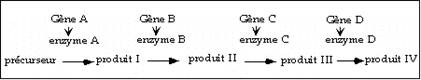

# LES INTERACTIONS GENIQUES 

## LA SUPPRESSION

### Mise en évidence

Exemple 1

Chez la drosophile une mutation dans le gène vg à l’état homozygote entraîne la formation d’ailes vestigiales. Ce gène est situé sur le chromosome II. On entretient un stock de mouches (par transfert périodique sur milieu neuf) où mâles et femelles sont homozygotes. On voit apparaître un jour dans le stock une mouche à ailes normales.
On la croise avec une mouche homozygote sauvage vg+ : on obtient en F1 des mouches à ailes normales et en F2 :

- 13/16 de mouches à ailes normales
- 3/16 de mouches à ailes vestigiales.

Interprétation :

Puisqu’on voit réapparaitre en F2 des mouches à ailes vestigiales dans la proportion de 3/16, on peut en conclure que chez la mouche à aile normales apparue dans le stock, la mutation dans le gène vg existait toujours mais que son phénotype était masqué à cause d’une seconde mutation, qu’on qualifie donc pour cela de suppressive. Ce résultat invalide donc l'hypothèse d'une simple réversion d'un des deux allèles mutants vg vers l'allèle sauvage vg+.

Le génotype de la mouche à ailes normales apparue dans la lignée de mouches à ailes vestigiales est donc : homozygote pour la mutation vg et en plus homozygote pour une mutation dans un gène qu’on appellera su(vg). L’addition des deux fait que le phénotype mutant est supprimé : les ailes redeviennent normales. Le croisement précédent s’écrit alors :

vg/vg su/su      X     vg+/vg+ su+/su+
ailes normales         ailes normales
double mutant

En F1 le génotype des mouches est :

vg/vg+, su/su+

Toutes les mouches ont les ailes normales : la mutation su est donc récessive, tout comme la mutation vg.
En F2, on écrit la ségrégation normale de deux couples d’allèles :

- 9/16 de mouches ayant au moins un allèle sauvage pour chaque gène, donc ailes normales
- 3/16 de mouches homozygotes pour vg et homozygotes ou hétérozygotes pour su+, donc ailes vestigiales : c’est la proportion que l’on trouve.
- 3/16 de mouches homozygotes pour su et homozygotes ou hétérozygotes pour vg+, il faut en conclure qu’elles ont des ailes normales.
- 1/16 de doubles homozygotes vg su donc ailes normales parce que le phénotype est supprimé par l’addition des deux mutations.

Total : 13/16 de mouches à ailes normales et 3/16 à ailes vestigiales ce qui correspond à l’observation expérimentale. 

On voit ici nettement que la mutation su n’est pas liée à la mutation vg , puisqu’on a une ségrégation parfaitement indépendante des deux couples d’allèles. su(vg) est un allèle d’un nouveau gène, qui est situé sur le chromosome III. 

On peut également remarquer que cette mutation suppressive ne confère pas, par elle-même, de phénotype mutant dans l'aile à l’état homozygote : les 3/16 de mouches vg+ su/su ont des ailes normales. 

Généralisation

Il arrive fréquemment que la mutation suppressive à l’état homozygote ne donne pas de phénotype mutant, mais pas toujours. Il existe des allèles supresseurs qui donnent un phénotype mais souvent leur phénotype n’a rien à voir avec celui donné par la première mutation.

Exemple: la souche de coli suppresseur d'ambre (suppresseur du non sens UAG) présente une croissance lente (cf exercice de TD).

Parfois, il a un phénotype voisin (voir ci-dessous les complexes multiprotéiques ou les voies régulées). 

Il arrive fréquemment aussi que le phénotype de la première mutation soit seulement partiellement supprimé par la seconde. Ce qui veut dire que le double mutant n’a pas récupéré un phénotype complètement sauvage.

Exemple 2 :

Chez la drosophile, la mutation white-apricot (wa) donne des yeux orange très clair : cette mutation est due à l'insertion d'un transposon copia dans un intron du gène white porté par le chromosome X (cf exercice de TD). Après mutagénèse à l'EMS de femelles wa/wa on croise individuellement les survivantes avec des mâles de génotype wa/Y. Dans la progéniture d'un des croisements on trouve un mâle à oeil brun: la couleur de l'oeil n'est pas redevenue sauvage (rouge brique) mais elle est cependant beaucoup plus foncée que chez le mutant wa/Y.

### Quelles hypothèses peut-on faire pour expliquer ce résutat?

Le phénotype n'est pas redevenu complètement sauvage donc on peut exclure l'hypothèse d'une réversion de la mutation wa par excision parfaite du transposon copia. On peut envisager:

1. une excision de copia imparfaite, laissant une trace dans le gène white . On aurait donc un nouvel allèle mutant waR, de phénotype atténué, brun au lieu d'abricot;
2. une suppression mais seulement partielle, l’addition d'une mutation suppressive su(wa) à la mutation d'origine wa rendrait les yeux bruns mais pas complètement sauvages.

Pour choisir entre les deux hypothèses on croise le mâle aux yeux bruns, d'abord avec des femelles wa/wa (croisement 1) puis avec des femelles sauvages w+/w+ (croisement 2).

On observe que:

- toute la progéniture du croisement 1 a des yeux de couleur abricot.
- les mouches de la F1 du croisement 2 sont de phénotype sauvage ; en F2 du croisement 2 on trouve:

    - 306 femelles à oeil sauvage,
    - 148 mâles à oeil sauvage,
    - 145 mâles à oeil brun
    - et 3 mâles à oeil abricot.

Le fait que l'on retrouve des mouches à oeil abricot dans la F2, qui sont donc de génotype wa/Y, permet d'exclure l'hypothèse 1: on a donc affaire à une suppression partielle. Le mâle aux yeux bruns a donc pour génotype soit :

- wa/Y, su(wa)/su(wa)+ et la mutation suppressive est autosomale et dominante ou
- wa, su(wa)/Y et la mutation suppressive est portée par le chromosome X et récessive.

Le croisement 1 montre que la mutation su(wa) est récessive donc portée par le X. La progéniture en F2 du croisement 2 montre que les mutations wa et su(wa) sont liées : fréquence de recombinaison 3x4x100/(306+148+145+3)= 2cM. On remarque de plus que les mâles recombinants de la F2 de génotype w+, su(wa)/Y ont un phénotype indistingable des sauvages, d'où l'on conclut que la mutation su(wa) par elle-même n'a pas de phénotype mutant dans l'oeil.

On vient de voir deux cas de mutations suppressives récessives, mais il existe aussi des mutations suppressives qui sont dominantes (voir ci-dessous l'exemple de la mutation SosJ).

Remarque :

Dans les deux exemples ci-dessus on avait affaire à une suppression extragénique : deux gènes différents sont mutés dans l’organisme qui a un phénotype supprimé. Cependant la suppression intragénique existe : une première mutation crée un phénotype, une deuxième mutation survient dans le même gène qui supprime le phénotype. Dans ce cas les deux mutations sont étroitement liées et après croisement avec un individu sauvage la descendance en F2 sera entièrement normale sauf si l’on compte assez d’individus pour obtenir des crossing overs intragéniques qui séparent les deux mutations. On voit donc qu’il sera difficile de distinguer génétiquement une suppression intragénique d’une simple réversion de la première mutation.

Très souvent pour faire la preuve définitive de l’existence soit d’une mutation suppressive intragénique soit d’une simple réversion il faudra cloner le gène mutant de la souche supprimée et comparer sa séquence avec celle du gène sauvage.

Les suppresseurs intragéniques permettent d’avoir des informations sur les relations structure-fonction à l’intérieur d’un même gène ou d’une même protéine, mais elle ne permet pas d’identifier de nouvelles protéines. Au contraire, les suppresseurs extragéniques ont été étudiés de façon extensive car ils sont des outils exceptionnels pour établir que des relations fonctionnelles existent entre deux protéines et donc pour décortiquer des voies métaboliques. Donc une bonne part du travail du généticien qui étudie un gène et sa fonction consistera à isoler et à caractériser des suppresseurs du phénotype des allèles mutants de son gène préféré.

### Les différents modes de suppression

#### Suppresseur informationnel (agit au niveau de la traduction)

Ce sont les suppresseurs de non sens ou de faux sens causés par une mutation dans le gène d’un tARN (voir cours de Biologie moléculaire). Ce type de suppresseur est allèle spécifique mais non gène spécifique. 

Exemple : 

Chez E. coli une mutation dans un suppresseur d’ambre supprime spécifiquement l’arrêt de traduction du à l’apparition d’un codon UAG, en introduisant à la place un tryptophane : la mutation su est spécifique du codon UAG. La mutation suppressive est située dans le gène codant pour l'ARNtTrp au niveau de l'anticodon (changement de 5' CCA, anticodon normal qui reconnait le codon UGG, en 5' CUA qui est complémentaire du codon stop UAG). Cette mutation su supprimera aussi bien le phénotype lac- causé par l’apparition d’un codon UAG dans la séquence codante de lacZ , que le phénotype trp- causée par cette même mutation dans la sous-unité a de la tryptophane synthétase. De même cette même mutation su introduit un Trp dans une protéine, que la mutation (l'allèle muté) initiale soit le remplacement d'un codon CAG (Gln) ou UAC (Tyr) par exemple, par un codon ambre.

Cette classe de suppresseurs a permis de mettre en évidence et d’étudier avec beaucoup de détails le mécanisme de la traduction (cf cours de biologie moléculaire).

On trouve également dans cette catégorie de suppresseurs, les mutations situées dans des gènes codant une protéine ribosomale, un ARN ribosomal ou un facteur d’élongation ou de terminaison de la traduction. Ces mutations permettent à la traduction de se poursuivre en s’adaptant à une première mutation qui a elle seule l’empêcherait. Elles peuvent ainsi supprimer des mutations de décalage du cadre de lecture.

Par exemple chez la levure la mutation mim1 localisée dans le gène codant pour l’ARN 23S de l’appareil de traduction mitochondrial supprime les décalages de +1 nucléotide.

#### Suppresseur agissant au niveau de l’expression d’un gène

Si une mutation diminue l’expression d’un gène, donc la quantité finale de protéine active synthétisée, on peut imaginer qu’une deuxième mutation qui augmente l’expression compense l’effet de la première.
La mutation suppressive peut agir à différents niveaux :

- mutation dans le promoteur (agissant en cis sur le même gène donc c’est une mutation suppressive intragénique),
- mutation dans la machinerie de transcription qui la rende plus active, ou dans celle de maturation de l’ARNm qui rende l’épissage des introns plus efficace,
- mutation qui augmente la stabilité de l’ARNm ou de la protéine, en diminuant leur turn-over,
- duplication du gène mutant.

Cette classe de suppresseur permet d’identifier soit des régulateurs spécifiques d’un gène donné ou le plus souvent des gènes intervenant dans les processus généraux de l’expression génique.

Exemple chez la drosophile:

La mutation su(Hairy-wing) supprime le phénotype “ hairy wing ” mais aussi 15 autres mutations, toutes spontanées, situées dans 11 loci différents. Elle n’est donc pas gène-spécifique. Plusieurs allèles spontanés du gène Bithorax , suppressibles par su(Hw) , ont été clonés. Ils tous ont révélé l’insertion dans un intron d’un élément transposable de 7,3kb, nommé gypsy. On procède à un test d’hybridation in situ sur les chromosomes polytènes des glandes salivaires des 15 souches mutantes suppressibles par su(Hw) (et en particulier la souche homozygote pour l’allèle Hairy-wing mutant lui même), avec une sonde gypsy : toutes montrent une hybridation spécifique de la sonde dans la région où se trouve le gène muté (voir exercice de TD sur la mutation white-apricot).
On a ici encore un exemple de suppression allèle spécifique et gène non spécifique.

Mode de suppression : la mutation suppressive a lieu dans un gène qui code pour un répresseur d’épissage des introns. Si celui-ci est inactif l’épissage des introns rallongés par l’insertion de gypsy est amélioré.

Exemple chez C. elegans :

Le gène unc54 code pour la myosine (protéine musculaire). Un allèle mutant de ce gène à l’état hétérozygote conduit à la paralysie du ver. La mutation est dominante et on a des raisons de penser que l’allèle muté empoisonne l’allèle sauvage. On a isolé un suppresseur chez lequel on a montré que le gène sauvage unc54 était dupliqué : on a donc 2 copies de l’allèle actif et une copie du gène muté (poison) qui doit titrer une dose de la protéine active seulement.

#### suppresseur agissant au niveau de l’activité de la protéine

Si une première mutation diminue l’activité spécifique d’une protéine, une mutation suppressive pourra intervenir pour l’augmenter. Certaines suppressions intragéniques entrent dans cette catégorie.
Mais on peut envisager un autre mécanisme si les deux mutations affectent deux protéines qui forment un complexe par des contacts protéine-protéine (par ex deux sous-unités d’une même enzyme codées par des gènes différents, ou bien deux protéines intervenant dans un complexe pluriprotéique).

Scénario : la première mutation dans une première protéine, change un acide aminé impliqué dans un contact avec une protéine partenaire et ce contact est détruit, le complexe est inactif ; le contact est rétabli par un changement chez la partenaire au niveau de l'acide aminé impliqué dans le même contact. Ce genre de mécanisme de suppression fonctionnelle est très important pour mettre en évidence les partenaires fonctionnels d’une protéine.

De tels suppresseurs sont allèle-spécifiques et gène spécifiques.

Exemple des mutations act1 et sac6 chez la levure (dans ce cas il y a suppression mutuelle) : 

La mutation thermosensible act1, dans le gène codant l'actine du cytosquelette, se traduit par une absence de croissance à 37°C. Ce phénotype est supprimé par une seconde mutation, thermosensible elle aussi, dans le gène sac6 qui code la fimbrine, protéine qui se lie aux filaments d'actine pour former des faisceaux. La mutation act1 a lieu dans le domaine de contact avec la fimbrine ce qui diminue l'affinité de la liaison. La mutation suppressive sac6 permet de créer un nouveau contact entre les deux protéines et de restaurer l'interaction, visible par la formation de faisceaux in vitro après mélange des protéines mutées (cf exercice de TD).

#### suppresseur agissant sur la même voie de régulation (suppression par épistasie)

De nombreux processus biologiques sont régulés: cela fait intervenir des protéines qui sont activées séquentiellement, en "cascade", pour aboutir finalement à l'activation ou l'extinction de l'expression de gènes cibles.

La mutation suppressive agit en altérant l’activité soit d’un répresseur soit d’un activateur de la voie à une étape différente de la première mutation.
Ceci permet d’identifier et d’ordonner des partenaires agissant dans la même voie de régulation à des étapes différentes. On a une suppression qui est gène spécifique et parfois allèle spécifique.

Exemple:

sevenless et le développement du photorécepteur R7 chez la drosophile.

Les yeux des drosophiles sont composés d’yeux élémentaires appelés ommatidies. Chacune est composée de 8 photorécepteurs reliés au cerveau et sensibles à certaines longueurs d’onde lumineuses. La différenciation de ces cellules photoréceptrices se fait à partir d'un épithélium indifférencié: par exemple dans l'une d'elles vont être activés certains gènes qui vont aboutir à la différenciation de cette cellule en phorécepteur R7, sensible aux radiations UV. Le gène sevenless est impliqué dans ce processus: la mutation sevE4, faux-sens, entraine l'absence de développement du photorécepteur R7 ce qui se traduit phénotypiquement par un oeil irrégulier, “rugueux ”, et une absence de sensibilité aux rayons UV. Le gène sev est situé sur le chromosome X.

On a isolé une mutation suppressive de ce phénotype de la manière suivante:
On mutagénise des mâles sevE4/Y à l’éthyl méthane sulfonate et on les croise avec des femelles sevE4/sevE4. Dans la progéniture on sélectionne les mâles ayant les yeux normaux.

En effet, les mâles en F1 tiennent leur X de leur mère qui n’a pas été mutagénisée et donc sont sevE4/Y. S'ils ont récupéré un oeil normal c'est qu'une mutation suppressive dominante est apparue sur un autosome dans un gamète, après mutagénèse chez le père. En effet la simple réversion de sevE4 vers sev+ se verrait, par apparition d'yeux normaux, seulement chez les femelles.

On obtient ainsi un mâle chez lequel 36% des ommatidies contiennent un R7 fonctionnel. Il s'agit donc d'une suppression partielle. La nouvelle mutation, localisée sur le chromosome 2 est nommée Son-of-sevenless J (SosJ). Par construction c'est un suppresseur dominant. Par construction toujours, le produit Sos intervient après sevenless dans le développement de R7: en effet la mutation SosJ permet d'outrepasser l'absence d'activité de sevenless. Cela peut se comprendre de la manière suivante: la mutation sevE4 entraine que la protéine activée par Sev ne l'est plus et la voie de détermination de R7 est bloquée; si la protéine mutée Sos (allèle SosJ), agissant quelquepart en aval de Sev est toujours activée (la mutation SosJ est dominante), alors la voie est remise en route à son niveau et R7 est formé, sans que l'activité de la protéine Sev soit requise. 

SoSJ ne supprime pas 14 autres allèles perte-de fonction de sev: la mutation SoSJ est donc allèle spécifique. Les mouches SosJ/+ ont un phénotype sauvage donc la mutation n'a pas par elle-même de phénotype dominant dans l'oeil.

Remarque: Notons qu'on pourrait expliquer la suppression par un tARN, suppresseur de faux-sens. Mais si c’était le cas la mutation suppressive devrait supprimer des faux-sens identiques situés dans d'autres gènes que sev. Or ce n’est pas le cas : la mutation SosJ est spécifique du gène sev. De plus on sait maintenant que SosJ code une protéine homologue de Cdc25, protéine de levure impliquée dans le cycle cellulaire.

Dans une voie métabolique lorsqu’on a une succession séquentielle d’étapes, la mutation suppressive est située dans un gène intervenant en aval si la régulation est positive. Au contraire dans le cas d’une régulation négative, faisant intervenir un répresseur, la mutation suppressive d’un allèle nul se situe dans un gène en amont.

Quand deux mutations causent des phénotypes opposés et que l’une supprime le phénotype de l’autre on parle de suppression par épistasie et le phénotype observé chez le double mutant (qui donc n’est pas sauvage) est celui de la mutation dite épistatique (voir cours sur l’épistasie).

Un cas particulier de ce mode de suppression est la suppression d'un phénotye mutant par surexpression d'un gène sauvage.

Exemple:

Chez la levure S. cerevisiae, une cellule haploïde de génotype MATa peut se conjuguer avec une cellule de génotype MATa pour former un diploïde MATa/MATa. Un tel diploïde est capable de sporuler en milieu carencé alors qu'un diploïde mutant mata/MATa (ou l'inverse) muté dans le gène MATa ne le peut pas. On peut obtenir la suppression de ce phénotype mutant en transformant le diploïde mutant par un plasmide multicopie portant le gène IME1 sauvage. L'explication est la suivante: pour déclencher la méiose le complexe protéique a/a est requis, à son tour il va activer le gène IME1 (inducteur de méiose) qui à son tour active des gènes cibles spécifiques; si le gène sauvage IME1 est présent en 25 ou trente copies au lieu de 2, la transcription basale, même très faible, de ce gène suffit pour pour accumuler suffisamment de protéine pour déclencher la méiose (cf exercice de TD).

#### Suppresseur agissant sur une voie parallèle

Une mutation qui inactive une voie peut être supprimée par une deuxième mutation qui active une voie parallèle.

Exemple classique chez E. coli: 

Une mutation dans la maltose perméase rend la bactérie incapable de croître sur maltose. Un suppresseur a été isolé, qui présente une mutation qui modifie la spécificité de la lactose perméase, laquelle devient capable de transporter le maltose (alors que la lactose perméase sauvage en est incapable, les voies d’entrée de ces deux sucres sont indépendantes).

Exemple chez la levure :

Deux gènes codent chacun un cytochrome c. CYC1 code l'iso1cytc qui représente 90% du cytc en cellule et CYC7 code l'iso2-cytc qui représente les 10% restants. Une mutation nulle dans CYC1 provoque un retard de croissance sur milieu glucosé (mais un phénotype glycérol+). On connait une mutation suppressive qui supprime ce phénotype et restaure une croissance normale : il s’agit d’une mutation dans CYC7 qui multiplie par 18 l'expression de l'iso2cytc (cette mutation est une insertion d'un transposon Ty1 à 240bp en amont de la phase codante). 

#### Suppresseurs bizarres 
(cf exercice TD sur le facteur PSI chez la levure).
 
## L’ACCENTUATION

### Définition

A l’inverse des suppresseurs il existe des cas ou une deuxième mutation, au lieu de supprimer le phénotype mutant causé par une première mutation, l’aggrave. On parle alors de mutations d’accentuation ( “ enhancer ” en anglais).
Par exemple si on trouve dans un stock de mouches homozygotes pour une certaine mutation, une mouche de phénotype aggravé, et qu’on la croise avec une mouche sauvage, on aura toujours en F1 toute la descendance sauvage mais en F2 on aura les proportions :

- 12/16 sauvage (décomposés en 9/16 portant au moins un allèle sauvage de chacun des deux gènes et 3/16 homozygotes pour la mutation aggravante si elle n’a pas par elle même de phénotype)
- 3/16 mutant (homozygote pour la première mutation) 
- 1/16 aggravé correspondant au double homozygote .

Fréquemment le phénotype du double homozygote est tellement aggravé qu’il devient létal : on parle alors de colétalité. 

On peut avoir le cas suivant :
Une mutation nulle dans un gène A donne un phénotype faible voire aucun phénotype mutant, l'homozygote est parfaitement viable. De même dans un gène B. Mais le double mutant homozygote montre un phénotype mutant très net parfois même létal.

### Interprétation

1. si les 2 gènes agissent dans des voies parallèles .

Le manque de A arrête la première voie et reporte tout le métabolisme sur la seconde qui la remplace. Si B manque à son tour alors le processus est complètement arrêté et on observe un phénotype mutant.
On voit que ceci est exactement l'inverse de la suppression observée par renforcement d'une voie parallèle.

Exemple: 

Chez les mammifères le gène myoD code pour un effecteur déterminant la différenciation musculaire chez des cellules en culture. Cependant une mutation nulle dans le gène myoD de la souris ne provoque pas de désorganisation du système musculaire: la souris homozygote mutante est viable, fertile et elle développe des muscles. Même effet pour un autre effecteur musculaire, myf5. En fait on voit que chez les souris homozygotes mutantes pour myoD l'expression de myf5 est très élevé et réciproquement. Il y a donc redondance entre les deux produits qui peuvent se remplacer l'un l'autre. En revanche, le double mutant myf5, myoD est létal.

2. Si les deux gènes agissent séquentiellement sur la même voie. 

Une réduction de A ou B par une mutation de perte de fonction partielle donne un phénotype léger, l'addition des deux donne un phénotype aggravé voire létal si les gènes sont essentiels.
On remarque que ceci est l'inverse de la suppression par épistasie.

Exemple:

Chez la drosophile un allèle mutant du gène sevenless, sevB4, donne des photorécepteurs R7 normaux à 22°C mais plus de R7 à 24°C (œil rugueux). Cela signifie que la voie de détermination de R7 fonctionne au minimum. On mutagénise des mâles sevB4 /Y et on les croise avec des femelles sevB4. On sélectionne les mâles de la F1 qui ont perdu leurs R7 même à 22°C (œil rugueux) donc un phénotype aggravé. Chez ces mâles on a donc cohabitation d'une mutation hémizygote sevB4 et d'une mutation aggravante hétérozygote E(sev) située dans un gène autosomal. La mutation E(sev) est dominante: pourtant c'est une mutation de perte de fonction. Il faut donc en conclure que le fait de diviser par 2 la dose de la protéine E(sev) suffit pour arrêter la voie de détermination de R7 à 22°(par haploinsuffisance de l'allèle sauvage). 

Par cette méthode on sélectionne:

- d'une part des mutations dans les systèmes généraux de traduction ou de transcription qui diminuent la quantité de protéine Sev: ceux-là ne nous intéressent pas car, par eux-mêmes, ils ne donnent pas de phénotype spécifique dans l'œil;
- d'autre part des mutations dans des locus qui par eux-mêmes donnent un phénotype spécifique dans l'œil. Ceux-là sont intéressants.

On récupère ainsi 20 mutations "Enhancer-of-sevenless" regroupables par tests de complémentation dans 7 gènes différents. Toutes sont récessives létales et n'auraient pu être sélectionnées par un autre moyen pour leur intervention dans le développement de l'œil. Ces gènes interviennent en aval de sev dans la voie de transduction du signal pour la détermination de R7. L'un d'eux est Sos: on s'y attendait. Notons toutefois que dans le cas du crible par suppression on a isolé un allèle de Sos toujours activé (gain-de-fonction) alors que dans le cas du crible d'accentuation on a isolé un allèle perte-de-fonction. Un autre gène aussi caractérisé dans ce crible est Ras, gène majeur impliqué dans les voies de transduction du signal de nombreux organismes depuis la levure jusqu'aux mammifères (cf cours de maitrise).

3. Si les deux gènes donnent des produits qui intéragissent entre eux, par exemple dans un complexe actif hétérodimérique.

Une mutation peu sévère, hypomorphe, dans l’une ou l’autre des protéines fait que le complexe remplit un peu moins bien sa fonction mais c'est peu visible phénotypiquement. En revanche l'addition des deux mutations hypomorphes rendra le complexe inactif: phénotype accentué parfois létal si la fonction est essentielle. L'ensemble des deux mutations équivaut à une mutation nulle (inaptitude du complexe protéique à remplir sa fonction).

Exemple:

Chez la levure une mutation thermosensible (ts1N) dans le gène CDC28 provoque un arrêt de la division cellulaire à 36°C mais la souche croit à peu près normalement à 28°C. Une mutation nulle dans un gène codant pour une cycline, CLB1 , n’a aucun phénotype mutant. La souche portant les deux mutations devient létale à 28°C par arrêt de la division cellulaire : en effet les deux protéines Cdc28 et la cycline Clb1 intéragissent en complexe pour déclencher la mitose .

### Applications

Tout comme on se sert de la suppression on peut se servir de cette propriété de colétalité ou d'accentuation du phénotype pour cribler de nouveaux mutants affectés dans des gènes intéragissant avec un premier allèle mutant .

Exemple:

Chez la levure S. cerevisiae la division mitotique se fait par bourgeonnement; la mutation cdc24ts, provoque un arrêt de la division à 36°C, par non formation du bourgeon. Le gène MSB1, situé sur un plasmide multicopie, a été sélectionné à partir d'une banque de plasmides, sur la base de la suppression du phénotype causé par mutation cdc24ts : en présence de ce plasmide la cellule se divise à 36°C. Le gène MSB1 semble donc impliqué dans la formation du bourgeon. Pourtant, une délétion du gène résident MSB1 dans la levure ne produit aucun phénotype. Pour mieux comprendre le rôle de MSB1 on veut identifier de nouveaux gènes dont les produits intéragiraient avec le produit de MSB1 pour la formation du bourgeon. 

On opère de la façon suivante: 

On part d'une souche haploïde msb1 (mutation nulle), ade2, ade3 , transformée avec un plasmide portant les allèles sauvages ADE3 , MSB1. 

La souche est auxotrophe pour l'adénine car elle est ade2 et donne alors des colonies rouges par accumulation d'un produit intermédiaire coloré. Sans pression de sélection, c’est-à-dire en présence d’adénine dans le milieu de culture, le plasmide peut être perdu de temps en temps par une cellule: elle devient alors ade2 ade3 et elle est blanche. Bien qu'ayant perdu l'allèle MSB1 sauvage elle est parfaitement viable puisque la mutation msb1 n'a pas de phénotype. Sur boite cela se traduit par des colonies rouges présentant des secteurs blancs. 

On mutagénise cette souche, on étale les survivants sur boite en présence d'adénine. Chaque cellule survivante étalée donne naissance à une colonie qui est rouge si les cellules portent toujours le plasmide. On sélectionne les colonies qui n'ont pas de secteurs blancs: ce seront celles chez qui la perte du plasmide (donc la perte de l'allèle sauvage MSB1) provoque un phénotype létal. Cela se produit si l'addition d'une nouvelle mutation x à la mutation msb1 cause la létalité.

On sélectionne ainsi deux nouvelles mutations située dans deux gènes BEM1 et BEM2. Après ségrégation des mutations msb1 et bem, on observe que les cellules mutantes pour bem1 ou bem2, (dans un contexte MSB1 sauvage) sont viables mais présentent des défauts dans la croissance : cellules multinuclées donc processus de division cellulaire peu efficace. On peut penser que l'émergence du bourgeon est affectée. 
On voit que genre de crible permet de trouver des partenaires d'une protéine agissant dans un processus complexe.
 
## L’EPISTASIE

### Mise en évidence

Couleur du pelage chez la souris

On croise des souris blanches de génotype ca/ca avec des souris noires de génotype a-/a-. Les deux mutations sont récessives.
En F1 on n'obtient que des souris sauvages (brun lustré) par complémentation. 
On croise les descendants de la F1 entre eux. On attend en F2:

- 9/16 de sauvages (homozygotes sauvages ou hétérozygotes pour les deux gènes)
- 3/16 de noires car a-/a-.
- 3/16 de blanches car ca/ca.
- 1/16 d'homozygotes mutantes pour les 2 gènes, a-/a-, ca /ca .

La théorie ne donne aucune clé pour prédire la couleur du pelage des souris double mutantes. En effet dans le cas ou les deux mutations affectent des fonctions différentes (par exemple poil noir ou poil frisé chez les simple mutants) le phénotype des souris double mutantes sera l'addition des deux phénotypes mutants: poil noir et frisé. Ici, comme les deux gènes sont impliqués dans la même fonction, à savoir la couleur du poil, il faut s'en tenir à l'expérience: on obtient 4/16 de souris blanches ce qui montre que la couleur des double mutants est blanche comme celle des simples mutants ca /ca .
On dit que la mutation ca, qui impose son phénotype chez le double mutant, est épistatique sur la mutation a-.

Ordre d'intervention des produits des gènes dans l'établissement du phénotype

Exemple de la synthèse d'un pigment par une voie métabolique:

Une mutation nulle dans le gène D conduit à l’absence d’enzyme D fonctionnel donc à l’absence de pigment et à l’ accumulation de l'intermédiaire III.

Une mutation nulle dans A donne absence d’enzyme A, pas de pigment et accumulation de précurseur.

Chez le double mutant A-D-, il n’y a pas de de synthèse de pigment et une accumulation de précurseur donc le phénotype du double mutant sera le même que celui du mutant A-: la mutation épistatique A- est située dans le gène amont.

Peut-on généraliser?

Ce résultat est applicable dans le cas du pelage de la souris décrit ci-dessus. Le gène c code pour la tyrosinase, 1er enzyme de la chaine de biosynthèse des mélanines. En son absence pas de pigment: phénotype albinos.

Agouti code pour une protéine qui permet la distribution dans le poil du pigment jaune à un moment précis de la croissance du poil. En son absence le poil est entièrement noir.
Chez le double mutant il est aisé de comprendre que le poil sera blanc, puisque c- affecte une voie commune aux 2 pigments a- une voie particulière au pigment jaune. Il est donc normal que la mutation épistatique qui impose son phénotype soit située dans le gène c qui est le plus en amont.

Mais ceci n’est pas généralisable mécaniquement. 

Voyons le cas des yeux de la drosophile : ils sont colorés par deux pigments, un rouge et un brun ; l’œil sauvage est rouge brique. Les mouches mutantes pour white ont les yeux blancs et les mouches mutantes pour rosy ont les yeux rouge vineux. Les doubles mutants homozygotes w-, ry- ont les yeux blancs. La mutation w- est donc épistatique sur la mutation ry-. Cependant le produit du gène white intervient en aval de Rosy.
Ceci provient du fait que la protéine White a pour fonction de déposer les 2 pigments dans l'oeil: en son absence l'oeil est blanc. La mutation w- affecte une voie commune aux 2 pigments, en aval, ry- affecte la voie particulière de la synthèse du pigment brun, en amont.

On voit donc qu’il est nécéssaire de connaître assez précisément la nature des processus biologiques en cause pour pouvoir interprêter les relations d’épistasie.

Par exemple si on sait que les 2 mutations affectent une voie métabolique unique on pourra conclure que la mutation épistatique est dans le gène amont.

Si la voie métabolique est branchée la mutation épistatique sera dans le gène qui est dans la partie commune.

### Groupe d'épistasie

C’est une méthode génétique employée pour classer des allèles mutants ayant un phénotype semblable.

Exemple: la classification des mutants rad en trois groupes chez la levure.

Après saturation du génome de la levure en mutations créant un phénotype de sensibilité aux radiations UV, on collecte 96 mutants indépendants. 

On commence par les croiser deux à deux pour tester la complémentation. Ceci permet de regrouper les allèles dans 30 groupes de complémentation différents qui correspondent donc en première approximation à 30 gènes différents.

Question : ces 30 gènes interviennent-ils tous dans le même processus de réparation, les uns à la suite des autres, ou bien y-a-t-il plusieurs manières de réparer et les gènes peuvent-ils être regroupés en plusieurs classes recouvrant plusieurs processus différents de réparation?

Pour répondre à cette question on peut faire une analyse d'épistasie.

On construit tous les doubles mutants possibles entre les allèles pris 2 à 2. Ceci suppose donc de croiser deux mutants haploïdes mutés chacun pour un locus différent ; par construction le diploïde est sauvage par complémentation. Après méiose et ségrégation, un quart des spores est double mutante. Si les deux locus sont liés l'analyse est un peu plus compliquée car les doubles mutants ne sont obtenus que par crossing-over donc plus rares.

On mesure la sensibilité aux UV pour chaque simple mutant haploïde et pour le double mutant haploïde :

Si la sensibilité aux UV du double mutant est la même que celle de l'un des deux simples mutants, c'est qu'il y a une relation d'épistasie entre eux, donc qu'ils font partie de la même voie de réparation, dans laquelle ils interviennent séquentiellement.

Si la sensibilité du double mutant est l'addition de celle des deux simples mutants c'est que les deux gènes interviennent dans des processus différents dont les effets sur le phénotype s'additionnent chez le double mutant.

En procédant ainsi systématiquement on est arrivé à classer les 30 gènes dans trois groupes d'épistasie différents. L'un d'eux en particulier, appelé groupe RAD3, regroupe des gènes dont les produits sont impliqués dans la réparation par excision de nucléotides après lésions créées par les radiations.

### Epistasie dans les voies de régulation.

Il est des cas où l’analyse par épistasie, si elle est menée avec certaines précautions, est d’un grand secours pour définir l’ordre d’intervention de deux produits dans une voie de régulation. On entend par là une voie unique dans laquelle interviennent séquentiellement les produits de gènes différents.

Qu’est-ce qu’une voie de régulation ?

Au cours de sa vie, une cellule peut être placée devant un choix entre deux programmes d’expression génétique, en réponse à un signal.

- Exemple I: Régulation du cycle cellulaire chez le diploïde de levure. En milieu riche il se divise par mitose, en milieu carencé le diploïde entre en méiose et sporule. Ceci suppose d’une part que la cellule est capable d’apprécier si le milieu est riche ou carencé (le signal est donc l’état nutritionnel ) et d’autre part que des gènes différents sont exprimés selon que la cellule se divise par mitose ou entre en méiose.
- Exemple II: Mort cellulaire programmée au cours du développement de C. elegans. Suivant sa position et son identité dans le lignage cellulaire, une cellule pourra se différencier ou mourir (apoptose). Il y a donc un contrôle génétique précis de la position d'une cellule ce qui entraine l’induction de l’expression des gènes appropriés menant soit à la différenciation soit à l’apoptose.
- Exemple III: Détermination du sexe somatique chez la drosophile. Selon qu’une cellule possède un ou deux chromosome X elle se différenciera selon un mode mâle ou femelle, donnant ainsi les caractères sexuels secondaires. Il y a donc un contrôle génétique permettant de dénombrer les chromosomes X et d’enclencher le programme d’expression des gènes adéquats.

### Les deux types de régulation

Dans la “ voie de régulation ” plusieurs gènes interviennent séquentiellement pour déterminer le choix du bon programme d'expression génétique. 

Soit deux gènes impliqués dans la voie de régulation. Il n’est pas nécessaire qu’ils interviennent juste l’un après l’autre, il peut y avoir des intermédaires non impliqués dans l’analyse d’épistasie. A l’état sauvage ces gènes vont, sous l'effet d'un signal, donc à partir d'un certain moment, dans certaines conditions, ou dans certaines cellules si on a affaire à un organisme pluricellulaire :

- soit être exprimés s'ils ne l'étaient pas
- soit ne plus être exprimés, s'ils l'étaient.

On distingue deux types de régulation :

La voie de régulation positive :

TODO fig

Le produit du gène amont est un activateur de la voie.

La voie de régulation négative :

TODO fig

Le produit du gène amont est un répresseur de la voie.

Comment reconnaitre une régulation positive d'une régulation négative?
Cela nécessite d'avoir des mutants bien caractérisés c'est-à-dire d'avoir des données sur la nature, perte ou gain de fonction, de ces mutations. Raisonnons à partir des mutations perte-de-fonction qui sont les plus fréquentes.

- Si la régulation est positive, une mutation nulle dans l’un ou l’autre des deux gènes entraine que le programme 1 n’est pas déclanché en réponse au signal comme c’est normalement le cas chez le sauvage: on dit que le phénotype est aboli.
- Si la régulation est négative une mutation nulle dans le répresseur, codé par le gène amont, entraine que le programme 1 est déclanché en l’absence de signal : on dit que le phénotype est constitutif. Au contraire, une mutation nulle dans le gène aval entraine un phénotype aboli.

Comment reconnaître une mutation perte-de-fonction ?
Il faut faire un test de dominance : une mutation récessive par rapport à l'allèle sauvage est une perte-de-fonction.

Attention ! l’inverse n’est pas vrai puisque certaines mutations nulles sont dominantes comme les mutations haploinsuffisantes; c'est aussi le cas des allèles dominants négatifs (antimorphes).

Résumé :

Une mutation perte de fonction dans un gène codant un répresseur entrainera un phénotype constitutif, et dans un gène activateur elle entrainera un phénotype aboli. A l'inverse une mutation gain de fonction entrainera, dans un répresseur un phénotype aboli, et dans un activateur un phénotype constitutif.

| Signal  | Gène amont mutation | Gène aval mutation | Régulation positive Phénotype | Régulation négative Phénotype |
|---------|---------------------|--------------------|----------------------------------|----------------------------------|
| présent | pdf                 | +                  | aboli                            | sauvage                          |
| présent | +                   | pdf                | aboli                            | aboli                            |
| présent | gdf                 | +                  | sauvage                          | aboli                            |
| présent | +                   | gdf                | sauvage                          | sauvage                          |
| absent  | pdf                 | +                  | sauvage                          | constitutif                      |
| absent  | +                   | pdf                | sauvage                          | sauvage                          |
| absent  | gdf                 | +                  | constitutif                      | sauvage                          |
| absent  | +                   | gdf                | constitutif                      | constitutif                      |

Pdf= perte-de-fonction ; gdf= gain-de-fonction

Exemple classique de la régulation de l’opéron lactose par le produit du gène lacI:

- Une mutation lacI- , récessive, entraine une induction de l’opéron lac en absence d’inducteur (de signal). Le répresseur codé par lacI est inactif, (perte de fonction) ce qui entraine une transcription constitutive de l’opéron.
- Une mutation lacIs, dominante, entraine une absence d’induction de l’opéron lac en présence d’inducteur. Le répresseur est toujours actif (gain de fonction) même en présence de l’inducteur, ce qui entraine une abolition de l’induction de l’opéron.

Comment deux mutations différentes dans une même protéine peuvent-elle donner deux effets phénotypiques complètement opposés? En tant que molécule à fonction régulatrice la protéine LacI possède plusieurs domaines ayant des fonctions différentes:

- un domaine de fixation à l'ADN: c'est lui qui est muté chez les allèles de type lacI-, le répresseur ne se fixe plus sur l'opérateur de l'opéron lac et la transcription a lieu tout le temps, c'est-à-dire en absence d'inducteur.
- un domaine de fixation de l'inducteur: c'est lui qui est muté dans le cas de certains allèles de type lacIs, le répresseur n'est plus sensible à l'inducteur et la transcription de l'opéron lac est toujours réprimée.
- un domaine d'intéraction protéine-protéine, puisque LacI est actif sous forme de tétramère. Certains allèles mutés dans ce domaine ne sont plus capables de se fixer sur l'ADN, ils donnent donc un phénotype constitutif, comme les mutants de la première catégorie, mais contrairement à eux ils sont dominants, ce sont des allèles antimorphes ou dominants négatifs (cf travaux pratiques).

### Comment ordonner deux gènes impliqués dans une voie de régulation?

L'épistasie est d'un grand intérêt pour ordonner les gènes dans des voies de régulation pouvant mettre en jeu, en cascade , de nombreux gènes.

Si on possède des mutants affectés dans deux gènes de la voie et ayant un phénotype différent on pourra ordonner ceux-ci dans la voie de régulation.

Il faudra pour cela créer un double mutant, par croisement. Si les mutations sont dominantes il suffit que chaque mutation soit présente à l’état hétérozygote dans le même organisme. Si les mutations sont récessives il faudra créer un double mutant homozygote pour les deux mutations. 

On observe le phénotype du double mutant: la mutation épistatique est celle dont le phénotype l'emporte.

Précautions à prendre

En principe il faut observer un certain nombre de règles pour que le résultat du test d'épistasie permette d'ordonner les deux produits entre eux, sans risque de se tromper :

1. Il faut que les deux gènes interviennent bien sur la même voie et non sur deux voies parallèles. Dans ce dernier cas on le saura, car le phénotype du double mutant n'est pas celui de l'un ou de l'autre mais une addition des deux phénotypes (voir paragraphe sur les groupes d’épistasie).
2. les deux gènes doivent être complètement inactifs chez les deux simples mutants si on a affaire à des pertes de fonction. Donc pas de perte de fonction partielle, pas de mutants hypomorphes.
3. Il faut que le signal et les deux gènes étudiés soient les seuls déterminants du phénotype dans l'expérience: tous les autres gènes sont supposés fonctionner de façon sauvage chez les simples et doubles mutants (règle de simplification).

Démonstration sur quatre cas :

1. Régulation positive, deux mutations nulles dans les gènes amont et aval. Toutes les deux entrainent un phénotype aboli en présence de signal. Chez le double mutant c'est la mutation qui arrête la voie le plus en amont qui impose son phénotype.

2. Régulation négative, deux mutations nulles dans les gènes amont et aval. 
La mutation dans le gène amont entraine un phénotype constitutif en absence de signal. La mutation dans le gène aval entraine un phénotype aboli en présence de signal. Chez le double mutant la première mutation entraine que le gène aval devrait être actif, ce qui n’est pas le cas puisqu’il porte une mutation qui l’inactive : en définitive c’est donc la mutation dans le gène aval qui impose son phénotype.

3. Régulation positive, une mutation nulle dans le premier gène, une mutation gain de fonction dans le second. 
La première mutation entraine un phénotype aboli en présence de signal, et la seconde entraine un phénotype constitutif en absence de signal. Chez le double mutant la première mutation devrait entrainer une absence d’expression du second gène ce qui n’est pas le cas puisqu’il et contitutivement actif. C’est donc la mutation dans le gène aval qui impose son phénotype.

4. Régulation négative, une mutation nulle dans le gène amont, une mutation gain de fonction dans le gène aval. 
Les deux mutations entrainent un phénotype constitutif en absence de signal. Chez le double mutant c’est la mutation dans le gène amont qui impose son phénotype puisque l’addition de la seconde mutation ne change rien au phénotype.

Ces démonstrations peuvent être étendues aux douze autres combinaisons incluant des mutations perte et gain de fonction. On en déduit la règle suivante :

Règle

Si les deux phénotypes observés chez les deux simples mutants sont de même type - tous les deux abolis ou tous les deux constitutifs - alors la mutation épistatique est dans le gène amont. Si les deux phénotypes observés chez les simples mutants sont l'un aboli l'autre constitutif, alors la mutation épistatique se trouve dans le gène aval.

Cette règle peut s’exprimer aussi de la manière suivante, qui est équivalente :
Si c'est le même état du signal qui révèle le phénotype mutant chez les deux simples mutants, la mutation épistatique se trouve dans le gène amont; si c'est un état opposé du signal elle se trouve dans le gène aval.

Exemple 1 : Chez S. cerevisiae :

On a isolé 2 mutants (haploïdes) de régulation de la voie d'utilisation du saccharose comme source de carbone. Normalement, en présence de glucose ou de son analogue non métabolisable le 2-deoxyglucose, la synthèse d'invertase, qui permet d'hydrolyser et donc d'utiliser le saccharose, est réprimée. Il s‘ensuit qu’une souche sauvage est incapable de croître en présence de 2-deoxyglucose et de saccharose comme source de carbone.

- Le mutant snf1- ne peut pas pousser sur saccharose (mais pousse très bien sur glucose). Chez ce mutant le gène codant l'invertase est sauvage.
- Le mutant cid1- pousse en présence de saccharose + 2-deoxyglucose.
- Le double mutant snf1-, cid1- a le même phénotype que snf1-.
- Les deux mutations sont récessives.

Interprétation

1. La mutation snf1- est épistatique.
2. Quelle est la nature des phénotypes?
Il s'agit d'un organisme haploide, le phénotype apparait d'emblée. Dans le cas de la mutation snf1 on a un phénotype aboli. Dans le cas de cid1 on a un phénotype constitutif.
Les deux phénotypes sont opposés chez les simples mutants, on en conclut que la mutation épistatique est dans le gène aval, snf1.
3. Quel est le signal? 
La cellule sauvage doit décider que si le glucose fait défaut, elle met en route l'induction des enzymes du catabolisme du saccharose. Le signal est donc l’ absence de glucose (ou 2-deoxyglucose). 
Pour snf1 c'est en absence de glucose qu'on voit apparaitre le phénotype mutant, pour cid1 c'est en sa présence. C'est un état opposé du signal qui révèle les deux phénotypes mutants, donc la mutation épistatique est dans le gène aval (même conclusion qu'en raisonnant à partir des phénotypes). 
4. Quelle est la nature de la régulation?
On sait que les 2 mutations sont récessives car on a observé que le phénotype des diploïdes snf1-/+ et cid1-/+ était sauvage. Il s’agit donc de 2 mutations perte de fonction. La régulation est donc négative : CID1, actif en présence de glucose, joue le rôle de répresseur de SNF. Chez le mutant cid- le répresseur est inactivé donc la voie d’utilisation du saccharose est induite en présence de glucose (phénotype constitutif). La mutation snf- est une perte de fonction également; donc même en absence de glucose il n’y a pas de synthèse d'invertase.

Résumé

TODO fig

Exemple 2 : Chez la drosophile:

On sélectionne plusieurs mutants qui altèrent la différenciation du photorécepteur R7 de l'oeil de la drosophile.

- Chez le mutant homozygote sevd2 il n'y a plus de R7.
- Chez le mutant homozygote sina il n'y a plus de R7.
- Chez le mutant Ras1Val12/+ il y a plusieurs R7 par ommatidie.
- Chez le double mutant sevd2 /sevd2 , Ras1Val12/+ il y a plusieurs R7 par ommatidie.
- Chez le double mutant sina/sina, Ras1Val12/+ il n'y a pas de R7.
- les 2 mutations sevd2 et sina sont récessives. Une autre mutation connue dans le gène Ras, récessive, conduit à la perte des cellules R7.

Interprétation :

1. La mutation Ras1Val12 est épistatique sur la mutation sevd2 . La mutation sina est épistatique sur la mutation Ras1Val12.
2. Les phénotypes des simples mutants sevd2 et sina sont l'abolition du phénotype sauvage. Le phénotype du simple mutant Ras1Val12 est du type constitutif (plusieurs cellules sont recrutées pour se différencier en R7). Donc dans les deux couples sevd2 , Ras1Val12 ou sina, Ras1Val12 la mutation épistatique est située dans le gène aval. 
On a donc l'ordre suivant : sev, Ras, sina. 
3. Les mutations sevd2 et sina sont des perte-de-fonction. La mutation Ras1Val12 dominante à l'état hétérozygote est-elle un gain-de-fonction? En effet on sait que certaines mutations perte-de-fonction sont dominantes, donc on ne peut pas conclure directement. Cependant on sait qu'un autre allèle de Ras, récessif celui-là, donc perte de fonction, donne le phénotype inverse: on en conclut que l'allèle Ras1Val12 est bien un gain-de-fonction. La régulation est donc positive pour les deux couples de gènes. On a la séquence suivante: sev actif entraine l'activité de Ras qui entraine l'activité de sina.
Dans ce cas les données ne permettent pas de connaitre la nature du signal qui influe sur l'activité de sev.

Exemple 3 : Chez Caenorhabditis elegans :

Le sexe est déterminé par le nombre de chromosome X. Les individus de génotype X0 sont mâles, ceux de génotype XX sont hermaphrodites, c’est-à-dire qu’ils développent à la fois des organes sexuels mâle et femelle.

- Une mutation nulle dans le gène tra1 entraine le développement d’animaux mâles qu’ils soient X0 ou XX.
- Une mutation nulle dans le gène her1 entraine le développement d’hermaphrodites qu’ils soient XX ou X0.
- Le double mutant her1-, tra1- a le même phénotype que le simple mutant tra1-.

Interprétation

1. La mutation tra1 est épistatique.
2. La mutation tra1 ne s’exprime pas chez les individus X0 (qui sont bien normalement mâles) et s’exprime chez les individus XX en empêchant le développement femelle. Le phénotype de tra1 correspond à une abolition du phénotype sauvage chez les XX. 
A l’inverse la mutation her1 ne s’exprime pas chez les individus XX mais s’exprime chez les individus X0 en provoquant un développement femelle. La mutation her1 entraine un phénotype constitutif chez les X0.
On en conclut que la mutation épistatique est située dans le gène aval. 
3. Quel est ici le signal ? C’est le génotype, XX ou X0. 
4. La régulation est négative : her1 joue le rôle de répresseur du développement femelle chez les individus X0.

Résumé

TODO fig