## Le polymorphisme
 

Nous avons vu dans l'introduction que la reproduction est invariante. Cependant, lorsque l'on regarde des individus pris dans la nature, on constate que ceux-ci montrent une certaine variabilité phénotypique. Cette variabilité peut être due à des facteurs environnementaux ou historiques mais elle peut aussi provenir de la présence d'allèles différents de certains gènes.

exemple:

Chez l'homme il existe dans les populations de nombreuses différences héréditaires liées à la présence d'allèles différents de gènes contrôlant des caractères visibles (couleur de la peau, taille, poids etc.) ou invisibles (groupes sanguins etc.).

On dit que les populations présentent un polymorphisme pour les gènes en question. Les gènes sont dits polymorphes (= qui possèdent plusieurs formes).

On peut alors définir les fréquences allèliques des différents allèles du gène qui sont les proportions des différents allèles dans la population. Pour les calculer, il faut estimer les fréquences des différents génotypes et ensuite en déduire la fréquence de chacun des allèles.

exemple:

Dans une population d'esquimaux, le groupe sanguin M/N a été étudié. Ce groupe sanguin possède deux allèles M et N. Les résultats obtenus sont les suivants :

| génotype            | MM    | MN    | NN    |
|---------------------|-------|-------|-------|
| proportion observée | 0,835 | 0,156 | 0,009 |

la fréquence de M = 0,835 + 0,156/2 = 0,913, celle de N = 0,009 + 0,156/2

Ces fréquences sont une mesure du polymorphisme existant pour un gène dans la population. Elles fluctuent en fonction du gène étudiée. Une autre mesure, plus utilisée car elle reflète mieux le polymorphisme, est le % d'hétérozygotes présent dans la population, c'est ce que l'on appelle le taux d'hétérozygotie.

## les moyens d'étude du polymorphisme
 
Il est possible d'explorer le polymorphisme à différents niveaux. Le premier niveau est l'exploration de l'aspect phénotypique que l'on peut apprécier par diverses techniques (observation directe, détection immunologique, etc.). Ce que l'on constate c'est que le polymorphisme est extrêmement variable en fonction du type d'organisme étudié, de la population et du caractère.

exemples:

- Si l'on observe la couleur de la coquille de l'Agropecten irradians, on détecte facilement plusieurs couleurs. Notez la pénétrance variable de l'allèle Pb qui présentent soit une coquille noire soit une coquille jaune et noire.

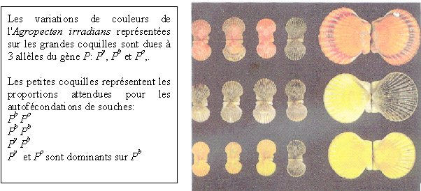

- Si nous reprenons l'analyse des groupes sanguins M/N étendue à plusieurs populations, nous arrivons aux résultats suivants:

| population || genotype       || fréquences allèliques ||
|            | MM  | MN  | NN  | M   | N                 |
|------------|-----|-----|-----|-----|-------------------|
| esquimaux  |0,835|0,156|0,009|0,913|0,087              |
| aborigènes |0,024|0,304|0,672|0,176|0,824              |
| égyptiens  |0,278|0,489|0,233|0,523|0,477              |
| allemands  |0,297|0,507|0,196|0,550|0,450              |
| chinois    |0,332|0,486|0,182|0,575|0,425              |
| nigérians  |0,301|0,495|0,204|0,548|0,452              |

Vous voyez que les populations sont très variables quant à la présence des deux allèles M et N.

- Il est possible de détecter des différences de structure pour de nombreux enzymes en les faisant migrer sur des gels d'acrylamide non-dénaturants. Les enzymes sont ensuite révélés in situ dans le gel grâce à un test coloré: on obtient ce que l'on appelle un zymogramme. Ceci permet de détecter de nombreux polymorphismes qui ne sont pas directement apparents au moment de l'observation macroscopique des individus. Ceci a suggéré que de nombreux polymorphismes sont en fait invisibles et n'entraînent pas de phénotype : Ils seraient donc "neutres" ou "silencieux" d'un point de vue évolutif. Nous allons voir dans les paragraphes suivants qu'effectivement de nombreux polymorphismes sont neutres.

Un second niveau d'observation se situe directement au niveau du matériel génétique. Il est possible de le subdiviser en 3 sous-niveaux d'observations, les chromosomes, des caractéristiques moléculaires de la séquence (sites de restriction, etc.) et enfin la séquence.

I- Dans un premier temps, les chercheurs ont observé les caryotypes des individus d'une même espèce. Ils ont vu que certaines populations naturelles (surtout de plantes) contiennent des modifications de caryotype très importantes: présence de chromosomes surnuméraires, fusion de chromosomes (et réciproquement !), altérations de la structure de certains chromosomes, éventuellement polyploïdie. Nous n'entrerons pas le détail des techniques d'observation car celles-ci relèvent de la cytogénétique.

II- Le deuxième niveau d'accès se fait via l'utilisation de techniques moléculaires qui permettent de détecter de nombreux polymorphismes silencieux ou non. De nombreuses techniques sont disponibles et nous en verrons seulement quelques-unes parmi la panoplie qui est disponible actuellement.

- Le RFLP

Il est possible par exemple pour détecter des polymorphismes de faire des Southern Blots à partir d'ADN provenant de souches différentes et d'hybrider les filtres obtenus avec des sondes appropriées. Des polymorphismes de présence / absence de sites de restriction sont alors détectables.
exemple:

De l'ADN est extrait de 3 populations de Drosophila melanogaster. Les 3 ADN sont digérés par l'enzyme de restriction PstI. Les fragments obtenus sont séparés sur un gel d'électrophorèse. Ils sont ensuite dénaturés et transférés sur une membrane de nylon. La membrane est mise en présence d'une sonde radioactive permettant de détecter le gène Mto qui code pour une petite protéine impliquée dans l'homéostasie des ions métalliques lourds (cuivre, zinc etc.). L'hybridation est faite dans des conditions où l'ADN se "renature". Après lavage du nylon et révélation de la radioactivité sur un film d'autoradiographie, les résultats suivants sont obtenus.

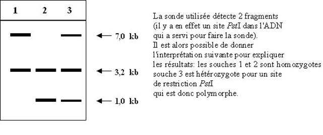

Ceci permet d'établir les cartes de restriction suivantes avec le site polymorphe en rouge:

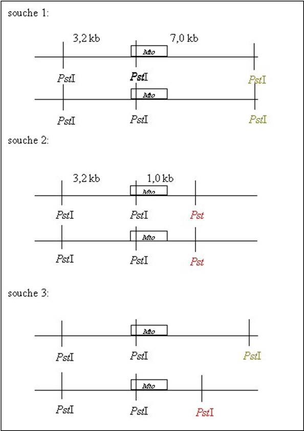

- La PCR et le RAPD

L'utilisation de la PCR du fait de sa rapidité permet de détecter facilement des polymorphismes de taille. En effet, des couples d'amorces permettent d'amplifier des régions données du génome. Celles-ci peuvent contenir des polymorphismes de taille avec des insertions de séquences. Les produits résultant de l'amplification auront alors des tailles différentes (nous verrons ce genre de polymorphisme un peu plus loin : cf. les micro et les minisatellites.
La PCR permet aussi de détecter d'autres polymorphismes plus subtils. Il existe de nombreuses méthodes utilisant la PCR, en voici une : la RAPD (Rapid Amplification Polymorphism DNA).

Pour ceci, il faut utiliser un oligonucléotide d'une dizaine de nucléotides de long. Mis en présence d'un ADN génomique dans des conditions de faible stringence, cet oligonucléotide va s'hybrider avec de nombreuses séquences. L'hybridation est imparfaite mais suffisante pour que les amorces puissent être utilisées par la Taq DNA polymérase:

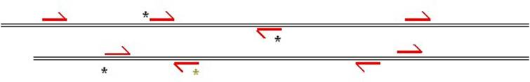

Pour la souche dont l'ADN est schématisé ci dessus, l'amplification par PCR va permettre de faire apparaître un certain nombre de bandes (ici celles générées par les amorces marquées avec une étoile, pratiquement on utilise des conditions qui permettent d'amplifier une dizaine de bandes). L'utilisation de plusieurs oligonucléotides de séquences différentes et des modifications de la stringence permet d'obtenir un profil en "RAPD" des souches. Si des polymorphismes sont présents entre des souches, ces profils pourront être modifiés:

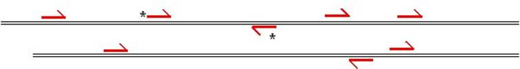

Ici par exemple l'oligonucléotide avec l'étoile verte ne s'hybride plus sur l'ADN d'une autre souche à cause d'une différence de nucléotide. Cela causera l'absence d'une bande après amplification.

Ce type de technique est très utilisé pour "génotyper" des souches. Dans certains cas, les polymorphismes sont associés à des caractéristiques des souches (comme la virulence pour des souches de bactéries ou de champignons pathogènes ou encore la productivité de certaines plantes d'intérêt agronomique, etc.). La photo ci-dessous montre un exemple de RAPD produite à partir d'ADN de souches de la nature de l'escargot, Biomphalaria glabrata, qui sont résistantes (B et 10-R2) ou sensible (M) au ver parasite Schistosoma mansoni (cet escargot est un hôte intermédiaire de ce ver trématode qui infecte aussi l'homme; 600 millions de personnes vivent dans les zones à risque où réside ce pathogène). La flèche montre une différence lié à la sensibilité/ resistance.

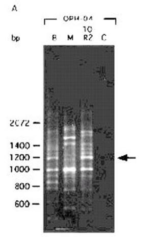

III- Enfin, la détermination directe des séquences d'ADN provenant d'individus ou de souches différentes permet de détecter de nombreux polymorphismes.

exemple:

La protéine P53 est une protéine impliquée dans le contrôle de la prolifération cellulaire et qui empêche la formation de tumeurs cancéreuses (nous verrons ceci plus en détail ultérieurement). Du fait de son implication dans la formation de cancers, les séquences du gène codant cette protéine ont été obtenues chez de nombreux individus. Dans la séquence codante du gène, il a pu être trouvé un certain nombre de polymorphismes (qui n'ont pas d'effet sur le fonctionnement de la protéine bien que certains changent un acide aminé dans la séquence de la protéine). La table ci-dessous donne les variations rencontrées les plus fréquemment.

| N°du codon | nucléotide | acide aminé |
|------------|------------|-------------|
| 213        | CAG ou CGG | Arg         |
| 72         | CGC ou CCC | Arg ou Pro  |
| 47         | CCG ou TCG | Pro ou Ser  |

## Localisation des polymorphismes
 
Les polymorphismes peuvent être localisés dans les gènes. Dans ce cas, ils peuvent avoir des effets sur le fonctionnement des gènes et entraîneront des variations détectables au niveau de l'organisme. Dans d'autres cas, ils n'entraînent cependant aucune modification de fonctionnement et n'auront pas d'effet.

exemple: nous avons vu que le gène codant la protéine P53 possède des polymorphismes nucléotidiques qui ne se retrouvent pas au niveau de la protéine. Il est donc raisonnable de penser que ces polymorphismes n'ont aucun effet phénotypique au niveau de l'organisme. Dans le même gène, il existe d'autres polymorphismes qui modifient le fonctionnement de la protéine. Les porteurs de certains allèles présentent des prédispositions à développer des cancers. 

Les polymorphismes localisés entre les gènes n'auront en général pas d'effet au niveau de l'organisme, sauf s'ils touchent des régions qui régulent l'expression des gènes. 

On admet maintenant que la plupart des polymorphismes présents dans les génomes sont neutres d'un point de vue évolutif, c'est à dire qu'ils n'entraînent ni avantages ni désavantages sélectifs. De fait, ils sont dans la plupart des cas localisés dans des régions qui "ne s'expriment pas" (région intergénique ou intron). Nous reviendrons sur ces problèmes d'effets des polymorphismes dans la section qui traite de la mutation.

## Les différents types de polymorphismes
 
Il existe de très nombreux types polymorphismes. Ce qui suit concerne principalement les polymorphismes qui sont retrouvés de manière abondante dans la nature.

### les modifications ponctuelles

On appelle ponctuelles des modifications qui n'affectent que un ou quelques nucléotides. Ces modifications ne sont en général détectables au niveau de la molécule d'ADN que par séquençage. Ce sont soit des variations de nucléotides (sans changement du nombre de nucléotides) soit des insertions/délétions de 1 ou quelques nucléotides. Elles sont très fréquentes.

Exemple: chez l'homme, deux séquences uniques prises au hasard chez deux individus non apparentés diffèrent en moyenne par une paire de base tous les 100 à 500 nucléotides. 

### les insertions / délétions

Très souvent des séquences diffèrent par la présence d'insertions / délétions de longues séquences d'ADN. Récemment le terme d'indel a été créé pour désigner ces polymorphismes. Ceux-ci sont facilement détectables par Southern blot ou si la taille de la modification est importante, directement sur le caryotype (cf. variations chromosomiques).

Dans la très grande majorité des cas, les indels sont dû à la présence absence de séquences d'ADN mobiles que l'on appelle éléments transposables ou transposons. Ces morceaux d'ADN ont la propriété de pouvoir se répliquer indépendamment du chromosome et de s'insérer à différents endroits du génome. Ils peuvent donc "sauter" d'une région à une autre, ce qui explique le polymorphisme de leur présence ou absence à certains locus.

Suivant les modalités de leur déplacement, on distingue deux grands groupes de transposons

- les transposons réplicatifs où la séquence du transposon se trouve dupliquée. Ces transposons ont donc de grandes capacités d'envahissement des génomes.

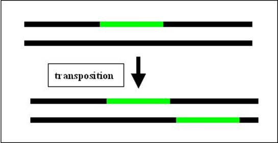

- les transposons conservatifs où le transposon s'excise du fragment d'ADN et se réintègre à un autre endroit. Ces transposons n'ont donc pas a priori des grandes potentialités d'envahissement du génome. Ce qui est important d'un point de vue génétique, c'est que lorsque les transposons de ce type s'excise, suivant le mécanisme mis en jeu, il peut ou non laisser une "cicatrice". La cicatrice est variable en fonction de l'élément et peut aller à quelques nucléotides provenant de l'élément ou d'une duplication de la région où l'élément est inséré.

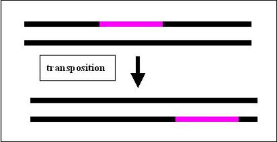

Notez que les transposons sont très répandus :

- chez les mammifères, plus d'un million de transposons sont accumulés dans le génome. Ils représentent 35% du génome humain. Les "rétroéléments" L1 (pour line 1) et Alu sont les plus fréquents.

- chez les plantes, l'accumulation de transposons est extrême puisqu'ils peuvent représenter la fraction majoritaire du génome (60-80%); dans certains cas, comme chez le pin, ils représentent 100 000 MB d'ADN (= 50 X le génome humain !!!).

### Les éléments génétiques extrachromosomiques

Il s'agit des plasmides et autres épisomes. Ces éléments sont surtout présents chez les bactéries où ils confèrent des résistances à divers antibiotiques, mais ils sont aussi détectés chez les eucaryotes. Chez les eucaryotes avec quelques exceptions, ils sont localisés dans la mitochondrie ou le chloroplaste où ils ne semblent pas promouvoir des avantages mais plutôt des inconvénients. Je vous rappelle que les plasmides ont permis le développement de systèmes de manipulation de l'ADN in vitro et de la technologie de l'ADN recombinant en permettant le clonage et l'analyse des gènes. Pour plus de détail, je vous renvoie à vos cours de Biologie Moléculaire. Cette technologie sera considérée comme acquise dans le cas bactérien.

Voici quelques exemples de plasmides et autres éléments génétiques facultatifs

Chez Escherichia coli

ColE1 : Ce plasmide est circulaire double brin. Il fait 9 kb et est présent à 10-30 copies par cellules. Il est connu pour avoir donné son origine de réplication qui est à la base de la majorité des vecteurs que nous utilisons (pBR322, Puc18, pBluescript etc.). Il porte un gène de production de bactériocine (ici la colicine E1) qui est une protéine bactéricide et qui assure donc un avantage aux bactéries qui le portent. Il existe de nombreux autres types de gènes pouvant être portés par des plasmides: gènes de résistance à des antibiotiques, gènes de virulence, gènes d'enzymes de dégradation de substrats divers...).
L'épisome F :Le plasmide F est circulaire double brin, fait 94,5 kb et se trouve à 1 copie par cellule. Il ne porte pas de gène de résistance ou autre mais il code pour de nombreux gènes impliqués dans la formation de contacts entre cellules et du transfert du plasmide pendant la "conjugaison". En effet, on appelle F+ les couches qui portent le plasmide F et F- celles qui ne le portent pas. Les souches F+ ont de long "poils" sexuels qui permettent d'établir des ponts cytoplasmiques avec des souches F-. Après établissement du contact entre une cellule F+ et une cellule F-, le plasmide F est transféré unidirectionnellement de la souche F+ vers la souche F- aboutissant à sa transformation en souche F+. On appelle ce processus conjugaison ou abusivement cycle parasexuel (les F+ sont alors appelées mâles et les F- femelles).

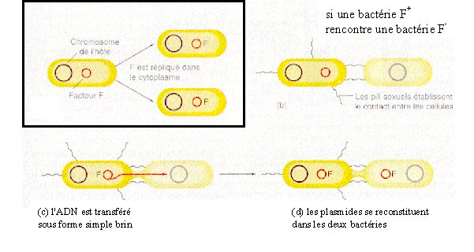

F possède aussi plusieurs régions qui permettent son insertion dans le chromosome: il s'agit donc d'un épisome. Nous verrons comment l'utiliser pour la cartographie de gènes dans la bactérie.

Chez Saccharomyces cerevisiae

2micron : Le plasmide 2micron est circulaire double brin et fait 6,3 kb. Il se trouve dans le noyau de levure à 20/30 copies par cellule. On ne comprend pas bien pourquoi il est maintenu dans les populations car il ne semble pas conférer d'avantage (résistance ou autres) aux souches qui le portent et ne semble pas avoir de système de propagation efficace comme F. Il a servi de base pour générer de nombreux vecteurs pour introduire de l'ADN chez la levure. Le principe général est le suivant:

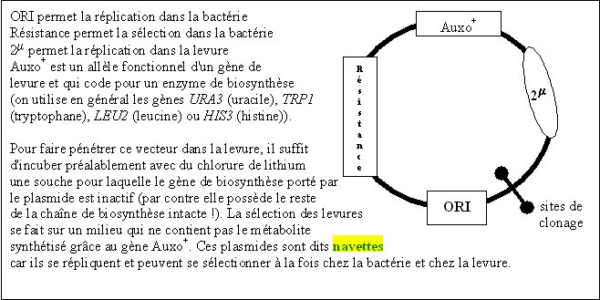

Les virus killer dsRNA : Ce sont des ARN double brin qui sont localisés dans le cytoplasme et qui ont les caractéristiques de virus. On les appelle dsRNA. Ils sont transmis aux cours des générations mitotiques et méiotiques avec une grande efficacité. Ils ne sont jamais extra-cytoplasmiques. Leur statut (éléments infectieux ou partie du patrimoine génétique) est donc fluctuant en fonction des chercheurs. Les souches qui les portent, produisent et sont résistantes à une toxine qui est létale pour les souches qui ne portent pas ces éléments. Il existe plusieurs types de dsRNA.
 
### les mini et les microsatellites

Chez de nombreuses espèces (et en particulier chez les vertébrés), on note la présence de séquences répétées en tandem que l'on appelle satellites car généralement elles ne migrent pas à la même position que l'ADN génomique classique dans les centrifugations en gradients de césium, utilisée pour purifier l'ADN. Ces séquences en général ne codent pour rien (les gènes d'ARN ribosomaux en sont contre exemple). Ce qui est intéressant est que ces séquences présentent le plus souvent une variation du nombre de motifs. Chez l'homme, on distingue particulièrement deux types de séquences en fonction de la taille de l'unité répétée:

Les microsatellites qui ont quelques nucléotides de long (par exemple le dinucléotide CA) 
Les minisatellites qui ont de 10 à 30 nucléotides de long.
On observe que le nombre de répétition de ces séquences est très variable en fonction des individus (de 10 à 60 répétitions pour les micro et de 10 à 300 pour le mini). Micro et minisatellites sont le plus souvent présents en plusieurs copies dans le génome, où ils sont insérés entre des séquences uniques. Ils sont simples à révéler (par PCR pour les microsatellites et par PCR ou Southern Blot pour les minisatellites). Leur extraordinaire variabilité en fait d'excellents outils pour la cartographie, les recherches judiciaires ou de paternité. Dans certains cas cependant, ils sont trop variables et changent entre les parents et les descendants ou même entre les cellules d'un même individu. L'amplification du nombre de ces motifs est à l'origine de certaines maladies chez l'homme.

Voyons pratiquement comment cela marche.

1°) la recherche de paternité
Dans ce cas, les échantillons d'ADN à tester proviennent d'un enfant, de la mère et de un ou plusieurs pères possibles. Les échantillons prélevés sont généralement des volumes sanguins suffisant pour obtenir une bonne quantité d'ADN de bonne qualité qui peut alors être utilisé pour plusieurs analyses de mini et microsatellite. En effet, la taille totale d'un minisatellite est de l'ordre de quelques dizaines de paires de bases à quelques kilobases et l'ADN extrait doit donc être de bonne qualité pour pouvoir les détecter.
- la recherche par PCR s'effectue à l'aide de deux amorces situées de part et d'autre du micro ou minisatellite dans les régions uniques. La taille identique des bandes permet alors de rapprocher le père et l'enfant.
- la recherche par Southern Blot s'effectue après digestion avec un enzyme qui ne coupe pas dans le minisatellite et hybridation avec une sonde qui est dans une des séquences uniques voisines.
Il est évident que pour affirmer la paternité plusieurs mini ou micro satellites très polymorphes doivent être regardés.
2°) la recherche judiciaire
Il s'agit le plus souvent de retrouver un individu à partir d'un petit échantillon (cheveux, tache de sang ou de sperme). L'échantillon est en général de mauvaise qualité et âgé. L'ADN récupéré est donc en petite quantité et dégradé si bien que des petits fragments (de quelques centaines de paires de bases au plus) sont obtenus. Il faut donc se contenter d'analyser des microsatellites par PCR et confronter les résultats avec ceux de plusieurs coupables possibles.

### les haplotypes

Certains polymorphismes affectent plusieurs gènes d'un seul coup. D'autres sont retrouvés regroupés dans différents individus d'une population et se séparent rarement. On ne parle alors pas d'allèles pour ces polymorphismes complexes mais d'haplotypes.

exemples:

- chez Neurospora, la différence entre les souches mata et matA est due à plusieurs gènes: il y a 1 gène pour l'haplotype mata et 3 gènes pour l'haplotype matA. Ces haplotypes contrôlent les types sexuels pour assurer la reproduction mais aussi un phénomène d'incompatibilité des hétérocaryons. Chez les champignons, il est naturellement possible de fusionner deux cellules différentes pour obtenir une cellule avec un cytoplasme résultant de la fusion des deux cytoplasmes et contenant les noyaux des deux cellules (les cellules sont naturellement plurinucléées chez ce champignon et peuvent fusionner naturellement selon un processus appelé anastomose) et donc d'obtenir ce que l'on appelle un hétérocaryon si les noyaux ont des génotypes différents. Chez Neurospora, la présence dans le même cytoplasme de noyau mata et matA est impossible car dans ce cas il se produit une réaction qui aboutit à la mort de la cellule.

- Chez l'homme, l'ADN mitochondrial contient de nombreux polymorphismes. Ceux-ci ne sont pas distribués aléatoirement dans les individus car les mêmes polymorphismes sont toujours retrouvés associés chez différents individus. Cela reflète l'histoire évolutive de l'ADN mitochondrial car chez l'homme celui-ci se transmettant uniquement par la mère, il ne subit pas de recombinaison (nous verrons plus en détail dans les chapitres suivants, les modalités de la transmission des ces polymorphismes mitochondriaux au cours des mitoses et des méioses):

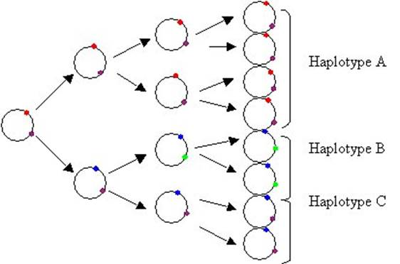

La connaissance de ces haplotypes, permet donc de retracer, l'histoire des populations humaines et de proposer des hypothèses sur les mouvements des populations au cours du temps. Notez que des études similaires sont faites avec le chromosome Y qui trace l'homme.

### les variations chromosomiques

Celles-ci sont variées. Citons entre autre des modifications de la structure des chromosomes telle que les délétions, les duplications de certaines régions, les inversions ou les translocations. A ceci, il faut ajouter les variations du nombre de chromosomes telles que :

- des modifications du taux de ploïdie: c'est dire des individus qui comportent 3 génomes haploïdes (triploïde) ou 4 génomes haploïdes (tétraploïde) au lieu de deux génomes. Ces phénomènes sont fréquents chez les plantes.

- des différences dans le nombre de chromosomes liées à des chromosomes optionnels (chez certaines plantes) ou qui ont été perdus ou gagnés par rapport au génome normal (triploïde partiel ou haploïde partiel: dans ce cas on parle d'aneuploïde) ou à des fusions de chromosomes.

Citons un cas de fusion qui est très utilisé en génétique de la drosophile. On dispose de souches dites avec des X attachés (X^X). Il s'agit en fait de fusion de chromosomes X. Chez la drosophile le contrôle du sexe se fait par une balance entre le nombre de chromosomes X et le nombre de jeux d'autosomes (A).

si X=A alors l'individu est femelle 
si X= 1/2 de A alors l'individu est mâle

Dans le cas des X attachés les individus X^X Y sont donc femelle. Que se passe-t-il si nous les croisons avec des mâles classiques ?

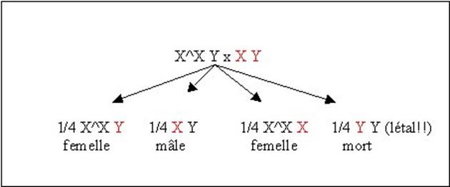

Nous voyons par exemple que dans ce type de croisements le mâle hérite son chromosome Y de sa mère et non de son père comme dans les croisements normaux. Nous reviendrons sur l'utilisation de ces chromosomes en génétique de drosophile.

## L'épigénétique
 
ou
 
Quelques exemples de polymorphismes étranges !
 
ou encore
 
L'ADN n'est pas le seul support de l'information génétique !

Récemment, des nouvelles recherches ont visé à comprendre l'hérédité de polymorphismes qui ont des modalités qui n'obéissent pas aux lois de Mendel.

Nous prendrons deux exemples qui vous montrent la diversité de ces mécanismes de mémoire cellulaire (donc héritables) dit mécanismes épigénétiques car ils ne font pas intervenir de modification de la séquence de l'ADN.

- Chez le champignon filamenteux Podospora anserina (proche de Neurospora), il existe deux types de souches dans la nature qui diffèrent par la présence de deux allèles du gène het-s appelés, het-s et het-S. Comme pour le type sexuel de Neurospora, le gène het-s contrôle l'incompatibilité végétative. Ce mécanisme est très répandu chez les champignons. En effet, les cellules de champignons ont la propriété de fusionner lorsqu'elles se rencontrent. Dans la plupart des cas, les produits de la fusion ne sont pas viables. C'est le cas chez P. anserina quand des cellules het-s et het-S fusionnent; le dicaryon het-s/het-S formé meurt rapidement.

En fait, les souches portant l'allèle het-s présentent des propriétés particulières. Elles se présentent sous deux formes : sous la forme het-s, elles sont incompatibles avec les souches het-S, mais elles peuvent se présenter sous la forme het-s* qui n'est pas incompatible avec les souches het-S. Ce qui est très surprenant, c'est que lorsque l'on prend ses souches het-s* et qu'on les met en contact avec une souche het-s alors elles deviennent het-s ! Pour cette expérience, on procède la manière suivante:

On inocule sur une boite de Petri du mycélium het-s avec un noyau qui porte un marqueur "vert" dans le noyau (on dispose chez ce champignon de nombreux marqueurs polymorphes de ce type qui affectent par exemple la couleur du mycélium) et du mycélium het-s* qui porte un autre allèle pour le marqueur qui donne une couleur "rose". On laisse pousser :

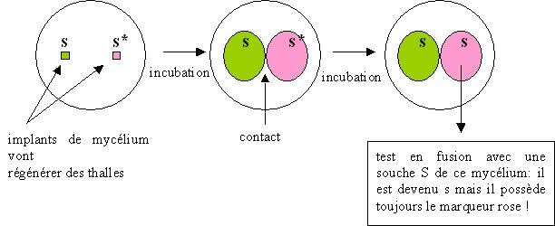

La conclusion de cette expérience est qu'il existe dans le cytoplasme de la souche het- s quelque chose d'infectieux qui transforme le mycélium het-s* en het-s. Ceci est confirmé par les résultats des croisements entre des souches het-s et hets*, qui montrent que s et s* ségrègent avec le cytoplasme:

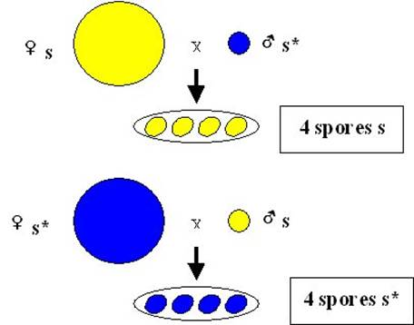

En fait, le passage d'une souche het-s* vers une souche het-s, peut se faire spontanément avec une fréquence faible. Maintenant nous savons que la différence entre les souches het-s est het-s* est due à deux conformations différentes de la protéine codée par het-s: la conformation het-s étant infectieuse vis à vis de la conformation het-s*. C'est à dire que par un mécanisme encore inconnu lorsque la forme het-s* est mise en présence de la forme het-s, elle change de conformation et adopte celle de het-s.

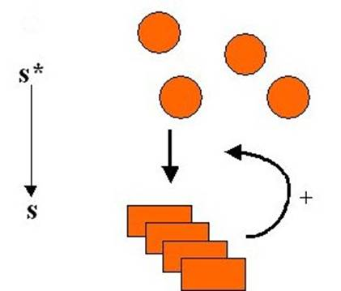

Ce genre de phénomène d'hérédité de structure n'est pour l'instant prouvé que dans 3 autres cas chez la levure (si vous êtes intéressés regardez le cours sur le phénomène similaire PSI), mais il est très probable qu'il existe beaucoup de phénomènes de ce type qui restent à découvrir. Citons en particulier, le cas du prion chez l'homme qui très probablement (tout le monde n'est pas encore convaincu) fonctionne de cette façon et celui du centrosome au cours de la division cellulaire pour lequel on ne sait pas la manière dont il se duplique mais pour lequel on suspecte fortement un mécanisme analogue.

- Le plus vieux polymorphisme a été découvert chez la plante Linaria vulgaris par Linnée (celui qui a commencé la systématique), il y a maintenant environ 250 ans. Il affecte la forme des fleurs.

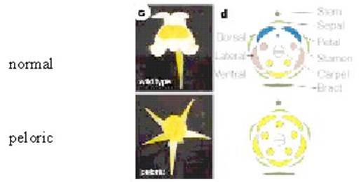

En F1 d'un croisement normal x peloric, la descendance est normale.

En F2, le caractère ségrège de manière quasi mendélienne comme étant dû à un couple d'allèle d'un gène appelé lcyc.

Les 2 allèles ont été clonés et aucune différence de la séquence primaire en acide nucléique pouvant expliquer le phénotype n'a été détectée. Des analyses de l'ADN de lcyc avec des enzymes de restriction sensibles à la méthylation ont permis de montrer que dans Peloric l'ADN est méthylé alors qu'il ne l'est pas dans le normal (pour voir l'état de méthylation, on utilise des enzymes de restriction isoschizomères (qui reconnaissent le même site de coupure) mais qui sont sensibles différentiellement à la méthylation. Par exemple, MboI coupe l'ADN non méthylé et méthylé alors que Sau3A1 coupe uniquement l'ADN non méthylé, les deux enzymes reconnaissent la séquence GATC). Ceci cause une absence de transcription du gène lcyc spécifiquement dans la forme peloric. Cet état de méthylation est transmissible de manière très stable à travers la mitose et la méiose car il fonctionne de la manière suivante:

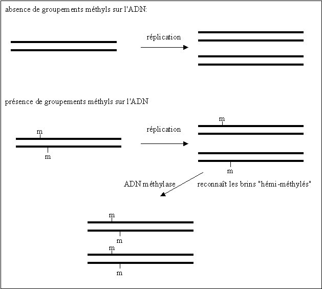

Comme on le voit l'état de méthylation est héritable. On note cependant une certaine instabilité des états de méthylation qui sont donc réversibles. Il existe d'autres types de phénomènes qui ressemblent à celui-ci, dans le sens qu'il s'agit de modifications structurales de l'ADN (le plus souvent de la chromatine chez les eucaryotes) sans changement de sa séquence
 
Notez qu'il existe une troisième classe de phénomènes épigénétiques : les états métaboliques ou régulatoires alternatifs.
 
Ces phénomènes sont très fréquents dans la nature où ils interviennent dans des phénomènes variés surtout dans les cellules eucaryotes. Pratiquement, ils sont importants pour la transgenèse. Il est en effet fréquent qu'après introduction de séquences d'ADN dans une cellule, l'expression de celles-ci soit rapidement inhibée. Il existe deux grands types de mécanismes épigénétiques qui entraînent cette inhibition.
 
- Les mécanismes dit TGS (pour transciptional gene silencing) qui sont liés soit à de la méthylation soit à des modifications de structure de la chromatine
- Les mécanismes dit PTGS ( pour post transciptional gene silencing) qui sont liés à des états régulatoires alternatifs (présence ou absence d'une nucléase spécifique) liés à des ARNs double brin. Voyez la page comment inactiver un gène pour en savoir plus.

## Les mutations
 
Nous avons vu au début de ce chapitre qu'il existe des polymorphismes dans les populations et avons pu pour un gène donné en calculer les fréquences. Quelle est l'évolution des fréquences des différents allèles polymorphes dans une population ?
Nous ne répondrons pas en détail à cette question car elle nécessite des analyses qui sont du ressort de la Génétique des Populations. Cependant nous allons quand même montrer que dans une grande population, si les gamètes se rencontrent au hasard et qu'aucune sélection ne s'effectue sur ces gamètes ou sur leurs descendants alors les fréquences des différents allèles restent constantes au cours des générations. C'est la loi de Hardy-Weinberg.

Soit un gène polymorphe avec deux allèles a et b. Ces allèles sont présents avec les fréquences allèliques respectives, Fa et Fb. Evidemment Fa + Fb = 1. Selon nos hypothèses, cela veut dire que les parents vont produire Fa de gamètes a et Fb de gamètes b. Voyons maintenant quelles seront les fréquences de production de gamètes a et b par les descendants issus la rencontre de ces gamètes, Fan+1 et Fbn+1.
 

Donc les fréquences alléliques restent constantes d'une génération à l'autre.

Il n'y a donc pas de disparition du polymorphisme sous les hypothèses de répartition aléatoires des gamètes. On dit que la population est en équilibre de Hardy-Weinberg. Si des variations de ces fréquences sont observées au cours des générations dans une population cela veut dire que des mécanismes supplémentaires à la répartition simple au hasard des gamètes sont en action. Il peut s'agir de mécanismes de sélection, de migration ou autres évènement tels que l'apparition de nouveaux allèles. En effet, si du polymorphisme existe au sein des populations c'est qu'il a été créé. Il existe donc des mécanismes qui permettent l'apparition de polymorphisme. Il s'agit de mutations.

On peut expérimentalement mettre en évidence l'existence des mutations. Lorsque l'on prend un grand effectif d'individus d'une souche pure, on constate que certains individus (en général en proportion infime) présentent spontanément des variations. On appelle alors la population de départ la souche "sauvage" et les individus des variants. Si les descendants de ceux-ci présentent encore le caractère nouveau et que celui-ci peut donc se transmettre, on les appelle des mutants et on dit qu'ils portent une mutation. Tout caractère peut être affecté. On peut ainsi définir un certain nombre de type de mutations en se référant aux polymorphismes qu'elles entraînent.

## Les différents types de mutations

Les mutations sont souvent qualifiées par le polymorphisme qu'elles créent (inversion, insertion etc. Voici quelques types de mutations classées en fonction de leurs effets physiologiques :

- les mutations létales qui entraînent la létalité des souches qui les portent. Il est évident que de telles mutations ne peuvent apparaître dans une population que si elles sont récessives ou conditionnelles.

- les mutations d'auxotrophie

- les mutations thermosensibles ou cryosensibles

etc.

Ici nous devons faire la distinction entre deux types de mutations différentes. Dans la nature, il existe grosso modo deux types d'organismes: ceux pour lesquels toute cellule peut assurer sa descendance (exemple: les bactéries, les champignons, les protistes, etc.) et ceux pour lesquels il existe deux types de cellules : les cellules somatiques qui n'assure pas la descendance et les cellules germinales qui assurent la descendance (exemple: les animaux). Dans le premier groupe d'organismes, toute mutation est susceptible de se transmettre à la génération suivante par contre dans le deuxième groupe seule celles affectant la lignée germinale se transmettront à la descendance, ce sont les mutations germinales. Il existe d'autres mutations qui affectent spécifiquement les cellules somatiques dites mutations somatiques.

Attention une mutation qui apparaît dans une cellule somatique se transmet à tous les descendants de cette cellule, elle ne sera par contre pas transmise aux descendants de la génération suivante. Ces mutations ne sont pas négligeables biologiquement car une catégorie importante regroupe les mutations somatiques qui conduisent à la formation de tumeurs !

## Les modalités d'apparition des mutations

Les mutations résultent de deux grands types de phénomènes.

(1) la fidélité de la transmission du matériel génétique n'est pas de 100%. Ceci dérive de plusieurs processus dont la tautomérisation de certaines bases qui peuvent entraîner des appariements illégitimes qui ne seront pas détectés et qui pourront donc donner naissance à des mutations au tour de réplication suivant.

(2) l'ADN subit des lésions qui sont réparées plus ou moins efficacement (cliquez ici pour en savoir plus). Par exemple, la dépurination des bases GC, la désamination des cytosines ou l'oxydation de bases entraîne la formation de lésions qui au moment de la réplication peuvent poser des problèmes. Cliquez ici pour en savoir plus. Ceci peut être très fréquent: on estime qu'une cellule animale perd environ 500 purines à l'heure. Il existe donc des mécanismes de réparation de ces lésions qui malheureusement n'ont pas une efficacité de 100%. Je vous renvoie au chapitre ad hoc pour approfondir les mécanismes en jeu chez Escherichia coli.

Voyons plus en détail l'aspect génétique du phénomène.

Le problème de l'apparition des mutations n'est pas trivial et il est encore débattu aujourd'hui. En effet, si la majorité des généticiens s'accordent pour dire que les mutations se produisent au hasard, il en existe quelques-uns qui pensent que celles-ci pourraient être induites par le milieu. Il faut comprendre induite non pas comme "ayant une fréquence augmentée par le milieu" car nous verrons qu'effectivement des conditions de milieu peuvent augmenter de manière considérable le taux de mutation, mais plutôt dirigées par le milieu. Des expériences récentes ont fait resurgir ce débat qui malheureusement sort du cadre de ce cours. Quoi qu'il en soit, des expériences ont clairement montré que les mutations apparaissent spontanément. La première démonstration convaincante de ceci a été faite grâce à ce que l'on appelle aujourd'hui le test de fluctuation.
 
## Le test de fluctuation

Prenons l'exemple qu'étudiait Salvator Luria et Max Delbrück (1943) et qui a permis d'apporter la première démonstration que les mutations apparaissent spontanément avant le traitement qui permet de les révéler. Ces chercheurs étudiaient la résistance d'Escherichia coli B au phage a. Pour révéler les bactéries résistantes, ils mettaient en cultures des bactéries sensibles, les laissaient pousser, puis ajoutaient des phages et étalaient la culture sur des boites de Petri. Seules les bactéries résistantes donnaient naissance à des colonies (facilement comptables !). Ils essayaient de mesurer la fréquence d'apparition de bactéries résistantes au phage et observaient de grandes fluctuations dans leurs résultats. Ils ont raisonné justement que cette fluctuation était en fait due à l'apparition stochastique des mutations et pourrait donc permettre de trancher entre les deux hypothèses du moment:

Hypothèse I: les mutations de résistance apparaissent dans la bactérie spontanément avec une probabilité fixe avant leur exposition au phage.

Hypothèse II: les mutations sont induites avec une certaine probabilité dans la bactérie par le contact avec le phage. En d'autre terme, il existe une petite probabilité qu'une bactérie résiste à l'attaque d'un phage et si elle résiste, elle et ses descendants acquièrent alors une immunité contre le phage.

Pour faire la différence, observons ce qui se passe dans le cas des deux hypothèses si plusieurs cultures sont faites en parallèle.

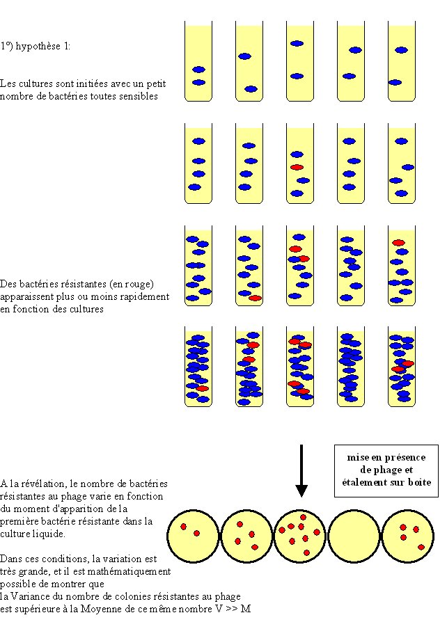

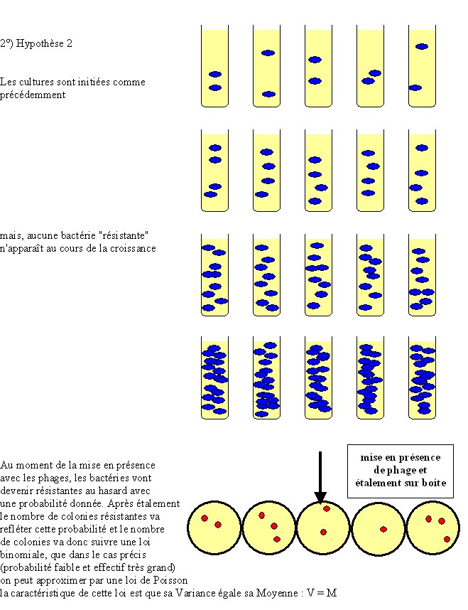

Donc Luria a fait l'expérience (Delbrück ayant fait le développement théorique de l'idée de Luria) et a obtenu les résultats suivants:

exemple (parmi 3 expériences témoin) de résultats obtenus si une culture est divisée en 10 et étalée sur 10 boîtes :

14, 15, 13, 21, 15, 14, 26, 16, 20, 13

moyenne= 16,7 
variance= 15
 
L'analyse statistique montre que ces deux chiffres ne sont pas différents. Donc la procédure d'étalement n'introduit pas de variation significative autre que l'échantillonnage au hasard.
exemple (parmi 10 expériences) de résultats obtenus si plusieurs cultures sont faites en parallèle et étalées sur des boites séparées dans les conditions de l'expérience témoin:

1, 0, 3, 0, 0, 5, 0, 6, 107, 0, 0, 0, 1, 0, 0, 64, 0, 35, 0, 5

moyenne= 11,35 
variance= 694 (corrigée pour la variation de l'étalement).

CQFD: il est clair que c'est l'hypothèse n°1 (les mutations préexistent à leur révélation) qui est la bonne !

De plus cette expérience nous permet de bien saisir la différence entre taux de mutant et taux de mutation. En effet, le nombre de mutants observés dans une culture résulte du nombre de mutations apparues et du nombre de divisions que la bactérie mutante a pu faire avant la révélation. Le taux de mutant est donc variable d'une expérience à une autre en fonction du hasard de l'apparition des mutations. Au contraire, le taux de mutation est constant (si les conditions expérimentales sont constantes) et les mutations apparaissent au hasard (c'est dire suivant une loi de Poisson !).

S'il est facile de calculer le taux de mutants, quid du taux de mutation ?

Le test de fluctuation fait ci-dessus permet de le calculer: pour ceci, il faut s'intéresser aux cultures qui ne donne pas de mutants résistants. On admet que chacune des cultures a été initiée avec le même nombre n0 de bactérie au début et contient le même nombre de bactéries n à la fin. Il s'est donc passé n-n0 divisions dans chacune des cultures. Si P est la probabilité de muter en souche résistante à chaque division (taux de mutation par unité de génération), la proportion de cultures sans mutant (f que l'on mesure dans l'expérience) est égale à la probabilité d'observer 0 mutation après toutes ces n-1 divisions, soit (1-p)n-n0. De là, on tire que

p= 1- e ln f / n-n0.

Par exemple dans une de leurs expériences, Luria et Delbrück ont effectué 87 cultures, parmi celles-ci, 29 ne présentaient pas de colonies résistantes. Ces cultures ont été ensemencées avec 50-500 bactéries et contenaient à la fin environ 2.4 108 bactéries, d'où l'on tire que le taux de mutation est de:

p= 1- e ln f / n-n0 = 4,5 10-9 mutations / division cellulaire

Une autre expérience a permis de montrer plus simplement le même résultat. C'est la réplique sur velours de mutants de prototrophie à partir d'une souche auxotrophe chez la levure par Joshua et Esther Lederberg (1952).

Des levures sont étalées sur du milieu complet, et ensuite repiquées grâce à du velours sur du milieu minimum. Sur ce milieu, les mutants prototrophes poussent et sont facilement repérables. Il suffit ensuite de retourner vers la boîte de milieu complet pour constater que les levures de la colonie initiale de les repiquer sur du milieu minimum et de constater que la toutes les cellules de la colonie sont aussi prototrophes, et que donc, ce n'est pas le milieu qui a provoqué la mutation d'auxotrophie vers la prototrophie.

Ce résultat est l'un des plus fondamental de la biologie car, combiné avec le processus de sélection naturelle énoncé par Darwin, il a permis de proposer une hypothèse non finaliste de l'évolution de la vie que l'on désigne sous le terme de néodarwinisme. En effet, "un oeil n'a pas été créé dans le but de voir" même s'il sert à ça, mais les organismes possèdes des yeux car (1) aléatoirement par le biais de mutations, certains ont acquis la capacité de détecter la lumière et (2) par ce fait, ils ont été avantagés par rapport à ceux qui en étaient dépourvus au niveau de leur reproduction, probablement parce que les yeux leur permettaient une meilleure connaissance du milieu alentour. Notez que le débat fait toujours rage pour savoir si cette évolution est obligatoirement progressive (c.a.d. que l'établissement de l'œil résulte de la succession de plusieurs mutations) ou s'il est possible de faire des sauts (c.a.d. qu 'un "proto-œil" efficace est apparu à la suite d'une seule mutation).
 
## Fréquence d'apparition des mutations
 
L'exemple du test de fluctuation semble indiquer que le taux des mutations spontanées est très faible, d'autant plus que la résistance au bactériophage pourrait être causée par des mutations localisées dans de nombreux gènes différents et que donc le taux de mutation pour chaque gène est encore plus faible. En fait les taux de mutation peuvent varier grandement en fonction de nombreux paramètres. Par exemple, voyons quelques taux de mutations pour certains caractères chez différents organismes:

| organisme                 | changement de phénotype                              | taux de mutation                             |
|---------------------------|------------------------------------------------------|----------------------------------------------|     
| bactériophage T2          | inhibition de la lyse                                | 10-8 gènes mutants/réplication               |
|                           | changement spécificité d'hôte                        | 3.10-9 gènes mutants/réplication             |
| Escherichia coli          | capacité à fermenter lactose à incapacité            | 2.10-7 cellules mutantes/division cellulaire |
| Chlamydomonas reinhardtii | sensible à la streptomycine à résistant              | 10-8 cellules mutantes/division cellulaire   |
| Neurospora crassa         | prototrophe pour l'inositol à auxotrophe             | 8.10-8 spores mutantes/spores totales        |
| Drosophila melanogaster   | oeil rouge brique  oeil blanc                        | 4.10-5 gamètes mutants/gamètes totaux        |
| Homo sapiens              | Chorée de Hungtington (maladie autosomale dominante) | 10-8 gamètes mutants/gamètes totaux          |
|                           | dystrophie musculaire de Duchenne (maladie récessive)| 4-10.10-5 gamètes mutants/gamètes totaux     |
|                           | hémophilie A (maladie génétique récessive)           | 2,4. gamètes mutants/gamètes totaux          |

On constate une variabilité entre organismes mais aussi pour différents caractères à l'intérieur d'une même espèce. En fait ces données sont globales et ne tiennent pas en compte un certain nombre de données, dont

- le nombre de gènes différents qu'il est possible de muter pour obtenir le caractère en question.

exemple:

Si on part d'une souche de levure prototrophe, il est possible de trouver avec une fréquence assez élevée des souches auxotrophes car on estime à environ 200 le nombre de gènes impliqués dans les biosynthèses de métabolites. Une mutation, qui inactive l'un de ces gènes, est suffisante pour entraîner l'auxotrophie. Par contre, si on recherche une auxotrophie pour un métabolite particulier (acide aminé ou base), ce taux sera beaucoup plus faible.

- la redondance des gènes

S'il existe deux copies (ou plus) du même gène dans le génome il sera très difficile de trouver des mutations qui abolissent le fonctionnement des deux gènes en même temps (celles-ci sont en général récessives). Souvent les mutations obtenues dans ce cas altèrent la régulation des gènes en abolissant simultanément l'expression de toutes les copies. Elles ne sont donc pas localisées dans les gènes en question mais dans leur régulateur ! Par contre, pour chacun des gènes, il est possible d'obtenir des mutations dominantes.

Si on considère le taux de mutation par gène, il existe aussi une variabilité entre gènes liée à la taille du gène, à la sensibilité du produit codé aux changements d'acides aminés (ou des bases !), etc.

En résumé, il n'existe pas de règle fixe. Cependant, à l'intérieur d'une lignée pure, le taux de mutation se maintient dans une certaine fourchette et il est possible de caractériser certains types d'organismes comme mutant facilement et d'autres difficilement. Néanmoins, il est possible de détecter à l'intérieur d'une même espèce des individus qui présentent des taux de mutations différents. En particulier, chez certains individus, il existe des mutations qui augmentent dramatiquement le taux de mutations pour tous les caractères. Ces mutations sont appelées mutateurs (ou hypermutateurs). Elles ont été bien décrites chez les bactéries. Il semble que ces mutations permettent aux bactéries qui les portent une adaptation rapide aux environnements qui changent fréquemment.

- les facteurs environnementaux

La présence de certains éléments dans l'environnement permettent de modifier le taux de mutations soit en le diminuant soit en l'augmentant.

Il est possible de baisser le taux de mutations spontanées grâce à certains composés. On sait par exemple, que l'adjonction de produits ayant des activités antioxydant permet de limiter le taux de mutations en particulier au niveau de l'ADN mitochondrial.

Pour augmenter le taux de mutations, il existe 2 grands types de facteurs: des radiations ou des produits chimiques. Ces facteurs sont appelés mutagènes et sont à manipuler avec la plus grande prudence car en général ils entraînent des mutations chez tous les organismes, y compris l'expérimentateur ! Généralement ils endommagent l'ADN qui est alors réparé par plusieurs systèmes de réparation. Lorsque la lésion est mal réparée cela aboutit à un changement du matériel génétique qui devient irréversible et donc à une mutation.

- Les radiations. Celles-ci génèrent différents types de mutations en fonction de la longueur d'onde.

- Les rayons X provoquent des cassures double brin de l'ADN. Ce genre de lésions est réparée par le système de recombinaison (voir vos cours de biologie moléculaire). Elles vont donc générer toute une série d'altérations chromosomiques dont des translocations, des inversions et des délétions de larges régions.
- Les ultraviolets provoquent par contre une dimérisation des thymines pour donner des cyclobutane-pyrimidines. Ceux-ci sont réparés par deux grands types de mécanismes. (1) La photoréactivation qui s'effectue en présence de lumière visible par une enzyme de photoréactivation (EPR) qui reconnaît directement les cyclobutane-pyrimidines et les régénère. (2) L'excision de nucléotide qui permet de réparer plusieurs types de lésions dont le principe général est conservé au cours de l'évolution.
 
Les UV vont donc entraîner l'apparition d'une gamme de mutations provenant de la mauvaise réparation de la lésion, le plus souvent au niveau du dimère de thymines.
 
- Les produits chimiques. Ils sont très nombreux et ont des spécificités d'action particulières qui vont provoquer différents types de mutations.
exemples:
* l'EMS réagit avec les guanines et les modifient : il entraîne donc des changements de bases, principalement des guanines
* la proflavine s'intercale entre les bases de l'ADN. Au cours de la réplication, elle entraîne l'insertion de bases supplémentaires.
* le 5-bromouracile remplace la thymine au cours de la réplication. Le brome entraîne la déstabilisation des électrons et cette base peut faire un appariement avec la guanine. Il entraîne donc des changements de base, principalement des transitions de thymine vers cytosine.
* la colchicine empêche la formation des fuseaux et cause ainsi des pertes de chromosomes ou alors des polyploïdisations.
Notez que ces produits mutagènes sont très toxiques car ils ont des activités cancérigènes ou tératogènes.

## Les différents types moléculaires de mutations et leurs effets phénotypiques
 
Nous allons rapidement mentionner les mutations les plus importantes car cette partie est redondante avec votre cours de biologie moléculaire.

### Les mutations ponctuelles

Ces mutations modifient 1 ou quelques nucléotides (changement de la nature de nucléotides ou insertion/délétion de nucléotides).

- On appelle transitions les changements de purines en purines (ou pyrimidines en pyridmidines) et transversions les changements de purines en pyridmidines (ou pyrimidines en purines). Ces mutations sont générées par de nombreux mécanismes différents. En fonction de leurs localisations, elles vont avoir des effets différents sur l'expression des gènes. Prenons des exemples dans le cas du gène de la béta-globine humaine. Ce gène code une sous-unité de l'hémoglobine et de nombreux polymorphismes sont connus dans ce gène (pour un catalogue exhaustif, je vous invite à aller visiter le site http://globin.cse.psu.edu/). Chez l'homme, il est très rare d'observer l'apparition de novo de mutations. Cependant comme environ 200 allèles différents allèles de ce gène provoquent des béta-thalassemies, maladies qui sont clairement délétères pour les individus qui sont affectés, on considère que ces allèles dérivent par mutations d'un allèle sauvage. La structure du gène de béta-globine est la suivante:

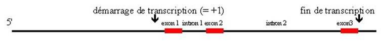

Voici quelques-unes des mutations recensées et leurs effets :

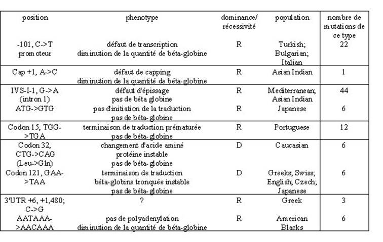

- Les délétions ou insertions de nucléotides peuvent décaler le cadre de lecture et sont, dans ce cas, appelées frameshifts. Ils sont soit +1 soit -1 en fonction du décalage qu'ils engendrent. Généralement, cela aboutit à un produit tronqué plus ou moins stable. On connaît aussi de nombreuses mutations de ce type dans le gène de béta-globine qui sont récessives ou dominantes en fonction de leur position (cf. les lignes des mutations créant des codons stop dans la table ci-dessus, qui ont les mêmes phénotypes).

Une propriété génétique importante des mutations ponctuelles est qu'elles peuvent réverser. En effet, Il est possible d'abolir par une seconde mutation, le changement qu'a provoqué la première mutation. On dit que cette deuxième mutation est une réversion. Celle-ci peut être vraie et rétablir le nucléotide initial ou bien restaurer le même acide aminé mais codé par un autre codon (ou rétablir la phase un peu plus en amont ou en aval du lieu du premier changement de phase).

exemple:

AAG à AAC à AAG

lysine asparagine lysine

réversion vraie

AAG à AAC à AAA

lysine asparagine lysine

réversion

### Les aneuploïdes et les polyploïdes

A l'autre extrême du spectre en taille se trouvent les accidents chromosomiques qui ont des origines variées. Au cours de la mitose (ou de la méiose) un accident fréquent est l'absence de clivage d'un centromère. Il ne se produit pas alors de disjonction des deux chromatides et le résultat est un noyau où il manque un chromosome et un noyau avec un chromosome surnuméraire. On aboutit alors à la formation d'un aneuploïde.

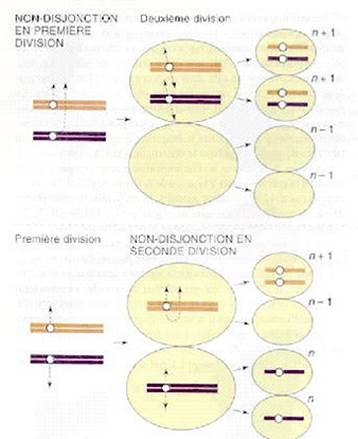

n = nombre de chromosomes

Il n'existe pas de règle générale pour les effets des aneuploïdies. Chez l'homme, elles sont particulièrement néfastes et le plus souvent létales et seuls quelques chromosomes dont les chromosomes sexuels peuvent être en un seul ou trois exemplaires. Nous avons vu avec les X attachés que chez la drosophile le chromosome X peut se trouver en trois copies (dont deux attachés). Chez la levure par contre les aneuploïdies sont viables (à conditions d'avoir au moins un jeu complet de chromosomes !) et très fréquentes dans les populations naturelles, en particulier dans certaines souches que l'on utilise pour faire du vin. Souvent ces aneuploïdies créent des difficultés d'appariement au niveau de la prophase de la première division de la méiose et entraînent ainsi des diminutions de la fertilité.

Un autre phénomène assez fréquent est la polyploïdisation. Celle-ci se produit lorsqu'il y a duplication du jeu de chromosome sans division du noyau. Je vous rappelle que la colchicine entraîne ce genre d'anomalies.

On a ainsi cherché à créer de nouvelles plantes d'intérêt agricole. Par exemple, le triticale a été obtenu en croisant le blé (qui est en fait un hexaploïde: 2n = 6x = 42) et le seigle (qui est un diploïde: 2n = 2x = 14). La F1 de ce croisement comporte 21 + 7 chromosomes qui malheureusement ne peuvent faire une méiose car chaque chromosome est unique. L'ajout de colchicine a permis de doubler le nombre de chromosomes car sans fuseau, il n'y a pas d'anaphase et donc les chromosomes ne se séparent pas à la mitose. On obtient ainsi des amphiploïdes (2n = 2x 28) qui sont fertiles et qui ont la résistance du seigle et le rendement du blé. La même technique avec choux + radis a malheureusement donné des plantes avec des racines de choux et des feuilles de radis !!!

### Les délétions

Celles-ci peuvent englober une partie d'un gène, un gène entier ou plusieurs gènes. Leurs effets sont souvent drastiques. Si la délétion est de grande taille, elle englobe plusieurs gènes dont certains peuvent être essentiels. Les grandes délétions sont donc, en général, létales chez les haploïdes. Leur intérêt réside dans le fait que si un gène est délété (et uniquement ce gène), on peut connaître grâce au phénotype que cela entraîne le rôle de ce gène. On dit qu'on est en présence de l'allèle nul (notez que la présence d'un codon stop au début de la phase codante ou une mutation dans l'ATG initiateur sont aussi en théorie des allèles nuls ce type de mutations peut réserver des surprises). On sait maintenant les créer à volonté comme indiqué dans le chapitre 3. De manière surprenante la plupart des gènes pris individuellement ne sont pas essentiels. C'est à dire que la cellule survie très bien s'ils sont délétés. Cela provient le plus souvent de la redondance des gènes et des systèmes dans la cellule.

Les délétions peuvent aussi servir pour la cartographie. Je vous conseille de résoudre le problème de TD pour comprendre comment cela fonctionne.

### les transpositions

Ces évènements sont très fréquents et une bonne partie des mutations dans les populations naturelles est en fait liée à des évènements de transposition. Les effets sont de deux types. Le transposon peut s'insérer dans un gène et l'inactiver ou il peut s'insérer dans ses régions régulatrices et en déréguler l'expression.

## La recombinaison comme générateur de variation
 
Si la mutation est le créateur primaire de la variation, la recombinaison peut associer différents polymorphismes et par-là augmenter la variation en générant de nouvelle combinaison.

Vous savez qu'il existe dans la cellule des mécanismes qui permettent l'échange des brins d'ADN. Ceci est clairement visualisé au cours de la méiose par les chiasmas qui sont la manifestation physique des crossing-over qui sont le reflet de ces échanges de brins. Nous verrons en détail les implications de ces crossing-over sur la ségrégation des allèles. Ils se produisent avec une fréquence plus ou moins grande dans toutes les cellules ou ils génèrent de la diversité génétique. Nous nous contenterons de mentionner les phénomènes associés à la recombinaison homologue qui permet de :

- associer (ou de dissocier) des allèles selon le schéma suivant

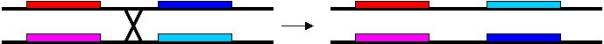

- créer des délétions entre deux régions homologues (ou d'intégrer des fragments d'ADN circulaires)

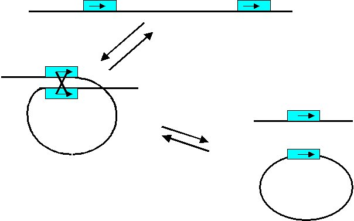

Si les séquences sont répétées en tandem, ce mécanisme aboutit à une augmentation (ou diminution du nombre des copies présentes).

- générer des inversions

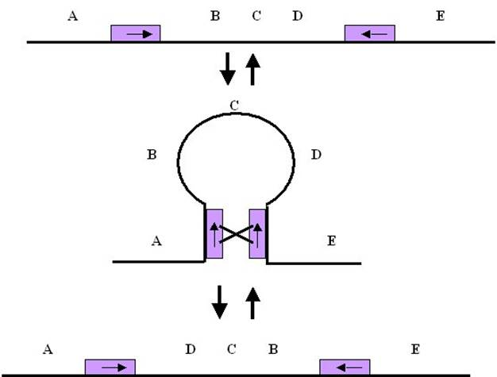

- Notons que si les deux séquences sont sur des chromosomes différents, il est possible de générer ainsi des translocations.

- Des inversions successives empêchent la recombinaison en méiose en limitant les possibilités d'appariements. De même si une recombinaison se produit les chromosomes résultants sont déficients :

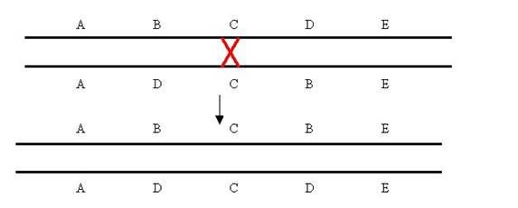

En haut, il manque D; en bas, il manque B. Les deux chromosomes ne peuvent vraisemblablement pas assurer la viabilité. Chez la drosophile, il existe de nombreux chromosomes portant des complexes d'inversion: les chromosomes balanceurs. La recombinaison est donc abolie dans une mouche hétérozygote portant un chromosome balanceur et un chromosome normal pour le chromosome en question.

