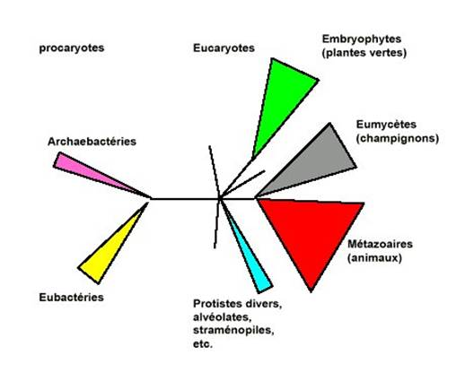
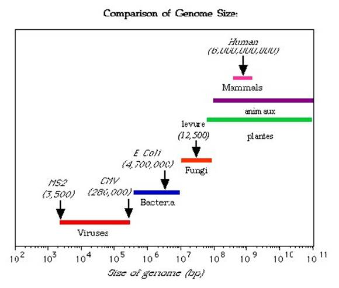
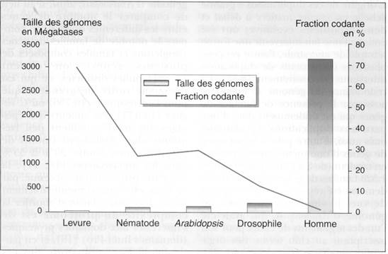

## Qu'est-ce que la génomique ?

Nous disposons maintenant de méthodes de séquençage performantes qui permettent d'étudier finement des génomes entiers. Ceci nous permet maintenant par exemple d'analyser et de comparer les génomes des différents organismes (au sein d'une même espèce ou entre espèces différentes) et donc de mieux comprendre leur fonctionnement, (aussi bien dans leur ressemblance que leur dissemblance) et leur évolution. La génomique est la sous-discipline de la génétique qui regroupe les connaissances sur un organisme et tente de les synthétiser. Elle traite en particulier de l'organisation globale des génomes. En fait, vous possédez maintenant les notions qui vous permettent de comprendre une grande partie de la génomique, surtout en ce qui concerne l'organisation et l'évolution des génomes.

En effet, nous avons vu au cours de l'introduction que la transmission du matériel génétique est invariante dans le sens que les deux informations obtenues à partir de la duplication de l'information initiale sont identiques à celle-ci. Nous avons aussi vu qu'il se produit à faible fréquence des mutations, des recombinaisons, et autres accidents chromosomiques. Cela provoque sur le long terme une extraordinaire "fluidité" des génomes permettant leur évolution et par contre coup celle des organismes. Dans ce chapitre nous allons voir un résumé de ce que nous savons pour sur les génomes d'organismes divers.

Commençons par voir les stratégies qui permettent d'obtenir la séquence de génomes entiers :

## Méthodes pour séquencer des génomes complets
 
L'amélioration des techniques a permis d'accroître rapidement la quantité de séquence. On peut appréhender ceci par la taille totale des séquence présente dans GenBank, une base de donnée qui regroupe la plupart (mais malheureusement pas la totalité) des séquences connues . Vous pouvez accéder à cette banque à l'adresse suivante : http://www.ncbi.nlm.nih.gov/
 
On peut aussi l'illustrer par l'évolution de la taille des plus grands chromosomes ou génomes séquencés. Notez que dans un premier temps, les séquences sont souvent discontinues, la séquence du génome comporte encore des trous qui séparent les contigs.

| Genome                                  | Sequence Release Date | trous              | Total length  |
|-----------------------------------------|-----------------------|--------------------|---------------|
| Human genome                            | 2/15/2001             | plusieurs milliers | 3 200 000 000 |
| Human chromosome 21q                    | 4/10/2000             | 4                  | 33,827,477    |
| Human chromosome 22q                    | 12/2/1999             | 11                 | 33,573,820    |
| Arabidopsis thaliana chromosome 2       | 5/15/1999             | 1                  | 19,647,091    |
| Caenorhabditis elegans - chromosome 5   | 12/11/1998            | 26                 | 20,818,150    |
| Escherichia coli                        | 9/5/1997              | 0                  | 4,639,221     |
| Synechocystis sp.                       | 6/30/1996             | 0                  | 3,573,471     |
| Haemophilus influenzae                  | 7/28/1995             | 0                  | 1,830,138     |
| Saccharomyces cerevisiae - chromosome 8 | 9/30/1994             | 0                  | 562,638       |
| E. coli K-12 contig                     | 8/22/1994             | 0                  | 338,534       |
| S. cerevisiae chromosome 3              | 3/16/1992             | 0                  | 315,339       |
| Human cytomegalovirus AD169             | 12/6/1989             | 0                  | 229,354       |
| Epstein-Barr Virus                      | 7/19/1984             | 0                  | 172,281       |
| Bacteriophage Lambda                    | 12/25/1982            | 0                  | 48,502        |
| Human Mitochondrion                     | 4/9/1981              | 0                  | 16,569        |
| Bacteriophage phi X174                  | 2/24/1977             | 0                  | 5,375         |

Les stratégies pour séquencer les génomes complets sont de deux types:
 
### Première stratégie
 
Cette stratégie a été utilisé par la compagnie privée Celera pour séquencer le génome de drosophile ou le génome humain, ou bien le Whitehead Institute pour séquencer le génome de Neurospora. Cependant, elle s'applique plutôt mieux aux petits génomes bactériens peu complexes :
 
1°) fragmenter aléatoirement le génome par des méthodes physiques (qui sont plus aléatoires que l'utilisation de méthodes enzymatiques), tel que les ultrasons ou la nébulisation (utilisation d'un gaz sous pression) pour générer des fragment d'environ 1kb (je vous rappelle que c'est la taille maximum de séquence fiable obtenue en une seule réaction avec les technologies disponibles). Cela évite aussi l'apparition de "gènes" qui serait toxique pour la bactérie qui est utilisée à la deuxième étape (c'est à dire Escherichia coli !).
 
2°) cloner les fragments dans un vecteur plasmidique et obtenir une banque totale du génome (on estime qu'il faut une couverture d'au moins 10 X le génome, c'est à dire que la taille combinée des inserts présents dans la banque doit être 10 fois plus importante que la taille du génome, un peu de statistique montre que dans ces conditions, environ 99,9% du génome devrait être séquencé une fois).
 
3°) séquencer automatiquement les inserts et rapatrier les séquences dans des fichiers.
 
4°) utiliser des programmes qui permettent à partir des fragments de séquence de faire des contigs.
 
5°) combler les trous soit en clonant de manière dirigée les régions manquantes, soit par PCR en amplifiant à l'aide d'amorces localisées au bord des contigs. Il faut bien sùr ensuite séquencer ces régions.
 
Cette méthode est rapide mais nécessite des outils informatiques très puissants. Par exemple pour le génome humain, il faut comparer 32 000 000 séquences entre elles ! Elle suppose aussi qu'il n'y a pas trop de séquences répétées car dans ce cas, l'analyse informatique ne permettra pas facilement de donner la séquence dans le bon ordre ! (on dit que Celera s'est aidé du génome "publique" pour établir sa séquence !)
De toute manière, il faut vérifier qu'il n'y a pas eu d'erreurs à l'assemblage en comparant cette séquence avec soit une carte de restriction, soit une carte génétique.
 
### Deuxième stratégie
 
Cette stratégie est plus longue mais plus sûre ! c'est celle adoptée par le consortium publique de séquence du génome humain.
 
1°) cloner dans des BAC (bacterial artificial chromosome) des longs fragments du génome. Ces BAC sont des plasmides simple-copie dérivés du plasmide F qui peuvent accepter jusqu'à 250 kb de séquence. Leur faible nombre de copie assure leur stabilité (pas de réarrangements dans la bactéries) et la représentativité du génome (peu de chance d'avoir un gène trop exprimé et délétère pour la bactérie).
 
2°) cartographier ces BAC soit moléculairement avec des enzymes de restrictions ou des amplifications PCR (il existe de nombreuses méthodes !), soit en s'ancrant sur une carte génétique.
 
3°) séquencer les BACs adjacents en utilisant la première méthode.
 
Cela revient à obtenir les séquences pour chaque BAC. L'arrangement final des séquences se faisant grâce à la carte des BAC.
 
### Troisième stratégie
 
Il existe maintenant des machines capables de générer plusieurs dizaines de millions de séquences de cours fragments d’ADN à partir d’ADN génomique fragmenté. Des programmes informatiques permettent ensuite de reconstituer le génome, mais celui-ci est souvent très fragmenté (plusieurs milliers de morceaux…)
 
Il faut ensuite déposer la séquence dans les banques de données comme GenBank ou EMBL.
 
Il existe maintenant de nombreux programmes qui permettent la visualisation de ces séquences. Un programme de visualisation (artemis) et un programme de recherche d'un gène dans un génome (blast) seront montrés en amphithéâtre.
 
L'analyse des génomes d'organismes modèles a abouti aux données suivantes.

## Les génomes des principaux organismes modèles

En fait, il existe une assez bonne corrélation entre la taille des génomes dans les différents groupes d'organisme et leur position phylogénétique. Cependant, il existe des exceptions qui sont regroupées sous la terminologie du paradoxe C. Par exemple, chez les vertébrés , les salamandres ont 50 fois plus d'ADN que l'Homme.  

Voici d'autres exemples  de discordances:

plantes :
- Arabidosis : 115 Mb
- Tabac : 3 800 Mb
- Pin :  68 000 Mb
Animaux
-Lamproie :  1 900 Mb
- Homme :  3 200 Mb
-Protoptère :  140 000 Mb
- Amoeba dubia:
670 000 Mb

Voici un rappel de la phylogénie globale (les triangles représentent l'effectif approximatif en espèces de chaque groupe) :

La figure et la table suivante vous donnent un ordre de grandeur des génomes, en paire de bases et en gènes, ainsi que la taille moyenne des gènes chez différents organismes appartenant aux différents groupes biologiques (les protistes divers sont inclus dans les eumycètes).

TODO tab

La séquence complète des génomes de nombreux organismes permet maintenant de mieux comprendre comment les génomes évoluent. De ces études qui dépassent le cadre de ce cours, nous retiendrons quelques tendances marquantes :

- Chez les procaryotes, les génomes sont compacts et leur capacité codante est utilisée au mieux. Le génome est généralement un chromosome circulaire mais dans certains cas plusieurs chromosomes peuvent être présents et certains chromosomes bactériens sont linéaires. Les gènes sont regroupés en opérons. L'évolution des génomes procaryotes se fait principalement par des évènements de recombinaisons, générateurs d'inversions et de délétion. Les analyses phylogénétiques de comparaison de séquence montrent aussi que les génomes procaryotes ne sont pas complètement imperméables: il existe des transferts latéraux de gènes.

exemple:

Chez les archaebactéries on peut retrouver des gènes dont la séquence est plus proche de celles de gènes d'eubactéries que d'autres archaebactéries. On suppose alors qu'il y a eu transfert latéral de gènes (via des plasmides conjugatifs ? via la transformation naturelle ?). Il existe un débat en ce moment pour évaluer l'importance de ces transferts au cours de l'évolution. Certains extrémistes pensent que ces transferts sont tellement massifs qu'ils empêchent d'obtenir des phylogénies satisfaisantes pour les bactéries.

- Chez les eucaryotes, il existe une nette augmentation de la taille des génomes en fonction du degré de complexité des organismes (cf. le tableau). Attention, je rappelle que cette règle n'est pas absolue et qu' il existe de nombreuses exceptions (paradoxe C).

Cette augmentation est due à

(1) en faible partie à l'augmentation du nombre de gènes (un peu plus de 6000 chez la levure à environ 30 000 chez l'homme). La génération de ces gènes se fait souvent par duplication suivi de spécialisation des 2 copies qui sont alors appelées des paralogues. Un comparatif des génomes de différents eucaryotes montre que ceci représente une part négligeable de l'augmentation en taille et que la fraction codante diminue dramatiquement :

 Il est à noter que l'homme ne semble pas posséder plus de gènes qu'une plante et deux fois plus qu'un ver ou une mouche ! en fait ces chiffres sont trompeurs. En effet, ils ne tiennent compte ni des duplications massives (arabidopsis a probablement été polyploïdisé et la plupart des gènes sont présents en plusieurs exemplaires très proches; cf plus bas l'exemple de la levure), ni surtout des évènements post transcriptionnels qui permettent une augmentation de la diversité en protéine. Par exemple, il existe des phénomènes d'épissage alternatifs qui aboutissent à la fabrication de plusieurs protéines à partir d'un même transcrit primaire. Ce phénomène est très fréquent chez l'homme, moins fréquent chez arabidopsis et probablement absent chez la levure.

(2) L'augmentation du nombre et de la taille des introns (de 0 ou 1 intron de quelques dizaines de paires de bases à plusieurs introns de plusieurs dizaines de kilobases).

(3) L'augmentation du nombre des transposons et autres séquences répétées (les satellites en particulier). C'est l'augmentation de cette fraction du génome qui permet d'expliquer en grande partie le paradoxe C. Certaines espèces ont plus de transposons que d'autres. Les raisons en sont obscures.

(4) La présence de pseudogènes.

(5) Une caractéristique importante de ces génomes est leur redondance. Par exemple, l'analyse du génome de levure montre qu'environ la moitié du génome est dupliquée. Sur la carte, les différentes régions dupliquées sont codées par la même couleur.

Il est postulé que le génome de levure aurait subi une diploïdisation vers - 100 millions d'année. Ceci aurait permis pour certains gènes la mise en place de régulations et/ou de fonctions différentes pour les deux copies via l'accumulation de mutations ponctuelles. Des remaniements chromosomiques (translocation, délétions, inversions...) auraient, de manière concomitante, modifié l'arrangement des gènes sur les chromosomes aboutissant à la physionomie actuelle du génome. Des phénomènes similaires pourraient s'être produits pour notre génome. Notez que contrairement à notre génome, le génome de levure est encore peu envahi par des éléments transposables et que le nombre d'introns dans les gènes est réduit (souvent 0 ou 1 intron).

