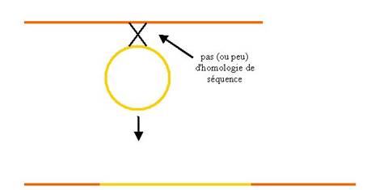
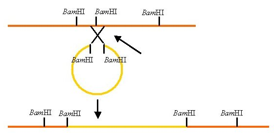
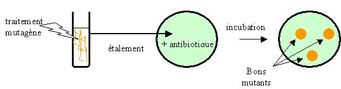
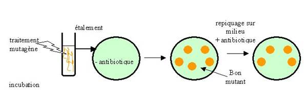
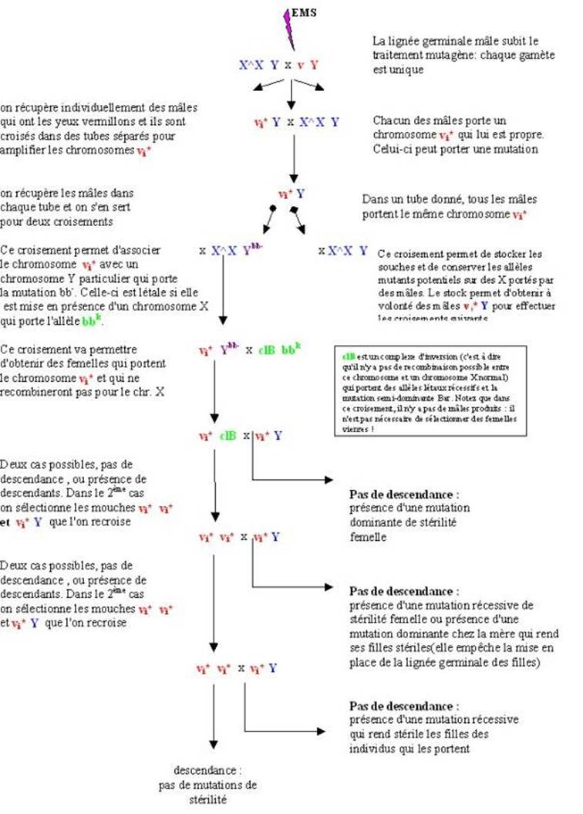
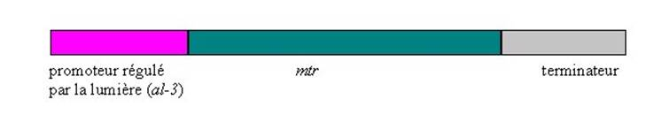
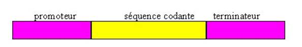
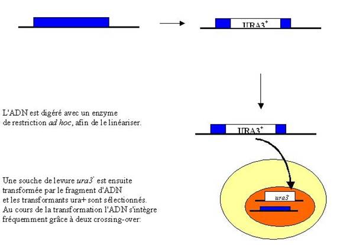
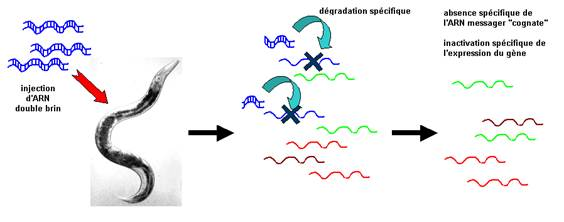
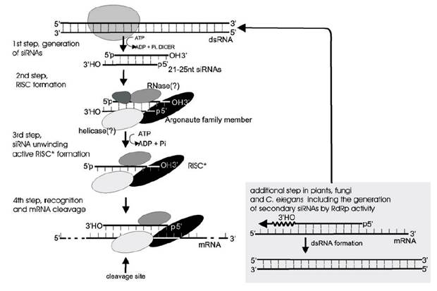

## Le principe de la mutagenèse

La méthodologie génétique est une approche très performante pour étudier le fonctionnement des systèmes biologiques (gènes et protéines, réseaux de gènes et mécanismes pluri-moléculaires, cellulaires ou agissant au niveau de l'organisme).

La démarche suivie consiste dans un premier temps à obtenir des mutants qui ont des défauts dans l'objet ou le processus que l'on étudie. Il faut ensuite caractériser les mutations par les méthodes de la génétique classique. Ensuite, les gènes ainsi identifiés et qui interviennent dans le processus sont clonés par des démarches de génétique moléculaire (clonage positionnel ou par expression fonctionnelle). Leur caractérisation fait appel aux méthodes de la biochimie et biologie moléculaire, de la génétique des interactions et de la génétique inverse. La génétique inverse consiste dans l'obtention in vitro de mutations spécifiques dans un gène et la réintroduction de celui-ci par transformation ou transfection dans un organisme, les effets obtenus sont ensuite analysés:

TODO img

## La mutagenèse classique

La mutagenèse classique permet produire toute une palette de mutations ayant des effets divers sur les gènes allant de leur inactivation jusqu'à leur dérégulation en passant par des modifications du fonctionnement des protéines qu'ils codent. Elle se passe en deux étapes:

- l'application du traitement mutagène 
- la sélection des mutants
 
### L'application du traitement mutagène

Même si celui-ci n'est pas obligatoire, le faible taux des mutations spontanées entraîne dans la grande majorité des cas, l'utilisation obligée d'un traitement mutagène. Ce traitement va dicter en fonction de sa spécificité le type de mutations qui vont être obtenues, je vous renvoie au chapitre 3. De même, le traitement mutagène va moduler le type de clonage qui pourra être effectué par la suite. Actuellement, deux grands types de mutagènes sont utilisés:

- la mutagenèse classique aux UV ou avec des produits chimiques mutagènes.

D'un point de vue de la sécurité, les UV sont préférables en particulier depuis que du matériel facile d'utilisation et parfaitement sécurisé est disponible. Cependant, le spectre des mutations obtenues avec les UV ne permet pas toujours d'obtenir ce que l'on désire. De même, certains organismes sont très résistants aux traitements avec des UV. Les mutagènes chimiques sont alors utilisés. Il existe alors des conditions draconiennes d'utilisation de ces produits qui se fait dans des pièces sécurisées.

Pour que ce traitement soit efficace, il faut que de nombreuses mutations soit produites. Les mutations apparaissant au hasard dans le génome, beaucoup d'entre elles vont toucher des gènes essentiels et donc après le traitement le taux de survie va être fortement diminué. En pratique, il faut donc partir d'un effectif suffisamment grand pour tenir compte de cette létalité. Réciproquement, le taux de survie est une indication de l'efficacité du traitement mutagène. Classiquement, un taux de survie de 1 à 5% est indicatif que le traitement a bien fonctionné et que de nombreuses mutations ont été produites.
 
Les mutations obtenues avec ce type de traitement sont le plus souvent ponctuelles (il est aussi possible d'obtenir avec certains produits des délétions). Elles peuvent inactiver le gène, modifier son fonctionnement voir augmenter son fonctionnement. Ce type de mutagenèse permet donc d'obtenir des mutations qui ont un large éventail d'effets.

- la mutagenèse insertionnelle par transposition ou par transformation (le REMI).
Vous verrez avec Madame Gonzy-Treboul, l'utilisation des transposons pour la mutagenèse. Le REMI se base sur les propriétés de l'intégration de l'ADN exogène introduit dans des cellules après transformation. Il est bien évident que ces évènements d'intégration sont sélectionnés grâce à la présence sur l'ADN introduit d'un marqueur de sélection (gène de résistance à un antibiotique, marqueur d'auxotrophie ...).

Chez la majorité des organismes, l'ADN transformé recombine par un processus de recombinaison non homologue, c'est à dire ne faisant pas appel à la présence de séquence homologues :

Ces morceaux d'ADN en s'insérant vont inactiver ou modifier l'expression de gènes. Le plus souvent le processus d'intégration est complexe et modifie profondément la structure de l'ADN qui s'insère (insertion de plusieurs copies du fragment d'ADN) et celle de l'ADN situé au point de jonction (délétion ou duplication de la séquence d'insertion). Des chercheurs ont constaté chez certains organismes que si l'ADN est préalablement linéarisé par un enzyme de restriction et que l'enzyme de restriction est aussi ajouté dans le mélange de transformation, alors l'intégration se produit proprement (une seule copie de l'ADN est intégrée et l'insertion se fait sans délétion ou duplication à une séquence qui correspond à un site de restriction de l'enzyme utilisé. 

Exemple en utilisant BamHI

Ce type de mutagenèse génère donc des mutants d'insertion qui, le plus souvent, sont des allèles nuls ou ayant une expression modifiée. Le spectre est donc plus réduit que la mutagenèse classique. Mais elle permet de cloner rapidement les gènes ainsi identifiés, car grâce à la PCR, il existe maintenant de techniques efficaces (que vous verrez en Biologie Moléculaire) pour isoler les fragments d'ADN bordant le point d'insertion si on connaît la séquence du plasmide utilisé.

### la sélection des mutants

Le but des expériences de mutagenèse est d'obtenir des mutants qui ont un phénotype voulu afin d'étudier certains processus. Comme ces expériences sont souvent lourdes et dangereuses, il est important de minimiser au maximum l'expérimentation. Ceci passe donc par la mise au point de systèmes astucieux permettant de récupérer les mutants d'intérêt. Il faut donc mettre au point ce que l'on appelle un crible de sélection.

Ce crible de sélection peut permettre de récupérer directement les mutants d'intérêt. Ce sont des cribles de sélection dit positifs.

Exemple

Afin de connaître la cible moléculaire d'un antibiotique, il est possible de rechercher deux types de mutants : des mutants résistants à l'antibiotique ou des mutants encore plus sensibles que les cellules sauvages (mutants hypersensibles).

Pour rechercher les mutants résistants, il existe un crible positif très simple. Il suffit d'étaler les cellules à la sortie du traitement mutagène sur du milieu contenant l'antibiotique. "Tout ce qui pousse" est bon !

Par contre, dans le cas réciproque où l'on recherche des mutants qui sont plus sensibles que la souche de départ il faut impérativement à la sortie du traitement mutagène étaler les cellules sur du milieu sans antibiotique et ensuite repiquer sur du milieu avec antibiotique. Les cellules qui poussent sur le premier milieu mais pas sur le suivant sont les bonnes (on a affaire à un crible de sélection négatif).

Il est évident que ce type de crible est beaucoup plus lourd et consommateur en matériel !

Une fois que les mutants sont obtenus, il faut les analyser génétiquement afin de:

- s'assurer que le phénotype est bien la résultante d'une seule mutation. Pour ceci, il faut analyser la ségrégation des mutations. Pour ceci voir le chapitre 5.

- répartir les mutations dans les différents gènes identifiés. Pour ceci, le généticien dispose de deux outils principaux, la complémentation et la cartographie.

## 3 exemples de sélection de mutants

Pour vous familiariser avec les techniques de mutagenèse, voici 3 exemples;

1- La sélection de mutations de la chaîne respiratoire chez la levure Saccharomyces cerevisiae

La levure Saccharomyces cerevisiae est un aréobe facultatif, c'est à dire qu'elle peut fermenter en absence de source de carbone respirable. Sa croissance peut donc se faire par fermentation en absence d'oxygène ou par la fermentation suivie de la respiration en présence d'oxygène. Il est possible de lui fournir des sources d'énergie non fermentable et donc uniquement utilisable par la respiration (glycérol ou lactate). Ce système est donc idéal pour sélectionner des mutants affectant la respiration et ainsi de décortiquer le système respiratoire. La recherche de mutants incapables de respirer se fait en recherchant après traitement mutagène des souches qui pousse sur un milieu fermentable (milieu contenant du glucose) mais qui ne pousse pas sur milieu uniquement respirable (milieu contenant du glycérol ou du lactate). Ce crible est donc un crible négatif. Il conduit à l'isolement de mutants ayant acquis une mutation soit de l'ADN mitochondrial (mutant rho- ou mit-) ou de l'ADN nucléaire (mutant pet-). D'autres cribles permettent d'obtenir des mutants plus spécifiques :

C'est en utilisant le crible ci-dessus en utilisant du lactate qu'ont été récupérés des mutants dans le gène codant le cytochrome C (qui est un intermédiaire du transport des électrons dans la chaîne respiratoire). En fait, la levure possède 2 gènes qui codent pour le cytochrome C. L'un assure 95% de la production de cytochrome C (iso1) l'autre 5% (iso2). On s'est aperçu par hasard qu'un mutant déficient dans la production iso1 peut respirer en utilisant du glycérol comme source de carbone mais pas du lactate (il est probable que la respiration du glycérol nécessite moins de cytochrome C que celle du lactate et que les 5% iso2 suffisent pour permettre la respiration). Ceci n'est pas le cas de la majorité des mutants affectés dans la chaîne respiratoire. Il est donc possible de récupérer assez spécifiquement des mutants de l'iso1 en sélectionnant par réplique des souches qui respirent sur glycérol mais pas sur lactate. C'est toujours un crible négatif.
Un autre crible disponible est l'utilisation de benzidine qui colore en bleu foncé les hémoprotéines. La coloration est plus sensible aux variations de la quantité de cytochrome C qu'à celles des autres cytochromes. Pour chercher des mutants déficients en cytochrome C, il suffit donc de rechercher des colonies bleu clair parmi les sauvages qui sont bleu foncé. Il s'agit donc là d'un crible positif.

2- La sélection de drosophiles femelle-stériles

L'obtention de mutants de drosophile femelle-stériles permet d'identifier des gènes qui interviennent dans la fabrication des ovocytes. Plusieurs gènes sont probablement impliqués. Certains localisés sur le chromosome X et d'autres sur les autosomes. Nous allons voir un crible qui permet d'identifier des gènes sur le chromosome X. L'utilisation de drosophiles pendant la mutagenèse est délicate. En effet, le traitement mutagène affecte la lignée germinale des mouches traitées et la révélation de l'effet mutagène se fait sur les générations suivantes. Les mouches doivent être traitées individuellement afin de les différencier et d'obtenir des allèles mutants indépendants. De même, la biologie des mouches (où des fécondations multiples se produisent) fait que l'on doit s'assurer dès le départ de l'expérience que les mouches femelles utilisées sont vierges, afin d'obtenir des résultats interprétables ! Dans le cas de mouches stériles, il faut aussi faire des stocks d'entretien facile afin de conserver les mutations (en particulier des mutations de stérilité femelle dominante ne pourront être conservées à l'aide de mouches femelle !). Les généticiens de drosophile ont donc mis au point une armada d'outils pratiques pour effectuer des mutagenèses dans de bonnes conditions.

Le traitement mutagène a été effectué sur des mâles à l'aide de l'EMS (éthyle méthyle sulfonate). Ils portaient un allèle vermillon qui donne une couleur rouge vive aux yeux et qui est facilement détectable. Ces mâles ont ensuite initié la série de croisements suivants :

3- la sélection de mutations qui affectent la régulation par la lumière bleue chez Neurospora crassa

Parfois, le criblage de mutations passe par la construction d'outils appropriés. Examinons plus en détail un exemple très élégant chez Neurospora crassa.

Ce champignon filamenteux présente un rythme circadien de la production de conidies (voir film Rythme circadien de Neurospora). Ce rythme est contrôlé par la lumière dans la zone du spectre qui est bleu. Des gènes régulés par la lumière bleue ont été isolés et deux gènes de régulation ont été identifiés (wc-1 et wc-2). Il semblait aux expérimentateurs que plusieurs gènes de régulation devaient encore être identifiés. Pour ceci le système suivant a été mis au point :

- Le promoteur du gène al-3 qui est régulé par la lumière a été fusionné à la séquence codante du gène mtr. Ce gène code une perméase qui permet l'entrée de certains acides aminés dont le tryptophane et la phénylalanine.

- Une souche mtr- et trp- est transformée avec cette construction. Les transformants obtenus peuvent pousser sur du milieu + tryptophane que si le champignon est éclairé !

Ce système fourni deux cribles de sélection :

- il est possible de cribler des mutants qui poussent sur milieu + tryptophane dans le noir. Ces mutants ont une expression constitutive à partir du promoteur al-3. Avec ce système, il est donc facile d'obtenir des mutations dans des répresseurs de al-3. C'est ainsi qu'a été obtenu le gène ccb-1 qui semble être un répresseur de certains gènes régulés par la lumière.

- Il existe un analogue toxique de la phénylalanine, la p-fluorophenylalanine qui entre dans la cellule via mtr. La croissance des transformants est donc inhibée à la lumière si l'on met de la p-fluorophenylalanine dans le milieu. Ceci donne un deuxième moyen de sélection. Il suffit de sélectionner des mutants qui poussent dans ces conditions. Ceux-ci n'expriment plus mtr à partir du promoteur al-3. Il est de plus possible de faire varier la quantité de p-fluorophenylalanine, ce qui permet d'obtenir des mutants ayant des effets plus ou moins importants. Les cibles des mutations dans ce cas sont donc des activateurs d'al-3. Comme prévu, les gènes wc-1 et wc-2 ont été retrouvés en utilisant ce crible et c'est ainsi qu'ont été identifiés deux nouveaux gènes blr-1 et blr-2. Ces deux gènes ont des effets moins importants que wc-1 et wc-2 qui semblent être les seuls gènes dont les mutations rendent les souches complètement aveugles à la lumière bleue.

Ce système a donc permis de sélectionner des nouveaux gènes qui ont une influence plus subtile sur la régulation par la lumière bleue. 

## La technologie de l'ADN recombinant et la mutagenèse dirigée

Maintenant, il est possible de créer artificiellement in vitro des mutations dans une séquence d'ADN et donc de choisir éventuellement leurs effets. Plusieurs techniques sont disponibles. Nous verrons seulement quelques-unes d'entre elles. La démarche est la suivante:

création de la mutation in vitro

introduction du fragment d'ADN mutant dans la cellule par transformation

criblage des transformants et vérification de la fonctionnalité de l'ADN mutant introduit

La première étape relève de votre cours de biologie moléculaire.

La deuxième étape dépend de l'organisme. A l'heure actuelle, des techniques de transformation sont développées pour la grande majorité des organismes. Plusieurs procédures sont disponibles :

(1) traitement de la paroi qui permet soit de révéler des transporteurs qui assurent l'entrée de l'ADN à l'intérieur de la cellule soit de perturber la membrane cellulaire et de faciliter ainsi l'entrée de l'ADN. Ce sont les techniques utilisées pour les bactéries (traitement au CaCl2 ou DMSO), les levures (Traitement au LiCl ou enzymes lysant la paroi), les champignons (enzymes lysant la paroi) ou les cellules en cultures (phosphate de calcium).

(2) traitement plus direct tel que l'injection à l'aide d'une aiguille (œuf de vertébrés, drosophile, C. elegans) ou par tir de billes recouvertes de l'ADN à l'aide d'un canon à ADN (plantes, mitochondries de levure).

(3) utilisation de systèmes d'introduction spécifiques tels que l'emploi d'Agrobacterium chez les plantes (cette bactérie contient un plasmide, le plasmide T-DNA qui est injecté dans les cellules de plantes où il s'intègre au génome. Evidemment, tout fragment d'ADN cloné dans ce plasmide sera co-intégré).
La troisième étape peut se faire de multiples manières en fonction de la modification voulue, utilisation de la PCR ou du Southern blot pour vérifier la structure de l'ADN introduit, Northern Blot et Western blot pour mesurer l'expression, etc.

## Comment sur-exprimer un gène

On connaît deux méthodes pour sur-exprimer un gène.

(1) il est possible d'introduire par transformation plusieurs copies du gène. La méthode la plus sure est de le mettre sur un plasmide multicopie mais ceci n'est possible que chez le nombre limité d'organismes où l'on dispose d'un tel outil (bactérie, levure). La seconde méthode consiste à transformer les cellules avec des quantités importantes d'ADN. Chez certains organismes comme C. elegans, cela aboutit à l'intégration en tandem de plusieurs copies de cet ADN permettant ainsi en théorie la sur-expression. Je vous rappelle cependant qu'il n'y a pas toujours de relation entre le nombre de copie et l'expression à cause de processus de régulation et qu'en particulier chez certains organismes, on constate une inactivation des gènes en plusieurs exemplaires par méthylation ou PTGS.

(2) s'il s'agit d'un gène codant pour une protéine, il est possible de cloner la séquence codante du gène dans une cassette d'expression forte.

Cette cassette est constituée d'un fragment d'ADN comprenant un promoteur fort (provenant d'un gène dont le produit intervient dans la glycolyse, gène d'actine ou du facteur d'élongation de la traduction eEF1A) et d'un fragment d'ADN provenant d'une région terminateur de gène.

Pour ce genre d'expérience, il n'est pas nécessaire d'inactiver le(s) gène(s) déjà présents. Pour s'assurer de la sur-expression du produit, il faut regarder le niveau d'expression de la protéine dans des extraits de protéines totales (il est par exemple possible de révéler dans certains cas par un traitement immunologique). Ce type d'expérience permet d'apporter des éléments sur la fonctionnalité de la protéine.

exemple:
Chez C. elegans, il existe deux types de vers qui ont un comportement soit solitaire soit grégaire. La différence est liée à la présence dans les populations d'un gène polymorphe présentant deux allèles. Ce gène npr-1 code pour un produit qui ressemble à un récepteur de neuropeptides. L'allèle solitaire est dominant sur l'allèle grégaire. L'analyse moléculaire des deux allèles montre qu'ils sont tous les deux fonctionnels. L'hypothèse faite est donc que le produit de l'allèle grégaire fonctionne moins bien que celui de l'allèle solitaire. Pour tester ceci, des œufs de la souche grégaire ont été injectés par différentes quantités d'ADN contenant les allèles grégaires ou solitaires. Alors qu'avec l'allèle solitaire toutes les quantités testées donnent des souches transformées avec un comportement solitaire, dans le cas de l'allèle grégaire les seules les souches issues du traitement avec la quantité la plus importante ont un comportement solitaire. Cela montre qu'effectivement l'allèle grégaire code probablement pour une protéine moins fonctionnelle que celle codée par l'allèle solitaire.
 
## Comment inactiver un gène

Actuellement, il existe de nombreuses techniques pour inactiver des gènes et ainsi obtenir des allèles nuls. La technologie utilisée dépend de l'organisme et de ses propriétés biologiques.

Nous prendrons deux exemples, la levure car c'est l'organisme pour lequel cette inactivation de gène est la plus simple et Caenorhabditis elegans pour lequel il existe un phénomène d'extinction épigénétique, le RNAi.

- La levure

La première étape consiste dans le remplacement in vitro de tout ou partie du gène porté par un plasmide bactérien par un marqueur de sélection (prenons par exemple URA3+). Ceci se fait par les méthodes de l'ADN recombinant.

Notez que pour plus de clarté, le dessin est schématisé en utilisant une souche haploïde. Cependant, l'inactivation d'un gène peut être létale ou inhiber sévèrement la croissance des souches. Dans ces conditions, il est impossible de récupérer la souche ayant le gène inactivé. Il faut donc en fait partir d'une souche diploïde homozygote pour ura3-. Après transformation avec l'ADN linéarisé, une seule des deux copies est inactivée. On récupère une souche qui a le génotype suivant :

mata
D/ URA3+
ura3-
mata
+
ura3-
D/ URA3+ indique l'allèle inactivé et + l'allèle sauvage du gène.

Il faut ensuite faire sporuler le diploïde. On obtient ainsi en théorie: deux spores {D/ URA3+, ura3-}qui sont prototrophes pour l'uracile et deux spores {+, ura3-} qui sont auxotrophes pour l'uracile. La présence de spore ura+ dans la descendance montre que le gène est non-essentiel !

- Caenorhabditis elegans

Chez cet organisme, comme chez une vaste majorité des eucaryotes (des phénomènes identiques ont été observés chez les vertébrés, les plantes, certains champignons, et des protistes divers !), il a été récemment observé que l'injection d'ARN doubles brins correspondant à un gène aboutit à l'extinction de l'expression de ce gène ! Ce phénomène est systémique, c'est à dire que l'injection dans quelques cellules permet l'extinction du gène dans l'ensemble des cellules ! (il est possible pour procéder de nourrir les vers avec des bactéries produisant les ARN doubles brins, cela entraîne l'extinction !). Cette extinction peut même se transmettre sur une ou deux générations (il devient alors un phénomène épigénétique) ! On parle pour ce mécanisme de RNAi pour RNA interferences.

Des études sont menées actuellement pour élucider les mécanismes mis en jeu. Ce que l'on sait, c'est qu'à la suite de l'injection les ARN doubles brins sont retrouvés sous forme de petits morceaux d'une vingtaine de paires de bases qui semblent activer une RNAse. Celle-ci gagne sa spécificité probablement grâce aux ARN. Il existe certainement un mécanisme d'amplification du nombre de ces petits ARN. En particulier, une RNA polymérase RNA-dépendante est essentielle pour que ce processus agisse. Voici le modèle actuel :

Notez que certains transgènes introduits peuvent produire des ARN aberrants qui vont provoquer le RNAi. Ceci est étudié principalement chez les plantes. On parle alors de PTGS.

